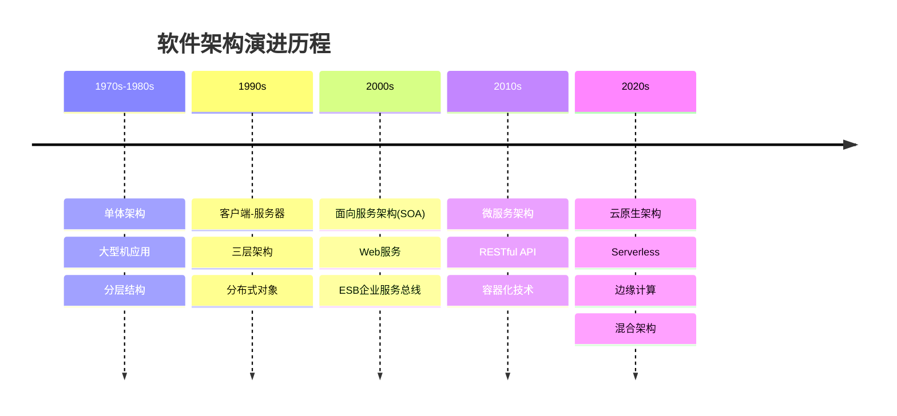
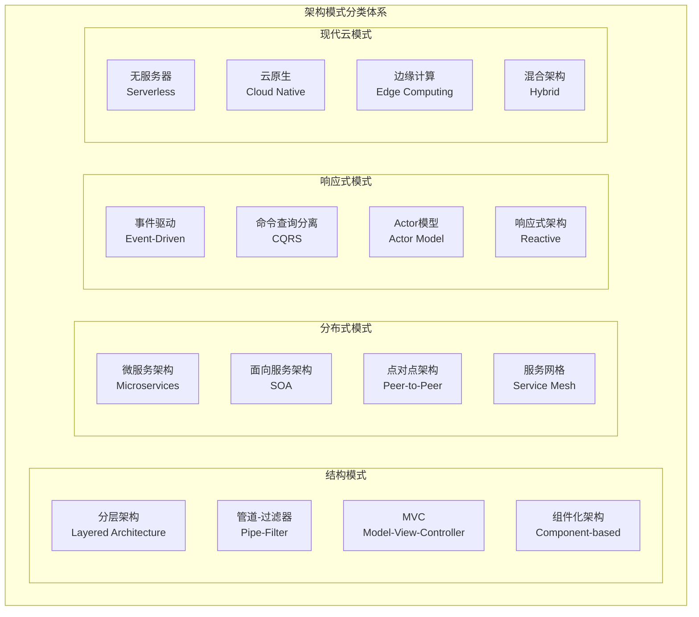
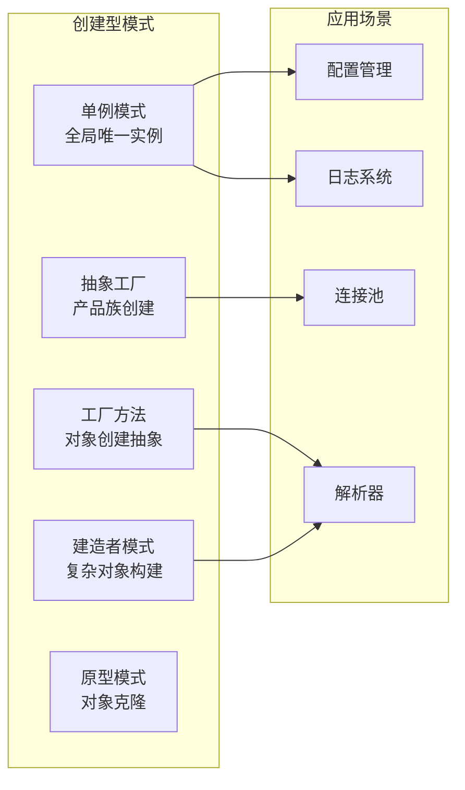
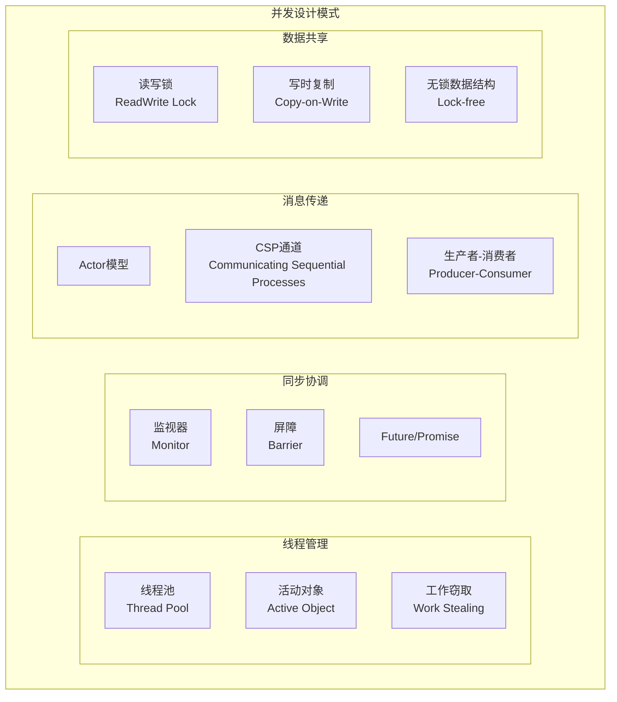
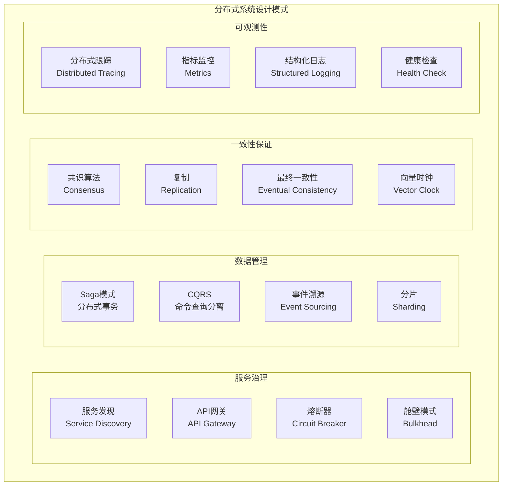
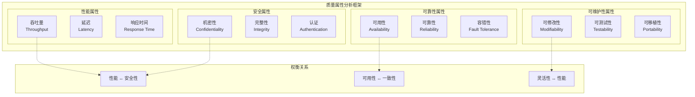
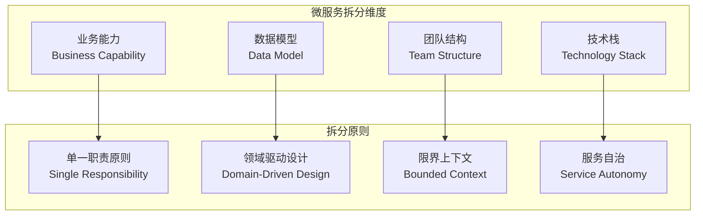
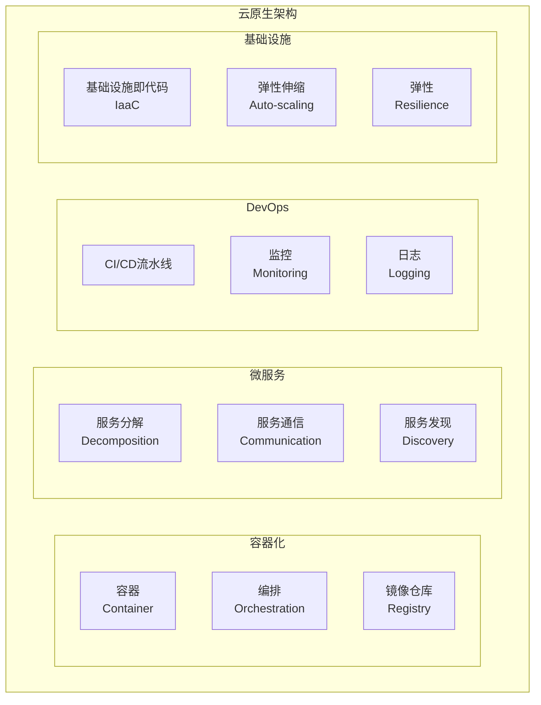
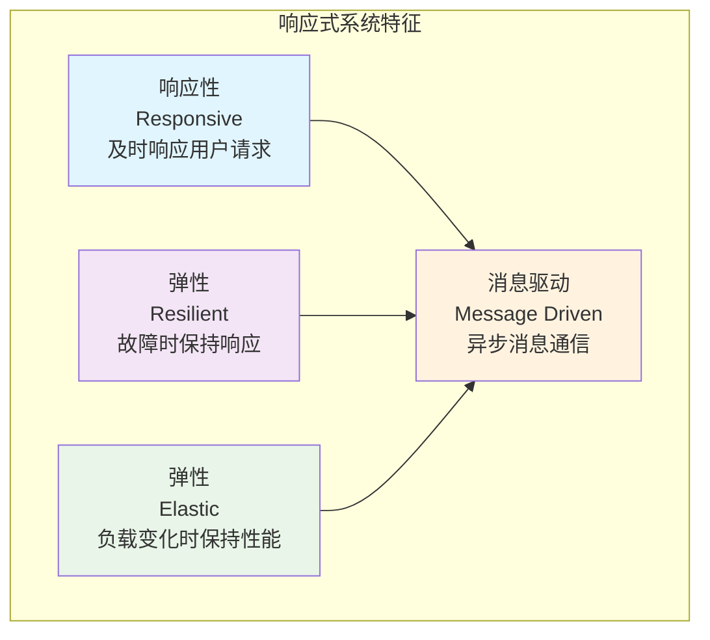
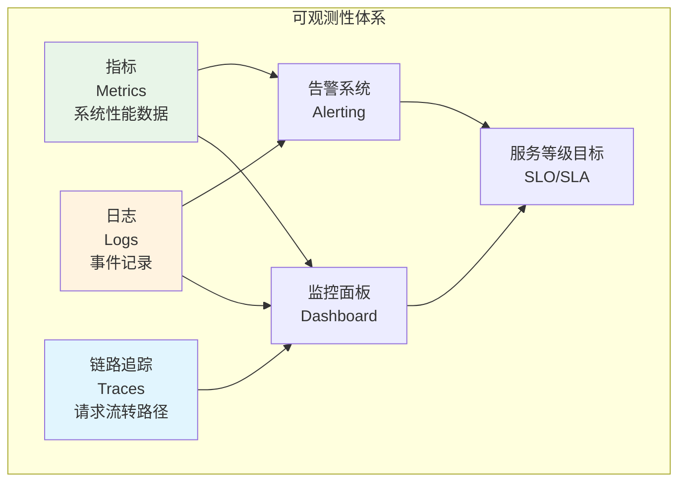

# 5.1 架构设计与形式化分析

[返回上级](../5-架构与设计模式.md) | [English Version](../5-architecture-and-design-patterns/5.1-architecture-design-and-formal-analysis.md)

## 目录

- [5.1 架构设计与形式化分析](#51-架构设计与形式化分析)
  - [目录](#目录)
  - [5.1.1 软件架构设计全景分析](#511-软件架构设计全景分析)
    - [5.1.1.1 架构演进历程](#5111-架构演进历程)
    - [5.1.1.2 现代架构模式分类](#5112-现代架构模式分类)
    - [5.1.1.3 架构决策框架](#5113-架构决策框架)
  - [5.1.2 设计模式体系分析](#512-设计模式体系分析)
    - [5.1.2.1 经典GoF模式](#5121-经典gof模式)
    - [5.1.2.2 并发并行模式](#5122-并发并行模式)
    - [5.1.2.3 分布式系统模式](#5123-分布式系统模式)
  - [5.1.3 形式化架构建模](#513-形式化架构建模)
    - [5.1.3.1 架构描述语言](#5131-架构描述语言)
    - [5.1.3.2 架构验证方法](#5132-架构验证方法)
    - [5.1.3.3 质量属性分析](#5133-质量属性分析)
  - [5.1.4 现代架构设计实践](#514-现代架构设计实践)
    - [5.1.4.1 微服务架构设计](#5141-微服务架构设计)
    - [5.1.4.2 事件驱动架构](#5142-事件驱动架构)
    - [5.1.4.3 云原生架构](#5143-云原生架构)
    - [5.1.4.4 分布式架构模式深入分析](#5144-分布式架构模式深入分析)
    - [5.1.4.5 响应式架构与弹性设计](#5145-响应式架构与弹性设计)
  - [5.1.5 架构评估与演进](#515-架构评估与演进)
    - [5.1.5.1 架构质量评估框架](#5151-架构质量评估框架)
    - [5.1.5.2 可观测性架构设计](#5152-可观测性架构设计)
  - [交叉引用](#交叉引用)
    - [相关主题](#相关主题)
    - [本地导航](#本地导航)
    - [参考文献](#参考文献)
      - [权威文献](#权威文献)
      - [在线资源](#在线资源)
      - [延伸阅读](#延伸阅读)

---

## 5.1.1 软件架构设计全景分析

### 5.1.1.1 架构演进历程



### 5.1.1.2 现代架构模式分类



### 5.1.1.3 架构决策框架

**架构决策模型**:

\[
AD = \langle C, QA, P, T, E \rangle
\]

其中：

- \(C\)：上下文约束(Context)
- \(QA\)：质量属性(Quality Attributes)  
- \(P\)：架构模式(Patterns)
- \(T\)：技术选择(Technology)
- \(E\)：演进策略(Evolution)

```lean
-- Lean 形式化：架构决策
structure ArchitecturalDecision :=
  (context : List Constraint)
  (quality_attributes : List QualityAttribute)
  (patterns : List ArchitecturalPattern)
  (technology_stack : TechnologyStack)
  (evolution_strategy : EvolutionPlan)

def is_valid_decision (ad : ArchitecturalDecision) : Prop :=
  ∀ qa ∈ ad.quality_attributes, 
    ∃ p ∈ ad.patterns, supports_quality qa p ∧
    ∃ t ∈ ad.technology_stack.components, implements_pattern p t
```

## 5.1.2 设计模式体系分析

### 5.1.2.1 经典GoF模式

**创建型模式架构**:



**Rust实现示例**:

```rust
// 单例模式 - 使用 once_cell
use once_cell::sync::Lazy;
use std::sync::Mutex;

static GLOBAL_CONFIG: Lazy<Mutex<Config>> = Lazy::new(|| {
    Mutex::new(Config::load_default())
});

#[derive(Debug, Clone)]
pub struct Config {
    pub database_url: String,
    pub api_key: String,
    pub max_connections: u32,
}

impl Config {
    fn load_default() -> Self {
        Config {
            database_url: "localhost:5432".to_string(),
            api_key: "default_key".to_string(),
            max_connections: 10,
        }
    }
    
    pub fn instance() -> &'static Mutex<Config> {
        &GLOBAL_CONFIG
    }
}

// 工厂方法模式
pub trait MessageProcessor {
    fn process(&self, message: &str) -> Result<String, ProcessError>;
}

pub struct JsonProcessor;
pub struct XmlProcessor;

impl MessageProcessor for JsonProcessor {
    fn process(&self, message: &str) -> Result<String, ProcessError> {
        // JSON处理逻辑
        Ok(format!("Processed JSON: {}", message))
    }
}

impl MessageProcessor for XmlProcessor {
    fn process(&self, message: &str) -> Result<String, ProcessError> {
        // XML处理逻辑
        Ok(format!("Processed XML: {}", message))
    }
}

pub enum MessageFormat {
    Json,
    Xml,
}

pub struct ProcessorFactory;

impl ProcessorFactory {
    pub fn create_processor(format: MessageFormat) -> Box<dyn MessageProcessor> {
        match format {
            MessageFormat::Json => Box::new(JsonProcessor),
            MessageFormat::Xml => Box::new(XmlProcessor),
        }
    }
}
```

### 5.1.2.2 并发并行模式

**并发模式分类**:



**Rust并发模式实现**:

```rust
// Actor模式实现
use tokio::sync::mpsc;
use std::collections::HashMap;

#[derive(Debug)]
pub enum ActorMessage {
    Get { key: String, response: oneshot::Sender<Option<String>> },
    Set { key: String, value: String },
    Delete { key: String },
}

pub struct StorageActor {
    receiver: mpsc::Receiver<ActorMessage>,
    storage: HashMap<String, String>,
}

impl StorageActor {
    pub fn new(receiver: mpsc::Receiver<ActorMessage>) -> Self {
        StorageActor {
            receiver,
            storage: HashMap::new(),
        }
    }
    
    pub async fn run(mut self) {
        while let Some(msg) = self.receiver.recv().await {
            match msg {
                ActorMessage::Get { key, response } => {
                    let value = self.storage.get(&key).cloned();
                    let _ = response.send(value);
                }
                ActorMessage::Set { key, value } => {
                    self.storage.insert(key, value);
                }
                ActorMessage::Delete { key } => {
                    self.storage.remove(&key);
                }
            }
        }
    }
}

// 使用示例
pub struct StorageHandle {
    sender: mpsc::Sender<ActorMessage>,
}

impl StorageHandle {
    pub fn new() -> Self {
        let (sender, receiver) = mpsc::channel(100);
        let actor = StorageActor::new(receiver);
        tokio::spawn(actor.run());
        
        StorageHandle { sender }
    }
    
    pub async fn get(&self, key: String) -> Option<String> {
        let (response_tx, response_rx) = oneshot::channel();
        let msg = ActorMessage::Get { key, response: response_tx };
        
        if self.sender.send(msg).await.is_ok() {
            response_rx.await.unwrap_or(None)
        } else {
            None
        }
    }
}
```

### 5.1.2.3 分布式系统模式

**分布式架构模式**:



## 5.1.3 形式化架构建模

### 5.1.3.1 架构描述语言

**架构形式化表示**:

\[
\text{Architecture} = \langle C, Con, P, \rho \rangle
\]

其中：

- \(C\)：组件集合(Components)
- \(Con\)：连接器集合(Connectors)
- \(P\)：端口集合(Ports)
- \(\rho\)：拓扑关系(Topology)

```lean
-- Lean 形式化：软件架构
structure SoftwareArchitecture :=
  (components : Finset Component)
  (connectors : Finset Connector)
  (ports : Finset Port)
  (topology : Component → Component → Prop)

structure Component :=
  (id : String)
  (interfaces : List Interface)
  (behavior : ComponentBehavior)
  (properties : List Property)

structure Connector :=
  (id : String)
  (roles : List Role)
  (protocol : CommunicationProtocol)
  (properties : List Property)

-- 架构约束
def well_formed_architecture (arch : SoftwareArchitecture) : Prop :=
  ∀ c ∈ arch.components, 
    ∀ i ∈ c.interfaces,
      ∃ conn ∈ arch.connectors, connects_interface conn i
```

### 5.1.3.2 架构验证方法

**架构一致性验证**:

```rust
// 架构验证框架
use std::collections::{HashMap, HashSet};

#[derive(Debug, Clone)]
pub struct ArchitecturalModel {
    pub components: HashMap<ComponentId, Component>,
    pub connectors: HashMap<ConnectorId, Connector>,
    pub constraints: Vec<ArchitecturalConstraint>,
}

#[derive(Debug, Clone)]
pub struct Component {
    pub id: ComponentId,
    pub component_type: ComponentType,
    pub interfaces: Vec<Interface>,
    pub dependencies: Vec<ComponentId>,
}

#[derive(Debug, Clone)]
pub enum ArchitecturalConstraint {
    LayeringConstraint {
        higher_layer: LayerId,
        lower_layer: LayerId,
    },
    CyclicDependencyProhibited,
    InterfaceCompatibility {
        provider: InterfaceId,
        consumer: InterfaceId,
    },
}

impl ArchitecturalModel {
    pub fn validate(&self) -> ArchitecturalValidationResult {
        let mut violations = Vec::new();
        
        for constraint in &self.constraints {
            match constraint {
                ArchitecturalConstraint::LayeringConstraint { higher_layer, lower_layer } => {
                    if let Some(violation) = self.check_layering_violation(*higher_layer, *lower_layer) {
                        violations.push(violation);
                    }
                }
                ArchitecturalConstraint::CyclicDependencyProhibited => {
                    if let Some(cycle) = self.detect_dependency_cycle() {
                        violations.push(ArchitecturalViolation::CyclicDependency(cycle));
                    }
                }
                ArchitecturalConstraint::InterfaceCompatibility { provider, consumer } => {
                    if let Some(violation) = self.check_interface_compatibility(*provider, *consumer) {
                        violations.push(violation);
                    }
                }
            }
        }
        
        ArchitecturalValidationResult {
            is_valid: violations.is_empty(),
            violations,
        }
    }
    
    fn detect_dependency_cycle(&self) -> Option<Vec<ComponentId>> {
        let mut visited = HashSet::new();
        let mut recursion_stack = HashSet::new();
        
        for component_id in self.components.keys() {
            if !visited.contains(component_id) {
                if let Some(cycle) = self.dfs_cycle_detection(
                    *component_id,
                    &mut visited,
                    &mut recursion_stack,
                    &mut Vec::new()
                ) {
                    return Some(cycle);
                }
            }
        }
        None
    }
}
```

### 5.1.3.3 质量属性分析

**质量属性权衡分析**:



## 5.1.4 现代架构设计实践

### 5.1.4.1 微服务架构设计

**微服务拆分策略**:



### 5.1.4.2 事件驱动架构

**事件驱动架构模式**:

```rust
// 事件驱动架构实现
use async_trait::async_trait;
use serde::{Deserialize, Serialize};
use std::collections::HashMap;
use tokio::sync::broadcast;

#[derive(Debug, Clone, Serialize, Deserialize)]
pub struct DomainEvent {
    pub event_id: String,
    pub event_type: String,
    pub aggregate_id: String,
    pub version: u64,
    pub timestamp: chrono::DateTime<chrono::Utc>,
    pub data: serde_json::Value,
}

#[async_trait]
pub trait EventHandler: Send + Sync {
    async fn handle(&self, event: &DomainEvent) -> Result<(), EventHandlingError>;
    fn event_types(&self) -> Vec<String>;
}

pub struct EventBus {
    handlers: HashMap<String, Vec<Box<dyn EventHandler>>>,
    sender: broadcast::Sender<DomainEvent>,
}

impl EventBus {
    pub fn new() -> Self {
        let (sender, _) = broadcast::channel(1000);
        EventBus {
            handlers: HashMap::new(),
            sender,
        }
    }
    
    pub fn register_handler(&mut self, handler: Box<dyn EventHandler>) {
        for event_type in handler.event_types() {
            self.handlers
                .entry(event_type)
                .or_insert_with(Vec::new)
                .push(handler.clone());
        }
    }
    
    pub async fn publish(&self, event: DomainEvent) -> Result<(), EventPublishError> {
        // 发布到广播通道
        self.sender.send(event.clone()).map_err(|_| EventPublishError::ChannelError)?;
        
        // 同步处理注册的处理器
        if let Some(handlers) = self.handlers.get(&event.event_type) {
            for handler in handlers {
                if let Err(e) = handler.handle(&event).await {
                    eprintln!("事件处理失败: {:?}", e);
                }
            }
        }
        
        Ok(())
    }
    
    pub fn subscribe(&self) -> broadcast::Receiver<DomainEvent> {
        self.sender.subscribe()
    }
}
```

### 5.1.4.3 云原生架构

**云原生架构要素**:



### 5.1.4.4 分布式架构模式深入分析

**分布式系统CAP定理在架构设计中的应用**:

```lean
-- CAP定理的形式化表示
inductive SystemProperty
| Consistency : SystemProperty
| Availability : SystemProperty  
| PartitionTolerance : SystemProperty

theorem cap_theorem (system : DistributedSystem) :
  ¬(achieves system Consistency ∧ 
    achieves system Availability ∧ 
    achieves system PartitionTolerance) :=
sorry

-- 架构权衡决策
def architecture_tradeoff (requirements : List SystemProperty) : ArchitecturalChoice :=
  match requirements with
  | [Consistency, Availability] => CPArchitecture  -- 如RDBMS
  | [Consistency, PartitionTolerance] => CPArchitecture  -- 如MongoDB
  | [Availability, PartitionTolerance] => APArchitecture  -- 如DNS, Cassandra
  | _ => HybridArchitecture
```

**现代分布式架构模式实现**:

```rust
// SAGA模式：分布式事务管理
use async_trait::async_trait;
use serde::{Deserialize, Serialize};
use std::collections::HashMap;
use uuid::Uuid;

#[derive(Debug, Clone, Serialize, Deserialize)]
pub struct SagaStep {
    pub step_id: String,
    pub service_name: String,
    pub action: String,
    pub compensation: Option<String>,
    pub timeout: std::time::Duration,
}

#[derive(Debug, Clone)]
pub enum SagaExecutionResult {
    Success(serde_json::Value),
    Failure(String),
    Timeout,
}

#[async_trait]
pub trait SagaParticipant: Send + Sync {
    async fn execute(&self, input: serde_json::Value) -> Result<serde_json::Value, String>;
    async fn compensate(&self, input: serde_json::Value) -> Result<(), String>;
}

pub struct SagaOrchestrator {
    participants: HashMap<String, Box<dyn SagaParticipant>>,
    execution_log: Vec<(String, serde_json::Value)>,
}

impl SagaOrchestrator {
    pub fn new() -> Self {
        SagaOrchestrator {
            participants: HashMap::new(),
            execution_log: Vec::new(),
        }
    }
    
    pub fn register_participant(&mut self, name: String, participant: Box<dyn SagaParticipant>) {
        self.participants.insert(name, participant);
    }
    
    pub async fn execute_saga(&mut self, steps: Vec<SagaStep>, input: serde_json::Value) 
        -> Result<serde_json::Value, String> {
        let mut current_input = input;
        let mut completed_steps = Vec::new();
        
        for step in steps {
            match self.execute_step(&step, current_input.clone()).await {
                Ok(result) => {
                    completed_steps.push((step.clone(), current_input.clone()));
                    current_input = result;
                }
                Err(error) => {
                    // 执行补偿操作
                    self.compensate_completed_steps(completed_steps).await;
                    return Err(format!("Saga失败在步骤 {}: {}", step.step_id, error));
                }
            }
        }
        
        Ok(current_input)
    }
    
    async fn execute_step(&self, step: &SagaStep, input: serde_json::Value) 
        -> Result<serde_json::Value, String> {
        if let Some(participant) = self.participants.get(&step.service_name) {
            tokio::time::timeout(step.timeout, participant.execute(input))
                .await
                .map_err(|_| "超时".to_string())?
        } else {
            Err(format!("未找到服务: {}", step.service_name))
        }
    }
    
    async fn compensate_completed_steps(&self, steps: Vec<(SagaStep, serde_json::Value)>) {
        // 按相反顺序执行补偿
        for (step, input) in steps.into_iter().rev() {
            if let Some(participant) = self.participants.get(&step.service_name) {
                if let Err(e) = participant.compensate(input).await {
                    eprintln!("补偿失败 {}: {}", step.step_id, e);
                }
            }
        }
    }
}

// 事件溯源模式
#[derive(Debug, Clone, Serialize, Deserialize)]
pub struct Event {
    pub event_id: Uuid,
    pub aggregate_id: String,
    pub event_type: String,
    pub event_data: serde_json::Value,
    pub version: u64,
    pub timestamp: chrono::DateTime<chrono::Utc>,
}

pub trait Aggregate: Clone + Send + Sync {
    type Event: Clone + Send + Sync;
    
    fn apply_event(&mut self, event: &Self::Event);
    fn handle_command(&self, command: &dyn Command) -> Result<Vec<Self::Event>, String>;
}

pub trait Command: Send + Sync {
    fn aggregate_id(&self) -> &str;
    fn command_type(&self) -> &str;
}

pub struct EventStore {
    events: HashMap<String, Vec<Event>>,
}

impl EventStore {
    pub fn new() -> Self {
        EventStore {
            events: HashMap::new(),
        }
    }
    
    pub fn append_events(&mut self, aggregate_id: &str, events: Vec<Event>) -> Result<(), String> {
        let event_list = self.events.entry(aggregate_id.to_string()).or_insert_with(Vec::new);
        
        // 检查版本连续性
        let expected_version = event_list.len() as u64;
        if let Some(first_event) = events.first() {
            if first_event.version != expected_version + 1 {
                return Err(format!(
                    "版本冲突: 期望 {}, 实际 {}", 
                    expected_version + 1, 
                    first_event.version
                ));
            }
        }
        
        event_list.extend(events);
        Ok(())
    }
    
    pub fn get_events(&self, aggregate_id: &str, from_version: Option<u64>) -> Vec<Event> {
        if let Some(events) = self.events.get(aggregate_id) {
            match from_version {
                Some(version) => events.iter()
                    .filter(|e| e.version > version)
                    .cloned()
                    .collect(),
                None => events.clone(),
            }
        } else {
            Vec::new()
        }
    }
    
    pub fn rebuild_aggregate<T: Aggregate>(&self, aggregate_id: &str, mut initial_state: T) -> T 
    where
        T::Event: for<'de> Deserialize<'de>,
    {
        let events = self.get_events(aggregate_id, None);
        
        for event in events {
            if let Ok(typed_event) = serde_json::from_value(event.event_data) {
                initial_state.apply_event(&typed_event);
            }
        }
        
        initial_state
    }
}
```

### 5.1.4.5 响应式架构与弹性设计

**响应式系统四大支柱**:



**断路器模式实现**:

```rust
use std::sync::atomic::{AtomicU64, AtomicUsize, Ordering};
use std::sync::Arc;
use std::time::{Duration, Instant};
use tokio::sync::RwLock;

#[derive(Debug, Clone, Copy, PartialEq)]
pub enum CircuitBreakerState {
    Closed,    // 正常状态
    Open,      // 断路状态
    HalfOpen,  // 半开状态
}

pub struct CircuitBreakerConfig {
    pub failure_threshold: u64,
    pub recovery_timeout: Duration,
    pub request_timeout: Duration,
    pub success_threshold: u64,  // 半开状态需要的成功次数
}

pub struct CircuitBreaker {
    state: Arc<RwLock<CircuitBreakerState>>,
    failure_count: AtomicU64,
    success_count: AtomicU64,
    last_failure_time: Arc<RwLock<Option<Instant>>>,
    config: CircuitBreakerConfig,
}

impl CircuitBreaker {
    pub fn new(config: CircuitBreakerConfig) -> Self {
        CircuitBreaker {
            state: Arc::new(RwLock::new(CircuitBreakerState::Closed)),
            failure_count: AtomicU64::new(0),
            success_count: AtomicU64::new(0),
            last_failure_time: Arc::new(RwLock::new(None)),
            config,
        }
    }
    
    pub async fn call<F, T, E>(&self, operation: F) -> Result<T, CircuitBreakerError<E>>
    where
        F: std::future::Future<Output = Result<T, E>>,
    {
        // 检查断路器状态
        match self.should_allow_request().await {
            false => return Err(CircuitBreakerError::CircuitOpen),
            true => {}
        }
        
        // 执行操作
        let start_time = Instant::now();
        match tokio::time::timeout(self.config.request_timeout, operation).await {
            Ok(Ok(result)) => {
                self.on_success().await;
                Ok(result)
            }
            Ok(Err(error)) => {
                self.on_failure().await;
                Err(CircuitBreakerError::OperationFailed(error))
            }
            Err(_) => {
                self.on_failure().await;
                Err(CircuitBreakerError::Timeout)
            }
        }
    }
    
    async fn should_allow_request(&self) -> bool {
        let state = *self.state.read().await;
        
        match state {
            CircuitBreakerState::Closed => true,
            CircuitBreakerState::Open => {
                // 检查是否可以转为半开状态
                if let Some(last_failure) = *self.last_failure_time.read().await {
                    if Instant::now().duration_since(last_failure) > self.config.recovery_timeout {
                        let mut state_guard = self.state.write().await;
                        *state_guard = CircuitBreakerState::HalfOpen;
                        self.success_count.store(0, Ordering::Relaxed);
                        true
                    } else {
                        false
                    }
                } else {
                    false
                }
            }
            CircuitBreakerState::HalfOpen => true,
        }
    }
    
    async fn on_success(&self) {
        let state = *self.state.read().await;
        
        match state {
            CircuitBreakerState::Closed => {
                self.failure_count.store(0, Ordering::Relaxed);
            }
            CircuitBreakerState::HalfOpen => {
                let success_count = self.success_count.fetch_add(1, Ordering::Relaxed) + 1;
                if success_count >= self.config.success_threshold {
                    let mut state_guard = self.state.write().await;
                    *state_guard = CircuitBreakerState::Closed;
                    self.failure_count.store(0, Ordering::Relaxed);
                    self.success_count.store(0, Ordering::Relaxed);
                }
            }
            CircuitBreakerState::Open => {
                // 在断开状态下不应该有成功调用
            }
        }
    }
    
    async fn on_failure(&self) {
        let failure_count = self.failure_count.fetch_add(1, Ordering::Relaxed) + 1;
        
        if failure_count >= self.config.failure_threshold {
            let mut state_guard = self.state.write().await;
            *state_guard = CircuitBreakerState::Open;
            
            let mut last_failure_guard = self.last_failure_time.write().await;
            *last_failure_guard = Some(Instant::now());
        }
    }
    
    pub async fn get_state(&self) -> CircuitBreakerState {
        *self.state.read().await
    }
    
    pub fn get_metrics(&self) -> CircuitBreakerMetrics {
        CircuitBreakerMetrics {
            failure_count: self.failure_count.load(Ordering::Relaxed),
            success_count: self.success_count.load(Ordering::Relaxed),
        }
    }
}

#[derive(Debug)]
pub enum CircuitBreakerError<E> {
    CircuitOpen,
    Timeout,
    OperationFailed(E),
}

#[derive(Debug)]
pub struct CircuitBreakerMetrics {
    pub failure_count: u64,
    pub success_count: u64,
}
```

## 5.1.5 架构评估与演进

### 5.1.5.1 架构质量评估框架

**质量属性可达性矩阵**:

\[
QAM = \begin{pmatrix}
s_{11} & s_{12} & \cdots & s_{1n} \\
s_{21} & s_{22} & \cdots & s_{2n} \\
\vdots & \vdots & \ddots & \vdots \\
s_{m1} & s_{m2} & \cdots & s_{mn}
\end{pmatrix}
\]

其中 \(s_{ij}\) 表示架构决策 \(i\) 对质量属性 \(j\) 的支持程度。

```rust
// 架构质量评估系统
use std::collections::HashMap;
use serde::{Deserialize, Serialize};

#[derive(Debug, Clone, Serialize, Deserialize)]
pub enum QualityAttribute {
    Performance { response_time_ms: u64, throughput_rps: u64 },
    Reliability { availability_percent: f64, mtbf_hours: f64 },
    Security { encryption_level: String, auth_mechanisms: Vec<String> },
    Maintainability { code_coverage: f64, cyclomatic_complexity: f64 },
    Scalability { max_users: u64, horizontal_scaling: bool },
    Usability { user_satisfaction: f64, task_completion_rate: f64 },
}

#[derive(Debug, Clone)]
pub struct ArchitecturalDecision {
    pub id: String,
    pub title: String,
    pub description: String,
    pub quality_impact: HashMap<String, f64>,  // 质量属性ID -> 影响分数(-1.0 到 1.0)
    pub trade_offs: Vec<TradeOff>,
    pub implementation_cost: Cost,
}

#[derive(Debug, Clone)]
pub struct TradeOff {
    pub description: String,
    pub positive_aspects: Vec<String>,
    pub negative_aspects: Vec<String>,
    pub mitigation_strategies: Vec<String>,
}

#[derive(Debug, Clone)]
pub struct Cost {
    pub development_effort_hours: u64,
    pub maintenance_effort_hours_per_year: u64,
    pub infrastructure_cost_per_month: f64,
    pub training_cost: f64,
}

pub struct ArchitectureEvaluator {
    quality_attributes: HashMap<String, QualityAttribute>,
    decisions: Vec<ArchitecturalDecision>,
    weights: HashMap<String, f64>,  // 质量属性权重
}

impl ArchitectureEvaluator {
    pub fn new() -> Self {
        ArchitectureEvaluator {
            quality_attributes: HashMap::new(),
            decisions: Vec::new(),
            weights: HashMap::new(),
        }
    }
    
    pub fn add_quality_attribute(&mut self, id: String, attribute: QualityAttribute) {
        self.quality_attributes.insert(id, attribute);
    }
    
    pub fn set_quality_weight(&mut self, attribute_id: String, weight: f64) {
        self.weights.insert(attribute_id, weight);
    }
    
    pub fn add_decision(&mut self, decision: ArchitecturalDecision) {
        self.decisions.push(decision);
    }
    
    pub fn evaluate_architecture(&self) -> ArchitectureEvaluationResult {
        let mut total_score = 0.0;
        let mut quality_scores = HashMap::new();
        let mut total_cost = Cost {
            development_effort_hours: 0,
            maintenance_effort_hours_per_year: 0,
            infrastructure_cost_per_month: 0.0,
            training_cost: 0.0,
        };
        
        // 计算每个质量属性的总分
        for (qa_id, _qa) in &self.quality_attributes {
            let mut qa_score = 0.0;
            let mut decision_count = 0;
            
            for decision in &self.decisions {
                if let Some(impact) = decision.quality_impact.get(qa_id) {
                    qa_score += impact;
                    decision_count += 1;
                }
                
                // 累计成本
                total_cost.development_effort_hours += decision.implementation_cost.development_effort_hours;
                total_cost.maintenance_effort_hours_per_year += decision.implementation_cost.maintenance_effort_hours_per_year;
                total_cost.infrastructure_cost_per_month += decision.implementation_cost.infrastructure_cost_per_month;
                total_cost.training_cost += decision.implementation_cost.training_cost;
            }
            
            if decision_count > 0 {
                qa_score /= decision_count as f64;  // 平均分
            }
            
            // 应用权重
            if let Some(weight) = self.weights.get(qa_id) {
                qa_score *= weight;
                total_score += qa_score;
            }
            
            quality_scores.insert(qa_id.clone(), qa_score);
        }
        
        ArchitectureEvaluationResult {
            overall_score: total_score,
            quality_scores,
            total_cost,
            recommendations: self.generate_recommendations(),
        }
    }
    
    fn generate_recommendations(&self) -> Vec<String> {
        let mut recommendations = Vec::new();
        
        // 分析质量属性冲突
        for decision in &self.decisions {
            let mut positive_impacts = 0;
            let mut negative_impacts = 0;
            
            for (_, impact) in &decision.quality_impact {
                if *impact > 0.0 {
                    positive_impacts += 1;
                } else if *impact < 0.0 {
                    negative_impacts += 1;
                }
            }
            
            if negative_impacts > positive_impacts {
                recommendations.push(format!(
                    "重新考虑决策 '{}': 负面影响较多，建议寻找替代方案",
                    decision.title
                ));
            }
        }
        
        recommendations
    }
}

#[derive(Debug)]
pub struct ArchitectureEvaluationResult {
    pub overall_score: f64,
    pub quality_scores: HashMap<String, f64>,
    pub total_cost: Cost,
    pub recommendations: Vec<String>,
}
```

### 5.1.5.2 可观测性架构设计

**可观测性三大支柱**:



**分布式追踪系统实现**:

```rust
// 分布式追踪系统
use std::collections::HashMap;
use std::time::{SystemTime, UNIX_EPOCH};
use uuid::Uuid;
use serde::{Deserialize, Serialize};

#[derive(Debug, Clone, Serialize, Deserialize)]
pub struct TraceContext {
    pub trace_id: String,
    pub span_id: String,
    pub parent_span_id: Option<String>,
    pub baggage: HashMap<String, String>,
}

#[derive(Debug, Clone, Serialize, Deserialize)]
pub struct Span {
    pub trace_id: String,
    pub span_id: String,
    pub parent_span_id: Option<String>,
    pub operation_name: String,
    pub start_time: u64,
    pub end_time: Option<u64>,
    pub tags: HashMap<String, String>,
    pub logs: Vec<SpanLog>,
    pub status: SpanStatus,
}

#[derive(Debug, Clone, Serialize, Deserialize)]
pub struct SpanLog {
    pub timestamp: u64,
    pub fields: HashMap<String, String>,
}

#[derive(Debug, Clone, Serialize, Deserialize)]
pub enum SpanStatus {
    Ok,
    Error { message: String },
    Cancelled,
}

pub struct Tracer {
    service_name: String,
    active_spans: HashMap<String, Span>,
    completed_spans: Vec<Span>,
}

impl Tracer {
    pub fn new(service_name: String) -> Self {
        Tracer {
            service_name,
            active_spans: HashMap::new(),
            completed_spans: Vec::new(),
        }
    }
    
    pub fn start_span(&mut self, operation_name: &str, parent_context: Option<&TraceContext>) -> TraceContext {
        let trace_id = parent_context
            .map(|ctx| ctx.trace_id.clone())
            .unwrap_or_else(|| Uuid::new_v4().to_string());
        
        let span_id = Uuid::new_v4().to_string();
        let parent_span_id = parent_context.map(|ctx| ctx.span_id.clone());
        
        let span = Span {
            trace_id: trace_id.clone(),
            span_id: span_id.clone(),
            parent_span_id: parent_span_id.clone(),
            operation_name: operation_name.to_string(),
            start_time: SystemTime::now()
                .duration_since(UNIX_EPOCH)
                .unwrap()
                .as_micros() as u64,
            end_time: None,
            tags: HashMap::new(),
            logs: Vec::new(),
            status: SpanStatus::Ok,
        };
        
        self.active_spans.insert(span_id.clone(), span);
        
        TraceContext {
            trace_id,
            span_id,
            parent_span_id,
            baggage: parent_context
                .map(|ctx| ctx.baggage.clone())
                .unwrap_or_default(),
        }
    }
    
    pub fn finish_span(&mut self, context: &TraceContext) {
        if let Some(mut span) = self.active_spans.remove(&context.span_id) {
            span.end_time = Some(
                SystemTime::now()
                    .duration_since(UNIX_EPOCH)
                    .unwrap()
                    .as_micros() as u64
            );
            self.completed_spans.push(span);
        }
    }
    
    pub fn set_tag(&mut self, context: &TraceContext, key: &str, value: &str) {
        if let Some(span) = self.active_spans.get_mut(&context.span_id) {
            span.tags.insert(key.to_string(), value.to_string());
        }
    }
    
    pub fn log_event(&mut self, context: &TraceContext, message: &str, fields: HashMap<String, String>) {
        if let Some(span) = self.active_spans.get_mut(&context.span_id) {
            let mut log_fields = fields;
            log_fields.insert("event".to_string(), message.to_string());
            
            span.logs.push(SpanLog {
                timestamp: SystemTime::now()
                    .duration_since(UNIX_EPOCH)
                    .unwrap()
                    .as_micros() as u64,
                fields: log_fields,
            });
        }
    }
    
    pub fn set_error(&mut self, context: &TraceContext, error: &str) {
        if let Some(span) = self.active_spans.get_mut(&context.span_id) {
            span.status = SpanStatus::Error {
                message: error.to_string(),
            };
            span.tags.insert("error".to_string(), "true".to_string());
        }
    }
    
    pub fn export_spans(&mut self) -> Vec<Span> {
        std::mem::take(&mut self.completed_spans)
    }
}

// 指标收集系统
use std::sync::atomic::{AtomicU64, Ordering};
use std::sync::Arc;

#[derive(Debug, Clone)]
pub struct MetricLabels(HashMap<String, String>);

pub trait Metric: Send + Sync {
    fn record(&self, value: f64, labels: Option<&MetricLabels>);
    fn get_value(&self, labels: Option<&MetricLabels>) -> Option<f64>;
}

pub struct Counter {
    value: AtomicU64,
    name: String,
}

impl Counter {
    pub fn new(name: String) -> Self {
        Counter {
            value: AtomicU64::new(0),
            name,
        }
    }
    
    pub fn inc(&self) {
        self.value.fetch_add(1, Ordering::Relaxed);
    }
    
    pub fn add(&self, value: u64) {
        self.value.fetch_add(value, Ordering::Relaxed);
    }
    
    pub fn get(&self) -> u64 {
        self.value.load(Ordering::Relaxed)
    }
}

pub struct Histogram {
    buckets: Vec<(f64, AtomicU64)>,  // (upper_bound, count)
    sum: AtomicU64,  // 总和 * 1000000 (微秒精度)
    count: AtomicU64,
    name: String,
}

impl Histogram {
    pub fn new(name: String, buckets: Vec<f64>) -> Self {
        let mut bucket_pairs = Vec::new();
        for bucket in buckets {
            bucket_pairs.push((bucket, AtomicU64::new(0)));
        }
        bucket_pairs.push((f64::INFINITY, AtomicU64::new(0)));
        
        Histogram {
            buckets: bucket_pairs,
            sum: AtomicU64::new(0),
            count: AtomicU64::new(0),
            name,
        }
    }
    
    pub fn observe(&self, value: f64) {
        // 更新计数
        self.count.fetch_add(1, Ordering::Relaxed);
        
        // 更新总和
        let sum_micros = (value * 1_000_000.0) as u64;
        self.sum.fetch_add(sum_micros, Ordering::Relaxed);
        
        // 更新桶计数
        for (upper_bound, counter) in &self.buckets {
            if value <= *upper_bound {
                counter.fetch_add(1, Ordering::Relaxed);
            }
        }
    }
    
    pub fn get_percentile(&self, percentile: f64) -> Option<f64> {
        let total_count = self.count.load(Ordering::Relaxed);
        if total_count == 0 {
            return None;
        }
        
        let target_count = (total_count as f64 * percentile) as u64;
        let mut cumulative_count = 0;
        
        for (upper_bound, counter) in &self.buckets {
            cumulative_count += counter.load(Ordering::Relaxed);
            if cumulative_count >= target_count {
                return Some(*upper_bound);
            }
        }
        
        None
    }
    
    pub fn get_average(&self) -> Option<f64> {
        let total_count = self.count.load(Ordering::Relaxed);
        if total_count == 0 {
            return None;
        }
        
        let total_sum = self.sum.load(Ordering::Relaxed) as f64 / 1_000_000.0;
        Some(total_sum / total_count as f64)
    }
}

// SLO监控系统
#[derive(Debug, Clone)]
pub struct SLOConfig {
    pub name: String,
    pub target_percentage: f64,  // 99.9%
    pub measurement_window: std::time::Duration,  // 30天
}

pub struct SLOMonitor {
    config: SLOConfig,
    success_counter: Counter,
    total_counter: Counter,
    error_budget_used: AtomicU64,  // 已使用的错误预算（微秒）
}

impl SLOMonitor {
    pub fn new(config: SLOConfig) -> Self {
        SLOMonitor {
            success_counter: Counter::new(format!("{}_success", config.name)),
            total_counter: Counter::new(format!("{}_total", config.name)),
            error_budget_used: AtomicU64::new(0),
            config,
        }
    }
    
    pub fn record_success(&self) {
        self.success_counter.inc();
        self.total_counter.inc();
    }
    
    pub fn record_failure(&self) {
        self.total_counter.inc();
        
        // 计算错误预算消耗
        let error_budget_per_failure = self.calculate_error_budget_per_failure();
        self.error_budget_used.fetch_add(error_budget_per_failure, Ordering::Relaxed);
    }
    
    pub fn get_current_slo(&self) -> f64 {
        let total = self.total_counter.get();
        let success = self.success_counter.get();
        
        if total == 0 {
            return 100.0;
        }
        
        (success as f64 / total as f64) * 100.0
    }
    
    pub fn get_error_budget_remaining(&self) -> f64 {
        let total_budget = self.calculate_total_error_budget();
        let used_budget = self.error_budget_used.load(Ordering::Relaxed);
        
        if used_budget >= total_budget {
            0.0
        } else {
            ((total_budget - used_budget) as f64 / total_budget as f64) * 100.0
        }
    }
    
    fn calculate_error_budget_per_failure(&self) -> u64 {
        let window_micros = self.config.measurement_window.as_micros() as u64;
        let allowed_failure_rate = 1.0 - (self.config.target_percentage / 100.0);
        (window_micros as f64 * allowed_failure_rate) as u64
    }
    
    fn calculate_total_error_budget(&self) -> u64 {
        let window_micros = self.config.measurement_window.as_micros() as u64;
        let allowed_failure_rate = 1.0 - (self.config.target_percentage / 100.0);
        (window_micros as f64 * allowed_failure_rate) as u64
    }
    
    pub fn is_error_budget_exhausted(&self) -> bool {
        self.get_error_budget_remaining() <= 0.0
    }
}
```

**架构演进策略**:

\[
\text{演进路径：} M_0 \xrightarrow{T_1} M_1 \xrightarrow{T_2} M_2 \cdots \xrightarrow{T_n} M_n
\]

其中 \(M_i\) 是架构状态，\(T_i\) 是转换操作。

```rust
// 架构演进框架
#[derive(Debug, Clone)]
pub struct ArchitecturalEvolutionPlan {
    pub current_state: ArchitecturalState,
    pub target_state: ArchitecturalState,
    pub migration_steps: Vec<MigrationStep>,
    pub rollback_strategy: RollbackStrategy,
}

#[derive(Debug, Clone)]
pub struct MigrationStep {
    pub step_id: String,
    pub description: String,
    pub dependencies: Vec<String>,
    pub estimated_duration: std::time::Duration,
    pub risk_level: RiskLevel,
    pub validation_criteria: Vec<ValidationCriterion>,
}

impl ArchitecturalEvolutionPlan {
    pub fn execute_step(&mut self, step_id: &str) -> Result<ExecutionResult, MigrationError> {
        let step = self.find_step(step_id)?;
        
        // 检查依赖
        self.validate_dependencies(&step)?;
        
        // 执行迁移步骤
        let result = self.perform_migration(&step)?;
        
        // 验证结果
        self.validate_step_completion(&step)?;
        
        Ok(result)
    }
    
    pub fn rollback_to_step(&mut self, step_id: &str) -> Result<(), MigrationError> {
        match &self.rollback_strategy {
            RollbackStrategy::SnapshotBased { snapshots } => {
                if let Some(snapshot) = snapshots.get(step_id) {
                    self.restore_from_snapshot(snapshot)?;
                }
            }
            RollbackStrategy::CommandBased { reverse_commands } => {
                self.execute_reverse_commands(step_id, reverse_commands)?;
            }
        }
        Ok(())
    }
}
```

## 交叉引用

### 相关主题

- [1.1-统一形式化理论综述](../1-形式化理论/1.1-统一形式化理论综述.md) - 形式化方法在架构设计中的应用
- [5.2-设计模式与代码实践](./5.2-设计模式与代码实践.md) - 设计模式的具体实现
- [7.1-形式化验证架构](../7-验证与工程实践/7.1-形式化验证架构.md) - 架构验证方法
- [6.2-rust_haskell代码实践](../6-编程语言与实现/6.2-rust_haskell代码实践.md) - 系统编程实现

### 本地导航

- [5.2-设计模式与代码实践](./5.2-设计模式与代码实践.md)
- [5.x-其他架构主题](./5.x-其他架构主题.md)
- [返回架构与设计模式主页](../5-架构与设计模式.md)

### 参考文献

#### 权威文献

1. Bass, L., Clements, P., & Kazman, R. (2021). *Software Architecture in Practice* (4th ed.). Addison-Wesley.
2. Richards, M., & Ford, N. (2020). *Fundamentals of Software Architecture*. O'Reilly Media.
3. Newman, S. (2021). *Building Microservices* (2nd ed.). O'Reilly Media.
4. Fowler, M. (2002). *Patterns of Enterprise Application Architecture*. Addison-Wesley.
5. Gamma, E., Helm, R., Johnson, R., & Vlissides, J. (1994). *Design Patterns: Elements of Reusable Object-Oriented Software*. Addison-Wesley.

#### 在线资源

- [Martin Fowler's Blog](https://martinfowler.com/) - 企业架构模式
- [High Scalability](https://highscalability.com/) - 大规模系统架构
- [The Architecture of Open Source Applications](https://aosabook.org/) - 开源软件架构分析
- [Microservices.io](https://microservices.io/) - 微服务架构模式

#### 延伸阅读

- Vernon, V. (2013). *Implementing Domain-Driven Design*. Addison-Wesley.
- Kleppmann, M. (2017). *Designing Data-Intensive Applications*. O'Reilly Media.
- Humble, J., & Farley, D. (2010). *Continuous Delivery*. Addison-Wesley.

---

[返回目录](../0-总览与导航/0.1-全局主题树形目录.md)
