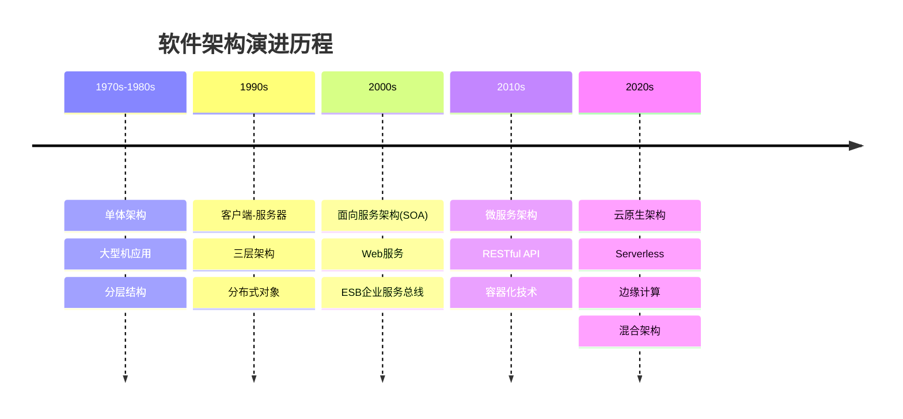
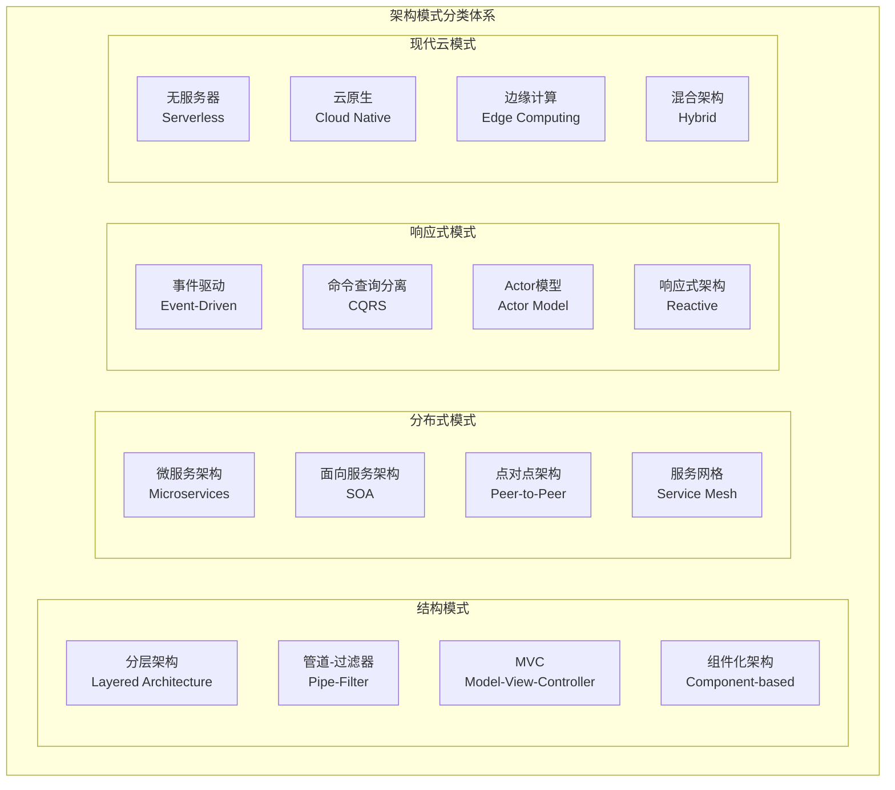
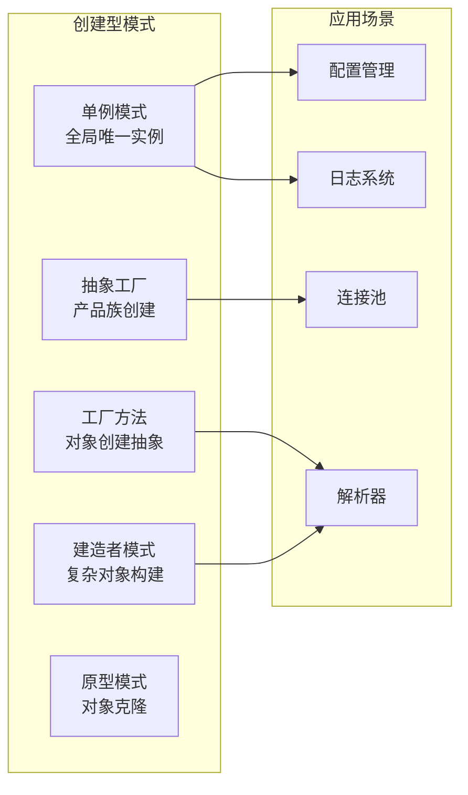
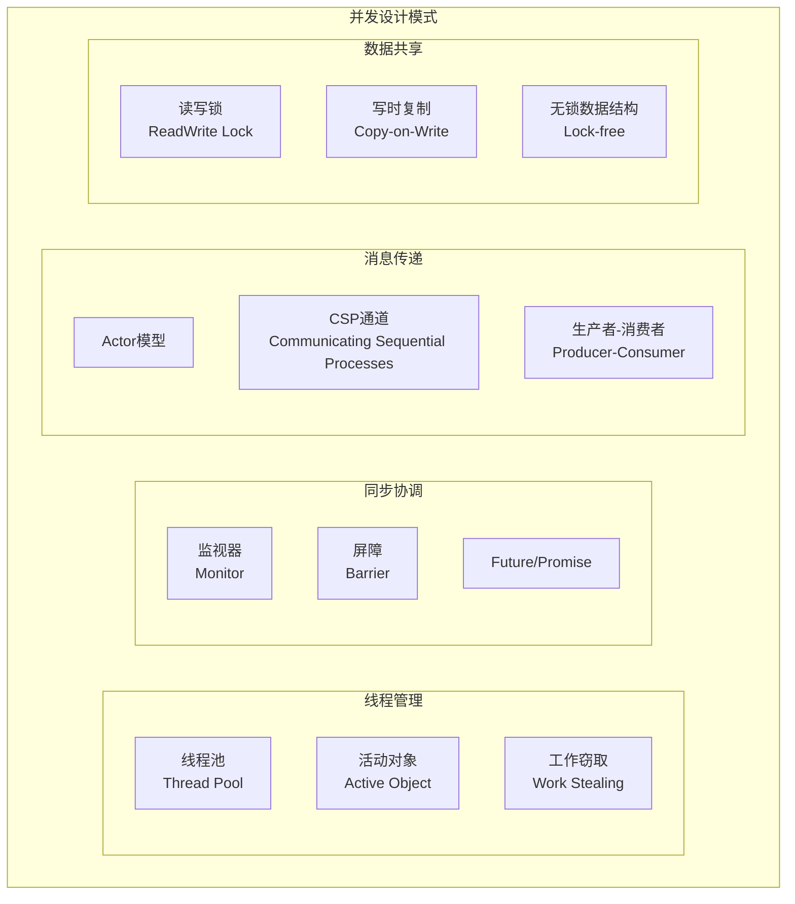
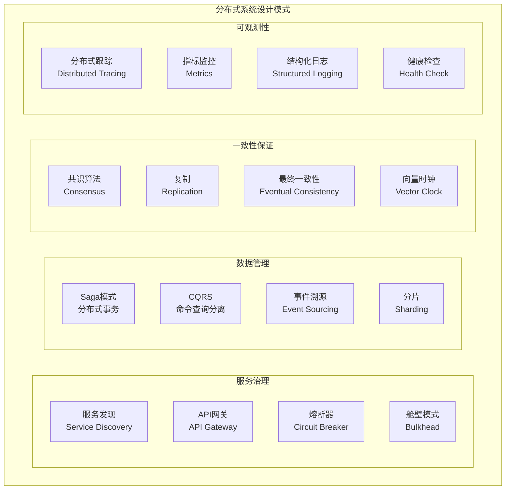
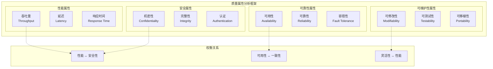
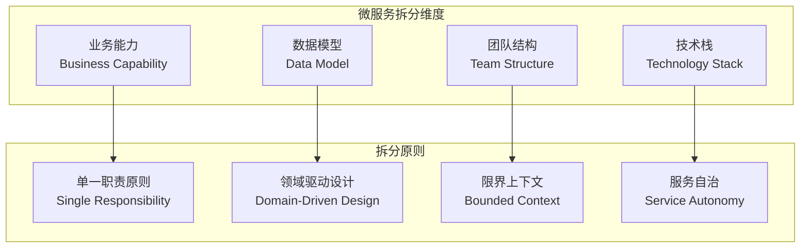
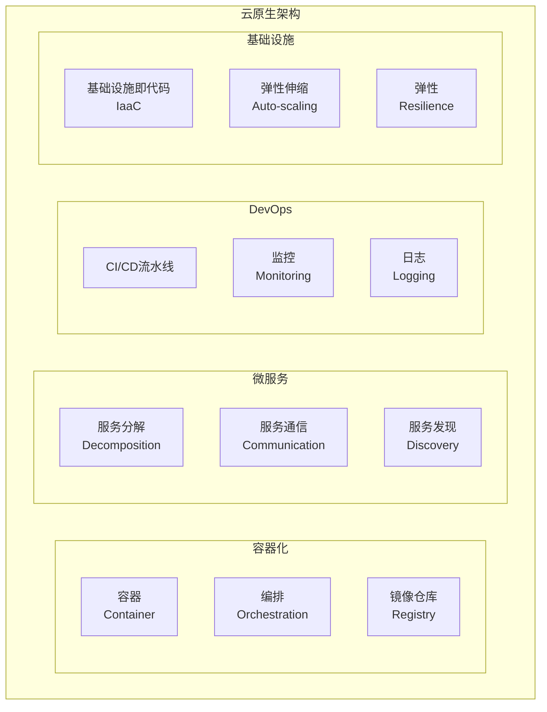

# 5.1 架构设计与形式化分析

[返回上级](../5-架构与设计模式.md) | [English Version](../5-architecture-and-design-patterns/5.1-architecture-design-and-formal-analysis.md)

## 目录

- [5.1 架构设计与形式化分析](#51-架构设计与形式化分析)
  - [目录](#目录)
  - [5.1.1 软件架构设计全景分析](#511-软件架构设计全景分析)
    - [5.1.1.1 架构演进历程](#5111-架构演进历程)
    - [5.1.1.2 现代架构模式分类](#5112-现代架构模式分类)
    - [5.1.1.3 架构决策框架](#5113-架构决策框架)
  - [5.1.2 设计模式体系分析](#512-设计模式体系分析)
    - [5.1.2.1 经典GoF模式](#5121-经典gof模式)
    - [5.1.2.2 并发并行模式](#5122-并发并行模式)
    - [5.1.2.3 分布式系统模式](#5123-分布式系统模式)
  - [5.1.3 形式化架构建模](#513-形式化架构建模)
    - [5.1.3.1 架构描述语言](#5131-架构描述语言)
    - [5.1.3.2 架构验证方法](#5132-架构验证方法)
    - [5.1.3.3 质量属性分析](#5133-质量属性分析)
  - [5.1.4 现代架构设计实践](#514-现代架构设计实践)
    - [5.1.4.1 微服务架构设计](#5141-微服务架构设计)
    - [5.1.4.2 事件驱动架构](#5142-事件驱动架构)
    - [5.1.4.3 云原生架构](#5143-云原生架构)
  - [5.1.5 架构评估与演进](#515-架构评估与演进)
  - [交叉引用](#交叉引用)
    - [相关主题](#相关主题)
    - [本地导航](#本地导航)
    - [参考文献](#参考文献)
      - [权威文献](#权威文献)
      - [在线资源](#在线资源)
      - [延伸阅读](#延伸阅读)

---

## 5.1.1 软件架构设计全景分析

### 5.1.1.1 架构演进历程



### 5.1.1.2 现代架构模式分类



### 5.1.1.3 架构决策框架

**架构决策模型**:

\[
AD = \langle C, QA, P, T, E \rangle
\]

其中：

- \(C\)：上下文约束(Context)
- \(QA\)：质量属性(Quality Attributes)  
- \(P\)：架构模式(Patterns)
- \(T\)：技术选择(Technology)
- \(E\)：演进策略(Evolution)

```lean
-- Lean 形式化：架构决策
structure ArchitecturalDecision :=
  (context : List Constraint)
  (quality_attributes : List QualityAttribute)
  (patterns : List ArchitecturalPattern)
  (technology_stack : TechnologyStack)
  (evolution_strategy : EvolutionPlan)

def is_valid_decision (ad : ArchitecturalDecision) : Prop :=
  ∀ qa ∈ ad.quality_attributes, 
    ∃ p ∈ ad.patterns, supports_quality qa p ∧
    ∃ t ∈ ad.technology_stack.components, implements_pattern p t
```

## 5.1.2 设计模式体系分析

### 5.1.2.1 经典GoF模式

**创建型模式架构**:



**Rust实现示例**:

```rust
// 单例模式 - 使用 once_cell
use once_cell::sync::Lazy;
use std::sync::Mutex;

static GLOBAL_CONFIG: Lazy<Mutex<Config>> = Lazy::new(|| {
    Mutex::new(Config::load_default())
});

#[derive(Debug, Clone)]
pub struct Config {
    pub database_url: String,
    pub api_key: String,
    pub max_connections: u32,
}

impl Config {
    fn load_default() -> Self {
        Config {
            database_url: "localhost:5432".to_string(),
            api_key: "default_key".to_string(),
            max_connections: 10,
        }
    }
    
    pub fn instance() -> &'static Mutex<Config> {
        &GLOBAL_CONFIG
    }
}

// 工厂方法模式
pub trait MessageProcessor {
    fn process(&self, message: &str) -> Result<String, ProcessError>;
}

pub struct JsonProcessor;
pub struct XmlProcessor;

impl MessageProcessor for JsonProcessor {
    fn process(&self, message: &str) -> Result<String, ProcessError> {
        // JSON处理逻辑
        Ok(format!("Processed JSON: {}", message))
    }
}

impl MessageProcessor for XmlProcessor {
    fn process(&self, message: &str) -> Result<String, ProcessError> {
        // XML处理逻辑
        Ok(format!("Processed XML: {}", message))
    }
}

pub enum MessageFormat {
    Json,
    Xml,
}

pub struct ProcessorFactory;

impl ProcessorFactory {
    pub fn create_processor(format: MessageFormat) -> Box<dyn MessageProcessor> {
        match format {
            MessageFormat::Json => Box::new(JsonProcessor),
            MessageFormat::Xml => Box::new(XmlProcessor),
        }
    }
}
```

### 5.1.2.2 并发并行模式

**并发模式分类**:



**Rust并发模式实现**:

```rust
// Actor模式实现
use tokio::sync::mpsc;
use std::collections::HashMap;

#[derive(Debug)]
pub enum ActorMessage {
    Get { key: String, response: oneshot::Sender<Option<String>> },
    Set { key: String, value: String },
    Delete { key: String },
}

pub struct StorageActor {
    receiver: mpsc::Receiver<ActorMessage>,
    storage: HashMap<String, String>,
}

impl StorageActor {
    pub fn new(receiver: mpsc::Receiver<ActorMessage>) -> Self {
        StorageActor {
            receiver,
            storage: HashMap::new(),
        }
    }
    
    pub async fn run(mut self) {
        while let Some(msg) = self.receiver.recv().await {
            match msg {
                ActorMessage::Get { key, response } => {
                    let value = self.storage.get(&key).cloned();
                    let _ = response.send(value);
                }
                ActorMessage::Set { key, value } => {
                    self.storage.insert(key, value);
                }
                ActorMessage::Delete { key } => {
                    self.storage.remove(&key);
                }
            }
        }
    }
}

// 使用示例
pub struct StorageHandle {
    sender: mpsc::Sender<ActorMessage>,
}

impl StorageHandle {
    pub fn new() -> Self {
        let (sender, receiver) = mpsc::channel(100);
        let actor = StorageActor::new(receiver);
        tokio::spawn(actor.run());
        
        StorageHandle { sender }
    }
    
    pub async fn get(&self, key: String) -> Option<String> {
        let (response_tx, response_rx) = oneshot::channel();
        let msg = ActorMessage::Get { key, response: response_tx };
        
        if self.sender.send(msg).await.is_ok() {
            response_rx.await.unwrap_or(None)
        } else {
            None
        }
    }
}
```

### 5.1.2.3 分布式系统模式

**分布式架构模式**:



## 5.1.3 形式化架构建模

### 5.1.3.1 架构描述语言

**架构形式化表示**:

\[
\text{Architecture} = \langle C, Con, P, \rho \rangle
\]

其中：

- \(C\)：组件集合(Components)
- \(Con\)：连接器集合(Connectors)
- \(P\)：端口集合(Ports)
- \(\rho\)：拓扑关系(Topology)

```lean
-- Lean 形式化：软件架构
structure SoftwareArchitecture :=
  (components : Finset Component)
  (connectors : Finset Connector)
  (ports : Finset Port)
  (topology : Component → Component → Prop)

structure Component :=
  (id : String)
  (interfaces : List Interface)
  (behavior : ComponentBehavior)
  (properties : List Property)

structure Connector :=
  (id : String)
  (roles : List Role)
  (protocol : CommunicationProtocol)
  (properties : List Property)

-- 架构约束
def well_formed_architecture (arch : SoftwareArchitecture) : Prop :=
  ∀ c ∈ arch.components, 
    ∀ i ∈ c.interfaces,
      ∃ conn ∈ arch.connectors, connects_interface conn i
```

### 5.1.3.2 架构验证方法

**架构一致性验证**:

```rust
// 架构验证框架
use std::collections::{HashMap, HashSet};

#[derive(Debug, Clone)]
pub struct ArchitecturalModel {
    pub components: HashMap<ComponentId, Component>,
    pub connectors: HashMap<ConnectorId, Connector>,
    pub constraints: Vec<ArchitecturalConstraint>,
}

#[derive(Debug, Clone)]
pub struct Component {
    pub id: ComponentId,
    pub component_type: ComponentType,
    pub interfaces: Vec<Interface>,
    pub dependencies: Vec<ComponentId>,
}

#[derive(Debug, Clone)]
pub enum ArchitecturalConstraint {
    LayeringConstraint {
        higher_layer: LayerId,
        lower_layer: LayerId,
    },
    CyclicDependencyProhibited,
    InterfaceCompatibility {
        provider: InterfaceId,
        consumer: InterfaceId,
    },
}

impl ArchitecturalModel {
    pub fn validate(&self) -> ArchitecturalValidationResult {
        let mut violations = Vec::new();
        
        for constraint in &self.constraints {
            match constraint {
                ArchitecturalConstraint::LayeringConstraint { higher_layer, lower_layer } => {
                    if let Some(violation) = self.check_layering_violation(*higher_layer, *lower_layer) {
                        violations.push(violation);
                    }
                }
                ArchitecturalConstraint::CyclicDependencyProhibited => {
                    if let Some(cycle) = self.detect_dependency_cycle() {
                        violations.push(ArchitecturalViolation::CyclicDependency(cycle));
                    }
                }
                ArchitecturalConstraint::InterfaceCompatibility { provider, consumer } => {
                    if let Some(violation) = self.check_interface_compatibility(*provider, *consumer) {
                        violations.push(violation);
                    }
                }
            }
        }
        
        ArchitecturalValidationResult {
            is_valid: violations.is_empty(),
            violations,
        }
    }
    
    fn detect_dependency_cycle(&self) -> Option<Vec<ComponentId>> {
        let mut visited = HashSet::new();
        let mut recursion_stack = HashSet::new();
        
        for component_id in self.components.keys() {
            if !visited.contains(component_id) {
                if let Some(cycle) = self.dfs_cycle_detection(
                    *component_id,
                    &mut visited,
                    &mut recursion_stack,
                    &mut Vec::new()
                ) {
                    return Some(cycle);
                }
            }
        }
        None
    }
}
```

### 5.1.3.3 质量属性分析

**质量属性权衡分析**:



## 5.1.4 现代架构设计实践

### 5.1.4.1 微服务架构设计

**微服务拆分策略**:



### 5.1.4.2 事件驱动架构

**事件驱动架构模式**:

```rust
// 事件驱动架构实现
use async_trait::async_trait;
use serde::{Deserialize, Serialize};
use std::collections::HashMap;
use tokio::sync::broadcast;

#[derive(Debug, Clone, Serialize, Deserialize)]
pub struct DomainEvent {
    pub event_id: String,
    pub event_type: String,
    pub aggregate_id: String,
    pub version: u64,
    pub timestamp: chrono::DateTime<chrono::Utc>,
    pub data: serde_json::Value,
}

#[async_trait]
pub trait EventHandler: Send + Sync {
    async fn handle(&self, event: &DomainEvent) -> Result<(), EventHandlingError>;
    fn event_types(&self) -> Vec<String>;
}

pub struct EventBus {
    handlers: HashMap<String, Vec<Box<dyn EventHandler>>>,
    sender: broadcast::Sender<DomainEvent>,
}

impl EventBus {
    pub fn new() -> Self {
        let (sender, _) = broadcast::channel(1000);
        EventBus {
            handlers: HashMap::new(),
            sender,
        }
    }
    
    pub fn register_handler(&mut self, handler: Box<dyn EventHandler>) {
        for event_type in handler.event_types() {
            self.handlers
                .entry(event_type)
                .or_insert_with(Vec::new)
                .push(handler.clone());
        }
    }
    
    pub async fn publish(&self, event: DomainEvent) -> Result<(), EventPublishError> {
        // 发布到广播通道
        self.sender.send(event.clone()).map_err(|_| EventPublishError::ChannelError)?;
        
        // 同步处理注册的处理器
        if let Some(handlers) = self.handlers.get(&event.event_type) {
            for handler in handlers {
                if let Err(e) = handler.handle(&event).await {
                    eprintln!("事件处理失败: {:?}", e);
                }
            }
        }
        
        Ok(())
    }
    
    pub fn subscribe(&self) -> broadcast::Receiver<DomainEvent> {
        self.sender.subscribe()
    }
}
```

### 5.1.4.3 云原生架构

**云原生架构要素**:



## 5.1.5 架构评估与演进

**架构演进策略**:

\[
\text{演进路径：} M_0 \xrightarrow{T_1} M_1 \xrightarrow{T_2} M_2 \cdots \xrightarrow{T_n} M_n
\]

其中 \(M_i\) 是架构状态，\(T_i\) 是转换操作。

```rust
// 架构演进框架
#[derive(Debug, Clone)]
pub struct ArchitecturalEvolutionPlan {
    pub current_state: ArchitecturalState,
    pub target_state: ArchitecturalState,
    pub migration_steps: Vec<MigrationStep>,
    pub rollback_strategy: RollbackStrategy,
}

#[derive(Debug, Clone)]
pub struct MigrationStep {
    pub step_id: String,
    pub description: String,
    pub dependencies: Vec<String>,
    pub estimated_duration: std::time::Duration,
    pub risk_level: RiskLevel,
    pub validation_criteria: Vec<ValidationCriterion>,
}

impl ArchitecturalEvolutionPlan {
    pub fn execute_step(&mut self, step_id: &str) -> Result<ExecutionResult, MigrationError> {
        let step = self.find_step(step_id)?;
        
        // 检查依赖
        self.validate_dependencies(&step)?;
        
        // 执行迁移步骤
        let result = self.perform_migration(&step)?;
        
        // 验证结果
        self.validate_step_completion(&step)?;
        
        Ok(result)
    }
    
    pub fn rollback_to_step(&mut self, step_id: &str) -> Result<(), MigrationError> {
        match &self.rollback_strategy {
            RollbackStrategy::SnapshotBased { snapshots } => {
                if let Some(snapshot) = snapshots.get(step_id) {
                    self.restore_from_snapshot(snapshot)?;
                }
            }
            RollbackStrategy::CommandBased { reverse_commands } => {
                self.execute_reverse_commands(step_id, reverse_commands)?;
            }
        }
        Ok(())
    }
}
```

## 交叉引用

### 相关主题

- [1.1-统一形式化理论综述](../1-形式化理论/1.1-统一形式化理论综述.md) - 形式化方法在架构设计中的应用
- [5.2-设计模式与代码实践](./5.2-设计模式与代码实践.md) - 设计模式的具体实现
- [7.1-形式化验证架构](../7-验证与工程实践/7.1-形式化验证架构.md) - 架构验证方法
- [6.2-rust_haskell代码实践](../6-编程语言与实现/6.2-rust_haskell代码实践.md) - 系统编程实现

### 本地导航

- [5.2-设计模式与代码实践](./5.2-设计模式与代码实践.md)
- [5.x-其他架构主题](./5.x-其他架构主题.md)
- [返回架构与设计模式主页](../5-架构与设计模式.md)

### 参考文献

#### 权威文献

1. Bass, L., Clements, P., & Kazman, R. (2021). *Software Architecture in Practice* (4th ed.). Addison-Wesley.
2. Richards, M., & Ford, N. (2020). *Fundamentals of Software Architecture*. O'Reilly Media.
3. Newman, S. (2021). *Building Microservices* (2nd ed.). O'Reilly Media.
4. Fowler, M. (2002). *Patterns of Enterprise Application Architecture*. Addison-Wesley.
5. Gamma, E., Helm, R., Johnson, R., & Vlissides, J. (1994). *Design Patterns: Elements of Reusable Object-Oriented Software*. Addison-Wesley.

#### 在线资源

- [Martin Fowler's Blog](https://martinfowler.com/) - 企业架构模式
- [High Scalability](https://highscalability.com/) - 大规模系统架构
- [The Architecture of Open Source Applications](https://aosabook.org/) - 开源软件架构分析
- [Microservices.io](https://microservices.io/) - 微服务架构模式

#### 延伸阅读

- Vernon, V. (2013). *Implementing Domain-Driven Design*. Addison-Wesley.
- Kleppmann, M. (2017). *Designing Data-Intensive Applications*. O'Reilly Media.
- Humble, J., & Farley, D. (2010). *Continuous Delivery*. Addison-Wesley.

---

[返回目录](../0-总览与导航/0.1-全局主题树形目录.md)
