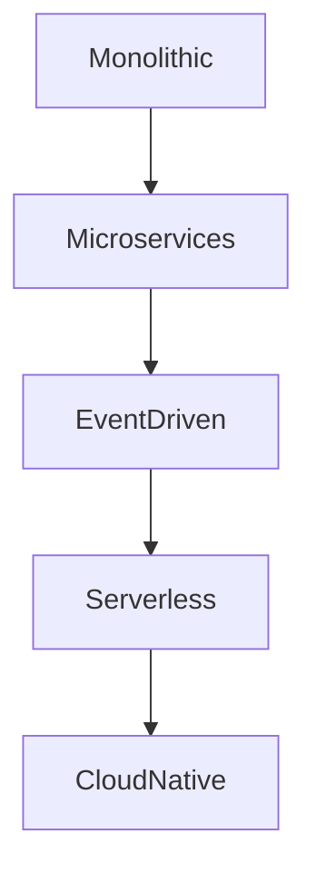
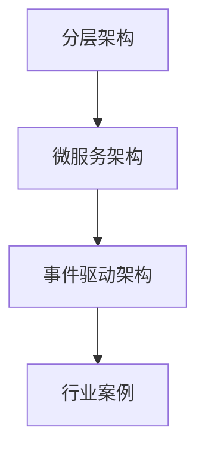

# 5.1 架构设计与形式化分析

[返回上级](../5-架构与设计模式.md) | [English Version](../5-architecture-and-design-patterns/5.1-architecture-design-and-formal-analysis.md)

## 目录

- [5.1 架构设计与形式化分析](#51-架构设计与形式化分析)
  - [目录](#目录)
  - [5.1.1 架构设计全景图](#511-架构设计全景图)
  - [5.1.2 典型架构模式](#512-典型架构模式)
  - [5.1.3 代码示例](#513-代码示例)
  - [5.1.4 参考文献](#514-参考文献)
    - [5.1.5 图表与多表征](#515-图表与多表征)
    - [5.1.6 相关性与交叉引用](#516-相关性与交叉引用)
    - [5.1.7 参考文献与延伸阅读](#517-参考文献与延伸阅读)

---

## 5.1.1 架构设计全景图



## 5.1.2 典型架构模式

\[
\text{微服务架构：} \forall s \in S, \exists f \in F, \text{服务}(s) \land \text{功能}(f) \land \text{映射}(s, f)
\]

```lean
-- Lean 伪代码：微服务架构
structure Microservice :=
  (id : string)
  (api : list endpoint)
  (data : database)
```

## 5.1.3 代码示例

```rust
// Rust 伪代码：微服务
struct Microservice {
    id: String,
    endpoints: Vec<Endpoint>,
    database: Database,
}
```

## 5.1.4 参考文献

- 《软件架构师的12项修炼》
- [Martin Fowler's Blog](https://martinfowler.com/)
- TODO: 更多权威文献

---

[返回目录](../0-总览与导航/0.1-全局主题树形目录.md)

### 5.1.5 图表与多表征



### 5.1.6 相关性与交叉引用

- [1.1-统一形式化理论综述](../1-形式化理论/1.1-统一形式化理论综述.md)
- [5.2-设计模式与代码实践](./5.2-设计模式与代码实践.md)

### 5.1.7 参考文献与延伸阅读

- 《企业应用架构模式》
- 相关开源项目与论文
