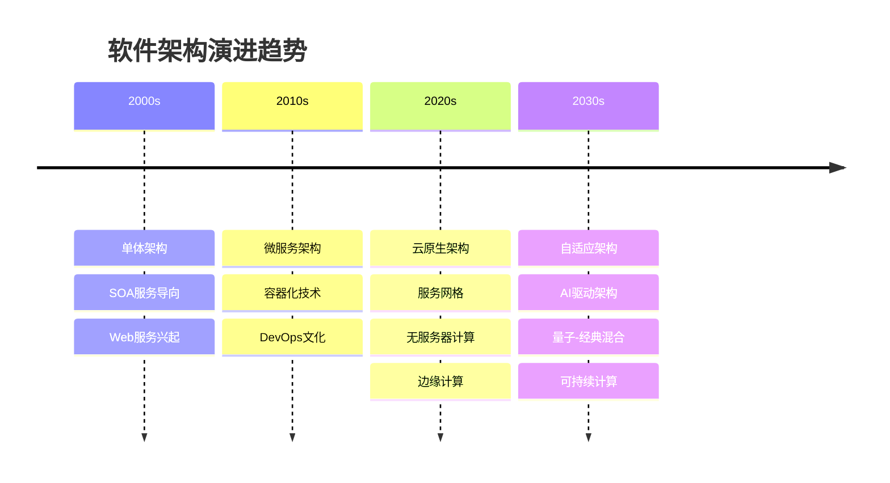

# 5.x 其他架构主题

[返回上级](../5-架构与设计模式.md)

## 目录

- [5.x 其他架构主题](#5x-其他架构主题)
  - [目录](#目录)
  - [5.x.1 工作流系统架构](#5x1-工作流系统架构)
    - [工作流引擎的核心架构](#工作流引擎的核心架构)
    - [BPMN 2.0标准实现](#bpmn-20标准实现)
    - [状态机驱动的工作流](#状态机驱动的工作流)
  - [5.x.2 组件化架构设计](#5x2-组件化架构设计)
    - [微前端架构](#微前端架构)
    - [插件化架构](#插件化架构)
  - [5.x.3 响应式架构模式](#5x3-响应式架构模式)
    - [反应式系统架构](#反应式系统架构)
    - [Event Sourcing架构](#event-sourcing架构)
  - [5.x.4 服务网格与云原生架构](#5x4-服务网格与云原生架构)
    - [Istio服务网格配置](#istio服务网格配置)
    - [Kubernetes Operator模式](#kubernetes-operator模式)
  - [5.x.5 数据架构与存储策略](#5x5-数据架构与存储策略)
    - [多模态数据存储架构](#多模态数据存储架构)
    - [数据湖架构](#数据湖架构)
  - [5.x.6 安全架构设计](#5x6-安全架构设计)
    - [零信任安全架构](#零信任安全架构)
  - [5.x.7 性能优化架构](#5x7-性能优化架构)
    - [多级缓存架构](#多级缓存架构)
    - [异步处理架构](#异步处理架构)
  - [5.x.8 新兴架构趋势](#5x8-新兴架构趋势)
    - [5.x.8.1 边缘计算架构](#5x81-边缘计算架构)
    - [5.x.8.2 区块链架构模式](#5x82-区块链架构模式)
    - [5.x.8.3 量子计算架构](#5x83-量子计算架构)
  - [5.x.9 架构演进与重构](#5x9-架构演进与重构)
    - [5.x.9.1 遗留系统现代化](#5x91-遗留系统现代化)
    - [5.x.9.2 架构决策记录](#5x92-架构决策记录)
    - [5.x.9.3 技术债务管理](#5x93-技术债务管理)
  - [5.x.10 总结与展望](#5x10-总结与展望)
    - [5.x.10.1 架构发展趋势](#5x101-架构发展趋势)
    - [5.x.10.2 架构师能力模型](#5x102-架构师能力模型)
    - [5.x.10.3 学习路径建议](#5x103-学习路径建议)
  - [5.x.11 参考文献](#5x11-参考文献)
    - [架构设计经典文献](#架构设计经典文献)
    - [云原生架构](#云原生架构)
    - [工作流系统](#工作流系统)
    - [新兴技术与架构](#新兴技术与架构)
    - [架构管理与实践](#架构管理与实践)
    - [开源项目参考](#开源项目参考)
    - [在线资源](#在线资源)

---

## 5.x.1 工作流系统架构

### 工作流引擎的核心架构

工作流系统作为业务流程自动化的基础架构，需要处理复杂的状态转换、任务编排和异常处理：

```rust
// 工作流引擎的核心组件
pub struct WorkflowEngine {
    definition_store: Arc<WorkflowDefinitionStore>,
    instance_store: Arc<WorkflowInstanceStore>,
    task_dispatcher: Arc<TaskDispatcher>,
    event_bus: Arc<EventBus>,
    scheduler: Arc<WorkflowScheduler>,
}

// 工作流定义的形式化模型
#[derive(Clone, Debug)]
pub struct WorkflowDefinition {
    pub id: WorkflowId,
    pub name: String,
    pub version: Version,
    pub nodes: Vec<WorkflowNode>,
    pub transitions: Vec<WorkflowTransition>,
    pub variables: WorkflowVariables,
    pub error_handlers: Vec<ErrorHandler>,
}

// 工作流节点类型
#[derive(Clone, Debug)]
pub enum WorkflowNode {
    StartNode {
        id: NodeId,
        name: String,
    },
    TaskNode {
        id: NodeId,
        name: String,
        task_type: TaskType,
        assignee: Option<String>,
        deadline: Option<Duration>,
        retry_policy: RetryPolicy,
    },
    GatewayNode {
        id: NodeId,
        gateway_type: GatewayType,
        conditions: Vec<Condition>,
    },
    EndNode {
        id: NodeId,
        name: String,
        result: WorkflowResult,
    },
}

impl WorkflowEngine {
    pub async fn start_workflow(&self, definition_id: WorkflowId, 
                               input_data: WorkflowData) 
        -> Result<WorkflowInstanceId, WorkflowError> {
        // 1. 获取工作流定义
        let definition = self.definition_store.get_definition(definition_id).await?;
        
        // 2. 创建工作流实例
        let instance = WorkflowInstance::new(
            WorkflowInstanceId::new(),
            definition.clone(),
            input_data,
        );
        
        // 3. 保存实例状态
        self.instance_store.save_instance(&instance).await?;
        
        // 4. 启动执行
        self.execute_workflow(instance.id).await?;
        
        Ok(instance.id)
    }
    
    async fn execute_workflow(&self, instance_id: WorkflowInstanceId) 
        -> Result<(), WorkflowError> {
        loop {
            let mut instance = self.instance_store.get_instance(instance_id).await?;
            
            // 获取当前可执行的节点
            let executable_nodes = instance.get_executable_nodes();
            
            if executable_nodes.is_empty() {
                // 工作流结束
                break;
            }
            
            // 并行执行所有可执行节点
            let execution_results = self.execute_nodes_parallel(
                &executable_nodes,
                &mut instance
            ).await?;
            
            // 更新实例状态
            self.update_instance_state(&mut instance, execution_results).await?;
            
            // 保存状态
            self.instance_store.save_instance(&instance).await?;
            
            // 发布状态变更事件
            self.event_bus.publish(WorkflowEvent::StateChanged {
                instance_id,
                timestamp: Utc::now(),
            }).await?;
        }
        
        Ok(())
    }
}
```

### BPMN 2.0标准实现

```rust
// BPMN元素的Rust实现
#[derive(Clone, Debug, Serialize, Deserialize)]
pub struct BPMNProcess {
    pub id: String,
    pub name: String,
    pub is_executable: bool,
    pub flow_elements: Vec<FlowElement>,
}

#[derive(Clone, Debug, Serialize, Deserialize)]
pub enum FlowElement {
    Activity(Activity),
    Gateway(Gateway),
    Event(Event),
    SequenceFlow(SequenceFlow),
}

#[derive(Clone, Debug, Serialize, Deserialize)]
pub struct Activity {
    pub id: String,
    pub name: String,
    pub activity_type: ActivityType,
    pub incoming: Vec<String>,
    pub outgoing: Vec<String>,
    pub properties: HashMap<String, String>,
}

// BPMN执行语义
impl BPMNEngine {
    pub async fn execute_activity(&self, activity: &Activity, 
                                 context: &mut ExecutionContext) 
        -> Result<ActivityResult, BPMNError> {
        match &activity.activity_type {
            ActivityType::UserTask => {
                self.create_user_task(activity, context).await
            }
            ActivityType::ServiceTask => {
                self.execute_service_task(activity, context).await
            }
            ActivityType::ScriptTask => {
                self.execute_script_task(activity, context).await
            }
            ActivityType::SubProcess => {
                self.execute_subprocess(activity, context).await
            }
        }
    }
}
```

### 状态机驱动的工作流

```lean
-- 工作流状态机的形式化定义
structure WorkflowStateMachine where
  states : Set WorkflowState
  transitions : WorkflowState → Event → Option WorkflowState
  initial_state : WorkflowState
  final_states : Set WorkflowState
  
-- 工作流正确性的形式化条件
def workflow_correctness (wsm : WorkflowStateMachine) : Prop :=
  -- 可达性：所有状态都可达
  (∀ s ∈ wsm.states, reachable wsm.initial_state s) ∧
  -- 终止性：存在终止路径
  (∃ path, leads_to_final_state wsm path) ∧
  -- 无死锁：非终止状态总有出边
  (∀ s ∈ wsm.states, s ∉ wsm.final_states → ∃ e t, wsm.transitions s e = some t)
```

## 5.x.2 组件化架构设计

### 微前端架构

```typescript
// 微前端架构的TypeScript实现
interface MicroFrontend {
  name: string;
  url: string;
  mount: (container: HTMLElement) => Promise<void>;
  unmount: (container: HTMLElement) => Promise<void>;
  update?: (props: any) => Promise<void>;
}

class MicroFrontendOrchestrator {
  private registeredApps: Map<string, MicroFrontend> = new Map();
  private mountedApps: Map<string, HTMLElement> = new Map();
  
  async registerApp(app: MicroFrontend): Promise<void> {
    this.registeredApps.set(app.name, app);
  }
  
  async mountApp(appName: string, container: HTMLElement): Promise<void> {
    const app = this.registeredApps.get(appName);
    if (!app) {
      throw new Error(`App ${appName} not registered`);
    }
    
    await app.mount(container);
    this.mountedApps.set(appName, container);
  }
  
  async unmountApp(appName: string): Promise<void> {
    const app = this.registeredApps.get(appName);
    const container = this.mountedApps.get(appName);
    
    if (app && container) {
      await app.unmount(container);
      this.mountedApps.delete(appName);
    }
  }
}

// 应用间通信机制
class MicroFrontendCommunication {
  private eventBus: EventTarget = new EventTarget();
  
  publish(event: string, data: any): void {
    this.eventBus.dispatchEvent(new CustomEvent(event, { detail: data }));
  }
  
  subscribe(event: string, handler: (data: any) => void): () => void {
    const listener = (e: CustomEvent) => handler(e.detail);
    this.eventBus.addEventListener(event, listener);
    
    return () => this.eventBus.removeEventListener(event, listener);
  }
}
```

### 插件化架构

```rust
// 插件系统的Rust实现
pub trait Plugin: Send + Sync {
    fn name(&self) -> &str;
    fn version(&self) -> &str;
    fn dependencies(&self) -> Vec<String>;
    
    fn initialize(&mut self, context: &PluginContext) -> Result<(), PluginError>;
    fn execute(&self, input: PluginInput) -> Result<PluginOutput, PluginError>;
    fn shutdown(&mut self) -> Result<(), PluginError>;
}

pub struct PluginManager {
    plugins: HashMap<String, Box<dyn Plugin>>,
    dependency_graph: DependencyGraph,
    execution_order: Vec<String>,
}

impl PluginManager {
    pub fn register_plugin(&mut self, plugin: Box<dyn Plugin>) 
        -> Result<(), PluginError> {
        let name = plugin.name().to_string();
        let deps = plugin.dependencies();
        
        // 检查循环依赖
        if self.has_circular_dependency(&name, &deps) {
            return Err(PluginError::CircularDependency);
        }
        
        // 添加到依赖图
        self.dependency_graph.add_node(&name, deps);
        
        // 重新计算执行顺序
        self.execution_order = self.dependency_graph.topological_sort()?;
        
        // 注册插件
        self.plugins.insert(name, plugin);
        
        Ok(())
    }
    
    pub async fn execute_pipeline(&self, input: PipelineInput) 
        -> Result<PipelineOutput, PluginError> {
        let mut current_output = input.into_plugin_input();
        
        for plugin_name in &self.execution_order {
            if let Some(plugin) = self.plugins.get(plugin_name) {
                current_output = plugin.execute(current_output)?;
            }
        }
        
        Ok(current_output.into_pipeline_output())
    }
}
```

## 5.x.3 响应式架构模式

### 反应式系统架构

```scala
// Akka Actor模型实现
import akka.actor.{Actor, ActorRef, ActorSystem, Props}
import akka.pattern.ask
import akka.util.Timeout
import scala.concurrent.duration._

case class ProcessMessage(id: String, data: String)
case class MessageProcessed(id: String, result: String)
case class GetStatus(id: String)

class MessageProcessor extends Actor {
  private var processedMessages: Map[String, String] = Map.empty
  
  def receive: Receive = {
    case ProcessMessage(id, data) =>
      // 模拟异步处理
      val result = processData(data)
      processedMessages += id -> result
      sender() ! MessageProcessed(id, result)
      
    case GetStatus(id) =>
      sender() ! processedMessages.get(id)
  }
  
  private def processData(data: String): String = {
    // 实际的数据处理逻辑
    data.toUpperCase
  }
}

// 响应式流处理
class ReactiveStreamProcessor {
  import akka.stream._
  import akka.stream.scaladsl._
  
  def processStream(source: Source[String, NotUsed])
                   (implicit system: ActorSystem): Source[String, NotUsed] = {
    source
      .map(_.toLowerCase)
      .filter(_.nonEmpty)
      .groupedWithin(10, 1.second)
      .map(batch => batch.mkString(","))
      .recover {
        case ex: Exception => s"Error: ${ex.getMessage}"
      }
  }
}
```

### Event Sourcing架构

```rust
// 事件溯源的Rust实现
#[derive(Clone, Debug, Serialize, Deserialize)]
pub enum Event {
    UserCreated { id: UserId, name: String, email: String },
    UserUpdated { id: UserId, name: Option<String>, email: Option<String> },
    UserDeleted { id: UserId },
}

pub trait Aggregate {
    type Id;
    type Event;
    type Error;
    
    fn apply_event(&mut self, event: Self::Event) -> Result<(), Self::Error>;
    fn get_uncommitted_events(&self) -> &[Self::Event];
    fn mark_events_committed(&mut self);
}

#[derive(Clone, Debug)]
pub struct User {
    pub id: UserId,
    pub name: String,
    pub email: String,
    pub version: u64,
    uncommitted_events: Vec<Event>,
}

impl Aggregate for User {
    type Id = UserId;
    type Event = Event;
    type Error = UserError;
    
    fn apply_event(&mut self, event: Self::Event) -> Result<(), Self::Error> {
        match event {
            Event::UserCreated { id, name, email } => {
                self.id = id;
                self.name = name;
                self.email = email;
            }
            Event::UserUpdated { id, name, email } => {
                if self.id != id {
                    return Err(UserError::IdMismatch);
                }
                if let Some(name) = name {
                    self.name = name;
                }
                if let Some(email) = email {
                    self.email = email;
                }
            }
            Event::UserDeleted { id } => {
                if self.id != id {
                    return Err(UserError::IdMismatch);
                }
                // 标记为已删除状态
            }
        }
        self.version += 1;
        Ok(())
    }
    
    fn get_uncommitted_events(&self) -> &[Self::Event] {
        &self.uncommitted_events
    }
    
    fn mark_events_committed(&mut self) {
        self.uncommitted_events.clear();
    }
}

// 事件存储
pub trait EventStore {
    async fn save_events(&self, aggregate_id: String, events: Vec<Event>, 
                        expected_version: u64) -> Result<(), EventStoreError>;
    async fn load_events(&self, aggregate_id: String) -> Result<Vec<Event>, EventStoreError>;
}
```

## 5.x.4 服务网格与云原生架构

### Istio服务网格配置

```yaml
# 服务网格配置示例
apiVersion: networking.istio.io/v1alpha3
kind: VirtualService
metadata:
  name: reviews
spec:
  hosts:
  - reviews
  http:
  - match:
    - headers:
        end-user:
          exact: jason
    route:
    - destination:
        host: reviews
        subset: v2
  - route:
    - destination:
        host: reviews
        subset: v1

---
apiVersion: networking.istio.io/v1alpha3
kind: DestinationRule
metadata:
  name: reviews
spec:
  host: reviews
  trafficPolicy:
    connectionPool:
      tcp:
        maxConnections: 10
      http:
        http1MaxPendingRequests: 10
        maxRequestsPerConnection: 2
    circuitBreaker:
      consecutiveErrors: 3
      interval: 30s
      baseEjectionTime: 30s
  subsets:
  - name: v1
    labels:
      version: v1
  - name: v2
    labels:
      version: v2
```

### Kubernetes Operator模式

```rust
// Kubernetes Operator的Rust实现
use kube::{
    api::{Api, ListParams, Patch, PatchParams, ResourceExt},
    client::Client,
    runtime::{
        controller::{Action, Controller},
        events::{Event, EventType, Recorder, Reporter},
        finalizer::{finalizer, Event as Finalizer},
        watcher::Config,
    },
    CustomResource, Resource,
};

#[derive(CustomResource, Debug, Serialize, Deserialize, Clone)]
#[kube(group = "example.com", version = "v1", kind = "MyResource")]
#[kube(shortname = "mr", namespaced)]
pub struct MyResourceSpec {
    pub replicas: i32,
    pub image: String,
    pub config: HashMap<String, String>,
}

#[derive(Debug, Serialize, Deserialize, Clone)]
pub struct MyResourceStatus {
    pub ready_replicas: i32,
    pub conditions: Vec<Condition>,
}

async fn reconcile(obj: Arc<MyResource>, ctx: Arc<Context>) 
    -> Result<Action, ReconcilerError> {
    let client = ctx.client.clone();
    let name = obj.name_any();
    let namespace = obj.namespace().unwrap_or_default();
    
    // 应用finalizer
    let finalizer_name = "example.com/myresource";
    finalizer(&client, finalizer_name, obj, |event| async {
        match event {
            Finalizer::Apply(resource) => {
                // 创建或更新资源
                create_or_update_resources(&client, &resource).await?;
                Ok(Action::requeue(Duration::from_secs(300)))
            }
            Finalizer::Cleanup(resource) => {
                // 清理资源
                cleanup_resources(&client, &resource).await?;
                Ok(Action::await_change())
            }
        }
    }).await.map_err(|e| ReconcilerError::FinalizerError(Box::new(e)))
}

async fn create_or_update_resources(client: &Client, resource: &MyResource) 
    -> Result<(), kube::Error> {
    let deployments: Api<Deployment> = Api::namespaced(
        client.clone(), 
        &resource.namespace().unwrap_or_default()
    );
    
    let deployment = create_deployment_from_spec(&resource.spec);
    
    deployments.patch(
        &resource.name_any(),
        &PatchParams::apply("myresource-operator"),
        &Patch::Apply(deployment)
    ).await?;
    
    Ok(())
}
```

## 5.x.5 数据架构与存储策略

### 多模态数据存储架构

```rust
// 多模态存储抽象
pub trait StorageEngine: Send + Sync {
    type Key;
    type Value;
    type Error;
    
    async fn get(&self, key: &Self::Key) -> Result<Option<Self::Value>, Self::Error>;
    async fn put(&self, key: Self::Key, value: Self::Value) -> Result<(), Self::Error>;
    async fn delete(&self, key: &Self::Key) -> Result<(), Self::Error>;
}

// 关系型数据库适配器
pub struct PostgreSQLAdapter {
    pool: PgPool,
}

impl StorageEngine for PostgreSQLAdapter {
    type Key = String;
    type Value = serde_json::Value;
    type Error = sqlx::Error;
    
    async fn get(&self, key: &Self::Key) -> Result<Option<Self::Value>, Self::Error> {
        let row: Option<(serde_json::Value,)> = sqlx::query_as(
            "SELECT data FROM key_value_store WHERE key = $1"
        )
        .bind(key)
        .fetch_optional(&self.pool)
        .await?;
        
        Ok(row.map(|r| r.0))
    }
    
    async fn put(&self, key: Self::Key, value: Self::Value) -> Result<(), Self::Error> {
        sqlx::query(
            "INSERT INTO key_value_store (key, data) VALUES ($1, $2) 
             ON CONFLICT (key) DO UPDATE SET data = $2"
        )
        .bind(&key)
        .bind(&value)
        .execute(&self.pool)
        .await?;
        
        Ok(())
    }
}

// 文档数据库适配器
pub struct MongoDBAdapter {
    collection: Collection<Document>,
}

// 图数据库适配器
pub struct Neo4jAdapter {
    graph: Graph,
}

// 统一数据访问层
pub struct UnifiedDataLayer {
    relational: Arc<dyn StorageEngine<Key=String, Value=serde_json::Value, Error=DataError>>,
    document: Arc<dyn StorageEngine<Key=String, Value=Document, Error=DataError>>,
    graph: Arc<dyn StorageEngine<Key=NodeId, Value=Node, Error=DataError>>,
    cache: Arc<dyn StorageEngine<Key=String, Value=CacheValue, Error=DataError>>,
}

impl UnifiedDataLayer {
    pub async fn query_with_strategy(&self, query: DataQuery) 
        -> Result<QueryResult, DataError> {
        match query.strategy {
            QueryStrategy::Relational => {
                self.relational.get(&query.key).await
                    .map(|opt| opt.map(QueryResult::Json).unwrap_or(QueryResult::NotFound))
            }
            QueryStrategy::Document => {
                self.document.get(&query.key).await
                    .map(|opt| opt.map(QueryResult::Document).unwrap_or(QueryResult::NotFound))
            }
            QueryStrategy::Graph => {
                let node_id = NodeId::from_string(&query.key)?;
                self.graph.get(&node_id).await
                    .map(|opt| opt.map(QueryResult::Node).unwrap_or(QueryResult::NotFound))
            }
            QueryStrategy::Auto => {
                // 智能路由策略
                self.auto_route_query(query).await
            }
        }
    }
}
```

### 数据湖架构

```python
# 数据湖架构的Python实现
from abc import ABC, abstractmethod
from typing import Dict, Any, List, Optional
import apache_beam as beam
from apache_beam.options.pipeline_options import PipelineOptions

class DataLakeStorage(ABC):
    @abstractmethod
    def write(self, path: str, data: bytes) -> bool:
        pass
    
    @abstractmethod
    def read(self, path: str) -> bytes:
        pass
    
    @abstractmethod
    def list_files(self, prefix: str) -> List[str]:
        pass

class S3DataLakeStorage(DataLakeStorage):
    def __init__(self, bucket_name: str):
        self.bucket_name = bucket_name
        self.s3_client = boto3.client('s3')
    
    def write(self, path: str, data: bytes) -> bool:
        try:
            self.s3_client.put_object(
                Bucket=self.bucket_name,
                Key=path,
                Body=data
            )
            return True
        except Exception as e:
            logger.error(f"Failed to write {path}: {e}")
            return False

class DataLakeOrchestrator:
    def __init__(self, storage: DataLakeStorage):
        self.storage = storage
        self.metadata_store = MetadataStore()
        
    def ingest_data(self, source_config: Dict[str, Any]) -> str:
        """数据摄取管道"""
        pipeline_options = PipelineOptions([
            '--runner=DataflowRunner',
            '--project=my-project',
            '--region=us-central1',
            '--temp_location=gs://my-temp-bucket/temp',
        ])
        
        with beam.Pipeline(options=pipeline_options) as p:
            (p 
             | 'ReadSource' >> beam.io.ReadFromText(source_config['path'])
             | 'ValidateData' >> beam.Map(self.validate_record)
             | 'TransformData' >> beam.Map(self.transform_record)
             | 'WriteToLake' >> beam.Map(self.write_to_lake)
            )
        
        return f"ingestion_job_{uuid.uuid4()}"
    
    def create_data_mart(self, mart_config: Dict[str, Any]) -> str:
        """创建数据集市"""
        # 实现ETL逻辑
        pass
```

## 5.x.6 安全架构设计

### 零信任安全架构

```rust
// 零信任安全架构实现
pub struct ZeroTrustGateway {
    identity_verifier: Arc<IdentityVerifier>,
    policy_engine: Arc<PolicyEngine>,
    threat_detector: Arc<ThreatDetector>,
    audit_logger: Arc<AuditLogger>,
}

#[derive(Debug, Clone)]
pub struct SecurityContext {
    pub user_identity: UserIdentity,
    pub device_info: DeviceInfo,
    pub network_context: NetworkContext,
    pub risk_score: RiskScore,
    pub trust_level: TrustLevel,
}

impl ZeroTrustGateway {
    pub async fn authorize_request(&self, request: &AccessRequest) 
        -> Result<AccessDecision, SecurityError> {
        
        // 1. 身份验证和设备验证
        let identity = self.identity_verifier.verify_identity(&request.credentials).await?;
        let device = self.identity_verifier.verify_device(&request.device_fingerprint).await?;
        
        // 2. 威胁检测和风险评估
        let risk_score = self.threat_detector.assess_risk(&request, &identity, &device).await?;
        
        // 3. 动态策略评估
        let security_context = SecurityContext {
            user_identity: identity,
            device_info: device,
            network_context: request.network_context.clone(),
            risk_score,
            trust_level: self.calculate_trust_level(risk_score),
        };
        
        let policy_decision = self.policy_engine.evaluate(&security_context, &request.resource).await?;
        
        // 4. 审计日志
        self.audit_logger.log_access_attempt(&request, &policy_decision).await?;
        
        // 5. 返回访问决策
        Ok(policy_decision)
    }
    
    fn calculate_trust_level(&self, risk_score: RiskScore) -> TrustLevel {
        match risk_score.value {
            0.0..=0.3 => TrustLevel::High,
            0.3..=0.7 => TrustLevel::Medium,
            0.7..=1.0 => TrustLevel::Low,
            _ => TrustLevel::Untrusted,
        }
    }
}

// 动态策略引擎
pub struct PolicyEngine {
    policy_store: Arc<PolicyStore>,
    rule_engine: Arc<RuleEngine>,
}

impl PolicyEngine {
    pub async fn evaluate(&self, context: &SecurityContext, resource: &Resource) 
        -> Result<AccessDecision, PolicyError> {
        
        // 获取适用的策略
        let applicable_policies = self.policy_store
            .get_policies_for_resource(resource).await?;
        
        // 评估每个策略
        let mut results = Vec::new();
        for policy in applicable_policies {
            let result = self.rule_engine.evaluate_policy(&policy, context).await?;
            results.push(result);
        }
        
        // 合并决策结果
        self.merge_policy_results(results)
    }
}
```

## 5.x.7 性能优化架构

### 多级缓存架构

```rust
// 多级缓存系统实现
pub struct MultiLevelCache<K, V> 
where 
    K: Clone + Hash + Eq + Send + Sync + 'static,
    V: Clone + Send + Sync + 'static,
{
    l1_cache: Arc<MemoryCache<K, V>>,      // L1: 内存缓存
    l2_cache: Arc<RedisCache<K, V>>,       // L2: 分布式缓存
    l3_cache: Arc<DatabaseCache<K, V>>,    // L3: 数据库缓存
    metrics: Arc<CacheMetrics>,
}

impl<K, V> MultiLevelCache<K, V> 
where 
    K: Clone + Hash + Eq + Send + Sync + 'static,
    V: Clone + Send + Sync + 'static,
{
    pub async fn get(&self, key: &K) -> Result<Option<V>, CacheError> {
        // L1缓存查找
        if let Some(value) = self.l1_cache.get(key).await? {
            self.metrics.record_hit(CacheLevel::L1).await;
            return Ok(Some(value));
        }
        
        // L2缓存查找
        if let Some(value) = self.l2_cache.get(key).await? {
            self.metrics.record_hit(CacheLevel::L2).await;
            // 回填L1缓存
            self.l1_cache.set(key.clone(), value.clone(), Duration::from_secs(300)).await?;
            return Ok(Some(value));
        }
        
        // L3缓存查找
        if let Some(value) = self.l3_cache.get(key).await? {
            self.metrics.record_hit(CacheLevel::L3).await;
            // 回填L1和L2缓存
            let l1_future = self.l1_cache.set(key.clone(), value.clone(), Duration::from_secs(300));
            let l2_future = self.l2_cache.set(key.clone(), value.clone(), Duration::from_secs(3600));
            
            tokio::try_join!(l1_future, l2_future)?;
            return Ok(Some(value));
        }
        
        self.metrics.record_miss().await;
        Ok(None)
    }
    
    pub async fn set(&self, key: K, value: V, ttl: Duration) -> Result<(), CacheError> {
        // 并行写入所有缓存层
        let l1_future = self.l1_cache.set(key.clone(), value.clone(), ttl);
        let l2_future = self.l2_cache.set(key.clone(), value.clone(), ttl);
        let l3_future = self.l3_cache.set(key, value, ttl);
        
        tokio::try_join!(l1_future, l2_future, l3_future)?;
        Ok(())
    }
}

// 智能预取策略
pub struct PredictiveCacheManager<K, V> {
    cache: Arc<MultiLevelCache<K, V>>,
    access_pattern_analyzer: Arc<AccessPatternAnalyzer<K>>,
    prefetch_scheduler: Arc<PrefetchScheduler<K, V>>,
}

impl<K, V> PredictiveCacheManager<K, V> {
    pub async fn get_with_prediction(&self, key: &K) -> Result<Option<V>, CacheError> {
        // 记录访问模式
        self.access_pattern_analyzer.record_access(key).await;
        
        // 获取数据
        let result = self.cache.get(key).await?;
        
        // 基于访问模式预测并预取
        if let Some(predicted_keys) = self.access_pattern_analyzer
            .predict_next_accesses(key).await? {
            
            self.prefetch_scheduler.schedule_prefetch(predicted_keys).await?;
        }
        
        Ok(result)
    }
}
```

### 异步处理架构

```rust
// 异步消息处理系统
pub struct AsyncMessageProcessor {
    queue_manager: Arc<QueueManager>,
    worker_pool: Arc<WorkerPool>,
    dead_letter_queue: Arc<DeadLetterQueue>,
    metrics: Arc<ProcessingMetrics>,
}

impl AsyncMessageProcessor {
    pub async fn process_message_batch(&self, batch: Vec<Message>) 
        -> Result<ProcessingResult, ProcessingError> {
        
        let batch_size = batch.len();
        let start_time = Instant::now();
        
        // 并行处理消息
        let processing_futures: Vec<_> = batch
            .into_iter()
            .map(|msg| self.process_single_message(msg))
            .collect();
        
        let results = futures::future::join_all(processing_futures).await;
        
        // 统计处理结果
        let mut successful = 0;
        let mut failed = 0;
        let mut retryable = 0;
        
        for result in results {
            match result {
                Ok(_) => successful += 1,
                Err(ProcessingError::Retryable(_)) => retryable += 1,
                Err(_) => failed += 1,
            }
        }
        
        // 记录指标
        self.metrics.record_batch_processing(
            batch_size,
            successful,
            failed,
            retryable,
            start_time.elapsed(),
        ).await;
        
        Ok(ProcessingResult {
            successful,
            failed,
            retryable,
            duration: start_time.elapsed(),
        })
    }
    
    async fn process_single_message(&self, message: Message) 
        -> Result<(), ProcessingError> {
        
        const MAX_RETRIES: u32 = 3;
        let mut retry_count = 0;
        
        loop {
            match self.try_process_message(&message).await {
                Ok(_) => return Ok(()),
                Err(ProcessingError::Retryable(e)) if retry_count < MAX_RETRIES => {
                    retry_count += 1;
                    let delay = Duration::from_millis(100 * 2_u64.pow(retry_count));
                    tokio::time::sleep(delay).await;
                    continue;
                }
                Err(e) => {
                    // 发送到死信队列
                    self.dead_letter_queue.send(message, e.clone()).await?;
                    return Err(e);
                }
            }
        }
    }
}
```

## 5.x.8 新兴架构趋势

### 5.x.8.1 边缘计算架构

边缘计算将计算、存储和网络服务移近数据源，以降低延迟、减少带宽使用并提高数据隐私。

**边缘计算参考架构**:

```rust
// 边缘节点管理系统
pub struct EdgeNode {
    pub node_id: String,
    pub location: GeoLocation,
    pub capabilities: ComputeCapabilities,
    pub status: NodeStatus,
    pub workloads: Vec<EdgeWorkload>,
}

#[derive(Clone, Debug)]
pub struct ComputeCapabilities {
    pub cpu_cores: u32,
    pub memory_gb: u32,
    pub storage_gb: u32,
    pub gpu_available: bool,
    pub ai_accelerator: Option<String>,
    pub network_bandwidth: u64, // Mbps
}

// 边缘工作负载调度器
pub struct EdgeWorkloadScheduler {
    nodes: Arc<RwLock<HashMap<String, EdgeNode>>>,
    placement_policy: Arc<dyn PlacementPolicy>,
    load_balancer: Arc<EdgeLoadBalancer>,
    latency_monitor: Arc<LatencyMonitor>,
}

impl EdgeWorkloadScheduler {
    pub async fn schedule_workload(&self, workload: EdgeWorkload) 
        -> Result<SchedulingDecision, SchedulingError> {
        
        let available_nodes = self.get_available_nodes().await?;
        let user_location = workload.get_user_location();
        
        // 计算每个节点的适合度分数
        let mut node_scores = Vec::new();
        for node in available_nodes {
            let score = self.calculate_placement_score(&node, &workload, user_location).await?;
            node_scores.push((node, score));
        }
        
        // 按分数排序并选择最佳节点
        node_scores.sort_by(|a, b| b.1.partial_cmp(&a.1).unwrap());
        
        if let Some((best_node, _)) = node_scores.first() {
            Ok(SchedulingDecision {
                target_node: best_node.node_id.clone(),
                placement_reason: PlacementReason::OptimalLatency,
                expected_latency: self.estimate_latency(best_node, user_location).await?,
            })
        } else {
            Err(SchedulingError::NoSuitableNode)
        }
    }
    
    async fn calculate_placement_score(&self, node: &EdgeNode, 
                                     workload: &EdgeWorkload,
                                     user_location: GeoLocation) 
        -> Result<f64, SchedulingError> {
        
        let distance_score = self.calculate_distance_score(node.location, user_location);
        let resource_score = self.calculate_resource_score(&node.capabilities, &workload.requirements);
        let load_score = self.calculate_load_score(node).await?;
        let network_score = self.calculate_network_score(node).await?;
        
        // 加权计算总分
        let total_score = 
            0.4 * distance_score +
            0.3 * resource_score +
            0.2 * load_score +
            0.1 * network_score;
            
        Ok(total_score)
    }
}

// 边缘-云协同架构
pub struct EdgeCloudOrchestrator {
    edge_cluster: Arc<EdgeClusterManager>,
    cloud_cluster: Arc<CloudClusterManager>,
    workload_analyzer: Arc<WorkloadAnalyzer>,
    migration_controller: Arc<WorkloadMigrationController>,
}

impl EdgeCloudOrchestrator {
    pub async fn optimize_workload_placement(&self) -> Result<(), OrchestrationError> {
        // 分析当前工作负载分布
        let workload_analysis = self.workload_analyzer.analyze_current_state().await?;
        
        // 识别需要迁移的工作负载
        let migration_candidates = self.identify_migration_candidates(&workload_analysis).await?;
        
        // 执行工作负载迁移
        for candidate in migration_candidates {
            match candidate.migration_type {
                MigrationType::EdgeToCloud => {
                    self.migrate_to_cloud(candidate).await?;
                },
                MigrationType::CloudToEdge => {
                    self.migrate_to_edge(candidate).await?;
                },
                MigrationType::EdgeToEdge => {
                    self.migrate_between_edges(candidate).await?;
                }
            }
        }
        
        Ok(())
    }
}
```

### 5.x.8.2 区块链架构模式

区块链技术带来了去中心化应用（DApp）的新架构模式，需要考虑共识机制、智能合约和分布式账本的设计。

**DApp架构设计**:

```rust
// 区块链应用架构
pub struct DAppArchitecture {
    pub blockchain_layer: BlockchainLayer,
    pub smart_contracts: Vec<SmartContract>,
    pub off_chain_components: OffChainLayer,
    pub user_interface: UserInterfaceLayer,
}

// 智能合约抽象
pub trait SmartContract {
    type State;
    type Transaction;
    type Event;
    
    fn execute_transaction(&mut self, tx: Self::Transaction) 
        -> Result<Vec<Self::Event>, ContractError>;
    fn get_state(&self) -> &Self::State;
    fn validate_transaction(&self, tx: &Self::Transaction) -> bool;
}

// 去中心化身份管理
pub struct DecentralizedIdentityManager {
    did_registry: Arc<DIDRegistry>,
    credential_verifier: Arc<CredentialVerifier>,
    key_manager: Arc<KeyManager>,
}

impl DecentralizedIdentityManager {
    pub async fn create_identity(&self, user_data: UserData) 
        -> Result<DecentralizedIdentity, IdentityError> {
        
        // 生成密钥对
        let key_pair = self.key_manager.generate_key_pair().await?;
        
        // 创建DID文档
        let did_document = DIDDocument {
            id: DID::new(),
            public_keys: vec![key_pair.public_key],
            authentication: vec![key_pair.public_key.id.clone()],
            service_endpoints: vec![],
            created: Utc::now(),
            updated: Utc::now(),
        };
        
        // 注册到区块链
        self.did_registry.register_did(did_document.clone()).await?;
        
        Ok(DecentralizedIdentity {
            did: did_document.id,
            document: did_document,
            private_key: key_pair.private_key,
        })
    }
    
    pub async fn verify_credential(&self, credential: VerifiableCredential) 
        -> Result<bool, VerificationError> {
        
        // 验证凭证签名
        let is_signature_valid = self.credential_verifier
            .verify_signature(&credential).await?;
        
        // 验证发行者身份
        let is_issuer_valid = self.verify_issuer(&credential.issuer).await?;
        
        // 检查凭证是否被撤销
        let is_not_revoked = self.check_revocation_status(&credential).await?;
        
        Ok(is_signature_valid && is_issuer_valid && is_not_revoked)
    }
}

// 分层区块链架构（Layer 2解决方案）
pub struct LayeredBlockchainArchitecture {
    pub layer1_mainnet: Arc<MainnetInterface>,
    pub layer2_scaling: Arc<Layer2ScalingSystem>,
    pub state_channels: Arc<StateChannelManager>,
    pub cross_chain_bridge: Arc<CrossChainBridge>,
}

impl LayeredBlockchainArchitecture {
    pub async fn execute_high_frequency_transaction(&self, tx: Transaction) 
        -> Result<TransactionResult, ExecutionError> {
        
        // 判断交易类型和优先级
        match self.analyze_transaction(&tx).await? {
            TransactionCategory::HighFrequency => {
                // 使用Layer 2进行快速处理
                self.layer2_scaling.process_transaction(tx).await
            },
            TransactionCategory::HighValue => {
                // 直接在主网处理确保安全性
                self.layer1_mainnet.submit_transaction(tx).await
            },
            TransactionCategory::Microtransaction => {
                // 使用状态通道批量处理
                self.state_channels.add_to_batch(tx).await
            }
        }
    }
}
```

### 5.x.8.3 量子计算架构

量子计算架构需要考虑量子比特的特殊性质、量子纠错和混合经典-量子计算系统。

**量子-经典混合架构**:

```rust
// 量子计算抽象层
pub trait QuantumProcessor {
    type QuantumState;
    type QuantumGate;
    type MeasurementResult;
    
    fn apply_gate(&mut self, gate: Self::QuantumGate, qubits: &[usize]) 
        -> Result<(), QuantumError>;
    fn measure_qubits(&mut self, qubits: &[usize]) 
        -> Result<Self::MeasurementResult, QuantumError>;
    fn get_quantum_state(&self) -> &Self::QuantumState;
}

// 混合量子-经典系统
pub struct HybridQuantumSystem {
    quantum_processor: Arc<dyn QuantumProcessor<
        QuantumState = ComplexVector,
        QuantumGate = UnitaryMatrix,
        MeasurementResult = BitString
    >>,
    classical_processor: Arc<ClassicalProcessor>,
    quantum_error_corrector: Arc<QuantumErrorCorrector>,
    variational_optimizer: Arc<VariationalOptimizer>,
}

impl HybridQuantumSystem {
    pub async fn solve_optimization_problem(&self, problem: OptimizationProblem) 
        -> Result<OptimizationResult, ComputationError> {
        
        // 1. 经典预处理
        let preprocessed = self.classical_processor
            .preprocess_problem(problem).await?;
        
        // 2. 量子变分算法
        let mut best_result = None;
        let mut best_cost = f64::INFINITY;
        
        for iteration in 0..self.max_iterations() {
            // 准备量子态
            let quantum_state = self.prepare_quantum_state(&preprocessed).await?;
            
            // 应用变分电路
            let circuit_result = self.apply_variational_circuit(
                quantum_state,
                &self.variational_optimizer.get_parameters()
            ).await?;
            
            // 测量并计算代价函数
            let measurement = self.quantum_processor
                .measure_qubits(&preprocessed.measurement_qubits)?;
            
            let cost = self.classical_processor
                .evaluate_cost_function(&measurement, &preprocessed).await?;
            
            // 更新最佳结果
            if cost < best_cost {
                best_cost = cost;
                best_result = Some(measurement);
            }
            
            // 经典优化器更新参数
            self.variational_optimizer.update_parameters(cost).await?;
            
            // 收敛检查
            if self.check_convergence(iteration, cost).await? {
                break;
            }
        }
        
        // 3. 经典后处理
        let final_result = self.classical_processor
            .postprocess_result(best_result.unwrap(), &preprocessed).await?;
        
        Ok(OptimizationResult {
            solution: final_result,
            cost: best_cost,
            iterations: iteration,
        })
    }
    
    async fn apply_quantum_error_correction(&self, 
                                          quantum_state: &mut ComplexVector) 
        -> Result<(), QuantumError> {
        
        // 量子纠错码应用
        self.quantum_error_corrector.encode_logical_qubits(quantum_state).await?;
        
        // 错误检测和校正
        let error_syndrome = self.quantum_error_corrector
            .detect_errors(quantum_state).await?;
        
        if !error_syndrome.is_empty() {
            self.quantum_error_corrector
                .correct_errors(quantum_state, &error_syndrome).await?;
        }
        
        Ok(())
    }
}

// 量子云计算架构
pub struct QuantumCloudArchitecture {
    quantum_backends: HashMap<String, Arc<dyn QuantumProcessor>>,
    job_scheduler: Arc<QuantumJobScheduler>,
    queue_manager: Arc<QuantumQueueManager>,
    resource_monitor: Arc<QuantumResourceMonitor>,
}

impl QuantumCloudArchitecture {
    pub async fn submit_quantum_job(&self, job: QuantumJob) 
        -> Result<JobSubmissionResult, SubmissionError> {
        
        // 分析作业需求
        let requirements = self.analyze_job_requirements(&job).await?;
        
        // 选择最佳量子后端
        let selected_backend = self.select_quantum_backend(&requirements).await?;
        
        // 编译量子电路
        let compiled_circuit = self.compile_for_backend(&job.circuit, &selected_backend).await?;
        
        // 提交到队列
        let job_id = self.queue_manager.enqueue_job(QuantumJobExecution {
            job_id: JobId::new(),
            circuit: compiled_circuit,
            backend: selected_backend.clone(),
            priority: job.priority,
            estimated_runtime: requirements.estimated_runtime,
        }).await?;
        
        Ok(JobSubmissionResult {
            job_id,
            estimated_wait_time: self.queue_manager.estimate_wait_time().await?,
            selected_backend: selected_backend.name(),
        })
    }
}
```

## 5.x.9 架构演进与重构

### 5.x.9.1 遗留系统现代化

遗留系统现代化是企业数字化转型的关键挑战，需要采用渐进式重构策略。

**绞杀者模式（Strangler Fig Pattern）**:

```rust
// 遗留系统现代化框架
pub struct LegacyModernizationFramework {
    legacy_system: Arc<LegacySystemAdapter>,
    modern_system: Arc<ModernSystemImplementation>,
    migration_controller: Arc<MigrationController>,
    feature_flags: Arc<FeatureFlagManager>,
    monitoring: Arc<MigrationMonitoring>,
}

impl LegacyModernizationFramework {
    pub async fn execute_strangler_migration(&self, migration_plan: MigrationPlan) 
        -> Result<MigrationResult, MigrationError> {
        
        for phase in migration_plan.phases {
            // 1. 准备新功能
            self.prepare_modern_feature(&phase.feature).await?;
            
            // 2. 配置流量分割
            self.configure_traffic_split(&phase).await?;
            
            // 3. 渐进式流量迁移
            self.execute_gradual_migration(&phase).await?;
            
            // 4. 验证和监控
            self.validate_migration_phase(&phase).await?;
            
            // 5. 清理遗留代码
            if phase.cleanup_legacy {
                self.cleanup_legacy_components(&phase.feature).await?;
            }
        }
        
        Ok(MigrationResult {
            migrated_features: migration_plan.phases.len(),
            performance_improvement: self.calculate_performance_gain().await?,
            cost_reduction: self.calculate_cost_reduction().await?,
        })
    }
    
    async fn execute_gradual_migration(&self, phase: &MigrationPhase) 
        -> Result<(), MigrationError> {
        
        let mut traffic_percentage = 0;
        let increment = 10; // 每次增加10%流量
        
        while traffic_percentage < 100 {
            // 增加流量到新系统
            traffic_percentage = std::cmp::min(100, traffic_percentage + increment);
            
            self.feature_flags.update_flag(
                &phase.feature_flag,
                TrafficRule::Percentage(traffic_percentage)
            ).await?;
            
            // 等待观察期
            tokio::time::sleep(Duration::from_secs(300)).await; // 5分钟观察期
            
            // 检查系统健康状况
            let health_check = self.monitoring.check_system_health().await?;
            
            if !health_check.is_healthy {
                // 回滚流量
                self.feature_flags.update_flag(
                    &phase.feature_flag,
                    TrafficRule::Percentage(traffic_percentage - increment)
                ).await?;
                
                return Err(MigrationError::HealthCheckFailed(health_check));
            }
            
            // 记录迁移进度
            self.monitoring.record_migration_progress(
                &phase.feature,
                traffic_percentage
            ).await?;
        }
        
        Ok(())
    }
}

// 数据库迁移策略
pub struct DatabaseMigrationStrategy {
    source_db: Arc<dyn DatabaseConnection>,
    target_db: Arc<dyn DatabaseConnection>,
    migration_tracker: Arc<MigrationTracker>,
    data_validator: Arc<DataValidator>,
}

impl DatabaseMigrationStrategy {
    pub async fn execute_dual_write_migration(&self, 
                                            migration_config: DatabaseMigrationConfig) 
        -> Result<(), DatabaseMigrationError> {
        
        // 阶段1：设置双写
        self.setup_dual_write(&migration_config).await?;
        
        // 阶段2：历史数据迁移
        self.migrate_historical_data(&migration_config).await?;
        
        // 阶段3：数据一致性验证
        self.validate_data_consistency(&migration_config).await?;
        
        // 阶段4：切换读取流量
        self.switch_read_traffic(&migration_config).await?;
        
        // 阶段5：停止双写，完成迁移
        self.finalize_migration(&migration_config).await?;
        
        Ok(())
    }
}
```

### 5.x.9.2 架构决策记录

架构决策记录（ADR）是记录重要架构决策的实践方法。

**ADR管理系统**:

```rust
// 架构决策记录系统
#[derive(Clone, Debug, Serialize, Deserialize)]
pub struct ArchitectureDecisionRecord {
    pub id: ADRId,
    pub title: String,
    pub status: ADRStatus,
    pub date: DateTime<Utc>,
    pub context: String,
    pub decision: String,
    pub consequences: Vec<Consequence>,
    pub alternatives_considered: Vec<Alternative>,
    pub related_decisions: Vec<ADRId>,
    pub stakeholders: Vec<String>,
}

#[derive(Clone, Debug, Serialize, Deserialize)]
pub enum ADRStatus {
    Proposed,
    Accepted,
    Deprecated,
    Superseded(ADRId),
}

pub struct ADRManagementSystem {
    storage: Arc<dyn ADRStorage>,
    template_engine: Arc<ADRTemplateEngine>,
    notification_service: Arc<NotificationService>,
    impact_analyzer: Arc<ImpactAnalyzer>,
}

impl ADRManagementSystem {
    pub async fn create_decision_record(&self, proposal: ADRProposal) 
        -> Result<ArchitectureDecisionRecord, ADRError> {
        
        let adr = ArchitectureDecisionRecord {
            id: ADRId::new(),
            title: proposal.title,
            status: ADRStatus::Proposed,
            date: Utc::now(),
            context: proposal.context,
            decision: proposal.decision,
            consequences: proposal.consequences,
            alternatives_considered: proposal.alternatives,
            related_decisions: self.find_related_decisions(&proposal).await?,
            stakeholders: proposal.stakeholders,
        };
        
        // 保存ADR
        self.storage.save_adr(&adr).await?;
        
        // 通知相关人员
        self.notification_service.notify_stakeholders(&adr).await?;
        
        // 分析影响
        let impact_analysis = self.impact_analyzer.analyze_impact(&adr).await?;
        
        Ok(adr)
    }
    
    pub async fn approve_decision(&self, adr_id: ADRId, approver: String) 
        -> Result<(), ADRError> {
        
        let mut adr = self.storage.get_adr(adr_id).await?;
        
        // 检查权限
        if !self.is_authorized_approver(&approver, &adr).await? {
            return Err(ADRError::UnauthorizedApprover);
        }
        
        // 更新状态
        adr.status = ADRStatus::Accepted;
        
        // 保存更新
        self.storage.save_adr(&adr).await?;
        
        // 触发实施流程
        self.trigger_implementation_workflow(&adr).await?;
        
        Ok(())
    }
}
```

### 5.x.9.3 技术债务管理

技术债务是软件开发过程中积累的技术缺陷，需要系统性管理。

**技术债务评估系统**:

```rust
// 技术债务管理系统
pub struct TechnicalDebtManager {
    code_analyzer: Arc<CodeQualityAnalyzer>,
    debt_tracker: Arc<DebtTracker>,
    prioritization_engine: Arc<DebtPrioritizationEngine>,
    remediation_planner: Arc<RemediationPlanner>,
}

#[derive(Clone, Debug)]
pub struct TechnicalDebt {
    pub id: DebtId,
    pub debt_type: DebtType,
    pub severity: DebtSeverity,
    pub location: CodeLocation,
    pub description: String,
    pub estimated_cost: Duration,
    pub business_impact: BusinessImpact,
    pub remediation_plan: Option<RemediationPlan>,
}

#[derive(Clone, Debug)]
pub enum DebtType {
    CodeSmell,
    SecurityVulnerability,
    PerformanceIssue,
    DocumentationDebt,
    TestCoverageGap,
    ArchitecturalDebt,
    TechnologicalDebt,
}

impl TechnicalDebtManager {
    pub async fn assess_technical_debt(&self, codebase: &Codebase) 
        -> Result<DebtAssessment, AssessmentError> {
        
        // 1. 静态代码分析
        let code_issues = self.code_analyzer.analyze_codebase(codebase).await?;
        
        // 2. 分类技术债务
        let categorized_debts = self.categorize_debt_items(code_issues).await?;
        
        // 3. 评估业务影响
        let impact_analysis = self.assess_business_impact(&categorized_debts).await?;
        
        // 4. 优先级排序
        let prioritized_debts = self.prioritization_engine
            .prioritize_debts(categorized_debts, impact_analysis).await?;
        
        // 5. 生成修复计划
        let remediation_plans = self.remediation_planner
            .create_remediation_plans(&prioritized_debts).await?;
        
        Ok(DebtAssessment {
            total_debt_count: prioritized_debts.len(),
            high_priority_debts: prioritized_debts.iter()
                .filter(|d| d.severity == DebtSeverity::High)
                .count(),
            estimated_total_cost: remediation_plans.iter()
                .map(|p| p.estimated_duration)
                .sum(),
            remediation_roadmap: remediation_plans,
        })
    }
    
    pub async fn create_debt_paydown_strategy(&self, 
                                            debt_assessment: &DebtAssessment,
                                            constraints: PaydownConstraints) 
        -> Result<PaydownStrategy, StrategyError> {
        
        let mut strategy = PaydownStrategy::new();
        let available_capacity = constraints.weekly_capacity;
        let mut allocated_capacity = Duration::zero();
        
        // 按优先级分配修复工作
        for debt in &debt_assessment.remediation_roadmap {
            if allocated_capacity + debt.estimated_duration <= available_capacity {
                strategy.add_remediation_task(RemediationTask {
                    debt_id: debt.debt_id,
                    estimated_effort: debt.estimated_duration,
                    dependencies: debt.dependencies.clone(),
                    assigned_team: self.assign_optimal_team(debt).await?,
                });
                
                allocated_capacity += debt.estimated_duration;
            } else {
                // 移到下一个迭代周期
                strategy.add_to_backlog(debt.debt_id);
            }
        }
        
        Ok(strategy)
    }
}
```

## 5.x.10 总结与展望

### 5.x.10.1 架构发展趋势

现代软件架构正朝着更加分布式、智能化和自适应的方向发展。

**架构演进趋势分析**:



### 5.x.10.2 架构师能力模型

现代架构师需要具备多维度的技能组合。

**技能矩阵**:

```rust
// 架构师能力评估模型
#[derive(Debug, Clone)]
pub struct ArchitectCompetencyModel {
    pub technical_skills: TechnicalSkills,
    pub business_skills: BusinessSkills,
    pub leadership_skills: LeadershipSkills,
    pub communication_skills: CommunicationSkills,
}

#[derive(Debug, Clone)]
pub struct TechnicalSkills {
    pub system_design: SkillLevel,
    pub distributed_systems: SkillLevel,
    pub cloud_platforms: SkillLevel,
    pub security_architecture: SkillLevel,
    pub performance_optimization: SkillLevel,
    pub emerging_technologies: SkillLevel,
}

pub struct ArchitectDevelopmentProgram {
    skill_assessor: Arc<SkillAssessor>,
    learning_path_generator: Arc<LearningPathGenerator>,
    mentorship_program: Arc<MentorshipProgram>,
    certification_tracker: Arc<CertificationTracker>,
}

impl ArchitectDevelopmentProgram {
    pub async fn create_development_plan(&self, architect: &Architect) 
        -> Result<DevelopmentPlan, PlanningError> {
        
        // 技能评估
        let current_skills = self.skill_assessor.assess_skills(architect).await?;
        
        // 识别技能差距
        let skill_gaps = self.identify_skill_gaps(&current_skills, architect.target_role).await?;
        
        // 生成学习路径
        let learning_paths = self.learning_path_generator
            .generate_paths(&skill_gaps).await?;
        
        // 匹配导师
        let mentors = self.mentorship_program
            .find_suitable_mentors(architect, &skill_gaps).await?;
        
        Ok(DevelopmentPlan {
            current_assessment: current_skills,
            target_competencies: architect.target_role.required_skills(),
            learning_paths,
            mentorship_assignments: mentors,
            certification_recommendations: self.recommend_certifications(&skill_gaps).await?,
            timeline: self.create_development_timeline(&learning_paths).await?,
        })
    }
}
```

### 5.x.10.3 学习路径建议

**分阶段学习建议**:

1. **基础阶段**（0-2年）:
   - 掌握基本设计模式
   - 理解分布式系统概念
   - 学习云平台基础服务
   - 实践微服务架构

2. **进阶阶段**（2-5年）:
   - 深入系统性能优化
   - 掌握安全架构设计
   - 学习新兴技术趋势
   - 培养团队领导能力

3. **高级阶段**（5年以上）:
   - 企业级架构战略规划
   - 技术决策和风险管理
   - 跨域架构整合
   - 创新技术探索和应用

## 5.x.11 参考文献

### 架构设计经典文献

1. **微服务架构**:
   - Newman, S. "Building Microservices: Designing Fine-Grained Systems"
   - Richardson, C. "Microservices Patterns: With Examples in Java"

2. **事件驱动架构**:
   - Fowler, M. "Event Sourcing Pattern"
   - Young, G. "CQRS and Event Sourcing"

3. **响应式系统**:
   - Bonér, J. et al. "Reactive Manifesto"
   - Kuhn, R. et al. "Reactive Design Patterns"

### 云原生架构

1. **容器编排**:
   - Burns, B. & Beda, J. "Kubernetes: Up and Running"
   - Hightower, K. et al. "Kubernetes in Action"

2. **服务网格**:
   - Li, W. & Calcote, L. "Istio: Up and Running"
   - Morgan, L. "Service Mesh Patterns"

### 工作流系统

1. **业务流程管理**:
   - White, S.A. "BPMN 2.0 Handbook"
   - Freund, J. & Rücker, B. "Real-Life BPMN"

2. **工作流引擎**:
   - van der Aalst, W. "Workflow Management: Models, Methods, and Systems"

### 新兴技术与架构

1. **边缘计算架构**:
   - Shi, W. & Dustdar, S. "The Promise of Edge Computing"
   - Satyanarayanan, M. "The Emergence of Edge Computing"

2. **区块链架构**:
   - Nakamoto, S. "Bitcoin: A Peer-to-Peer Electronic Cash System"
   - Antonopoulos, A. "Mastering Bitcoin: Programming the Open Blockchain"

3. **量子计算架构**:
    - Nielsen, M. & Chuang, I. "Quantum Computation and Quantum Information"
    - Preskill, J. "Quantum Computing in the NISQ Era and Beyond"

### 架构管理与实践

1. **技术债务管理**:
    - Fowler, M. "Technical Debt"
    - Kruchten, P. et al. "Technical Debt: From Metaphor to Theory and Practice"

2. **架构决策记录**:
    - Nygard, M. "Documenting Architecture Decisions"
    - Tyree, J. & Akerman, A. "Architecture Decisions: Demystifying Architecture"

### 开源项目参考

- [Kubernetes](https://github.com/kubernetes/kubernetes) - 容器编排平台
- [Istio](https://github.com/istio/istio) - 服务网格
- [Temporal](https://github.com/temporalio/temporal) - 工作流引擎
- [Zeebe](https://github.com/camunda/zeebe) - BPMN工作流引擎
- [Akka](https://github.com/akka/akka) - Actor模型框架
- [Apache Kafka](https://github.com/apache/kafka) - 分布式流处理平台
- [Envoy Proxy](https://github.com/envoyproxy/envoy) - 高性能代理服务器
- [NATS](https://github.com/nats-io/nats-server) - 云原生消息系统

### 在线资源

- **架构模式库**: <https://microservices.io/patterns/>
- **云原生计算基金会**: <https://www.cncf.io/>
- **架构决策记录模板**: <https://github.com/joelparkerhenderson/architecture-decision-record>
- **技术雷达**: <https://www.thoughtworks.com/radar>
- **架构中心**: <https://architecturecenter.io/>

**总结**：

本章节涵盖了现代软件架构的多个重要主题，从传统的工作流系统到前沿的量子计算架构。重点关注：

1. **技术演进**: 从单体到微服务，从云计算到边缘计算的架构演进
2. **实践指导**: 提供可操作的架构设计模式和实施策略
3. **未来展望**: 探讨新兴技术对架构设计的影响
4. **能力建设**: 为架构师职业发展提供系统性指导

架构设计是一个持续演进的领域，需要不断学习新技术、总结最佳实践，并在实际项目中验证和完善架构决策。

---

[返回目录](../0-总览与导航/0.1-全局主题树形目录.md)
