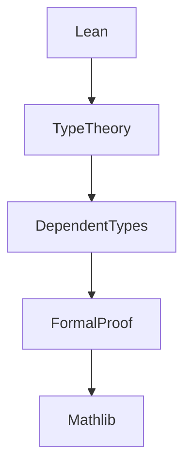

# 6.1 Lean Language and Formal Proof

[Back to Parent](../6-programming-languages-and-implementation.md) | [中文版](../6-编程语言与实现/6.1-lean语言与形式化证明.md)

## Table of Contents

- [6.1 Lean Language and Formal Proof](#61-lean-language-and-formal-proof)
  - [Table of Contents](#table-of-contents)
  - [6.1.1 Lean Language Panorama](#611-lean-language-panorama)
  - [6.1.2 Typical Formal Proofs](#612-typical-formal-proofs)
  - [6.1.3 Code Example](#613-code-example)
  - [6.1.4 References](#614-references)

---

## 6.1.1 Lean Language Panorama



## 6.1.2 Typical Formal Proofs

\[
\text{Commutativity of Addition: } \forall a, b \in \mathbb{N}, a + b = b + a
\]

```lean
-- Lean code: commutativity of addition
theorem add_comm (a b : ℕ) : a + b = b + a :=
  nat.add_comm a b
```

## 6.1.3 Code Example

```lean
-- Lean code: type definition
inductive List (α : Type)
| nil : List α
| cons : α → List α → List α
```

## 6.1.4 References

- "Lean 4 Theorem Proving"
- [Lean Community](https://leanprover-community.github.io/)
- TODO: More authoritative references

---

[Back to Tree](../0-Overview-and-Navigation/0.1-Global-Topic-Tree.md)
