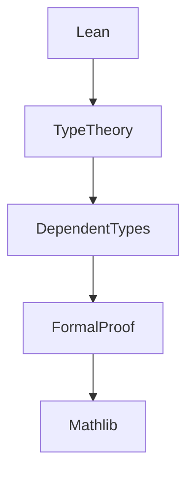

# 6.1 Lean语言与形式化证明

[返回上级](../6-编程语言与实现.md) | [English Version](../6-programming-languages-and-implementation/6.1-lean-language-and-formal-proof.md)

## 目录

- [6.1 Lean语言与形式化证明](#61-lean语言与形式化证明)
  - [目录](#目录)
  - [6.1.1 Lean 语言全景图](#611-lean-语言全景图)
  - [6.1.2 典型形式化证明](#612-典型形式化证明)
  - [6.1.3 代码示例](#613-代码示例)
  - [6.1.4 参考文献](#614-参考文献)

---

## 6.1.1 Lean 语言全景图



## 6.1.2 典型形式化证明

\[
\text{自然数加法交换律：} \forall a, b \in \mathbb{N}, a + b = b + a
\]

```lean
-- Lean 代码：加法交换律
theorem add_comm (a b : ℕ) : a + b = b + a :=
  nat.add_comm a b
```

## 6.1.3 代码示例

```lean
-- Lean 代码：类型定义
inductive List (α : Type)
| nil : List α
| cons : α → List α → List α
```

## 6.1.4 参考文献

- 《Lean 4 定理证明》
- [Lean Community](https://leanprover-community.github.io/)
- TODO: 更多权威文献

---

[返回目录](../0-总览与导航/0.1-全局主题树形目录.md)
