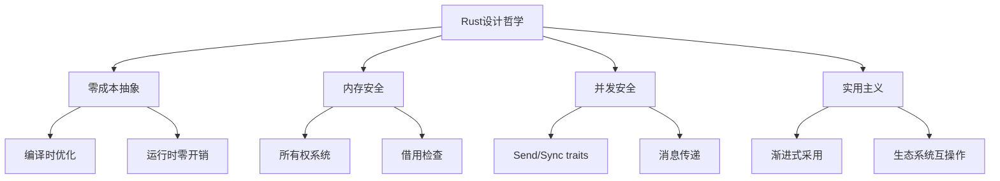
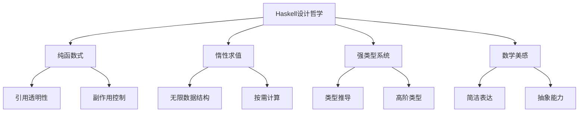
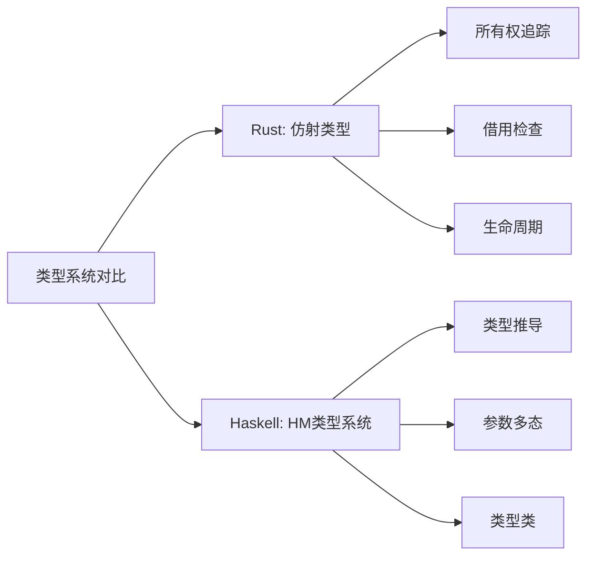
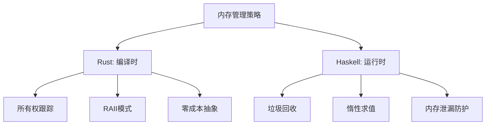
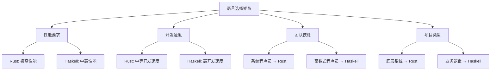

# 6.2 Rust、Haskell代码实践

[返回上级](../6-编程语言与实现.md) | [English Version](../6-programming-languages-and-implementation/6.2-rust-haskell-code-practice.md)

## 目录

- [6.2 Rust、Haskell代码实践](#62-rusthaskell代码实践)
  - [目录](#目录)
  - [6.2.1 现代编程语言设计哲学](#621-现代编程语言设计哲学)
    - [6.2.1.1 Rust的设计哲学](#6211-rust的设计哲学)
    - [6.2.1.2 Haskell的设计哲学](#6212-haskell的设计哲学)
    - [6.2.1.3 设计哲学对比](#6213-设计哲学对比)
  - [6.2.2 类型系统的理论与实践](#622-类型系统的理论与实践)
    - [6.2.2.1 Rust的类型系统](#6221-rust的类型系统)
    - [6.2.2.2 Haskell的类型系统](#6222-haskell的类型系统)
    - [6.2.2.3 类型系统对比分析](#6223-类型系统对比分析)
  - [6.2.3 内存管理与资源控制](#623-内存管理与资源控制)
    - [6.2.3.1 Rust的所有权模型](#6231-rust的所有权模型)
    - [6.2.3.2 Haskell的惰性内存管理](#6232-haskell的惰性内存管理)
    - [6.2.3.3 内存管理策略对比](#6233-内存管理策略对比)
  - [6.2.4 并发编程模型对比](#624-并发编程模型对比)
    - [6.2.4.1 Rust的并发模型](#6241-rust的并发模型)
    - [6.2.4.2 Haskell的并发模型](#6242-haskell的并发模型)
    - [6.2.4.3 并发模型对比](#6243-并发模型对比)
  - [6.2.5 函数式编程范式](#625-函数式编程范式)
    - [6.2.5.1 Rust中的函数式特性](#6251-rust中的函数式特性)
    - [6.2.5.2 Haskell的纯函数式编程](#6252-haskell的纯函数式编程)
    - [6.2.5.3 函数式模式对比](#6253-函数式模式对比)
  - [6.2.6 系统编程与抽象](#626-系统编程与抽象)
    - [6.2.6.1 Rust的系统编程能力](#6261-rust的系统编程能力)
    - [6.2.6.2 Haskell的抽象能力](#6262-haskell的抽象能力)
  - [6.2.7 工程实践与生态系统](#627-工程实践与生态系统)
    - [6.2.7.1 Rust生态系统](#6271-rust生态系统)
    - [6.2.7.2 Haskell工具链和生态](#6272-haskell工具链和生态)
    - [6.2.7.3 开发体验对比](#6273-开发体验对比)
  - [6.2.8 性能优化与高级特性](#628-性能优化与高级特性)
    - [6.2.8.1 Rust性能优化技巧](#6281-rust性能优化技巧)
    - [6.2.8.2 Haskell性能调优](#6282-haskell性能调优)
    - [6.2.8.3 跨语言性能对比](#6283-跨语言性能对比)
  - [6.2.9 总结与选择指南](#629-总结与选择指南)
    - [6.2.9.1 使用场景对比](#6291-使用场景对比)
    - [6.2.9.2 学习路径建议](#6292-学习路径建议)
    - [6.2.9.3 实际项目建议](#6293-实际项目建议)
  - [6.2.10 实用附录](#6210-实用附录)
    - [6.2.10.1 常用库和工具对比](#62101-常用库和工具对比)
    - [6.2.10.2 性能分析工具](#62102-性能分析工具)
    - [6.2.10.3 调试和错误处理模式](#62103-调试和错误处理模式)
  - [交叉引用](#交叉引用)
    - [相关主题](#相关主题)
    - [本地导航](#本地导航)
    - [参考文献](#参考文献)
      - [权威文献](#权威文献)
      - [在线资源](#在线资源)
      - [延伸阅读](#延伸阅读)

---

## 6.2.1 现代编程语言设计哲学

### 6.2.1.1 Rust的设计哲学

Rust语言的核心设计哲学可以总结为"零成本抽象、内存安全、并发安全"：



**Rust哲学的核心原则**：

1. **系统控制与安全性并存**：提供底层控制能力的同时保证内存安全
2. **性能无妥协**：抽象不应带来运行时开销
3. **并发友好**：从语言层面解决数据竞争问题
4. **错误可预防**：通过类型系统在编译时发现错误

```rust
// Rust哲学的代码体现
use std::thread;
use std::sync::mpsc;

fn rust_philosophy_demo() {
    // 零成本抽象：Iterator trait
    let numbers: Vec<i32> = (0..1_000_000)
        .filter(|&x| x % 2 == 0)  // 编译时优化为高效循环
        .map(|x| x * x)
        .collect();
    
    // 内存安全：所有权系统
    let data = vec![1, 2, 3, 4, 5];
    let result = process_data(data);  // data的所有权被转移
    // println!("{:?}", data);  // 编译错误：value used after move
    
    // 并发安全：类型系统保证
    let (tx, rx) = mpsc::channel();
    
    thread::spawn(move || {
        tx.send(42).unwrap();  // tx被移动到线程中
    });
    
    let received = rx.recv().unwrap();
    println!("Received: {}", received);
}

fn process_data(data: Vec<i32>) -> i32 {
    data.iter().sum()  // 安全地使用数据
}
```

### 6.2.1.2 Haskell的设计哲学

Haskell体现了纯函数式编程的理想：



**Haskell哲学的核心原则**：

1. **纯粹性**：函数无副作用，结果仅依赖输入
2. **不可变性**：数据结构默认不可变
3. **类型安全**：强大的类型系统捕获程序错误
4. **抽象性**：高级抽象简化复杂问题

```haskell
-- Haskell哲学的代码体现
module HaskellPhilosophy where

-- 纯函数：相同输入总是产生相同输出
factorial :: Integer -> Integer
factorial 0 = 1
factorial n = n * factorial (n - 1)

-- 惰性求值：无限数据结构
fibonacci :: [Integer]
fibonacci = 0 : 1 : zipWith (+) fibonacci (tail fibonacci)

-- 强类型系统：Maybe类型处理失败
safeDivide :: Double -> Double -> Maybe Double
safeDivide _ 0 = Nothing
safeDivide x y = Just (x / y)

-- 高阶函数：函数作为一等公民
applyTwice :: (a -> a) -> a -> a
applyTwice f x = f (f x)

-- 类型类：ad-hoc多态
class Summable a where
    zero :: a
    add :: a -> a -> a

instance Summable Int where
    zero = 0
    add = (+)

-- 函子：抽象的映射操作
instance Functor Maybe where
    fmap _ Nothing = Nothing
    fmap f (Just x) = Just (f x)
```

### 6.2.1.3 设计哲学对比

| 方面 | Rust | Haskell |
|------|------|---------|
| **主要关注** | 系统性能 + 安全性 | 数学正确性 + 抽象能力 |
| **内存管理** | 编译时所有权检查 | 垃圾回收 |
| **并发模型** | 共享状态 + 消息传递 | 软件事务内存 + 纯函数 |
| **错误处理** | Result类型 + panic | Maybe/Either + 异常 |
| **性能导向** | 零成本抽象 | 惰性求值优化 |

## 6.2.2 类型系统的理论与实践

### 6.2.2.1 Rust的类型系统

Rust采用仿射类型系统（Affine Type System），核心是所有权（Ownership）概念：

```rust
// 所有权的三大规则演示
fn ownership_rules() {
    // 规则1：每个值都有一个所有者
    let s1 = String::from("hello");  // s1是字符串的所有者
    
    // 规则2：同一时间只能有一个所有者
    let s2 = s1;  // 所有权从s1转移到s2
    // println!("{}", s1);  // 编译错误：s1不再有效
    
    // 规则3：当所有者离开作用域，值被释放
} // s2在此处被自动释放

// 借用系统：引用而不获取所有权
fn borrowing_system() {
    let s1 = String::from("hello");
    
    let len = calculate_length(&s1);  // 借用s1
    println!("The length of '{}' is {}.", s1, len);  // s1仍然有效
}

fn calculate_length(s: &String) -> usize {  // 借用参数
    s.len()
}  // s离开作用域，但不释放内存（因为不拥有）

// 可变借用：独占访问保证
fn mutable_borrowing() {
    let mut s = String::from("hello");
    
    change(&mut s);  // 可变借用
    println!("{}", s);
}

fn change(some_string: &mut String) {
    some_string.push_str(", world");
}
```

**生命周期标注**：

```rust
// 生命周期确保引用有效性
fn longest<'a>(x: &'a str, y: &'a str) -> &'a str {
    if x.len() > y.len() {
        x
    } else {
        y
    }
}

// 复杂生命周期场景
struct ImportantExcerpt<'a> {
    part: &'a str,
}

impl<'a> ImportantExcerpt<'a> {
    fn level(&self) -> i32 {
        3
    }
    
    fn announce_and_return_part(&self, announcement: &str) -> &str {
        println!("Attention please: {}", announcement);
        self.part  // 返回引用的生命周期与self相同
    }
}
```

### 6.2.2.2 Haskell的类型系统

Haskell使用Hindley-Milner类型系统，支持类型推导和参数多态：

```haskell
-- 类型推导示例
identity x = x  -- 推导出类型: identity :: a -> a

map' _ [] = []
map' f (x:xs) = f x : map' f xs
-- 推导出类型: map' :: (a -> b) -> [a] -> [b]

-- 代数数据类型
data Tree a = Empty 
            | Node a (Tree a) (Tree a)
            deriving (Show, Eq)

-- 模式匹配
treeSize :: Tree a -> Int
treeSize Empty = 0
treeSize (Node _ left right) = 1 + treeSize left + treeSize right

-- 类型类：接口抽象
class Eq a where
    (==) :: a -> a -> Bool
    (/=) :: a -> a -> Bool
    -- 默认实现
    x /= y = not (x == y)

-- 类型类实例
instance Eq a => Eq (Tree a) where
    Empty == Empty = True
    (Node x l1 r1) == (Node y l2 r2) = x == y && l1 == l2 && r1 == r2
    _ == _ = False
```

**高级类型特性**：

```haskell
-- 高阶类型：类型的类型
class Functor f where
    fmap :: (a -> b) -> f a -> f b

-- Monad：计算上下文的抽象
class Functor m => Monad m where
    return :: a -> m a
    (>>=) :: m a -> (a -> m b) -> m b

-- Maybe Monad：处理可能失败的计算
instance Monad Maybe where
    return = Just
    Nothing >>= _ = Nothing
    (Just x) >>= f = f x

-- do语法糖
safeComputation :: Int -> Int -> Maybe Int
safeComputation x y = do
    a <- safeDivide x 2
    b <- safeDivide y 3
    return (a + b)
  where
    safeDivide n d = if d == 0 then Nothing else Just (n `div` d)
```

### 6.2.2.3 类型系统对比分析



| 特性 | Rust | Haskell |
|------|------|---------|
| **线程模型** | OS线程 + 异步任务 | 绿色线程 |
| **共享状态** | Arc + Mutex/RwLock | STM |
| **消息传递** | Channel (mpsc) | MVar + Chan |
| **数据竞争防护** | 编译时检查 | STM原子性 |
| **性能** | 零成本抽象 | 轻量级线程切换 |
| **可组合性** | 适中 | 极高（STM） |

**高级并发模式**：

```rust
// Rust: 工作窃取任务调度
use rayon::prelude::*;

fn parallel_processing() {
    let numbers: Vec<i32> = (0..1_000_000).collect();
    
    // 并行迭代器
    let sum: i32 = numbers
        .par_iter()
        .filter(|&&x| x % 2 == 0)
        .map(|&x| x * x)
        .sum();
    
    println!("Parallel sum: {}", sum);
}

// Actor模型实现
use tokio::sync::mpsc;
use tokio::time::{sleep, Duration};

struct Actor {
    receiver: mpsc::Receiver<Message>,
}

enum Message {
    Process(i32),
    Stop,
}

impl Actor {
    async fn run(mut self) {
        while let Some(msg) = self.receiver.recv().await {
            match msg {
                Message::Process(value) => {
                    println!("Processing: {}", value);
                    sleep(Duration::from_millis(100)).await;
                }
                Message::Stop => break,
            }
        }
    }
}
```

```haskell
-- Haskell: 响应式编程
import Control.Concurrent.Async
import Control.Exception

-- 异步组合子
asyncExample :: IO ()
asyncExample = do
    a1 <- async (compute 10)
    a2 <- async (compute 20)
    a3 <- async (compute 30)
    
    -- 等待最快的完成
    (_, result) <- waitAnyCancel [a1, a2, a3]
    print result
  where
    compute n = do
        threadDelay (n * 100000)
        return (n * n)

-- 资源安全的并发
bracket_ :: IO a -> IO b -> IO c -> IO c
bracket_ before after action = mask $ \restore -> do
    before
    result <- restore action `onException` after
    after
    return result

-- 并发数据结构：无锁算法
import Data.IORef
import Control.Monad

lockFreeCounter :: IO (IO (), IO Int)
lockFreeCounter = do
    ref <- newIORef 0
    let increment = atomicModifyIORef' ref (\x -> (x + 1, ()))
    let read_val = readIORef ref
    return (increment, read_val)
```

|------|------|---------|
| **类型推导** | 局部推导 | 全局推导 |
| **多态性** | 泛型 + Trait | 参数多态 + 类型类 |
| **内存安全** | 编译时所有权 | 垃圾回收 |
| **副作用控制** | unsafe块 | Monad |
| **错误处理** | Result<T, E> | Maybe/Either |

## 6.2.3 内存管理与资源控制

### 6.2.3.1 Rust的所有权模型

Rust通过所有权系统实现确定性资源管理：

```rust
use std::rc::Rc;
use std::cell::RefCell;

// RAII：资源获取即初始化
struct FileHandle {
    filename: String,
}

impl FileHandle {
    fn new(filename: &str) -> Self {
        println!("Opening file: {}", filename);
        FileHandle {
            filename: filename.to_string(),
        }
    }
}

impl Drop for FileHandle {
    fn drop(&mut self) {
        println!("Closing file: {}", self.filename);
    }
}

// 智能指针：共享所有权
fn shared_ownership_example() {
    let data = Rc::new(RefCell::new(vec![1, 2, 3]));
    
    let data1 = Rc::clone(&data);
    let data2 = Rc::clone(&data);
    
    // 内部可变性：运行时借用检查
    data1.borrow_mut().push(4);
    
    println!("Data: {:?}", data2.borrow());
}

// 零成本抽象：Iterator
fn zero_cost_abstraction() {
    let numbers: Vec<i32> = (0..1_000_000)
        .filter(|&x| x % 2 == 0)
        .map(|x| x * x)
        .take(1000)
        .collect();
    
    // 编译后等价于优化的for循环
}
```

**内存布局控制**：

```rust
use std::mem;

// 内存对齐和大小控制
#[repr(C)]
struct Point {
    x: f64,
    y: f64,
}

#[repr(packed)]
struct PackedStruct {
    a: u8,
    b: u32,
}

fn memory_layout() {
    println!("Point size: {}", mem::size_of::<Point>());
    println!("PackedStruct size: {}", mem::size_of::<PackedStruct>());
    
    // 内存对齐
    println!("Point alignment: {}", mem::align_of::<Point>());
}
```

### 6.2.3.2 Haskell的惰性内存管理

Haskell使用惰性求值和垃圾回收：

```haskell
-- 惰性求值：按需计算
lazyExample :: [Int]
lazyExample = [1..1000000]  -- 不会立即分配内存

-- 无限数据结构
naturals :: [Int]
naturals = [1..]

primes :: [Int]
primes = sieve [2..]
  where
    sieve (p:xs) = p : sieve [x | x <- xs, x `mod` p /= 0]

-- 惰性IO：处理大文件而不载入内存
processLargeFile :: FilePath -> IO ()
processLargeFile path = do
    contents <- readFile path  -- 惰性读取
    let result = process (lines contents)
    writeFile "output.txt" (unlines result)
  where
    process = map (take 10)  -- 只处理每行前10个字符

-- 严格求值控制
strictSum :: [Int] -> Int
strictSum = foldl' (+) 0  -- foldl'是严格版本

-- Bang模式：强制求值
data StrictPair a b = StrictPair !a !b

-- 内存分析工具
{-# LANGUAGE BangPatterns #-}
sumWithBang :: [Int] -> Int
sumWithBang = go 0
  where
    go !acc [] = acc
    go !acc (x:xs) = go (acc + x) xs

-- 高效数据结构
import qualified Data.Sequence as Seq
import qualified Data.IntMap as IntMap

efficientOperations :: IO ()
efficientOperations = do
    -- Sequence：高效的序列操作
    let seq1 = Seq.fromList [1..1000]
    let seq2 = seq1 Seq.|> 1001  -- O(1)追加
    
    -- IntMap：高效的整数键映射
    let imap = IntMap.fromList [(i, i*i) | i <- [1..1000]]
    print $ IntMap.lookup 500 imap
```

### 6.2.3.3 内存管理策略对比



## 6.2.4 并发编程模型对比

### 6.2.4.1 Rust的并发模型

Rust提供多种并发原语，通过类型系统保证线程安全：

```rust
use std::sync::{Arc, Mutex, mpsc};
use std::thread;
use std::time::Duration;

// 共享状态并发：Arc + Mutex
fn shared_state_concurrency() {
    let counter = Arc::new(Mutex::new(0));
    let mut handles = vec![];
    
    for _ in 0..10 {
        let counter = Arc::clone(&counter);
        let handle = thread::spawn(move || {
            for _ in 0..1000 {
                let mut num = counter.lock().unwrap();
                *num += 1;
            }
        });
        handles.push(handle);
    }
    
    for handle in handles {
        handle.join().unwrap();
    }
    
    println!("Result: {}", *counter.lock().unwrap());
}

// 消息传递并发：Channel
fn message_passing_concurrency() {
    let (tx, rx) = mpsc::channel();
    
    thread::spawn(move || {
        let vals = vec![
            String::from("hi"),
            String::from("from"),
            String::from("the"),
            String::from("thread"),
        ];
        
        for val in vals {
            tx.send(val).unwrap();
            thread::sleep(Duration::from_secs(1));
        }
    });
    
    for received in rx {
        println!("Got: {}", received);
    }
}

// Send + Sync traits：编译时线程安全保证
fn send_sync_example<T: Send + Sync + 'static>(data: T) {
    thread::spawn(move || {
        // 可以安全地在线程间传递T
        println!("Processing data in thread");
    });
}
```

**异步编程**：

```rust
use tokio;
use futures::future::join_all;

#[tokio::main]
async fn async_example() {
    let tasks: Vec<_> = (0..10)
        .map(|i| tokio::spawn(async move {
            tokio::time::sleep(Duration::from_millis(100)).await;
            i * 2
        }))
        .collect();
    
    let results = join_all(tasks).await;
    
    for result in results {
        println!("Result: {:?}", result.unwrap());
    }
}
```

### 6.2.4.2 Haskell的并发模型

Haskell使用轻量级线程和软件事务内存：

```haskell
import Control.Concurrent
import Control.Concurrent.STM
import Control.Monad

-- 轻量级线程（Green Threads）
concurrentExample :: IO ()
concurrentExample = do
    putStrLn "Starting concurrent operations"
    
    -- 创建MVar用于同步
    mvar <- newEmptyMVar
    
    -- 启动工作线程
    forkIO $ do
        threadDelay 1000000  -- 1秒
        putMVar mvar "Hello from thread!"
    
    -- 等待结果
    result <- takeMVar mvar
    putStrLn result

-- 软件事务内存（STM）
bankAccount :: IO ()
bankAccount = do
    account1 <- newTVarIO 1000
    account2 <- newTVarIO 500
    
    -- 原子性转账操作
    atomically $ transfer 200 account1 account2
    
    balance1 <- readTVarIO account1
    balance2 <- readTVarIO account2
    putStrLn $ "Account1: " ++ show balance1
    putStrLn $ "Account2: " ++ show balance2

transfer :: Int -> TVar Int -> TVar Int -> STM ()
transfer amount from to = do
    fromBalance <- readTVar from
    when (fromBalance < amount) retry  -- 自动重试
    
    writeTVar from (fromBalance - amount)
    toBalance <- readTVar to
    writeTVar to (toBalance + amount)

-- Par Monad：确定性并行
parallelComputation :: Int
parallelComputation = runPar $ do
    [a, b, c, d] <- mapM spawnP [f 1, f 2, f 3, f 4]
    as <- get a
    bs <- get b
    cs <- get c
    ds <- get d
    return (as + bs + cs + ds)
  where
    f x = sum [1..x*1000000]
```

### 6.2.4.3 并发模型对比

| 特性 | Rust | Haskell |
|------|------|---------|
| **线程模型** | OS线程 + 异步任务 | 绿色线程 |
| **同步原语** | Mutex, RwLock, Channel | STM, MVar, Chan |
| **安全保证** | 编译时Send/Sync | 运行时类型安全 |
| **错误处理** | 显式错误处理 | 异常机制 |
| **性能特点** | 零运行时开销 | GC暂停影响 |

## 6.2.5 函数式编程范式

### 6.2.5.1 Rust中的函数式特性

Rust虽然不是纯函数式语言，但提供了丰富的函数式编程支持：

```rust
// 高阶函数和闭包
fn functional_rust() {
    let numbers = vec![1, 2, 3, 4, 5];
    
    // 链式操作
    let result: Vec<i32> = numbers
        .iter()
        .filter(|&&x| x > 2)
        .map(|&x| x * x)
        .collect();
    
    println!("{:?}", result);  // [9, 16, 25]
}

// 闭包和环境捕获
fn closure_example() {
    let factor = 2;
    
    let multiply = |x| x * factor;  // 捕获环境
    let add_and_multiply = move |x, y| multiply(x + y);  // 移动捕获
    
    let result = add_and_multiply(3, 4);
    println!("Result: {}", result);
}

// 函数式错误处理
fn functional_error_handling() -> Result<i32, String> {
    let numbers = vec!["1", "2", "3", "invalid", "5"];
    
    let sum: Result<i32, _> = numbers
        .iter()
        .map(|s| s.parse::<i32>())
        .collect::<Result<Vec<_>, _>>()
        .map(|vec| vec.iter().sum());
    
    sum.map_err(|e| format!("Parse error: {}", e))
}

// Option和Result的函数式组合
fn option_combinators() {
    let x = Some(5);
    let y = Some(3);
    
    let result = x
        .and_then(|a| y.map(|b| a + b))
        .filter(|&sum| sum > 7)
        .map(|sum| sum * 2);
    
    println!("{:?}", result);  // Some(16)
}
```

### 6.2.5.2 Haskell的纯函数式编程

Haskell作为纯函数式语言，展示了函数式编程的完整威力：

```haskell
-- 递归和模式匹配
quicksort :: Ord a => [a] -> [a]
quicksort [] = []
quicksort (x:xs) = 
    let smaller = quicksort [a | a <- xs, a <= x]
        bigger = quicksort [a | a <- xs, a > x]
    in smaller ++ [x] ++ bigger

-- 高阶函数组合
compose :: [a -> a] -> a -> a
compose = foldr (.) id

pipeline :: Int -> Int
pipeline = compose [(*2), (+3), abs, subtract 10]

-- 柯里化和部分应用
add :: Int -> Int -> Int
add x y = x + y

addTen :: Int -> Int
addTen = add 10  -- 部分应用

-- 列表推导式
pythagoreanTriples :: Int -> [(Int, Int, Int)]
pythagoreanTriples n = 
    [(a, b, c) | c <- [1..n], 
                 b <- [1..c], 
                 a <- [1..b], 
                 a^2 + b^2 == c^2]

-- Monoid：结合性运算
newtype Sum a = Sum { getSum :: a }

instance Num a => Monoid (Sum a) where
    mempty = Sum 0
    mappend (Sum x) (Sum y) = Sum (x + y)

-- 使用fold进行聚合
sumAll :: [Int] -> Int
sumAll = getSum . foldMap Sum
```

### 6.2.5.3 函数式模式对比

```rust
// Rust: Iterator pattern
fn rust_functional_style() {
    let data = vec![1, 2, 3, 4, 5];
    
    let result = data
        .into_iter()
        .map(|x| x * 2)
        .filter(|&x| x > 4)
        .fold(0, |acc, x| acc + x);
    
    println!("Sum: {}", result);
}
```

```haskell
-- Haskell: 同样的逻辑，更简洁
haskellFunctionalStyle :: [Int] -> Int
haskellFunctionalStyle data' = 
    sum . filter (> 4) . map (*2) $ data'
```

## 6.2.6 系统编程与抽象

### 6.2.6.1 Rust的系统编程能力

Rust在保持高级抽象的同时提供底层控制：

```rust
use std::mem;
use std::ptr;
use std::slice;

// 内存布局控制
#[repr(C)]
struct CStruct {
    a: u32,
    b: u16,
    c: u8,
}

// 不安全代码：直接内存操作
unsafe fn raw_memory_operations() {
    let mut data = vec![1u8, 2, 3, 4, 5];
    let ptr = data.as_mut_ptr();
    
    // 直接写入内存
    ptr::write(ptr.offset(2), 99);
    
    // 从原始指针创建切片
    let slice = slice::from_raw_parts(ptr, 5);
    println!("Modified data: {:?}", slice);
}

// FFI：与C语言互操作
extern "C" {
    fn malloc(size: usize) -> *mut u8;
    fn free(ptr: *mut u8);
}

// 零成本包装器
struct SafeBuffer {
    ptr: *mut u8,
    size: usize,
}

impl SafeBuffer {
    unsafe fn new(size: usize) -> Option<Self> {
        let ptr = malloc(size);
        if ptr.is_null() {
            None
        } else {
            Some(SafeBuffer { ptr, size })
        }
    }
}

impl Drop for SafeBuffer {
    fn drop(&mut self) {
        unsafe {
            free(self.ptr);
        }
    }
}
```

**内联汇编**：

```rust
use std::arch::asm;

fn inline_assembly_example() {
    let mut x: u64 = 3;
    unsafe {
        asm!(
            "mov {tmp}, {x}",
            "shl {tmp}, 1",
            "shl {x}, 2",
            "add {x}, {tmp}",
            x = inout(reg) x,
            tmp = out(reg) _,
        );
    }
    println!("Result: {}", x);  // x * 4 + x * 2 = x * 6
}
```

### 6.2.6.2 Haskell的抽象能力

Haskell通过类型系统和抽象机制简化复杂问题：

```haskell
-- 类型级编程
{-# LANGUAGE DataKinds, TypeFamilies, GADTs #-}

-- 向量类型，在类型层面保证长度
data Nat = Zero | Succ Nat

data Vec (n :: Nat) a where
    VNil :: Vec 'Zero a
    VCons :: a -> Vec n a -> Vec ('Succ n) a

-- 类型安全的向量操作
vhead :: Vec ('Succ n) a -> a
vhead (VCons x _) = x

vtail :: Vec ('Succ n) a -> Vec n a
vtail (VCons _ xs) = xs

-- Free Monad：可组合的DSL
data ProgramF a = 
    GetLine (String -> a)
  | PutLine String a
  
instance Functor ProgramF where
    fmap f (GetLine k) = GetLine (f . k)
    fmap f (PutLine s a) = PutLine s (f a)

type Program = Free ProgramF

getLine' :: Program String
getLine' = Free (GetLine Pure)

putLine' :: String -> Program ()
putLine' s = Free (PutLine s (Pure ()))

-- Lens：函数式字段访问
type Lens s t a b = forall f. Functor f => (a -> f b) -> s -> f t

_1 :: Lens (a, c) (b, c) a b
_1 f (a, c) = fmap (\b -> (b, c)) (f a)

-- 使用Lens进行更新
over :: Lens s t a b -> (a -> b) -> s -> t
over lens f s = runIdentity (lens (Identity . f) s)
```

## 6.2.7 工程实践与生态系统

### 6.2.7.1 Rust生态系统

Rust拥有丰富的包管理和工具链：

```toml
# Cargo.toml - 项目配置
[package]
name = "rust-project"
version = "0.1.0"
edition = "2021"

[dependencies]
tokio = { version = "1.0", features = ["full"] }
serde = { version = "1.0", features = ["derive"] }
clap = { version = "4.0", features = ["derive"] }

[dev-dependencies]
criterion = "0.4"

[[bin]]
name = "main"
path = "src/main.rs"

[[bench]]
name = "benchmark"
harness = false
```

```rust
// 项目结构和模块系统
mod network {
    pub mod tcp {
        pub fn connect() { /* ... */ }
    }
    
    pub mod http {
        use super::tcp;
        
        pub fn request() {
            tcp::connect();
        }
    }
}

// 条件编译和特性门控
#[cfg(feature = "async")]
async fn async_operation() {
    // 异步实现
}

#[cfg(not(feature = "async"))]
fn async_operation() {
    // 同步实现
}

// 属性宏和过程宏
use serde::{Serialize, Deserialize};

#[derive(Serialize, Deserialize, Debug)]
struct Config {
    name: String,
    port: u16,
    #[serde(default)]
    debug: bool,
}
```

### 6.2.7.2 Haskell工具链和生态

Haskell使用Cabal和Stack进行包管理：

```cabal
-- project.cabal
cabal-version: 2.2
name: haskell-project
version: 0.1.0.0

library
  exposed-modules: 
    MyLib
    MyLib.Utils
  other-modules:
    MyLib.Internal
  build-depends:
    base ^>=4.14,
    containers,
    text,
    mtl
  hs-source-dirs: src
  default-language: Haskell2010

executable haskell-project
  main-is: Main.hs
  build-depends:
    base,
    haskell-project
  hs-source-dirs: app
  default-language: Haskell2010
```

```haskell
-- 模块系统和导入
module MyLib (
    -- 导出列表
    MyType(..),
    myFunction,
    myOtherFunction
) where

import qualified Data.Map as Map
import Data.Text (Text)
import Control.Monad.Reader

-- 类型导出
data MyType = Constructor1 | Constructor2
    deriving (Show, Eq)

-- 函数实现
myFunction :: Int -> Int
myFunction x = x + 1

-- 使用类型类约束
myOtherFunction :: (Monad m) => a -> m a
myOtherFunction = return
```

### 6.2.7.3 开发体验对比

| 方面 | Rust | Haskell |
|------|------|---------|
| **编译速度** | 较慢但在改进 | 中等 |
| **错误信息** | 详细且有帮助 | 有时晦涩 |
| **IDE支持** | rust-analyzer | HLS |
| **包管理** | Cargo (优秀) | Cabal/Stack |
| **测试框架** | 内置 + 第三方 | QuickCheck + HUnit |
| **文档生成** | rustdoc | Haddock |

## 6.2.8 性能优化与高级特性

### 6.2.8.1 Rust性能优化技巧

**零拷贝和内存优化**：

```rust
use std::borrow::Cow;
use std::mem;

// 零拷贝字符串处理
fn process_string(input: &str) -> Cow<str> {
    if input.contains("old") {
        Cow::Owned(input.replace("old", "new"))
    } else {
        Cow::Borrowed(input)  // 无需分配
    }
}

// 内存布局优化
#[repr(C)]
struct OptimizedStruct {
    flag: bool,    // 1 byte
    value: u64,    // 8 bytes, 对齐到8字节边界
    data: u32,     // 4 bytes
}

// 避免不必要的克隆
fn efficient_processing(data: &[String]) -> Vec<&str> {
    data.iter()
        .filter(|s| s.len() > 5)
        .map(|s| s.as_str())  // 借用而非克隆
        .collect()
}

// 使用迭代器适配器进行惰性计算
fn lazy_computation(numbers: &[i32]) -> impl Iterator<Item = i32> + '_ {
    numbers
        .iter()
        .filter(|&&x| x > 0)
        .map(|&x| x * 2)
        .take(1000)
    // 只在需要时计算
}
```

**并行优化**：

```rust
use rayon::prelude::*;
use std::sync::atomic::{AtomicUsize, Ordering};

// 数据并行处理
fn parallel_matrix_multiply(a: &[Vec<f64>], b: &[Vec<f64>]) -> Vec<Vec<f64>> {
    let n = a.len();
    let m = b[0].len();
    
    (0..n).into_par_iter().map(|i| {
        (0..m).into_par_iter().map(|j| {
            (0..a[i].len()).map(|k| a[i][k] * b[k][j]).sum()
        }).collect()
    }).collect()
}

// 无锁编程
fn lockfree_counter() -> (impl Fn() -> usize, impl Fn()) {
    let counter = AtomicUsize::new(0);
    let counter_clone = counter.clone();
    
    let increment = move || {
        counter.fetch_add(1, Ordering::Relaxed)
    };
    
    let get_value = move || {
        counter_clone.load(Ordering::Relaxed)
    };
    
    (increment, get_value)
}
```

**编译器优化提示**：

```rust
// 内联优化
#[inline(always)]
fn hot_function(x: i32) -> i32 {
    x * x + x + 1
}

// 分支预测优化
fn branch_prediction(condition: bool, data: &[i32]) -> i32 {
    if likely(condition) {  // 提示编译器这个分支更可能
        data.iter().sum()
    } else {
        0
    }
}

// 预取内存
use std::intrinsics;

unsafe fn prefetch_data(ptr: *const u8) {
    intrinsics::prefetch_read_data(ptr, 3);  // 预取到L3缓存
}

// SIMD优化
#[cfg(target_arch = "x86_64")]
use std::arch::x86_64::*;

#[target_feature(enable = "avx2")]
unsafe fn simd_sum(data: &[f32]) -> f32 {
    let mut sum = _mm256_setzero_ps();
    
    for chunk in data.chunks_exact(8) {
        let values = _mm256_loadu_ps(chunk.as_ptr());
        sum = _mm256_add_ps(sum, values);
    }
    
    // 水平求和
    let sum_array: [f32; 8] = std::mem::transmute(sum);
    sum_array.iter().sum()
}
```

### 6.2.8.2 Haskell性能调优

**严格性分析和优化**：

```haskell
{-# LANGUAGE BangPatterns #-}
import Control.DeepSeq
import Data.List (foldl')

-- 严格求值避免空间泄漏
strictFoldl :: (Num a, NFData a) => [a] -> a
strictFoldl = foldl' (\acc x -> force (acc + x)) 0

-- Bang模式强制求值
data StrictList a = StrictNil | StrictCons !a !(StrictList a)

-- 尾递归优化
factorial :: Integer -> Integer
factorial n = go n 1
  where
    go 0 !acc = acc
    go k !acc = go (k - 1) (acc * k)

-- Worker-wrapper模式
fibonacci :: Int -> Integer
fibonacci n = fibWorker n 0 1
  where
    fibWorker 0 a _ = a
    fibWorker 1 _ b = b
    fibWorker k a b = fibWorker (k-1) b (a+b)
```

**高效数据结构**：

```haskell
import qualified Data.Vector as V
import qualified Data.Vector.Unboxed as UV
import qualified Data.ByteString as BS
import qualified Data.Text as T

-- 向量化计算
vectorSum :: UV.Vector Double -> Double
vectorSum = UV.sum  -- 高度优化的SIMD实现

-- 字节串处理
efficientByteProcessing :: BS.ByteString -> BS.ByteString
efficientByteProcessing = BS.filter (> 65) . BS.map (+1)

-- 文本处理优化
textProcessing :: T.Text -> T.Text
textProcessing = T.toUpper . T.filter (/= ' ')

-- 差分列表避免O(n²)连接
type DList a = [a] -> [a]

toDList :: [a] -> DList a
toDList xs = (xs ++)

fromDList :: DList a -> [a]
fromDList dl = dl []

append :: DList a -> DList a -> DList a
append dl1 dl2 = dl1 . dl2
```

**并行和并发优化**：

```haskell
import Control.Parallel.Strategies
import Control.Parallel

-- 数据并行策略
parallelMap :: (a -> b) -> [a] -> [b]
parallelMap f xs = map f xs `using` parList rdeepseq

-- Spark注解进行细粒度并行控制
parallelCompute :: [Int] -> Int
parallelCompute xs = 
    let evens = filter even xs `spark`
        odds = filter odd xs
    in sum evens + sum odds

-- 并行fold
parallelFold :: (a -> a -> a) -> a -> [a] -> a
parallelFold f z xs = 
    foldr f z xs `using` parList (rpar `dot` rdeepseq)
```

### 6.2.8.3 跨语言性能对比

**基准测试框架**：

```rust
// Rust: Criterion基准测试
use criterion::{black_box, criterion_group, criterion_main, Criterion};

fn fibonacci_bench(c: &mut Criterion) {
    c.bench_function("fibonacci 20", |b| {
        b.iter(|| fibonacci(black_box(20)))
    });
}

fn benchmark_sorting(c: &mut Criterion) {
    let mut data: Vec<i32> = (0..10000).rev().collect();
    
    c.bench_function("sort 10k elements", |b| {
        b.iter(|| {
            let mut data_copy = data.clone();
            data_copy.sort();
            black_box(data_copy)
        })
    });
}

criterion_group!(benches, fibonacci_bench, benchmark_sorting);
criterion_main!(benches);
```

```haskell
-- Haskell: Criterion基准测试
import Criterion.Main
import qualified Data.Vector as V

main :: IO ()
main = defaultMain [
    bgroup "fibonacci" [ bench "fib 35" $ whnf fibonacci 35 ],
    bgroup "sorting" [
        bench "sort list" $ nf sort [10000,9999..1],
        bench "sort vector" $ nf V.modify (V.sort) (V.enumFromThenTo 10000 9999 1)
    ]
]

-- 性能分析标记
{-# SCC "critical_section" #-}
criticalComputation :: [Int] -> Int
criticalComputation = sum . map (*2) . filter even
```

**内存使用对比**：

| 操作类型 | Rust | Haskell | 说明 |
|----------|------|---------|------|
| **栈分配** | 确定性 | 延迟分配 | Rust编译时确定 |
| **堆分配** | 手动控制 | GC管理 | Rust零开销抽象 |
| **内存碎片** | 可控 | GC处理 | Rust可预测性更好 |
| **缓存效率** | 高 | 中等 | Rust数据布局可控 |

## 6.2.9 总结与选择指南

### 6.2.9.1 使用场景对比

**选择Rust的场景**：

1. **系统编程**：操作系统、驱动程序、嵌入式系统
2. **高性能服务**：Web服务器、数据库、游戏引擎
3. **安全关键**：加密库、安全工具、区块链
4. **WebAssembly应用**：浏览器高性能计算
5. **性能敏感应用**：科学计算、实时系统

**选择Haskell的场景**：

1. **复杂业务逻辑**：金融建模、保险精算
2. **编译器和解释器**：DSL设计、程序分析
3. **数据处理和分析**：ETL管道、机器学习
4. **并发和分布式系统**：高可用服务
5. **原型开发和研究**：算法验证、快速迭代

**性能和开发效率权衡**：



### 6.2.9.2 学习路径建议

**Rust学习路径（适合系统程序员）**：

1. **基础阶段**（2-4周）
   - 所有权和借用检查器概念
   - 基础语法和模式匹配
   - 错误处理（Result和Option）

2. **中级阶段**（4-8周）
   - Trait系统和泛型编程
   - 生命周期标注
   - 并发编程模型

3. **高级阶段**（8-12周）
   - Unsafe Rust和FFI
   - 宏系统和元编程
   - 异步编程（async/await）

4. **专业应用**（持续学习）
   - 特定领域框架（Web、游戏、嵌入式）
   - 性能优化技巧
   - 贡献开源项目

**Haskell学习路径（适合数学背景）**：

1. **函数式思维**（3-6周）
   - 纯函数和不可变性
   - 递归和列表处理
   - 高阶函数概念

2. **类型系统掌握**（4-8周）
   - 类型推导和多态
   - 代数数据类型
   - 类型类系统

3. **Monad理解**（6-10周）
   - Functor和Applicative
   - 常用Monad（Maybe、Either、IO）
   - Monad变换器

4. **高级特性**（持续深入）
   - 惰性求值优化
   - 并发和并行编程
   - 高级类型特性（GADTs、类型族）

**跨语言技能转移**：

| 从其他语言转向 | Rust | Haskell |
|----------------|------|---------|
| **C/C++** | 容易（相似的控制） | 困难（范式差异大） |
| **Java/C#** | 中等（需学习所有权） | 中等（需学习函数式） |
| **Python/JavaScript** | 困难（类型系统） | 中等（抽象程度相近） |
| **Go** | 容易（类似理念） | 困难（范式完全不同） |
| **Scala** | 中等 | 容易（函数式基础） |

### 6.2.9.3 实际项目建议

**Rust项目实践**：

```rust
// 推荐项目1：CLI工具
use clap::Parser;
use std::fs;

#[derive(Parser)]
struct Args {
    #[arg(short, long)]
    input: String,
    #[arg(short, long)]
    output: String,
}

fn main() -> Result<(), Box<dyn std::error::Error>> {
    let args = Args::parse();
    
    let content = fs::read_to_string(&args.input)?;
    let processed = process_text(&content);
    fs::write(&args.output, processed)?;
    
    Ok(())
}

// 推荐项目2：Web API服务
use warp::Filter;

#[tokio::main]
async fn main() {
    let hello = warp::path!("hello" / String)
        .map(|name| format!("Hello, {}!", name));
    
    warp::serve(hello)
        .run(([127, 0, 0, 1], 3030))
        .await;
}
```

**Haskell项目实践**：

```haskell
-- 推荐项目1：数据分析工具
import qualified Data.ByteString.Lazy as L
import Data.Csv
import qualified Data.Vector as V

main :: IO ()
main = do
    csvData <- L.readFile "data.csv"
    case decode NoHeader csvData of
        Left err -> putStrLn err
        Right records -> do
            let analysis = analyzeData records
            print analysis

-- 推荐项目2：解析器组合子
import Text.Parsec
import Text.Parsec.String (Parser)

data Expr = Num Int | Add Expr Expr | Mul Expr Expr
    deriving Show

parseExpr :: Parser Expr
parseExpr = parseAdd

parseAdd :: Parser Expr
parseAdd = do
    first <- parseMul
    rest <- many (char '+' >> parseMul)
    return $ foldl Add first rest
```

## 6.2.10 实用附录

### 6.2.10.1 常用库和工具对比

**Rust生态系统核心库**：

| 用途 | 库名 | 描述 | 示例 |
|------|------|------|------|
| **序列化** | serde | 高性能序列化框架 | `#[derive(Serialize)]` |
| **异步运行时** | tokio | 异步运行时和网络库 | `#[tokio::main]` |
| **CLI解析** | clap | 命令行参数解析 | `#[derive(Parser)]` |
| **错误处理** | anyhow/thiserror | 错误处理增强 | `Result<T, anyhow::Error>` |
| **HTTP客户端** | reqwest | HTTP客户端库 | `reqwest::get(url).await` |
| **数据库** | sqlx | 异步SQL工具包 | 编译时SQL验证 |
| **并行计算** | rayon | 数据并行库 | `par_iter()` |

**Haskell生态系统核心库**：

| 用途 | 库名 | 描述 | 示例 |
|------|------|------|------|
| **Web框架** | servant | 类型安全API框架 | 类型级API规范 |
| **JSON处理** | aeson | JSON编解码 | `FromJSON`/`ToJSON` |
| **并发** | async | 异步操作库 | `async`/`wait` |
| **解析** | parsec/megaparsec | 解析器组合子 | `Parser a` |
| **数据库** | persistent | 类型安全ORM | 代码生成 |
| **测试** | QuickCheck | 属性测试 | 随机测试用例 |
| **镜头** | lens | 函数式数据访问 | `view`/`set` |

### 6.2.10.2 性能分析工具

**Rust性能分析**：

```rust
// 内存分析
use std::alloc::{GlobalAlloc, Layout, System};
use std::sync::atomic::{AtomicUsize, Ordering::SeqCst};

static ALLOCATED: AtomicUsize = AtomicUsize::new(0);

struct Counter;

unsafe impl GlobalAlloc for Counter {
    unsafe fn alloc(&self, layout: Layout) -> *mut u8 {
        let ret = System.alloc(layout);
        if !ret.is_null() {
            ALLOCATED.fetch_add(layout.size(), SeqCst);
        }
        ret
    }
    
    unsafe fn dealloc(&self, ptr: *mut u8, layout: Layout) {
        System.dealloc(ptr, layout);
        ALLOCATED.fetch_sub(layout.size(), SeqCst);
    }
}

#[global_allocator]
static A: Counter = Counter;

// CPU分析
use std::time::Instant;

fn profile_function<F, R>(f: F) -> (R, std::time::Duration)
where
    F: FnOnce() -> R,
{
    let start = Instant::now();
    let result = f();
    let duration = start.elapsed();
    (result, duration)
}
```

**Haskell性能分析**：

```haskell
-- 编译器统计信息
{-# OPTIONS_GHC -ddump-simpl-stats #-}
{-# OPTIONS_GHC -ddump-stg-stats #-}

-- 性能注解
{-# SCC "expensive_function" #-}
expensiveFunction :: [Int] -> Int
expensiveFunction = sum . map (*2) . filter even

-- 严格性分析
{-# LANGUAGE BangPatterns #-}
strictFunction :: [Int] -> Int
strictFunction = go 0
  where
    go !acc [] = acc
    go !acc (x:xs) = go (acc + x) xs

-- 内存使用分析
import System.Mem

analyzeMemory :: IO a -> IO a
analyzeMemory action = do
    performMajorGC
    stats1 <- getGCStats
    result <- action
    performMajorGC
    stats2 <- getGCStats
    putStrLn $ "Memory used: " ++ show (bytesAllocated stats2 - bytesAllocated stats1)
    return result
```

### 6.2.10.3 调试和错误处理模式

**Rust调试技巧**：

```rust
// 自定义Debug实现
use std::fmt;

struct Person {
    name: String,
    age: u32,
}

impl fmt::Debug for Person {
    fn fmt(&self, f: &mut fmt::Formatter<'_>) -> fmt::Result {
        f.debug_struct("Person")
         .field("name", &self.name)
         .field("age", &self.age)
         .finish()
    }
}

// 错误链追踪
use thiserror::Error;

#[derive(Error, Debug)]
pub enum MyError {
    #[error("IO error")]
    Io(#[from] std::io::Error),
    #[error("Parse error: {message}")]
    Parse { message: String },
    #[error("Validation failed")]
    Validation,
}

// 条件编译调试
#[cfg(debug_assertions)]
macro_rules! debug_print {
    ($($arg:tt)*) => {
        eprintln!("[DEBUG] {}", format!($($arg)*));
    };
}

#[cfg(not(debug_assertions))]
macro_rules! debug_print {
    ($($arg:tt)*) => {};
}
```

**Haskell调试技巧**：

```haskell
-- Debug trace
import Debug.Trace

debugFunction :: [Int] -> Int
debugFunction xs = trace ("Input: " ++ show xs) (sum xs)

-- 条件断言
import Control.Exception.Assert

safeDivide :: Double -> Double -> Double
safeDivide x y = assert (y /= 0) (x / y)

-- 错误处理Monad
import Control.Monad.Except

data MyError = ParseError String | ValidationError
    deriving (Show, Eq)

computation :: ExceptT MyError IO Int
computation = do
    x <- ExceptT $ return $ Right 10
    y <- ExceptT $ return $ Right 5
    if y == 0
        then throwError ValidationError
        else return (x `div` y)
```

---

## 交叉引用

### 相关主题

- [6.1 Lean语言与形式化证明](6.1-lean语言与形式化证明.md) - 形式化验证语言
- [1.2 类型理论与证明](../1-形式化理论/1.2-类型理论与证明.md) - 类型系统理论基础
- [5.2 设计模式与代码实践](../5-架构与设计模式/5.2-设计模式与代码实践.md) - 编程模式应用
- [7.2 工程实践案例](../7-验证与工程实践/7.2-工程实践案例.md) - 实际项目经验

### 本地导航

- **上一节**: [6.1 Lean语言与形式化证明](6.1-lean语言与形式化证明.md)
- **下一节**: [6.x 其他实现主题](6.x-其他实现主题.md)
- **返回上级**: [6 编程语言与实现](../README.md)
- **返回根目录**: [分析主目录](../../README.md)

### 参考文献

#### 权威文献

1. Klabnik, S., Nichols, C. "The Rust Programming Language" - Rust官方教程
2. Hutton, G. "Programming in Haskell" - Haskell编程指南
3. Pierce, B.C. "Types and Programming Languages" - 类型系统理论
4. Okasaki, C. "Purely Functional Data Structures" - 函数式数据结构

#### 在线资源

1. [Rust官方文档](https://doc.rust-lang.org/) - 权威Rust文档
2. [Haskell.org](https://www.haskell.org/) - Haskell官方网站
3. [Rust by Example](https://doc.rust-lang.org/rust-by-example/) - Rust实例教程
4. [Learn You a Haskell](http://learnyouahaskell.com/) - Haskell入门教程

#### 延伸阅读

1. Anderson, G. "Rust in Action" - Rust系统编程实践
2. Allen, C., Moronuki, J. "Haskell Programming from First Principles" - Haskell深入学习
3. Blandy, J., Orendorff, J. "Programming Rust" - Rust高级编程技巧
