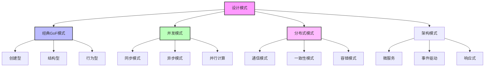

# 5.2 设计模式与代码实践

[返回上级](../5-架构与设计模式.md) | [English Version](../5-architecture-and-design-patterns/5.2-design-patterns-and-code-practice.md)

## 目录

- [5.2 设计模式与代码实践](#52-设计模式与代码实践)
  - [目录](#目录)
  - [5.2.1 设计模式理论基础](#521-设计模式理论基础)
    - [5.2.1.1 设计模式的形式化定义](#5211-设计模式的形式化定义)
    - [5.2.1.2 模式分类体系](#5212-模式分类体系)
    - [5.2.1.3 模式选择的形式化准则](#5213-模式选择的形式化准则)
  - [5.2.2 经典GoF模式实践](#522-经典gof模式实践)
    - [5.2.2.1 创建型模式的现代实现](#5221-创建型模式的现代实现)
    - [5.2.2.2 结构型模式的高级应用](#5222-结构型模式的高级应用)
  - [5.2.3 并发与并行模式](#523-并发与并行模式)
    - [5.2.3.1 Actor模型实现](#5231-actor模型实现)
    - [5.2.3.2 生产者-消费者模式](#5232-生产者-消费者模式)
    - [5.2.3.3 工作窃取模式](#5233-工作窃取模式)
  - [5.2.4 分布式系统模式](#524-分布式系统模式)
    - [5.2.4.1 熔断器模式](#5241-熔断器模式)
  - [5.2.5 现代架构模式](#525-现代架构模式)
    - [5.2.5.1 事件溯源模式](#5251-事件溯源模式)
    - [5.2.5.2 CQRS模式](#5252-cqrs模式)
  - [5.2.6 形式化验证与模式](#526-形式化验证与模式)
    - [5.2.6.1 模式的不变量验证](#5261-模式的不变量验证)
    - [5.2.6.2 并发模式的安全性验证](#5262-并发模式的安全性验证)
  - [5.2.7 性能优化模式](#527-性能优化模式)
    - [5.2.7.1 缓存模式的性能分析](#5271-缓存模式的性能分析)
    - [5.2.7.2 对象池模式](#5272-对象池模式)
  - [5.2.8 工程实践案例](#528-工程实践案例)
    - [5.2.8.1 微服务架构的模式组合](#5281-微服务架构的模式组合)
    - [5.2.8.2 高性能计算的模式应用](#5282-高性能计算的模式应用)
  - [5.2.9 现代模式与新兴技术](#529-现代模式与新兴技术)
    - [5.2.9.1 响应式编程模式](#5291-响应式编程模式)
    - [5.2.9.2 函数式编程模式](#5292-函数式编程模式)
    - [5.2.9.3 云原生架构模式](#5293-云原生架构模式)
  - [5.2.10 模式反模式与最佳实践](#5210-模式反模式与最佳实践)
    - [5.2.10.1 常见反模式识别](#52101-常见反模式识别)
    - [5.2.10.2 模式选择决策树](#52102-模式选择决策树)
    - [5.2.10.3 团队开发中的模式应用](#52103-团队开发中的模式应用)
  - [5.2.11 总结与发展趋势](#5211-总结与发展趋势)
    - [5.2.11.1 设计模式的演进历程](#52111-设计模式的演进历程)
    - [5.2.11.2 未来发展方向](#52112-未来发展方向)
    - [5.2.11.3 学习路径建议](#52113-学习路径建议)
  - [5.2.12 参考文献与延伸阅读](#5212-参考文献与延伸阅读)
    - [5.2.9.1 经典文献](#5291-经典文献)
    - [5.2.9.2 现代架构模式](#5292-现代架构模式)
    - [5.2.9.3 形式化方法与模式](#5293-形式化方法与模式)
    - [5.2.9.4 并发与分布式模式](#5294-并发与分布式模式)
    - [5.2.9.5 在线资源](#5295-在线资源)
    - [5.2.9.6 开源实现参考](#5296-开源实现参考)

---

## 5.2.1 设计模式理论基础

### 5.2.1.1 设计模式的形式化定义

设计模式是在特定上下文中反复出现的问题的通用解决方案，可以用形式化方法进行精确描述。

**定义 5.2.1** (设计模式): 设计模式 $P$ 可形式化为四元组：
$$P = \langle C, Pr, S, Co \rangle$$

其中：

- $C$ 是上下文(Context)，描述模式适用的环境
- $Pr$ 是问题(Problem)，描述需要解决的设计问题
- $S$ 是解决方案(Solution)，描述模式的结构和行为
- $Co$ 是后果(Consequences)，描述应用模式的结果

### 5.2.1.2 模式分类体系



### 5.2.1.3 模式选择的形式化准则

```lean
-- 模式选择的Lean建模
-- 模式属性定义
structure PatternProperty :=
  (reusability : ℝ)     -- 可重用性
  (flexibility : ℝ)     -- 灵活性  
  (complexity : ℝ)      -- 复杂度
  (performance : ℝ)     -- 性能影响

-- 问题上下文
structure ProblemContext :=
  (scale : ℕ)           -- 系统规模
  (concurrency_level : ℕ) -- 并发程度
  (distribution : Bool)   -- 是否分布式
  (performance_critical : Bool) -- 是否性能敏感

-- 模式适用性判断
def pattern_suitable (pattern : PatternProperty) (context : ProblemContext) : Bool :=
  pattern.reusability ≥ 0.7 ∧ 
  (context.performance_critical → pattern.performance ≥ 0.8) ∧
  (context.scale > 1000 → pattern.flexibility ≥ 0.8)

-- 最优模式选择定理
theorem optimal_pattern_selection 
  (patterns : List PatternProperty) 
  (context : ProblemContext) :
  ∃ p ∈ patterns, pattern_suitable p context ∧ 
  ∀ q ∈ patterns, pattern_suitable q context → 
  p.reusability * p.flexibility / p.complexity ≥ 
  q.reusability * q.flexibility / q.complexity :=
  sorry
```

## 5.2.2 经典GoF模式实践

### 5.2.2.1 创建型模式的现代实现

**单例模式的线程安全实现**:

```rust
use std::sync::{Arc, Mutex, Once};
use once_cell::sync::Lazy;

// 传统单例模式（线程安全）
pub struct Logger {
    level: String,
    output: String,
}

impl Logger {
    fn new() -> Self {
        Logger {
            level: "INFO".to_string(),
            output: "stdout".to_string(),
        }
    }
    
    pub fn instance() -> &'static Mutex<Logger> {
        static mut LOGGER: Option<Mutex<Logger>> = None;
        static INIT: Once = Once::new();
        
        unsafe {
            INIT.call_once(|| {
                LOGGER = Some(Mutex::new(Logger::new()));
            });
            LOGGER.as_ref().unwrap()
        }
    }
    
    pub fn log(&self, message: &str) {
        println!("[{}] {}", self.level, message);
    }
}

// 现代化单例模式（推荐）
static GLOBAL_LOGGER: Lazy<Arc<Mutex<Logger>>> = Lazy::new(|| {
    Arc::new(Mutex::new(Logger::new()))
});

// 工厂模式的泛型实现
pub trait Product: Send + Sync {
    fn create() -> Self where Self: Sized;
    fn operation(&self) -> String;
}

pub trait Factory<T: Product> {
    fn create_product(&self) -> Box<T>;
}

// 具体产品实现
pub struct DatabaseConnection {
    connection_string: String,
}

impl Product for DatabaseConnection {
    fn create() -> Self {
        DatabaseConnection {
            connection_string: "postgresql://localhost:5432/db".to_string(),
        }
    }
    
    fn operation(&self) -> String {
        format!("Connected to: {}", self.connection_string)
    }
}

pub struct DatabaseFactory;

impl Factory<DatabaseConnection> for DatabaseFactory {
    fn create_product(&self) -> Box<DatabaseConnection> {
        Box::new(DatabaseConnection::create())
    }
}

// 建造者模式的流式API
#[derive(Debug, Default)]
pub struct HttpClient {
    base_url: Option<String>,
    timeout: Option<u64>,
    headers: Vec<(String, String)>,
    retry_count: u32,
}

impl HttpClient {
    pub fn builder() -> HttpClientBuilder {
        HttpClientBuilder::default()
    }
    
    pub async fn get(&self, path: &str) -> Result<String, Box<dyn std::error::Error>> {
        // 实际HTTP请求实现
        Ok(format!("GET {}/{}", self.base_url.as_ref().unwrap_or(&"".to_string()), path))
    }
}

#[derive(Default)]
pub struct HttpClientBuilder {
    client: HttpClient,
}

impl HttpClientBuilder {
    pub fn base_url(mut self, url: &str) -> Self {
        self.client.base_url = Some(url.to_string());
        self
    }
    
    pub fn timeout(mut self, seconds: u64) -> Self {
        self.client.timeout = Some(seconds);
        self
    }
    
    pub fn header(mut self, key: &str, value: &str) -> Self {
        self.client.headers.push((key.to_string(), value.to_string()));
        self
    }
    
    pub fn retry_count(mut self, count: u32) -> Self {
        self.client.retry_count = count;
        self
    }
    
    pub fn build(self) -> Result<HttpClient, &'static str> {
        if self.client.base_url.is_none() {
            return Err("Base URL is required");
        }
        Ok(self.client)
    }
}

#[async_trait::async_trait]
impl<S: Service + Send + Sync> Service for RetryDecorator<S>
where
    S::Request: Send + Sync + Clone,
    S::Response: Send + Sync,
{
    type Request = S::Request;
    type Response = S::Response;
    
    async fn call(&self, req: Self::Request) -> Result<Self::Response, Box<dyn std::error::Error>> {
        let mut last_error = None;
        
        for attempt in 0..=self.max_retries {
            match self.inner.call(req.clone()).await {
                Ok(resp) => return Ok(resp),
                Err(err) => {
                    last_error = Some(err);
                    if attempt < self.max_retries {
                        tokio::time::sleep(tokio::time::Duration::from_millis(100 * (attempt + 1) as u64)).await;
                    }
                }
            }
        }
        
        Err(last_error.unwrap())
    }
}

// 组合装饰器的示例
pub fn create_decorated_service<S: Service + Send + Sync + 'static>(
    service: S
) -> impl Service<Request = S::Request, Response = S::Response>
where
    S::Request: Send + Sync + Clone + std::fmt::Debug,
    S::Response: Send + Sync + std::fmt::Debug,
{
    RetryDecorator::new(
        LoggingDecorator::new(service, "MyService".to_string()),
        3
    )
}

impl<T> BoundedBuffer<T> {
    pub fn new(capacity: usize) -> Self {
        Self {
            buffer: Mutex::new(VecDeque::with_capacity(capacity)),
            not_empty: Condvar::new(),
            not_full: Condvar::new(),
            capacity,
        }
    }
    
    pub fn produce(&self, item: T) -> Result<(), &'static str> {
        let mut buffer = self.buffer.lock().unwrap();
        
        // 等待缓冲区有空间
        while buffer.len() >= self.capacity {
            buffer = self.not_full.wait(buffer).unwrap();
        }
        
        buffer.push_back(item);
        
        // 通知消费者
        self.not_empty.notify_one();
        
        Ok(())
    }
    
    pub fn consume(&self) -> Result<T, &'static str> {
        let mut buffer = self.buffer.lock().unwrap();
        
        // 等待缓冲区有数据
        while buffer.is_empty() {
            buffer = self.not_empty.wait(buffer).unwrap();
        }
        
        let item = buffer.pop_front().unwrap();
        
        // 通知生产者
        self.not_full.notify_one();
        
        Ok(item)
    }
}

// 异步版本的生产者-消费者
pub struct AsyncBoundedBuffer<T> {
    inner: Arc<tokio::sync::Mutex<VecDeque<T>>>,
    capacity: usize,
    not_empty: Arc<tokio::sync::Notify>,
    not_full: Arc<tokio::sync::Notify>,
}

impl<T> AsyncBoundedBuffer<T> {
    pub fn new(capacity: usize) -> Self {
        Self {
            inner: Arc::new(tokio::sync::Mutex::new(VecDeque::with_capacity(capacity))),
            capacity,
            not_empty: Arc::new(tokio::sync::Notify::new()),
            not_full: Arc::new(tokio::sync::Notify::new()),
        }
    }
    
    pub async fn produce(&self, item: T) -> Result<(), &'static str> {
        loop {
            {
                let mut buffer = self.inner.lock().await;
                if buffer.len() < self.capacity {
                    buffer.push_back(item);
                    self.not_empty.notify_one();
                    return Ok(());
                }
            }
            
            // 等待缓冲区有空间
            self.not_full.notified().await;
        }
    }
    
    pub async fn consume(&self) -> Result<T, &'static str> {
        loop {
            {
                let mut buffer = self.inner.lock().await;
                if let Some(item) = buffer.pop_front() {
                    self.not_full.notify_one();
                    return Ok(item);
                }
            }
            
            // 等待缓冲区有数据
            self.not_empty.notified().await;
        }
    }
}

// 熔断器状态
#[derive(Debug, Clone, PartialEq)]
pub enum CircuitState {
    Closed,    // 正常状态
    Open,      // 熔断状态
    HalfOpen,  // 半开状态
}

// 熔断器配置
#[derive(Debug, Clone)]
pub struct CircuitBreakerConfig {
    pub failure_threshold: usize,        // 失败阈值
    pub recovery_timeout: Duration,      // 恢复超时
    pub request_timeout: Duration,       // 请求超时
    pub success_threshold: usize,        // 成功阈值（半开状态）
}

impl Default for CircuitBreakerConfig {
    fn default() -> Self {
        Self {
            failure_threshold: 5,
            recovery_timeout: Duration::from_secs(60),
            request_timeout: Duration::from_secs(30),
            success_threshold: 3,
        }
    }
}

// 熔断器统计信息
#[derive(Debug, Default)]
struct CircuitStats {
    consecutive_failures: usize,
    consecutive_successes: usize,
    last_failure_time: Option<Instant>,
    total_requests: usize,
    total_failures: usize,
}

// 熔断器实现
pub struct CircuitBreaker {
    state: Arc<Mutex<CircuitState>>,
    stats: Arc<Mutex<CircuitStats>>,
    config: CircuitBreakerConfig,
}

impl CircuitBreaker {
    pub fn new(config: CircuitBreakerConfig) -> Self {
        Self {
            state: Arc::new(Mutex::new(CircuitState::Closed)),
            stats: Arc::new(Mutex::new(CircuitStats::default())),
            config,
        }
    }
    
    pub async fn call<F, T, E>(&self, operation: F) -> Result<T, CircuitBreakerError<E>>
    where
        F: std::future::Future<Output = Result<T, E>>,
    {
        // 检查当前状态
        if !self.can_execute()? {
            return Err(CircuitBreakerError::CircuitOpen);
        }
        
        // 执行操作
        let result = timeout(self.config.request_timeout, operation).await;
        
        match result {
            Ok(Ok(success)) => {
                self.on_success();
                Ok(success)
            },
            Ok(Err(error)) => {
                self.on_failure();
                Err(CircuitBreakerError::OperationFailed(error))
            },
            Err(_) => {
                self.on_failure();
                Err(CircuitBreakerError::Timeout)
            }
        }
    }
    
    fn can_execute(&self) -> Result<bool, CircuitBreakerError<()>> {
        let mut state = self.state.lock().unwrap();
        let stats = self.stats.lock().unwrap();
        
        match *state {
            CircuitState::Closed => Ok(true),
            CircuitState::Open => {
                // 检查是否可以尝试恢复
                if let Some(last_failure) = stats.last_failure_time {
                    if last_failure.elapsed() >= self.config.recovery_timeout {
                        *state = CircuitState::HalfOpen;
                        Ok(true)
                    } else {
                        Ok(false)
                    }
                } else {
                    Ok(false)
                }
            },
            CircuitState::HalfOpen => Ok(true),
        }
    }
    
    fn on_success(&self) {
        let mut state = self.state.lock().unwrap();
        let mut stats = self.stats.lock().unwrap();
        
        stats.consecutive_failures = 0;
        stats.consecutive_successes += 1;
        stats.total_requests += 1;
        
        match *state {
            CircuitState::HalfOpen => {
                if stats.consecutive_successes >= self.config.success_threshold {
                    *state = CircuitState::Closed;
                    stats.consecutive_successes = 0;
                }
            },
            _ => {}
        }
    }
    
    fn on_failure(&self) {
        let mut state = self.state.lock().unwrap();
        let mut stats = self.stats.lock().unwrap();
        
        stats.consecutive_failures += 1;
        stats.consecutive_successes = 0;
        stats.total_requests += 1;
        stats.total_failures += 1;
        stats.last_failure_time = Some(Instant::now());
        
        if stats.consecutive_failures >= self.config.failure_threshold {
            *state = CircuitState::Open;
        }
    }
    
    pub fn get_state(&self) -> CircuitState {
        self.state.lock().unwrap().clone()
    }
}

#[derive(Debug)]
pub enum CircuitBreakerError<E> {
    CircuitOpen,
    Timeout,
    OperationFailed(E),
}

impl<E: Event> InMemoryEventStore<E> {
    pub fn new() -> Self {
        Self {
            events: HashMap::new(),
        }
    }
}

#[async_trait::async_trait]
impl<E: Event> EventStore<E> for InMemoryEventStore<E> {
    type Error = Box<dyn std::error::Error + Send + Sync>;
    
    async fn append_events(&mut self, events: Vec<E>) -> Result<(), Self::Error> {
        for event in events {
            let entity_id = event.entity_id();
            self.events.entry(entity_id).or_insert_with(Vec::new).push(event);
        }
        Ok(())
    }
    
    async fn get_events(&self, entity_id: E::EntityId, _from_version: Option<u64>) -> Result<Vec<E>, Self::Error> {
        Ok(self.events.get(&entity_id).cloned().unwrap_or_default())
    }
}

// 示例：银行账户聚合
#[derive(Debug, Clone, Serialize, Deserialize)]
pub struct BankAccount {
    id: Uuid,
    balance: i64,
    is_active: bool,
}

#[derive(Debug, Clone, Serialize, Deserialize)]
pub enum AccountEvent {
    AccountCreated {
        id: Uuid,
        initial_balance: i64,
        timestamp: DateTime<Utc>,
    },
    MoneyDeposited {
        id: Uuid,
        amount: i64,
        timestamp: DateTime<Utc>,
    },
    MoneyWithdrawn {
        id: Uuid,
        amount: i64,
        timestamp: DateTime<Utc>,
    },
    AccountClosed {
        id: Uuid,
        timestamp: DateTime<Utc>,
    },
}

impl Event for AccountEvent {
    type EntityId = Uuid;
    
    fn entity_id(&self) -> Self::EntityId {
        match self {
            AccountEvent::AccountCreated { id, .. } => *id,
            AccountEvent::MoneyDeposited { id, .. } => *id,
            AccountEvent::MoneyWithdrawn { id, .. } => *id,
            AccountEvent::AccountClosed { id, .. } => *id,
        }
    }
    
    fn event_type(&self) -> &'static str {
        match self {
            AccountEvent::AccountCreated { .. } => "AccountCreated",
            AccountEvent::MoneyDeposited { .. } => "MoneyDeposited",
            AccountEvent::MoneyWithdrawn { .. } => "MoneyWithdrawn",
            AccountEvent::AccountClosed { .. } => "AccountClosed",
        }
    }
    
    fn timestamp(&self) -> DateTime<Utc> {
        match self {
            AccountEvent::AccountCreated { timestamp, .. } => *timestamp,
            AccountEvent::MoneyDeposited { timestamp, .. } => *timestamp,
            AccountEvent::MoneyWithdrawn { timestamp, .. } => *timestamp,
            AccountEvent::AccountClosed { timestamp, .. } => *timestamp,
        }
    }
}

impl AggregateRoot for BankAccount {
    type Id = Uuid;
    type Event = AccountEvent;
    type Error = String;
    
    fn apply_event(&mut self, event: &Self::Event) -> Result<(), Self::Error> {
        match event {
            AccountEvent::AccountCreated { id, initial_balance, .. } => {
                self.id = *id;
                self.balance = *initial_balance;
                self.is_active = true;
            },
            AccountEvent::MoneyDeposited { amount, .. } => {
                if !self.is_active {
                    return Err("Account is not active".to_string());
                }
                self.balance += amount;
            },
            AccountEvent::MoneyWithdrawn { amount, .. } => {
                if !self.is_active {
                    return Err("Account is not active".to_string());
                }
                if self.balance < *amount {
                    return Err("Insufficient funds".to_string());
                }
                self.balance -= amount;
            },
            AccountEvent::AccountClosed { .. } => {
                self.is_active = false;
            },
        }
        Ok(())
    }
    
    fn get_id(&self) -> Self::Id {
        self.id
    }
}

// 事件溯源仓储
pub struct EventSourcedRepository<A, E, S> 
where
    A: AggregateRoot<Event = E>,
    E: Event<EntityId = A::Id>,
    S: EventStore<E>,
{
    event_store: S,
    _phantom: std::marker::PhantomData<(A, E)>,
}

impl<A, E, S> EventSourcedRepository<A, E, S>
where
    A: AggregateRoot<Event = E> + Default,
    E: Event<EntityId = A::Id>,
    S: EventStore<E>,
{
    pub fn new(event_store: S) -> Self {
        Self {
            event_store,
            _phantom: std::marker::PhantomData,
        }
    }
    
    pub async fn get_by_id(&self, id: A::Id) -> Result<Option<A>, S::Error> {
        let events = self.event_store.get_events(id, None).await?;
        
        if events.is_empty() {
            return Ok(None);
        }
        
        let mut aggregate = A::default();
        for event in events {
            if let Err(_) = aggregate.apply_event(&event) {
                // 处理事件应用错误
                continue;
            }
        }
        
        Ok(Some(aggregate))
    }
    
    pub async fn save(&mut self, aggregate: &A, events: Vec<E>) -> Result<(), S::Error> {
        self.event_store.append_events(events).await
    }
}

-- 一致性保证
theorem eventual_consistency 
  (system : CQRSSystem Entity)
  (cmd : Command Entity) :
  ∃ t : Time, after t (command_side_consistent cmd ∧ query_side_consistent cmd) :=
  sorry

---- 活性属性 ----
Liveness ==
    /\ \A actor_id \in DOMAIN actors :
        mailboxes[actor_id] # <<>> ~> mailboxes[actor_id] = <<>>

impl<T: Poolable + 'static> ObjectPool<T> {
    pub fn new<F>(factory: F, max_size: usize) -> Self 
    where 
        F: Fn() -> T + Send + Sync + 'static 
    {
        Self {
            pool: Arc::new(Mutex::new(VecDeque::new())),
            factory: Box::new(factory),
            max_size,
            semaphore: Arc::new(Semaphore::new(max_size)),
        }
    }
    
    pub async fn acquire(&self) -> Result<PooledObject<T>, Box<dyn std::error::Error>> {
        // 获取信号量许可
        let permit = self.semaphore.clone().acquire_owned().await?;
        
        // 尝试从池中获取对象
        let obj = {
            let mut pool = self.pool.lock().unwrap();
            pool.pop_front()
        };
        
        let obj = match obj {
            Some(mut obj) => {
                obj.reset();
                if obj.is_valid() {
                    obj
                } else {
                    (self.factory)()
                }
            },
            None => (self.factory)(),
        };
        
        Ok(PooledObject {
            object: Some(obj),
            pool: self.pool.clone(),
            _permit: permit,
        })
    }
}

// 池化对象包装器
pub struct PooledObject<T: Poolable> {
    object: Option<T>,
    pool: Arc<Mutex<VecDeque<T>>>,
    _permit: tokio::sync::OwnedSemaphorePermit,
}

impl<T: Poolable> PooledObject<T> {
    pub fn as_ref(&self) -> &T {
        self.object.as_ref().unwrap()
    }
    
    pub fn as_mut(&mut self) -> &mut T {
        self.object.as_mut().unwrap()
    }
}

impl<T: Poolable> Drop for PooledObject<T> {
    fn drop(&mut self) {
        if let Some(obj) = self.object.take() {
            if obj.is_valid() {
                let mut pool = self.pool.lock().unwrap();
                pool.push_back(obj);
            }
        }
        // permit自动释放
    }
}

// 示例：数据库连接池
pub struct DbConnection {
    connection_id: usize,
    is_active: bool,
}

impl Poolable for DbConnection {
    fn reset(&mut self) {
        // 重置连接状态
        self.is_active = true;
    }
    
    fn is_valid(&self) -> bool {
        self.is_active
    }
}

impl DbConnection {
    pub fn new(id: usize) -> Self {
        Self {
            connection_id: id,
            is_active: true,
        }
    }
    
    pub fn execute_query(&mut self, sql: &str) -> Result<Vec<String>, &'static str> {
        if !self.is_active {
            return Err("Connection is not active");
        }
        
        // 模拟查询执行
        Ok(vec![format!("Result for: {}", sql)])
    }
}

// 4. Saga模式实现
pub struct OrderProcessingSaga {
    order_id: Uuid,
    state: SagaState,
    compensations: Vec<Box<dyn CompensationAction>>,
}

impl OrderProcessingSaga {
    pub async fn execute_step(&mut self, step: SagaStep) -> Result<SagaStepResult, SagaError> {
        match step {
            SagaStep::ReserveInventory => {
                // 执行库存预留
                match self.reserve_inventory().await {
                    Ok(reservation) => {
                        // 添加补偿操作
                        self.compensations.push(Box::new(ReleaseInventoryCompensation {
                            reservation_id: reservation.id,
                        }));
                        Ok(SagaStepResult::Success)
                    },
                    Err(e) => {
                        // 执行补偿
                        self.compensate().await?;
                        Err(SagaError::StepFailed(e))
                    }
                }
            },
            SagaStep::ProcessPayment => {
                // 执行支付处理
                match self.process_payment().await {
                    Ok(payment) => {
                        self.compensations.push(Box::new(RefundPaymentCompensation {
                            payment_id: payment.id,
                        }));
                        Ok(SagaStepResult::Success)
                    },
                    Err(e) => {
                        self.compensate().await?;
                        Err(SagaError::StepFailed(e))
                    }
                }
            },
            SagaStep::ShipOrder => {
                // 执行订单发货
                self.ship_order().await
            }
        }
    }
    
    async fn compensate(&mut self) -> Result<(), SagaError> {
        // 逆序执行补偿操作
        for compensation in self.compensations.iter().rev() {
            compensation.execute().await?;
        }
        Ok(())
    }
}
