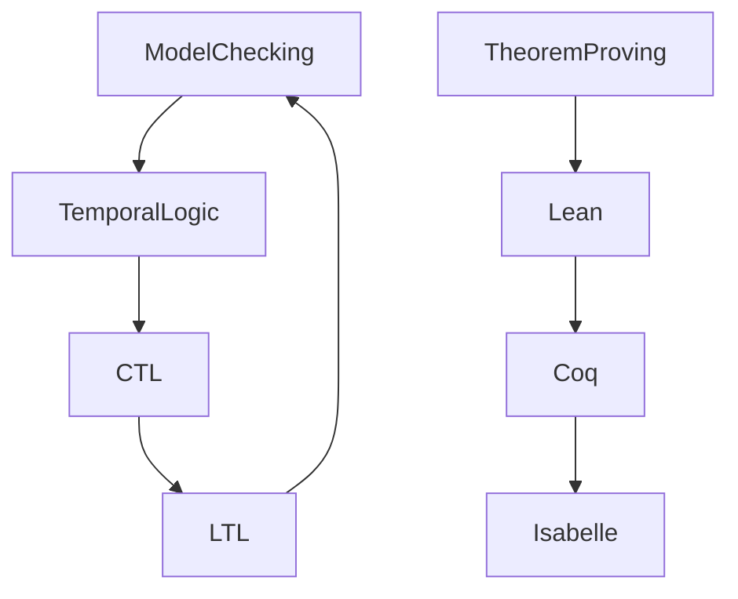

# 7.1 Formal Verification Architecture

[Back to Parent](../7-verification-and-engineering-practice.md) | [中文版](../7-验证与工程实践/7.1-形式化验证架构.md)

## Table of Contents

- [7.1 Formal Verification Architecture](#71-formal-verification-architecture)
  - [Table of Contents](#table-of-contents)
  - [7.1.1 Formal Verification Panorama](#711-formal-verification-panorama)
  - [7.1.2 Typical Verification Methods](#712-typical-verification-methods)
  - [7.1.3 Code Example](#713-code-example)
  - [7.1.4 References](#714-references)

---

## 7.1.1 Formal Verification Panorama



## 7.1.2 Typical Verification Methods

\[
\text{Model Checking: } \forall s \in S, \forall \phi \in \Phi, M, s \models \phi
\]

```lean
-- Lean pseudo-code: model checking
def model_check (M : Model) (s : State) (φ : Formula) : Prop :=
  match φ with
  | atom p => M.valuation s p
  | not ψ => not (model_check M s ψ)
  | and ψ₁ ψ₂ => model_check M s ψ₁ ∧ model_check M s ψ₂
```

## 7.1.3 Code Example

```rust
// Rust pseudo-code: formal verification
struct ModelChecker {
    states: Vec<State>,
    transitions: Vec<(State, State)>,
    properties: Vec<Property>,
}
```

## 7.1.4 References

- "Introduction to Formal Methods"
- [Model Checking](https://en.wikipedia.org/wiki/Model_checking)
- TODO: More authoritative references

---

[Back to Tree](../0-Overview-and-Navigation/0.1-Global-Topic-Tree.md)
