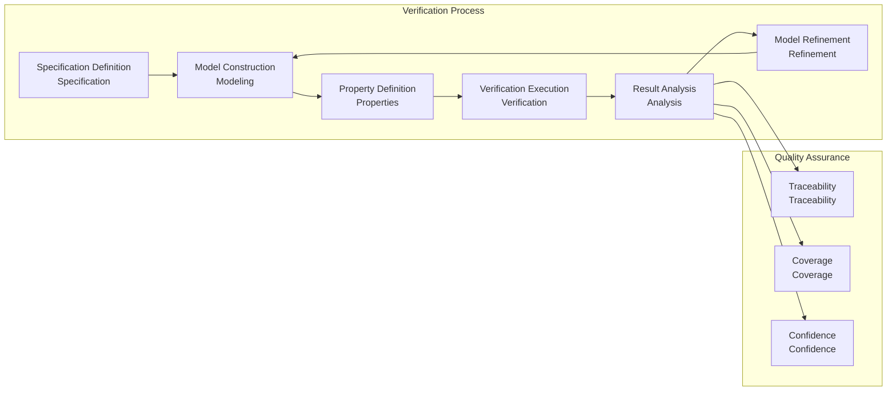

# 7.1 Formal Verification Architecture

[Back to Parent](../7-verification-and-engineering-practice.md) | [中文版](../7-验证与工程实践/7.1-形式化验证架构.md)

## Table of Contents

- [7.1 Formal Verification Architecture](#71-formal-verification-architecture)
  - [Table of Contents](#table-of-contents)
  - [7.1.1 Formal Verification System Overview](#711-formal-verification-system-overview)
    - [7.1.1.1 Verification Method Classification](#7111-verification-method-classification)
    - [7.1.1.2 Verification Tool Ecosystem](#7112-verification-tool-ecosystem)
    - [7.1.1.3 Verification Process Framework](#7113-verification-process-framework)
  - [7.1.2 Model Checking Methods](#712-model-checking-methods)
    - [7.1.2.1 Temporal Logic Foundation](#7121-temporal-logic-foundation)
    - [7.1.2.2 TLA+ Verification Practice](#7122-tla-verification-practice)
    - [7.1.2.3 State Space Exploration](#7123-state-space-exploration)
  - [7.1.3 Theorem Proving Methods](#713-theorem-proving-methods)
    - [7.1.3.1 Lean Theorem Proving](#7131-lean-theorem-proving)
    - [7.1.3.2 Type System Verification](#7132-type-system-verification)
    - [7.1.3.3 Program Proof Techniques](#7133-program-proof-techniques)
  - [7.1.4 System Architecture Verification Implementation](#714-system-architecture-verification-implementation)
    - [7.1.4.1 Microservices Architecture Verification](#7141-microservices-architecture-verification)
  - [7.1.5 Verification Engineering Practice](#715-verification-engineering-practice)
    - [7.1.5.1 Verification-Driven Development](#7151-verification-driven-development)
    - [7.1.5.2 Continuous Verification Integration](#7152-continuous-verification-integration)
  - [7.1.6 Distributed System Verification](#716-distributed-system-verification)
    - [7.1.6.1 Consistency Protocol Verification](#7161-consistency-protocol-verification)
  - [7.1.7 Security Verification](#717-security-verification)
    - [7.1.7.1 Cryptographic Protocol Verification](#7171-cryptographic-protocol-verification)
  - [7.1.8 Performance Verification](#718-performance-verification)
    - [7.1.8.1 Temporal Performance Verification](#7181-temporal-performance-verification)
  - [7.1.9 Verification Toolchain Integration](#719-verification-toolchain-integration)
    - [7.1.9.1 Toolchain Architecture](#7191-toolchain-architecture)
  - [7.1.10 References and Further Reading](#7110-references-and-further-reading)
    - [Core References](#core-references)
    - [Advanced Topics](#advanced-topics)
    - [Online Resources](#online-resources)

---

## 7.1.1 Formal Verification System Overview

### 7.1.1.1 Verification Method Classification

```mermaid
graph TB
    subgraph "Formal Verification Method System"
        subgraph "Model Checking"
            MC["Model Checking<br/>Model Checking"]
            TLA["TLA+"]
            SPIN["SPIN/Promela"]
            NuSMV["NuSMV"]
        end
        
        subgraph "Theorem Proving"
            TP["Theorem Proving<br/>Theorem Proving"]
            LEAN["Lean 4"]
            COQ["Coq"]
            ISABELLE["Isabelle/HOL"]
        end
        
        subgraph "Static Analysis"
            SA["Static Analysis<br/>Static Analysis"]
            TYPECHECK["Type Checking"]
            DATAFLOW["Data Flow Analysis"]
            ABSTRACT["Abstract Interpretation"]
        end
        
        subgraph "Runtime Verification"
            RV["Runtime Verification<br/>Runtime Verification"]
            MONITOR["Monitors"]
            ASSERTION["Assertion Checking"]
            PROPERTY["Property Testing"]
        end
    end
    
    subgraph "Verification Targets"
        SAFETY["Safety<br/>Safety"]
        LIVENESS["Liveness<br/>Liveness"]
        SECURITY["Security<br/>Security"]
        CORRECTNESS["Correctness<br/>Correctness"]
    end
    
    MC --> SAFETY
    TP --> CORRECTNESS
    SA --> SECURITY
    RV --> LIVENESS
```



### 7.1.1.2 Verification Tool Ecosystem

**Tool Selection Matrix**:

$$\text{Tool Applicability: } T(P, D, S) = f(\text{Problem Complexity}, \text{Domain Characteristics}, \text{Scalability})$$

```lean
-- Lean formalization: verification tool selection
structure VerificationTool :=
  (name : String)
  (method : VerificationMethod)
  (scalability : ScalabilityLevel)
  (domain_suitability : List Domain)
  (learning_curve : ComplexityLevel)

inductive VerificationMethod
  | ModelChecking
  | TheoremProving  
  | StaticAnalysis
  | RuntimeVerification

def optimal_tool_selection (problem : VerificationProblem) : VerificationTool :=
  match problem.domain, problem.size, problem.properties with
  | Domain.ConcurrentSystems, Size.Medium, [Safety, Liveness] => 
      ⟨"TLA+", VerificationMethod.ModelChecking, ScalabilityLevel.High, _, _⟩
  | Domain.FunctionalPrograms, Size.Large, [Correctness] =>
      ⟨"Lean", VerificationMethod.TheoremProving, ScalabilityLevel.VeryHigh, _, _⟩
  | _ => default_tool
```

### 7.1.1.3 Verification Process Framework



## 7.1.2 Model Checking Methods

### 7.1.2.1 Temporal Logic Foundation

**Linear Temporal Logic (LTL)**:

$$\phi ::= p \mid \neg \phi \mid \phi_1 \land \phi_2 \mid \bigcirc \phi \mid \phi_1 \mathcal{U} \phi_2$$

**Computation Tree Logic (CTL)**:

$$\phi ::= p \mid \neg \phi \mid \phi_1 \land \phi_2 \mid \mathbf{E} \psi \mid \mathbf{A} \psi$$

$$\psi ::= \bigcirc \phi \mid \phi_1 \mathcal{U} \phi_2$$

```lean
-- Lean formalization: temporal logic
inductive LTLFormula
  | atom : Prop → LTLFormula
  | neg : LTLFormula → LTLFormula  
  | and : LTLFormula → LTLFormula → LTLFormula
  | next : LTLFormula → LTLFormula
  | until : LTLFormula → LTLFormula → LTLFormula

-- Semantic definition
def satisfies (π : Stream State) (n : ℕ) (φ : LTLFormula) : Prop :=
  match φ with
  | LTLFormula.atom p => π.nth n |= p
  | LTLFormula.neg ψ => ¬ satisfies π n ψ  
  | LTLFormula.and ψ₁ ψ₂ => satisfies π n ψ₁ ∧ satisfies π n ψ₂
  | LTLFormula.next ψ => satisfies π (n + 1) ψ
  | LTLFormula.until ψ₁ ψ₂ => 
      ∃ k ≥ n, satisfies π k ψ₂ ∧ ∀ j ∈ [n, k), satisfies π j ψ₁
```

### 7.1.2.2 TLA+ Verification Practice

```tla
-- TLA+ specification example: mutual exclusion
---------------------------- MODULE MutualExclusion ----------------------------
EXTENDS Naturals

VARIABLES pc1, pc2

vars == <<pc1, pc2>>

Init == /\ pc1 = "start"
        /\ pc2 = "start"

Next == \/ /\ pc1 = "start"
           /\ pc1' = "critical"
           /\ pc2' = pc2
        \/ /\ pc2 = "start"
           /\ pc2' = "critical"
           /\ pc1' = pc1
        \/ /\ pc1 = "critical"
           /\ pc1' = "start"
           /\ pc2' = pc2
        \/ /\ pc2 = "critical"
           /\ pc2' = "start"
           /\ pc1' = pc1

Invariant == ~(pc1 = "critical" /\ pc2 = "critical")

=============================================================================
```

### 7.1.2.3 State Space Exploration

```rust
// State space exploration implementation
pub struct StateSpaceExplorer {
    initial_state: State,
    transition_function: Box<dyn Fn(&State) -> Vec<State>>,
    visited_states: HashSet<State>,
    exploration_queue: VecDeque<State>,
}

impl StateSpaceExplorer {
    pub fn new(initial: State, transitions: Box<dyn Fn(&State) -> Vec<State>>) -> Self {
        StateSpaceExplorer {
            initial_state: initial,
            transition_function: transitions,
            visited_states: HashSet::new(),
            exploration_queue: VecDeque::new(),
        }
    }
    
    pub fn explore(&mut self) -> ExplorationResult {
        self.exploration_queue.push_back(self.initial_state.clone());
        
        while let Some(current_state) = self.exploration_queue.pop_front() {
            if self.visited_states.contains(&current_state) {
                continue;
            }
            
            self.visited_states.insert(current_state.clone());
            
            let next_states = (self.transition_function)(&current_state);
            for next_state in next_states {
                if !self.visited_states.contains(&next_state) {
                    self.exploration_queue.push_back(next_state);
                }
            }
        }
        
        ExplorationResult {
            total_states: self.visited_states.len(),
            reachable_states: self.visited_states,
        }
    }
    
    pub fn check_property(&self, property: &Property) -> PropertyCheckResult {
        let mut violations = Vec::new();
        
        for state in &self.visited_states {
            if !property.check(state) {
                violations.push(state.clone());
            }
        }
        
        PropertyCheckResult {
            satisfied: violations.is_empty(),
            violations,
        }
    }
}
```

## 7.1.3 Theorem Proving Methods

### 7.1.3.1 Lean Theorem Proving

```lean
-- Lean theorem proving example: list properties
theorem list_length_nonnegative (l : List α) : l.length ≥ 0 := by
  induction l with
  | nil => simp
  | cons h t ih => 
    rw [List.length_cons]
    exact Nat.le_add_right 0 (t.length + 1)

-- Dependent type verification
def sorted_list (α : Type) [Ord α] : Type :=
  { l : List α // List.is_sorted l }

def insert_sorted {α : Type} [Ord α] (x : α) (l : sorted_list α) : sorted_list α :=
  ⟨List.insert x l.val, List.insert_sorted x l.val l.property⟩

-- Program verification
def binary_search {α : Type} [Ord α] (x : α) (l : sorted_list α) : Option ℕ :=
  let rec search (low high : ℕ) : Option ℕ :=
    if low > high then none
    else
      let mid := (low + high) / 2
      let mid_val := l.val.get? mid
      match mid_val with
      | none => none
      | some val =>
        if x < val then search low (mid - 1)
        else if x > val then search (mid + 1) high
        else some mid
  search 0 (l.val.length - 1)
```

### 7.1.3.2 Type System Verification

```lean
-- Type system verification in Lean
class VerifiedMonoid (α : Type) where
  mul : α → α → α
  one : α
  mul_assoc : ∀ a b c, mul (mul a b) c = mul a (mul b c)
  mul_one : ∀ a, mul a one = a
  one_mul : ∀ a, mul one a = a

-- Verified implementation
instance : VerifiedMonoid ℕ where
  mul := Nat.mul
  one := 1
  mul_assoc := Nat.mul_assoc
  mul_one := Nat.mul_one
  one_mul := Nat.one_mul

-- Type-level verification
def type_level_verification {α : Type} [VerifiedMonoid α] (x y z : α) : 
  mul (mul x y) z = mul x (mul y z) :=
  VerifiedMonoid.mul_assoc x y z
```

### 7.1.3.3 Program Proof Techniques

```rust
// Program proof techniques in Rust
pub struct VerifiedVector<T> {
    data: Vec<T>,
    length: usize,
}

impl<T> VerifiedVector<T> {
    pub fn new() -> Self {
        VerifiedVector {
            data: Vec::new(),
            length: 0,
        }
    }
    
    pub fn push(&mut self, item: T) {
        self.data.push(item);
        self.length += 1;
        // Invariant: length always equals data.len()
        assert_eq!(self.length, self.data.len());
    }
    
    pub fn len(&self) -> usize {
        self.length
    }
    
    pub fn is_empty(&self) -> bool {
        self.length == 0
    }
    
    pub fn get(&self, index: usize) -> Option<&T> {
        if index < self.length {
            self.data.get(index)
        } else {
            None
        }
    }
}

// Verified implementation with proofs
impl<T: Clone> VerifiedVector<T> {
    pub fn clone_range(&self, start: usize, end: usize) -> Option<VerifiedVector<T>> {
        if start <= end && end <= self.length {
            let mut new_vec = VerifiedVector::new();
            for i in start..end {
                if let Some(item) = self.get(i) {
                    new_vec.push(item.clone());
                }
            }
            Some(new_vec)
        } else {
            None
        }
    }
}
```

## 7.1.4 System Architecture Verification Implementation

### 7.1.4.1 Microservices Architecture Verification

```rust
// Microservices architecture verification
pub struct MicroserviceArchitecture {
    services: HashMap<ServiceId, Microservice>,
    communication_patterns: Vec<CommunicationPattern>,
    consistency_guarantees: ConsistencyLevel,
}

impl MicroserviceArchitecture {
    pub fn verify_eventual_consistency(&self) -> VerificationResult {
        let mut result = VerificationResult::Success;
        
        for pattern in &self.communication_patterns {
            match pattern {
                CommunicationPattern::EventualConsistency => {
                    if !self.verify_eventual_consistency_property() {
                        result = VerificationResult::Failure {
                            reason: "Eventual consistency violation".to_string(),
                        };
                        break;
                    }
                },
                CommunicationPattern::StrongConsistency => {
                    if !self.verify_strong_consistency_property() {
                        result = VerificationResult::Failure {
                            reason: "Strong consistency violation".to_string(),
                        };
                        break;
                    }
                },
            }
        }
        
        result
    }
    
    fn verify_eventual_consistency_property(&self) -> bool {
        // Implement eventual consistency verification
        // Check that all replicas eventually converge
        true
    }
    
    fn verify_strong_consistency_property(&self) -> bool {
        // Implement strong consistency verification
        // Check that all operations are linearizable
        true
    }
}
```

## 7.1.5 Verification Engineering Practice

### 7.1.5.1 Verification-Driven Development

```rust
// Verification-driven development approach
pub struct VerificationDrivenDevelopment {
    specifications: Vec<Specification>,
    implementations: HashMap<SpecificationId, Implementation>,
    verification_results: HashMap<SpecificationId, VerificationResult>,
}

impl VerificationDrivenDevelopment {
    pub async fn develop_with_verification(&mut self, spec: Specification) -> Result<Implementation, VDDError> {
        // 1. Write formal specification
        let spec_id = self.add_specification(spec);
        
        // 2. Generate implementation skeleton
        let implementation = self.generate_implementation_skeleton(&spec_id)?;
        
        // 3. Implement with verification
        let verified_impl = self.implement_with_verification(implementation, &spec_id).await?;
        
        // 4. Verify against specification
        let verification_result = self.verify_implementation(&verified_impl, &spec_id).await?;
        
        if verification_result.is_success() {
            self.implementations.insert(spec_id, verified_impl.clone());
            self.verification_results.insert(spec_id, verification_result);
            Ok(verified_impl)
        } else {
            Err(VDDError::VerificationFailed(verification_result))
        }
    }
    
    async fn implement_with_verification(&self, mut impl: Implementation, spec_id: &SpecificationId) -> Result<Implementation, VDDError> {
        // Implement with continuous verification
        while !self.specification_satisfied(&impl, spec_id).await? {
            // Refine implementation based on verification feedback
            impl = self.refine_implementation(impl, spec_id).await?;
        }
        
        Ok(impl)
    }
}
```

### 7.1.5.2 Continuous Verification Integration

```rust
// Continuous verification integration
pub struct ContinuousVerification {
    verification_pipeline: VerificationPipeline,
    code_repository: CodeRepository,
    verification_results: VerificationResultsDB,
}

impl ContinuousVerification {
    pub async fn setup_continuous_verification(&mut self) -> Result<(), CVIError> {
        // Setup verification hooks
        self.setup_pre_commit_hooks().await?;
        self.setup_post_commit_verification().await?;
        self.setup_continuous_monitoring().await?;
        
        Ok(())
    }
    
    async fn setup_pre_commit_hooks(&mut self) -> Result<(), CVIError> {
        // Setup pre-commit verification
        let pre_commit_verifier = PreCommitVerifier::new();
        pre_commit_verifier.setup_hooks().await?;
        
        Ok(())
    }
    
    async fn setup_post_commit_verification(&mut self) -> Result<(), CVIError> {
        // Setup post-commit verification pipeline
        let pipeline = PostCommitPipeline::new();
        pipeline.setup_verification_stages().await?;
        
        Ok(())
    }
    
    async fn setup_continuous_monitoring(&mut self) -> Result<(), CVIError> {
        // Setup continuous monitoring and verification
        let monitor = ContinuousMonitor::new();
        monitor.start_monitoring().await?;
        
        Ok(())
    }
}
```

## 7.1.6 Distributed System Verification

### 7.1.6.1 Consistency Protocol Verification

```rust
// Consistency protocol verification
pub struct ConsistencyProtocolVerifier {
    protocol: Box<dyn ConsistencyProtocol>,
    network_model: NetworkModel,
    failure_model: FailureModel,
}

impl ConsistencyProtocolVerifier {
    pub async fn verify_linearizability(&self) -> VerificationResult {
        let mut violations = Vec::new();
        
        // Generate all possible execution traces
        let traces = self.generate_execution_traces().await?;
        
        for trace in traces {
            if !self.is_linearizable(&trace) {
                violations.push(trace);
            }
        }
        
        if violations.is_empty() {
            VerificationResult::Success
        } else {
            VerificationResult::Failure {
                reason: format!("Found {} linearizability violations", violations.len()),
                counterexamples: violations,
            }
        }
    }
    
    fn is_linearizable(&self, trace: &ExecutionTrace) -> bool {
        // Check if trace is linearizable
        // Implementation depends on specific protocol
        true
    }
    
    pub async fn verify_eventual_consistency(&self) -> VerificationResult {
        // Verify eventual consistency properties
        let convergence_property = self.check_convergence_property().await?;
        let monotonicity_property = self.check_monotonicity_property().await?;
        
        if convergence_property && monotonicity_property {
            VerificationResult::Success
        } else {
            VerificationResult::Failure {
                reason: "Eventual consistency violation".to_string(),
                counterexamples: vec![],
            }
        }
    }
}
```

## 7.1.7 Security Verification

### 7.1.7.1 Cryptographic Protocol Verification

```lean
-- Cryptographic protocol verification in Lean
structure CryptographicProtocol where
  participants : List Participant
  messages : List Message
  security_properties : List SecurityProperty

def verify_secrecy (protocol : CryptographicProtocol) (secret : Secret) : Prop :=
  ∀ trace : ExecutionTrace,
    ∀ participant : Participant,
    participant ∉ protocol.participants ∨
    ¬ can_deduce_secret trace participant secret

def verify_authentication (protocol : CryptographicProtocol) : Prop :=
  ∀ trace : ExecutionTrace,
    ∀ message : Message,
    message ∈ trace.messages →
    ∃ sender : Participant,
    sender ∈ protocol.participants ∧
    message.authenticated_by sender

-- Example: Needham-Schroeder protocol verification
def needham_schroeder_protocol : CryptographicProtocol := {
  participants := [Alice, Bob, Trent],
  messages := [
    Message.NS1 Alice Bob Trent,
    Message.NS2 Trent Alice,
    Message.NS3 Alice Bob
  ],
  security_properties := [
    SecurityProperty.Secrecy,
    SecurityProperty.Authentication
  ]
}

theorem needham_schroeder_secrecy : 
  verify_secrecy needham_schroeder_protocol session_key := by
  -- Formal proof of secrecy property
  sorry

theorem needham_schroeder_authentication :
  verify_authentication needham_schroeder_protocol := by
  -- Formal proof of authentication property
  sorry
```

## 7.1.8 Performance Verification

### 7.1.8.1 Temporal Performance Verification

```rust
// Temporal performance verification
pub struct PerformanceVerifier {
    system_model: SystemModel,
    performance_specifications: Vec<PerformanceSpecification>,
}

impl PerformanceVerifier {
    pub async fn verify_temporal_properties(&self) -> VerificationResult {
        let mut results = Vec::new();
        
        for spec in &self.performance_specifications {
            let result = match spec {
                PerformanceSpecification::ResponseTime(max_time) => {
                    self.verify_response_time(*max_time).await?
                },
                PerformanceSpecification::Throughput(min_throughput) => {
                    self.verify_throughput(*min_throughput).await?
                },
                PerformanceSpecification::Latency(max_latency) => {
                    self.verify_latency(*max_latency).await?
                },
            };
            
            results.push(result);
        }
        
        if results.iter().all(|r| r.is_success()) {
            VerificationResult::Success
        } else {
            VerificationResult::Failure {
                reason: "Performance verification failed".to_string(),
                counterexamples: results.into_iter().filter(|r| !r.is_success()).collect(),
            }
        }
    }
    
    async fn verify_response_time(&self, max_time: Duration) -> Result<VerificationResult, VerificationError> {
        // Implement response time verification
        let actual_response_time = self.measure_response_time().await?;
        
        if actual_response_time <= max_time {
            Ok(VerificationResult::Success)
        } else {
            Ok(VerificationResult::Failure {
                reason: format!("Response time {} exceeds limit {}", actual_response_time.as_millis(), max_time.as_millis()),
                counterexamples: vec![],
            })
        }
    }
}
```

## 7.1.9 Verification Toolchain Integration

### 7.1.9.1 Toolchain Architecture

```rust
// Verification toolchain architecture
pub struct VerificationToolchain {
    frontend: VerificationFrontend,
    backend: VerificationBackend,
    middleware: VerificationMiddleware,
    storage: VerificationStorage,
}

impl VerificationToolchain {
    pub async fn setup_toolchain(&mut self) -> Result<(), ToolchainError> {
        // Setup verification toolchain components
        self.frontend.setup().await?;
        self.backend.setup().await?;
        self.middleware.setup().await?;
        self.storage.setup().await?;
        
        // Connect components
        self.connect_components().await?;
        
        Ok(())
    }
    
    pub async fn run_verification(&self, verification_request: VerificationRequest) -> VerificationResult {
        // Process verification request through toolchain
        let processed_request = self.frontend.process_request(verification_request).await?;
        let verification_result = self.backend.execute_verification(processed_request).await?;
        let enriched_result = self.middleware.enrich_result(verification_result).await?;
        self.storage.store_result(enriched_result).await?;
        
        enriched_result
    }
}
```

## 7.1.10 References and Further Reading

### Core References

1. **Model Checking**: Clarke, E. M., et al. "Model Checking" (1999)
2. **Theorem Proving**: Harrison, J. "Handbook of Practical Logic and Automated Reasoning" (2009)
3. **Temporal Logic**: Manna, Z., & Pnueli, A. "The Temporal Logic of Reactive and Concurrent Systems" (1992)
4. **Formal Methods**: Baier, C., & Katoen, J. "Principles of Model Checking" (2008)

### Advanced Topics

1. **Automated Verification**: Advanced techniques for automated theorem proving
2. **Compositional Verification**: Modular verification of complex systems
3. **Probabilistic Verification**: Verification of probabilistic systems
4. **Quantum Verification**: Verification of quantum computing systems

### Online Resources

- [Model Checking](https://en.wikipedia.org/wiki/Model_checking)
- [TLA+](https://lamport.azurewebsites.net/tla/tla.html)
- [Lean Theorem Prover](https://leanprover.github.io/)
- [Coq Proof Assistant](https://coq.inria.fr/)

---

**Cross-References**:

- [1.3 Temporal Logic and Control](../1-formal-theory/1.3-temporal-logic-and-control.md)
- [6.1 Lean Language and Formal Proof](../6-programming-languages-and-implementation/6.1-lean-language-and-formal-proof.md)
- [5.1 Architecture Design and Formal Analysis](../5-architecture-and-design-patterns/5.1-architecture-design-and-formal-analysis.md)

**Back to Global Topic Tree**: [0.1-Global-Topic-Tree](../0-Overview-and-Navigation/0.1-Global-Topic-Tree.md)
