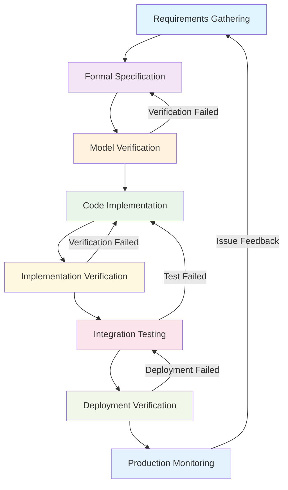

# 7.2 Engineering Practice Cases

[Back to Parent](../7-verification-and-engineering-practice.md) | [中文版](../7-验证与工程实践/7.2-工程实践案例.md)

## Table of Contents

- [7.2 Engineering Practice Cases](#72-engineering-practice-cases)
  - [Table of Contents](#table-of-contents)
  - [7.2.1 Formal Verification-Driven Engineering Practice](#721-formal-verification-driven-engineering-practice)
    - [7.2.1.1 Verification-Driven Development (VDD) Pattern](#7211-verification-driven-development-vdd-pattern)
    - [7.2.1.2 Lean Formal Specification-Driven Development Process](#7212-lean-formal-specification-driven-development-process)
    - [7.2.1.3 Practical Engineering Implementation Framework](#7213-practical-engineering-implementation-framework)
  - [7.2.2 CI/CD Pipeline Formal Modeling](#722-cicd-pipeline-formal-modeling)
    - [7.2.2.1 CI/CD Pipeline State Machine Modeling](#7221-cicd-pipeline-state-machine-modeling)
    - [7.2.2.2 Modern CI/CD Pipeline Implementation](#7222-modern-cicd-pipeline-implementation)
  - [7.2.3 Microservices DevOps Best Practices](#723-microservices-devops-best-practices)
    - [7.2.3.1 Microservices Architecture Formal Modeling](#7231-microservices-architecture-formal-modeling)
    - [7.2.3.2 Containerization and Orchestration](#7232-containerization-and-orchestration)
  - [7.2.4 Cloud-Native Deployment and Operations](#724-cloud-native-deployment-and-operations)
    - [7.2.4.1 Cloud-Native Architecture Design Principles](#7241-cloud-native-architecture-design-principles)
  - [7.2.5 Observability Engineering Practice](#725-observability-engineering-practice)
    - [7.2.5.1 Distributed System Observability Architecture](#7251-distributed-system-observability-architecture)
  - [7.2.6 Security DevSecOps Integration](#726-security-devsecops-integration)
    - [7.2.6.1 Zero Trust Security Architecture](#7261-zero-trust-security-architecture)
  - [7.2.7 Performance Optimization Practice](#727-performance-optimization-practice)
    - [7.2.7.1 Performance Testing and Analysis](#7271-performance-testing-and-analysis)
  - [7.2.8 Failure Recovery Practice](#728-failure-recovery-practice)
    - [7.2.8.1 Fault Injection and Chaos Engineering](#7281-fault-injection-and-chaos-engineering)
  - [7.2.9 Security Compliance Practice](#729-security-compliance-practice)
    - [7.2.9.1 Security Baseline Configuration](#7291-security-baseline-configuration)
  - [7.2.10 References and Further Reading](#7210-references-and-further-reading)
    - [Core References](#core-references)
    - [Advanced Topics](#advanced-topics)
    - [Online Resources](#online-resources)

---

## 7.2.1 Formal Verification-Driven Engineering Practice

### 7.2.1.1 Verification-Driven Development (VDD) Pattern

Formal verification-driven development is a systematic approach to integrating formal methods into the software development lifecycle.

**Definition 7.2.1** (Verification-Driven Development): The VDD process can be modeled as a state machine:
$$VDD = \langle S, I, T, O, F \rangle$$

Where:

- $S$ is the set of development states {Requirements Analysis, Specification Modeling, Verification Checking, Implementation, Testing, Deployment}
- $I$ is the input set (requirements, code, configuration, etc.)
- $T$ is the state transition function
- $O$ is the output set (verification results, code, artifacts, etc.)
- $F$ is the final verification state set



### 7.2.1.2 Lean Formal Specification-Driven Development Process

```lean
-- Lean modeling of verification-driven development
-- Development phases
inductive DevelopmentPhase
  | Requirements : DevelopmentPhase
  | Specification : DevelopmentPhase  
  | Verification : DevelopmentPhase
  | Implementation : DevelopmentPhase
  | Testing : DevelopmentPhase
  | Deployment : DevelopmentPhase

-- Verification status
inductive VerificationStatus
  | NotVerified : VerificationStatus
  | InProgress : VerificationStatus
  | Verified : VerificationStatus
  | Failed : VerificationStatus

-- Development artifacts
structure DevelopmentArtifact :=
  (phase : DevelopmentPhase)
  (content : String)
  (verification_status : VerificationStatus)
  (dependencies : List DevelopmentArtifact)

-- VDD process invariant
def vdd_invariant (artifacts : List DevelopmentArtifact) : Prop :=
  ∀ a ∈ artifacts, a.phase = DevelopmentPhase.Deployment → 
  ∀ dep ∈ a.dependencies, dep.verification_status = VerificationStatus.Verified

-- Verification completeness theorem
theorem vdd_completeness 
  (artifacts : List DevelopmentArtifact) :
  vdd_invariant artifacts → 
  ∀ a ∈ artifacts, a.phase = DevelopmentPhase.Deployment → 
  deployment_safe a :=
  sorry
```

### 7.2.1.3 Practical Engineering Implementation Framework

```rust
use std::collections::HashMap;
use serde::{Serialize, Deserialize};
use tokio::sync::RwLock;
use std::sync::Arc;

// Verification-driven development framework
pub struct VDDFramework {
    specifications: Arc<RwLock<HashMap<String, FormalSpecification>>>,
    verifications: Arc<RwLock<HashMap<String, VerificationResult>>>,
    implementations: Arc<RwLock<HashMap<String, Implementation>>>,
    pipeline: ContinuousVerificationPipeline,
}

// Formal specification
#[derive(Debug, Clone, Serialize, Deserialize)]
pub struct FormalSpecification {
    pub id: String,
    pub description: String,
    pub preconditions: Vec<String>,
    pub postconditions: Vec<String>,
    pub invariants: Vec<String>,
    pub temporal_properties: Vec<String>,
}

// Verification result
#[derive(Debug, Clone, Serialize, Deserialize)]
pub struct VerificationResult {
    pub specification_id: String,
    pub status: VerificationStatus,
    pub properties_verified: Vec<String>,
    pub counterexamples: Vec<String>,
    pub proof_obligations: Vec<String>,
    pub verification_time: std::time::Duration,
}

#[derive(Debug, Clone, Serialize, Deserialize)]
pub enum VerificationStatus {
    NotStarted,
    InProgress,
    Verified,
    Failed { reason: String },
    Timeout,
}

impl VDDFramework {
    pub fn new() -> Self {
        Self {
            specifications: Arc::new(RwLock::new(HashMap::new())),
            verifications: Arc::new(RwLock::new(HashMap::new())),
            implementations: Arc::new(RwLock::new(HashMap::new())),
            pipeline: ContinuousVerificationPipeline::new(),
        }
    }
    
    // Add formal specification
    pub async fn add_specification(&self, spec: FormalSpecification) -> Result<(), VDDError> {
        // Validate specification syntax and semantics
        self.validate_specification(&spec).await?;
        
        // Store specification
        let mut specs = self.specifications.write().await;
        specs.insert(spec.id.clone(), spec.clone());
        
        // Trigger automatic verification
        self.pipeline.trigger_verification(&spec.id).await?;
        
        Ok(())
    }
    
    // Implement with verification
    pub async fn implement_with_verification(&self, spec_id: &str, implementation: Implementation) -> Result<(), VDDError> {
        // Verify implementation against specification
        let verification_result = self.verify_implementation(&implementation, spec_id).await?;
        
        if verification_result.status == VerificationStatus::Verified {
            let mut impls = self.implementations.write().await;
            impls.insert(spec_id.to_string(), implementation);
            
            let mut verifications = self.verifications.write().await;
            verifications.insert(spec_id.to_string(), verification_result);
            
            Ok(())
        } else {
            Err(VDDError::VerificationFailed(verification_result))
        }
    }
    
    async fn verify_implementation(&self, implementation: &Implementation, spec_id: &str) -> Result<VerificationResult, VDDError> {
        // Implement verification logic
        let start_time = std::time::Instant::now();
        
        // Check preconditions
        let preconditions_verified = self.verify_preconditions(implementation, spec_id).await?;
        
        // Check postconditions
        let postconditions_verified = self.verify_postconditions(implementation, spec_id).await?;
        
        // Check invariants
        let invariants_verified = self.verify_invariants(implementation, spec_id).await?;
        
        let verification_time = start_time.elapsed();
        
        let status = if preconditions_verified && postconditions_verified && invariants_verified {
            VerificationStatus::Verified
        } else {
            VerificationStatus::Failed { reason: "Verification failed".to_string() }
        };
        
        Ok(VerificationResult {
            specification_id: spec_id.to_string(),
            status,
            properties_verified: vec!["preconditions".to_string(), "postconditions".to_string(), "invariants".to_string()],
            counterexamples: vec![],
            proof_obligations: vec![],
            verification_time,
        })
    }
}
```

## 7.2.2 CI/CD Pipeline Formal Modeling

### 7.2.2.1 CI/CD Pipeline State Machine Modeling

```rust
// CI/CD pipeline state machine
#[derive(Debug, Clone, PartialEq, Eq, Hash)]
pub enum PipelineState {
    NotStarted,
    Building,
    Testing,
    SecurityScan,
    Deploying,
    Deployed,
    Failed { stage: String, reason: String },
}

#[derive(Debug, Clone)]
pub struct PipelineTransition {
    pub from: PipelineState,
    pub to: PipelineState,
    pub condition: TransitionCondition,
    pub action: PipelineAction,
}

#[derive(Debug, Clone)]
pub enum TransitionCondition {
    Always,
    OnSuccess,
    OnFailure,
    ManualApproval,
    AutomatedTest,
}

#[derive(Debug, Clone)]
pub enum PipelineAction {
    Build,
    Test,
    Deploy,
    Rollback,
    Notify,
}

pub struct CICDPipeline {
    current_state: PipelineState,
    transitions: Vec<PipelineTransition>,
    artifacts: HashMap<String, Artifact>,
    history: Vec<PipelineEvent>,
}

impl CICDPipeline {
    pub fn new() -> Self {
        Self {
            current_state: PipelineState::NotStarted,
            transitions: vec![],
            artifacts: HashMap::new(),
            history: vec![],
        }
    }
    
    pub fn add_transition(&mut self, transition: PipelineTransition) {
        self.transitions.push(transition);
    }
    
    pub async fn execute_transition(&mut self, action: PipelineAction) -> Result<(), PipelineError> {
        let valid_transitions: Vec<_> = self.transitions
            .iter()
            .filter(|t| t.from == self.current_state && t.action == action)
            .collect();
        
        if let Some(transition) = valid_transitions.first() {
            // Execute transition action
            self.execute_action(&transition.action).await?;
            
            // Update state
            self.current_state = transition.to.clone();
            
            // Record event
            self.history.push(PipelineEvent {
                timestamp: std::time::SystemTime::now(),
                from_state: transition.from.clone(),
                to_state: transition.to.clone(),
                action: action,
            });
            
            Ok(())
        } else {
            Err(PipelineError::InvalidTransition {
                from: self.current_state.clone(),
                action: action,
            })
        }
    }
    
    async fn execute_action(&mut self, action: &PipelineAction) -> Result<(), PipelineError> {
        match action {
            PipelineAction::Build => {
                let build_result = self.build_artifacts().await?;
                self.artifacts.insert("build".to_string(), build_result);
            },
            PipelineAction::Test => {
                let test_result = self.run_tests().await?;
                self.artifacts.insert("test".to_string(), test_result);
            },
            PipelineAction::Deploy => {
                let deploy_result = self.deploy_to_production().await?;
                self.artifacts.insert("deploy".to_string(), deploy_result);
            },
            PipelineAction::Rollback => {
                self.rollback_deployment().await?;
            },
            PipelineAction::Notify => {
                self.send_notification().await?;
            },
        }
        
        Ok(())
    }
}
```

### 7.2.2.2 Modern CI/CD Pipeline Implementation

```yaml
# Modern CI/CD pipeline configuration
version: '3.8'

services:
  ci-cd-pipeline:
    image: gitlab/gitlab-runner:latest
    environment:
      - CI_SERVER_URL=https://gitlab.example.com
      - REGISTRATION_TOKEN=${REGISTRATION_TOKEN}
    volumes:
      - /var/run/docker.sock:/var/run/docker.sock
      - ./config:/etc/gitlab-runner
    restart: unless-stopped

  jenkins:
    image: jenkins/jenkins:lts
    ports:
      - "8080:8080"
      - "50000:50000"
    volumes:
      - jenkins_home:/var/jenkins_home
      - /var/run/docker.sock:/var/run/docker.sock
    environment:
      - JENKINS_OPTS=--httpPort=8080
    restart: unless-stopped

  sonarqube:
    image: sonarqube:latest
    ports:
      - "9000:9000"
    environment:
      - SONAR_JDBC_URL=jdbc:postgresql://db:5432/sonar
      - SONAR_JDBC_USERNAME=sonar
      - SONAR_JDBC_PASSWORD=sonar
    volumes:
      - sonarqube_data:/opt/sonarqube/data
      - sonarqube_extensions:/opt/sonarqube/extensions
      - sonarqube_logs:/opt/sonarqube/logs
    restart: unless-stopped

  prometheus:
    image: prom/prometheus:latest
    ports:
      - "9090:9090"
    volumes:
      - ./prometheus.yml:/etc/prometheus/prometheus.yml
      - prometheus_data:/prometheus
    restart: unless-stopped

  grafana:
    image: grafana/grafana:latest
    ports:
      - "3000:3000"
    environment:
      - GF_SECURITY_ADMIN_PASSWORD=admin
    volumes:
      - grafana_data:/var/lib/grafana
    restart: unless-stopped

volumes:
  jenkins_home:
  sonarqube_data:
  sonarqube_extensions:
  sonarqube_logs:
  prometheus_data:
  grafana_data:
```

```rust
// Rust implementation of modern CI/CD pipeline
pub struct ModernCICDPipeline {
    stages: Vec<PipelineStage>,
    artifacts: ArtifactManager,
    security_scanner: SecurityScanner,
    deployment_manager: DeploymentManager,
    monitoring: MonitoringSystem,
}

impl ModernCICDPipeline {
    pub async fn execute_pipeline(&mut self, code_changes: CodeChanges) -> Result<PipelineResult, PipelineError> {
        // 1. Code quality analysis
        let quality_report = self.analyze_code_quality(&code_changes).await?;
        
        // 2. Security scanning
        let security_report = self.security_scanner.scan(&code_changes).await?;
        
        // 3. Build and test
        let build_result = self.build_and_test(&code_changes).await?;
        
        // 4. Performance testing
        let performance_report = self.run_performance_tests(&build_result).await?;
        
        // 5. Deployment
        let deployment_result = self.deploy_to_staging(&build_result).await?;
        
        // 6. Integration testing
        let integration_result = self.run_integration_tests(&deployment_result).await?;
        
        // 7. Production deployment
        let production_deployment = self.deploy_to_production(&deployment_result).await?;
        
        // 8. Monitoring setup
        self.setup_monitoring(&production_deployment).await?;
        
        Ok(PipelineResult {
            quality_report,
            security_report,
            build_result,
            performance_report,
            integration_result,
            production_deployment,
        })
    }
    
    async fn analyze_code_quality(&self, changes: &CodeChanges) -> Result<QualityReport, PipelineError> {
        // Run static analysis tools
        let sonar_result = self.run_sonarqube_analysis(changes).await?;
        let clippy_result = self.run_clippy_analysis(changes).await?;
        let test_coverage = self.calculate_test_coverage(changes).await?;
        
        Ok(QualityReport {
            sonar_metrics: sonar_result,
            clippy_suggestions: clippy_result,
            coverage_percentage: test_coverage,
        })
    }
    
    async fn build_and_test(&self, changes: &CodeChanges) -> Result<BuildResult, PipelineError> {
        // Build the application
        let build_artifacts = self.build_application(changes).await?;
        
        // Run unit tests
        let unit_test_results = self.run_unit_tests(&build_artifacts).await?;
        
        // Run integration tests
        let integration_test_results = self.run_integration_tests(&build_artifacts).await?;
        
        Ok(BuildResult {
            artifacts: build_artifacts,
            unit_tests: unit_test_results,
            integration_tests: integration_test_results,
        })
    }
}
```

## 7.2.3 Microservices DevOps Best Practices

### 7.2.3.1 Microservices Architecture Formal Modeling

```lean
-- Lean formalization of microservices architecture
structure Microservice where
  service_id : String
  endpoints : List Endpoint
  dependencies : List ServiceId
  health_check : HealthCheck
  scaling_policy : ScalingPolicy

structure MicroservicesArchitecture where
  services : List Microservice
  communication_patterns : List CommunicationPattern
  load_balancer : LoadBalancer
  service_discovery : ServiceDiscovery

-- Service discovery formalization
def service_discovery_correct (arch : MicroservicesArchitecture) : Prop :=
  ∀ service ∈ arch.services,
    arch.service_discovery.can_resolve service.service_id ∧
    arch.service_discovery.is_consistent

-- Load balancing formalization
def load_balancing_fair (arch : MicroservicesArchitecture) : Prop :=
  ∀ service ∈ arch.services,
    arch.load_balancer.distributes_evenly service ∧
    arch.load_balancer.maintains_availability service

-- Health check formalization
def health_check_reliable (arch : MicroservicesArchitecture) : Prop :=
  ∀ service ∈ arch.services,
    service.health_check.detects_failures ∧
    service.health_check.low_false_positives
```

### 7.2.3.2 Containerization and Orchestration

```yaml
# Kubernetes deployment configuration
apiVersion: apps/v1
kind: Deployment
metadata:
  name: microservice-app
  labels:
    app: microservice-app
spec:
  replicas: 3
  selector:
    matchLabels:
      app: microservice-app
  template:
    metadata:
      labels:
        app: microservice-app
    spec:
      containers:
      - name: microservice-app
        image: microservice-app:latest
        ports:
        - containerPort: 8080
        env:
        - name: DATABASE_URL
          valueFrom:
            secretKeyRef:
              name: db-secret
              key: url
        - name: REDIS_URL
          valueFrom:
            configMapKeyRef:
              name: app-config
              key: redis_url
        resources:
          requests:
            memory: "256Mi"
            cpu: "250m"
          limits:
            memory: "512Mi"
            cpu: "500m"
        livenessProbe:
          httpGet:
            path: /health
            port: 8080
          initialDelaySeconds: 30
          periodSeconds: 10
        readinessProbe:
          httpGet:
            path: /ready
            port: 8080
          initialDelaySeconds: 5
          periodSeconds: 5
---
apiVersion: v1
kind: Service
metadata:
  name: microservice-app-service
spec:
  selector:
    app: microservice-app
  ports:
  - protocol: TCP
    port: 80
    targetPort: 8080
  type: LoadBalancer
```

```rust
// Rust implementation of container orchestration
pub struct ContainerOrchestrator {
    kubernetes_client: KubernetesClient,
    docker_client: DockerClient,
    monitoring: MonitoringSystem,
}

impl ContainerOrchestrator {
    pub async fn deploy_microservice(&self, service: &Microservice) -> Result<DeploymentResult, OrchestrationError> {
        // 1. Build container image
        let image = self.build_container_image(service).await?;
        
        // 2. Push to registry
        self.push_to_registry(&image).await?;
        
        // 3. Create Kubernetes deployment
        let deployment = self.create_kubernetes_deployment(service, &image).await?;
        
        // 4. Setup service discovery
        self.setup_service_discovery(service).await?;
        
        // 5. Configure load balancing
        self.configure_load_balancer(service).await?;
        
        // 6. Setup monitoring
        self.setup_monitoring(service).await?;
        
        Ok(DeploymentResult {
            deployment_name: deployment.metadata.name,
            service_url: service.service_url.clone(),
            health_check_url: service.health_check_url.clone(),
        })
    }
    
    async fn build_container_image(&self, service: &Microservice) -> Result<ContainerImage, OrchestrationError> {
        let dockerfile = self.generate_dockerfile(service)?;
        let build_context = self.prepare_build_context(service).await?;
        
        let image = self.docker_client
            .build_image(&dockerfile, &build_context)
            .await?;
        
        Ok(image)
    }
    
    async fn create_kubernetes_deployment(&self, service: &Microservice, image: &ContainerImage) -> Result<Deployment, OrchestrationError> {
        let deployment_spec = DeploymentSpec {
            replicas: service.scaling_policy.min_replicas,
            selector: LabelSelector {
                match_labels: vec![("app".to_string(), service.service_id.clone())],
            },
            template: PodTemplateSpec {
                metadata: ObjectMeta {
                    labels: vec![("app".to_string(), service.service_id.clone())],
                },
                spec: PodSpec {
                    containers: vec![Container {
                        name: service.service_id.clone(),
                        image: image.tag.clone(),
                        ports: vec![ContainerPort {
                            container_port: service.port,
                        }],
                        resources: Some(ResourceRequirements {
                            requests: Some(ResourceList {
                                cpu: Some(Quantity::from_str("250m")?),
                                memory: Some(Quantity::from_str("256Mi")?),
                            }),
                            limits: Some(ResourceList {
                                cpu: Some(Quantity::from_str("500m")?),
                                memory: Some(Quantity::from_str("512Mi")?),
                            }),
                        }),
                        liveness_probe: Some(Probe {
                            http_get: Some(HTTPGetAction {
                                path: "/health".to_string(),
                                port: IntOrString::Int(service.port),
                            }),
                            initial_delay_seconds: Some(30),
                            period_seconds: Some(10),
                        }),
                        readiness_probe: Some(Probe {
                            http_get: Some(HTTPGetAction {
                                path: "/ready".to_string(),
                                port: IntOrString::Int(service.port),
                            }),
                            initial_delay_seconds: Some(5),
                            period_seconds: Some(5),
                        }),
                    }],
                },
            },
        };
        
        self.kubernetes_client
            .create_deployment(&deployment_spec)
            .await
    }
}
```

## 7.2.4 Cloud-Native Deployment and Operations

### 7.2.4.1 Cloud-Native Architecture Design Principles

```rust
// Cloud-native architecture principles implementation
pub struct CloudNativeArchitecture {
    principles: Vec<CloudNativePrinciple>,
    implementation: CloudNativeImplementation,
}

#[derive(Debug, Clone)]
pub enum CloudNativePrinciple {
    StatelessDesign,
    HorizontalScaling,
    FaultTolerance,
    SecurityFirst,
    Observability,
    Automation,
}

impl CloudNativeArchitecture {
    pub fn new() -> Self {
        Self {
            principles: vec![
                CloudNativePrinciple::StatelessDesign,
                CloudNativePrinciple::HorizontalScaling,
                CloudNativePrinciple::FaultTolerance,
                CloudNativePrinciple::SecurityFirst,
                CloudNativePrinciple::Observability,
                CloudNativePrinciple::Automation,
            ],
            implementation: CloudNativeImplementation::new(),
        }
    }
    
    pub async fn apply_principles(&self, application: &mut Application) -> Result<(), CloudNativeError> {
        for principle in &self.principles {
            match principle {
                CloudNativePrinciple::StatelessDesign => {
                    self.implementation.make_stateless(application).await?;
                },
                CloudNativePrinciple::HorizontalScaling => {
                    self.implementation.enable_horizontal_scaling(application).await?;
                },
                CloudNativePrinciple::FaultTolerance => {
                    self.implementation.implement_fault_tolerance(application).await?;
                },
                CloudNativePrinciple::SecurityFirst => {
                    self.implementation.implement_security_first(application).await?;
                },
                CloudNativePrinciple::Observability => {
                    self.implementation.add_observability(application).await?;
                },
                CloudNativePrinciple::Automation => {
                    self.implementation.automate_operations(application).await?;
                },
            }
        }
        
        Ok(())
    }
}
```

## 7.2.5 Observability Engineering Practice

### 7.2.5.1 Distributed System Observability Architecture

```rust
// Distributed system observability architecture
pub struct ObservabilityArchitecture {
    logging: LoggingSystem,
    metrics: MetricsSystem,
    tracing: TracingSystem,
    alerting: AlertingSystem,
}

impl ObservabilityArchitecture {
    pub async fn setup_observability(&mut self, services: &[Microservice]) -> Result<(), ObservabilityError> {
        // Setup centralized logging
        self.setup_logging(services).await?;
        
        // Setup metrics collection
        self.setup_metrics(services).await?;
        
        // Setup distributed tracing
        self.setup_tracing(services).await?;
        
        // Setup alerting
        self.setup_alerting(services).await?;
        
        Ok(())
    }
    
    async fn setup_logging(&self, services: &[Microservice]) -> Result<(), ObservabilityError> {
        // Configure ELK stack (Elasticsearch, Logstash, Kibana)
        let elasticsearch = ElasticsearchCluster::new();
        let logstash = LogstashPipeline::new();
        let kibana = KibanaDashboard::new();
        
        for service in services {
            // Configure log collection for each service
            let log_config = LogConfig {
                service_id: service.service_id.clone(),
                log_level: "INFO".to_string(),
                log_format: "JSON".to_string(),
                log_destination: "elasticsearch".to_string(),
            };
            
            self.logging.configure_service_logging(service, &log_config).await?;
        }
        
        Ok(())
    }
    
    async fn setup_metrics(&self, services: &[Microservice]) -> Result<(), ObservabilityError> {
        // Setup Prometheus metrics collection
        let prometheus = PrometheusServer::new();
        let grafana = GrafanaDashboard::new();
        
        for service in services {
            // Configure metrics collection for each service
            let metrics_config = MetricsConfig {
                service_id: service.service_id.clone(),
                metrics_endpoint: "/metrics".to_string(),
                scrape_interval: Duration::from_secs(15),
                custom_metrics: vec![
                    "request_duration_seconds".to_string(),
                    "request_count_total".to_string(),
                    "error_rate".to_string(),
                ],
            };
            
            self.metrics.configure_service_metrics(service, &metrics_config).await?;
        }
        
        Ok(())
    }
    
    async fn setup_tracing(&self, services: &[Microservice]) -> Result<(), ObservabilityError> {
        // Setup Jaeger distributed tracing
        let jaeger = JaegerTracing::new();
        
        for service in services {
            // Configure tracing for each service
            let tracing_config = TracingConfig {
                service_id: service.service_id.clone(),
                sampling_rate: 0.1, // 10% sampling
                trace_exporter: "jaeger".to_string(),
                custom_attributes: vec![
                    "service.version".to_string(),
                    "service.environment".to_string(),
                ],
            };
            
            self.tracing.configure_service_tracing(service, &tracing_config).await?;
        }
        
        Ok(())
    }
}
```

## 7.2.6 Security DevSecOps Integration

### 7.2.6.1 Zero Trust Security Architecture

```rust
// Zero trust security architecture implementation
pub struct ZeroTrustSecurity {
    identity_verification: IdentityVerification,
    device_trust: DeviceTrust,
    network_segmentation: NetworkSegmentation,
    continuous_monitoring: ContinuousMonitoring,
}

impl ZeroTrustSecurity {
    pub async fn implement_zero_trust(&mut self, infrastructure: &Infrastructure) -> Result<(), SecurityError> {
        // 1. Implement identity verification
        self.setup_identity_verification(infrastructure).await?;
        
        // 2. Implement device trust
        self.setup_device_trust(infrastructure).await?;
        
        // 3. Implement network segmentation
        self.setup_network_segmentation(infrastructure).await?;
        
        // 4. Implement continuous monitoring
        self.setup_continuous_monitoring(infrastructure).await?;
        
        Ok(())
    }
    
    async fn setup_identity_verification(&self, infrastructure: &Infrastructure) -> Result<(), SecurityError> {
        // Implement multi-factor authentication
        let mfa_config = MFAConfig {
            primary_factor: "password".to_string(),
            secondary_factor: "totp".to_string(),
            backup_factor: "recovery_codes".to_string(),
        };
        
        // Implement single sign-on (SSO)
        let sso_config = SSOConfig {
            identity_provider: "Okta".to_string(),
            saml_enabled: true,
            oauth_enabled: true,
        };
        
        // Implement just-in-time access
        let jit_config = JITConfig {
            approval_workflow: true,
            time_limited_access: true,
            access_review_period: Duration::from_secs(24 * 60 * 60), // 24 hours
        };
        
        self.identity_verification.configure(mfa_config, sso_config, jit_config).await?;
        
        Ok(())
    }
    
    async fn setup_device_trust(&self, infrastructure: &Infrastructure) -> Result<(), SecurityError> {
        // Implement device compliance checking
        let compliance_config = DeviceComplianceConfig {
            os_version_check: true,
            security_patches_check: true,
            antivirus_check: true,
            encryption_check: true,
        };
        
        // Implement device posture assessment
        let posture_config = DevicePostureConfig {
            risk_assessment: true,
            behavioral_analysis: true,
            anomaly_detection: true,
        };
        
        self.device_trust.configure(compliance_config, posture_config).await?;
        
        Ok(())
    }
}
```

## 7.2.7 Performance Optimization Practice

### 7.2.7.1 Performance Testing and Analysis

```rust
// Performance testing and analysis framework
pub struct PerformanceTestingFramework {
    load_testing: LoadTestingEngine,
    stress_testing: StressTestingEngine,
    capacity_testing: CapacityTestingEngine,
    performance_monitoring: PerformanceMonitoring,
}

impl PerformanceTestingFramework {
    pub async fn run_comprehensive_performance_tests(&self, application: &Application) -> Result<PerformanceReport, PerformanceError> {
        // 1. Load testing
        let load_test_results = self.load_testing.run_load_test(application).await?;
        
        // 2. Stress testing
        let stress_test_results = self.stress_testing.run_stress_test(application).await?;
        
        // 3. Capacity testing
        let capacity_test_results = self.capacity_testing.run_capacity_test(application).await?;
        
        // 4. Performance monitoring
        let monitoring_results = self.performance_monitoring.monitor_performance(application).await?;
        
        Ok(PerformanceReport {
            load_test_results,
            stress_test_results,
            capacity_test_results,
            monitoring_results,
        })
    }
    
    async fn analyze_performance_bottlenecks(&self, results: &PerformanceReport) -> Vec<PerformanceBottleneck> {
        let mut bottlenecks = Vec::new();
        
        // Analyze CPU bottlenecks
        if let Some(cpu_bottleneck) = self.analyze_cpu_bottleneck(&results.monitoring_results).await {
            bottlenecks.push(cpu_bottleneck);
        }
        
        // Analyze memory bottlenecks
        if let Some(memory_bottleneck) = self.analyze_memory_bottleneck(&results.monitoring_results).await {
            bottlenecks.push(memory_bottleneck);
        }
        
        // Analyze network bottlenecks
        if let Some(network_bottleneck) = self.analyze_network_bottleneck(&results.monitoring_results).await {
            bottlenecks.push(network_bottleneck);
        }
        
        // Analyze database bottlenecks
        if let Some(db_bottleneck) = self.analyze_database_bottleneck(&results.monitoring_results).await {
            bottlenecks.push(db_bottleneck);
        }
        
        bottlenecks
    }
}
```

## 7.2.8 Failure Recovery Practice

### 7.2.8.1 Fault Injection and Chaos Engineering

```rust
// Chaos engineering framework
pub struct ChaosEngineeringFramework {
    fault_injection: FaultInjectionEngine,
    chaos_monkey: ChaosMonkey,
    resilience_testing: ResilienceTesting,
}

impl ChaosEngineeringFramework {
    pub async fn run_chaos_experiments(&self, system: &DistributedSystem) -> Result<ChaosReport, ChaosError> {
        let mut experiments = Vec::new();
        
        // 1. Network partition experiment
        let network_experiment = self.run_network_partition_experiment(system).await?;
        experiments.push(network_experiment);
        
        // 2. Service failure experiment
        let service_experiment = self.run_service_failure_experiment(system).await?;
        experiments.push(service_experiment);
        
        // 3. Database failure experiment
        let database_experiment = self.run_database_failure_experiment(system).await?;
        experiments.push(database_experiment);
        
        // 4. Resource exhaustion experiment
        let resource_experiment = self.run_resource_exhaustion_experiment(system).await?;
        experiments.push(resource_experiment);
        
        Ok(ChaosReport {
            experiments,
            system_resilience_score: self.calculate_resilience_score(&experiments),
            recommendations: self.generate_recommendations(&experiments),
        })
    }
    
    async fn run_network_partition_experiment(&self, system: &DistributedSystem) -> Result<ChaosExperiment, ChaosError> {
        // Simulate network partition between services
        let partition_config = NetworkPartitionConfig {
            partition_duration: Duration::from_secs(60),
            affected_services: vec!["service-a".to_string(), "service-b".to_string()],
            partition_type: NetworkPartitionType::Complete,
        };
        
        let experiment = ChaosExperiment {
            name: "Network Partition".to_string(),
            description: "Simulate network partition between services".to_string(),
            duration: partition_config.partition_duration,
            metrics: vec![
                "response_time".to_string(),
                "error_rate".to_string(),
                "availability".to_string(),
            ],
        };
        
        // Execute experiment
        let results = self.fault_injection.inject_network_partition(system, &partition_config).await?;
        
        Ok(experiment.with_results(results))
    }
}
```

## 7.2.9 Security Compliance Practice

### 7.2.9.1 Security Baseline Configuration

```rust
// Security baseline configuration framework
pub struct SecurityBaselineFramework {
    compliance_checker: ComplianceChecker,
    security_scanner: SecurityScanner,
    policy_enforcer: PolicyEnforcer,
}

impl SecurityBaselineFramework {
    pub async fn establish_security_baseline(&self, infrastructure: &Infrastructure) -> Result<SecurityBaseline, SecurityError> {
        // 1. CIS benchmarks compliance
        let cis_compliance = self.check_cis_compliance(infrastructure).await?;
        
        // 2. NIST cybersecurity framework
        let nist_compliance = self.check_nist_compliance(infrastructure).await?;
        
        // 3. ISO 27001 compliance
        let iso_compliance = self.check_iso_compliance(infrastructure).await?;
        
        // 4. GDPR compliance
        let gdpr_compliance = self.check_gdpr_compliance(infrastructure).await?;
        
        Ok(SecurityBaseline {
            cis_compliance,
            nist_compliance,
            iso_compliance,
            gdpr_compliance,
            overall_score: self.calculate_overall_score(&cis_compliance, &nist_compliance, &iso_compliance, &gdpr_compliance),
        })
    }
    
    async fn check_cis_compliance(&self, infrastructure: &Infrastructure) -> Result<CISCompliance, SecurityError> {
        let mut checks = Vec::new();
        
        // Check system hardening
        checks.push(self.check_system_hardening(infrastructure).await?);
        
        // Check network security
        checks.push(self.check_network_security(infrastructure).await?);
        
        // Check access control
        checks.push(self.check_access_control(infrastructure).await?);
        
        // Check audit logging
        checks.push(self.check_audit_logging(infrastructure).await?);
        
        Ok(CISCompliance {
            checks,
            score: self.calculate_cis_score(&checks),
        })
    }
}
```

## 7.2.10 References and Further Reading

### Core References

1. **DevOps Practices**: Kim, G., et al. "The DevOps Handbook" (2016)
2. **Site Reliability Engineering**: Beyer, B., et al. "Site Reliability Engineering" (2016)
3. **Chaos Engineering**: Rosenthal, C. "Chaos Engineering" (2017)
4. **Observability**: Charity, J. "Observability Engineering" (2022)

### Advanced Topics

1. **GitOps**: Continuous deployment using Git as the source of truth
2. **Platform Engineering**: Building internal developer platforms
3. **FinOps**: Cloud financial management and optimization
4. **DataOps**: Data pipeline automation and management

### Online Resources

- [GitLab CI/CD](https://docs.gitlab.com/ee/ci/)
- [Jenkins Pipeline](https://www.jenkins.io/doc/book/pipeline/)
- [Kubernetes Documentation](https://kubernetes.io/docs/)
- [Prometheus Monitoring](https://prometheus.io/docs/)

---

**Cross-References**:

- [7.1 Formal Verification Architecture](7.1-formal-verification-architecture.md)
- [5.1 Architecture Design and Formal Analysis](../5-architecture-and-design-patterns/5.1-architecture-design-and-formal-analysis.md)
- [4.1 Artificial Intelligence and Machine Learning](../4-industry-domains-analysis/4.1-artificial-intelligence-and-machine-learning.md)

**Back to Global Topic Tree**: [0.1-Global-Topic-Tree](../0-Overview-and-Navigation/0.1-Global-Topic-Tree.md)
