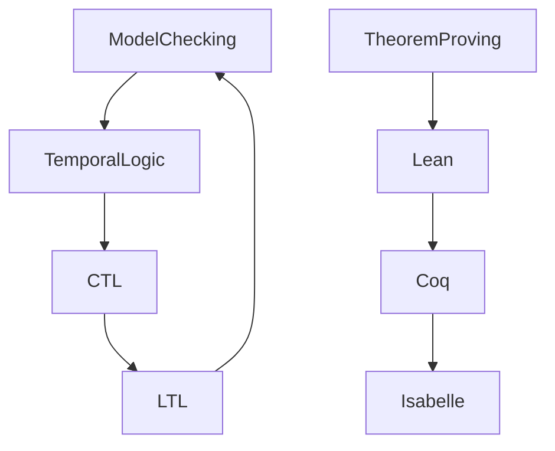

# 7.1 形式化验证架构

[返回上级](../7-验证与工程实践.md) | [English Version](../7-verification-and-engineering-practice/7.1-formal-verification-architecture.md)

## 目录

- [7.1 形式化验证架构](#71-形式化验证架构)
  - [目录](#目录)
  - [7.1.1 形式化验证全景图](#711-形式化验证全景图)
  - [7.1.2 典型验证方法](#712-典型验证方法)
  - [7.1.3 代码示例](#713-代码示例)
  - [7.1.4 参考文献](#714-参考文献)

---

## 7.1.1 形式化验证全景图



## 7.1.2 典型验证方法

\[
\text{模型检测：} \forall s \in S, \forall \phi \in \Phi, M, s \models \phi
\]

```lean
-- Lean 伪代码：模型检测
def model_check (M : Model) (s : State) (φ : Formula) : Prop :=
  match φ with
  | atom p => M.valuation s p
  | not ψ => not (model_check M s ψ)
  | and ψ₁ ψ₂ => model_check M s ψ₁ ∧ model_check M s ψ₂
```

## 7.1.3 代码示例

```rust
// Rust 伪代码：形式化验证
struct ModelChecker {
    states: Vec<State>,
    transitions: Vec<(State, State)>,
    properties: Vec<Property>,
}
```

## 7.1.4 参考文献

- 《形式化方法导论》
- [Model Checking](https://en.wikipedia.org/wiki/Model_checking)
- TODO: 更多权威文献

---

[返回目录](../0-总览与导航/0.1-全局主题树形目录.md)
