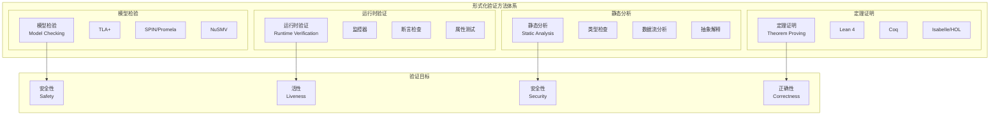
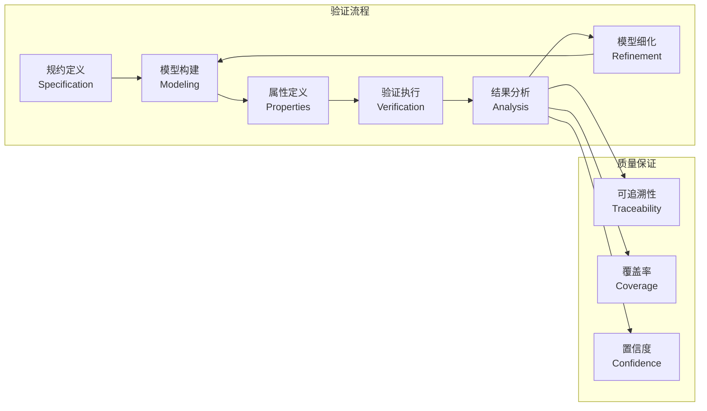
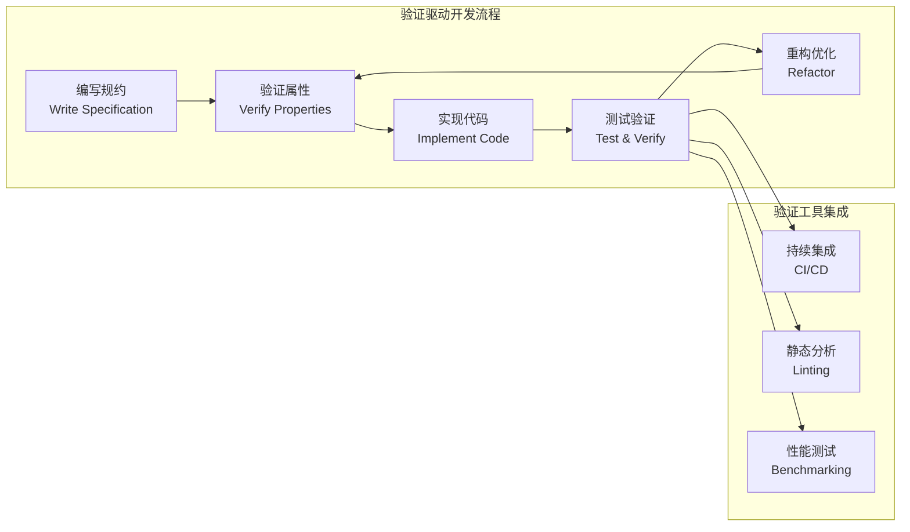

# 7.1 形式化验证架构

[返回上级](../7-验证与工程实践.md) | [English Version](../7-verification-and-engineering-practice/7.1-formal-verification-architecture.md)

## 目录

- [7.1 形式化验证架构](#71-形式化验证架构)
  - [目录](#目录)
  - [7.1.1 形式化验证体系概览](#711-形式化验证体系概览)
    - [7.1.1.1 验证方法分类](#7111-验证方法分类)
    - [7.1.1.2 验证工具生态](#7112-验证工具生态)
    - [7.1.1.3 验证流程框架](#7113-验证流程框架)
  - [7.1.2 模型检验方法](#712-模型检验方法)
    - [7.1.2.1 时序逻辑基础](#7121-时序逻辑基础)
    - [7.1.2.2 TLA+验证实践](#7122-tla验证实践)
    - [7.1.2.3 状态空间探索](#7123-状态空间探索)
  - [7.1.3 定理证明方法](#713-定理证明方法)
    - [7.1.3.1 Lean定理证明](#7131-lean定理证明)
    - [7.1.3.2 类型系统验证](#7132-类型系统验证)
    - [7.1.3.3 程序证明技术](#7133-程序证明技术)
  - [7.1.4 系统架构验证实施](#714-系统架构验证实施)
    - [7.1.4.1 微服务架构验证](#7141-微服务架构验证)
  - [7.1.5 验证工程实践](#715-验证工程实践)
    - [7.1.5.1 验证驱动开发](#7151-验证驱动开发)
    - [7.1.5.2 持续验证集成](#7152-持续验证集成)
  - [交叉引用](#交叉引用)
    - [相关主题](#相关主题)
    - [本地导航](#本地导航)
    - [参考文献](#参考文献)
      - [权威文献](#权威文献)
      - [在线资源](#在线资源)

---

## 7.1.1 形式化验证体系概览

### 7.1.1.1 验证方法分类



### 7.1.1.2 验证工具生态

**工具选择矩阵**:

\[
\text{工具适用性：} T(P, D, S) = f(\text{问题复杂度}, \text{领域特征}, \text{可扩展性})
\]

```lean
-- Lean 形式化：验证工具选择
structure VerificationTool :=
  (name : String)
  (method : VerificationMethod)
  (scalability : ScalabilityLevel)
  (domain_suitability : List Domain)
  (learning_curve : ComplexityLevel)

inductive VerificationMethod
  | ModelChecking
  | TheoremProving  
  | StaticAnalysis
  | RuntimeVerification

def optimal_tool_selection (problem : VerificationProblem) : VerificationTool :=
  match problem.domain, problem.size, problem.properties with
  | Domain.ConcurrentSystems, Size.Medium, [Safety, Liveness] => 
      ⟨"TLA+", VerificationMethod.ModelChecking, ScalabilityLevel.High, _, _⟩
  | Domain.FunctionalPrograms, Size.Large, [Correctness] =>
      ⟨"Lean", VerificationMethod.TheoremProving, ScalabilityLevel.VeryHigh, _, _⟩
  | _ => default_tool
```

### 7.1.1.3 验证流程框架



## 7.1.2 模型检验方法

### 7.1.2.1 时序逻辑基础

**线性时序逻辑(LTL)**:

\[
\phi ::= p \mid \neg \phi \mid \phi_1 \land \phi_2 \mid \bigcirc \phi \mid \phi_1 \mathcal{U} \phi_2
\]

**计算树逻辑(CTL)**:

\[
\phi ::= p \mid \neg \phi \mid \phi_1 \land \phi_2 \mid \mathbf{E} \psi \mid \mathbf{A} \psi
\]

\[
\psi ::= \bigcirc \phi \mid \phi_1 \mathcal{U} \phi_2
\]

```lean
-- Lean 形式化：时序逻辑
inductive LTLFormula
  | atom : Prop → LTLFormula
  | neg : LTLFormula → LTLFormula  
  | and : LTLFormula → LTLFormula → LTLFormula
  | next : LTLFormula → LTLFormula
  | until : LTLFormula → LTLFormula → LTLFormula

-- 语义定义
def satisfies (π : Stream State) (n : ℕ) (φ : LTLFormula) : Prop :=
  match φ with
  | LTLFormula.atom p => π.nth n |= p
  | LTLFormula.neg ψ => ¬ satisfies π n ψ  
  | LTLFormula.and ψ₁ ψ₂ => satisfies π n ψ₁ ∧ satisfies π n ψ₂
  | LTLFormula.next ψ => satisfies π (n + 1) ψ
  | LTLFormula.until ψ₁ ψ₂ => 
      ∃ k ≥ n, satisfies π k ψ₂ ∧ ∀ j ∈ [n, k), satisfies π j ψ₁
```

### 7.1.2.2 TLA+验证实践

**微服务架构TLA+模型**:

```tla
---- MODULE MicroserviceArchitecture ----
EXTENDS Naturals, Sequences, FiniteSets

CONSTANTS Services, MaxRequests

VARIABLES 
    service_status,     \* 服务状态
    request_queue,      \* 请求队列  
    response_map,       \* 响应映射
    load_balancer       \* 负载均衡器状态

TypeInvariant ==
    /\ service_status ∈ [Services → {"healthy", "unhealthy", "starting", "stopping"}]
    /\ request_queue ∈ Seq(Nat × Services)
    /\ response_map ∈ [Nat → {"pending", "success", "failure"}]
    /\ load_balancer ∈ [Services → Nat]

Init ==
    /\ service_status = [s ∈ Services ↦ "healthy"]
    /\ request_queue = ⟨⟩
    /\ response_map = [r ∈ {} ↦ "pending"]  
    /\ load_balancer = [s ∈ Services ↦ 0]

\* 服务健康检查
HealthCheck(s) ==
    /\ service_status[s] ∈ {"healthy", "unhealthy"}
    /\ service_status' = [service_status EXCEPT ![s] = 
          IF service_status[s] = "healthy" 
          THEN "healthy"  \* 假设健康服务保持健康
          ELSE "unhealthy"]
    /\ UNCHANGED ⟨request_queue, response_map, load_balancer⟩

\* 请求处理
ProcessRequest ==
    /\ request_queue ≠ ⟨⟩
    /\ LET req == Head(request_queue)
           req_id == req[1]
           target_service == req[2]
       IN
       /\ service_status[target_service] = "healthy"
       /\ response_map' = [response_map EXCEPT ![req_id] = "success"]
       /\ request_queue' = Tail(request_queue)
       /\ load_balancer' = [load_balancer EXCEPT ![target_service] = @ + 1]
       /\ UNCHANGED service_status

\* 负载均衡公平性
LoadBalancingFairness ==
    LET healthy_services == {s ∈ Services : service_status[s] = "healthy"}
        max_load == Max({load_balancer[s] : s ∈ healthy_services})
        min_load == Min({load_balancer[s] : s ∈ healthy_services}) 
    IN max_load - min_load ≤ 1

\* 请求最终响应性
RequestsGetResponses ==
    ∀ req_id ∈ DOMAIN response_map : response_map[req_id] ≠ "pending"

Next == 
    ∨ ∃ s ∈ Services : HealthCheck(s)
    ∨ ProcessRequest

Spec == Init ∧ □[Next]_⟨service_status, request_queue, response_map, load_balancer⟩

\* 验证属性
THEOREM Spec ⇒ □TypeInvariant
THEOREM Spec ⇒ □LoadBalancingFairness  
THEOREM Spec ⇒ ◇□RequestsGetResponses
====
```

### 7.1.2.3 状态空间探索

**状态空间优化技术**:

```rust
// 状态空间探索优化
use std::collections::{HashMap, HashSet, VecDeque};
use std::hash::{Hash, Hasher};

#[derive(Debug, Clone)]
pub struct StateSpace<S> {
    states: HashMap<StateId, S>,
    transitions: HashMap<StateId, Vec<StateId>>,
    initial_states: Vec<StateId>,
    visited: HashSet<StateId>,
}

impl<S> StateSpace<S> 
where 
    S: Clone + Hash + Eq,
{
    pub fn explore_bfs(&mut self, property: impl Fn(&S) -> bool) -> ExplorationResult {
        let mut queue = VecDeque::new();
        let mut counterexample = None;
        
        // 初始化队列
        for &initial_id in &self.initial_states {
            queue.push_back(initial_id);
            self.visited.insert(initial_id);
        }
        
        while let Some(current_id) = queue.pop_front() {
            let current_state = &self.states[&current_id];
            
            // 检查属性
            if !property(current_state) {
                counterexample = Some(self.reconstruct_path(current_id));
                break;
            }
            
            // 探索后继状态
            if let Some(successors) = self.transitions.get(&current_id) {
                for &next_id in successors {
                    if !self.visited.contains(&next_id) {
                        self.visited.insert(next_id);
                        queue.push_back(next_id);
                    }
                }
            }
        }
        
        ExplorationResult {
            states_explored: self.visited.len(),
            property_holds: counterexample.is_none(),
            counterexample,
        }
    }
    
    // 部分阶归约优化
    pub fn explore_with_partial_order_reduction(
        &mut self,
        ample_set: impl Fn(&S) -> Vec<Action>
    ) -> ExplorationResult {
        // 实现部分阶归约算法
        // 通过选择ample集合来减少状态空间
        todo!()
    }
    
    // 抽象解释优化
    pub fn explore_with_abstraction<A>(
        &mut self,
        abstraction: impl Fn(&S) -> A,
        refinement: impl Fn(&A, &S) -> bool
    ) -> ExplorationResult 
    where 
        A: Hash + Eq + Clone,
    {
        // 实现抽象解释算法
        // 使用抽象状态减少搜索空间
        todo!()
    }
}
```

## 7.1.3 定理证明方法

### 7.1.3.1 Lean定理证明

**系统属性的形式化证明**:

```lean
-- 并发系统的安全性证明
structure ConcurrentSystem where
  processes : Type
  states : processes → Type  
  actions : ∀ p, states p → states p → Prop
  invariant : ∀ p, states p → Prop

-- 安全性定义
def safe (sys : ConcurrentSystem) : Prop :=
  ∀ p s, sys.invariant p s → 
    ∀ s', sys.actions p s s' → sys.invariant p s'

-- 系统组合的安全性
theorem composed_system_safe 
  (sys1 sys2 : ConcurrentSystem)
  (h1 : safe sys1) 
  (h2 : safe sys2)
  (disjoint : ∀ p1 p2, sys1.processes ≠ sys2.processes) :
  safe (compose_systems sys1 sys2) := by
  unfold safe
  intros p s h_inv s' h_action
  -- 证明组合系统保持不变量
  cases' p with p1 p2
  · -- 系统1的进程
    apply h1
    exact h_inv
    exact h_action
  · -- 系统2的进程  
    apply h2
    exact h_inv
    exact h_action

-- 分布式共识算法证明
theorem raft_consensus_safety 
  (nodes : Finset Node)
  (log : Node → List Entry)
  (term : Node → Nat) :
  ∀ n1 n2 : Node, n1 ∈ nodes → n2 ∈ nodes →
    is_leader n1 → is_leader n2 → term n1 = term n2 → n1 = n2 := by
  intros n1 n2 h1 h2 leader1 leader2 same_term
  -- 证明同一任期内最多有一个领导者
  sorry -- 具体证明省略
```

### 7.1.3.2 类型系统验证

**Rust类型系统中的形式化验证**:

```rust
// 使用Rust类型系统进行编译时验证
use std::marker::PhantomData;

// 状态类型标记
pub struct Initialized;
pub struct Running;  
pub struct Stopped;

// 状态机类型
pub struct StateMachine<S> {
    state: PhantomData<S>,
    data: String,
}

impl StateMachine<Initialized> {
    pub fn new(data: String) -> Self {
        StateMachine {
            state: PhantomData,
            data,
        }
    }
    
    pub fn start(self) -> StateMachine<Running> {
        StateMachine {
            state: PhantomData,
            data: self.data,
        }
    }
}

impl StateMachine<Running> {
    pub fn process(&self, input: &str) -> String {
        format!("Processing: {} with {}", input, self.data)
    }
    
    pub fn stop(self) -> StateMachine<Stopped> {
        StateMachine {
            state: PhantomData,
            data: self.data,
        }
    }
}

impl StateMachine<Stopped> {
    pub fn restart(self) -> StateMachine<Running> {
        StateMachine {
            state: PhantomData,
            data: self.data,
        }
    }
}

// 线性类型系统模拟
pub struct LinearResource<T> {
    value: Option<T>,
}

impl<T> LinearResource<T> {
    pub fn new(value: T) -> Self {
        LinearResource { value: Some(value) }
    }
    
    pub fn consume(mut self) -> T {
        self.value.take().expect("Resource already consumed")
    }
    
    pub fn is_consumed(&self) -> bool {
        self.value.is_none()
    }
}

// 仿射类型系统模拟（最多使用一次）
pub struct AffineType<T> {
    inner: T,
    used: std::cell::Cell<bool>,
}

impl<T> AffineType<T> {
    pub fn new(value: T) -> Self {
        AffineType {
            inner: value,
            used: std::cell::Cell::new(false),
        }
    }
    
    pub fn use_once(&self) -> Option<&T> {
        if self.used.get() {
            None
        } else {
            self.used.set(true);
            Some(&self.inner)
        }
    }
}
```

### 7.1.3.3 程序证明技术

**程序正确性的机械化证明**:

```lean
-- Hoare逻辑在Lean中的实现
structure HoareTriple (α : Type) where
  pre : α → Prop          -- 前置条件
  prog : α → α             -- 程序
  post : α → Prop         -- 后置条件

-- Hoare逻辑规则
def hoare_consequence {α : Type} 
  (P P' Q Q' : α → Prop) 
  (prog : α → α)
  (h1 : ∀ s, P s → P' s)           -- 前置条件加强
  (h2 : ∀ s, Q' s → Q s)           -- 后置条件减弱  
  (h3 : HoareTriple.mk P' prog Q') -- 原三元组有效
  : HoareTriple.mk P prog Q := by
  constructor
  intro s h_pre
  apply h2
  apply h3.post
  apply h1
  exact h_pre

-- 程序验证示例：数组排序
def array_sort_spec (arr : Array Nat) : HoareTriple (Array Nat) where
  pre := fun _ => True
  prog := Array.qsort (· ≤ ·)
  post := fun result => 
    result.size = arr.size ∧ 
    result.data.Sorted (· ≤ ·) ∧
    Multiset.ofList result.data = Multiset.ofList arr.data

theorem array_sort_correct (arr : Array Nat) : 
  array_sort_spec arr = ⟨fun _ => True, Array.qsort (· ≤ ·), _⟩ := by
  sorry -- 具体证明省略
```

## 7.1.4 系统架构验证实施

### 7.1.4.1 微服务架构验证

**服务发现一致性验证**:

```rust
// 服务发现的形式化验证实现
use std::collections::{HashMap, HashSet};

#[derive(Debug, Clone, PartialEq)]
pub struct ServiceRegistry {
    services: HashMap<ServiceId, HashSet<InstanceId>>,
    health_status: HashMap<InstanceId, HealthStatus>,
    discovery_cache: HashMap<ServiceId, Vec<InstanceId>>,
}

#[derive(Debug, Clone, PartialEq)]
pub enum HealthStatus {
    Healthy,
    Unhealthy,
    Unknown,
}

impl ServiceRegistry {
    // 不变量：发现的实例都是健康的
    pub fn discovery_invariant(&self) -> bool {
        for (service_id, instances) in &self.discovery_cache {
            for instance_id in instances {
                match self.health_status.get(instance_id) {
                    Some(HealthStatus::Healthy) => continue,
                    _ => return false,
                }
            }
        }
        true
    }
    
    // 不变量：注册的实例存在健康状态
    pub fn registration_invariant(&self) -> bool {
        for instances in self.services.values() {
            for instance_id in instances {
                if !self.health_status.contains_key(instance_id) {
                    return false;
                }
            }
        }
        true
    }
    
    // 操作：注册服务实例
    pub fn register_instance(&mut self, service_id: ServiceId, instance_id: InstanceId) -> bool {
        // 前置条件检查
        assert!(self.registration_invariant());
        
        // 执行操作
        self.services.entry(service_id).or_insert_with(HashSet::new).insert(instance_id);
        self.health_status.insert(instance_id, HealthStatus::Healthy);
        
        // 更新发现缓存
        if let Some(cache) = self.discovery_cache.get_mut(&service_id) {
            if !cache.contains(&instance_id) {
                cache.push(instance_id);
            }
        } else {
            self.discovery_cache.insert(service_id, vec![instance_id]);
        }
        
        // 后置条件检查
        let post_condition = self.registration_invariant() && self.discovery_invariant();
        assert!(post_condition, "注册操作违反了不变量");
        
        post_condition
    }
    
    // 验证操作序列的正确性
    pub fn verify_operation_sequence(&mut self, operations: Vec<RegistryOperation>) -> bool {
        for operation in operations {
            if !self.execute_operation(operation) {
                return false;
            }
        }
        true
    }
}

#[derive(Debug, Clone)]
pub enum RegistryOperation {
    Register { service_id: ServiceId, instance_id: InstanceId },
    Deregister { service_id: ServiceId, instance_id: InstanceId },
    UpdateHealth { instance_id: InstanceId, status: HealthStatus },
    Discover { service_id: ServiceId },
}

impl ServiceRegistry {
    fn execute_operation(&mut self, op: RegistryOperation) -> bool {
        match op {
            RegistryOperation::Register { service_id, instance_id } => {
                self.register_instance(service_id, instance_id)
            }
            RegistryOperation::Deregister { service_id, instance_id } => {
                self.deregister_instance(service_id, instance_id)
            }
            RegistryOperation::UpdateHealth { instance_id, status } => {
                self.update_health_status(instance_id, status)
            }
            RegistryOperation::Discover { service_id } => {
                self.discover_instances(service_id).is_some()
            }
        }
    }
}
```

## 7.1.5 验证工程实践

### 7.1.5.1 验证驱动开发

**验证驱动开发流程**:



### 7.1.5.2 持续验证集成

**CI/CD流水线中的验证集成**:

```yaml
# 形式化验证CI/CD配置
name: Formal Verification Pipeline

on:
  push:
    branches: [main, develop]
  pull_request:
    branches: [main]

jobs:
  static-verification:
    runs-on: ubuntu-latest
    steps:
      - uses: actions/checkout@v3
      
      - name: Install Lean
        run: |
          curl -sSf https://raw.githubusercontent.com/leanprover/elan/master/elan-init.sh | sh
          echo "$HOME/.elan/bin" >> $GITHUB_PATH
          
      - name: Verify Lean Proofs
        run: |
          lake build
          lake test
          
      - name: Type Check Rust Code
        run: |
          cargo check --all-features
          cargo clippy -- -D warnings
          
  model-checking:
    runs-on: ubuntu-latest
    steps:
      - uses: actions/checkout@v3
      
      - name: Install TLA+
        run: |
          wget https://github.com/tlaplus/tlaplus/releases/download/v1.8.0/tla2tools.jar
          
      - name: Run TLA+ Model Checking
        run: |
          java -cp tla2tools.jar tlc2.TLC -config models/MicroserviceArchitecture.cfg models/MicroserviceArchitecture.tla
          
  property-testing:
    runs-on: ubuntu-latest
    steps:
      - uses: actions/checkout@v3
      
      - name: Run Property Tests
        run: |
          cargo test --test property_tests
          
      - name: Generate Verification Report
        run: |
          cargo test --test verification_report -- --nocapture > verification_report.txt
          
      - name: Upload Verification Results
        uses: actions/upload-artifact@v3
        with:
          name: verification-report
          path: verification_report.txt
```

## 交叉引用

### 相关主题

- [1.1-统一形式化理论综述](../1-形式化理论/1.1-统一形式化理论综述.md) - 形式化理论基础
- [1.3-时序逻辑与控制](../1-形式化理论/1.3-时序逻辑与控制.md) - 时序逻辑验证
- [5.1-架构设计与形式化分析](../5-架构与设计模式/5.1-架构设计与形式化分析.md) - 架构设计方法
- [6.1-lean语言与形式化证明](../6-编程语言与实现/6.1-lean语言与形式化证明.md) - Lean证明实践

### 本地导航

- [7.2-工程实践案例](./7.2-工程实践案例.md)
- [7.x-其他实践主题](./7.x-其他实践主题.md)
- [返回验证与工程实践主页](../7-验证与工程实践.md)

### 参考文献

#### 权威文献

1. Clarke, E. M., Grumberg, O., & Peled, D. (2018). *Model Checking*. MIT Press.
2. Lamport, L. (2002). *Specifying Systems*. Addison-Wesley.
3. Pierce, B. C. (2002). *Types and Programming Languages*. MIT Press.
4. Nipkow, T., Paulson, L. C., & Wenzel, M. (2002). *Isabelle/HOL*. Springer.
5. Avigad, J., & Moura, L. (2021). *Theorem Proving in Lean 4*. Lean Community.

#### 在线资源

- [TLA+ Video Course](https://lamport.azurewebsites.net/video/videos.html)
- [Lean 4 Manual](https://leanprover.github.io/lean4/doc/)
- [CBMC Bounded Model Checker](http://www.cprover.org/cbmc/)
- [SPIN Model Checker](http://spinroot.com/)

---

[返回目录](../0-总览与导航/0.1-全局主题树形目录.md)
