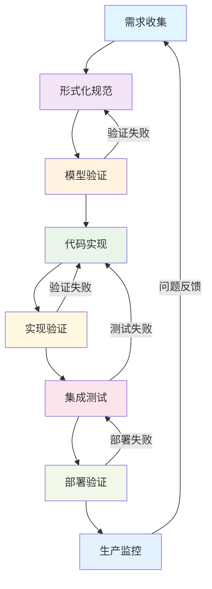
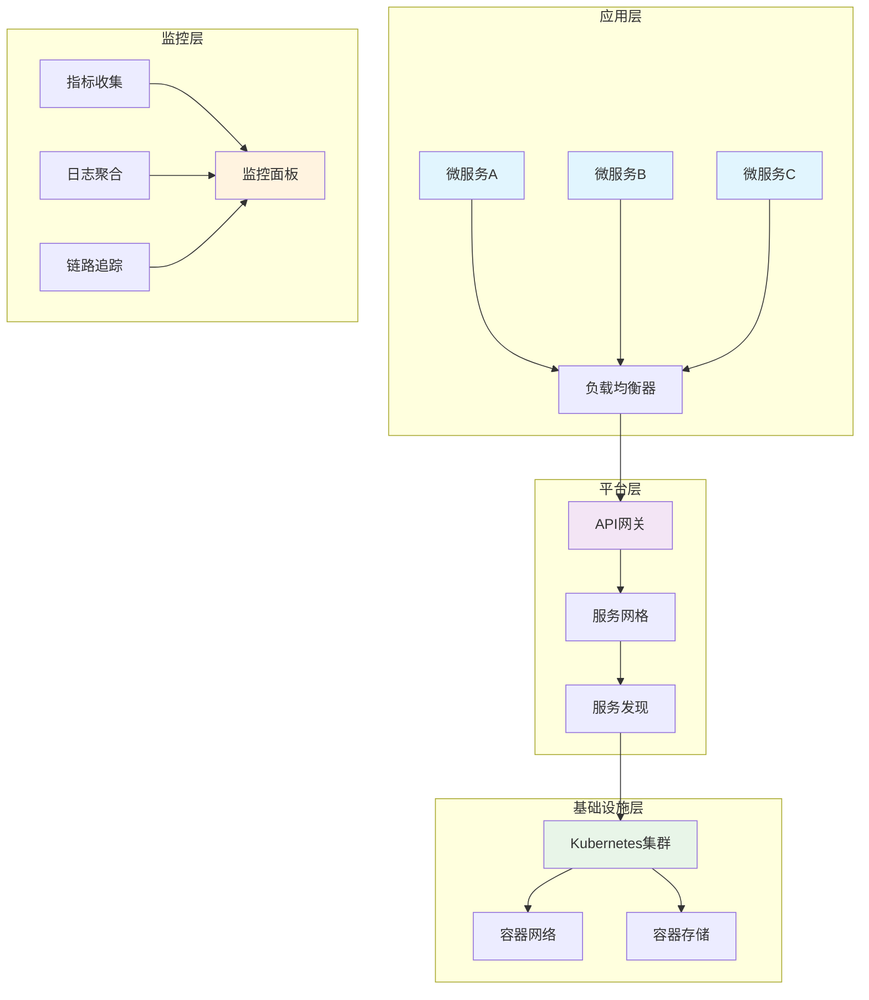
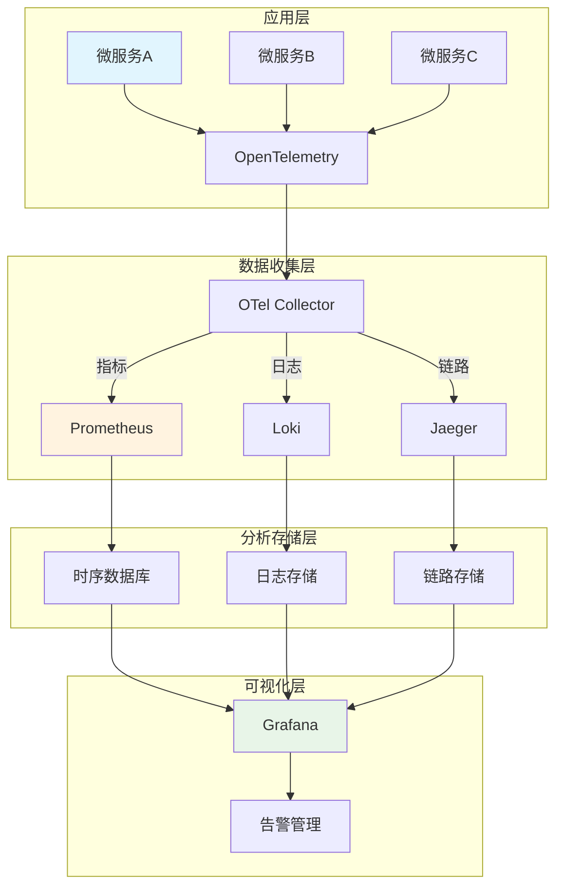
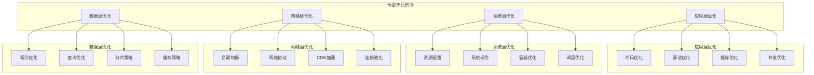

# 7.2 工程实践案例

[返回上级](../7-验证与工程实践.md) | [English Version](../7-verification-and-engineering-practice/7.2-engineering-practice-cases.md)

## 目录

- [7.2 工程实践案例](#72-工程实践案例)
  - [目录](#目录)
  - [7.2.1 形式化验证驱动的工程实践](#721-形式化验证驱动的工程实践)
    - [7.2.1.1 验证驱动开发(VDD)模式](#7211-验证驱动开发vdd模式)
    - [7.2.1.2 Lean形式化规范驱动的开发流程](#7212-lean形式化规范驱动的开发流程)
    - [7.2.1.3 实际工程实施框架](#7213-实际工程实施框架)
  - [7.2.2 CI/CD流水线的形式化建模](#722-cicd流水线的形式化建模)
    - [7.2.2.1 CI/CD流水线状态机建模](#7221-cicd流水线状态机建模)
    - [7.2.2.2 现代CI/CD流水线实现](#7222-现代cicd流水线实现)
    - [7.2.2.3 流水线监控和度量](#7223-流水线监控和度量)
  - [7.2.3 微服务DevOps最佳实践](#723-微服务devops最佳实践)
    - [7.2.3.1 微服务架构的形式化建模](#7231-微服务架构的形式化建模)
    - [7.2.3.2 容器化与编排](#7232-容器化与编排)
    - [7.2.3.3 微服务治理框架](#7233-微服务治理框架)
  - [7.2.4 云原生部署与运维](#724-云原生部署与运维)
    - [7.2.4.1 云原生架构设计原则](#7241-云原生架构设计原则)
    - [7.2.4.2 Helm Chart 模板化部署](#7242-helm-chart-模板化部署)
    - [7.2.4.3 GitOps部署流程](#7243-gitops部署流程)
  - [7.2.5 可观测性工程实践](#725-可观测性工程实践)
    - [7.2.5.1 分布式系统可观测性架构](#7251-分布式系统可观测性架构)
    - [7.2.5.2 监控指标体系设计](#7252-监控指标体系设计)
    - [7.2.5.3 Prometheus + Grafana 监控栈](#7253-prometheus--grafana-监控栈)
  - [7.2.6 安全DevSecOps集成](#726-安全devsecops集成)
    - [7.2.6.1 零信任安全架构](#7261-零信任安全架构)
    - [7.2.6.2 容器和Kubernetes安全](#7262-容器和kubernetes安全)
    - [7.2.6.3 供应链安全](#7263-供应链安全)
  - [7.2.7 性能优化实践](#727-性能优化实践)
    - [7.2.7.1 性能测试与分析](#7271-性能测试与分析)
    - [7.2.7.2 性能优化策略](#7272-性能优化策略)
  - [7.2.8 故障恢复实践](#728-故障恢复实践)
    - [7.2.8.1 故障注入与混沌工程](#7281-故障注入与混沌工程)
    - [7.2.8.2 灾难恢复策略](#7282-灾难恢复策略)
  - [7.2.9 安全合规实践](#729-安全合规实践)
    - [7.2.9.1 安全基线配置](#7291-安全基线配置)
    - [7.2.9.2 合规性检查自动化](#7292-合规性检查自动化)

---

## 7.2.1 形式化验证驱动的工程实践

### 7.2.1.1 验证驱动开发(VDD)模式

形式化验证驱动开发是将形式化方法集成到软件开发生命周期的系统化方法。

**定义 7.2.1** (验证驱动开发): VDD过程可建模为状态机：
$$VDD = \langle S, I, T, O, F \rangle$$

其中：

- $S$ 是开发状态集合 {需求分析, 规范建模, 验证检查, 实现, 测试, 部署}
- $I$ 是输入集合(需求、代码、配置等)
- $T$ 是状态转换函数
- $O$ 是输出集合(验证结果、代码、制品等)  
- $F$ 是最终验证状态集合



### 7.2.1.2 Lean形式化规范驱动的开发流程

```lean
-- 验证驱动开发的Lean建模
-- 开发阶段
inductive DevelopmentPhase
  | Requirements : DevelopmentPhase
  | Specification : DevelopmentPhase  
  | Verification : DevelopmentPhase
  | Implementation : DevelopmentPhase
  | Testing : DevelopmentPhase
  | Deployment : DevelopmentPhase

-- 验证状态
inductive VerificationStatus
  | NotVerified : VerificationStatus
  | InProgress : VerificationStatus
  | Verified : VerificationStatus
  | Failed : VerificationStatus

-- 开发制品
structure DevelopmentArtifact :=
  (phase : DevelopmentPhase)
  (content : String)
  (verification_status : VerificationStatus)
  (dependencies : List DevelopmentArtifact)

-- VDD过程不变量
def vdd_invariant (artifacts : List DevelopmentArtifact) : Prop :=
  ∀ a ∈ artifacts, a.phase = DevelopmentPhase.Deployment → 
  ∀ dep ∈ a.dependencies, dep.verification_status = VerificationStatus.Verified

-- 验证完整性定理
theorem vdd_completeness 
  (artifacts : List DevelopmentArtifact) :
  vdd_invariant artifacts → 
  ∀ a ∈ artifacts, a.phase = DevelopmentPhase.Deployment → 
  deployment_safe a :=
  sorry
```

### 7.2.1.3 实际工程实施框架

```rust
use std::collections::HashMap;
use serde::{Serialize, Deserialize};
use tokio::sync::RwLock;
use std::sync::Arc;

// 验证驱动开发框架
pub struct VDDFramework {
    specifications: Arc<RwLock<HashMap<String, FormalSpecification>>>,
    verifications: Arc<RwLock<HashMap<String, VerificationResult>>>,
    implementations: Arc<RwLock<HashMap<String, Implementation>>>,
    pipeline: ContinuousVerificationPipeline,
}

// 形式化规范
#[derive(Debug, Clone, Serialize, Deserialize)]
pub struct FormalSpecification {
    pub id: String,
    pub description: String,
    pub preconditions: Vec<String>,
    pub postconditions: Vec<String>,
    pub invariants: Vec<String>,
    pub temporal_properties: Vec<String>,
}

// 验证结果
#[derive(Debug, Clone, Serialize, Deserialize)]
pub struct VerificationResult {
    pub specification_id: String,
    pub status: VerificationStatus,
    pub properties_verified: Vec<String>,
    pub counterexamples: Vec<String>,
    pub proof_obligations: Vec<String>,
    pub verification_time: std::time::Duration,
}

#[derive(Debug, Clone, Serialize, Deserialize)]
pub enum VerificationStatus {
    NotStarted,
    InProgress,
    Verified,
    Failed { reason: String },
    Timeout,
}

impl VDDFramework {
    pub fn new() -> Self {
        Self {
            specifications: Arc::new(RwLock::new(HashMap::new())),
            verifications: Arc::new(RwLock::new(HashMap::new())),
            implementations: Arc::new(RwLock::new(HashMap::new())),
            pipeline: ContinuousVerificationPipeline::new(),
        }
    }
    
    // 添加形式化规范
    pub async fn add_specification(&self, spec: FormalSpecification) -> Result<(), VDDError> {
        // 验证规范语法和语义
        self.validate_specification(&spec).await?;
        
        // 存储规范
        let mut specs = self.specifications.write().await;
        specs.insert(spec.id.clone(), spec.clone());
        
        // 触发自动验证
        self.pipeline.trigger_verification(&spec.id).await?;
        
        Ok(())
    }
    
    // 验证规范
    async fn validate_specification(&self, spec: &FormalSpecification) -> Result<(), VDDError> {
        // 语法检查
        for precond in &spec.preconditions {
            self.validate_logic_expression(precond)?;
        }
        
        for postcond in &spec.postconditions {
            self.validate_logic_expression(postcond)?;
        }
        
        // 语义一致性检查
        self.check_semantic_consistency(spec)?;
        
        Ok(())
    }
}

// 持续验证流水线
pub struct ContinuousVerificationPipeline {
    verification_queue: Arc<RwLock<Vec<String>>>,
    workers: Vec<tokio::task::JoinHandle<()>>,
}

// 错误类型
#[derive(Debug)]
pub enum VDDError {
    SpecificationNotFound,
    InvalidSyntax(String),
    VerificationTimeout,
    ModelCheckerError(String),
    TheoremProverError(String),
}
```

## 7.2.2 CI/CD流水线的形式化建模

### 7.2.2.1 CI/CD流水线状态机建模

```tla+
---- MODULE CICDPipeline ----
EXTENDS Naturals, Sequences, FiniteSets

VARIABLES
    pipeline_state,    \* 流水线当前状态
    stages,           \* 阶段集合
    artifacts,        \* 制品集合  
    deployments,      \* 部署状态
    notifications     \* 通知队列

---- 类型不变量 ----
TypeInvariant ==
    /\ pipeline_state \in {"IDLE", "RUNNING", "SUCCESS", "FAILED", "ABORTED"}
    /\ stages \in [StageId -> StageStatus]
    /\ artifacts \in [ArtifactId -> Artifact]
    /\ deployments \in [Environment -> DeploymentStatus]

---- 阶段状态 ----
StageStatus == {"PENDING", "RUNNING", "SUCCESS", "FAILED", "SKIPPED"}

---- 流水线完成条件 ----
PipelineComplete ==
    \A stage \in DOMAIN stages : stages[stage] \in {"SUCCESS", "FAILED", "SKIPPED"}

---- 安全性属性 ----
SafetyProperties ==
    /\ \A stage \in DOMAIN stages : 
        stages[stage] = "SUCCESS" => 
        \A dep \in Dependencies[stage] : stages[dep] = "SUCCESS"
    /\ pipeline_state = "SUCCESS" => 
        \A stage \in CriticalStages : stages[stage] = "SUCCESS"

---- 活性属性 ----
LivenessProperties ==
    /\ pipeline_state = "RUNNING" ~> PipelineComplete
    /\ \A stage \in DOMAIN stages : 
        stages[stage] = "PENDING" ~> stages[stage] # "PENDING"
====
```

### 7.2.2.2 现代CI/CD流水线实现

```yaml
# GitHub Actions 完整流水线示例
name: 形式化验证驱动的CI/CD流水线

on:
  push:
    branches: [ main, develop ]
  pull_request:
    branches: [ main ]

env:
  CARGO_TERM_COLOR: always
  RUST_BACKTRACE: 1

jobs:
  # 阶段1: 代码质量检查
  code-quality:
    name: 代码质量检查
    runs-on: ubuntu-latest
    steps:
      - name: 检出代码
        uses: actions/checkout@v4
        
      - name: 设置Rust工具链
        uses: actions-rs/toolchain@v1
        with:
          toolchain: stable
          components: rustfmt, clippy
          override: true
          
      - name: 代码格式检查
        run: cargo fmt --all -- --check
        
      - name: Clippy静态分析
        run: cargo clippy --all-targets --all-features -- -D warnings
        
      - name: 安全漏洞扫描
        run: |
          cargo install cargo-audit
          cargo audit

  # 阶段2: 形式化验证
  formal-verification:
    name: 形式化验证
    runs-on: ubuntu-latest
    needs: code-quality
    steps:
      - name: 检出代码
        uses: actions/checkout@v4
        
      - name: 安装Lean 4
        run: |
          curl https://raw.githubusercontent.com/leanprover/elan/master/elan-init.sh -sSf | sh -s -- -y
          echo "$HOME/.elan/bin" >> $GITHUB_PATH
          
      - name: 验证Lean规范
        run: |
          cd formal_specs
          lean --make .
          
      - name: 运行TLA+模型检查
        run: |
          # 安装TLA+工具
          wget https://github.com/tlaplus/tlaplus/releases/download/v1.8.0/tla2tools.jar
          # 运行模型检查
          java -jar tla2tools.jar -workers auto specs/SystemModel.tla
          
      - name: 生成验证报告
        run: |
          echo "形式化验证完成" > verification_report.md
          echo "- Lean规范验证: ✅" >> verification_report.md
          echo "- TLA+模型检查: ✅" >> verification_report.md
          
      - name: 上传验证报告
        uses: actions/upload-artifact@v3
        with:
          name: verification-report
          path: verification_report.md

  # 阶段3: 构建和测试
  build-and-test:
    name: 构建和测试
    runs-on: ubuntu-latest
    needs: formal-verification
    strategy:
      matrix:
        rust: [stable, beta]
    steps:
      - name: 检出代码
        uses: actions/checkout@v4
        
      - name: 设置Rust工具链
        uses: actions-rs/toolchain@v1
        with:
          toolchain: ${{ matrix.rust }}
          override: true
          
      - name: 缓存依赖
        uses: actions/cache@v3
        with:
          path: |
            ~/.cargo/registry
            ~/.cargo/git
            target
          key: ${{ runner.os }}-cargo-${{ matrix.rust }}-${{ hashFiles('**/Cargo.lock') }}
          
      - name: 构建项目
        run: cargo build --release
        
      - name: 运行单元测试
        run: cargo test --all-features
        
      - name: 运行集成测试
        run: cargo test --test integration_tests
        
      - name: 运行性能测试
        run: cargo test --release --test performance_tests
        
      - name: 生成代码覆盖率
        run: |
          cargo install cargo-tarpaulin
          cargo tarpaulin --all-features --workspace --timeout 120 --out Xml
          
      - name: 上传覆盖率报告
        uses: codecov/codecov-action@v3
        with:
          file: ./cobertura.xml
          
      - name: 构建Docker镜像
        run: |
          docker build -t myapp:${{ github.sha }} .
          docker save myapp:${{ github.sha }} > myapp.tar
          
      - name: 上传构建制品
        uses: actions/upload-artifact@v3
        with:
          name: build-artifacts-${{ matrix.rust }}
          path: |
            target/release/myapp
            myapp.tar

  # 阶段4: 安全扫描
  security-scan:
    name: 安全扫描
    runs-on: ubuntu-latest
    needs: build-and-test
    steps:
      - name: 检出代码
        uses: actions/checkout@v4
        
      - name: 下载Docker镜像
        uses: actions/download-artifact@v3
        with:
          name: build-artifacts-stable
          
      - name: 加载Docker镜像
        run: docker load < myapp.tar
        
      - name: 容器安全扫描
        run: |
          # 使用Trivy进行容器扫描
          docker run --rm -v /var/run/docker.sock:/var/run/docker.sock \
            aquasec/trivy:latest image myapp:${{ github.sha }}
            
      - name: 代码安全扫描
        uses: github/codeql-action/analyze@v2
        with:
          languages: rust

  # 阶段5: 部署到预发布环境
  deploy-staging:
    name: 部署到预发布环境
    runs-on: ubuntu-latest
    needs: [build-and-test, security-scan]
    if: github.ref == 'refs/heads/develop'
    environment:
      name: staging
      url: https://staging.example.com
    steps:
      - name: 检出部署脚本
        uses: actions/checkout@v4
        
      - name: 下载构建制品
        uses: actions/download-artifact@v3
        with:
          name: build-artifacts-stable
          
      - name: 部署到Kubernetes
        run: |
          # 配置kubectl
          echo "${{ secrets.KUBE_CONFIG }}" | base64 -d > kubeconfig
          export KUBECONFIG=kubeconfig
          
          # 更新部署
          kubectl set image deployment/myapp myapp=myapp:${{ github.sha }} -n staging
          kubectl rollout status deployment/myapp -n staging
          
      - name: 运行烟雾测试
        run: |
          # 等待部署完成
          sleep 30
          
          # 运行健康检查
          curl -f https://staging.example.com/health || exit 1
          
          # 运行端到端测试
          npm install playwright
          npx playwright test --config=e2e.config.js

  # 阶段6: 生产部署
  deploy-production:
    name: 部署到生产环境
    runs-on: ubuntu-latest
    needs: deploy-staging
    if: github.ref == 'refs/heads/main'
    environment:
      name: production
      url: https://example.com
    steps:
      - name: 检出部署脚本
        uses: actions/checkout@v4
        
      - name: 下载构建制品
        uses: actions/download-artifact@v3
        with:
          name: build-artifacts-stable
          
      - name: 蓝绿部署
        run: |
          # 配置kubectl
          echo "${{ secrets.PROD_KUBE_CONFIG }}" | base64 -d > kubeconfig
          export KUBECONFIG=kubeconfig
          
          # 蓝绿部署逻辑
          ./scripts/blue-green-deploy.sh myapp:${{ github.sha }}
          
      - name: 生产验证
        run: |
          # 验证部署成功
          curl -f https://example.com/health || exit 1
          
          # 运行生产烟雾测试
          ./scripts/production-smoke-tests.sh
          
      - name: 回滚准备
        if: failure()
        run: |
          # 如果部署失败，准备回滚
          ./scripts/prepare-rollback.sh

  # 阶段7: 通知和清理
  notify-and-cleanup:
    name: 通知和清理
    runs-on: ubuntu-latest
    needs: [deploy-production]
    if: always()
    steps:
      - name: 发送Slack通知
        uses: 8398a7/action-slack@v3
        with:
          status: ${{ job.status }}
          channel: '#deployments'
          webhook_url: ${{ secrets.SLACK_WEBHOOK }}
          
      - name: 清理旧制品
        run: |
          # 清理超过7天的制品
          find ./artifacts -type f -mtime +7 -delete
```

### 7.2.2.3 流水线监控和度量

```rust
// CI/CD流水线监控系统
use std::collections::HashMap;
use std::time::{Duration, SystemTime};
use serde::{Serialize, Deserialize};

#[derive(Debug, Clone, Serialize, Deserialize)]
pub struct PipelineMetrics {
    pub pipeline_id: String,
    pub start_time: SystemTime,
    pub end_time: Option<SystemTime>,
    pub status: PipelineStatus,
    pub stage_metrics: HashMap<String, StageMetrics>,
    pub total_duration: Option<Duration>,
    pub artifacts_produced: Vec<String>,
    pub tests_run: u32,
    pub tests_passed: u32,
    pub code_coverage: f64,
    pub deployment_success: bool,
}

#[derive(Debug, Clone, Serialize, Deserialize)]
pub struct StageMetrics {
    pub stage_name: String,
    pub start_time: SystemTime,
    pub end_time: Option<SystemTime>,
    pub duration: Option<Duration>,
    pub status: StageStatus,
    pub resource_usage: ResourceUsage,
    pub errors: Vec<String>,
}

#[derive(Debug, Clone, Serialize, Deserialize)]
pub struct ResourceUsage {
    pub cpu_usage: f64,
    pub memory_usage: f64,
    pub disk_usage: f64,
    pub network_io: f64,
}

impl PipelineMetrics {
    // 计算流水线效率指标
    pub fn calculate_efficiency_metrics(&self) -> EfficiencyMetrics {
        let total_duration = self.total_duration.unwrap_or(Duration::from_secs(0));
        let success_rate = if self.status == PipelineStatus::Success { 1.0 } else { 0.0 };
        
        let stage_success_rate = self.stage_metrics.values()
            .map(|stage| if stage.status == StageStatus::Success { 1.0 } else { 0.0 })
            .sum::<f64>() / self.stage_metrics.len() as f64;
            
        let test_success_rate = if self.tests_run > 0 {
            self.tests_passed as f64 / self.tests_run as f64
        } else {
            1.0
        };
        
        EfficiencyMetrics {
            total_duration,
            success_rate,
            stage_success_rate,
            test_success_rate,
            code_coverage: self.code_coverage,
            artifacts_count: self.artifacts_produced.len(),
            throughput: self.calculate_throughput(),
        }
    }
    
    fn calculate_throughput(&self) -> f64 {
        // 计算每分钟处理的任务数
        if let Some(duration) = self.total_duration {
            let minutes = duration.as_secs_f64() / 60.0;
            if minutes > 0.0 {
                1.0 / minutes
            } else {
                0.0
            }
        } else {
            0.0
        }
    }
}

#[derive(Debug, Clone, Serialize, Deserialize)]
pub struct EfficiencyMetrics {
    pub total_duration: Duration,
    pub success_rate: f64,
    pub stage_success_rate: f64,
    pub test_success_rate: f64,
    pub code_coverage: f64,
    pub artifacts_count: usize,
    pub throughput: f64,
}

#[derive(Debug, Clone, PartialEq, Serialize, Deserialize)]
pub enum PipelineStatus {
    Pending,
    Running,
    Success,
    Failed,
    Cancelled,
}

#[derive(Debug, Clone, PartialEq, Serialize, Deserialize)]
pub enum StageStatus {
    Pending,
    Running,
    Success,
    Failed,
    Skipped,
}
```

## 7.2.3 微服务DevOps最佳实践

### 7.2.3.1 微服务架构的形式化建模

```lean
-- 微服务架构的Lean建模
-- 微服务定义
structure Microservice :=
  (name : String)
  (endpoints : List Endpoint)
  (dependencies : List Microservice)
  (resources : ResourceRequirements)
  (health_check : HealthCheck)

-- 服务网格
structure ServiceMesh :=
  (services : List Microservice)
  (load_balancer : LoadBalancer)
  (service_discovery : ServiceDiscovery)
  (circuit_breaker : CircuitBreaker)

-- 微服务架构不变量
def microservice_invariant (mesh : ServiceMesh) : Prop :=
  ∀ s ∈ mesh.services, 
    ∀ dep ∈ s.dependencies, 
      dep ∈ mesh.services ∧ 
      reachable mesh.service_discovery s dep

-- 微服务可用性定理
theorem microservice_availability 
  (mesh : ServiceMesh) :
  microservice_invariant mesh → 
  ∀ s ∈ mesh.services, 
    healthy s → available_through_mesh mesh s :=
  sorry
```

### 7.2.3.2 容器化与编排

```yaml
# Kubernetes 微服务部署配置
apiVersion: v1
kind: Namespace
metadata:
  name: microservices-app
  labels:
    environment: production
    
---
# 服务部署
apiVersion: apps/v1
kind: Deployment
metadata:
  name: user-service
  namespace: microservices-app
  labels:
    app: user-service
    version: v1.0.0
spec:
  replicas: 3
  selector:
    matchLabels:
      app: user-service
  template:
    metadata:
      labels:
        app: user-service
        version: v1.0.0
    spec:
      containers:
      - name: user-service
        image: myregistry/user-service:v1.0.0
        ports:
        - containerPort: 8080
        env:
        - name: DATABASE_URL
          valueFrom:
            secretKeyRef:
              name: database-credentials
              key: url
        - name: REDIS_URL
          valueFrom:
            configMapKeyRef:
              name: cache-config
              key: redis-url
        resources:
          requests:
            memory: "256Mi"
            cpu: "250m"
          limits:
            memory: "512Mi"
            cpu: "500m"
        livenessProbe:
          httpGet:
            path: /health
            port: 8080
          initialDelaySeconds: 30
        readinessProbe:
          httpGet:
            path: /ready
            port: 8080
          initialDelaySeconds: 5
          periodSeconds: 5
        volumeMounts:
        - name: app-logs
          mountPath: /app/logs
      volumes:
      - name: app-logs
        emptyDir: {}
      
---
# 服务发现
apiVersion: v1
kind: Service
metadata:
  name: user-service
  namespace: microservices-app
  labels:
    app: user-service
spec:
  selector:
    app: user-service
  ports:
  - protocol: TCP
    port: 80
    targetPort: 8080
  type: ClusterIP

---
# 水平扩展策略
apiVersion: autoscaling/v2
kind: HorizontalPodAutoscaler
metadata:
  name: user-service-hpa
  namespace: microservices-app
spec:
  scaleTargetRef:
    apiVersion: apps/v1
    kind: Deployment
    name: user-service
  minReplicas: 3
  maxReplicas: 10
  metrics:
  - type: Resource
    resource:
      name: cpu
      target:
        type: Utilization
        averageUtilization: 70
  - type: Resource
    resource:
      name: memory
      target:
        type: Utilization
        averageUtilization: 80

---
# Ingress配置
apiVersion: networking.k8s.io/v1
kind: Ingress
metadata:
  name: api-gateway
  namespace: microservices-app
  annotations:
    nginx.ingress.kubernetes.io/rewrite-target: /
    nginx.ingress.kubernetes.io/ssl-redirect: "true"
    nginx.ingress.kubernetes.io/rate-limit: "100"
spec:
  tls:
  - hosts:
    - api.example.com
    secretName: api-tls
  rules:
  - host: api.example.com
    http:
      paths:
      - path: /users
        pathType: Prefix
        backend:
          service:
            name: user-service
            port:
              number: 80
```

### 7.2.3.3 微服务治理框架

```rust
// 微服务治理框架
use std::collections::HashMap;
use serde::{Serialize, Deserialize};
use tokio::sync::RwLock;
use std::sync::Arc;

// 服务注册中心
pub struct ServiceRegistry {
    services: Arc<RwLock<HashMap<String, ServiceInstance>>>,
    health_checker: HealthChecker,
    load_balancer: LoadBalancer,
}

#[derive(Debug, Clone, Serialize, Deserialize)]
pub struct ServiceInstance {
    pub id: String,
    pub name: String,
    pub host: String,
    pub port: u16,
    pub metadata: HashMap<String, String>,
    pub health_status: HealthStatus,
    pub last_heartbeat: std::time::SystemTime,
}

#[derive(Debug, Clone, Serialize, Deserialize)]
pub enum HealthStatus {
    Healthy,
    Unhealthy,
    Warning,
    Unknown,
}

impl ServiceRegistry {
    pub fn new() -> Self {
        Self {
            services: Arc::new(RwLock::new(HashMap::new())),
            health_checker: HealthChecker::new(),
            load_balancer: LoadBalancer::new(),
        }
    }
    
    // 服务注册
    pub async fn register_service(&self, service: ServiceInstance) -> Result<(), RegistryError> {
        // 验证服务配置
        self.validate_service(&service)?;
        
        // 注册服务
        let mut services = self.services.write().await;
        services.insert(service.id.clone(), service.clone());
        
        // 启动健康检查
        self.health_checker.start_health_check(&service).await?;
        
        log::info!("Service {} registered successfully", service.name);
        Ok(())
    }
    
    // 服务发现
    pub async fn discover_service(&self, service_name: &str) -> Result<Vec<ServiceInstance>, RegistryError> {
        let services = self.services.read().await;
        
        let healthy_instances: Vec<ServiceInstance> = services
            .values()
            .filter(|s| s.name == service_name)
            .filter(|s| matches!(s.health_status, HealthStatus::Healthy))
            .cloned()
            .collect();
            
        if healthy_instances.is_empty() {
            return Err(RegistryError::NoHealthyInstances(service_name.to_string()));
        }
        
        // 应用负载均衡策略
        let balanced_instances = self.load_balancer.apply_strategy(&healthy_instances).await;
        
        Ok(balanced_instances)
    }
    
    // 服务注销
    pub async fn deregister_service(&self, service_id: &str) -> Result<(), RegistryError> {
        let mut services = self.services.write().await;
        
        if let Some(service) = services.remove(service_id) {
            // 停止健康检查
            self.health_checker.stop_health_check(&service.id).await?;
            log::info!("Service {} deregistered", service.name);
            Ok(())
        } else {
            Err(RegistryError::ServiceNotFound(service_id.to_string()))
        }
    }
    
    fn validate_service(&self, service: &ServiceInstance) -> Result<(), RegistryError> {
        // 验证服务名称
        if service.name.is_empty() {
            return Err(RegistryError::InvalidServiceName);
        }
        
        // 验证主机和端口
        if service.host.is_empty() || service.port == 0 {
            return Err(RegistryError::InvalidEndpoint);
        }
        
        Ok(())
    }
}

// 健康检查器
pub struct HealthChecker {
    check_interval: std::time::Duration,
    timeout: std::time::Duration,
}

impl HealthChecker {
    pub fn new() -> Self {
        Self {
            check_interval: std::time::Duration::from_secs(30),
            timeout: std::time::Duration::from_secs(5),
        }
    }
    
    pub async fn start_health_check(&self, service: &ServiceInstance) -> Result<(), RegistryError> {
        // 实现健康检查逻辑
        Ok(())
    }
    
    pub async fn stop_health_check(&self, service_id: &str) -> Result<(), RegistryError> {
        // 停止健康检查
        Ok(())
    }
}

// 负载均衡器
pub struct LoadBalancer {
    strategy: LoadBalancingStrategy,
}

#[derive(Debug, Clone)]
pub enum LoadBalancingStrategy {
    RoundRobin,
    LeastConnections,
    WeightedRoundRobin,
    Random,
}

impl LoadBalancer {
    pub fn new() -> Self {
        Self {
            strategy: LoadBalancingStrategy::RoundRobin,
        }
    }
    
    pub async fn apply_strategy(&self, instances: &[ServiceInstance]) -> Vec<ServiceInstance> {
        match self.strategy {
            LoadBalancingStrategy::RoundRobin => self.round_robin(instances),
            LoadBalancingStrategy::Random => self.random_selection(instances),
            _ => instances.to_vec(), // 简化实现
        }
    }
    
    fn round_robin(&self, instances: &[ServiceInstance]) -> Vec<ServiceInstance> {
        // 实现轮询负载均衡
        instances.to_vec()
    }
    
    fn random_selection(&self, instances: &[ServiceInstance]) -> Vec<ServiceInstance> {
        // 实现随机选择
        instances.to_vec()
    }
}

// 错误类型
#[derive(Debug)]
pub enum RegistryError {
    ServiceNotFound(String),
    NoHealthyInstances(String),
    InvalidServiceName,
    InvalidEndpoint,
    HealthCheckFailed(String),
}
```

## 7.2.4 云原生部署与运维

### 7.2.4.1 云原生架构设计原则

云原生架构遵循"12要素应用"原则，结合容器化、微服务和DevOps实践：

**定义 7.2.2** (云原生架构): 云原生应用可建模为：
$$CloudNative = \langle C, S, D, O \rangle$$

其中：

- $C$ 是容器化组件集合
- $S$ 是服务网格和编排层
- $D$ 是数据持久化和状态管理
- $O$ 是可观测性和运维工具



### 7.2.4.2 Helm Chart 模板化部署

```yaml
# values.yaml
global:
  environment: production
  registry: myregistry.com
  imageTag: v1.0.0
  
replicaCount: 3

image:
  repository: myapp
  pullPolicy: IfNotPresent
  tag: ""

nameOverride: ""
fullnameOverride: ""

serviceAccount:
  create: true
  annotations: {}
  name: ""

podAnnotations: {}

podSecurityContext:
  fsGroup: 2000

securityContext:
  capabilities:
    drop:
    - ALL
  readOnlyRootFilesystem: true
  runAsNonRoot: true
  runAsUser: 1000

service:
  type: ClusterIP
  port: 80
  targetPort: 8080

ingress:
  enabled: true
  className: "nginx"
  annotations:
    nginx.ingress.kubernetes.io/ssl-redirect: "true"
    cert-manager.io/cluster-issuer: "letsencrypt-prod"
  hosts:
    - host: api.example.com
      paths:
        - path: /
          pathType: Prefix
  tls:
    - secretName: api-tls
      hosts:
        - api.example.com

resources:
  limits:
    cpu: 500m
    memory: 512Mi
  requests:
    cpu: 250m
    memory: 256Mi

autoscaling:
  enabled: true
  minReplicas: 3
  maxReplicas: 10
  targetCPUUtilizationPercentage: 70
  targetMemoryUtilizationPercentage: 80

nodeSelector: {}
tolerations: []
affinity: {}

# 监控配置
monitoring:
  enabled: true
  serviceMonitor:
    enabled: true
    interval: 30s
    path: /metrics
    
# 数据库配置
database:
  enabled: true
  type: postgresql
  host: postgres.database.svc.cluster.local
  port: 5432
  name: myapp
  
# 缓存配置  
redis:
  enabled: true
  host: redis.cache.svc.cluster.local
  port: 6379
```

```yaml
# templates/deployment.yaml
apiVersion: apps/v1
kind: Deployment
metadata:
  name: {{ include "myapp.fullname" . }}
  labels:
    {{- include "myapp.labels" . | nindent 4 }}
spec:
  {{- if not .Values.autoscaling.enabled }}
  replicas: {{ .Values.replicaCount }}
  {{- end }}
  selector:
    matchLabels:
      {{- include "myapp.selectorLabels" . | nindent 6 }}
  template:
    metadata:
      {{- with .Values.podAnnotations }}
      annotations:
        {{- toYaml . | nindent 8 }}
      {{- end }}
      labels:
        {{- include "myapp.selectorLabels" . | nindent 8 }}
    spec:
      {{- with .Values.imagePullSecrets }}
      imagePullSecrets:
        {{- toYaml . | nindent 8 }}
      {{- end }}
      serviceAccountName: {{ include "myapp.serviceAccountName" . }}
      securityContext:
        {{- toYaml .Values.podSecurityContext | nindent 8 }}
      containers:
        - name: {{ .Chart.Name }}
          securityContext:
            {{- toYaml .Values.securityContext | nindent 12 }}
          image: "{{ .Values.global.registry }}/{{ .Values.image.repository }}:{{ .Values.image.tag | default .Values.global.imageTag }}"
          imagePullPolicy: {{ .Values.image.pullPolicy }}
          ports:
            - name: http
              containerPort: {{ .Values.service.targetPort }}
              protocol: TCP
          env:
            - name: ENVIRONMENT
              value: {{ .Values.global.environment }}
            {{- if .Values.database.enabled }}
            - name: DATABASE_URL
              valueFrom:
                secretKeyRef:
                  name: {{ include "myapp.fullname" . }}-database
                  key: url
            {{- end }}
            {{- if .Values.redis.enabled }}
            - name: REDIS_URL
              value: "redis://{{ .Values.redis.host }}:{{ .Values.redis.port }}"
            {{- end }}
          livenessProbe:
            httpGet:
              path: /health
              port: http
            initialDelaySeconds: 30
            periodSeconds: 10
            timeoutSeconds: 5
            failureThreshold: 3
          readinessProbe:
            httpGet:
              path: /ready
              port: http
            initialDelaySeconds: 5
            periodSeconds: 5
            timeoutSeconds: 3
            failureThreshold: 3
          resources:
            {{- toYaml .Values.resources | nindent 12 }}
          volumeMounts:
            - name: tmp
              mountPath: /tmp
            - name: var-run
              mountPath: /var/run
      volumes:
        - name: tmp
          emptyDir: {}
        - name: var-run
          emptyDir: {}
      {{- with .Values.nodeSelector }}
      nodeSelector:
        {{- toYaml . | nindent 8 }}
      {{- end }}
      {{- with .Values.affinity }}
      affinity:
        {{- toYaml . | nindent 8 }}
      {{- end }}
      {{- with .Values.tolerations }}
      tolerations:
        {{- toYaml . | nindent 8 }}
      {{- end }}
```

### 7.2.4.3 GitOps部署流程

```yaml
# ArgoCD Application 配置
apiVersion: argoproj.io/v1alpha1
kind: Application
metadata:
  name: myapp-production
  namespace: argocd
  labels:
    environment: production
spec:
  project: default
  source:
    repoURL: https://github.com/myorg/myapp-manifests
    targetRevision: main
    path: manifests/production
    helm:
      valueFiles:
        - values-production.yaml
  destination:
    server: https://kubernetes.default.svc
    namespace: myapp-production
  syncPolicy:
    automated:
      prune: true
      selfHeal: true
      allowEmpty: false
    syncOptions:
      - CreateNamespace=true
      - PrunePropagationPolicy=foreground
      - PruneLast=true
    retry:
      limit: 5
      backoff:
        duration: 5s
        factor: 2
        maxDuration: 3m
  revisionHistoryLimit: 10
```

## 7.2.5 可观测性工程实践

### 7.2.5.1 分布式系统可观测性架构

可观测性三大支柱：指标(Metrics)、日志(Logs)、链路追踪(Traces)的统一架构。



### 7.2.5.2 监控指标体系设计

```rust
// 分布式系统监控指标框架
use prometheus::{Counter, Histogram, Gauge, Registry};
use std::collections::HashMap;
use std::time::Instant;

// 系统级指标收集器
pub struct SystemMetrics {
    // 请求相关指标
    request_total: Counter,
    request_duration: Histogram,
    active_connections: Gauge,
    
    // 业务指标
    business_operations: Counter,
    error_rate: Counter,
    
    // 资源指标
    memory_usage: Gauge,
    cpu_usage: Gauge,
    disk_usage: Gauge,
    
    registry: Registry,
}

impl SystemMetrics {
    pub fn new() -> Self {
        let registry = Registry::new();
        
        let request_total = Counter::new(
            "http_requests_total",
            "Total number of HTTP requests"
        ).unwrap();
        
        let request_duration = Histogram::with_opts(
            prometheus::HistogramOpts::new(
                "http_request_duration_seconds",
                "HTTP request duration in seconds"
            ).buckets(vec![0.001, 0.01, 0.1, 1.0, 10.0])
        ).unwrap();
        
        let active_connections = Gauge::new(
            "active_connections",
            "Number of active connections"
        ).unwrap();
        
        let business_operations = Counter::new(
            "business_operations_total",
            "Total business operations"
        ).unwrap();
        
        let error_rate = Counter::new(
            "errors_total",
            "Total number of errors"
        ).unwrap();
        
        let memory_usage = Gauge::new(
            "memory_usage_bytes",
            "Memory usage in bytes"
        ).unwrap();
        
        let cpu_usage = Gauge::new(
            "cpu_usage_percent",
            "CPU usage percentage"
        ).unwrap();
        
        let disk_usage = Gauge::new(
            "disk_usage_bytes",
            "Disk usage in bytes"
        ).unwrap();
        
        // 注册所有指标
        registry.register(Box::new(request_total.clone())).unwrap();
        registry.register(Box::new(request_duration.clone())).unwrap();
        registry.register(Box::new(active_connections.clone())).unwrap();
        registry.register(Box::new(business_operations.clone())).unwrap();
        registry.register(Box::new(error_rate.clone())).unwrap();
        registry.register(Box::new(memory_usage.clone())).unwrap();
        registry.register(Box::new(cpu_usage.clone())).unwrap();
        registry.register(Box::new(disk_usage.clone())).unwrap();
        
        Self {
            request_total,
            request_duration,
            active_connections,
            business_operations,
            error_rate,
            memory_usage,
            cpu_usage,
            disk_usage,
            registry,
        }
    }
    
    // 记录HTTP请求
    pub fn record_request(&self, duration: f64, status_code: u16) {
        self.request_total.inc();
        self.request_duration.observe(duration);
        
        if status_code >= 400 {
            self.error_rate.inc();
        }
    }
    
    // 记录业务操作
    pub fn record_business_operation(&self, operation_type: &str, success: bool) {
        self.business_operations.inc();
        
        if !success {
            self.error_rate.inc();
        }
    }
    
    // 更新系统资源指标
    pub fn update_system_metrics(&self) {
        // 实际实现中会调用系统API获取资源使用情况
        // 这里为示例简化
        self.memory_usage.set(get_memory_usage());
        self.cpu_usage.set(get_cpu_usage());
        self.disk_usage.set(get_disk_usage());
    }
    
    // 获取指标注册器
    pub fn registry(&self) -> &Registry {
        &self.registry
    }
}

// 系统资源获取函数（简化实现）
fn get_memory_usage() -> f64 {
    // 实际实现会调用系统API
    0.0
}

fn get_cpu_usage() -> f64 {
    // 实际实现会调用系统API
    0.0
}

fn get_disk_usage() -> f64 {
    // 实际实现会调用系统API
    0.0
}

// 分布式链路追踪
use opentelemetry::{global, trace::Tracer, KeyValue};
use opentelemetry_jaeger::new_agent_pipeline;

pub struct DistributedTracing {
    tracer: Box<dyn Tracer + Send + Sync>,
}

impl DistributedTracing {
    pub fn new(service_name: &str) -> Self {
        let tracer = new_agent_pipeline()
            .with_service_name(service_name)
            .install_simple()
            .expect("Failed to initialize tracer");
            
        global::set_tracer_provider(tracer.provider().unwrap());
        
        Self {
            tracer: Box::new(tracer),
        }
    }
    
    pub fn start_span(&self, operation_name: &str) -> opentelemetry::trace::Span {
        self.tracer.start(operation_name)
    }
    
    pub fn trace_operation<F, R>(&self, operation_name: &str, operation: F) -> R
    where
        F: FnOnce() -> R,
    {
        let span = self.start_span(operation_name);
        let _guard = span.activate();
        
        let start_time = Instant::now();
        let result = operation();
        let duration = start_time.elapsed();
        
        span.set_attribute(KeyValue::new("duration_ms", duration.as_millis() as i64));
        span.end();
        
        result
    }
}
```

### 7.2.5.3 Prometheus + Grafana 监控栈

```yaml
# Prometheus 配置
# prometheus.yml
global:
  scrape_interval: 15s
  evaluation_interval: 15s

alerting:
  alertmanagers:
    - static_configs:
        - targets:
          - alertmanager:9093

rule_files:
  - "rules/*.yml"

scrape_configs:
  # Prometheus 自身监控
  - job_name: 'prometheus'
    static_configs:
      - targets: ['localhost:9090']

  # Kubernetes API Server
  - job_name: 'kubernetes-apiservers'
    kubernetes_sd_configs:
      - role: endpoints
    scheme: https
    tls_config:
      ca_file: /var/run/secrets/kubernetes.io/serviceaccount/ca.crt
    bearer_token_file: /var/run/secrets/kubernetes.io/serviceaccount/token
    relabel_configs:
      - source_labels: [__meta_kubernetes_namespace, __meta_kubernetes_service_name, __meta_kubernetes_endpoint_port_name]
        action: keep
        regex: default;kubernetes;https

  # Kubernetes Nodes
  - job_name: 'kubernetes-nodes'
    kubernetes_sd_configs:
      - role: node
    scheme: https
    tls_config:
      ca_file: /var/run/secrets/kubernetes.io/serviceaccount/ca.crt
    bearer_token_file: /var/run/secrets/kubernetes.io/serviceaccount/token
    relabel_configs:
      - action: labelmap
        regex: __meta_kubernetes_node_label_(.+)

  # 微服务监控
  - job_name: 'microservices'
    kubernetes_sd_configs:
      - role: endpoints
    relabel_configs:
      - source_labels: [__meta_kubernetes_service_annotation_prometheus_io_scrape]
        action: keep
        regex: true
      - source_labels: [__meta_kubernetes_service_annotation_prometheus_io_path]
        action: replace
        target_label: __metrics_path__
        regex: (.+)
      - source_labels: [__address__, __meta_kubernetes_service_annotation_prometheus_io_port]
        action: replace
        regex: ([^:]+)(?::\d+)?;(\d+)
        replacement: $1:$2
        target_label: __address__
      - action: labelmap
        regex: __meta_kubernetes_service_label_(.+)
      - source_labels: [__meta_kubernetes_namespace]
        action: replace
        target_label: kubernetes_namespace
      - source_labels: [__meta_kubernetes_service_name]
        action: replace
        target_label: kubernetes_name
```

```yaml
# AlertManager 告警规则
# rules/microservices.yml
groups:
  - name: microservices
    rules:
      # 高错误率告警
      - alert: HighErrorRate
        expr: rate(http_requests_total{status=~"5.."}[5m]) / rate(http_requests_total[5m]) > 0.1
        for: 5m
        labels:
          severity: warning
        annotations:
          summary: "High error rate detected"
          description: "Error rate is above 10% for {{ $labels.service }}"

      # 高延迟告警
      - alert: HighLatency
        expr: histogram_quantile(0.95, rate(http_request_duration_seconds_bucket[5m])) > 1
        for: 5m
        labels:
          severity: warning
        annotations:
          summary: "High latency detected"
          description: "95th percentile latency is above 1s for {{ $labels.service }}"

      # 服务不可用告警
      - alert: ServiceDown
        expr: up == 0
        for: 1m
        labels:
          severity: critical
        annotations:
          summary: "Service is down"
          description: "Service {{ $labels.instance }} is down"

      # CPU使用率告警
      - alert: HighCPUUsage
        expr: cpu_usage_percent > 80
        for: 10m
        labels:
          severity: warning
        annotations:
          summary: "High CPU usage"
          description: "CPU usage is above 80% for {{ $labels.instance }}"

      # 内存使用率告警
      - alert: HighMemoryUsage
        expr: memory_usage_bytes / (1024*1024*1024) > 8
        for: 10m
        labels:
          severity: warning
        annotations:
          summary: "High memory usage"
          description: "Memory usage is above 8GB for {{ $labels.instance }}"
```

## 7.2.6 安全DevSecOps集成

### 7.2.6.1 零信任安全架构

零信任安全模型的核心原则：永不信任，始终验证。

```lean
-- 零信任安全模型的Lean定义
-- 安全主体
structure SecurityPrincipal :=
  (id : String)
  (credentials : List Credential)
  (attributes : List Attribute)
  (trust_level : TrustLevel)

-- 资源定义
structure Resource :=
  (id : String)
  (classification : SecurityClassification)
  (access_requirements : List AccessRequirement)
  (encryption_state : EncryptionState)

-- 零信任策略
structure ZeroTrustPolicy :=
  (identity_verification : IdentityPolicy)
  (device_compliance : DevicePolicy)
  (network_segmentation : NetworkPolicy)
  (data_protection : DataPolicy)

-- 访问决策函数
def access_decision (principal : SecurityPrincipal) (resource : Resource) (policy : ZeroTrustPolicy) : AccessDecision :=
  if verify_identity principal policy.identity_verification ∧
     check_device_compliance principal policy.device_compliance ∧
     validate_network_context principal resource policy.network_segmentation ∧
     ensure_data_protection resource policy.data_protection
  then AccessDecision.Allow
  else AccessDecision.Deny

-- 零信任不变量
def zero_trust_invariant (system : SecuritySystem) : Prop :=
  ∀ access ∈ system.access_logs,
    access.decision = AccessDecision.Allow →
    continuous_verification access.principal ∧
    least_privilege_access access.resource ∧
    audit_trail_complete access
```

### 7.2.6.2 容器和Kubernetes安全

```yaml
# Pod安全策略配置
apiVersion: policy/v1beta1
kind: PodSecurityPolicy
metadata:
  name: restricted-psp
spec:
  privileged: false
  allowPrivilegeEscalation: false
  requiredDropCapabilities:
    - ALL
  volumes:
    - 'configMap'
    - 'emptyDir'
    - 'projected'
    - 'secret'
    - 'downwardAPI'
    - 'persistentVolumeClaim'
  runAsUser:
    rule: 'MustRunAsNonRoot'
  seLinux:
    rule: 'RunAsAny'
  fsGroup:
    rule: 'RunAsAny'
  readOnlyRootFilesystem: true

---
# 网络策略 - 微服务间通信限制
apiVersion: networking.k8s.io/v1
kind: NetworkPolicy
metadata:
  name: microservice-network-policy
  namespace: production
spec:
  podSelector:
    matchLabels:
      app: user-service
  policyTypes:
  - Ingress
  - Egress
  ingress:
  - from:
    - podSelector:
        matchLabels:
          app: api-gateway
    ports:
    - protocol: TCP
      port: 8080
  egress:
  - to:
    - podSelector:
        matchLabels:
          app: database
    ports:
    - protocol: TCP
      port: 5432
  - to: []
    ports:
    - protocol: TCP
      port: 53
    - protocol: UDP
      port: 53

---
# RBAC 权限控制
apiVersion: rbac.authorization.k8s.io/v1
kind: Role
metadata:
  namespace: production
  name: microservice-role
rules:
- apiGroups: [""]
  resources: ["configmaps", "secrets"]
  verbs: ["get", "list"]
- apiGroups: [""]
  resources: ["pods"]
  verbs: ["get", "list", "watch"]

---
apiVersion: rbac.authorization.k8s.io/v1
kind: RoleBinding
metadata:
  name: microservice-rolebinding
  namespace: production
subjects:
- kind: ServiceAccount
  name: microservice-sa
  namespace: production
roleRef:
  kind: Role
  name: microservice-role
  apiGroup: rbac.authorization.k8s.io
```

### 7.2.6.3 供应链安全

```rust
// 软件供应链安全验证框架
use std::collections::HashMap;
use serde::{Serialize, Deserialize};
use sha2::{Sha256, Digest};

// 软件物料清单(SBOM)
#[derive(Debug, Clone, Serialize, Deserialize)]
pub struct SoftwareBillOfMaterials {
    pub component_id: String,
    pub name: String,
    pub version: String,
    pub supplier: String,
    pub dependencies: Vec<Dependency>,
    pub vulnerabilities: Vec<Vulnerability>,
    pub signatures: Vec<DigitalSignature>,
    pub provenance: Provenance,
}

#[derive(Debug, Clone, Serialize, Deserialize)]
pub struct Dependency {
    pub name: String,
    pub version: String,
    pub license: String,
    pub hash: String,
    pub source: String,
}

#[derive(Debug, Clone, Serialize, Deserialize)]
pub struct Vulnerability {
    pub cve_id: String,
    pub severity: VulnerabilitySeverity,
    pub description: String,
    pub remediation: Option<String>,
}

#[derive(Debug, Clone, Serialize, Deserialize)]
pub enum VulnerabilitySeverity {
    Critical,
    High,
    Medium,
    Low,
}

#[derive(Debug, Clone, Serialize, Deserialize)]
pub struct DigitalSignature {
    pub algorithm: String,
    pub signature: String,
    pub public_key: String,
    pub timestamp: std::time::SystemTime,
}

#[derive(Debug, Clone, Serialize, Deserialize)]
pub struct Provenance {
    pub build_system: String,
    pub source_repository: String,
    pub commit_hash: String,
    pub build_timestamp: std::time::SystemTime,
    pub build_environment: HashMap<String, String>,
}

// 供应链安全验证器
pub struct SupplyChainValidator {
    trusted_suppliers: Vec<String>,
    vulnerability_database: VulnerabilityDatabase,
    signature_verifier: SignatureVerifier,
}

impl SupplyChainValidator {
    pub fn new() -> Self {
        Self {
            trusted_suppliers: vec![
                "official-registry".to_string(),
                "verified-vendor".to_string(),
            ],
            vulnerability_database: VulnerabilityDatabase::new(),
            signature_verifier: SignatureVerifier::new(),
        }
    }
    
    // 验证软件包安全性
    pub fn validate_package(&self, sbom: &SoftwareBillOfMaterials) -> ValidationResult {
        let mut issues = Vec::new();
        
        // 1. 验证供应商可信度
        if !self.trusted_suppliers.contains(&sbom.supplier) {
            issues.push(SecurityIssue::UntrustedSupplier(sbom.supplier.clone()));
        }
        
        // 2. 检查已知漏洞
        for vulnerability in &sbom.vulnerabilities {
            if matches!(vulnerability.severity, VulnerabilitySeverity::Critical | VulnerabilitySeverity::High) {
                issues.push(SecurityIssue::HighSeverityVulnerability(vulnerability.cve_id.clone()));
            }
        }
        
        // 3. 验证数字签名
        for signature in &sbom.signatures {
            if !self.signature_verifier.verify_signature(signature, &sbom.component_id) {
                issues.push(SecurityIssue::InvalidSignature(signature.algorithm.clone()));
            }
        }
        
        // 4. 验证依赖完整性
        for dependency in &sbom.dependencies {
            if !self.verify_dependency_hash(dependency) {
                issues.push(SecurityIssue::CorruptedDependency(dependency.name.clone()));
            }
        }
        
        // 5. 检查来源可信度
        if !self.verify_provenance(&sbom.provenance) {
            issues.push(SecurityIssue::UntrustedProvenance);
        }
        
        ValidationResult {
            is_secure: issues.is_empty(),
            security_issues: issues,
            risk_score: self.calculate_risk_score(&issues),
            recommendations: self.generate_recommendations(&issues),
        }
    }
    
    fn verify_dependency_hash(&self, dependency: &Dependency) -> bool {
        // 实际实现会下载依赖并验证哈希
        true // 简化实现
    }
    
    fn verify_provenance(&self, provenance: &Provenance) -> bool {
        // 验证构建环境和源代码来源
        true // 简化实现
    }
    
    fn calculate_risk_score(&self, issues: &[SecurityIssue]) -> f64 {
        let mut score = 0.0;
        for issue in issues {
            score += match issue {
                SecurityIssue::HighSeverityVulnerability(_) => 9.0,
                SecurityIssue::UntrustedSupplier(_) => 7.0,
                SecurityIssue::InvalidSignature(_) => 8.0,
                SecurityIssue::CorruptedDependency(_) => 6.0,
                SecurityIssue::UntrustedProvenance => 5.0,
            };
        }
        score.min(10.0)
    }
    
    fn generate_recommendations(&self, issues: &[SecurityIssue]) -> Vec<String> {
        let mut recommendations = Vec::new();
        
        for issue in issues {
            match issue {
                SecurityIssue::HighSeverityVulnerability(cve) => {
                    recommendations.push(format!("Update component to fix CVE {}", cve));
                }
                SecurityIssue::UntrustedSupplier(supplier) => {
                    recommendations.push(format!("Consider alternative supplier for {}", supplier));
                }
                SecurityIssue::InvalidSignature(_) => {
                    recommendations.push("Re-verify component signatures".to_string());
                }
                SecurityIssue::CorruptedDependency(dep) => {
                    recommendations.push(format!("Re-download dependency {}", dep));
                }
                SecurityIssue::UntrustedProvenance => {
                    recommendations.push("Verify build provenance and source integrity".to_string());
                }
            }
        }
        
        recommendations
    }
}

#[derive(Debug, Clone)]
pub struct ValidationResult {
    pub is_secure: bool,
    pub security_issues: Vec<SecurityIssue>,
    pub risk_score: f64,
    pub recommendations: Vec<String>,
}

#[derive(Debug, Clone)]
pub enum SecurityIssue {
    UntrustedSupplier(String),
    HighSeverityVulnerability(String),
    InvalidSignature(String),
    CorruptedDependency(String),
    UntrustedProvenance,
}

// 辅助结构（简化实现）
pub struct VulnerabilityDatabase;
impl VulnerabilityDatabase {
    fn new() -> Self { Self }
}

pub struct SignatureVerifier;
impl SignatureVerifier {
    fn new() -> Self { Self }
    fn verify_signature(&self, _signature: &DigitalSignature, _component_id: &str) -> bool { true }
}
```

## 7.2.7 性能优化实践

### 7.2.7.1 性能测试与分析

```rust
// 性能测试框架
use criterion::{black_box, criterion_group, criterion_main, Criterion};
use tokio::runtime::Runtime;
use std::time::Duration;

pub struct PerformanceTest {
    name: String,
    concurrency: usize,
    duration: Duration,
    warmup_duration: Duration,
    metrics: PerformanceMetrics,
}

#[derive(Debug, Default)]
pub struct PerformanceMetrics {
    throughput: f64,
    latency_p50: Duration,
    latency_p90: Duration,
    latency_p99: Duration,
    error_rate: f64,
    cpu_usage: f64,
    memory_usage: f64,
}

impl PerformanceTest {
    pub fn new(name: &str) -> Self {
        Self {
            name: name.to_string(),
            concurrency: 100,
            duration: Duration::from_secs(60),
            warmup_duration: Duration::from_secs(10),
            metrics: PerformanceMetrics::default(),
        }
    }
    
    pub async fn run_benchmark<F>(&mut self, test_fn: F) -> PerformanceMetrics 
    where
        F: Fn() -> Result<(), Box<dyn std::error::Error>> + Send + Sync + 'static,
    {
        println!("Starting performance test: {}", self.name);
        
        // 预热阶段
        self.warmup(&test_fn).await;
        
        // 主测试阶段
        let start_time = std::time::Instant::now();
        let mut latencies = Vec::new();
        let mut errors = 0;
        let mut total_requests = 0;
        
        let mut handles = Vec::new();
        for _ in 0..self.concurrency {
            let test_fn = test_fn.clone();
            let handle = tokio::spawn(async move {
                let mut local_latencies = Vec::new();
                let mut local_errors = 0;
                let mut local_requests = 0;
                
                while start_time.elapsed() < self.duration {
                    let request_start = std::time::Instant::now();
                    match test_fn() {
                        Ok(_) => {
                            local_latencies.push(request_start.elapsed());
                        }
                        Err(_) => {
                            local_errors += 1;
                        }
                    }
                    local_requests += 1;
                }
                
                (local_latencies, local_errors, local_requests)
            });
            handles.push(handle);
        }
        
        // 收集结果
        for handle in handles {
            let (local_latencies, local_errors, local_requests) = handle.await.unwrap();
            latencies.extend(local_latencies);
            errors += local_errors;
            total_requests += local_requests;
        }
        
        // 计算指标
        latencies.sort_unstable();
        let total_duration = start_time.elapsed();
        
        self.metrics = PerformanceMetrics {
            throughput: total_requests as f64 / total_duration.as_secs_f64(),
            latency_p50: latencies[latencies.len() / 2],
            latency_p90: latencies[(latencies.len() as f64 * 0.9) as usize],
            latency_p99: latencies[(latencies.len() as f64 * 0.99) as usize],
            error_rate: errors as f64 / total_requests as f64,
            cpu_usage: self.measure_cpu_usage(),
            memory_usage: self.measure_memory_usage(),
        };
        
        println!("Performance test completed: {}", self.name);
        println!("Throughput: {:.2} req/s", self.metrics.throughput);
        println!("Latency (p50/p90/p99): {:.2}/{:.2}/{:.2} ms", 
            self.metrics.latency_p50.as_millis(),
            self.metrics.latency_p90.as_millis(),
            self.metrics.latency_p99.as_millis());
        println!("Error rate: {:.2}%", self.metrics.error_rate * 100.0);
        
        self.metrics.clone()
    }
    
    async fn warmup<F>(&self, test_fn: &F)
    where
        F: Fn() -> Result<(), Box<dyn std::error::Error>> + Send + Sync + 'static,
    {
        println!("Warming up...");
        let warmup_start = std::time::Instant::now();
        while warmup_start.elapsed() < self.warmup_duration {
            let _ = test_fn();
        }
    }
    
    fn measure_cpu_usage(&self) -> f64 {
        // 实际实现会使用系统API
        0.0
    }
    
    fn measure_memory_usage(&self) -> f64 {
        // 实际实现会使用系统API
        0.0
    }
}
```

### 7.2.7.2 性能优化策略



## 7.2.8 故障恢复实践

### 7.2.8.1 故障注入与混沌工程

```rust
// 混沌工程实验框架
use std::collections::HashMap;
use tokio::time::{Duration, sleep};
use rand::Rng;

// 故障类型
#[derive(Debug, Clone)]
pub enum Fault {
    Latency(Duration),
    Error(ErrorType),
    ResourceExhaustion(ResourceType),
    NetworkPartition(Vec<String>),
    ProcessKill(String),
}

#[derive(Debug, Clone)]
pub enum ErrorType {
    Timeout,
    Connection,
    Internal,
    ThirdParty,
}

#[derive(Debug, Clone)]
pub enum ResourceType {
    CPU,
    Memory,
    Disk,
    Network,
}

// 混沌实验
pub struct ChaosExperiment {
    name: String,
    hypothesis: String,
    steady_state: Box<dyn Fn() -> bool>,
    faults: Vec<Fault>,
    duration: Duration,
    affected_services: Vec<String>,
    rollback_plan: Box<dyn Fn()>,
}

impl ChaosExperiment {
    pub fn new(name: &str) -> Self {
        Self {
            name: name.to_string(),
            hypothesis: String::new(),
            steady_state: Box::new(|| true),
            faults: Vec::new(),
            duration: Duration::from_secs(300),
            affected_services: Vec::new(),
            rollback_plan: Box::new(|| {}),
        }
    }
    
    pub async fn run(&self) -> ExperimentResult {
        println!("Starting chaos experiment: {}", self.name);
        println!("Hypothesis: {}", self.hypothesis);
        
        // 验证初始稳态
        if !(self.steady_state)() {
            return ExperimentResult {
                success: false,
                message: "System not in steady state before experiment".to_string(),
                metrics: HashMap::new(),
            };
        }
        
        // 注入故障
        for fault in &self.faults {
            self.inject_fault(fault).await;
        }
        
        // 等待实验持续时间
        sleep(self.duration).await;
        
        // 验证系统恢复
        let steady_state_maintained = (self.steady_state)();
        
        // 执行回滚计划
        (self.rollback_plan)();
        
        // 收集结果
        let mut metrics = HashMap::new();
        metrics.insert("steady_state_maintained".to_string(), steady_state_maintained.to_string());
        
        ExperimentResult {
            success: steady_state_maintained,
            message: if steady_state_maintained {
                "Experiment completed successfully".to_string()
            } else {
                "System failed to maintain steady state".to_string()
            },
            metrics,
        }
    }
    
    async fn inject_fault(&self, fault: &Fault) {
        match fault {
            Fault::Latency(duration) => {
                println!("Injecting latency: {:?}", duration);
                sleep(*duration).await;
            }
            Fault::Error(error_type) => {
                println!("Injecting error: {:?}", error_type);
                // 实现错误注入逻辑
            }
            Fault::ResourceExhaustion(resource_type) => {
                println!("Exhausting resource: {:?}", resource_type);
                // 实现资源耗尽逻辑
            }
            Fault::NetworkPartition(nodes) => {
                println!("Creating network partition between: {:?}", nodes);
                // 实现网络分区逻辑
            }
            Fault::ProcessKill(process) => {
                println!("Killing process: {}", process);
                // 实现进程终止逻辑
            }
        }
    }
}

pub struct ExperimentResult {
    pub success: bool,
    pub message: String,
    pub metrics: HashMap<String, String>,
}
```

### 7.2.8.2 灾难恢复策略

```yaml
# 灾难恢复配置
apiVersion: v1
kind: ConfigMap
metadata:
  name: disaster-recovery-config
  namespace: system
data:
  recovery-plan: |
    # 灾难恢复计划
    1. 数据备份策略
       - 全量备份: 每天凌晨2点
       - 增量备份: 每小时
       - 事务日志备份: 每5分钟
    
    2. 恢复点目标(RPO)
       - 关键业务系统: 5分钟
       - 非关键系统: 1小时
    
    3. 恢复时间目标(RTO)
       - 关键业务系统: 30分钟
       - 非关键系统: 4小时
    
    4. 故障转移流程
       - 自动故障检测
       - 数据同步确认
       - DNS切换
       - 服务重启
       - 健康检查
    
    5. 恢复验证
       - 数据一致性检查
       - 功能验证
       - 性能基准测试
       - 安全合规检查

---
# 备份作业配置
apiVersion: batch/v1
kind: CronJob
metadata:
  name: database-backup
  namespace: system
spec:
  schedule: "0 2 * * *"
  jobTemplate:
    spec:
      template:
        spec:
          containers:
          - name: backup
            image: backup-tool:latest
            env:
            - name: BACKUP_TYPE
              value: "full"
            - name: BACKUP_DESTINATION
              value: "s3://backups"
            - name: AWS_ACCESS_KEY_ID
              valueFrom:
                secretKeyRef:
                  name: backup-credentials
                  key: aws-access-key
            - name: AWS_SECRET_ACCESS_KEY
              valueFrom:
                secretKeyRef:
                  name: backup-credentials
                  key: aws-secret-key
          restartPolicy: OnFailure

---
# 故障转移配置
apiVersion: v1
kind: ConfigMap
metadata:
  name: failover-config
  namespace: system
data:
  primary-region: us-east-1
  backup-region: us-west-2
  health-check-interval: 10s
  failover-threshold: 3
  dns-ttl: 60
```

## 7.2.9 安全合规实践

### 7.2.9.1 安全基线配置

```yaml
# 安全基线配置
apiVersion: v1
kind: ConfigMap
metadata:
  name: security-baseline
  namespace: security
data:
  security-policies: |
    # 安全策略配置
    1. 身份认证
       - 强制使用多因素认证
       - 密码复杂度要求
       - 会话管理策略
    
    2. 访问控制
       - 最小权限原则
       - 角色基础访问控制
       - 资源隔离策略
    
    3. 数据安全
       - 传输加密要求
       - 存储加密要求
       - 密钥管理策略
    
    4. 审计日志
       - 日志收集范围
       - 保留策略
       - 监控告警规则
    
    5. 漏洞管理
       - 扫描频率
       - 修复时限
       - 风险评估标准

---
# 安全策略实施
apiVersion: security.k8s.io/v1
kind: PodSecurityPolicy
metadata:
  name: restricted
spec:
  privileged: false
  allowPrivilegeEscalation: false
  requiredDropCapabilities:
    - ALL
  volumes:
    - 'configMap'
    - 'emptyDir'
    - 'projected'
    - 'secret'
    - 'downwardAPI'
    - 'persistentVolumeClaim'
  hostNetwork: false
  hostIPC: false
  hostPID: false
  runAsUser:
    rule: 'MustRunAsNonRoot'
  seLinux:
    rule: 'RunAsAny'
  supplementalGroups:
    rule: 'MustRunAs'
    ranges:
      - min: 1
        max: 65535
  fsGroup:
    rule: 'MustRunAs'
    ranges:
      - min: 1
        max: 65535
  readOnlyRootFilesystem: true
```

### 7.2.9.2 合规性检查自动化

```rust
// 合规性检查框架
use std::collections::HashMap;
use serde::{Serialize, Deserialize};
use async_trait::async_trait;

// 合规性检查接口
#[async_trait]
pub trait ComplianceCheck {
    async fn check(&self) -> ComplianceResult;
    fn get_name(&self) -> &str;
    fn get_description(&self) -> &str;
}

// 合规性检查结果
#[derive(Debug, Clone, Serialize, Deserialize)]
pub struct ComplianceResult {
    pub check_name: String,
    pub status: ComplianceStatus,
    pub details: Vec<ComplianceIssue>,
    pub timestamp: chrono::DateTime<chrono::Utc>,
    pub metadata: HashMap<String, String>,
}

#[derive(Debug, Clone, Serialize, Deserialize)]
pub enum ComplianceStatus {
    Compliant,
    NonCompliant,
    Warning,
    Error,
}

#[derive(Debug, Clone, Serialize, Deserialize)]
pub struct ComplianceIssue {
    pub severity: IssueSeverity,
    pub description: String,
    pub resource_id: String,
    pub remediation: String,
}

#[derive(Debug, Clone, Serialize, Deserialize)]
pub enum IssueSeverity {
    Critical,
    High,
    Medium,
    Low,
}

// 具体检查实现
pub struct PasswordPolicyCheck {
    policy: PasswordPolicy,
}

#[derive(Debug, Clone, Serialize, Deserialize)]
pub struct PasswordPolicy {
    min_length: usize,
    require_uppercase: bool,
    require_lowercase: bool,
    require_numbers: bool,
    require_special_chars: bool,
    max_age_days: u32,
    history_size: usize,
}

#[async_trait]
impl ComplianceCheck for PasswordPolicyCheck {
    async fn check(&self) -> ComplianceResult {
        let mut issues = Vec::new();
        
        // 检查密码策略配置
        if self.policy.min_length < 12 {
            issues.push(ComplianceIssue {
                severity: IssueSeverity::High,
                description: "Password minimum length is too short".to_string(),
                resource_id: "password-policy".to_string(),
                remediation: "Increase minimum password length to at least 12 characters".to_string(),
            });
        }
        
        if !self.policy.require_uppercase || !self.policy.require_lowercase {
            issues.push(ComplianceIssue {
                severity: IssueSeverity::Medium,
                description: "Password complexity requirements are insufficient".to_string(),
                resource_id: "password-policy".to_string(),
                remediation: "Enable both uppercase and lowercase requirements".to_string(),
            });
        }
        
        ComplianceResult {
            check_name: self.get_name().to_string(),
            status: if issues.is_empty() {
                ComplianceStatus::Compliant
            } else {
                ComplianceStatus::NonCompliant
            },
            details: issues,
            timestamp: chrono::Utc::now(),
            metadata: HashMap::new(),
        }
    }
    
    fn get_name(&self) -> &str {
        "password-policy-check"
    }
    
    fn get_description(&self) -> &str {
        "Verifies password policy compliance with security standards"
    }
}

// 合规性检查运行器
pub struct ComplianceChecker {
    checks: Vec<Box<dyn ComplianceCheck>>,
}

impl ComplianceChecker {
    pub fn new() -> Self {
        Self {
            checks: Vec::new(),
        }
    }
    
    pub fn add_check<T: ComplianceCheck + 'static>(&mut self, check: T) {
        self.checks.push(Box::new(check));
    }
    
    pub async fn run_checks(&self) -> Vec<ComplianceResult> {
        let mut results = Vec::new();
        
        for check in &self.checks {
            match check.check().await {
                Ok(result) => results.push(result),
                Err(e) => eprintln!("Error running check {}: {}", check.get_name(), e),
            }
        }
        
        results
    }
    
    pub fn generate_report(&self, results: &[ComplianceResult]) -> ComplianceReport {
        let mut report = ComplianceReport {
            timestamp: chrono::Utc::now(),
            overall_status: ComplianceStatus::Compliant,
            results: results.to_vec(),
            summary: HashMap::new(),
        };
        
        // 统计合规性状态
        let mut compliant = 0;
        let mut non_compliant = 0;
        let mut warnings = 0;
        let mut errors = 0;
        
        for result in results {
            match result.status {
                ComplianceStatus::Compliant => compliant += 1,
                ComplianceStatus::NonCompliant => non_compliant += 1,
                ComplianceStatus::Warning => warnings += 1,
                ComplianceStatus::Error => errors += 1,
            }
        }
        
        report.summary.insert("compliant".to_string(), compliant.to_string());
        report.summary.insert("non_compliant".to_string(), non_compliant.to_string());
        report.summary.insert("warnings".to_string(), warnings.to_string());
        report.summary.insert("errors".to_string(), errors.to_string());
        
        // 设置整体状态
        if errors > 0 {
            report.overall_status = ComplianceStatus::Error;
        } else if non_compliant > 0 {
            report.overall_status = ComplianceStatus::NonCompliant;
        } else if warnings > 0 {
            report.overall_status = ComplianceStatus::Warning;
        }
        
        report
    }
}

#[derive(Debug, Clone, Serialize, Deserialize)]
pub struct ComplianceReport {
    pub timestamp: chrono::DateTime<chrono::Utc>,
    pub overall_status: ComplianceStatus,
    pub results: Vec<ComplianceResult>,
    pub summary: HashMap<String, String>,
}
```

## 交叉引用

### 相关主题

- [1.1-统一形式化理论综述](../1-形式化理论/1.1-统一形式化理论综述.md)
- [5.1-架构设计与形式化分析](../5-架构与设计模式/5.1-架构设计与形式化分析.md)
- [6.1-lean语言与形式化证明](../6-编程语言与实现/6.1-lean语言与形式化证明.md)
- [7.1-形式化验证架构](./7.1-形式化验证架构.md)

### 本地导航

- [7.x-其他实践主题](./7.x-其他实践主题.md)
- [返回验证与工程实践主页](../7-验证与工程实践.md)

### 参考文献

#### 权威文献

1. Newman, S. (2019). *Building Microservices*. O'Reilly Media.
2. Kim, G., et al. (2016). *The DevOps Handbook*. IT Revolution Press.
3. Humble, J., & Farley, D. (2010). *Continuous Delivery*. Addison-Wesley.
4. Burns, B. (2018). *Designing Distributed Systems*. O'Reilly Media.
5. Nygard, M. (2018). *Release It!*. Pragmatic Bookshelf.
6. Rosenthal, C., et al. (2020). *Chaos Engineering*. O'Reilly Media.
7. Winterfeldt, B. (2021). *Kubernetes Patterns*. O'Reilly Media.
8. Arundel, J., & Domingus, J. (2019). *Cloud Native DevOps with Kubernetes*. O'Reilly Media.

#### 在线资源

- [Kubernetes Documentation](https://kubernetes.io/docs/)
- [Prometheus Documentation](https://prometheus.io/docs/)
- [OpenTelemetry Documentation](https://opentelemetry.io/docs/)
- [Istio Service Mesh](https://istio.io/latest/docs/)
- [ArgoCD GitOps](https://argo-cd.readthedocs.io/)
- [Helm Package Manager](https://helm.sh/docs/)
- [Cloud Native Computing Foundation](https://www.cncf.io/)
- [DevOps Roadmap](https://roadmap.sh/devops)

---

[返回目录](../0-总览与导航/0.1-全局主题树形目录.md)
