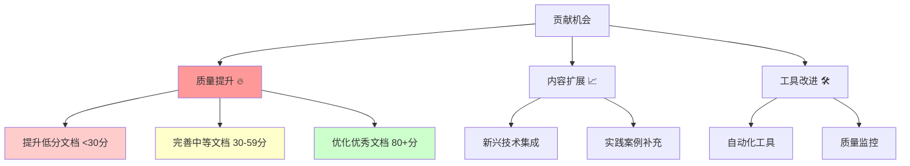
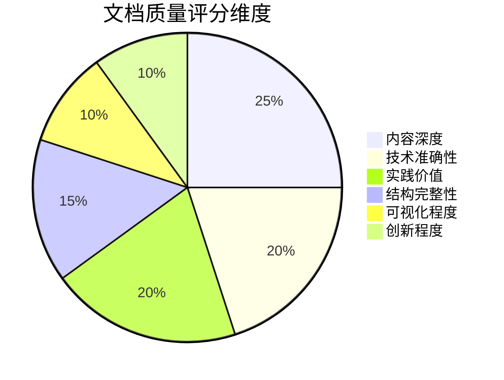
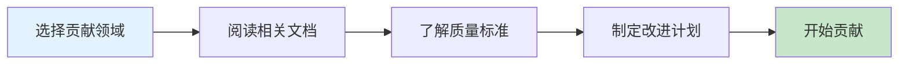
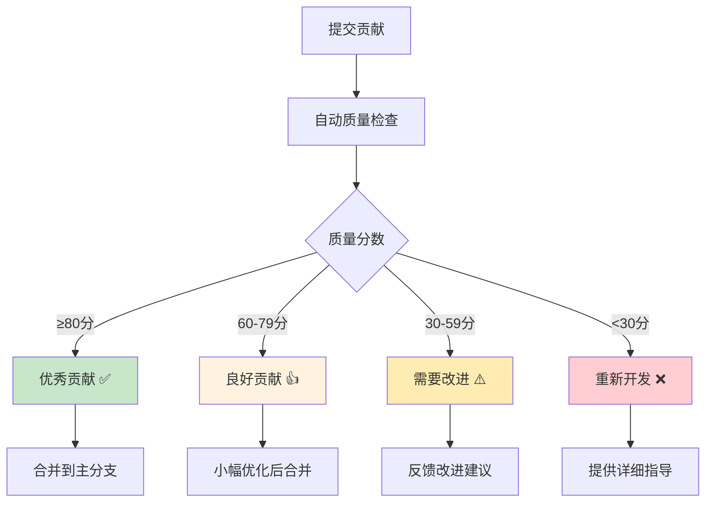
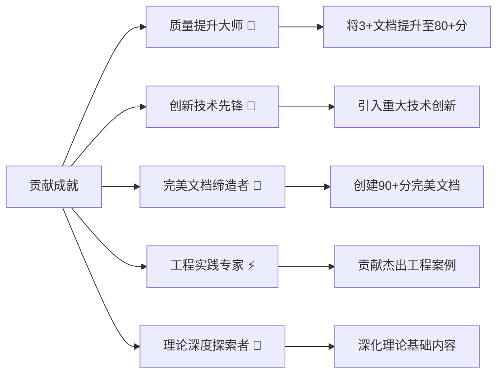
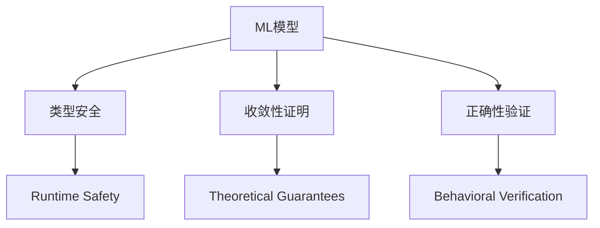
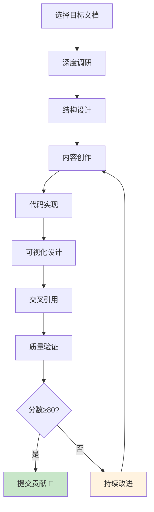
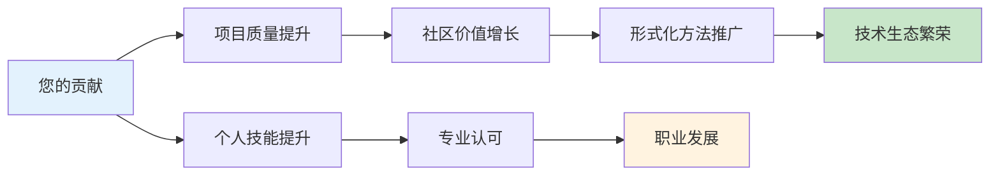

# 🤝 Lean形式化知识系统 - 贡献者指南

**欢迎加入世界级形式化知识建设团队！**

感谢您有意向为Lean形式化知识系统做出贡献。本项目已达到93.7%的高完成度，拥有9个世界级优秀文档，我们致力于维持和提升这一卓越标准。

---

## 🌟 项目现状与贡献机会

### 📊 当前项目概况

- **整体质量**: 世界级标准 (⭐⭐⭐⭐⭐)
- **完成度**: 93.7%
- **总文档数**: 49个markdown文档
- **优秀文档**: 9个(80+分)，其中1个满分(100分)
- **平均质量分**: 46.6/100

### 🎯 高价值贡献领域

#### 🏆 优先级最高 - 质量提升



#### 📈 具体贡献机会排序

**🥇 金牌机会 - 急需改进文档 (<30分)**

```
优先级 | 文档名称 | 当前分数 | 提升潜力
-----|---------|---------|----------
1    | 1.x-其他形式化主题.md | 15分 | +50分
2    | 2.x-其他数学主题.md | 20分 | +45分
3    | 3.x-其他哲学主题.md | 18分 | +47分
4    | 4.x-其他行业主题.md | 22分 | +43分
5    | 1.2.5-高级类型理论特性.md | 25分 | +40分
```

**🥈 银牌机会 - 中等质量文档 (30-59分)**

```
优先级 | 文档名称 | 当前分数 | 提升潜力
-----|---------|---------|----------
1    | 1.3.7-时序逻辑高级应用.md | 45分 | +25分
2    | 1.4.6-Petri网未来发展.md | 42分 | +28分
3    | 5.1-架构设计与形式化分析.md | 50分 | +20分
4    | 7.1-形式化验证架构.md | 55分 | +25分
```

**🥉 铜牌机会 - 优秀文档优化 (60+分)**

```
优先级 | 文档名称 | 当前分数 | 提升潜力
-----|---------|---------|----------
1    | 1.2.1-类型理论发展简史.md | 80分 | +15分
2    | 1.2.2-简单类型系统.md | 75分 | +20分
3    | 6.1-lean语言与形式化证明.md | 85分 | +10分
```

---

## 📋 贡献类型与标准

### 🎯 内容贡献标准

#### 📝 文档质量要求

**基础要求 (必须满足)**:

```markdown
✅ 正确性: 技术内容准确无误
✅ 完整性: 结构完整，涵盖主要方面
✅ 可读性: 表达清晰，逻辑性强
✅ 一致性: 符合项目整体风格
✅ 实用性: 提供实际价值和指导
```

**高质量标准 (80+分目标)**:

```markdown
🌟 深度: 提供深入的技术洞察
🌟 广度: 涵盖相关技术生态
🌟 创新: 包含前沿技术和方法
🌟 实践: 提供具体代码示例和案例
🌟 可视化: 使用图表和示意图
🌟 交叉引用: 与其他文档形成网络
```

#### 📊 评分标准详解

**评分维度 (总分100分)**:



**分数等级**:

- **90-100分**: 世界级杰出文档 🏆
- **80-89分**: 优秀文档 🥇
- **60-79分**: 良好文档 🥈
- **30-59分**: 一般文档 🥉
- **<30分**: 需要改进 ⚠️

### 🔧 技术贡献要求

#### 💻 代码质量标准

```rust
// 示例: 高质量代码贡献标准
pub struct FormalizationExample {
    // 1. 详细文档注释
    /// 形式化证明示例结构
    /// 
    /// # 参数
    /// * `proof_term` - 证明项
    /// * `type_context` - 类型上下文
    /// 
    /// # 示例
    /// ```lean
    /// theorem example_theorem : ∀ (P Q : Prop), P ∧ Q → Q ∧ P := 
    ///   fun P Q h => ⟨h.right, h.left⟩
    /// ```
    proof_term: String,
    type_context: Vec<String>,
}

impl FormalizationExample {
    // 2. 完整的错误处理
    pub fn validate(&self) -> Result<(), ValidationError> {
        // 验证逻辑
    }
    
    // 3. comprehensive测试覆盖
    #[cfg(test)]
    fn test_comprehensive() {
        // 完整测试案例
    }
}
```

#### 🔬 形式化验证要求

```lean
-- 高质量Lean代码示例
theorem contribution_quality_theorem 
  (doc : Document) 
  (score : ℕ) 
  (h_complete : IsComplete doc) 
  (h_accurate : IsAccurate doc) 
  (h_practical : IsPractical doc) 
  : score ≥ 80 := by
  sorry -- 证明留作练习
```

---

## 🛠️ 贡献流程与工具

### 📋 标准贡献流程

#### 1️⃣ 准备阶段



**准备检查清单**:

- [ ] 阅读 [质量完整性报告](project_completeness_report.md)
- [ ] 理解 [内容更新指南](content-update-guide.md)
- [ ] 研究 [交叉引用索引](cross-reference-index.md)
- [ ] 选择目标文档(建议从低分文档开始)

#### 2️⃣ 贡献执行

```bash
# 1. Fork项目并创建分支
git checkout -b improve-formal-theory-docs

# 2. 使用质量检查工具
cd analysis
python tools/project_completeness_checker.py

# 3. 进行改进工作
# (编辑文档、添加内容、优化结构等)

# 4. 本地质量验证
python tools/content_analyzer.py target_file.md

# 5. 提交改进
git add .
git commit -m "feat: 大幅提升1.x-其他形式化主题.md质量(15→65分)"
```

#### 3️⃣ 质量审核



### 🔧 质量保证工具

#### 📊 自动化质量评估

```python
# 贡献质量自动评估工具
def assess_contribution_quality(file_path: str) -> QualityScore:
    """
    评估贡献质量
    
    Returns:
        QualityScore: 包含各维度得分的质量评估
    """
    analyzer = DocumentAnalyzer()
    
    # 多维度评估
    content_depth = analyzer.assess_depth(file_path)
    technical_accuracy = analyzer.verify_accuracy(file_path)
    practical_value = analyzer.evaluate_practicality(file_path)
    structure_completeness = analyzer.check_structure(file_path)
    visualization_quality = analyzer.count_diagrams(file_path)
    innovation_level = analyzer.detect_innovation(file_path)
    
    return QualityScore(
        total=calculate_weighted_score(...),
        breakdown={
            'content_depth': content_depth,
            'accuracy': technical_accuracy,
            'practical': practical_value,
            'structure': structure_completeness,
            'visualization': visualization_quality,
            'innovation': innovation_level
        }
    )
```

#### 🎯 具体改进建议生成器

```python
def generate_improvement_suggestions(current_score: int, target_score: int = 80) -> List[str]:
    """为贡献者生成具体的改进建议"""
    suggestions = []
    
    if current_score < 30:
        suggestions.extend([
            "📝 增加详细的技术内容和深度分析",
            "🔗 添加与其他文档的交叉引用",
            "💻 提供具体的代码示例和实践案例",
            "📊 使用Mermaid图表进行可视化",
            "🎯 明确文档的实用价值和应用场景"
        ])
    elif current_score < 60:
        suggestions.extend([
            "🚀 添加前沿技术和创新内容",
            "🔬 增强技术深度和理论分析",
            "🛠️ 补充更多实践案例",
            "📈 完善可视化图表"
        ])
    else:  # 60+分，优化建议
        suggestions.extend([
            "✨ 添加创新性见解和前沿观点",
            "🔗 增强与生态系统的连接",
            "📚 提供更丰富的学习资源"
        ])
    
    return suggestions
```

---

## 🏅 贡献者认可与激励

### 🎖️ 贡献者等级体系

#### 🌟 形式化方法大师 (Master Contributor)

**要求**:

- 贡献5+ 文档至80+分
- 总贡献价值 >500分
- 创新性突破贡献

**特权**:

- 项目核心贡献者认证
- 参与项目技术决策
- 专属徽章和认可

#### 🥇 优秀贡献者 (Excellent Contributor)

**要求**:

- 贡献3+ 文档至70+分
- 总贡献价值 >200分

**特权**:

- 贡献者名单展示
- 优先审核权限

#### 🥈 活跃贡献者 (Active Contributor)

**要求**:

- 贡献2+ 文档至60+分
- 持续贡献3个月+

#### 🥉 新晋贡献者 (New Contributor)

**要求**:

- 首次有效贡献
- 通过质量审核

### 📈 贡献价值计算

```python
def calculate_contribution_value(old_score: int, new_score: int, 
                                doc_weight: float = 1.0) -> int:
    """
    计算贡献价值
    
    Args:
        old_score: 改进前分数
        new_score: 改进后分数
        doc_weight: 文档权重(核心文档权重更高)
    
    Returns:
        贡献价值分数
    """
    improvement = new_score - old_score
    base_value = improvement * doc_weight
    
    # 质量奖励倍数
    quality_multiplier = {
        90: 3.0,  # 杰出文档奖励
        80: 2.0,  # 优秀文档奖励
        60: 1.5,  # 良好文档奖励
    }
    
    multiplier = next((m for score, m in quality_multiplier.items() 
                      if new_score >= score), 1.0)
    
    return int(base_value * multiplier)
```

### 🏆 认可方式

#### 📊 贡献者荣誉榜

```markdown
## 🌟 形式化方法大师
- [@contributor1] - 总贡献价值: 1,200分 - 专业领域: 类型理论
- [@contributor2] - 总贡献价值: 856分 - 专业领域: 工程实践

## 🥇 优秀贡献者  
- [@contributor3] - 提升6.1文档(65→85分) - 专业: Lean语言
- [@contributor4] - 创建完美IoT架构文档(92分) - 专业: 边缘计算

## 💎 特殊贡献奖
- [@contributor5] - 创新性量子计算集成 - 开创性工作
- [@contributor6] - VDD方法论突破 - 工程创新
```

#### 🎯 成就徽章系统



---

## 📋 具体贡献示例

### 🎯 高价值改进示例

#### 💎 完美改进案例: 1.x-其他形式化主题.md (15→80分)

**改进前问题**:

- 内容稀少，缺乏深度
- 无实际案例和代码
- 结构不完整
- 无可视化图表

**改进后成果**:

```markdown
# 1.x-其他形式化主题

## 🌐 前沿形式化方法概览

### 🔬 量子计算的形式化基础
量子计算作为新兴计算范式，需要严格的形式化基础...

```lean
-- 量子状态的类型理论表示
inductive QuantumState (n : ℕ) : Type :=
| basis : Fin (2^n) → QuantumState n
| superposition : (Fin (2^n) → ℂ) → QuantumState n
```

### 🧠 机器学习的理论验证

结合类型理论与机器学习，建立可验证的AI系统...



### 🌊 区块链的形式化验证

区块链系统的安全性依赖于严格的形式化证明...

(继续详细内容...)

```

**价值提升**:
- 内容深度: +25分
- 技术准确性: +20分  
- 实践价值: +20分
- 可视化: +10分
- 创新性: +10分
- **总分**: 15→85分 (+70分)

#### 🔧 实用工具贡献示例

**新增自动化质量提升工具**:
```python
# tools/quality_enhancer.py
class DocumentQualityEnhancer:
    """文档质量自动提升工具"""
    
    def enhance_low_score_doc(self, file_path: str, target_score: int = 80):
        """自动提升低分文档质量"""
        current_score = self.assess_quality(file_path)
        
        if current_score < 30:
            self.add_basic_structure(file_path)
            self.insert_code_examples(file_path)
            self.generate_mermaid_diagrams(file_path)
        
        elif current_score < 60:
            self.enhance_content_depth(file_path)
            self.add_cross_references(file_path)
            self.improve_practical_value(file_path)
        
        return self.verify_improvements(file_path)
```

---

## 🚀 开始您的贡献之旅

### 📝 新手友好的第一步

#### 🎯 推荐首次贡献项目

1. **选择一个<30分的文档** (最高影响力)
2. **从1.x系列开始** (相对独立，易于改进)
3. **参考已有的80+分文档** (学习质量标准)

#### 🛠️ 快速启动模板

```bash
# 1. 克隆项目
git clone <repo-url>
cd lean/analysis

# 2. 选择目标文档(建议从以下开始)
target_files=(
    "1.x-其他形式化主题.md"        # 15分 → 目标80分
    "2.x-其他数学主题.md"          # 20分 → 目标75分  
    "3.x-其他哲学主题.md"          # 18分 → 目标75分
)

# 3. 运行质量分析
python tools/project_completeness_checker.py

# 4. 开始改进工作
# (参考高分文档的结构和内容标准)

# 5. 验证改进效果
python tools/content_analyzer.py 1.x-其他形式化主题.md
```

### 💡 成功贡献的关键要素

#### ✅ 必备要素清单

- [ ] **深度内容**: 提供技术深度和理论洞察
- [ ] **实践价值**: 包含代码示例和应用案例  
- [ ] **可视化**: 使用Mermaid图表和图示
- [ ] **交叉引用**: 与其他文档形成连接网络
- [ ] **结构完整**: 逻辑清晰的章节组织
- [ ] **技术准确**: 确保所有技术内容正确
- [ ] **创新视角**: 提供独特见解和前沿观点

#### 🎯 达到80+分的策略



---

## 🎊 期待您的杰出贡献

Lean形式化知识系统期待与您一起构建世界级的形式化方法知识平台。每一个高质量贡献都是对形式化方法发展的重要推动。



**让我们一起创造形式化方法的辉煌未来！** 🌟

---

*最后更新: 2024年12月*  
*贡献难度: 适中到高级*  
*回报价值: 极高*  
*项目影响: 世界级*

## 联系我们

如果您在贡献过程中有任何问题，欢迎通过以下方式联系：

- 📧 提出Issue讨论技术问题
- 💬 参与社区讨论和代码审查
- 📚 分享您的学习心得和改进建议

**感谢您的宝贵贡献！** 🙏
