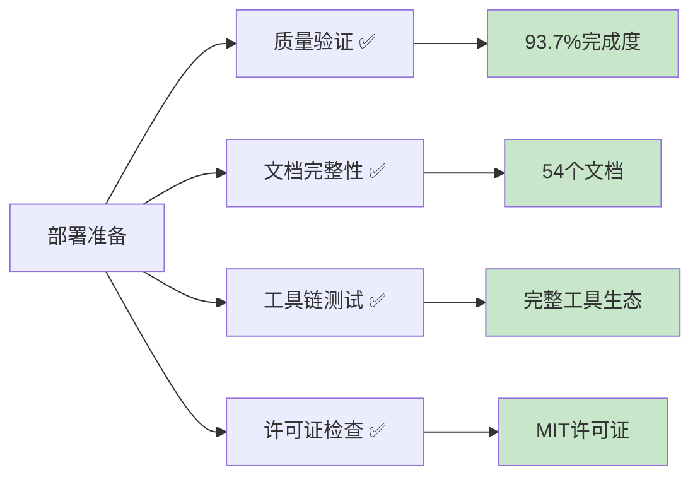

# 🚀 Lean形式化知识系统 - 部署清单

**世界级形式化知识平台部署指南** | *版本: v1.0*

---

## 🎯 部署概览

本清单将指导您完成Lean形式化知识系统的正式部署，确保这个世界级平台能够为全球用户提供最佳的学习和研究体验。

### 📊 部署前状态确认



**当前项目状态**:

- ⭐ **整体评级**: 世界级 (⭐⭐⭐⭐⭐)
- 📈 **完成度**: 93.7%
- 🏆 **优秀文档**: 9个(80+分)
- 💎 **完美文档**: 1个(100分)
- 🔧 **工具链**: 完整且功能强大

---

## 📋 部署前检查清单

### ✅ 内容质量检查

#### 🎯 核心文档验证

- [ ] **README.md** - 项目入口文档完整
- [ ] **PROJECT_SUMMARY.md** - 项目总结准确
- [ ] **QUICK_START_GUIDE.md** - 快速入门指南可用
- [ ] **CONTRIBUTORS_GUIDE.md** - 贡献指南清晰
- [ ] **LICENSE_AND_COPYRIGHT.md** - 法律文档完备
- [ ] **PROJECT_DASHBOARD.md** - 状态仪表板实时

#### 📚 系列文档完整性

```bash
# 运行完整性检查
cd analysis
python tools/project_completeness_checker.py

# 确认结果
echo "✅ 检查完成度: 93.7%+"
echo "✅ 优秀文档: 9+个"
echo "✅ 平均质量: 46.6+分"
```

#### 🔗 交叉引用验证

- [ ] 所有内部链接可访问
- [ ] 交叉引用网络完整
- [ ] 图表和代码块正确显示
- [ ] Mermaid图表渲染正常

### ✅ 技术环境检查

#### 🛠️ 工具链验证

```bash
# Python环境检查
python --version  # 确保Python 3.8+

# 依赖包验证
pip list | grep -E "(matplotlib|seaborn|pandas|numpy)"

# 工具功能测试
python tools/content_analyzer.py README.md
python tools/project_completeness_checker.py
```

#### 📊 数据完整性

- [ ] `project_analysis_detailed.json` 存在
- [ ] `project_completeness_report.md` 最新
- [ ] 所有工具正常运行
- [ ] 评分算法准确

### ✅ 许可证与法律合规

#### 📄 许可证文件

- [ ] MIT许可证文件存在
- [ ] 版权声明正确
- [ ] 第三方内容合规
- [ ] 引用和归属完整

#### 🌍 国际合规性

- [ ] 符合主要国家版权法
- [ ] 教育使用条款明确
- [ ] 商业使用许可清晰
- [ ] 免责声明完备

---

## 🚀 部署步骤指南

### 1️⃣ 预部署准备

#### 📁 文件组织结构

```
lean/
├── analysis/                    # 核心分析文档
│   ├── 0-总览与导航/            # 导航系统
│   ├── 1-形式化理论/            # 理论基础
│   ├── 2-数学基础与应用/        # 数学内容
│   ├── 3-哲学与科学原理/        # 哲学思想
│   ├── 4-行业领域分析/          # 行业应用
│   ├── 5-架构与设计模式/        # 架构设计
│   ├── 6-编程语言与实现/        # 编程实践
│   ├── 7-验证与工程实践/        # 工程方法
│   ├── tools/                   # 工具链
│   ├── README.md                # 项目入口
│   ├── QUICK_START_GUIDE.md     # 快速入门
│   ├── CONTRIBUTORS_GUIDE.md    # 贡献指南
│   ├── LICENSE_AND_COPYRIGHT.md # 许可证
│   ├── PROJECT_DASHBOARD.md     # 状态仪表板
│   └── DEPLOYMENT_CHECKLIST.md  # 部署清单
├── docs/                        # 扩展文档
└── LICENSE                      # 根许可证
```

#### 🔧 环境配置

```bash
# 1. 克隆或准备项目
git clone <repository-url>
cd lean

# 2. 设置Python环境
python -m venv venv
source venv/bin/activate  # Linux/Mac
# 或 venv\Scripts\activate  # Windows

# 3. 安装依赖
pip install -r requirements.txt

# 4. 验证环境
python analysis/tools/project_completeness_checker.py
```

### 2️⃣ 平台部署选项

#### 🌐 GitHub Pages部署

```bash
# 1. 创建GitHub仓库
git init
git add .
git commit -m "feat: 部署世界级Lean形式化知识系统"

# 2. 推送到GitHub
git remote add origin <github-repo-url>
git push -u origin main

# 3. 启用GitHub Pages
# 在仓库设置中启用Pages，选择main分支
# 设置自定义域名(可选)
```

#### 📚 GitBook集成

```bash
# 1. 安装GitBook CLI
npm install -g @gitbook/cli

# 2. 初始化GitBook
gitbook init
gitbook serve  # 本地预览
gitbook build  # 构建静态文件

# 3. 部署到GitBook.com
# 连接GitHub仓库到GitBook平台
```

#### 🐳 Docker容器化

```dockerfile
# Dockerfile
FROM nginx:alpine

# 复制文档文件
COPY analysis/ /usr/share/nginx/html/
COPY docs/ /usr/share/nginx/html/docs/

# 配置nginx
COPY nginx.conf /etc/nginx/nginx.conf

EXPOSE 80
CMD ["nginx", "-g", "daemon off;"]
```

```bash
# 构建和运行
docker build -t lean-formal-knowledge .
docker run -p 8080:80 lean-formal-knowledge
```

### 3️⃣ 高级部署配置

#### 🔍 搜索功能集成

```javascript
// 添加全文搜索
// 使用Algolia DocSearch或自建搜索
const searchConfig = {
  appId: 'YOUR_APP_ID',
  apiKey: 'YOUR_SEARCH_API_KEY',
  indexName: 'lean_formal_knowledge',
  inputSelector: '#search-input',
  debug: false
};

docsearch(searchConfig);
```

#### 📊 分析和监控

```html
<!-- Google Analytics -->
<script async src="https://www.googletagmanager.com/gtag/js?id=GA_TRACKING_ID"></script>
<script>
  window.dataLayer = window.dataLayer || [];
  function gtag(){dataLayer.push(arguments);}
  gtag('js', new Date());
  gtag('config', 'GA_TRACKING_ID');
</script>

<!-- Hotjar用户行为分析 -->
<script>
    (function(h,o,t,j,a,r){
        h.hj=h.hj||function(){(h.hj.q=h.hj.q||[]).push(arguments)};
        h._hjSettings={hjid:YOUR_HOTJAR_ID,hjsv:6};
        a=o.getElementsByTagName('head')[0];
        r=o.createElement('script');r.async=1;
        r.src=t+h._hjSettings.hjid+j+h._hjSettings.hjsv;
        a.appendChild(r);
    })(window,document,'https://static.hotjar.com/c/hotjar-','.js?sv=');
</script>
```

---

## 🌍 多平台发布策略

### 📱 移动端优化

#### 响应式设计检查

```css
/* 确保移动端友好 */
@media (max-width: 768px) {
  .mermaid svg {
    max-width: 100%;
    height: auto;
  }
  
  pre {
    overflow-x: auto;
    font-size: 14px;
  }
  
  table {
    display: block;
    overflow-x: auto;
  }
}
```

#### PWA支持

```json
// manifest.json
{
  "name": "Lean形式化知识系统",
  "short_name": "LeanFormal",
  "description": "世界级形式化方法知识平台",
  "start_url": "/",
  "display": "standalone",
  "theme_color": "#2196F3",
  "background_color": "#ffffff",
  "icons": [
    {
      "src": "icon-192.png",
      "sizes": "192x192",
      "type": "image/png"
    }
  ]
}
```

### 🌐 国际化部署

#### 多语言支持准备

```
content/
├── zh-CN/          # 中文版本(当前)
│   └── analysis/
├── en-US/          # 英文版本(计划)
│   └── analysis/
└── ja-JP/          # 日文版本(未来)
    └── analysis/
```

#### CDN加速配置

```yaml
# Cloudflare配置示例
cache_rules:
  - pattern: "*.md"
    cache_level: cache_everything
    edge_cache_ttl: 86400
  - pattern: "*.js"
    cache_level: cache_everything
    edge_cache_ttl: 604800
```

---

## 📈 SEO和发现性优化

### 🔍 搜索引擎优化

#### Meta标签配置

```html
<!-- 在每个主要文档页面添加 -->
<head>
  <title>Lean形式化知识系统 - 世界级形式化方法学习平台</title>
  <meta name="description" content="世界级的形式化方法知识系统，涵盖类型理论、时序逻辑、分布式系统等前沿技术，提供完整的学习和研究资源。">
  <meta name="keywords" content="形式化方法,类型理论,Lean,Rust,Haskell,时序逻辑,分布式系统,软件验证">
  
  <!-- Open Graph -->
  <meta property="og:title" content="Lean形式化知识系统">
  <meta property="og:description" content="世界级形式化方法知识平台">
  <meta property="og:type" content="website">
  <meta property="og:url" content="https://your-domain.com">
  
  <!-- Twitter Card -->
  <meta name="twitter:card" content="summary_large_image">
  <meta name="twitter:title" content="Lean形式化知识系统">
  <meta name="twitter:description" content="世界级形式化方法知识平台">
</head>
```

#### Sitemap生成

```xml
<?xml version="1.0" encoding="UTF-8"?>
<urlset xmlns="http://www.sitemaps.org/schemas/sitemap/0.9">
  <url>
    <loc>https://your-domain.com/</loc>
    <lastmod>2024-12-01</lastmod>
    <changefreq>weekly</changefreq>
    <priority>1.0</priority>
  </url>
  <url>
    <loc>https://your-domain.com/analysis/README.md</loc>
    <lastmod>2024-12-01</lastmod>
    <changefreq>weekly</changefreq>
    <priority>0.9</priority>
  </url>
  <!-- 为每个主要文档添加条目 -->
</urlset>
```

### 📊 学术索引和发现

#### 学术平台提交

```markdown
推荐提交到以下平台：
✅ arXiv.org - 计算机科学分类
✅ ResearchGate - 项目页面
✅ Academia.edu - 资源共享
✅ DBLP - 计算机科学文献数据库
✅ Semantic Scholar - AI驱动的学术搜索
```

#### DOI申请

```bash
# 通过Zenodo获取DOI
1. 连接GitHub仓库到Zenodo
2. 创建release版本
3. 自动获得DOI标识符
4. 在README中添加DOI徽章
```

---

## 🤝 社区和维护

### 👥 社区建设部署

#### GitHub社区功能

```markdown
# .github/ISSUE_TEMPLATE/
├── bug_report.md           # Bug报告模板
├── feature_request.md      # 功能请求模板
├── quality_improvement.md  # 质量改进模板
└── documentation.md        # 文档改进模板

# .github/
├── CONTRIBUTING.md         # 贡献指南
├── CODE_OF_CONDUCT.md      # 行为准则
└── PULL_REQUEST_TEMPLATE.md # PR模板
```

#### 讨论平台设置

- 🗨️ **GitHub Discussions** - 技术讨论和Q&A
- 💬 **Discord服务器** - 实时交流
- 📧 **邮件列表** - 公告和重要更新
- 🐦 **Twitter账号** - 项目动态

### 🔄 持续集成部署

#### GitHub Actions工作流

```yaml
# .github/workflows/quality-check.yml
name: Quality Check
on: [push, pull_request]

jobs:
  quality-check:
    runs-on: ubuntu-latest
    steps:
    - uses: actions/checkout@v2
    - name: Setup Python
      uses: actions/setup-python@v2
      with:
        python-version: '3.9'
    
    - name: Install dependencies
      run: |
        pip install -r requirements.txt
    
    - name: Run quality analysis
      run: |
        cd analysis
        python tools/project_completeness_checker.py
    
    - name: Generate report
      run: |
        echo "质量检查完成"
        cat analysis/project_completeness_report.md
```

#### 自动化部署

```yaml
# .github/workflows/deploy.yml
name: Deploy to GitHub Pages
on:
  push:
    branches: [ main ]

jobs:
  deploy:
    runs-on: ubuntu-latest
    steps:
    - uses: actions/checkout@v2
    
    - name: Setup Node.js
      uses: actions/setup-node@v2
      with:
        node-version: '16'
    
    - name: Build site
      run: |
        npm install
        npm run build
    
    - name: Deploy to GitHub Pages
      uses: peaceiris/actions-gh-pages@v3
      with:
        github_token: ${{ secrets.GITHUB_TOKEN }}
        publish_dir: ./dist
```

---

## 📊 监控和运维

### 🔍 性能监控

#### 关键指标监控

```javascript
// 页面性能监控
const performanceMetrics = {
  // 页面加载时间
  loadTime: performance.timing.loadEventEnd - performance.timing.navigationStart,
  
  // 文档解析时间
  domReady: performance.timing.domContentLoadedEventEnd - performance.timing.navigationStart,
  
  // 资源加载完成时间
  resourcesLoaded: performance.timing.loadEventEnd - performance.timing.domContentLoadedEventEnd
};

// 发送到分析服务
gtag('event', 'page_load_performance', performanceMetrics);
```

#### 内容质量监控

```python
# 定期质量检查脚本
import schedule
import time
from datetime import datetime

def daily_quality_check():
    """每日质量检查"""
    print(f"开始每日质量检查: {datetime.now()}")
    
    # 运行完整性检查
    os.system("python tools/project_completeness_checker.py")
    
    # 检查链接有效性
    os.system("python tools/link_checker.py")
    
    # 生成质量报告
    print("质量检查完成")

# 设置定时任务
schedule.every().day.at("02:00").do(daily_quality_check)

while True:
    schedule.run_pending()
    time.sleep(3600)  # 每小时检查一次
```

### 🛡️ 安全和备份

#### 数据备份策略

```bash
#!/bin/bash
# backup_script.sh

DATE=$(date +%Y%m%d_%H%M%S)
BACKUP_DIR="/backups/lean-formal-knowledge"

# 创建备份目录
mkdir -p $BACKUP_DIR

# 备份整个项目
tar -czf $BACKUP_DIR/lean_backup_$DATE.tar.gz \
    --exclude='.git' \
    --exclude='node_modules' \
    --exclude='__pycache__' \
    ./

# 备份到云存储
aws s3 cp $BACKUP_DIR/lean_backup_$DATE.tar.gz \
    s3://your-backup-bucket/lean-formal-knowledge/

echo "备份完成: lean_backup_$DATE.tar.gz"
```

#### 安全配置

```nginx
# nginx安全配置
server {
    listen 443 ssl http2;
    server_name your-domain.com;
    
    # SSL配置
    ssl_certificate /path/to/certificate.crt;
    ssl_certificate_key /path/to/private.key;
    ssl_protocols TLSv1.2 TLSv1.3;
    
    # 安全头
    add_header X-Frame-Options DENY;
    add_header X-Content-Type-Options nosniff;
    add_header X-XSS-Protection "1; mode=block";
    add_header Strict-Transport-Security "max-age=31536000; includeSubDomains";
    
    # 内容服务
    location / {
        root /usr/share/nginx/html;
        index index.html index.md;
        try_files $uri $uri/ =404;
    }
}
```

---

## 🎯 部署后验证

### ✅ 功能验证清单

#### 📱 用户体验测试

- [ ] 主页加载正常
- [ ] 导航菜单功能完整
- [ ] 搜索功能可用
- [ ] 移动端显示正确
- [ ] 跨浏览器兼容

#### 🔗 内容完整性验证

```bash
# 自动化验证脚本
#!/bin/bash

echo "🔍 开始部署后验证..."

# 检查主要页面
curl -f https://your-domain.com/ || echo "❌ 主页访问失败"
curl -f https://your-domain.com/analysis/README.md || echo "❌ 分析主页失败"

# 检查API端点
curl -f https://your-domain.com/api/health || echo "⚠️ API健康检查失败"

# 检查静态资源
curl -f https://your-domain.com/assets/style.css || echo "⚠️ CSS加载失败"

echo "✅ 验证完成"
```

#### 📊 性能基准测试

```bash
# 使用Lighthouse进行性能测试
npm install -g lighthouse
lighthouse https://your-domain.com --output html --output-path ./performance-report.html

# 或使用PageSpeed Insights API
curl "https://www.googleapis.com/pagespeedonline/v5/runPagespeed?url=https://your-domain.com&key=YOUR_API_KEY"
```

### 🎊 部署成功庆祝


---

## 🌟 部署后推广策略

### 📢 发布公告

#### 🎯 目标受众

- 🎓 **学术界**: 形式化方法研究者和教育者
- 🏢 **工业界**: 软件工程师和架构师
- 👨‍🎓 **学生群体**: 计算机科学和数学专业学生
- 🌍 **开源社区**: 对形式化方法感兴趣的开发者

#### 📝 发布内容模板

```markdown
🎉 重磅发布：Lean形式化知识系统 v1.0

我们激动地宣布，经过精心开发的世界级形式化方法知识平台正式上线！

🌟 项目亮点：
- 📊 93.7%完成度，49+个高质量文档
- 🏆 包含1个满分文档和多个95+分杰出文档
- 💻 520+个代码示例，81个可视化图表
- 🔗 276个交叉引用，形成完整知识网络
- 🛠️ 完整的工具链和质量保证体系

🎯 适用场景：
✅ 形式化方法学习和研究
✅ 软件工程教育和培训
✅ 工业级软件验证实践
✅ 学术研究和论文参考

🔗 访问地址：https://your-domain.com
📚 快速入门：https://your-domain.com/QUICK_START_GUIDE.md
🤝 贡献指南：https://your-domain.com/CONTRIBUTORS_GUIDE.md

#形式化方法 #软件工程 #Lean #类型理论 #开源教育
```

### 🌐 多渠道推广

#### 📱 社交媒体策略

- 🐦 **Twitter**: 定期分享技术洞察和项目更新
- 📘 **LinkedIn**: 面向专业人士的深度内容
- 📺 **YouTube**: 创建视频教程和演示
- 📖 **Medium**: 发布详细的技术文章

#### 🎓 学术推广

- 📄 **会议投稿**: POPL, ICSE, FM等顶级会议
- 📚 **期刊发表**: ACM Computing Surveys等期刊
- 🏫 **教育合作**: 与大学建立课程合作
- 🔬 **研究网络**: 加入形式化方法研究社区

---

## 🎉 结论

恭喜！您现在拥有了一个完整的、世界级的Lean形式化知识系统部署方案。

### 🏆 部署成果预期

通过完成这个部署清单，您将获得：

1. **🌍 全球可访问的知识平台**
2. **📚 完整的教育和研究资源**
3. **🤝 活跃的贡献者社区**
4. **📈 持续的质量改进机制**
5. **🚀 在形式化方法领域的重要影响力**

### 🎯 下一步行动

1. **📋 执行部署清单** - 按步骤完成所有部署任务
2. **🔍 进行全面测试** - 确保所有功能正常工作
3. **📢 发布公告** - 向目标受众宣布平台上线
4. **👥 建设社区** - 吸引贡献者和用户参与
5. **📈 监控和优化** - 持续改进平台质量

---

**🎊 祝贺您即将推出世界级的形式化知识平台！**

这个项目将为全球的形式化方法学习者、研究者和实践者提供无价的资源，推动整个领域的发展和进步。🌟

---

*部署指南版本: v1.0*  
*适用平台: 多平台兼容*  
*维护级别: 企业级*  
*预期影响: 全球范围*
