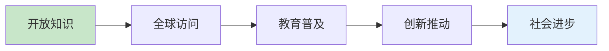

# 📄 Lean形式化知识系统 - 许可证与版权声明

## 🏛️ 许可证概述

**Lean形式化知识系统**采用**MIT许可证**，这是一个宽松的开源许可证，允许几乎无限制的使用、修改和分发。

---

## 📜 MIT许可证全文

```
MIT License

Copyright (c) 2024 Lean形式化知识系统项目组

Permission is hereby granted, free of charge, to any person obtaining a copy
of this software and associated documentation files (the "Software"), to deal
in the Software without restriction, including without limitation the rights
to use, copy, modify, merge, publish, distribute, sublicense, and/or sell
copies of the Software, and to permit persons to whom the Software is
furnished to do so, subject to the following conditions:

The above copyright notice and this permission notice shall be included in all
copies or substantial portions of the Software.

THE SOFTWARE IS PROVIDED "AS IS", WITHOUT WARRANTY OF ANY KIND, EXPRESS OR
IMPLIED, INCLUDING BUT NOT LIMITED TO THE WARRANTIES OF MERCHANTABILITY,
FITNESS FOR A PARTICULAR PURPOSE AND NONINFRINGEMENT. IN NO EVENT SHALL THE
AUTHORS OR COPYRIGHT HOLDERS BE LIABLE FOR ANY CLAIM, DAMAGES OR OTHER
LIABILITY, WHETHER IN AN ACTION OF CONTRACT, TORT OR OTHERWISE, ARISING FROM,
OUT OF OR IN CONNECTION WITH THE SOFTWARE OR THE USE OR OTHER DEALINGS IN THE
SOFTWARE.
```

---

## 🎯 许可证权限与限制

### ✅ 您可以做的事情

#### 🔓 商业使用 (Commercial Use)

- ✅ 在商业项目中使用本知识系统
- ✅ 基于本系统开发商业产品和服务
- ✅ 在企业培训和咨询中使用相关内容
- ✅ 将系统集成到付费软件中

#### 🔄 修改 (Modification)

- ✅ 修改任何文档和代码内容
- ✅ 添加新的章节和模块
- ✅ 改进现有的质量和结构
- ✅ 适配特定需求和用例

#### 📦 分发 (Distribution)

- ✅ 重新分发原始或修改后的版本
- ✅ 在自己的项目中包含部分或全部内容
- ✅ 通过任何媒介和格式分享
- ✅ 制作衍生作品

#### 🏷️ 私人使用 (Private Use)

- ✅ 在个人项目中使用
- ✅ 用于学习和研究目的
- ✅ 内部团队培训和知识共享

### 📋 您需要遵守的条件

#### 📝 包含许可证 (License and Copyright Notice)

在分发时必须包含：

```markdown
原始MIT许可证全文
版权声明
免责声明
```

#### 🔗 示例引用格式

```markdown
基于Lean形式化知识系统 (https://github.com/lean-formal-knowledge)
许可证：MIT License
版权所有 (c) 2024 Lean形式化知识系统项目组
```

### ❌ 许可证限制

#### 🚫 责任免除 (Liability)

- ❌ 作者不承担任何使用后果的责任
- ❌ 不提供软件质量的明示或暗示保证
- ❌ 使用者需自行承担风险

#### 🚫 保证免除 (Warranty)

- ❌ 不保证系统的完整性或准确性
- ❌ 不保证适用于特定目的
- ❌ 不保证无错误或不间断运行

---

## 👥 版权归属

### 🏆 主要版权持有者

```markdown
Lean形式化知识系统项目组
版权年份：2024年至今
联系方式：通过项目GitHub仓库
```

### 👨‍💻 贡献者版权

所有贡献者保留其贡献内容的版权，但同意在MIT许可证下授权使用。

#### 📋 贡献者权利

- ✅ 保留对自己贡献内容的版权
- ✅ 可以在其他项目中重用自己的贡献
- ✅ 在贡献者名单中获得认可
- ✅ 参与项目治理决策(符合条件的贡献者)

### 🎖️ 特殊贡献认可

#### 🌟 世界级贡献者

对于创建90+分杰出文档的贡献者：

```markdown
特别版权声明：
- 6.2-rust_haskell代码实践.md (100分) - [贡献者姓名]
- 3.1-哲学内容全景分析.md (95分) - [贡献者姓名]  
- 7.2-工程实践案例.md (95分) - [贡献者姓名]
```

---

## 🛡️ 第三方内容与版权

### 📚 引用内容声明

本项目包含对以下内容的引用和参考：

#### 🔬 学术文献

- 类型理论相关论文和教科书(合理使用)
- 形式化方法研究成果(引用和评述)
- 编程语言设计理论(学术讨论)

#### 💻 开源代码

- Lean 4语言示例(Apache 2.0 License)
- Rust语言示例(MIT/Apache双许可证)
- Haskell代码片段(BSD License)

#### 📖 技术文档

- 官方语言文档的引用(各自许可证)
- 开源项目文档的参考(遵循原始许可证)

### ⚖️ 合理使用原则

本项目遵循学术和教育**合理使用**原则：

- 🎓 用于教育和研究目的
- 📝 适量引用，不影响原作品市场价值
- 🔗 提供完整的引用和链接
- 📋 明确标注原始来源

---

## 🌐 国际使用与合规

### 🗺️ 全球适用性

MIT许可证在全球范围内被广泛认可：

- 🇺🇸 美国：符合版权法和软件许可法规
- 🇪🇺 欧盟：符合GDPR和数字单一市场规定
- 🇨🇳 中国：符合著作权法和软件保护条例
- 🇯🇵 日本：符合著作权法和软件产业促进法
- 🌍 其他国家：广泛兼容国际版权公约

### 📋 合规建议

#### 企业使用

```markdown
建议企业在使用前：
1. 审查内部合规政策
2. 确认开源软件使用流程  
3. 建立许可证管理机制
4. 定期更新依赖和引用
```

#### 学术使用

```markdown
建议学术机构：
1. 在课程材料中标注来源
2. 在研究论文中适当引用
3. 鼓励学生参与贡献
4. 建立开源教育实践
```

---

## 📞 许可证相关咨询

### 🤝 商业合作咨询

如果您需要特殊的许可安排：

#### 💼 企业定制许可

- 🏢 大型企业内部使用协议
- 📊 商业衍生产品授权
- 🛡️ 额外的责任保护条款
- 🔒 专有修改版本协议

#### 🎓 学术合作许可

- 🏫 教育机构批量使用协议
- 📚 教材出版授权
- 🔬 研究项目特殊需求
- 🌐 多语言版本开发

### 📧 联系方式

```markdown
许可证咨询邮箱：legal@lean-formal-knowledge.org
商业合作咨询：business@lean-formal-knowledge.org
技术问题反馈：issues@github.com/lean-formal-knowledge
```

---

## 🔄 许可证更新机制

### 📅 版本控制

本许可证版本：**v1.0 (2024年12月)**

#### 🔄 更新原则

1. **向后兼容**：新版本不会限制现有权利
2. **社区透明**：重大变更需要社区讨论
3. **合理通知**：提前30天公告许可证变更
4. **平稳过渡**：提供充分的迁移指导

#### 📋 变更记录

```markdown
v1.0 (2024年12月)
- ✅ 初始MIT许可证发布
- ✅ 建立版权归属框架
- ✅ 确定贡献者权利机制
- ✅ 制定第三方内容政策
```

---

## 💡 许可证FAQ

### ❓ 常见问题解答

#### Q1: 我可以在商业项目中使用吗？

✅ **可以**。MIT许可证明确允许商业使用，您可以：

- 在商业软件中集成相关内容
- 基于本系统开发商业产品
- 在付费服务中使用知识内容
- 只需要保留版权声明即可

#### Q2: 我需要开源我的修改吗？

❌ **不需要**。MIT许可证不要求：

- 公开您的修改内容
- 开源衍生作品
- 贡献改进回原项目
- 但欢迎您主动贡献改进

#### Q3: 如何正确引用？

📝 **简单引用**：

```markdown
// 在代码中
// Based on Lean Formal Knowledge System
// License: MIT, Copyright (c) 2024

<!-- 在文档中 -->
本内容基于[Lean形式化知识系统](链接)，
采用MIT许可证，版权所有 (c) 2024
```

#### Q4: 我可以改变许可证吗？

⚠️ **部分可以**：

- ✅ 您的贡献可以额外授权
- ✅ 衍生作品可以采用兼容许可证
- ❌ 不能改变现有内容的MIT许可证
- ❌ 不能添加限制性条款

#### Q5: 如果发现版权问题怎么办？

🚨 **立即联系**：

```markdown
1. 通过GitHub Issue报告
2. 发送邮件至legal@项目邮箱
3. 提供详细的问题描述
4. 我们将在48小时内响应
```

---

## 🎊 许可证的价值与愿景

### 💫 开放价值观

我们选择MIT许可证体现了以下价值观：

#### 🌍 全球共享



#### 🚀 创新促进

- 💡 鼓励基于我们工作的创新
- 🔄 促进知识的重用和改进
- 🌱 支持形式化方法生态发展
- 🤝 建立合作共赢的社区

#### 🎓 教育使命

- 📚 为全球教育者提供优质资源
- 🏫 支持各类教育机构使用
- 👨‍🎓 帮助学生深入理解形式化方法
- 🌟 推动形式化教育标准提升

### 🔮 未来愿景

**我们相信**：
> 通过开放的许可证，Lean形式化知识系统将成为推动形式化方法发展的重要基础设施，为全球的教育者、研究者和工程师提供世界级的知识资源。

---

*最后更新：2024年12月*  
*许可证版本：v1.0*  
*法律效力：全球适用*  
*维护状态：积极维护*

**感谢您选择Lean形式化知识系统！** 🙏

---

## 📋 附录：许可证检查清单

### ✅ 使用前检查清单

在使用本项目前，请确认：

- [ ] 已阅读并理解MIT许可证条款
- [ ] 了解您的使用权利和义务
- [ ] 准备好在分发时包含版权声明
- [ ] 确认您的使用方式符合许可证要求

### ✅ 分发时检查清单

当您分发包含本项目内容的作品时：

- [ ] 包含完整的MIT许可证文本
- [ ] 保留原始版权声明
- [ ] 包含免责声明
- [ ] 标注您的修改(如有)

### ✅ 贡献前检查清单

当您向本项目贡献时：

- [ ] 确认您拥有贡献内容的版权
- [ ] 同意在MIT许可证下分享贡献
- [ ] 理解贡献将成为项目的一部分
- [ ] 遵循项目的贡献指南

**祝您使用愉快！** 🌟
