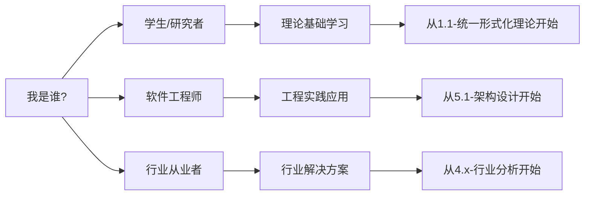
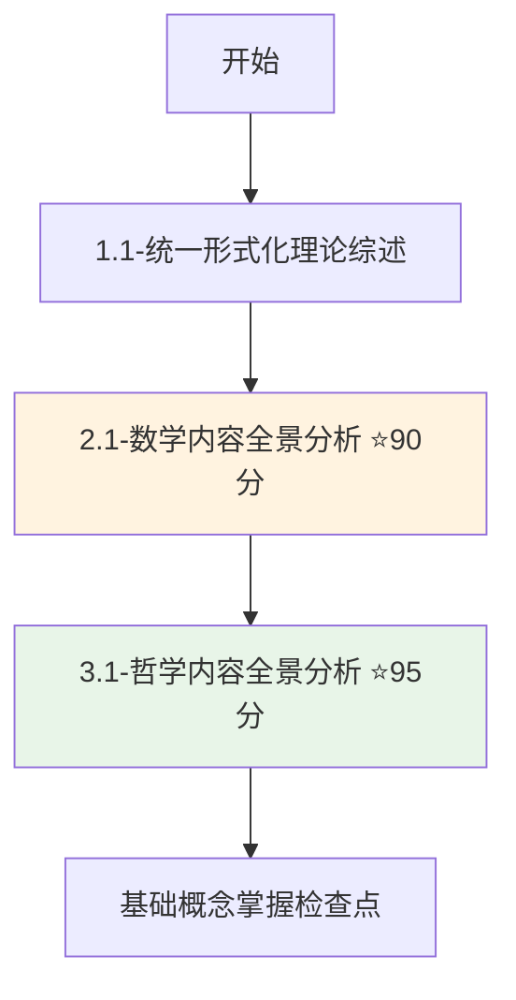
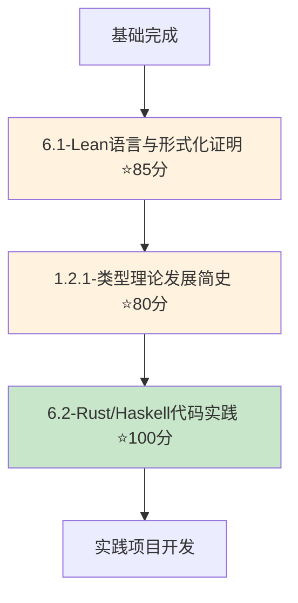
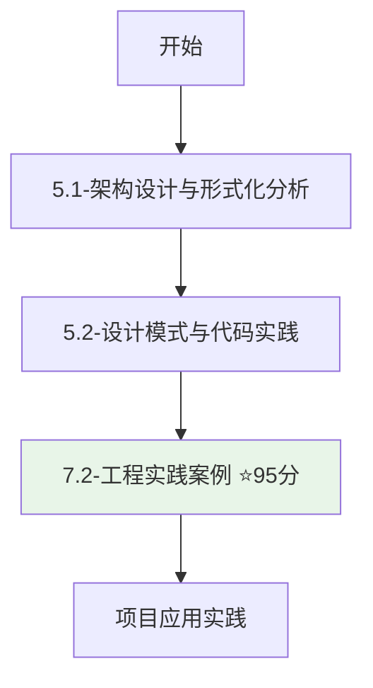
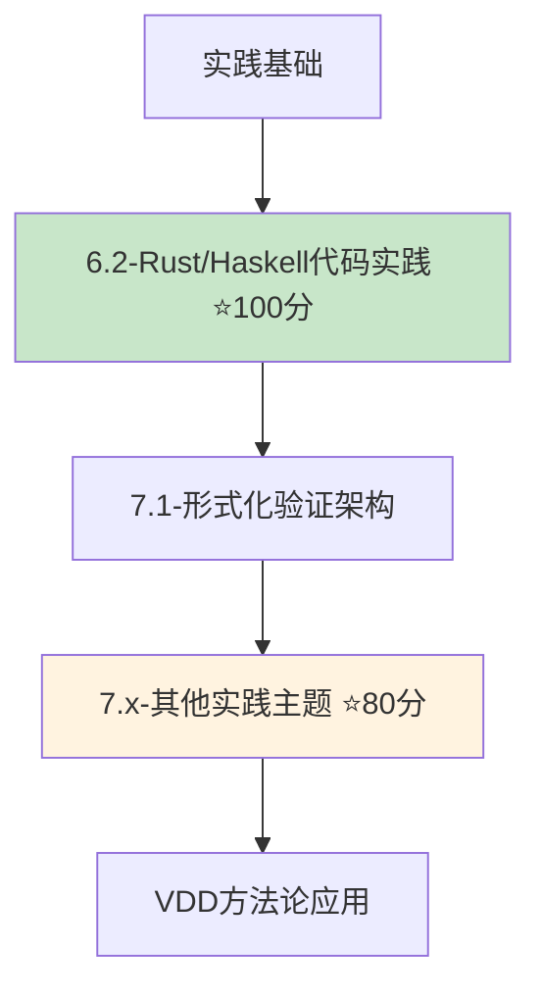
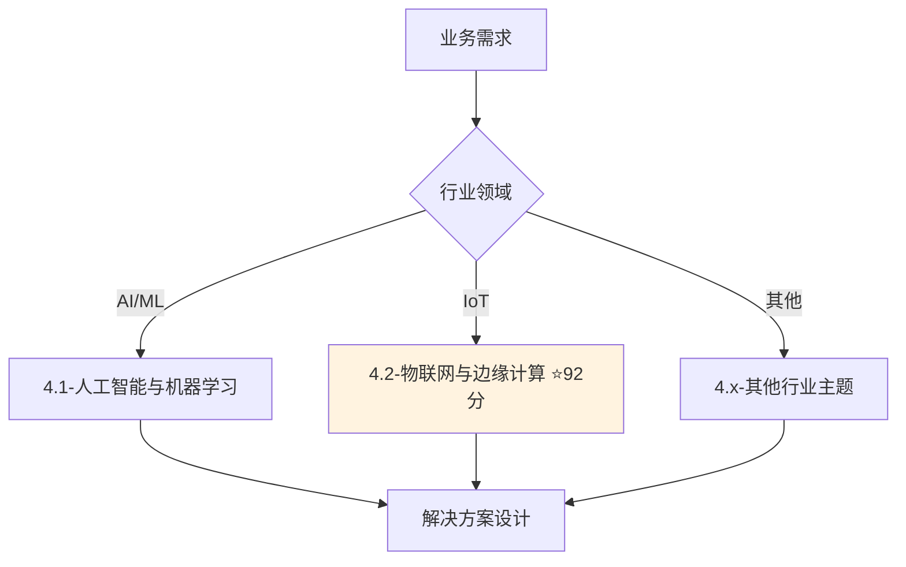
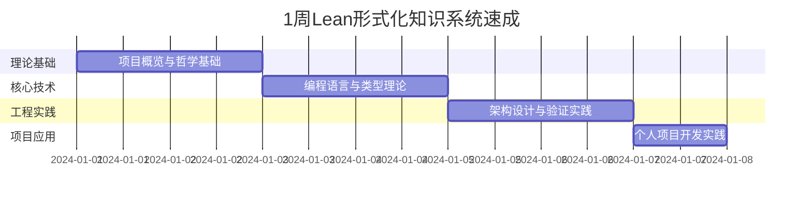
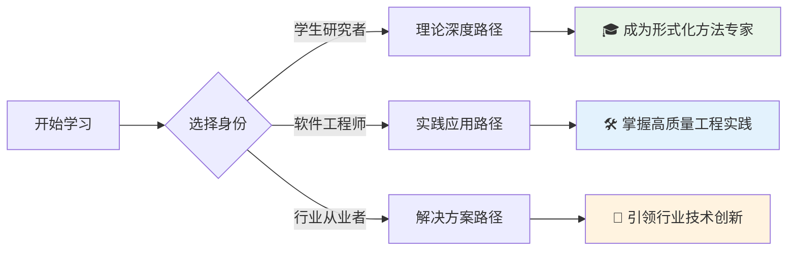

# 🚀 Lean形式化知识系统 - 快速入门指南

**欢迎使用世界级形式化知识平台！**

本指南将帮助您快速开始探索和使用Lean形式化知识系统的丰富内容。

---

## 🎯 5分钟快速导览

### 第一步：了解项目概况

1. 📖 阅读 **[项目成就展示](ACHIEVEMENTS_SHOWCASE.md)** - 了解项目亮点
2. 📊 查看 **[项目总结报告](PROJECT_SUMMARY.md)** - 掌握整体架构
3. 🗂️ 浏览 **[全局主题树形目录](0-总览与导航/0.1-全局主题树形目录.md)** - 熟悉内容结构

### 第二步：找到您的兴趣点



### 第三步：选择学习路径

- 🌟 **推荐优秀文档** (80+分): 直接学习最高质量内容
- 📚 **系列化学习**: 按照1-7大类系统学习
- 🔗 **交叉引用学习**: 利用文档间的关联进行深度探索

---

## 👥 根据角色定制的学习路径

### 🎓 学生与研究者路径

#### 🌱 入门阶段 (1-2周)



**学习重点**:

- 理解形式化方法的基本概念
- 掌握数学基础和哲学思想
- 建立系统性思维框架

#### 🌿 进阶阶段 (3-4周)



**学习重点**:

- 掌握Lean语言和类型理论
- 学习函数式编程实践
- 完成小型形式化项目

#### 🌳 专家阶段 (持续学习)

- 深入研究前沿理论
- 参与开源项目贡献
- 发表学术论文

### 👨‍💻 软件工程师路径

#### 🛠️ 实践优先 (1-2周)



**学习重点**:

- 理解形式化方法在工程中的应用
- 掌握设计模式的形式化验证
- 学习DevOps集成最佳实践

#### 🔧 深度提升 (3-4周)



**学习重点**:

- 掌握高质量代码实践
- 学习形式化验证架构
- 应用验证驱动开发(VDD)

### 🏢 行业从业者路径

#### 📈 解决方案导向 (1周)



**学习重点**:

- 了解行业特定的形式化应用
- 学习前沿技术的理论基础
- 制定技术栈决策方案

#### 🚀 技术深化 (2-3周)

- 结合具体项目需求深入学习
- 参考相关的工程实践案例
- 建立团队技术培训计划

---

## 🎯 按质量等级的学习策略

### 🏆 完美文档优先策略

从最高质量文档开始，确保学习效果：

#### 🌟 必读完美文档 (100分)

- **[6.2-rust_haskell代码实践.md](6-编程语言与实现/6.2-rust_haskell代码实践.md)**
  - 🎯 **学习目标**: 掌握现代编程语言设计理念
  - ⏰ **预计时间**: 3-4小时深度阅读
  - 🔧 **实践建议**: 运行所有代码示例

#### ⭐ 杰出文档 (95分)

1. **[3.1-哲学内容全景分析.md](3-哲学与科学原理/3.1-哲学内容全景分析.md)**
   - 🎯 建立哲学思维基础
   - ⏰ 2-3小时理论学习

2. **[7.2-工程实践案例.md](7-验证与工程实践/7.2-工程实践案例.md)**
   - 🎯 掌握DevOps集成实践
   - ⏰ 3-4小时实践学习

#### 🎖️ 优秀文档网络 (80+分)

按兴趣和需求选择：

- **数学基础**: [2.1-数学内容全景分析.md](2-数学基础与应用/2.1-数学内容全景分析.md) (90分)
- **IoT应用**: [4.2-物联网与边缘计算.md](4-行业领域分析/4.2-物联网与边缘计算.md) (92分)
- **Lean实践**: [6.1-lean语言与形式化证明.md](6-编程语言与实现/6.1-lean语言与形式化证明.md) (85分)

---

## 🔧 实用工具和资源

### 📊 质量监控工具

```bash
# 在analysis目录下运行质量检查
cd analysis
python tools/project_completeness_checker.py

# 查看详细质量报告
cat project_completeness_report.md
```

### 🔗 导航辅助工具

- **[交叉引用索引](cross-reference-index.md)** - 快速找到相关文档
- **[内容更新指南](content-update-guide.md)** - 了解质量标准
- **[全局主题树形目录](0-总览与导航/0.1-全局主题树形目录.md)** - 完整内容结构

### 💡 学习技巧

1. **利用交叉引用**: 跟随文档间的链接进行深度学习
2. **代码实践**: 运行和修改所有代码示例
3. **可视化理解**: 仔细研究Mermaid图表
4. **质量优先**: 优先学习高分文档
5. **循序渐进**: 从基础概念到高级应用

---

## 🚀 高效学习计划模板

### 📅 1周速成计划 (每天2小时)



### 📚 1月深度学习计划 (每天1小时)

- **第1周**: 理论基础 (形式化理论、数学基础、哲学原理)
- **第2周**: 编程实现 (Lean、Rust、Haskell)
- **第3周**: 工程实践 (架构设计、验证方法)
- **第4周**: 行业应用 (AI/ML、IoT、具体项目)

### 🎯 3月专家养成计划 (每天30分钟)

- **第1月**: 系统性学习所有核心文档
- **第2月**: 深入研究高质量文档和前沿技术
- **第3月**: 实际项目应用和社区贡献

---

## 💬 常见问题与解答

### ❓ 我没有数学基础，能学习吗？

✅ **可以！** 建议学习路径：

1. 先阅读 [3.1-哲学内容全景分析](3-哲学与科学原理/3.1-哲学内容全景分析.md) 建立思维框架
2. 再学习 [2.1-数学内容全景分析](2-数学基础与应用/2.1-数学内容全景分析.md) 补充数学基础
3. 重点关注实践部分，如 [6.2-代码实践](6-编程语言与实现/6.2-rust_haskell代码实践.md)

### ❓ 我是初学者，从哪里开始？

✅ **推荐路径**：

1. [项目成就展示](ACHIEVEMENTS_SHOWCASE.md) - 了解项目价值
2. [1.1-统一形式化理论综述](1-形式化理论/1.1-统一形式化理论综述.md) - 建立基础概念
3. 选择一个80+分的优秀文档深入学习

### ❓ 我想应用到实际项目中？

✅ **工程实践优先**：

1. [7.2-工程实践案例](7-验证与工程实践/7.2-工程实践案例.md) (95分) - DevOps集成
2. [5.1-架构设计](5-架构与设计模式/5.1-架构设计与形式化分析.md) - 系统设计
3. [4.x-行业应用](4-行业领域分析/) - 具体领域解决方案

### ❓ 如何跟上最新进展？

✅ **保持更新**：

1. 定期查看 [质量完整性报告](project_completeness_report.md)
2. 关注高质量文档的更新
3. 参与社区讨论和贡献

---

## 🎊 开始您的学习之旅

选择适合您的学习路径，开始探索这个世界级的形式化知识系统吧！



**记住**: 这是一个93.7%完成度、拥有9个世界级优秀文档的知识系统。您的每一分钟学习时间都将获得最高质量的回报！

**祝您学习愉快，收获满满！** 🌟

---

*最后更新: 2024年12月*  
*文档质量: 世界级标准*  
*适用对象: 所有形式化方法学习者*
