# Content Update Guide - 内容更新指南

**更新时间**: 2024年12月  
**项目质量等级**: 世界先进水平  
**当前状态**: 93.7%完成，9个优秀文档

## 🏆 质量管理新标准

### 📊 质量评分体系 (0-100分)

| 评分等级 | 分数范围 | 质量标准 | 维护优先级 |
|---------|----------|-----------|------------|
| **完美** | 100分 | 理论与实践完美结合 | 🌟 持续维护 |
| **杰出** | 95-99分 | 世界级质量标准 | ⭐ 高优先级 |
| **优秀** | 80-94分 | 国际先进水平 | 🎯 重点维护 |
| **良好** | 60-79分 | 实用价值较高 | 📈 提升目标 |
| **一般** | 30-59分 | 基础完整性 | 🔧 改进对象 |
| **待改进** | <30分 | 需要重构 | 🚨 紧急处理 |

### 🎯 质量提升路径

```mermaid
graph LR
    A[待改进 <30分] --> B[一般 30-59分]
    B --> C[良好 60-79分] 
    C --> D[优秀 80-94分]
    D --> E[杰出 95-99分]
    E --> F[完美 100分]
    
    style F fill:#c8e6c9
    style E fill:#e8f5e8
    style D fill:#fff3e0
```



### 🌟 完美文档维护标准

#### 6.2-rust_haskell代码实践.md (100分)

- **维护要求**: 每月review，确保代码可执行性
- **更新重点**: 跟踪最新语言特性，补充前沿应用
- **质量保证**: 所有代码示例通过CI/CD验证

#### 杰出文档维护标准 (95分)

- **3.1-哲学内容全景分析.md**: 跟踪哲学前沿发展
- **7.2-工程实践案例.md**: 更新最新DevOps最佳实践

### 🔧 质量评估自动化

#### Python质量检查工具

```python
def assess_document_quality(file_path):
    """自动质量评估"""
    score = 0
    
    # 内容深度 (0-30分)
    lines = count_content_lines(file_path)
    score += min(30, lines // 20)
    
    # 代码质量 (0-25分)  
    code_blocks = count_code_blocks(file_path)
    score += min(25, code_blocks * 2)
    
    # 数学严谨性 (0-20分)
    formulas = count_math_formulas(file_path)
    score += min(20, formulas * 2)
    
    # 可视化 (0-15分)
    diagrams = count_mermaid_diagrams(file_path)
    score += min(15, diagrams * 5)
    
    # 参考文献 (0-10分)
    references = count_references(file_path)
    score += min(10, references // 3)
    
    return min(100, score)
```

## 🚀 高质量内容更新流程

### 1. 新内容创建流程

#### 1.1 前期准备

- [ ] 确定目标质量等级(建议≥80分)
- [ ] 规划内容结构和深度
- [ ] 准备多语言代码示例
- [ ] 设计可视化图表方案

#### 1.2 内容开发

- [ ] 建立理论框架
- [ ] 实现代码示例(至少3个语言)
- [ ] 添加数学公式表达
- [ ] 创建架构图表
- [ ] 补充参考文献

#### 1.3 质量验证

- [ ] 运行质量评估工具
- [ ] 验证交叉引用完整性
- [ ] 检查代码可执行性
- [ ] 确认格式规范性

### 2. 现有内容提升流程

#### 2.1 质量诊断

```bash
# 运行质量检查
python tools/project_completeness_checker.py

# 识别改进点
grep -r "TODO\|FIXME\|XXX" analysis/
```

#### 2.2 针对性改进

- **<30分文档**: 重构内容，补充代码和公式
- **30-59分文档**: 增加深度，完善实例
- **60-79分文档**: 优化结构，增强实用性
- **80+分文档**: 精细调优，追求完美

### 3. 交叉引用优化

#### 3.1 高质量文档网络构建

```
完美文档 (100分) → 作为其他文档的标杆
     ↓
杰出文档 (95分) → 提供深度理论支撑  
     ↓
优秀文档 (80+分) → 构建主要知识骨架
     ↓
其他文档 → 补充和扩展内容
```

#### 3.2 智能引用推荐

```python
def recommend_cross_references(current_doc, all_docs):
    """基于内容相似度推荐交叉引用"""
    similarities = []
    for doc in all_docs:
        if doc != current_doc:
            sim = calculate_semantic_similarity(current_doc, doc)
            if sim > 0.3:  # 相似度阈值
                similarities.append((doc, sim))
    
    return sorted(similarities, key=lambda x: x[1], reverse=True)[:5]
```

## 💎 世界级标准实践指南

## 更新原则 Update Principles

### 1. 结构一致性 Structural Consistency

- 保持严格的编号体系
- 维护交叉引用完整性
- 遵循多重表达规范（LaTeX、代码、图表）

### 2. 内容质量标准 Content Quality Standards

- 学术严谨性
- 工程实用性
- 形式化表达准确性

### 3. 更新流程 Update Process

#### 3.1 新内容添加 Adding New Content

1. 确定主题归属（1-7大类）
2. 分配唯一编号
3. 创建交叉引用
4. 更新导航文件
5. 更新进度文档

#### 3.2 内容修改 Modifying Content

1. 保持编号不变
2. 更新相关交叉引用
3. 验证格式正确性
4. 更新修改记录

#### 3.3 内容删除 Removing Content

1. 标记为废弃（不直接删除）
2. 更新相关交叉引用
3. 记录删除原因

## 格式规范 Format Standards

### LaTeX 表达式

- 使用 `\[ ... \]` 块级公式
- 使用 `\( ... \)` 行内公式
- 确保数学符号正确

### 代码示例

- Lean: 使用 ```lean 代码块
- Rust: 使用 ```rust 代码块
- Haskell: 使用 ```haskell 代码块

### Mermaid 图表

- 使用 ```mermaid 代码块
- 保持图表简洁清晰

## 交叉引用规范 Cross Reference Standards

### 内部引用 Internal References

- 使用相对路径
- 包含章节编号
- 提供简短描述

### 外部引用 External References

- 使用标准学术格式
- 包含完整书目信息
- 按字母顺序排列

## 质量检查清单 Quality Checklist

- [ ] 编号体系正确
- [ ] 交叉引用完整
- [ ] LaTeX 语法正确
- [ ] 代码示例可运行
- [ ] 图表清晰
- [ ] 参考文献完整
- [ ] 格式一致

## 自动化工具建议 Automation Tools

### 1. 交叉引用检查

```bash
# 检查断开的交叉引用
grep -r "\[.*\]" . | grep -v "http" | while read line; do
  target=$(echo $line | sed 's/.*\[\([^]]*\)\].*/\1/')
  if [ ! -f "$target" ]; then
    echo "Broken reference: $line"
  fi
done
```

### 2. 编号检查

```bash
# 检查编号一致性
find . -name "*.md" | sort | while read file; do
  echo "Checking: $file"
  grep -n "^#" "$file"
done
```

### 3. LaTeX 语法检查

```bash
# 检查 LaTeX 语法
grep -r "\\\\\[" . | while read line; do
  echo "LaTeX block: $line"
done
```

## 版本控制 Version Control

### 提交规范 Commit Standards

- 使用清晰的提交信息
- 包含变更类型（新增/修改/删除）
- 关联相关文档编号

### 分支策略 Branch Strategy

- main: 稳定版本
- develop: 开发版本
- feature/*: 功能分支
- fix/*: 修复分支

## 持续集成建议 CI/CD Suggestions

### 1. 自动检查

- 交叉引用完整性
- 编号一致性
- 格式正确性

### 2. 自动构建

- 生成PDF版本
- 生成HTML版本
- 生成索引

### 3. 自动部署

- 更新在线文档
- 发送通知
- 备份版本
