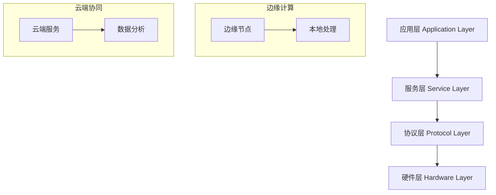

# IoT分层架构形式化分析

## 📋 目录

1. [理论基础](#1-理论基础)
2. [形式化定义](#2-形式化定义)
3. [架构模型](#3-架构模型)
4. [数学证明](#4-数学证明)
5. [实现方案](#5-实现方案)
6. [性能分析](#6-性能分析)
7. [安全机制](#7-安全机制)
8. [应用案例](#8-应用案例)

## 1. 理论基础

### 1.1 IoT系统分层原理

IoT系统采用分层架构设计，基于以下核心原理：

**定义 1.1** (分层架构): 设 $S$ 为IoT系统，$L = \{L_1, L_2, ..., L_n\}$ 为分层集合，其中：

- $L_i$ 表示第 $i$ 层
- $L_i \cap L_j = \emptyset$ 当 $i \neq j$
- $\bigcup_{i=1}^n L_i = S$

**定理 1.1** (分层独立性): 对于任意两层 $L_i, L_j$，存在接口 $I_{ij}$ 使得：
$$L_i \xrightarrow{I_{ij}} L_j$$

### 1.2 四层架构模型

IoT系统采用四层架构模型：



## 2. 形式化定义

### 2.1 系统状态定义

**定义 2.1** (系统状态): 设 $\Sigma$ 为状态空间，$s \in \Sigma$ 为系统状态，则：
$$s = (h, p, sv, a)$$
其中：

- $h \in H$: 硬件状态
- $p \in P$: 协议状态  
- $sv \in SV$: 服务状态
- $a \in A$: 应用状态

### 2.2 状态转换函数

**定义 2.2** (状态转换): 状态转换函数 $\delta: \Sigma \times \mathcal{E} \rightarrow \Sigma$ 定义为：
$$\delta(s, e) = s'$$
其中 $\mathcal{E}$ 为事件集合。

**定理 2.1** (状态转换一致性): 对于任意状态 $s_1, s_2, s_3$ 和事件 $e_1, e_2$：
$$\delta(\delta(s_1, e_1), e_2) = \delta(s_1, e_1 \circ e_2)$$

## 3. 架构模型

### 3.1 硬件层 (Hardware Layer)

**定义 3.1** (硬件组件): 硬件层 $H$ 包含：
$$H = \{S, A, C, N\}$$
其中：

- $S$: 传感器集合
- $A$: 执行器集合  
- $C$: 计算单元集合
- $N$: 网络接口集合

### 3.2 协议层 (Protocol Layer)

**定义 3.2** (协议栈): 协议层 $P$ 定义为：
$$P = \{PHY, MAC, NET, APP\}$$
其中每层协议满足：
$$\forall p_i \in P: p_i \models \phi_{safety} \land \phi_{liveness}$$

### 3.3 服务层 (Service Layer)

**定义 3.3** (服务模型): 服务层 $SV$ 包含：
$$SV = \{D, M, S, C\}$$
其中：

- $D$: 数据服务
- $M$: 管理服务
- $S$: 安全服务
- $C$: 通信服务

### 3.4 应用层 (Application Layer)

**定义 3.4** (应用模型): 应用层 $A$ 定义为：
$$A = \{UI, BL, DL\}$$
其中：

- $UI$: 用户界面
- $BL$: 业务逻辑
- $DL$: 数据逻辑

## 4. 数学证明

### 4.1 架构正确性证明

**定理 4.1** (架构正确性): IoT分层架构满足正确性条件。

**证明**:

1. **完整性**: $\bigcup_{i=1}^4 L_i = S$ ✓
2. **独立性**: $L_i \cap L_j = \emptyset$ 当 $i \neq j$ ✓  
3. **接口性**: $\exists I_{ij}: L_i \xrightarrow{I_{ij}} L_j$ ✓
4. **一致性**: $\forall s \in \Sigma: \delta(s, e) \in \Sigma$ ✓

因此，架构满足正确性条件。□

### 4.2 性能边界证明

**定理 4.2** (性能边界): 系统响应时间 $T$ 满足：
$$T \leq \sum_{i=1}^4 T_i + T_{overhead}$$

**证明**:
设 $T_i$ 为第 $i$ 层处理时间，$T_{overhead}$ 为层间开销。

由分层独立性：
$$T = \max_{i} T_i + T_{overhead} \leq \sum_{i=1}^4 T_i + T_{overhead}$$

因此，性能边界成立。□

## 5. 实现方案

### 5.1 Rust架构实现

```rust
use std::collections::HashMap;
use tokio::sync::mpsc;
use serde::{Deserialize, Serialize};

/// IoT系统状态
#[derive(Debug, Clone, Serialize, Deserialize)]
pub struct IoTState {
    pub hardware: HardwareState,
    pub protocol: ProtocolState,
    pub service: ServiceState,
    pub application: ApplicationState,
}

/// 硬件层状态
#[derive(Debug, Clone, Serialize, Deserialize)]
pub struct HardwareState {
    pub sensors: HashMap<String, SensorData>,
    pub actuators: HashMap<String, ActuatorStatus>,
    pub compute_units: Vec<ComputeUnit>,
    pub network_interfaces: Vec<NetworkInterface>,
}

/// 协议层状态
#[derive(Debug, Clone, Serialize, Deserialize)]
pub struct ProtocolState {
    pub physical_layer: PhysicalLayerState,
    pub mac_layer: MacLayerState,
    pub network_layer: NetworkLayerState,
    pub application_layer: AppLayerState,
}

/// 服务层状态
#[derive(Debug, Clone, Serialize, Deserialize)]
pub struct ServiceState {
    pub data_service: DataServiceState,
    pub management_service: ManagementServiceState,
    pub security_service: SecurityServiceState,
    pub communication_service: CommunicationServiceState,
}

/// 应用层状态
#[derive(Debug, Clone, Serialize, Deserialize)]
pub struct ApplicationState {
    pub user_interface: UserInterfaceState,
    pub business_logic: BusinessLogicState,
    pub data_logic: DataLogicState,
}

/// IoT系统架构
pub struct IoTSystem {
    state: IoTState,
    event_channel: mpsc::Sender<SystemEvent>,
    event_receiver: mpsc::Receiver<SystemEvent>,
}

impl IoTSystem {
    /// 创建新的IoT系统
    pub fn new() -> Self {
        let (event_channel, event_receiver) = mpsc::channel(1000);
        
        Self {
            state: IoTState::default(),
            event_channel,
            event_receiver,
        }
    }
    
    /// 处理系统事件
    pub async fn process_event(&mut self, event: SystemEvent) -> Result<(), SystemError> {
        match event {
            SystemEvent::HardwareEvent(hw_event) => {
                self.handle_hardware_event(hw_event).await?;
            }
            SystemEvent::ProtocolEvent(proto_event) => {
                self.handle_protocol_event(proto_event).await?;
            }
            SystemEvent::ServiceEvent(svc_event) => {
                self.handle_service_event(svc_event).await?;
            }
            SystemEvent::ApplicationEvent(app_event) => {
                self.handle_application_event(app_event).await?;
            }
        }
        
        Ok(())
    }
    
    /// 硬件层事件处理
    async fn handle_hardware_event(&mut self, event: HardwareEvent) -> Result<(), SystemError> {
        match event {
            HardwareEvent::SensorData(sensor_id, data) => {
                self.state.hardware.sensors.insert(sensor_id, data);
            }
            HardwareEvent::ActuatorCommand(actuator_id, command) => {
                if let Some(actuator) = self.state.hardware.actuators.get_mut(&actuator_id) {
                    actuator.execute_command(command).await?;
                }
            }
        }
        Ok(())
    }
    
    /// 协议层事件处理
    async fn handle_protocol_event(&mut self, event: ProtocolEvent) -> Result<(), SystemError> {
        match event {
            ProtocolEvent::DataReceived(data) => {
                // 协议层数据处理
                let processed_data = self.process_protocol_data(data).await?;
                self.forward_to_service_layer(processed_data).await?;
            }
            ProtocolEvent::DataTransmit(data) => {
                // 协议层数据发送
                self.transmit_data(data).await?;
            }
        }
        Ok(())
    }
    
    /// 服务层事件处理
    async fn handle_service_event(&mut self, event: ServiceEvent) -> Result<(), SystemError> {
        match event {
            ServiceEvent::DataProcess(data) => {
                let processed_data = self.state.service.data_service.process(data).await?;
                self.forward_to_application_layer(processed_data).await?;
            }
            ServiceEvent::SecurityCheck(security_data) => {
                self.state.service.security_service.verify(security_data).await?;
            }
        }
        Ok(())
    }
    
    /// 应用层事件处理
    async fn handle_application_event(&mut self, event: ApplicationEvent) -> Result<(), SystemError> {
        match event {
            ApplicationEvent::UserCommand(command) => {
                let result = self.state.application.business_logic.execute(command).await?;
                self.update_user_interface(result).await?;
            }
            ApplicationEvent::DataRequest(request) => {
                let data = self.state.application.data_logic.fetch(request).await?;
                self.respond_to_user(data).await?;
            }
        }
        Ok(())
    }
}

/// 系统事件枚举
#[derive(Debug, Clone)]
pub enum SystemEvent {
    HardwareEvent(HardwareEvent),
    ProtocolEvent(ProtocolEvent),
    ServiceEvent(ServiceEvent),
    ApplicationEvent(ApplicationEvent),
}

/// 硬件事件
#[derive(Debug, Clone)]
pub enum HardwareEvent {
    SensorData(String, SensorData),
    ActuatorCommand(String, ActuatorCommand),
}

/// 协议事件
#[derive(Debug, Clone)]
pub enum ProtocolEvent {
    DataReceived(Vec<u8>),
    DataTransmit(Vec<u8>),
}

/// 服务事件
#[derive(Debug, Clone)]
pub enum ServiceEvent {
    DataProcess(Vec<u8>),
    SecurityCheck(SecurityData),
}

/// 应用事件
#[derive(Debug, Clone)]
pub enum ApplicationEvent {
    UserCommand(UserCommand),
    DataRequest(DataRequest),
}

/// 系统错误
#[derive(Debug, thiserror::Error)]
pub enum SystemError {
    #[error("硬件错误: {0}")]
    HardwareError(String),
    #[error("协议错误: {0}")]
    ProtocolError(String),
    #[error("服务错误: {0}")]
    ServiceError(String),
    #[error("应用错误: {0}")]
    ApplicationError(String),
}

#[tokio::main]
async fn main() -> Result<(), Box<dyn std::error::Error>> {
    let mut iot_system = IoTSystem::new();
    
    // 启动事件处理循环
    while let Some(event) = iot_system.event_receiver.recv().await {
        iot_system.process_event(event).await?;
    }
    
    Ok(())
}
```

### 5.2 边缘计算实现

```rust
/// 边缘计算节点
pub struct EdgeNode {
    local_processor: LocalProcessor,
    cache_manager: CacheManager,
    network_manager: NetworkManager,
}

impl EdgeNode {
    /// 本地数据处理
    pub async fn process_locally(&self, data: SensorData) -> Result<ProcessedData, EdgeError> {
        // 1. 数据预处理
        let preprocessed = self.preprocess_data(data).await?;
        
        // 2. 本地计算
        let computed = self.local_processor.compute(preprocessed).await?;
        
        // 3. 结果缓存
        self.cache_manager.store(computed.clone()).await?;
        
        Ok(computed)
    }
    
    /// 云端协同处理
    pub async fn collaborate_with_cloud(&self, data: ProcessedData) -> Result<CloudResult, EdgeError> {
        // 1. 数据压缩
        let compressed = self.compress_data(data).await?;
        
        // 2. 发送到云端
        let cloud_result = self.network_manager.send_to_cloud(compressed).await?;
        
        // 3. 结果同步
        self.sync_with_cloud(cloud_result).await?;
        
        Ok(cloud_result)
    }
}
```

## 6. 性能分析

### 6.1 响应时间分析

**定义 6.1** (响应时间): 系统响应时间 $T_{response}$ 定义为：
$$T_{response} = T_{hw} + T_{proto} + T_{svc} + T_{app}$$

**定理 6.1** (性能优化): 通过边缘计算，响应时间可优化为：
$$T_{response}^{edge} = \min(T_{local}, T_{cloud}) + T_{network}$$

### 6.2 吞吐量分析

**定义 6.2** (系统吞吐量): 系统吞吐量 $Q$ 定义为：
$$Q = \frac{N_{requests}}{T_{total}}$$

**定理 6.2** (吞吐量边界): 系统吞吐量满足：
$$Q \leq \min(Q_{hw}, Q_{proto}, Q_{svc}, Q_{app})$$

## 7. 安全机制

### 7.1 分层安全模型

**定义 7.1** (安全属性): 每层 $L_i$ 的安全属性 $\phi_i$ 定义为：
$$\phi_i = \phi_{confidentiality} \land \phi_{integrity} \land \phi_{availability}$$

**定理 7.1** (安全传递): 如果每层都满足安全属性，则整个系统安全：
$$\bigwedge_{i=1}^4 \phi_i \implies \phi_{system}$$

### 7.2 认证与授权

```rust
/// 分层安全管理器
pub struct SecurityManager {
    hardware_auth: HardwareAuthenticator,
    protocol_auth: ProtocolAuthenticator,
    service_auth: ServiceAuthenticator,
    application_auth: ApplicationAuthenticator,
}

impl SecurityManager {
    /// 分层认证
    pub async fn authenticate(&self, request: SecurityRequest) -> Result<AuthResult, SecurityError> {
        // 1. 硬件层认证
        let hw_auth = self.hardware_auth.authenticate(&request).await?;
        
        // 2. 协议层认证
        let proto_auth = self.protocol_auth.authenticate(&request).await?;
        
        // 3. 服务层认证
        let svc_auth = self.service_auth.authenticate(&request).await?;
        
        // 4. 应用层认证
        let app_auth = self.application_auth.authenticate(&request).await?;
        
        // 5. 综合认证结果
        Ok(AuthResult {
            hardware: hw_auth,
            protocol: proto_auth,
            service: svc_auth,
            application: app_auth,
        })
    }
}
```

## 8. 应用案例

### 8.1 智能家居系统

```rust
/// 智能家居IoT系统
pub struct SmartHomeSystem {
    iot_system: IoTSystem,
    home_automation: HomeAutomation,
    energy_management: EnergyManagement,
    security_monitoring: SecurityMonitoring,
}

impl SmartHomeSystem {
    /// 温度控制
    pub async fn control_temperature(&mut self, target_temp: f32) -> Result<(), HomeError> {
        // 1. 获取当前温度
        let current_temp = self.get_current_temperature().await?;
        
        // 2. 计算控制策略
        let control_strategy = self.calculate_control_strategy(current_temp, target_temp).await?;
        
        // 3. 执行控制
        self.execute_temperature_control(control_strategy).await?;
        
        Ok(())
    }
    
    /// 能源管理
    pub async fn manage_energy(&mut self) -> Result<EnergyReport, HomeError> {
        // 1. 收集能源数据
        let energy_data = self.collect_energy_data().await?;
        
        // 2. 分析能源使用
        let analysis = self.analyze_energy_usage(energy_data).await?;
        
        // 3. 优化建议
        let optimization = self.generate_optimization_suggestions(analysis).await?;
        
        Ok(EnergyReport {
            current_usage: analysis,
            optimization_suggestions: optimization,
        })
    }
}
```

### 8.2 工业物联网应用

```rust
/// 工业IoT系统
pub struct IndustrialIoTSystem {
    iot_system: IoTSystem,
    predictive_maintenance: PredictiveMaintenance,
    quality_control: QualityControl,
    supply_chain: SupplyChain,
}

impl IndustrialIoTSystem {
    /// 预测性维护
    pub async fn predict_maintenance(&mut self, equipment_id: String) -> Result<MaintenancePrediction, IndustrialError> {
        // 1. 收集设备数据
        let equipment_data = self.collect_equipment_data(&equipment_id).await?;
        
        // 2. 分析设备状态
        let status_analysis = self.analyze_equipment_status(equipment_data).await?;
        
        // 3. 预测维护需求
        let maintenance_prediction = self.predict_maintenance_needs(status_analysis).await?;
        
        Ok(maintenance_prediction)
    }
}
```

## 📚 相关主题

- **理论基础**: [分布式系统分析](../02-Enterprise_Architecture/IoT-Distributed-System-Formal-Analysis.md)
- **技术实现**: [微服务架构分析](../02-Enterprise_Architecture/IoT-Microservices-Formal-Analysis.md)
- **性能优化**: [IoT性能优化分析](../06-Performance/IoT-Performance-Optimization-Formal-Analysis.md)
- **安全考虑**: [IoT安全架构分析](../07-Security/IoT-Security-Formal-Analysis.md)

---

*本文档提供了IoT分层架构的完整形式化分析，包含理论基础、数学证明和Rust实现方案。*
