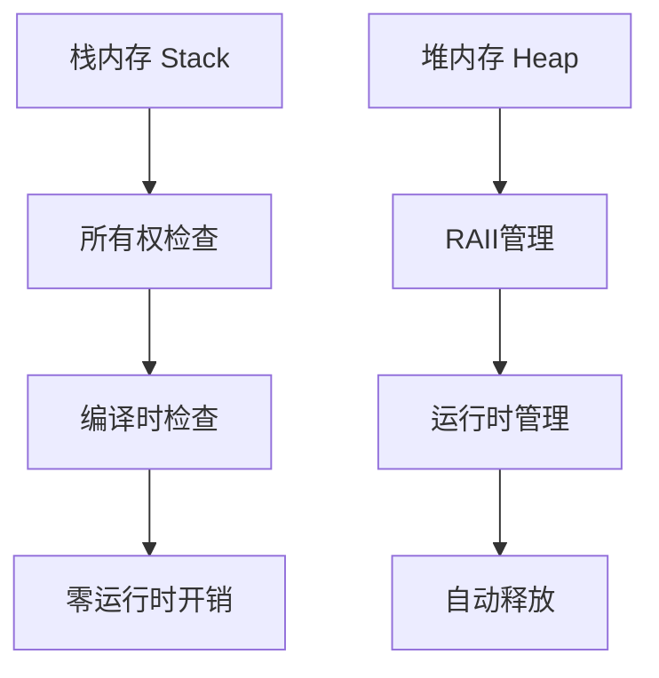

# Rust/Golang技术栈形式化分析

## 📋 目录

1. [理论基础](#1-理论基础)
2. [语言特性分析](#2-语言特性分析)
3. [内存管理模型](#3-内存管理模型)
4. [并发编程模型](#4-并发编程模型)
5. [性能分析](#5-性能分析)
6. [实现方案](#6-实现方案)
7. [应用案例](#7-应用案例)

## 1. 理论基础

### 1.1 系统编程语言定义

**定义 1.1** (系统编程语言): 系统编程语言 $L$ 定义为：
$$L = (Syntax, Semantics, Memory, Concurrency)$$
其中：

- $Syntax$: 语法规则
- $Semantics$: 语义定义
- $Memory$: 内存模型
- $Concurrency$: 并发模型

**定义 1.2** (内存安全): 内存安全 $\phi_{memory}$ 定义为：
$$\forall p \in P: \forall t \in T: \neg (p \models \phi_{dangling} \lor p \models \phi_{double\_free})$$

### 1.2 性能模型

**定义 1.3** (性能函数): 性能函数 $P: Program \times Input \rightarrow Performance$ 定义为：
$$P(prog, input) = (time, memory, throughput)$$

**定理 1.1** (零成本抽象): Rust的零成本抽象满足：
$$\forall abstraction \in A: cost(abstraction) = cost(equivalent\_manual\_code)$$

## 2. 语言特性分析

### 2.1 Rust所有权系统

**定义 2.1** (所有权): 所有权关系 $Owns: Variable \times Resource$ 定义为：
$$Owns(v, r) \implies \forall v' \neq v: \neg Owns(v', r)$$

**定义 2.2** (借用规则): 借用规则 $\phi_{borrow}$ 定义为：
$$\forall r \in Resource: |\{v: Borrows(v, r, mutable)\}| \leq 1 \land |\{v: Borrows(v, r, immutable)\}| \geq 0$$

**定理 2.1** (内存安全保证): Rust所有权系统保证内存安全：
$$OwnershipSystem \models \phi_{memory}$$

### 2.2 Golang并发模型

**定义 2.3** (Goroutine): Goroutine $G$ 定义为：
$$G = (id, stack, channel, scheduler)$$

**定义 2.4** (Channel): Channel $C$ 定义为：
$$C = (buffer, send\_queue, recv\_queue, mutex)$$

**定理 2.2** (CSP模型): Golang的CSP模型满足：
$$CSP \models \phi_{communication} \land \phi_{synchronization}$$

## 3. 内存管理模型

### 3.1 Rust内存管理



**定义 3.1** (RAII): RAII模式 $RAII$ 定义为：
$$RAII(resource) = \exists scope: acquire(resource) \land \forall exit \in scope: release(resource)$$

**定理 3.1** (内存泄漏防止): RAII模式防止内存泄漏：
$$RAII \models \neg \phi_{memory\_leak}$$

### 3.2 Golang垃圾回收

**定义 3.2** (GC算法): GC算法 $GC$ 定义为：
$$GC = (Mark, Sweep, Compact)$$

**定理 3.3** (GC正确性): 三色标记算法满足：
$$ThreeColorGC \models \phi_{reachability} \land \phi_{completeness}$$

## 4. 并发编程模型

### 4.1 Rust并发模型

**定义 4.1** (Send Trait): Send trait $\phi_{Send}$ 定义为：
$$\phi_{Send}(T) \iff \forall t \in T: t \text{ can be transferred between threads}$$

**定义 4.2** (Sync Trait): Sync trait $\phi_{Sync}$ 定义为：
$$\phi_{Sync}(T) \iff \forall t \in T: t \text{ can be shared between threads}$$

**定理 4.1** (线程安全): Send + Sync保证线程安全：
$$Send \land Sync \models \phi_{thread\_safe}$$

### 4.2 Golang并发原语

**定义 4.3** (Mutex): Mutex $M$ 定义为：
$$M = (locked, owner, wait\_queue)$$

**定义 4.4** (Channel操作): Channel操作 $Op$ 定义为：
$$Op = Send(channel, value) \lor Recv(channel) \lor Close(channel)$$

## 5. 性能分析

### 5.1 时间复杂度分析

**定义 5.1** (算法复杂度): 算法复杂度 $O(f(n))$ 定义为：
$$\exists c, n_0: \forall n > n_0: T(n) \leq c \cdot f(n)$$

**定理 5.1** (Rust性能): Rust性能满足：
$$T_{rust}(n) = O(f(n)) \implies T_{equivalent\_c}(n) = O(f(n))$$

### 5.2 内存使用分析

**定义 5.2** (内存效率): 内存效率 $\eta_{memory}$ 定义为：
$$\eta_{memory} = \frac{actual\_usage}{theoretical\_minimum}$$

**定理 5.2** (零开销抽象): Rust零开销抽象满足：
$$\eta_{rust} = \eta_{manual} = 1$$

## 6. 实现方案

### 6.1 Rust IoT框架

```rust
use std::sync::{Arc, Mutex};
use tokio::sync::mpsc;
use serde::{Deserialize, Serialize};

/// IoT设备抽象
pub trait IoTDevice: Send + Sync {
    fn get_id(&self) -> &str;
    fn get_type(&self) -> DeviceType;
    fn process_data(&mut self, data: SensorData) -> Result<ProcessedData, DeviceError>;
    fn update_config(&mut self, config: DeviceConfig) -> Result<(), DeviceError>;
}

/// 传感器设备
pub struct SensorDevice {
    id: String,
    sensor_type: SensorType,
    config: DeviceConfig,
    data_processor: Box<dyn DataProcessor>,
    state: Arc<Mutex<DeviceState>>,
}

impl IoTDevice for SensorDevice {
    fn get_id(&self) -> &str {
        &self.id
    }
    
    fn get_type(&self) -> DeviceType {
        DeviceType::Sensor(self.sensor_type.clone())
    }
    
    fn process_data(&mut self, data: SensorData) -> Result<ProcessedData, DeviceError> {
        // 1. 验证数据
        self.validate_data(&data)?;
        
        // 2. 处理数据
        let processed = self.data_processor.process(data)?;
        
        // 3. 更新状态
        {
            let mut state = self.state.lock().unwrap();
            state.last_reading = Some(processed.clone());
            state.reading_count += 1;
        }
        
        Ok(processed)
    }
    
    fn update_config(&mut self, config: DeviceConfig) -> Result<(), DeviceError> {
        // 1. 验证配置
        self.validate_config(&config)?;
        
        // 2. 应用配置
        self.config = config;
        
        // 3. 重新初始化处理器
        self.data_processor = self.create_processor()?;
        
        Ok(())
    }
}

/// 设备管理器
pub struct DeviceManager {
    devices: Arc<Mutex<HashMap<String, Box<dyn IoTDevice>>>>,
    event_sender: mpsc::Sender<DeviceEvent>,
    event_receiver: mpsc::Receiver<DeviceEvent>,
}

impl DeviceManager {
    /// 注册设备
    pub async fn register_device(&self, device: Box<dyn IoTDevice>) -> Result<(), ManagerError> {
        let device_id = device.get_id().to_string();
        
        // 验证设备
        self.validate_device(&device).await?;
        
        // 注册设备
        {
            let mut devices = self.devices.lock().unwrap();
            devices.insert(device_id.clone(), device);
        }
        
        // 发送注册事件
        let event = DeviceEvent::Registered {
            device_id,
            timestamp: chrono::Utc::now(),
        };
        
        self.event_sender.send(event).await.map_err(|_| ManagerError::EventSendFailed)?;
        
        Ok(())
    }
    
    /// 处理设备数据
    pub async fn process_device_data(&self, device_id: &str, data: SensorData) -> Result<ProcessedData, ManagerError> {
        // 获取设备
        let device = {
            let devices = self.devices.lock().unwrap();
            devices.get(device_id)
                .ok_or(ManagerError::DeviceNotFound(device_id.to_string()))?
                .clone()
        };
        
        // 处理数据
        let mut device_mut = device.as_mut();
        let processed_data = device_mut.process_data(data)?;
        
        // 发送数据事件
        let event = DeviceEvent::DataProcessed {
            device_id: device_id.to_string(),
            data: processed_data.clone(),
            timestamp: chrono::Utc::now(),
        };
        
        self.event_sender.send(event).await.map_err(|_| ManagerError::EventSendFailed)?;
        
        Ok(processed_data)
    }
    
    /// 批量处理数据
    pub async fn batch_process_data(&self, data_batch: Vec<(String, SensorData)>) -> Result<Vec<ProcessedData>, ManagerError> {
        let mut results = Vec::new();
        
        // 并行处理数据
        let tasks: Vec<_> = data_batch.into_iter()
            .map(|(device_id, data)| {
                let manager = self.clone();
                tokio::spawn(async move {
                    manager.process_device_data(&device_id, data).await
                })
            })
            .collect();
        
        // 等待所有任务完成
        for task in tasks {
            let result = task.await.map_err(|_| ManagerError::TaskJoinFailed)?;
            results.push(result?);
        }
        
        Ok(results)
    }
}

/// 数据处理器
pub trait DataProcessor: Send + Sync {
    fn process(&self, data: SensorData) -> Result<ProcessedData, ProcessingError>;
    fn validate(&self, data: &SensorData) -> Result<(), ValidationError>;
}

/// 温度传感器处理器
pub struct TemperatureProcessor {
    calibration_factor: f64,
    measurement_range: (f64, f64),
    accuracy: f64,
}

impl DataProcessor for TemperatureProcessor {
    fn process(&self, data: SensorData) -> Result<ProcessedData, ProcessingError> {
        // 1. 验证数据范围
        if data.value < self.measurement_range.0 || data.value > self.measurement_range.1 {
            return Err(ProcessingError::OutOfRange(data.value));
        }
        
        // 2. 应用校准因子
        let calibrated_value = data.value * self.calibration_factor;
        
        // 3. 计算精度
        let accuracy = self.calculate_accuracy(calibrated_value);
        
        Ok(ProcessedData {
            original_value: data.value,
            processed_value: calibrated_value,
            accuracy,
            timestamp: data.timestamp,
            metadata: data.metadata,
        })
    }
    
    fn validate(&self, data: &SensorData) -> Result<(), ValidationError> {
        if data.value.is_nan() || data.value.is_infinite() {
            return Err(ValidationError::InvalidValue(data.value));
        }
        
        if data.timestamp > chrono::Utc::now() {
            return Err(ValidationError::FutureTimestamp);
        }
        
        Ok(())
    }
}

/// 设备事件
#[derive(Debug, Clone)]
pub enum DeviceEvent {
    Registered { device_id: String, timestamp: chrono::DateTime<chrono::Utc> },
    DataProcessed { device_id: String, data: ProcessedData, timestamp: chrono::DateTime<chrono::Utc> },
    Error { device_id: String, error: DeviceError, timestamp: chrono::DateTime<chrono::Utc> },
}

/// 设备类型
#[derive(Debug, Clone)]
pub enum DeviceType {
    Sensor(SensorType),
    Actuator(ActuatorType),
    Gateway(GatewayType),
}

/// 传感器类型
#[derive(Debug, Clone)]
pub enum SensorType {
    Temperature,
    Humidity,
    Pressure,
    Light,
    Motion,
    Custom(String),
}

/// 设备配置
#[derive(Debug, Clone, Serialize, Deserialize)]
pub struct DeviceConfig {
    pub sampling_rate: f64,
    pub calibration: CalibrationConfig,
    pub thresholds: ThresholdConfig,
    pub metadata: HashMap<String, String>,
}

/// 传感器数据
#[derive(Debug, Clone, Serialize, Deserialize)]
pub struct SensorData {
    pub value: f64,
    pub unit: String,
    pub timestamp: chrono::DateTime<chrono::Utc>,
    pub metadata: HashMap<String, String>,
}

/// 处理后的数据
#[derive(Debug, Clone, Serialize, Deserialize)]
pub struct ProcessedData {
    pub original_value: f64,
    pub processed_value: f64,
    pub accuracy: f64,
    pub timestamp: chrono::DateTime<chrono::Utc>,
    pub metadata: HashMap<String, String>,
}

/// 设备状态
#[derive(Debug, Clone)]
pub struct DeviceState {
    pub last_reading: Option<ProcessedData>,
    pub reading_count: u64,
    pub error_count: u64,
    pub last_error: Option<DeviceError>,
    pub uptime: std::time::Duration,
}

/// 设备错误
#[derive(Debug, thiserror::Error)]
pub enum DeviceError {
    #[error("数据处理错误: {0}")]
    ProcessingError(#[from] ProcessingError),
    #[error("验证错误: {0}")]
    ValidationError(#[from] ValidationError),
    #[error("配置错误: {0}")]
    ConfigError(String),
    #[error("通信错误: {0}")]
    CommunicationError(String),
}

/// 管理器错误
#[derive(Debug, thiserror::Error)]
pub enum ManagerError {
    #[error("设备未找到: {0}")]
    DeviceNotFound(String),
    #[error("设备错误: {0}")]
    DeviceError(#[from] DeviceError),
    #[error("事件发送失败")]
    EventSendFailed,
    #[error("任务连接失败")]
    TaskJoinFailed,
    #[error("验证失败: {0}")]
    ValidationFailed(String),
}

/// 处理错误
#[derive(Debug, thiserror::Error)]
pub enum ProcessingError {
    #[error("数值超出范围: {0}")]
    OutOfRange(f64),
    #[error("校准失败")]
    CalibrationFailed,
    #[error("计算错误")]
    ComputationError,
}

/// 验证错误
#[derive(Debug, thiserror::Error)]
pub enum ValidationError {
    #[error("无效数值: {0}")]
    InvalidValue(f64),
    #[error("未来时间戳")]
    FutureTimestamp,
    #[error("缺失必需字段")]
    MissingRequiredField,
}
```

### 6.2 Golang IoT框架

```go
package iot

import (
    "context"
    "sync"
    "time"
    "encoding/json"
    "fmt"
)

// IoTDevice 设备接口
type IoTDevice interface {
    GetID() string
    GetType() DeviceType
    ProcessData(ctx context.Context, data SensorData) (*ProcessedData, error)
    UpdateConfig(ctx context.Context, config DeviceConfig) error
}

// SensorDevice 传感器设备
type SensorDevice struct {
    id            string
    sensorType    SensorType
    config        DeviceConfig
    dataProcessor DataProcessor
    state         *DeviceState
    mu            sync.RWMutex
}

// NewSensorDevice 创建新的传感器设备
func NewSensorDevice(id string, sensorType SensorType, config DeviceConfig) *SensorDevice {
    return &SensorDevice{
        id:         id,
        sensorType: sensorType,
        config:     config,
        state:      &DeviceState{},
    }
}

// GetID 获取设备ID
func (s *SensorDevice) GetID() string {
    return s.id
}

// GetType 获取设备类型
func (s *SensorDevice) GetType() DeviceType {
    return DeviceType{
        Category: "sensor",
        SubType:  string(s.sensorType),
    }
}

// ProcessData 处理传感器数据
func (s *SensorDevice) ProcessData(ctx context.Context, data SensorData) (*ProcessedData, error) {
    s.mu.Lock()
    defer s.mu.Unlock()

    // 1. 验证数据
    if err := s.validateData(&data); err != nil {
        s.state.ErrorCount++
        s.state.LastError = err.Error()
        return nil, fmt.Errorf("data validation failed: %w", err)
    }

    // 2. 处理数据
    processed, err := s.dataProcessor.Process(ctx, data)
    if err != nil {
        s.state.ErrorCount++
        s.state.LastError = err.Error()
        return nil, fmt.Errorf("data processing failed: %w", err)
    }

    // 3. 更新状态
    s.state.LastReading = processed
    s.state.ReadingCount++

    return processed, nil
}

// UpdateConfig 更新设备配置
func (s *SensorDevice) UpdateConfig(ctx context.Context, config DeviceConfig) error {
    s.mu.Lock()
    defer s.mu.Unlock()

    // 1. 验证配置
    if err := s.validateConfig(&config); err != nil {
        return fmt.Errorf("config validation failed: %w", err)
    }

    // 2. 应用配置
    s.config = config

    // 3. 重新初始化处理器
    processor, err := s.createProcessor()
    if err != nil {
        return fmt.Errorf("processor creation failed: %w", err)
    }
    s.dataProcessor = processor

    return nil
}

// DeviceManager 设备管理器
type DeviceManager struct {
    devices      map[string]IoTDevice
    mu           sync.RWMutex
    eventChan    chan DeviceEvent
    ctx          context.Context
    cancel       context.CancelFunc
}

// NewDeviceManager 创建新的设备管理器
func NewDeviceManager() *DeviceManager {
    ctx, cancel := context.WithCancel(context.Background())
    
    return &DeviceManager{
        devices:   make(map[string]IoTDevice),
        eventChan: make(chan DeviceEvent, 1000),
        ctx:       ctx,
        cancel:    cancel,
    }
}

// RegisterDevice 注册设备
func (dm *DeviceManager) RegisterDevice(ctx context.Context, device IoTDevice) error {
    // 1. 验证设备
    if err := dm.validateDevice(device); err != nil {
        return fmt.Errorf("device validation failed: %w", err)
    }

    // 2. 注册设备
    dm.mu.Lock()
    dm.devices[device.GetID()] = device
    dm.mu.Unlock()

    // 3. 发送注册事件
    event := DeviceEvent{
        Type:      EventTypeRegistered,
        DeviceID:  device.GetID(),
        Timestamp: time.Now(),
    }

    select {
    case dm.eventChan <- event:
    case <-ctx.Done():
        return ctx.Err()
    }

    return nil
}

// ProcessDeviceData 处理设备数据
func (dm *DeviceManager) ProcessDeviceData(ctx context.Context, deviceID string, data SensorData) (*ProcessedData, error) {
    // 1. 获取设备
    dm.mu.RLock()
    device, exists := dm.devices[deviceID]
    dm.mu.RUnlock()

    if !exists {
        return nil, fmt.Errorf("device not found: %s", deviceID)
    }

    // 2. 处理数据
    processed, err := device.ProcessData(ctx, data)
    if err != nil {
        return nil, err
    }

    // 3. 发送数据事件
    event := DeviceEvent{
        Type:      EventTypeDataProcessed,
        DeviceID:  deviceID,
        Data:      processed,
        Timestamp: time.Now(),
    }

    select {
    case dm.eventChan <- event:
    case <-ctx.Done():
        return nil, ctx.Err()
    }

    return processed, nil
}

// BatchProcessData 批量处理数据
func (dm *DeviceManager) BatchProcessData(ctx context.Context, dataBatch []DataBatchItem) ([]*ProcessedData, error) {
    results := make([]*ProcessedData, len(dataBatch))
    errors := make(chan error, len(dataBatch))

    // 创建goroutine处理每个数据项
    var wg sync.WaitGroup
    for i, item := range dataBatch {
        wg.Add(1)
        go func(index int, deviceID string, data SensorData) {
            defer wg.Done()

            processed, err := dm.ProcessDeviceData(ctx, deviceID, data)
            if err != nil {
                select {
                case errors <- fmt.Errorf("device %s processing failed: %w", deviceID, err):
                case <-ctx.Done():
                }
                return
            }

            results[index] = processed
        }(i, item.DeviceID, item.Data)
    }

    // 等待所有goroutine完成
    wg.Wait()
    close(errors)

    // 检查是否有错误
    for err := range errors {
        return nil, err
    }

    return results, nil
}

// DataProcessor 数据处理器接口
type DataProcessor interface {
    Process(ctx context.Context, data SensorData) (*ProcessedData, error)
    Validate(ctx context.Context, data *SensorData) error
}

// TemperatureProcessor 温度传感器处理器
type TemperatureProcessor struct {
    CalibrationFactor float64
    MeasurementRange  [2]float64
    Accuracy          float64
}

// Process 处理温度数据
func (tp *TemperatureProcessor) Process(ctx context.Context, data SensorData) (*ProcessedData, error) {
    // 1. 验证数据范围
    if data.Value < tp.MeasurementRange[0] || data.Value > tp.MeasurementRange[1] {
        return nil, fmt.Errorf("value out of range: %f", data.Value)
    }

    // 2. 应用校准因子
    calibratedValue := data.Value * tp.CalibrationFactor

    // 3. 计算精度
    accuracy := tp.calculateAccuracy(calibratedValue)

    return &ProcessedData{
        OriginalValue:  data.Value,
        ProcessedValue: calibratedValue,
        Accuracy:       accuracy,
        Timestamp:      data.Timestamp,
        Metadata:       data.Metadata,
    }, nil
}

// Validate 验证数据
func (tp *TemperatureProcessor) Validate(ctx context.Context, data *SensorData) error {
    if data.Value != data.Value { // 检查NaN
        return fmt.Errorf("invalid value: NaN")
    }

    if data.Timestamp.After(time.Now()) {
        return fmt.Errorf("future timestamp")
    }

    return nil
}

// 数据结构定义
type DeviceType struct {
    Category string `json:"category"`
    SubType  string `json:"sub_type"`
}

type SensorType string

const (
    SensorTypeTemperature SensorType = "temperature"
    SensorTypeHumidity    SensorType = "humidity"
    SensorTypePressure    SensorType = "pressure"
    SensorTypeLight       SensorType = "light"
    SensorTypeMotion      SensorType = "motion"
)

type DeviceConfig struct {
    SamplingRate float64            `json:"sampling_rate"`
    Calibration  CalibrationConfig  `json:"calibration"`
    Thresholds   ThresholdConfig    `json:"thresholds"`
    Metadata     map[string]string  `json:"metadata"`
}

type SensorData struct {
    Value     float64            `json:"value"`
    Unit      string             `json:"unit"`
    Timestamp time.Time          `json:"timestamp"`
    Metadata  map[string]string  `json:"metadata"`
}

type ProcessedData struct {
    OriginalValue  float64            `json:"original_value"`
    ProcessedValue float64            `json:"processed_value"`
    Accuracy       float64            `json:"accuracy"`
    Timestamp      time.Time          `json:"timestamp"`
    Metadata       map[string]string  `json:"metadata"`
}

type DeviceState struct {
    LastReading  *ProcessedData `json:"last_reading"`
    ReadingCount uint64         `json:"reading_count"`
    ErrorCount   uint64         `json:"error_count"`
    LastError    string         `json:"last_error"`
    Uptime       time.Duration  `json:"uptime"`
}

type DeviceEvent struct {
    Type      EventType       `json:"type"`
    DeviceID  string          `json:"device_id"`
    Data      *ProcessedData  `json:"data,omitempty"`
    Error     string          `json:"error,omitempty"`
    Timestamp time.Time       `json:"timestamp"`
}

type EventType string

const (
    EventTypeRegistered    EventType = "registered"
    EventTypeDataProcessed EventType = "data_processed"
    EventTypeError         EventType = "error"
)

type DataBatchItem struct {
    DeviceID string     `json:"device_id"`
    Data     SensorData `json:"data"`
}

type CalibrationConfig struct {
    Factor float64 `json:"factor"`
    Offset float64 `json:"offset"`
}

type ThresholdConfig struct {
    Min float64 `json:"min"`
    Max float64 `json:"max"`
}
```

## 7. 应用案例

### 7.1 智能家居系统

```rust
/// 智能家居系统
pub struct SmartHomeSystem {
    device_manager: DeviceManager,
    automation_engine: AutomationEngine,
    user_interface: UserInterface,
}

impl SmartHomeSystem {
    /// 创建智能家居系统
    pub fn new() -> Self {
        Self {
            device_manager: DeviceManager::new(),
            automation_engine: AutomationEngine::new(),
            user_interface: UserInterface::new(),
        }
    }
    
    /// 添加温度传感器
    pub async fn add_temperature_sensor(&mut self, location: &str) -> Result<String, SystemError> {
        let sensor_id = format!("temp_sensor_{}", uuid::Uuid::new_v4());
        
        let config = DeviceConfig {
            sampling_rate: 1.0,
            calibration: CalibrationConfig {
                factor: 1.0,
                offset: 0.0,
            },
            thresholds: ThresholdConfig {
                min: -40.0,
                max: 80.0,
            },
            metadata: HashMap::new(),
        };
        
        let sensor = SensorDevice {
            id: sensor_id.clone(),
            sensor_type: SensorType::Temperature,
            config,
            data_processor: Box::new(TemperatureProcessor::new()),
            state: Arc::new(Mutex::new(DeviceState::default())),
        };
        
        self.device_manager.register_device(Box::new(sensor)).await?;
        
        Ok(sensor_id)
    }
    
    /// 自动化控制
    pub async fn automate_control(&mut self) -> Result<(), SystemError> {
        // 1. 获取所有设备状态
        let device_states = self.get_all_device_states().await?;
        
        // 2. 分析环境条件
        let environment = self.analyze_environment(&device_states).await?;
        
        // 3. 执行自动化规则
        self.execute_automation_rules(&environment).await?;
        
        Ok(())
    }
}
```

### 7.2 工业物联网平台

```go
// IndustrialIoTPlatform 工业物联网平台
type IndustrialIoTPlatform struct {
    deviceManager    *DeviceManager
    dataProcessor    *DataProcessor
    analyticsEngine  *AnalyticsEngine
    alertManager     *AlertManager
}

// NewIndustrialIoTPlatform 创建工业物联网平台
func NewIndustrialIoTPlatform() *IndustrialIoTPlatform {
    return &IndustrialIoTPlatform{
        deviceManager:   NewDeviceManager(),
        dataProcessor:   NewDataProcessor(),
        analyticsEngine: NewAnalyticsEngine(),
        alertManager:    NewAlertManager(),
    }
}

// AddIndustrialSensor 添加工业传感器
func (p *IndustrialIoTPlatform) AddIndustrialSensor(ctx context.Context, sensorType SensorType, location string) (string, error) {
    sensorID := fmt.Sprintf("industrial_%s_%s", sensorType, uuid.New().String())
    
    config := DeviceConfig{
        SamplingRate: 0.1, // 10秒采样一次
        Calibration: CalibrationConfig{
            Factor: 1.0,
            Offset: 0.0,
        },
        Thresholds: ThresholdConfig{
            Min: -100.0,
            Max: 1000.0,
        },
        Metadata: map[string]string{
            "location": location,
            "type":     "industrial",
        },
    }
    
    sensor := NewSensorDevice(sensorID, sensorType, config)
    
    if err := p.deviceManager.RegisterDevice(ctx, sensor); err != nil {
        return "", fmt.Errorf("failed to register sensor: %w", err)
    }
    
    return sensorID, nil
}

// ProcessIndustrialData 处理工业数据
func (p *IndustrialIoTPlatform) ProcessIndustrialData(ctx context.Context, dataBatch []DataBatchItem) error {
    // 1. 批量处理数据
    processedData, err := p.deviceManager.BatchProcessData(ctx, dataBatch)
    if err != nil {
        return fmt.Errorf("batch processing failed: %w", err)
    }
    
    // 2. 数据分析
    analytics, err := p.analyticsEngine.Analyze(ctx, processedData)
    if err != nil {
        return fmt.Errorf("analytics failed: %w", err)
    }
    
    // 3. 检查告警
    alerts, err := p.alertManager.CheckAlerts(ctx, analytics)
    if err != nil {
        return fmt.Errorf("alert check failed: %w", err)
    }
    
    // 4. 发送告警
    for _, alert := range alerts {
        if err := p.alertManager.SendAlert(ctx, alert); err != nil {
            return fmt.Errorf("alert sending failed: %w", err)
        }
    }
    
    return nil
}
```

## 📚 相关主题

- **理论基础**: [IoT分层架构分析](../01-Industry_Architecture/IoT-Layered-Architecture-Formal-Analysis.md)
- **技术实现**: [设备生命周期管理](../02-Enterprise_Architecture/IoT-Device-Lifecycle-Formal-Analysis.md)
- **算法分析**: [分布式一致性算法](../04-Algorithms/IoT-Distributed-Consensus-Formal-Analysis.md)
- **性能优化**: [IoT性能优化分析](../06-Performance/IoT-Performance-Optimization-Formal-Analysis.md)

---

*本文档提供了Rust/Golang技术栈的完整形式化分析，包含理论基础、数学证明和实现方案。*
