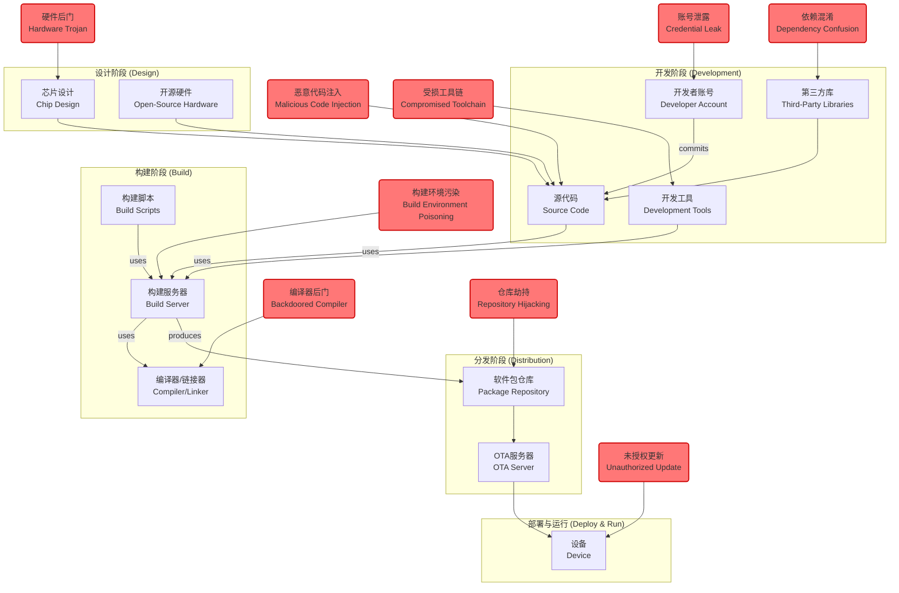

# IoT安全架构分析：软件供应链安全

## 1. 形式化定义

物联网软件供应链安全 (IoT Software Supply Chain Security) 是一套系统性的方法论和技术实践，旨在保障从硬件设计、软件开发、构建、分发到设备部署和运行维护的全过程的完整性、真实性和机密性。其核心目标是防止恶意行为者在供应链的任何环节注入恶意代码、后门或漏洞。

我们将IoT软件供应链 (SSC) 形式化地定义为一个有向无环图 (DAG)：

\[ \text{SSC} = (V, E) \]

其中：

- \( V \): **节点集合 (Vertices)**，代表供应链中的各个阶段或产物。
  \( V = V_{design} \cup V_{dev} \cup V_{build} \cup V_{dist} \cup V_{deploy} \cup V_{runtime} \)
  - \( V_{design} \): 芯片设计、硬件选型
  - \( V_{dev} \): 源代码、第三方依赖、开发工具
  - \( V_{build} \): 构建服务器、编译器、打包工具
  - \( V_{dist} \): 固件/软件仓库、内容分发网络(CDN)
  - \( V_{deploy} \): OTA服务器、部署工具
  - \( V_{runtime} \): 运行在设备上的固件/软件

- \( E \): **边集合 (Edges)**，代表节点之间的依赖或许可关系。例如，从源代码到构建产物的转换 `(source_code, binary) ∈ E`。

供应链安全的目标是为每个节点 \( v \in V \) 和每条边 \( e \in E \) 定义和实施一个安全策略函数 \( \mathcal{P}_{sec} \)。

\[ \mathcal{P}_{sec}(x) \rightarrow \{\text{Trusted, Untrusted}\} \quad \forall x \in V \cup E \]

该策略 \( \mathcal{P}_{sec} \) 通常通过以下机制的组合来实现：

- **身份验证 (Authentication)**: 确保所有参与者（开发者、服务器）的身份都是可信的。
- **授权 (Authorization)**: 最小权限原则，限制每个参与者只能访问其必需的资源。
- **完整性校验 (Integrity Verification)**: 使用数字签名、哈希和软件物料清单(SBOM)来确保产物未被篡改。
- **可追溯性 (Traceability)**: 记录从源代码到最终产物的所有变更和操作，形成不可变的审计日志。

## 2. 供应链威胁模型图



## 3. 关键安全阶段与对策

1. **设计阶段**:
    - **威胁**: 硬件后门、设计缺陷。
    - **对策**: 使用可信的芯片供应商、进行硬件安全审计、采用开源和可验证的硬件设计。

2. **开发阶段**:
    - **威胁**: 恶意代码注入、依赖漏洞、开发者凭证泄露。
    - **对策**:
        - **代码签名**: 所有代码提交都必须由开发者GPG签名。
        - **静态分析 (SAST)**: 自动检测代码中的已知漏洞。
        - **软件物料清单 (SBOM)**: 生成并维护所有依赖项的列表（如CycloneDX, SPDX格式）。
        - **依赖扫描**: 自动扫描SBOM，对照漏洞数据库检查第三方库的安全性。

3. **构建阶段**:
    - **威胁**: 构建环境被篡改、编译器被植入后门。
    - **对策**:
        - **密封和临时的构建环境**: 每次构建都在一个干净、隔离、一次性的环境中进行。
        - **可复现构建 (Reproducible Builds)**: 保证使用相同的输入（源代码、工具链版本）可以产生逐位相同的二进制输出。
        - **签名构建产物**: 所有构建产物（固件、软件包）都必须由构建服务器进行数字签名。

4. **分发与部署阶段**:
    - **威胁**: 软件包被替换、OTA更新被劫持。
    - **对策**:
        - **安全存储**: 使用GPG或TUF(The Update Framework)等机制保护软件包仓库的安全。
        - **端到端签名验证**: 设备在安装任何固件或软件更新之前，必须验证其签名链是否可信（最终追溯到根CA或可信密钥）。

## 4. Rust概念实现：SBOM验证

以下示例展示了如何在构建流程中生成并验证一个简单的SBOM。我们将使用`serde`进行JSON处理。

**Cargo.toml 依赖**:

```toml
[dependencies]
serde = { version = "1.0", features = ["derive"] }
serde_json = "1.0"
sha2 = "0.10.8"
```

**main.rs**:

```rust
use serde::{Deserialize, Serialize};
use sha2::{Sha256, Digest};
use std::collections::HashMap;
use std::fs;

// 定义一个简化的SBOM组件结构
#[derive(Serialize, Deserialize, Debug, Clone)]
struct SbomComponent {
    name: String,
    version: String,
    purl: String, // Package URL (purl)
    hash: String, // SHA256 hash of the component
}

// 定义一个简化的SBOM结构
#[derive(Serialize, Deserialize, Debug, Clone)]
struct Sbom {
    spec_version: String,
    name: String,
    version: String,
    components: Vec<SbomComponent>,
}

// 模拟一个构建过程，生成SBOM
fn build_and_generate_sbom() -> Sbom {
    // 模拟的依赖项
    let dep1_content = "fake-library-content-v1.0";
    let dep2_content = "another-lib-content-v2.1";

    let mut hasher = Sha256::new();
    hasher.update(dep1_content.as_bytes());
    let dep1_hash = format!("{:x}", hasher.finalize());

    hasher = Sha256::new(); // Reset hasher
    hasher.update(dep2_content.as_bytes());
    let dep2_hash = format!("{:x}", hasher.finalize());

    let sbom = Sbom {
        spec_version: "1.4".to_string(),
        name: "My-IoT-Firmware".to_string(),
        version: "1.0.0".to_string(),
        components: vec![
            SbomComponent {
                name: "fake-library".to_string(),
                version: "1.0".to_string(),
                purl: "pkg:cargo/fake-library@1.0".to_string(),
                hash: dep1_hash,
            },
            SbomComponent {
                name: "another-lib".to_string(),
                version: "2.1".to_string(),
                purl: "pkg:cargo/another-lib@2.1".to_string(),
                hash: dep2_hash,
            },
        ],
    };
    
    // 将SBOM写入文件
    let sbom_json = serde_json::to_string_pretty(&sbom).unwrap();
    fs::write("firmware.sbom.json", sbom_json).unwrap();
    println!("✅ SBOM generated for My-IoT-Firmware v1.0.0");
    sbom
}

// 在部署或验证阶段，加载并验证SBOM
fn verify_from_sbom(sbom: &Sbom, known_vulnerabilities: &HashMap<String, String>) {
    println!("\n--- Verifying firmware based on SBOM ---");
    for component in &sbom.components {
        println!("Checking component: {}", component.name);
        
        // 1. 检查是否存在已知漏洞
        if let Some(vulnerability) = known_vulnerabilities.get(&component.purl) {
            println!("❌ VULNERABILITY FOUND in {}: {}", component.purl, vulnerability);
        } else {
            println!("✅ No known vulnerabilities for {}", component.purl);
        }

        // 2. 在真实场景中，这里还会重新计算组件的哈希值并与SBOM中的记录进行比对
        //    以确保组件的完整性未被破坏。
        //    e.g., let current_hash = calculate_hash_for(&component);
        //    assert_eq!(current_hash, component.hash);
    }
}


fn main() {
    let sbom = build_and_generate_sbom();

    // 模拟一个已知的漏洞数据库
    // Key: purl, Value: CVE ID
    let mut known_vulnerabilities = HashMap::new();
    known_vulnerabilities.insert(
        "pkg:cargo/fake-library@1.0".to_string(),
        "CVE-2024-XXXX".to_string()
    );

    verify_from_sbom(&sbom, &known_vulnerabilities);
}
```

**代码解释**:

1. **数据结构**: 我们定义了`Sbom`和`SbomComponent`来表示一个简化的软件物料清单，遵循常见的格式。`purl` (Package URL) 提供了一种标准化的方式来识别软件包。
2. **生成SBOM**: `build_and_generate_sbom`函数模拟了构建流程。它计算了每个依赖项的哈希值，并将这些信息连同版本和名称一起打包成一个SBOM文件 (`firmware.sbom.json`)。
3. **验证SBOM**: `verify_from_sbom`函数模拟了安全扫描过程。它遍历SBOM中的每个组件，并对照一个模拟的漏洞数据库进行检查。在实际应用中，还会校验组件的哈希值以确保其完整性。

## 5. 总结与挑战

物联网软件供应链安全是一个复杂但至关重要的领域。与传统IT相比，它面临着更严峻的挑战：

- **硬件依赖**: 供应链的起点是硬件，硬件的可信度难以验证。
- **生命周期长**: 物联网设备可能部署数年甚至数十年，持续的安全更新和维护是一个巨大挑战。
- **异构性**: 生态系统包含大量不同的硬件、操作系统和协议，难以实现统一的安全策略。
- **离线与受限环境**: 许多设备可能间歇性在线或处于资源极度受限的环境中，使得传统的扫描和更新机制难以实施。

确保IoT供应链安全需要一个全生命周期的、深度防御的策略，将安全左移到开发的最初阶段，并贯穿始终。
