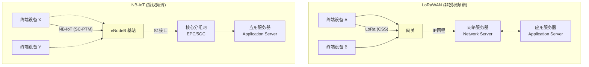

# IoT高级通信模型分析：低功耗广域网络 (LPWAN) 优化

## 1. 形式化定义

低功耗广域网络 (Low-Power Wide-Area Network, LPWAN) 是一类无线通信技术，其设计目标是在广阔的地理范围内，以极低的功耗为代价，为物联网设备提供无线连接，但通常只支持较低的数据速率。LPWAN的核心是在**通信距离 (Range)**、**功耗 (Power Consumption)** 和**数据速率 (Data Rate)** 三者之间进行极致的权衡。

我们将一个LPWAN系统形式化地定义为一个五元组：

\[ \text{LPWAN-System} = (\mathcal{D}, \mathcal{G}, \mathcal{N}, \mathcal{P}, \mathcal{O}) \]

其中：

- \( \mathcal{D} \): **终端设备集合 (End Devices)**。海量的、通常由电池供电的IoT设备。
- \( \mathcal{G} \): **网关/基站集合 (Gateways/Base Stations)**。负责从广大地理范围内的终端设备收集数据，并将数据通过更高带宽的回程网络（如蜂窝网、以太网）转发到网络服务器。
- \( \mathcal{N} \): **网络服务器 (Network Server)**。LPWAN网络的核心大脑，负责管理整个网络，包括设备注册、消息去重、路由、数据转发以及对下行链路消息的管理。
- \( \mathcal{P} \): **协议栈 (Protocol Stack)**。定义了从物理层到应用层的通信规范。这包括调制方式（如LoRa的CSS调制、NB-IoT的SC-PTM）、MAC层协议、安全机制等。
- \( \mathcal{O} \): **优化策略集合 (Optimization Strategies)**。这是一系列旨在最大化电池寿命和网络容量的算法与机制。
  \[ \mathcal{O} = \{f_{ADR}, f_{PSM}, f_{eDRX}, \dots \} \]
  - \( f_{ADR} \): 自适应数据速率 (Adaptive Data Rate)。
  - \( f_{PSM} \): 功耗节省模式 (Power Saving Mode)。
  - \( f_{eDRX} \): 扩展非连续接收 (Extended Discontinuous Reception)。

LPWAN的**总能耗** \( E_{total} \) 是其关键性能指标，可以建模为：
\[ E_{total}(T) = \int_{0}^{T} (P_{tx}(t) + P_{rx}(t) + P_{sleep}(t) + P_{proc}(t)) dt \]
其中 \( P_{tx}, P_{rx}, P_{sleep}, P_{proc} \) 分别是设备在发送、接收、休眠和处理状态下的瞬时功耗。优化策略 \( \mathcal{O} \) 的目标是在满足应用QoS要求的前提下，最小化 \( E_{total} \)。

## 2. LoRaWAN 与 NB-IoT 架构对比



- **LoRaWAN**: 工作在非授权的ISM频段，采用星型-星型拓扑。设备通过LoRa物理层与一个或多个网关通信，网关将数据包透明地转发到网络服务器。网络服务器负责处理和路由数据。这种架构更灵活，易于私有化部署。
- **NB-IoT**: 工作在运营商授权的蜂窝频段，是3GPP标准的一部分。设备直接与蜂窝基站(eNodeB)通信，网络架构复用了现有的LTE核心网(EPC)或5G核心网(5GC)。这种架构提供了电信级的可靠性和安全性，但依赖于运营商网络。

## 3. 关键优化策略

### 3.1 自适应数据速率 (ADR) - LoRaWAN

ADR是一种由网络服务器控制的机制，旨在优化单个设备的功耗和数据速率。

- **原理**: 当设备靠近网关，信号质量（SNR）很好时，网络服务器会指令设备使用更高的数据速率（更短的传输时间）和更低的发射功率。
- **目标**: 在保证消息能够被成功接收的前提下，尽可能减少空中传输时间 (Time on Air)，从而节省大量能源。

### 3.2 功耗节省模式 (PSM) - NB-IoT/LTE-M

PSM允许设备在完成一次数据收发后，进入深度休眠状态，而无需每次都从网络中分离和重新附着。

- **原理**: 设备与网络协商一个`Active Timer`和一个`TAU (Tracking Area Update) Timer`。在发送完数据后，`Active Timer`启动，此时设备仍可接收下行消息。当`Active Timer`超时后，设备进入深度休眠（PSM状态），直到`TAU Timer`超时前才醒来并向网络报告位置，或有新的上行数据要发送。
- **效果**: 在PSM状态下，设备仅有实时时钟在工作，功耗可降至微安级别，极大地延长了电池寿命，但代价是设备在休眠期间无法被网络访问（不可达）。

## 4. Rust概念实现：模拟设备能耗模型

以下代码模拟了一个IoT设备在不同状态（休眠、唤醒、发送）下的生命周期，并估算其总能耗。

**main.rs**:

```rust
use std::time::Duration;
use tokio::time;

// 功耗值（单位：毫瓦 mW）
const POWER_SLEEP_MW: f64 = 0.01;   // 深度休眠模式
const POWER_WAKEUP_MW: f64 = 5.0;     // 唤醒和处理
const POWER_TRANSMIT_MW: f64 = 150.0; // 发射

// 时间（单位：秒 s）
const DURATION_WAKEUP_S: f64 = 0.5;   // 唤醒和准备数据时间
const DURATION_TRANSMIT_S: f64 = 2.0;   // 发射时间
const DURATION_CYCLE_S: u64 = 3600; // 数据发送周期（1小时）

#[derive(Debug)]
enum DeviceState {
    Sleep,
    WakeUp,
    Transmit,
}

// 模拟一个LPWAN设备
struct LpwanDevice {
    total_energy_mj: f64, // 总消耗能量 (毫焦 mJ)
    state: DeviceState,
}

impl LpwanDevice {
    fn new() -> Self {
        LpwanDevice {
            total_energy_mj: 0.0,
            state: DeviceState::Sleep,
        }
    }

    // 状态转移并计算能耗
    fn transition_to(&mut self, new_state: DeviceState) {
        let (power_mw, duration_s) = match self.state {
            DeviceState::Sleep => (POWER_SLEEP_MW, (DURATION_CYCLE_S as f64) - DURATION_WAKEUP_S - DURATION_TRANSMIT_S),
            DeviceState::WakeUp => (POWER_WAKEUP_MW, DURATION_WAKEUP_S),
            DeviceState::Transmit => (POWER_TRANSMIT_MW, DURATION_TRANSMIT_S),
        };

        let energy_consumed = power_mw * duration_s; // E = P * t
        self.total_energy_mj += energy_consumed;
        
        println!(
            "State: {:?}, Duration: {:.2}s, Power: {:.2}mW, Energy Consumed: {:.2}mJ, Total Energy: {:.2}mJ",
            self.state, duration_s, power_mw, energy_consumed, self.total_energy_mj
        );

        self.state = new_state;
    }
}

#[tokio::main]
async fn main() {
    let mut device = LpwanDevice::new();
    let mut cycles = 0;

    loop {
        cycles += 1;
        println!("\n--- Cycle {} ---", cycles);

        // 1. 从休眠状态唤醒
        device.transition_to(DeviceState::WakeUp);
        
        // 2. 准备数据后进入发送状态
        device.transition_to(DeviceState::Transmit);

        // 3. 发送完成后进入休眠状态
        device.transition_to(DeviceState::Sleep);
        
        // 假设一个电池容量为 5000mAh @ 3.7V
        // E = 5000mAh * 3.7V = 18500 mWh = 66,600,000 mWs = 66,600,000 mJ
        let battery_capacity_mj = 66_600_000.0;
        if device.total_energy_mj >= battery_capacity_mj {
            println!("\nBattery depleted after {} cycles.", cycles);
            break;
        }

        if cycles >= 5 {
            let estimated_lifetime_days = (battery_capacity_mj / device.total_energy_mj) * (DURATION_CYCLE_S as f64) / (24.0 * 3600.0) * (cycles as f64);
            println!("\nBased on 5 cycles, estimated battery lifetime: {:.2} days.", estimated_lifetime_days);
            break;
        }

        // 模拟一个周期的等待
        time::sleep(Duration::from_secs(1)).await; // 用1秒模拟1小时以加速
    }
}

## 5. 总结与挑战

LPWAN是实现大规模、低成本物联网连接的关键技术，但其优化是一个复杂的、多维度的过程。
- **环境动态性**: 无线信道质量是动态变化的，ADR等机制需要准确地适应这些变化，否则可能导致数据丢失或不必要的能源浪费。
- **下行链路限制**: 无论是LoRaWAN（Class A设备）还是NB-IoT (PSM)，都存在下行链路通信窗口受限的问题。这使得固件更新（OTA）等需要大量下行数据的操作变得非常困难和耗时。
- **网络容量**: 在密集的部署场景中，非授权频谱的干扰和冲突会成为网络容量的主要瓶颈。
- **标准化与碎片化**: LPWAN领域存在多种技术（LoRaWAN, NB-IoT, Sigfox等），它们之间互不兼容，给应用的开发和部署带来了挑战。
