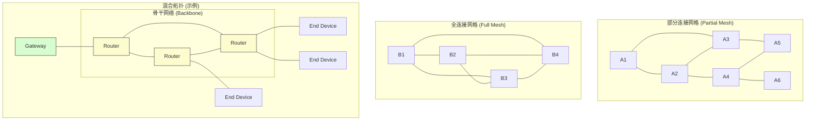

# IoT高级通信模型分析：网格网络协议 (Mesh)

## 1. 形式化定义

物联网网格网络 (IoT Mesh Network) 是一种去中心化的网络拓扑结构，其中每个节点（设备）不仅能捕获和分发自己的数据，还能作为中继，将数据转发给其他节点。这种结构通过多跳通信，创建了一个具有高可靠性和扩展性的自组织、自修复网络。

我们将一个网格网络形式化地定义为一个四元组：

\[ \text{Mesh-Net} = (N, L, R, C) \]

其中：

- \( N \): **节点集合 (Nodes)**。网络中的所有设备，\( N = \{n_1, n_2, \dots, n_k\} \)。节点可以扮演不同的角色：
  - **终端节点 (End Device)**: 通常是资源受限的设备，只与父节点通信。
  - **路由器节点 (Router)**: 参与数据转发，构建网络骨干。
  - **协调器/网关节点 (Coordinator/Gateway)**: 网络的根节点，负责网络建立，并连接到外部网络。
- \( L \): **链接集合 (Links)**。表示节点之间存在的直接通信信道。\( L \subseteq N \times N \)。一个链接 \( (n_i, n_j) \in L \) 存在，当且仅当节点 \( n_i \) 和 \( n_j \) 在彼此的通信范围内。
- \( R \): **路由函数 (Routing Function)**。这是一个核心函数，它为任意一对源-目的节点 \((n_s, n_d)\) 决定一个数据包的下一跳 \( n_{next} \)。
  \[ R: (P, n_c) \rightarrow n_{next} \]
  其中 \( P \) 是数据包（包含最终目的地 \( n_d \)），\( n_c \) 是当前持有数据包的节点。路由算法的目标是找到一条从 \( n_s \) 到 \( n_d \) 的优化路径（例如，跳数最少或能耗最低）。常见的路由协议有AODV, DSDV, RPL等。
- \( C \): **网络配置与维护协议 (Configuration and Maintenance Protocols)**。负责节点的加入、离开、网络自愈和参数配置等。例如，节点发现、邻居表维护等。

## 2. Mesh网络架构与拓扑

网格网络可以有多种拓扑结构，主要分为全连接和部分连接。



- **全连接网格**: 每个节点都与网络中的所有其他节点直接相连。可靠性极高，但成本和复杂性也最高，仅适用于小型网络。
- **部分连接网格**: 节点只与一部分其他节点（通常是其物理邻居）相连。这是最常见的形式，在成本和可靠性之间取得了平衡。
- **混合拓扑**: 在实际应用中，通常采用混合模式，由多个路由器节点组成网络骨干，而大量的终端设备则连接到最近的路由器上。

## 3. 关键特性

1. **自组织 (Self-Organizing)**: 新节点可以自动加入网络并建立连接，无需手动配置。
2. **自修复 (Self-Healing)**: 当某个节点或链接发生故障时，网络可以自动寻找替代路径来重新路由数据，保证通信的连续性。
3. **多跳通信 (Multi-Hop)**: 数据可以通过一系列中间节点进行中继，从而极大地扩展了网络的覆盖范围，远超单个节点的通信距离。
4. **可靠性与冗余**: 由于存在多条可用路径，网络对单点故障具有很强的鲁棒性。

## 4. Rust概念实现：模拟泛洪路由算法

泛洪 (Flooding) 是最简单的路由算法之一，它不维护任何路由表。当一个节点收到一个数据包时，它会将其转发给除了源节点之外的所有邻居。为了防止数据包无限循环，通常会使用序列号或TTL（生存时间）机制。

以下代码模拟了一个简单的网络，并使用泛洪算法在其中传播一条消息。

**main.rs**:

```rust
use std::collections::{HashMap, HashSet, VecDeque};
use std::sync::{Arc, Mutex};
use tokio::time::{self, Duration};

// 节点ID类型
type NodeId = u32;

// 消息结构
#[derive(Debug, Clone)]
struct Message {
    id: u64, // 唯一消息ID，防止重复处理
    origin: NodeId,
    destination: NodeId,
    content: String,
    ttl: u32, // 生存时间
}

// 模拟一个网络节点
#[derive(Debug)]
struct Node {
    id: NodeId,
    neighbors: Vec<NodeId>, // 邻居节点列表
    inbox: Arc<Mutex<VecDeque<Message>>>,
    processed_messages: HashSet<u64>,
}

impl Node {
    fn new(id: NodeId, neighbors: Vec<NodeId>) -> Self {
        Node {
            id,
            neighbors,
            inbox: Arc::new(Mutex::new(VecDeque::new())),
            processed_messages: HashSet::new(),
        }
    }

    // 接收消息
    fn receive_message(&mut self, message: Message) {
        if !self.processed_messages.contains(&message.id) {
            println!("Node {} received message {} from {}", self.id, message.id, message.origin);
            self.processed_messages.insert(message.id);
            if self.id != message.destination {
                self.inbox.lock().unwrap().push_back(message);
            } else {
                println!("\n*** Node {} reached destination! Content: {} ***\n", self.id, message.content);
            }
        } else {
            println!("Node {} already processed message {}, dropping.", self.id, message.id);
        }
    }

    // 泛洪转发逻辑
    fn forward_messages(&self, network: &HashMap<NodeId, Arc<Mutex<Node>>>) {
        while let Some(mut message) = self.inbox.lock().unwrap().pop_front() {
            if message.ttl > 0 {
                message.ttl -= 1;
                println!("Node {} is forwarding message {} to its neighbors...", self.id, message.id);
                for neighbor_id in &self.neighbors {
                    if let Some(neighbor_node) = network.get(neighbor_id) {
                         // 在真实异步环境中，这里会通过网络发送
                         // 这里我们直接调用对方的receive_message
                         let mut neighbor = neighbor_node.lock().unwrap();
                         neighbor.receive_message(message.clone());
                    }
                }
            } else {
                println!("Message {} TTL expired at Node {}, dropping.", message.id, self.id);
            }
        }
    }
}

#[tokio::main]
async fn main() {
    // 定义网络拓扑: 1-2, 1-3, 2-4, 3-4, 3-5, 4-5
    let mut network: HashMap<NodeId, Arc<Mutex<Node>>> = HashMap::new();
    network.insert(1, Arc::new(Mutex::new(Node::new(1, vec![2, 3]))));
    network.insert(2, Arc::new(Mutex::new(Node::new(2, vec![1, 4]))));
    network.insert(3, Arc::new(Mutex::new(Node::new(3, vec![1, 4, 5]))));
    network.insert(4, Arc::new(Mutex::new(Node::new(4, vec![2, 3, 5]))));
    network.insert(5, Arc::new(Mutex::new(Node::new(5, vec![3, 4]))));

    // 创建一个消息从节点1到节点5
    let initial_message = Message {
        id: 101,
        origin: 1,
        destination: 5,
        content: "Hello Mesh!".to_string(),
        ttl: 5,
    };
    
    println!("--- Initiating message broadcast from Node 1 to Node 5 ---");
    network.get(&1).unwrap().lock().unwrap().receive_message(initial_message);

    // 模拟网络中的异步转发
    // 在每个时间步，所有节点都尝试转发其收件箱中的消息
    for step in 0..5 {
        println!("\n--- Network Step {} ---", step);
        for (_, node_mutex) in &network {
            let node = node_mutex.lock().unwrap();
            node.forward_messages(&network);
        }
        time::sleep(Duration::from_millis(50)).await;
        // 检查目标节点是否已收到消息
        if network.get(&5).unwrap().lock().unwrap().processed_messages.contains(&101) {
            println!("\n--- Message successfully delivered to Node 5. ---");
            break;
        }
    }
}
```

**代码解释**:

1. **数据结构**: `Node`代表网络中的一个设备，它拥有一个`id`，一个邻居列表`neighbors`，一个收件箱`inbox`用于接收消息，以及一个`processed_messages`集合来防止重复处理同一个消息。
2. **泛洪逻辑**: 核心逻辑在`receive_message`和`forward_messages`中。当一个节点接收到一个未处理过的消息时，如果它不是最终目的地，就将消息放入自己的收件箱。`forward_messages`方法会清空收件箱，并将每条消息转发给所有邻居（同时减少TTL）。
3. **网络模拟**: `main`函数首先设置了一个包含5个节点的`HashMap`作为网络。然后，它创建一个消息并将其发送给起始节点1。之后，通过一个循环来模拟离散的时间步，在每个步骤中，所有节点都执行它们的转发逻辑。

## 5. 总结与挑战

网格网络是许多低功耗、广域IoT应用（如智能路灯、农业监测）的理想选择，但也面临着一些挑战：

- **路由协议开销**: 在资源受限的设备上，维护路由表和发送控制消息会消耗宝贵的能源和计算资源。
- **网络拥塞**: 在密集的网络中，泛洪等简单算法可能导致广播风暴，造成严重的网络拥塞。
- **延迟**: 多跳通信必然会增加端到端的延迟，对于实时性要求高的应用可能不适用。
- **安全性**: 去中心化的特性使得网络边界模糊，更容易受到各种网络攻击，如消息篡改、假冒节点、吸血鬼攻击等。需要专门为Mesh网络设计的安全协议。
