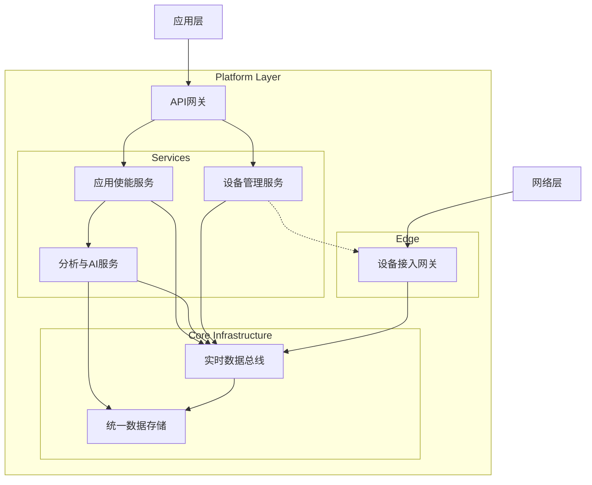
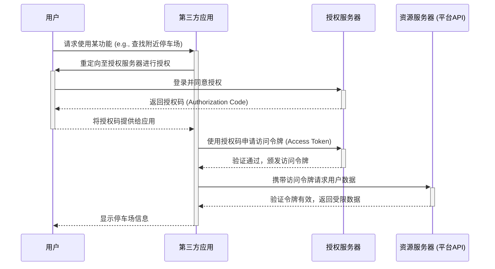

# IoT专题分析：智慧城市物联网平台形式化分析与架构研究

---

- **文档ID**: ANA-INDUSTRY-002
- **版本**: 0.1 (初稿)
- **创建日期**: 2024-06-25
- **状态**: 进行中
- **负责人**: TBD

---

## 摘要

本报告旨在对智慧城市物联网（IoT）平台进行全面的形式化分析与架构研究。报告将涵盖智慧城市平台的核心挑战、形式化模型、参考架构、关键技术、安全隐私问题以及基于Rust/Go的实现考量，为构建大规模、高可靠的城市级物联网系统提供理论基础和工程指南。

## 目录

- [IoT专题分析：智慧城市物联网平台形式化分析与架构研究](#iot专题分析智慧城市物联网平台形式化分析与架构研究)
  - [摘要](#摘要)
  - [目录](#目录)
  - [1. 概述](#1-概述)
  - [2. 核心挑战与目标](#2-核心挑战与目标)
    - [2.1 核心挑战](#21-核心挑战)
    - [2.2 分析目标](#22-分析目标)
  - [3. 形式化模型](#3-形式化模型)
    - [3.1 智慧城市系统定义](#31-智慧城市系统定义)
    - [3.2 多源异构数据模型](#32-多源异构数据模型)
    - [3.3 跨域服务协同模型](#33-跨域服务协同模型)
  - [4. 参考架构](#4-参考架构)
    - [4.1 分层架构视图](#41-分层架构视图)
    - [4.2 关键组件与接口](#42-关键组件与接口)
  - [5. 关键技术分析](#5-关键技术分析)
    - [5.1 大规模设备接入与管理](#51-大规模设备接入与管理)
      - [5.1.1 协议适配与转换](#511-协议适配与转换)
      - [5.1.2 安全身份与零触摸部署](#512-安全身份与零触摸部署)
      - [5.1.3 高并发连接与可伸缩性](#513-高并发连接与可伸缩性)
    - [5.2 城市级数据融合与处理](#52-城市级数据融合与处理)
      - [5.2.1 数据处理架构 (Lambda/Kappa)](#521-数据处理架构-lambdakappa)
      - [5.2.2 语义数据融合](#522-语义数据融合)
      - [5.2.3 高效时空查询](#523-高效时空查询)
    - [5.3 数字孪生城市模型](#53-数字孪生城市模型)
      - [5.3.1 形式化定义](#531-形式化定义)
      - [5.3.2 建模技术](#532-建模技术)
      - [5.3.3 数据同步机制](#533-数据同步机制)
    - [5.4 公共服务API与开放生态](#54-公共服务api与开放生态)
      - [5.4.1 API网关：统一服务入口](#541-api网关统一服务入口)
      - [5.4.2 安全授权 (OAuth 2.0)](#542-安全授权-oauth-20)
      - [5.4.3 服务治理与生态管理](#543-服务治理与生态管理)
  - [6. 安全与隐私考量](#6-安全与隐私考量)
    - [6.1 核心威胁分析](#61-核心威胁分析)
    - [6.2 零信任架构 (ZTA)](#62-零信任架构-zta)
    - [6.3 隐私增强技术 (PET)](#63-隐私增强技术-pet)
      - [6.3.1 联邦学习 (Federated Learning)](#631-联邦学习-federated-learning)
      - [6.3.2 差分隐私 (Differential Privacy)](#632-差分隐私-differential-privacy)
      - [6.3.3 同态加密 (Homomorphic Encryption)](#633-同态加密-homomorphic-encryption)
  - [7. Rust/Go实现策略](#7-rustgo实现策略)
    - [7.1 语言选型考量](#71-语言选型考量)
    - [7.2 关键组件实现建议](#72-关键组件实现建议)
    - [7.3 混合语言编程策略](#73-混合语言编程策略)
  - [8. 结论与未来展望](#8-结论与未来展望)
  - [9. 参考文献](#9-参考文献)

---

## 1. 概述

智慧城市（Smart City）是现代城市发展的高级形态，它利用新一代信息技术，如物联网（IoT）、云计算、大数据和人工智能（AI），来感知、分析和整合城市运行的核心系统，从而对公共服务、社会管理、产业运作等活动做出智能化的响应。其最终目标是为市民创造更美好的生活，为企业创造更优越的营商环境，以及为政府提供更高效的治理模式。

智慧城市物联网平台是实现这一愿景的技术中枢。它不仅是连接海量城市传感器和智能设备的"神经网络"，更是汇聚、处理和开放城市数据的"数据大脑"。该平台需要具备极高的可扩展性、可靠性和安全性，以支撑交通、能源、安防、环保、政务等众多垂直领域的复杂应用。本报告将对这一核心平台进行深入的形式化分析，旨在建立其严谨的架构模型，为未来的设计与实现提供科学依据。

## 2. 核心挑战与目标

构建和运营一个城市级的物联网平台面临着前所未有的技术与非技术挑战。本次分析旨在识别这些挑战并设定明确的研究目标。

### 2.1 核心挑战

1. **大规模异构性 (Massive Heterogeneity)**: 城市环境中的设备种类繁多（交通摄像头、环境监测器、智能电表、共享单车等），它们使用不同的通信协议、数据格式和标准，如何实现它们的统一接入、管理和互操作是一个巨大挑战。
2. **海量数据处理 (Vast Data Volume)**: 数以亿计的设备持续不断地产生数据流，对平台的实时处理、存储和分析能力构成了严峻考验。如何从海量数据中提取有效信息并保证数据的时效性是关键。
3. **系统复杂性与可靠性 (System Complexity & Reliability)**: 平台需要为众多生命攸关和任务关键型应用（如应急响应、智能交通信号控制）提供7x24小时不间断的服务。系统任何一个组件的故障都可能导致连锁反应，因此必须保证极高的可靠性和韧性。
4. **跨域协同与数据孤岛 (Cross-Domain Collaboration & Data Silos)**: 城市管理涉及多个独立的政府部门和公共事业单位（交通、**、环保等）。这些部门的现有信息系统往往是独立的"数据孤岛"，如何打破壁垒，实现安全、高效的数据共享与业务协同，是实现城市级智能的核心障碍。
5. **安全与隐私 (Security & Privacy)**: 平台集中了大量涉及城市运行和公民生活的敏感数据。它不仅是网络攻击的主要目标，也面临着严峻的数据隐私保护挑战。如何在开放数据、促进创新的同时，有效保护公民隐私和关键基础设施安全，是一个核心的社会技术问题。

### 2.2 分析目标

基于以上挑战，本报告设定以下核心分析目标：

1. **建立形式化系统模型**: 为智慧城市物联网平台创建一个精确的、与技术无关的形式化定义，清晰地描述其核心组件、接口和交互关系。
2. **设计分层参考架构**: 提出一个具有高内聚、低耦合特性的分层参考架构，为平台的模块化设计和标准化实现提供指导。
3. **分析关键技术的可行性**: 对实现该架构所需的关键技术（如数字孪生、数据融合、联邦学习等）进行形式化分析，评估其在城市级应用中的优势与局限。
4. **定义安全与治理框架**: 提出一个综合性的安全与隐私保护框架，确保平台在设计之初就融入"安全内建"和"隐私内建"的原则。
5. **探索实现策略**: 比较和评估使用现代系统编程语言（如Rust和Go）构建平台核心组件的策略和可行性。

## 3. 形式化模型

### 3.1 智慧城市系统定义

**定义 3.1 (智慧城市系统)**
一个智慧城市系统（Smart City System, SCS）是一个七元组：
$$\mathcal{SCS} = (\mathcal{D}, \mathcal{N}, \mathcal{P}, \mathcal{S}, \mathcal{A}, \mathcal{U}, \mathcal{G})$$
其中：

- **$\mathcal{D}$ (Devices)**: 城市中所有物联网设备的集合。每个设备 $d \in \mathcal{D}$ 至少包含一个传感器或执行器。
    $$d = (id, type, location, status, ...)$$

- **$\mathcal{N}$ (Network)**: 用于设备连接和数据传输的异构网络集合，包括LPWAN, 5G, 光纤等。

- **$\mathcal{P}$ (Platform)**: 核心物联网平台，是系统的中枢。它本身也是一个复杂的系统，包含数据处理、服务管理等能力。

- **$\mathcal{S}$ (Services)**: 平台提供的原子化或组合化的服务集合，如数据分析服务 $s_{analytics}$、设备管理服务 $s_{mgmt}$ 等。

- **$\mathcal{A}$ (Applications)**: 面向最终用户或城市管理者的垂直应用集合，如智慧交通 $a_{traffic}$、智慧能源 $a_{energy}$ 等。每个应用都构建在一个或多个服务之上。

- **$\mathcal{U}$ (Users)**: 所有与系统交互的实体集合，包括普通市民、城市管理者、开发者等。

- **$\mathcal{G}$ (Governance)**: 治理框架，定义了系统的运行规则、策略和约束。
    $$\mathcal{G} = (\text{Policies}_{\text{security}}, \text{Policies}_{\text{privacy}}, \text{Policies}_{\text{data}}, ...)$$

这个模型从宏观上定义了智慧城市系统的核心构成要素及其关系，为后续的架构和技术分析提供了形式化基础。

### 3.2 多源异构数据模型

为了应对智慧城市中数据来源广泛、格式多样、语义不一的挑战，必须建立一个统一的数据模型。该模型的核心思想是将所有原始数据转换为一种标准的、带有丰富元数据的"时空观测"范式。

**定义 3.2 (时空观测数据点 - Spatio-temporal Observation)**
进入平台的所有数据均被视为一个时空观测数据点 $o$。它是一个五元组：
$$o = (d_{src}, t, l, v, \tau_{sem})$$
其中：

- **$d_{src} \in \mathcal{D}$**: 产生该数据的源设备ID。
- **$t$**: 观测发生的时间戳（Timestamp），符合ISO 8601标准。
- **$l$**: 观测发生的地理空间位置（Location），通常为GeoJSON格式坐标。
- **$v$**: 观测的载荷（Value），即具体的测量值，其数据类型可以是数值、布尔、字符串或更复杂的结构。
- **$\tau_{sem}$**: 数据的语义类型（Semantic Type），它指向一个全局统一的语义本体，如 `TrafficFlow`、`AirQualityPM2.5`。

**定义 3.3 (统一语义本体 - Unified Semantic Ontology)**
为了解决语义异构性，平台必须维护一个统一语义本体 $\mathcal{O}$。该本体是描述城市概念及其关系的知识图谱。
$$\mathcal{O} = (\mathcal{C}, \mathcal{R}, \mathcal{P})$$
其中：

- **$\mathcal{C}$**: 概念集合，如 `车辆`、`传感器`、`污染物`。
- **$\mathcal{R}$**: 概念间的关系集合，如 `isLocatedAt`、`measuresProperty`。
- **$\mathcal{P}$**: 属性集合，如 `hasSpeed`、`hasConcentration`。观测的语义类型 $\tau_{sem}$ 必须是本体中定义的一个概念或属性，即 $\tau_{sem} \in \mathcal{C} \cup \mathcal{P}$。

**定义 3.4 (数据转换函数 - Data Transformation Function)**
对于每一种接入平台的原始数据格式，都必须定义一个对应的转换函数 $\mathcal{F}_T$。该函数将原始数据转换为标准的时空观测数据点。
$$\mathcal{F}_T: \text{RawData} \rightarrow o$$
这个函数是平台数据接入层（Ingestion Layer）的核心职责，它确保了所有后续处理的统一性。

### 3.3 跨域服务协同模型

智慧城市平台的服务层由来自不同领域（交通、环境、安防等）的多个独立服务构成。为了对这些服务之间的交互、协同和组合进行建模，我们引入了基于进程代数思想的形式化方法。

**定义 3.5 (服务进程 - Service Process)**
平台中的每个服务 $s \in \mathcal{S}$ 都被建模为一个服务进程 $P_s$。一个进程的行为由一系列动作（Action）定义。

**定义 3.6 (动作 - Action)**
动作 $\alpha$ 是进程可以执行的基本操作，主要分为两类：

- $\tau$：表示一个内部、不可见的计算动作。
- $c!v$ / $c?x$：表示通过通道（Channel）$c$ 发送值 $v$ 或接收值并存入变量 $x$ 的通信动作。

**定义 3.7 (服务进程定义)**
服务进程 $P$ 的行为通过类CSP（Communicating Sequential Processes）的语法进行定义：
$$P ::= \text{stop} \quad | \quad \alpha \rightarrow P \quad | \quad P_1 \square P_2 \quad | \quad P_1 ||| P_2$$
其中：

- **stop**: 表示进程终止，不执行任何操作。
- **$\alpha \rightarrow P$**: 前缀表示法，表示执行动作 $\alpha$ 后，进程的行为转变为 $P$。
- **$P_1 \square P_2$**: 外部选择，表示进程可以根据环境的第一个动作选择执行 $P_1$ 或 $P_2$。
- **$P_1 ||| P_2$**: 并行组合（交错模型），表示进程 $P_1$ 和 $P_2$ 并发执行，它们的动作可以任意交错。

**示例：交通信号灯与车辆检测服务协同**:

假设有一个车辆检测服务 $S_{VD}$ 和一个交通信号灯控制服务 $S_{TL}$。

- $S_{VD}$ 在检测到车辆后，通过通道 `veh_detect` 发送消息。
- $S_{TL}$ 从通道 `veh_detect` 接收消息，然后通过通道 `change_light` 发出变灯指令。

它们可以被建模为以下进程：

- $P_{VD} = \text{veh_detect}!\text{"car"} \rightarrow P_{VD}$
- $P_{TL} = \text{veh_detect}?\text{msg} \rightarrow \text{change_light}!\text{"red_to_green"} \rightarrow P_{TL}$

这两个服务进程的协同系统可以表示为并行组合：
$$\text{System} = P_{VD} \ ||| \ P_{TL}$$

这种模型清晰地描述了服务间的依赖和通信关系，为分析死锁、竞争条件等并发问题提供了理论工具。

```mermaid
graph TD
    subgraph 交通领域
        A(车辆检测服务 P_VD)
    end
    subgraph 信号控制领域
        B(交通信号灯服务 P_TL)
    end
    
    A -- "veh_detect!(\"car\")" --> C{通信通道 veh_detect}
    C -- "veh_detect?msg" --> B
    B -- "change_light!(\"red_to_green\")" --> D((执行器: 信号灯))

```

## 4. 参考架构

基于前述的形式化模型，我们提出一个分层的参考架构，旨在实现关注点分离（Separation of Concerns），提高系统的模块化、可扩展性和可维护性。该架构共分为五层。

### 4.1 分层架构视图

```mermaid
graph TD
    subgraph 用户与业务
        P[表示层 - Presentation Layer]
    end

    subgraph 城市应用
        A[应用层 - Application Layer]
    end

    subgraph 平台核心能力
        S[平台层 - Platform Layer]
    end

    subgraph 数据传输
        N[网络层 - Network Layer]
    end

    subgraph 物理世界
        D[感知层 - Perception Layer]
    end
    
    P --> A
    A --> S
    S --> N
    N --> D

    subgraph Platform Layer Details
        direction LR
        S_API[API网关] --> S_Services[应用服务]
        S_Services --> S_Analytics[数据分析引擎]
        S_Analytics --> S_Storage[数据存储]
        S_Services --> S_Mgmt[设备管理]
        S_Mgmt --> S_Storage
    end

    S --- Platform Layer Details
```

1. **感知层 (Perception Layer)**:
    - **职责**: 负责与物理世界交互，进行数据的采集和命令的执行。
    - **对应模型**: 对应形式化模型中的设备集合 $\mathcal{D}$。
    - **主要组件**: 传感器（交通、环境、楼宇）、执行器（信号灯、阀门）、智能摄像头、RFID读写器等。

2. **网络层 (Network Layer)**:
    - **职责**: 提供安全、可靠的数据传输通道，连接感知层的设备与平台层。
    - **对应模型**: 对应形式化模型中的网络集合 $\mathcal{N}$。
    - **主要组件**: 5G/4G/NB-IoT、LoRaWAN、光纤网络、MQTT/CoAP网关等。

3. **平台层 (Platform Layer)**:
    - **职责**: 是整个智慧城市系统的核心，负责设备管理、数据接入、处理、存储和分析，并通过API将能力开放给上层应用。
    - **对应模型**: 对应形式化模型中的平台 $\mathcal{P}$ 和服务 $\mathcal{S}$。
    - **主要组件**: 设备接入与管理、数据转换与处理引擎、时空数据库、AI分析平台、API网关、安全中心。

4. **应用层 (Application Layer)**:
    - **职责**: 基于平台层提供的能力，构建面向特定城市业务场景的垂直应用。
    - **对应模型**: 对应形式化模型中的应用集合 $\mathcal{A}$。
    - **主要组件**: 智慧交通管理系统、智慧能源调度系统、公共安全监控系统、智慧政务应用等。

5. **表示层 (Presentation Layer)**:
    - **职责**: 为不同类型的用户提供统一的人机交互界面。
    - **对应模型**: 对应形式化模型中的用户集合 $\mathcal{U}$ 与应用的交互部分。
    - **主要组件**: Web门户、移动App、城市运营中心（UOC）大屏、API开发者门户等。

### 4.2 关键组件与接口

本节详细阐述平台层（Platform Layer）的核心组件及其交互接口，这是实现平台能力的关键。



1. **设备接入网关 (Device Access Gateway)**
    - **职责**: 作为海量设备连接的入口，负责协议适配、身份认证和数据初步解析。它将来自网络层不同协议（MQTT, CoAP, HTTP/2等）的数据统一封装，并推送到内部数据总线。
    - **接口**:
        - **南向接口**: 面向网络层，支持多种IoT通信协议。
        - **北向接口**: 面向数据总线，以标准化的消息格式（如CloudEvents）发布数据。
        - **管理接口**: 与设备管理服务交互，进行设备认证和策略同步。

2. **实时数据总线 (Real-time Data Bus)**
    - **职责**: 承担平台内部各组件之间异步、解耦的实时数据交换。通常是一个高吞吐、低延迟的消息队列系统。
    - **对应模型**: 实现了服务进程间的通信通道。
    - **主要组件**: Apache Kafka, Pulsar, or RabbitMQ。
    - **接口**: 提供发布/订阅（Pub/Sub）接口，所有需要实时数据的组件都从总线上订阅相应主题（Topic）。

3. **统一数据存储 (Unified Data Storage)**
    - **职责**: 负责持久化存储城市的多源异构数据。通常采用混合存储策略。
    - **主要组件**:
        - **时序数据库 (TSDB)**: 存储传感器等设备产生的时空观测数据，如InfluxDB, TimescaleDB。
        - **数据湖/对象存储**: 存储原始数据、非结构化数据（如视频、图像）和分析结果，如MinIO, HDFS。
        - **关系型/NoSQL数据库**: 存储设备元数据、用户数据和配置信息，如PostgreSQL, MongoDB。
    - **接口**: 提供标准的数据库访问接口（SQL, REST API等）。

4. **分析与AI服务 (Analytics & AI Service)**
    - **职责**: 对数据进行实时和离线分析，挖掘数据价值。包括数据清洗、聚合、模式识别、机器学习模型训练与推理。
    - **接口**:
        - 从数据总线订阅实时数据流进行流式计算。
        - 从统一数据存储中拉取历史数据进行批量计算和模型训练。
        - 将分析结果（如告警、预测）发布回数据总线或存入数据存储。

5. **设备管理服务 (Device Management Service)**
    - **职责**: 负责设备全生命周期管理，包括设备注册、数字孪生模型管理、状态监控、远程配置和OTA固件升级。
    - **接口**:
        - 通过API网关向上层应用提供设备管理能力。
        - 与设备接入网关协同完成设备身份验证和策略下发。
        - 将设备的元数据和状态数据存入/读取统一数据存储。

6. **API网关 (API Gateway)**
    - **职责**: 作为所有对内和对外服务的统一入口，提供API路由、安全认证、访问控制、流量限制和监控日志等功能。
    - **接口**:
        - **北向接口**: 以RESTful API或GraphQL的形式向上层应用和第三方开发者开放平台能力。
        - **南向接口**: 将外部请求路由到内部的各个微服务（如设备管理、应用使能等）。

## 5. 关键技术分析

本章对实现智慧城市平台的关键技术进行深入的形式化分析，并探讨其在城市级规模下的挑战与对策。

### 5.1 大规模设备接入与管理

设备接入与管理是平台的入口，其核心挑战在于应对设备的海量、异构和动态性。

#### 5.1.1 协议适配与转换

**问题**: 城市物联网设备使用多种通信协议（如MQTT, CoAP, HTTP/2, LoRaWAN-specific protocols）。设备接入网关必须能够高效地处理这些异构协议。

**形式化描述 (协议转换函数)**
设备接入网关的核心功能之一是协议转换。对于每种支持的外部协议 $\text{Proto}_{ext}$, 都存在一个转换函数 $\mathcal{T}_{\text{proto}}$，它将外部协议的消息 $\text{Msg}_{ext}$ 映射到平台内部标准消息 $\text{Msg}_{int}$（如基于CloudEvents格式的消息）。
$$\mathcal{T}_{\text{proto}}: (\text{Msg}_{ext}, \text{CTX}_{conn}) \rightarrow \text{Msg}_{int}$$
其中 $\text{CTX}_{conn}$ 是连接的上下文信息（如设备ID、安全凭证等）。

**对策**:
采用基于插件的模块化网关架构。每种协议的支持由一个独立的插件（Plugin）提供。这种设计使得添加新的协议支持无需修改网关核心代码，增强了系统的可扩展性。

#### 5.1.2 安全身份与零触摸部署

**问题**: 在城市级部署中，手动为数百万设备配置身份和安全凭证是不可行的。必须实现安全、自动化的设备上线流程（Onboarding）。

**形式化描述 (设备自注册流程)**
零触摸部署（Zero-Touch Provisioning, ZTP）可以被建模为一个自动化的状态转换过程：
$$
\text{State}_{\text{factory}} \xrightarrow{\text{Bootstrap}}
\text{State}_{\text{authenticating}} \xrightarrow{\text{PKI-Challenge}}
\text{State}_{\text{provisioned}} \xrightarrow{\text{Config-Push}}
\text{State}_{\text{operational}}
$$

1. **Bootstrap**: 设备首次上电，使用出厂时预置的初始凭证（如设备序列号或初始密钥）连接到引导服务器。
2. **PKI-Challenge**: 引导服务器与设备管理服务协同，通过公钥基础设施（PKI）对设备进行质询-响应认证，验证其硬件身份。
3. **Provisioned**: 认证通过后，设备管理服务为其颁发唯一的、生命周期有限的数字证书，并创建其数字孪生实例。
4. **Operational**: 设备使用新证书与设备接入网关建立安全的双向TLS（M-TLS）连接，并接收初始配置，进入正常运行状态。

**对策**:

- **硬件信任根**: 在设备硬件中集成可信平台模块（TPM）或物理不可克隆函数（PUF）来保护设备的私钥。
- **自动化PKI**: 建立一套自动化的公钥基础设施，用于大规模证书的签发、轮换和吊销。

#### 5.1.3 高并发连接与可伸缩性

**问题**: 设备接入网关必须能够同时处理数百万甚至更多的并发长连接，并能根据负载动态伸缩。

**对策**:

- **异步I/O模型**: 网关应采用基于事件循环和非阻塞I/O的编程模型（如Rust的Tokio/async-std，Go的Goroutine），以极低的资源开销处理大量并发连接。
- **水平扩展架构**: 将网关设计为无状态服务，通过负载均衡器（Load Balancer）将设备连接分发到多个网关实例上。这使得系统可以通过简单地增减网关实例数量来应对负载变化。

### 5.2 城市级数据融合与处理

城市级数据处理的核心挑战在于同时满足低延迟的实时响应和对海量历史数据进行深度分析的两种需求，同时还要解决数据的语义异构性问题。

#### 5.2.1 数据处理架构 (Lambda/Kappa)

**问题**: 如何设计一个既能支持实时流处理（如实时告警）又能支持复杂批量处理（如交通流量预测模型训练）的数据架构？

**对策 (Lambda架构)**:
采用Lambda架构，它通过将数据处理分为三个层来解决这个问题：

```mermaid
graph TD
    DataIn[进入平台的数据流] --> SpeedLayer[速度层 (Speed Layer)]
    DataIn --> BatchLayer[批处理层 (Batch Layer)]
    
    BatchLayer --> ServingLayer[服务层 (Serving Layer)]
    SpeedLayer --> ServingLayer
    
    ServingLayer --> Queries[查询与分析]
    
    subgraph BatchLayer
        direction LR
        BL_Storage[长期存储 (Data Lake)] --> BL_Process[批量计算 (e.g., Spark, MapReduce)]
    end

    subgraph SpeedLayer
        direction LR
        SL_Process[实时计算 (e.g., Flink, Storm)] --> SL_Storage[实时视图存储 (e.g., Redis, HBase)]
    end
```

1. **批处理层 (Batch Layer)**:
    - **职责**: 存储所有进入系统的原始数据（作为"事实真相"的来源），并定期在完整数据集上运行批量计算任务，生成精确的"批处理视图"（Batch Views）。
    - **形式化**: 批处理视图 $V_B$ 是在特定时间点 $t$ 对完整数据集 $D_{full}$ 应用一个确定性函数 $f_B$ 的结果：$V_B(t) = f_B(D_{full}(t))$。

2. **速度层 (Speed Layer)**:
    - **职责**: 对实时数据流进行快速、增量的计算，生成"实时视图"（Real-time Views）。它牺牲了一定的准确性来换取极低的延迟。
    - **形式化**: 实时视图 $V_R$ 是对近期数据流 $\Delta D(t)$ 应用一个增量函数 $f_R$ 的结果：$V_R(t) = f_R(V_R(t-1), \Delta D(t))$。

3. **服务层 (Serving Layer)**:
    - **职责**: 响应用户的查询请求。它合并来自批处理层的精确视图和来自速度层的实时视图，从而为用户提供一个综合、完整的查询结果。
    - **形式化**: 查询结果 $Q$ 是对 $V_B$ 和 $V_R$ 的一个合并函数 $g$ 的应用：$Q = g(V_B, V_R)$。

#### 5.2.2 语义数据融合

**问题**: 如何将来自不同领域、遵循不同标准的数据（如交通部门的车辆数据和环保部门的空气质量数据）进行有意义的融合与关联分析？

**对策 (基于本体的融合)**:
利用在3.2节中定义的**统一语义本体 $\mathcal{O}$**。数据融合过程是一个语义增强的过程。

**形式化描述 (数据增强函数)**
存在一个数据增强函数 $\mathcal{F}_{enrich}$，它接收一个标准的时空观测数据点 $o$，并利用本体 $\mathcal{O}$ 为其添加上下文关系和推断出的新信息，生成一个增强后的数据对象 $o'$。
$$\mathcal{F}_{enrich}: (o, \mathcal{O}) \rightarrow o'$$
例如，一个观测点 `o = {..., location: [经度,纬度], type: "高噪音"}`，通过 $\mathcal{F}_{enrich}$ 和本体中定义的地理信息，可以被增强为 `o' = {..., location: "A医院附近", type: "高噪音", potential_impact: "影响病人休息"}`。

#### 5.2.3 高效时空查询

**问题**: 城市数据与地理空间位置和时间强相关。传统数据库索引无法高效地回答"查询A医院附近500米内过去1小时的所有异常停车事件"这类复杂的时空查询。

**对策 (时空索引)**:
采用专门为多维数据设计的索引结构，将时间和空间维度进行编码和优化。

**技术方案**:

- **Geohash**: 一种将二维地理坐标编码为一维字符串的算法。通过字符串的前缀匹配，可以快速地查询某个矩形区域内的数据点。
- **R-tree (R树)**: 一种树状数据结构，用于索引多维空间对象（如点、矩形）。它将邻近的空间对象组织在同一个子树中，能高效地进行范围查询和最近邻查询。
- **组合索引**: 在数据库层面，创建基于`（时间, Geohash）`的复合索引，可以极大地加速时空查询的性能。

### 5.3 数字孪生城市模型

数字孪生城市（Digital Twin City, DTC）是物理城市的动态、多尺度、多物理量的数字化镜像，为城市管理提供了前所未有的洞察、模拟和决策支持能力。

#### 5.3.1 形式化定义

**定义 5.1 (数字孪生模型)**
一个物理实体 $E_{phy}$ 的数字孪生模型 $M_{DT}$ 是一个五元组：
$$M_{DT} = (E_{virt}, S_{state}, F_{sim}, A_{analy}, I_{sync})$$
其中：

- **$E_{virt}$**: 物理实体 $E_{phy}$ 在数字空间中的虚拟表示，通常包含其几何模型、物理属性、语义信息等。
- **$S_{state}$**: 描述孪生体当前状态的状态变量集合。这些状态变量由来自物理实体的实时传感器数据驱动。
- **$F_{sim}$**: 模拟与推演函数集合。这些函数基于物理定律或数据驱动模型，用于预测孪生体未来的状态演化，或模拟"What-if"场景。例如，$F_{sim}(\text{traffic\_jam\_event})$ 可以模拟交通事故对周边路网的影响。
- **$A_{analy}$**: 分析与洞察算法集合。这些算法作用于孪生体的当前和历史状态数据，以发现模式、诊断问题或优化决策。
- **$I_{sync}$**: 孪生体与物理实体之间的数据同步接口，负责保持两者状态的一致性。

**定义 5.2 (数字孪生城市)**
数字孪生城市 $\mathcal{DTC}$ 是城市范围内所有关键物理实体（如建筑、道路、管网、车辆）的数字孪生模型 $M_{DT}$ 的集合，并通过一个统一的城市信息模型（City Information Model, CIM）进行组织和关联。
$$\mathcal{DTC} = \{M_{DT,1}, M_{DT,2}, ..., M_{DT,n}\} \cup \text{CIM}$$

#### 5.3.2 建模技术

构建数字孪生城市涉及多种建模技术的融合：

1. **几何建模**:
    - **技术**: 建筑信息模型（BIM）、地理信息系统（GIS）、点云扫描、无人机倾斜摄影。
    - **作用**: 构建城市和其中物体的三维空间几何形态，提供可视化的基础。

2. **物理建模**:
    - **技术**: 基于物理学第一性原理的仿真模型，如计算流体动力学（CFD）用于模拟城市风场和污染物扩散，交通流模型用于模拟路网运行。
    - **作用**: 使得孪生体能够模拟真实世界中的物理过程。

3. **数据驱动建模**:
    - **技术**: 利用机器学习和人工智能方法，从海量历史数据中学习系统的行为模式。例如，使用神经网络预测区域的用电负荷。
    - **作用**: 为那些难以用精确物理公式描述的复杂系统行为进行建模。

#### 5.3.3 数据同步机制

**问题**: 如何确保数字孪生体能够实时、准确地反映物理世界的状态变化？

**对策**:
采用基于事件驱动的异步更新机制。

**形式化描述 (状态同步)**
令 $S_{phy}(t)$ 为物理实体在时间 $t$ 的真实状态，$S_{virt}(t)$ 为孪生体在时间 $t$ 的状态。理想情况下，应始终保持 $S_{virt}(t) = S_{phy}(t)$。
同步接口 $I_{sync}$ 通过一个事件流 $\text{Stream}_E$ 实现状态更新。
$$\text{Stream}_E = \{e_1, e_2, ..., e_k\}$$
其中每个事件 $e_i = (d_{src}, t, v, ...)$ 是来自物理世界的时空观测数据点。
孪生体的状态更新函数 $\mathcal{U}_{state}$ 消费这个事件流来更新自身状态：
$$S_{virt}(t_i) = \mathcal{U}_{state}(S_{virt}(t_{i-1}), e_i)$$
为了保证实时性，数据同步的端到端延迟 $\Delta t = t_i - t_{event}$ 必须被控制在一个可接受的阈值 $\epsilon$ 内。

### 5.4 公共服务API与开放生态

智慧城市平台的价值不仅在于其自身的能力，更在于它能否通过开放API赋能第三方开发者和合作伙伴，从而构建一个繁荣的、自生长的应用生态。

#### 5.4.1 API网关：统一服务入口

**问题**: 平台内部由众多微服务构成，如何为外部应用提供一个统一、安全、可管理的访问入口？

**对策 (API Gateway模式)**:
如4.2节所述，API网关是所有外部请求的唯一入口点。它负责：

- **路由 (Routing)**: 将API请求智能地路由到后端的相应微服务。
- **认证与授权 (Authentication & Authorization)**: 验证请求者的身份和权限。
- **API组合 (Composition)**: 将多个内部微服务的调用组合成一个单一的、面向业务场景的API。
- **协议转换 (Protocol Translation)**: 如将外部的RESTful HTTP请求转换为内部的gRPC调用。

**形式化描述 (API路由函数)**
API网关维护一个路由表 $\mathcal{R}_{api}$，它是一个从外部API端点（Endpoint）到内部服务地址的映射函数：
$$\mathcal{R}_{api}: (\text{HTTP\_Method}, \text{Path}) \rightarrow \text{Internal\_Service\_Address}$$
例如, `(GET, "/traffic/flow")` 可能被映射到内部的 `traffic_service:8080/realtime_flow`。

#### 5.4.2 安全授权 (OAuth 2.0)

**问题**: 如何让用户（市民）安全地授权第三方应用（如"智慧停车App"）访问其在平台上的部分数据（如车辆位置），而无需泄露自己的主账户密码？

**对策 (OAuth 2.0授权码流程)**:
采用行业标准的OAuth 2.0授权框架。其核心流程可以被建模为一个多方参与的状态转换过程：



这个流程将用户认证和应用授权完全分离，实现了安全、可控的委托授权。

#### 5.4.3 服务治理与生态管理

**问题**: 如何管理和监控海量的API调用，防止滥用，并为不同的合作伙伴提供差异化的服务等级（SLA）？

**对策 (服务治理策略)**:
通过API网关实施一系列服务治理策略：

- **流量控制 (Rate Limiting)**: 限制特定用户或应用在单位时间内的API调用次数，防止恶意攻击和系统过载。
  - **形式化**: 定义一个令牌桶算法 $\text{TB}(\text{rate}, \text{burst})$，只有桶中存在令牌时请求才被允许通过。
- **配额管理 (Quota Management)**: 为每个API消费者设定一个总的调用配额（如每月100万次调用）。
- **计费与计量 (Billing & Metering)**: 精确记录每次API调用，作为计费和分析的基础。
- **开发者门户 (Developer Portal)**: 提供API文档、SDK、沙箱环境和技术支持，降低开发者的接入门槛，是构建生态的关键。

## 6. 安全与隐私考量

智慧城市平台作为城市关键信息基础设施，其安全性和隐私保护能力是项目成败的基石。本章节将分析其面临的核心安全威胁，并提出以零信任架构（Zero Trust Architecture, ZTA）为指导思想的综合性应对策略。

### 6.1 核心威胁分析

1. **大规模DDoS攻击 (Distributed Denial of Service)**:
    - **威胁**: 数以百万计的物联网设备可能被僵尸网络劫持，向平台或城市关键服务（如应急系统）发起大规模拒绝服务攻击，导致系统瘫痪。
    - **影响**: 城市公共服务中断，造成社会恐慌和经济损失。

2. **物理设备攻击 (Physical Device Tampering)**:
    - **威胁**: 部署在城市各处的传感器、摄像头等设备面临物理破坏、篡改或固件替换的风险，攻击者可能借此注入虚假数据或获取网络访问权限。
    - **影响**: 数据源被污染，导致错误决策（如交通信号灯被误导）；网络防线被从内部攻破。

3. **敏感数据泄露 (Sensitive Data Leakage)**:
    - **威胁**: 平台集中存储和处理了大量敏感数据，包括政府敏感政务数据、企业商业秘密以及公民个人信息（PII）。这些数据是黑客攻击和内部人员泄露的主要目标。
    - **影响**: 公民隐私被侵犯，引发社会信任危机；城市运行脉搏被敌对势力掌握。

4. **供应链攻击 (Supply Chain Attack)**:
    - **威胁**: 攻击者可能在物联网设备或平台软件的开发、生产或分发环节植入恶意代码或后门。
    - **影响**: 平台从源头上即被植入漏洞，传统安全防御措施难以奏效。

### 6.2 零信任架构 (ZTA)

为了应对上述复杂的威胁，传统基于边界的防御模型（"城堡-护城河"模型）已不再适用。我们必须采用"永不信任，始终验证"的零信任架构。

**定义 6.1 (零信任原则)**
零信任架构的核心原则可以形式化地表述为：对于任何访问请求 $R(s, r, a)$，即主体 $s$ 想要对资源 $r$ 执行动作 $a$，必须满足以下条件才能被授权：
$$ \text{Grant}(R) \iff \text{Verify}(s) \land \text{Verify}(r) \land \text{Verify}(a) \land \text{PolicyCheck}(s, r, a, \text{CTX}) $$
其中：

- **Verify(s)**: 对主体的身份进行持续、严格的验证（不仅仅是用户名密码，还包括多因素认证、设备健康状态等）。
- **Verify(r)**: 验证资源是已知的、受管的，且其状态是安全的。
- **Verify(a)**: 确保动作是允许的、符合预期的。
- **PolicyCheck(...)**: 基于动态策略引擎，结合请求的上下文（CTX，如时间、地点、网络环境、行为分析等），做出实时的授权决策。

**ZTA在智慧城市平台的实现组件**:

- **策略引擎 (Policy Engine - PE)**: 负责制定和评估访问策略。
- **策略管理器 (Policy Administrator - PA)**: 负责配置和更新策略。
- **策略执行点 (Policy Enforcement Point - PEP)**: 负责在访问路径上执行策略决策，允许或拒绝访问。API网关、设备接入网关、服务网格（Service Mesh）等都是关键的PEP。

```mermaid
graph TD
    subgraph "控制平面"
        PA[策略管理器] --> PE[策略引擎]
    end
    
    subgraph "数据平面"
        S[主体 (用户/设备/服务)] -- 1. 请求访问 --> PEP
        PEP -- 2. 请求决策 --> PE
        PE -- 3. 返回决策 --> PEP
        PEP -- "4. 允许/拒绝" --> S
        S -.-> R[资源 (数据/服务)]
    end
```

### 6.3 隐私增强技术 (PET)

在保障系统访问安全的同时，必须采用先进技术保护数据内容本身的隐私。隐私增强技术（Privacy-Enhancing Technologies, PETs）旨在最大限度地减少个人可识别信息（PII）的使用，同时保持数据的可用性。

#### 6.3.1 联邦学习 (Federated Learning)

**问题**: 如何在不将用户的原始数据（如家庭用电数据、个人出行轨迹）上传到中心服务器的前提下，训练出全局的AI模型？

**对策**:
采用联邦学习。其核心思想是"数据不动模型动"。模型被发送到数据所在的边缘节点（如家庭网关、手机）进行训练，只有模型参数的更新被传回中心服务器进行聚合。

**形式化描述 (FedAvg算法)**
令 $M_{global}$ 为全局模型，$\mathcal{C}$ 为参与训练的客户端集合。一轮联邦学习的过程如下：

1. **分发 (Distribution)**: 服务器将当前全局模型 $M_{global}^{(t)}$ 分发给一部分客户端 $C_k \in \mathcal{C}$。
2. **本地训练 (Local Training)**: 每个客户端 $C_k$ 在其本地数据集 $D_k$ 上训练模型，得到本地更新后的模型 $M_{local, k}^{(t+1)}$。
    $$ M_{local, k}^{(t+1)} \leftarrow \text{Train}(M_{global}^{(t)}, D_k) $$
3. **聚合 (Aggregation)**: 客户端将模型更新（如梯度或权重）$\Delta M_k = M_{local, k}^{(t+1)} - M_{global}^{(t)}$ 发送回服务器。服务器对收到的更新进行加权平均，更新全局模型。
    $$ M_{global}^{(t+1)} = M_{global}^{(t)} + \sum_{k} \frac{|D_k|}{|\cup D_k|} \Delta M_k $$
这个过程迭代进行，直到模型收敛。原始数据 $D_k$ 始终保留在本地。

#### 6.3.2 差分隐私 (Differential Privacy)

**问题**: 当平台需要对外发布聚合统计数据（如"某区域各年龄段人口分布"）时，如何防止攻击者通过查询结果反推出单个人的具体信息？

**对策**:
采用差分隐私。其核心思想是在查询结果中加入经过精确校准的随机噪声，使得查询结果在包含或排除任何单个个体时，其统计分布几乎没有变化。

**定义 6.2 (差分隐私)**
一个随机化算法（查询机制）$\mathcal{K}$ 满足 $\epsilon$-差分隐私，如果对于任意两个相差最多一个元素的相邻数据集 $D_1$ 和 $D_2$，以及任意可能的输出结果集合 $S \subseteq \text{Range}(\mathcal{K})$，都满足以下不等式：
$$ \Pr[\mathcal{K}(D_1) \in S] \leq e^\epsilon \times \Pr[\mathcal{K}(D_2) \in S] $$
其中 $\epsilon$ 被称为隐私预算（Privacy Budget），是一个小的正实数。$\epsilon$ 越小，隐私保护程度越高，但数据的可用性越低。

**应用**:
平台在对外提供数据统计API时，必须通过一个满足差分隐私的中间层，对查询结果加噪后才能返回。

#### 6.3.3 同态加密 (Homomorphic Encryption)

**问题**: 在某些场景下，数据需要委托给不受信任的第三方进行计算（如云端AI分析服务）。如何确保即使是计算方也无法看到原始数据的内容？

**对策**:
采用同态加密。这是一种允许直接对密文进行计算的加密形式。

**原理**:
一个同态加密方案 $\mathcal{HE}$ 包含加密函数 $E$ 和解密函数 $D$。它支持对密文进行运算 $\oplus$，该运算等价于对明文进行另一种运算 $\otimes$。
$$ D(E(m_1) \oplus E(m_2)) = m_1 \otimes m_2 $$
**应用**:
用户可以将自己的数据用公钥加密后发送到云端，云服务提供商在密文上执行计算（如模型推理），然后将加密的结果返回给用户。用户用自己的私钥解密即可得到明文计算结果。整个过程中，云端无法获知原始数据和最终结果。但由于其巨大的计算开销，目前主要适用于特定、非实时的计算场景。

## 7. Rust/Go实现策略

理论和架构最终需要通过代码来实现。在构建智慧城市平台这类对性能、并发和可靠性有极高要求的关键基础设施时，编程语言的选择至关重要。本章将探讨为什么Rust和Go是实现该平台核心组件的有力竞争者，并为关键组件的实现提供具体策略。

### 7.1 语言选型考量

| 特性 | Rust | Go | 在智慧城市平台中的适用性 |
| :--- | :--- | :--- | :--- |
| **性能** | **极致性能**。通过零成本抽象和对底层内存的精确控制，其性能可与C/C++媲美。 | **高性能**。编译为原生代码，性能优异，但带有GC（垃圾回收器）的开销。 | **Rust**: 适用于性能极其敏感的组件，如设备接入网关、实时数据处理引擎。 **Go**: 适用于大多数后端服务，其性能足以满足需求，且开发效率更高。 |
| **并发模型** | **灵活且强大**。基于`async/await`和所有权系统，可以实现无畏并发（Fearless Concurrency），在编译时消除数据竞争。 | **简单且高效**。基于Goroutine和Channel的CSP模型，极大地简化了并发编程的心智负担。 | **Rust**: 适合需要复杂状态管理和极致性能的并发场景。 **Go**: 非常适合构建由大量独立的、通过消息传递进行通信的网络服务构成的微服务架构。 |
| **内存安全** | **编译时保证**。通过所有权（Ownership）、借用（Borrowing）和生命周期（Lifetimes）机制，在编译阶段即可消除空指针、悬垂指针、数据竞争等内存安全问题。 | **运行时保证**。通过垃圾回收器（GC）自动管理内存，避免了手动内存管理带来的大部分问题。 | **Rust**: 在安全至关重要的核心组件中，编译时安全保证提供了最高的可靠性，减少了潜在的0-day漏洞。 **Go**: GC简化了开发，但在某些实时场景下可能引入不可预测的延迟（STW - Stop-The-World）。 |
| **生态系统** | **快速增长**。拥有强大的包管理器Cargo和丰富的社区库（Crate），特别是在嵌入式、网络、WebAssembly等领域。 | **成熟且广泛**。在云原生（Cloud Native）领域拥有统治级地位，拥有大量成熟的框架和工具（如Docker, Kubernetes, Prometheus）。 | **Rust**: 在构建需要与硬件紧密交互的边缘组件和高性能服务时有优势。 **Go**: 在构建云端微服务、DevOps工具和管理平台时，其成熟的生态系统能极大地加速开发进程。 |

### 7.2 关键组件实现建议

基于7.1节的分析，我们为平台层的关键组件提出以下实现建议：

1. **设备接入网关 (Device Access Gateway)**
    - **推荐语言**: **Rust**
    - **理由**:
        - **极致性能与低资源占用**: 网关是海量设备连接的第一入口，需要以最小的CPU和内存开销处理数百万并发连接。Rust的零成本抽象和对系统底层的精确控制使其成为理想选择。
        - **内存安全**: 作为一个暴露在网络边界的关键组件，内存安全至关重要。Rust在编译时杜绝内存漏洞，能极大地提升网关的安全性。
        - **强大的并发模型**: `async/await`结合`tokio`或`async-std`等运行时，可以优雅且高效地处理I/O密集型任务。
    - **关键库**: `tokio`, `hyper`, `tonic` (用于gRPC), `rustls` (用于TLS)。

2. **实时数据处理引擎 (Real-time Data Processing Engine)**
    - **推荐语言**: **Rust**
    - **理由**:
        - **可预测的低延迟**: 实时处理（流处理）对延迟非常敏感。Rust没有GC，避免了不可预测的STW暂停，使其在实时计算场景中比Go更有优势。
        - **计算密集型性能**: 数据处理，尤其是反序列化、过滤和转换，是计算密集型任务。Rust的性能优势在此可以得到充分发挥。
        - **WebAssembly (Wasm)潜力**: 可以将部分数据处理逻辑编译为Wasm模块，实现安全的、可动态加载的用户定义函数（UDF）。
    - **关键库/框架**: `Timely Dataflow`, `Arroyo`。

3. **设备管理与应用使能服务 (Device Management & Application Enablement Services)**
    - **推荐语言**: **Go**
    - **理由**:
        - **高开发效率**: 这些服务主要是CRUD（增删改查）密集型的业务逻辑，Go的语法简洁、工具链完善、开发效率高，非常适合快速构建这类微服务。
        - **成熟的云原生生态**: 可以无缝利用Go在云原生领域的统治级生态，如gRPC, Prometheus, Jaeger等，快速实现服务的注册发现、可观测性和容器化部署。
        - **简单的并发模型**: Goroutine和Channel非常适合处理这类服务中的并发API请求。
    - **关键库/框架**: `Gin`/`Echo` (Web框架), `gRPC-go`, `GORM` (数据库ORM)。

4. **分析与AI服务 (Analytics & AI Service)**
    - **推荐语言**: **Python** (与Rust/Go混合使用)
    - **理由**:
        - **无与伦比的AI/ML生态**: Python拥有最广泛和成熟的机器学习库（如TensorFlow, PyTorch, Scikit-learn）和数据科学工具（如Pandas, NumPy）。
        - **快速原型验证**: 在算法探索和模型训练阶段，Python的灵活性和易用性无可替代。
    - **集成策略**:
        - 使用Python进行模型训练和探索。
        - 将训练好的模型通过ONNX等标准格式导出，然后使用**Rust**或**Go**编写的高性能推理服务（Inference Service）来加载和执行模型，以满足低延迟的在线推理需求。这种方式结合了Python的灵活性和Rust/Go的性能。

### 7.3 混合语言编程策略

在复杂的系统中，采用"为工作选择最佳工具"的理念，即多语言混合编程（Polyglot Programming），是一种成熟且高效的策略。关键在于如何管理不同语言编写的服务之间的交互。

1. **gRPC作为首选通信协议**:
    - **策略**: 对于平台中所有跨语言的微服务之间的通信，统一采用gRPC作为标准。
    - **理由**:
        - **语言中立**: gRPC使用Protocol Buffers作为接口定义语言（IDL），可以为所有主流语言（包括Go, Rust, Python）自动生成类型安全的客户端和服务端存根（Stub）代码，极大地简化了跨语言调用。
        - **高性能**: gRPC基于HTTP/2，支持多路复用、头部压缩和双向流，其性能远高于基于HTTP/1.1的RESTful API。
        - **强类型契约**: 接口定义（`.proto`文件）提供了一个严格的、与语言无关的"服务契约"，确保了不同服务团队之间的协作清晰、无歧义。

    ```mermaid
    graph TD
        subgraph Go Service (e.g., Device Management)
            A[Go gRPC Server]
        end
        subgraph Rust Service (e.g., Data Processor)
            B[Rust gRPC Client]
        end
        subgraph Python Service (e.g., AI Inference)
            C[Python gRPC Client]
        end
        
        B -- gRPC Call --> A
        C -- gRPC Call --> A
    ```

2. **外部函数接口 (FFI)的审慎使用**:
    - **策略**: 在某些对性能要求极高、需要将不同语言代码链接到同一个进程的特殊场景下，可以考虑使用FFI。
    - **场景示例**: 将一个用Rust编写的高性能数据解析库直接嵌入到Go或Python服务中，以避免网络调用开销。
    - **理由与风险**:
        - **优势**: 提供了极致的性能，因为调用是进程内的函数调用。
        - **风险**: FFI是"不安全"的。它破坏了语言自身的安全保证（如Go的内存管理和Rust的所有权系统），很容易引入内存泄漏、崩溃甚至安全漏洞。FFI的接口通常更脆弱，维护成本也更高。
    - **结论**: 仅在性能瓶颈极其显著且gRPC无法满足需求的极少数情况下，才应审慎使用FFI。在绝大多数场景下，gRPC是更优的、更具工程性的选择。

## 8. 结论与未来展望

本报告对智慧城市物联网平台的设计与实现进行了系统性的形式化分析。我们从理论模型出发，构建了参考架构，探讨了关键技术选型与实现策略。核心结论如下：

1. **形式化建模是复杂性的解药**：面对智慧城市这一巨型（Mega-Scale）系统，采用形式化方法（如七元组模型）来定义系统边界、组件和交互，是确保设计一致性、减少歧义、指导后续开发与验证的基石。
2. **分层架构是实现的基础**：我们提出的"感知-网络-平台-应用-表示"五层参考架构，清晰地分离了不同层级的关注点。其中，以数据中台为核心的平台层是连接物理世界和数字服务的枢纽，其模块化设计（设备接入、数据处理、数字孪生、服务使能等）是实现平台可扩展性与可维护性的关键。
3. **技术选型需兼顾前瞻与务实**：不存在单一的"银弹"技术。平台必须支持异构协议接入，采用基于Lambda/Kappa架构的流批一体化数据处理，并构建城市级语义统一的数字孪生模型。开放API生态是释放城市数据价值、促进创新应用的核心途径。
4. **安全必须内建而非附加**：在日益严峻的威胁环境下，必须摒弃传统的边界安全模型。以"永不信任，始终验证"为原则的零信任架构（ZTA）应贯穿平台设计的始终。同时，利用联邦学习、差分隐私等隐私增强技术（PETs）实现数据价值和个人隐私的平衡。
5. **多语言编程是工程最优解**：通过采用Rust、Go和Python的混合编程模型，可以为不同组件（如高性能网关、数据处理引擎、AI算法服务）选择最适合的语言，实现系统整体在性能、安全和开发效率上的平衡。gRPC应作为服务间通信的首选标准，以保证互操作性和性能。

**未来展望**：

智慧城市物联网平台的技术演进将更加聚焦于**自主智能**、**可信协同**和**人机共生**：

- **从数据驱动到AI自治**：平台将不仅仅是数据分析的工具，更将进化为城市的"数字自主神经系统"。AI将在网络优化、能源调度、交通管理等领域实现更高程度的自主决策和自适应控制。
- **基于区块链的可信数据交换**：为了打破"数据孤岛"并保障数据主权，基于区块链或分布式账本技术（DLT）的跨机构、跨领域的可信数据交换网络将成为基础设施的重要组成部分。
- **边缘智能的深化**：更多的AI计算将从云端下沉到网络边缘，实现更低延迟的实时响应，支撑如车路协同、公共安全事件秒级告警等高级应用。
- **数字孪生与元宇宙的融合**：城市数字孪生将不再仅仅是可视化的"数字沙盘"，它将与增强现实（AR）、虚拟现实（VR）技术深度融合，为城市规划、应急演练、市民服务提供沉浸式的交互体验，构成城市元宇宙的雏形。

## 9. 参考文献

[1] Lamport, L. (1994). The temporal logic of actions. *ACM Transactions on Programming Languages and Systems (TOPLAS)*, 16(3), 872-923.

[2] National Institute of Standards and Technology. (2020). *NIST Special Publication 800-207: Zero Trust Architecture*. Gaithersburg, MD: U.S. Department of Commerce.

[3] Gubbi, J., Buyya, R., Marusic, S., & Palaniswami, M. (2013). Internet of Things (IoT): A vision, architectural elements, and future directions. *Future generation computer systems*, 29(7), 1645-1660.

[4] `grpc.io`. (2023). "What is gRPC?". Retrieved from [https://grpc.io/docs/what-is-grpc/introduction/](https://grpc.io/docs/what-is-grpc/introduction/)

[5] Grieves, M. (2014). *Digital Twin: Manufacturing Excellence through Virtual Factory Replication*. White paper. Florida Institute of Technology.

[6] Shi, W., Cao, J., Zhang, Q., Li, Y., & Xu, L. (2016). Edge computing: Vision and challenges. *IEEE Internet of Things Journal*, 3(5), 637-646.

[7] Popa, R. A., Redfield, C. M., Zeldovich, N., & Balakrishnan, H. (2011). CryptDB: protecting confidentiality with encrypted query processing. In *Proceedings of the Twenty-Third ACM Symposium on Operating Systems Principles (SOSP '11)*. Association for Computing Machinery, New York, NY, USA, 85–100.

[8] McMahan, B., Moore, E., Ramage, D., Hampson, S., & y Arcas, B. A. (2017). Communication-Efficient Learning of Deep Networks from Decentralized Data. In *Proceedings of the 20th International Conference on Artificial Intelligence and Statistics (AISTATS)*.

[9] Kindervag, J. (2010). *Build Security Into Your Network's DNA: The Zero Trust Network Architecture*. Forrester Research.

[10] Rust Core Team. (2021). *The Rust Programming Language*. No Starch Press.
