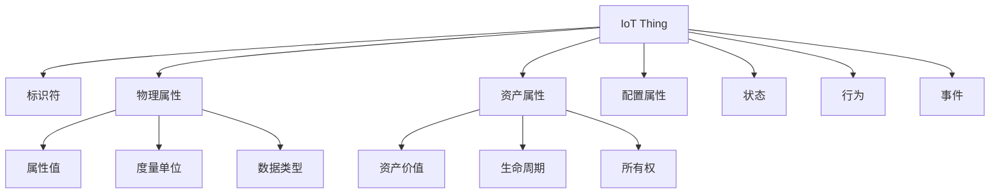

# IoT Things 知识图谱扩展设计

## 1. 概述

本文档描述了如何将IoT Things全面形式化建模框架集成到现有的IoT软件架构知识图谱中，实现概念的统一管理和关系建模。

### 1.1 扩展目标

1. **概念统一**：将IoT Things概念与现有知识图谱概念建立映射关系
2. **关系建模**：定义IoT Things与其他概念之间的语义关系
3. **标准集成**：映射开源标准到知识图谱概念
4. **应用场景**：支持实际应用场景的查询和推理
5. **动态更新**：支持知识图谱的动态扩展和更新

### 1.2 扩展策略

- **渐进式扩展**：保持现有知识图谱结构，逐步添加新概念
- **关系保持**：维护现有概念间的关系，建立新的关联
- **标准兼容**：确保与W3C SSN、oneM2M、OCF等标准的兼容性
- **查询优化**：优化知识图谱查询性能

## 2. 概念扩展设计

### 2.1 核心概念节点扩展

#### 2.1.1 IoT Thing 核心概念

```yaml
---
node_id: "IOT-THING-001"
version: "1.0"
created_date: "2025-01-27"
updated_date: "2025-01-27"
status: "active"
maturity: "established"
contributors: ["system_architect"]
tags: ["iot", "thing", "core", "formal_model"]
---

# IoT Thing

## 基本属性

- **定义**：IoT Thing是一个七元组 $\mathcal{T} = (I, P, A, C, S, B, E)$，表示物联网中的物理或逻辑实体
- **类别**：核心概念
- **层次**：跨层概念
- **标识符**：IOT-THING-001

## 关系属性

- **父概念**：
  - [IoT系统](链接) - is_part_of
  - [分布式系统](链接) - is_instance_of

- **子概念**：
  - [物理Thing](链接) - has_type
  - [逻辑Thing](链接) - has_type
  - [虚拟Thing](链接) - has_type

- **关联概念**：
  - [设备管理](链接) - managed_by
  - [边缘计算](链接) - deployed_on
  - [数据处理](链接) - generates_data
  - [安全架构](链接) - secured_by
  - [微服务](链接) - exposed_as
  - [工作流](链接) - participates_in

## 表征形式

### 数学模型

```math
\mathcal{T} = (I, P, A, C, S, B, E)
其中：
- I = \{id, name, type, category\} 是标识符集合
- P = \{p_1, p_2, ..., p_n\} 是物理属性集合
- A = \{a_1, a_2, ..., a_m\} 是资产属性集合
- C = \{c_1, c_2, ..., c_k\} 是配置属性集合
- S = \{s_1, s_2, ..., s_l\} 是状态集合
- B = \{b_1, b_2, ..., b_p\} 是行为集合
- E = \{e_1, e_2, ..., e_q\} 是事件集合
```

### 图形表示



### 代码实现

#### Rust实现

```rust
/// IoT Thing 核心模型
/// 
/// 基于形式化定义: T = (I, P, A, C, S, B, E)
pub struct IoTThing {
    pub identifier: ThingIdentifier,
    pub physical_properties: HashMap<String, PhysicalProperty>,
    pub asset_properties: HashMap<String, AssetProperty>,
    pub configuration: ThingConfiguration,
    pub state: ThingState,
    pub behaviors: Vec<ThingBehavior>,
    pub events: Vec<ThingEvent>,
}

impl IoTThing {
    /// 创建新的IoT Thing
    pub fn new(id: String, name: String, thing_type: ThingType) -> Self {
        Self {
            identifier: ThingIdentifier {
                id,
                name,
                type_: thing_type,
                category: ThingCategory::Physical,
            },
            physical_properties: HashMap::new(),
            asset_properties: HashMap::new(),
            configuration: ThingConfiguration::default(),
            state: ThingState::Initializing,
            behaviors: Vec::new(),
            events: Vec::new(),
        }
    }
    
    /// 添加物理属性
    pub fn add_physical_property(&mut self, name: String, property: PhysicalProperty) {
        self.physical_properties.insert(name, property);
    }
    
    /// 添加资产属性
    pub fn add_asset_property(&mut self, name: String, property: AssetProperty) {
        self.asset_properties.insert(name, property);
    }
}
```

#### Go实现

```go
// IoTThing 核心模型
type IoTThing struct {
    Identifier         ThingIdentifier            `json:"identifier"`
    PhysicalProperties map[string]PhysicalProperty `json:"physical_properties"`
    AssetProperties    map[string]AssetProperty   `json:"asset_properties"`
    Configuration      ThingConfiguration         `json:"configuration"`
    State              ThingState                 `json:"state"`
    Behaviors          []ThingBehavior            `json:"behaviors"`
    Events             []ThingEvent               `json:"events"`
}

// NewIoTThing 创建新的IoT Thing
func NewIoTThing(id, name string, thingType ThingType) *IoTThing {
    return &IoTThing{
        Identifier: ThingIdentifier{
            ID:       id,
            Name:     name,
            Type:     thingType,
            Category: ThingCategoryPhysical,
        },
        PhysicalProperties: make(map[string]PhysicalProperty),
        AssetProperties:    make(map[string]AssetProperty),
        Configuration:      NewThingConfiguration(),
        State:              ThingStateInitializing,
        Behaviors:          make([]ThingBehavior, 0),
        Events:             make([]ThingEvent, 0),
    }
}
```

## 3. 关系扩展设计

### 3.1 与现有概念的关系映射

#### 3.1.1 设备管理关系

```yaml
---
relationship_id: "THING-DEVICE-MGMT-001"
source_concept: "IOT-THING-001"
target_concept: "DEVICE-MANAGEMENT-001"
relationship_type: "managed_by"
properties:
  management_level: "full"
  lifecycle_stage: "operational"
  update_frequency: "dynamic"
---

# IoT Thing 与设备管理的关系

## 关系定义

- **关系类型**：managed_by（被管理）
- **关系描述**：IoT Thing通过设备管理系统进行生命周期管理
- **关系属性**：
  - management_level: 管理级别（full/partial/minimal）
  - lifecycle_stage: 生命周期阶段
  - update_frequency: 更新频率

## 关系实现

```rust
/// Thing与设备管理的关系
pub struct ThingDeviceManagementRelation {
    pub thing_id: ThingId,
    pub management_system_id: ManagementSystemId,
    pub management_level: ManagementLevel,
    pub lifecycle_stage: LifecycleStage,
    pub update_frequency: UpdateFrequency,
    pub policies: Vec<ManagementPolicy>,
}

impl ThingDeviceManagementRelation {
    pub fn new(thing_id: ThingId, mgmt_system_id: ManagementSystemId) -> Self {
        Self {
            thing_id,
            management_system_id: mgmt_system_id,
            management_level: ManagementLevel::Full,
            lifecycle_stage: LifecycleStage::Operational,
            update_frequency: UpdateFrequency::Dynamic,
            policies: Vec::new(),
        }
    }
}
```

#### 3.1.2 边缘计算关系

```yaml
---
relationship_id: "THING-EDGE-COMPUTING-001"
source_concept: "IOT-THING-001"
target_concept: "EDGE-COMPUTING-001"
relationship_type: "deployed_on"
properties:
  deployment_type: "edge_node"
  compute_capability: "limited"
  network_connectivity: "local"
---

# IoT Thing 与边缘计算的关系

## 关系定义

- **关系类型**：deployed_on（部署于）
- **关系描述**：IoT Thing部署在边缘计算节点上
- **关系属性**：
  - deployment_type: 部署类型
  - compute_capability: 计算能力
  - network_connectivity: 网络连接性

## 关系实现

```rust
/// Thing与边缘计算的关系
pub struct ThingEdgeComputingRelation {
    pub thing_id: ThingId,
    pub edge_node_id: EdgeNodeId,
    pub deployment_type: DeploymentType,
    pub compute_capability: ComputeCapability,
    pub network_connectivity: NetworkConnectivity,
    pub resource_allocation: ResourceAllocation,
}

impl ThingEdgeComputingRelation {
    pub fn new(thing_id: ThingId, edge_node_id: EdgeNodeId) -> Self {
        Self {
            thing_id,
            edge_node_id,
            deployment_type: DeploymentType::EdgeNode,
            compute_capability: ComputeCapability::Limited,
            network_connectivity: NetworkConnectivity::Local,
            resource_allocation: ResourceAllocation::default(),
        }
    }
}
```

### 3.2 新概念关系定义

#### 3.2.1 集群关系

```yaml
---
relationship_id: "THING-CLUSTER-001"
source_concept: "IOT-THING-001"
target_concept: "THING-CLUSTER-001"
relationship_type: "belongs_to"
properties:
  cluster_role: "member"
  relationship_type: "collaboration"
  priority_level: "normal"
---

# Thing集群关系

## 关系定义

- **关系类型**：belongs_to（属于）
- **关系描述**：IoT Thing属于某个集群
- **关系属性**：
  - cluster_role: 集群角色
  - relationship_type: 关系类型
  - priority_level: 优先级

## 关系实现

```rust
/// Thing集群关系
pub struct ThingClusterRelation {
    pub thing_id: ThingId,
    pub cluster_id: ClusterId,
    pub cluster_role: ClusterRole,
    pub relationship_type: RelationshipType,
    pub priority_level: PriorityLevel,
    pub collaboration_pattern: CollaborationPattern,
}

impl ThingClusterRelation {
    pub fn new(thing_id: ThingId, cluster_id: ClusterId) -> Self {
        Self {
            thing_id,
            cluster_id,
            cluster_role: ClusterRole::Member,
            relationship_type: RelationshipType::Collaboration,
            priority_level: PriorityLevel::Normal,
            collaboration_pattern: CollaborationPattern::PeerToPeer,
        }
    }
}
```

#### 3.2.2 区域控制关系

```yaml
---
relationship_id: "THING-ZONE-CONTROL-001"
source_concept: "IOT-THING-001"
target_concept: "ZONE-CONTROL-001"
relationship_type: "controlled_by"
properties:
  control_level: "autonomous"
  zone_type: "physical"
  control_policy: "optimization"
---

# Thing区域控制关系

## 关系定义

- **关系类型**：controlled_by（被控制）
- **关系描述**：IoT Thing被区域控制系统管理
- **关系属性**：
  - control_level: 控制级别
  - zone_type: 区域类型
  - control_policy: 控制策略

## 关系实现

```rust
/// Thing区域控制关系
pub struct ThingZoneControlRelation {
    pub thing_id: ThingId,
    pub zone_id: ZoneId,
    pub control_level: ControlLevel,
    pub zone_type: ZoneType,
    pub control_policy: ControlPolicy,
    pub autonomy_capability: AutonomyCapability,
}

impl ThingZoneControlRelation {
    pub fn new(thing_id: ThingId, zone_id: ZoneId) -> Self {
        Self {
            thing_id,
            zone_id,
            control_level: ControlLevel::Autonomous,
            zone_type: ZoneType::Physical,
            control_policy: ControlPolicy::Optimization,
            autonomy_capability: AutonomyCapability::default(),
        }
    }
}
```

## 4. 标准集成映射

### 4.1 W3C SSN标准映射

```yaml
---
mapping_id: "SSN-MAPPING-001"
source_standard: "W3C-SSN"
target_concept: "IOT-THING-001"
mapping_type: "concept_mapping"
---

# W3C SSN标准映射

## 映射关系

- **SSN Sensor** ↔ **IoT Thing**
- **SSN Property** ↔ **Physical Property**
- **SSN Observation** ↔ **Event**
- **SSN Deployment** ↔ **Configuration**

## 映射实现

```rust
/// SSN标准映射
pub struct SSNMapping {
    pub thing_to_sensor: HashMap<ThingId, SSN::Sensor>,
    pub property_to_ssn_property: HashMap<PropertyId, SSN::Property>,
    pub observation_to_ssn_observation: HashMap<ObservationId, SSN::Observation>,
}

impl SSNMapping {
    /// 将IoT Thing映射到SSN Sensor
    pub fn map_thing_to_ssn(&self, thing: &IoTThing) -> SSN::Sensor {
        SSN::Sensor {
            id: thing.identifier.id.clone(),
            observes: thing.physical_properties.iter()
                .map(|(_, prop)| self.map_property_to_ssn(prop))
                .collect(),
            has_deployment: self.map_deployment(thing),
        }
    }
    
    /// 将物理属性映射到SSN Property
    pub fn map_property_to_ssn(&self, property: &PhysicalProperty) -> SSN::Property {
        SSN::Property {
            id: property.name.clone(),
            name: property.name.clone(),
            unit: property.unit.clone(),
            data_type: self.map_data_type(&property.data_type),
        }
    }
}
```

### 4.2 oneM2M标准映射

```yaml
---
mapping_id: "ONEM2M-MAPPING-001"
source_standard: "ONEM2M"
target_concept: "IOT-THING-001"
mapping_type: "concept_mapping"
---

# oneM2M标准映射

## 映射关系

- **oneM2M AE** ↔ **IoT Thing**
- **oneM2M Container** ↔ **Data Storage**
- **oneM2M Subscription** ↔ **Event Subscription**
- **oneM2M Policy** ↔ **Control Policy**

## 映射实现

```rust
/// oneM2M标准映射
pub struct OneM2MMapping {
    pub thing_to_ae: HashMap<ThingId, OneM2M::AE>,
    pub container_mapping: HashMap<ThingId, OneM2M::Container>,
    pub subscription_mapping: HashMap<ThingId, OneM2M::Subscription>,
}

impl OneM2MMapping {
    /// 将IoT Thing映射到oneM2M AE
    pub fn map_thing_to_ae(&self, thing: &IoTThing) -> OneM2M::AE {
        OneM2M::AE {
            id: thing.identifier.id.clone(),
            name: thing.identifier.name.clone(),
            app_id: format!("iot_thing_{}", thing.identifier.id),
            ae_type: thing.identifier.type_.to_string(),
        }
    }
    
    /// 创建oneM2M容器映射
    pub fn create_container_mapping(&self, thing: &IoTThing) -> OneM2M::Container {
        OneM2M::Container {
            id: format!("container_{}", thing.identifier.id),
            name: format!("{}_container", thing.identifier.name),
            parent_id: thing.identifier.id.clone(),
            max_byte_size: 1000000,
            max_instance_count: 100,
        }
    }
}
```

## 5. 应用场景扩展

### 5.1 智能工厂场景

```yaml
---
scenario_id: "SMART-FACTORY-001"
scenario_name: "智能工厂设备集群管理"
concepts_involved:
  - "IOT-THING-001"
  - "THING-CLUSTER-001"
  - "ZONE-CONTROL-001"
  - "EDGE-COMPUTING-001"
---

# 智能工厂应用场景

## 场景描述

在智能工厂中，多个IoT Things（机器人、传感器、传送带等）组成集群，通过区域控制系统进行自治管理。

## 知识图谱查询

```cypher
// 查询工厂设备集群
MATCH (t:IoTThing)-[:BELONGS_TO]->(c:ThingCluster)
WHERE c.scenario = "smart_factory"
RETURN t, c

// 查询区域控制关系
MATCH (t:IoTThing)-[:CONTROLLED_BY]->(z:ZoneControl)
WHERE z.zone_type = "physical"
RETURN t, z

// 查询边缘部署
MATCH (t:IoTThing)-[:DEPLOYED_ON]->(e:EdgeComputing)
WHERE e.deployment_type = "edge_node"
RETURN t, e
```

## 场景实现

```rust
/// 智能工厂场景实现
pub struct SmartFactoryScenario {
    pub factory_cluster: ThingCluster,
    pub zone_control: ZoneControl,
    pub edge_nodes: Vec<EdgeNode>,
}

impl SmartFactoryScenario {
    pub fn new() -> Self {
        let factory_cluster = ThingCluster {
            id: "factory_cluster_001".to_string(),
            name: "智能工厂集群".to_string(),
            members: vec![
                IoTThing::new("robot_arm_001".to_string(), "机器人手臂".to_string(), ThingType::Robot),
                IoTThing::new("sensor_001".to_string(), "温度传感器".to_string(), ThingType::Sensor),
                IoTThing::new("conveyor_001".to_string(), "传送带".to_string(), ThingType::Conveyor),
            ],
            relationships: vec![
                ClusterRelationship::Collaboration("robot_arm_001".to_string(), "conveyor_001".to_string()),
                ClusterRelationship::Dependency("sensor_001".to_string(), "robot_arm_001".to_string()),
            ],
            lifecycle: ClusterLifecycle::Operational,
            goals: vec![ClusterGoal::MaximizeEfficiency, ClusterGoal::MinimizeDowntime],
        };
        
        let zone_control = ZoneControl {
            zones: vec![
                Zone::new("production_line_1".to_string(), ZoneType::Physical),
                Zone::new("quality_control".to_string(), ZoneType::Functional),
            ],
            things: HashMap::from([
                ("production_line_1".to_string(), vec![
                    IoTThing::new("robot_arm_001".to_string(), "机器人手臂".to_string(), ThingType::Robot),
                    IoTThing::new("conveyor_001".to_string(), "传送带".to_string(), ThingType::Conveyor),
                ]),
            ]),
            controllers: vec![
                ZoneController::new("production_controller".to_string()),
            ],
            policies: vec![
                ZonePolicy::ProductionOptimization,
                ZonePolicy::SafetyFirst,
            ],
            boundaries: vec![
                ZoneBoundary::Geographic(GeoBounds::new(0.0, 0.0, 100.0, 100.0)),
            ],
            autonomy: vec![
                AutonomyCapability::SelfManagement,
                AutonomyCapability::SelfOptimization,
            ],
        };
        
        Self {
            factory_cluster,
            zone_control,
            edge_nodes: vec![
                EdgeNode::new("edge_node_001".to_string(), "生产区域边缘节点".to_string()),
            ],
        }
    }
}
```

### 5.2 智慧城市场景

```yaml
---
scenario_id: "SMART-CITY-001"
scenario_name: "智慧城市交通管理"
concepts_involved:
  - "IOT-THING-001"
  - "ZONE-CONTROL-001"
  - "EDGE-COMPUTING-001"
  - "DATA-PROCESSING-001"
---

# 智慧城市应用场景

## 场景描述

在智慧城市中，交通信号灯、摄像头、传感器等IoT Things通过区域控制系统进行交通流量优化管理。

## 知识图谱查询

```cypher
// 查询交通设备
MATCH (t:IoTThing)
WHERE t.type IN ["traffic_light", "camera", "sensor"]
RETURN t

// 查询区域控制策略
MATCH (z:ZoneControl)-[:HAS_POLICY]->(p:ZonePolicy)
WHERE p.policy_type = "traffic_optimization"
RETURN z, p

// 查询边缘计算部署
MATCH (t:IoTThing)-[:DEPLOYED_ON]->(e:EdgeComputing)
WHERE e.location = "downtown"
RETURN t, e
```

## 场景实现1

```rust
/// 智慧城市场景实现
pub struct SmartCityScenario {
    pub traffic_zone: ZoneControl,
    pub edge_nodes: Vec<EdgeNode>,
    pub data_processing: DataProcessingSystem,
}

impl SmartCityScenario {
    pub fn new() -> Self {
        let traffic_zone = ZoneControl {
            zones: vec![
                Zone::new("downtown".to_string(), ZoneType::Physical),
                Zone::new("highway".to_string(), ZoneType::Physical),
            ],
            things: HashMap::from([
                ("downtown".to_string(), vec![
                    IoTThing::new("traffic_light_001".to_string(), "交通信号灯".to_string(), ThingType::TrafficLight),
                    IoTThing::new("camera_001".to_string(), "监控摄像头".to_string(), ThingType::Camera),
                    IoTThing::new("sensor_001".to_string(), "流量传感器".to_string(), ThingType::Sensor),
                ]),
            ]),
            controllers: vec![
                ZoneController::new("downtown_controller".to_string()),
            ],
            policies: vec![
                ZonePolicy::TrafficOptimization,
                ZonePolicy::EmergencyPriority,
            ],
            boundaries: vec![
                ZoneBoundary::Geographic(GeoBounds::new(0.0, 0.0, 500.0, 500.0)),
            ],
            autonomy: vec![
                AutonomyCapability::SelfManagement,
                AutonomyCapability::SelfOptimization,
            ],
        };
        
        Self {
            traffic_zone,
            edge_nodes: vec![
                EdgeNode::new("edge_node_downtown".to_string(), "市中心边缘节点".to_string()),
            ],
            data_processing: DataProcessingSystem::new(),
        }
    }
}
```

## 6. 知识图谱更新机制

### 6.1 动态更新策略

```rust
/// 知识图谱更新管理器
pub struct KnowledgeGraphUpdateManager {
    pub concept_updates: Vec<ConceptUpdate>,
    pub relationship_updates: Vec<RelationshipUpdate>,
    pub mapping_updates: Vec<MappingUpdate>,
    pub validation_rules: Vec<ValidationRule>,
}

impl KnowledgeGraphUpdateManager {
    /// 添加新的IoT Thing概念
    pub fn add_iot_thing(&mut self, thing: &IoTThing) -> Result<(), UpdateError> {
        let concept_update = ConceptUpdate {
            operation: UpdateOperation::Add,
            concept_id: format!("IOT-THING-{}", thing.identifier.id),
            concept_type: "IoTThing".to_string(),
            properties: self.extract_thing_properties(thing),
            timestamp: SystemTime::now(),
        };
        
        self.concept_updates.push(concept_update);
        self.validate_update()?;
        Ok(())
    }
    
    /// 添加Thing关系
    pub fn add_thing_relationship(&mut self, relation: &ThingRelationship) -> Result<(), UpdateError> {
        let relationship_update = RelationshipUpdate {
            operation: UpdateOperation::Add,
            relationship_id: format!("REL-{}", relation.id),
            source_concept: relation.source_id.clone(),
            target_concept: relation.target_id.clone(),
            relationship_type: relation.relationship_type.clone(),
            properties: relation.properties.clone(),
            timestamp: SystemTime::now(),
        };
        
        self.relationship_updates.push(relationship_update);
        self.validate_update()?;
        Ok(())
    }
    
    /// 验证更新
    fn validate_update(&self) -> Result<(), UpdateError> {
        for rule in &self.validation_rules {
            rule.validate(&self.concept_updates, &self.relationship_updates)?;
        }
        Ok(())
    }
}
```

### 6.2 查询优化

```rust
/// 知识图谱查询优化器
pub struct KnowledgeGraphQueryOptimizer {
    pub index_manager: IndexManager,
    pub cache_manager: CacheManager,
    pub query_planner: QueryPlanner,
}

impl KnowledgeGraphQueryOptimizer {
    /// 优化IoT Thing查询
    pub fn optimize_thing_query(&self, query: &str) -> OptimizedQuery {
        let parsed_query = self.parse_query(query);
        let optimized_plan = self.query_planner.optimize(&parsed_query);
        
        OptimizedQuery {
            original_query: query.to_string(),
            optimized_plan,
            estimated_cost: self.estimate_cost(&optimized_plan),
            cache_hints: self.generate_cache_hints(&optimized_plan),
        }
    }
    
    /// 生成缓存提示
    fn generate_cache_hints(&self, plan: &QueryPlan) -> Vec<CacheHint> {
        let mut hints = Vec::new();
        
        // 为频繁查询的Thing属性生成缓存提示
        if plan.involves_concept("IoTThing") {
            hints.push(CacheHint::CacheConcept("IoTThing".to_string()));
            hints.push(CacheHint::CacheProperty("physical_properties".to_string()));
            hints.push(CacheHint::CacheProperty("asset_properties".to_string()));
        }
        
        // 为集群关系生成缓存提示
        if plan.involves_relationship("BELONGS_TO") {
            hints.push(CacheHint::CacheRelationship("BELONGS_TO".to_string()));
        }
        
        hints
    }
}
```

## 7. 质量保证

### 7.1 一致性检查

```rust
/// 知识图谱一致性检查器
pub struct KnowledgeGraphConsistencyChecker {
    pub consistency_rules: Vec<ConsistencyRule>,
    pub validation_engine: ValidationEngine,
}

impl KnowledgeGraphConsistencyChecker {
    /// 检查IoT Thing概念一致性
    pub fn check_thing_consistency(&self, thing: &IoTThing) -> ConsistencyReport {
        let mut report = ConsistencyReport::new();
        
        // 检查标识符唯一性
        self.check_identifier_uniqueness(thing, &mut report);
        
        // 检查属性完整性
        self.check_property_completeness(thing, &mut report);
        
        // 检查关系一致性
        self.check_relationship_consistency(thing, &mut report);
        
        // 检查标准映射一致性
        self.check_standard_mapping_consistency(thing, &mut report);
        
        report
    }
    
    /// 检查标识符唯一性
    fn check_identifier_uniqueness(&self, thing: &IoTThing, report: &mut ConsistencyReport) {
        // 实现标识符唯一性检查逻辑
        if self.identifier_exists(&thing.identifier.id) {
            report.add_violation(ConsistencyViolation::DuplicateIdentifier(
                thing.identifier.id.clone()
            ));
        }
    }
}
```

### 7.2 性能监控

```rust
/// 知识图谱性能监控器
pub struct KnowledgeGraphPerformanceMonitor {
    pub metrics_collector: MetricsCollector,
    pub performance_analyzer: PerformanceAnalyzer,
    pub alert_manager: AlertManager,
}

impl KnowledgeGraphPerformanceMonitor {
    /// 监控查询性能
    pub fn monitor_query_performance(&self, query: &str, execution_time: Duration) {
        let metric = QueryPerformanceMetric {
            query: query.to_string(),
            execution_time,
            timestamp: SystemTime::now(),
            resource_usage: self.collect_resource_usage(),
        };
        
        self.metrics_collector.record_metric(metric);
        
        // 检查性能阈值
        if execution_time > Duration::from_millis(1000) {
            self.alert_manager.send_alert(Alert::SlowQuery(query.to_string()));
        }
    }
    
    /// 监控更新性能
    pub fn monitor_update_performance(&self, update_type: UpdateType, processing_time: Duration) {
        let metric = UpdatePerformanceMetric {
            update_type,
            processing_time,
            timestamp: SystemTime::now(),
            success: true,
        };
        
        self.metrics_collector.record_metric(metric);
    }
}
```

## 8. 总结

本IoT Things知识图谱扩展设计提供了：

1. **概念统一管理**：将IoT Things概念与现有知识图谱概念建立映射关系
2. **关系建模**：定义了IoT Things与其他概念之间的语义关系
3. **标准集成**：实现了与W3C SSN、oneM2M、OCF等标准的映射
4. **应用场景支持**：提供了智能工厂、智慧城市等实际应用场景的查询和推理
5. **动态更新机制**：支持知识图谱的动态扩展和更新
6. **质量保证**：提供了一致性检查和性能监控机制

该扩展设计为IoT Things的全面知识管理提供了完整的解决方案，支持构建更加智能、自治、安全的IoT系统。

---

**文档版本**：v1.0  
**创建日期**：2024年12月28日  
**状态**：初始版本  
**下一步**：实施知识图谱扩展计划
