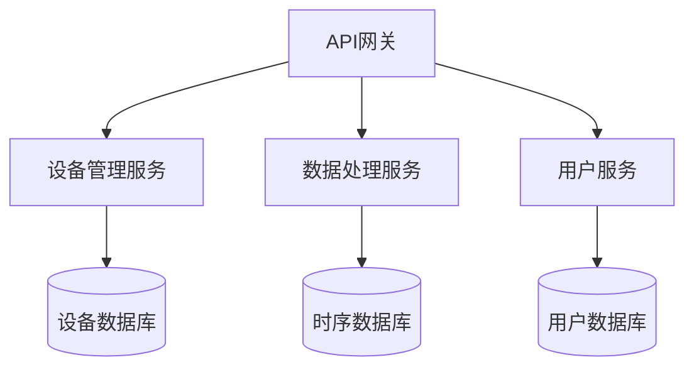

# IoT行业软件架构递归迭代开发流程指南

## 1. 递归迭代开发概述

递归迭代开发是一种结合递归分解和迭代改进的软件开发方法，特别适用于复杂的IoT软件架构分析与设计项目。本指南详细说明如何在IoT行业软件架构项目中实施递归迭代开发流程。

## 2. 核心原则

### 2.1 递归分解原则

- **自顶向下分解**：将复杂问题分解为更小、更易管理的子问题
- **层次化结构**：建立清晰的层次结构，确保各层次间的关系明确
- **边界清晰**：明确定义每个子问题的边界和接口
- **自相似性**：子问题采用与原问题相似的解决方案结构

### 2.2 迭代改进原则

- **增量开发**：每次迭代交付可用的功能增量
- **持续反馈**：收集反馈并据此调整后续迭代
- **适应变化**：设计具有足够灵活性，能够适应需求变化
- **持续优化**：不断改进已有内容，提高质量

## 3. 递归迭代开发流程

### 3.1 五层递归分解结构

IoT软件架构采用五层递归分解结构：

1. **L1 行业架构层**：IoT行业整体架构框架
2. **L2 企业架构层**：特定企业或组织的IoT架构
3. **L3 系统架构层**：具体IoT系统的架构设计
4. **L4 子系统架构层**：系统内各子系统的架构设计
5. **L5 模块设计层**：子系统内各模块的详细设计

### 3.2 迭代周期

每个递归层次都遵循以下迭代周期：

1. **分析阶段** (1-2周)
   - 需求分析与提炼
   - 形式化定义关键概念
   - 建立理论模型和证明

2. **设计阶段** (1-2周)
   - 架构设计与评估
   - 接口定义与协议设计
   - 算法选择与优化

3. **实现阶段** (2-3周)
   - 开发Rust和Go的代码实现
   - 构建测试用例和性能测试
   - 验证理论模型与实现的一致性

4. **文档阶段** (1-2周)
   - 撰写形式化文档
   - 创建图表和可视化表示
   - 集成到知识图谱中

5. **评审阶段** (1周)
   - 同行评审内容质量
   - 验证形式化定义正确性
   - 测试代码实现可用性

6. **迭代规划阶段** (0.5周)
   - 根据评审反馈规划下一个迭代
   - 更新知识图谱和上下文管理
   - 调整优先级和资源分配

### 3.3 递归迭代矩阵

递归迭代开发采用矩阵方式组织，横向为递归层次，纵向为迭代周期：

| 递归层次 | 分析阶段 | 设计阶段 | 实现阶段 | 文档阶段 | 评审阶段 | 迭代规划 |
|---------|---------|---------|---------|---------|---------|---------|
| L1 行业架构层 | L1-A | L1-D | L1-I | L1-Doc | L1-R | L1-P |
| L2 企业架构层 | L2-A | L2-D | L2-I | L2-Doc | L2-R | L2-P |
| L3 系统架构层 | L3-A | L3-D | L3-I | L3-Doc | L3-R | L3-P |
| L4 子系统架构层 | L4-A | L4-D | L4-I | L4-Doc | L4-R | L4-P |
| L5 模块设计层 | L5-A | L5-D | L5-I | L5-Doc | L5-R | L5-P |

## 4. 递归分解实践指南

### 4.1 问题分解策略

1. **功能分解**：按功能划分子问题

   ```text
   IoT系统 → 设备管理 + 数据处理 + 通信 + 安全 + 应用服务
   ```

2. **层次分解**：按系统层次划分子问题

   ```text
   IoT架构 → 感知层 + 边缘层 + 通信层 + 数据层 + 服务层 + 应用层
   ```

3. **领域分解**：按业务领域划分子问题

   ```text
   IoT应用 → 工业IoT + 智慧城市 + 智能家居 + 车联网 + 医疗IoT
   ```

### 4.2 递归终止条件

递归分解应在满足以下条件之一时终止：

1. **问题足够简单**：可以直接解决，无需进一步分解
2. **已有现成解决方案**：可以直接采用或轻微调整现有方案
3. **达到预定分解深度**：通常在L5层次（模块设计层）终止
4. **收益递减**：进一步分解的收益小于成本

### 4.3 递归合成策略

完成子问题解决后，采用以下策略合成整体解决方案：

1. **接口合成**：通过预定义接口连接各子系统
2. **层次合成**：低层次组件为高层次组件提供服务
3. **横向集成**：同层次组件通过协议或事件机制协作
4. **垂直集成**：跨层次组件通过标准化接口集成

## 5. 迭代改进实践指南

### 5.1 迭代计划制定

每个迭代周期应明确定义：

1. **迭代目标**：本次迭代要达成的具体目标
2. **交付物**：本次迭代要产出的具体成果
3. **任务分解**：实现目标所需的具体任务
4. **时间安排**：各任务的时间分配和里程碑
5. **资源需求**：完成任务所需的人力和技术资源
6. **风险评估**：潜在风险及应对策略

### 5.2 迭代执行控制

迭代执行过程中应注意：

1. **日常同步**：团队成员间的定期沟通
2. **进度跟踪**：监控任务完成情况
3. **问题管理**：及时识别和解决问题
4. **变更控制**：评估和管理需求变更
5. **质量保证**：持续进行质量检查和测试

### 5.3 迭代评审与反思

每个迭代结束后应进行：

1. **成果评审**：评估交付物是否达到预期目标
2. **过程反思**：分析流程中的优点和问题
3. **经验总结**：记录经验教训，更新最佳实践
4. **调整计划**：根据反思结果调整后续迭代计划

## 6. 上下文管理与中断恢复

### 6.1 上下文记录

每次工作结束时，记录以下上下文信息：

1. **当前状态**：当前工作的完成程度
2. **待办事项**：下一步需要完成的任务
3. **关键决策**：已做出的重要决策及理由
4. **未解决问题**：尚未解决的问题和思考方向
5. **参考资源**：相关的文档、代码和外部资源

### 6.2 中断恢复机制

工作中断后，通过以下步骤快速恢复：

1. **回顾上下文**：阅读上次记录的上下文信息
2. **状态确认**：验证当前系统状态与记录是否一致
3. **计划调整**：根据当前情况调整计划
4. **重新开始**：从中断点继续工作

### 6.3 上下文切换优化

频繁切换上下文时，采用以下策略提高效率：

1. **任务分块**：将大任务分解为独立的小任务
2. **完成度优先**：优先完成已开始的任务
3. **状态外部化**：将工作状态保存在外部系统
4. **自动化工具**：使用工具辅助上下文管理

## 7. 多表征内容管理

### 7.1 内容表征形式

每个主题应包含以下多种表征形式：

1. **形式化定义**：使用数学符号的严格定义
2. **理论模型**：概念的理论基础和模型
3. **图表表示**：使用Mermaid绘制的图表
4. **表格数据**：结构化的表格数据
5. **数学公式**：使用LaTeX的数学表达式
6. **形式化证明**：关键性质的形式化证明
7. **代码实现**：Rust和Go的参考实现
8. **最佳实践**：行业最佳实践和应用案例

### 7.2 表征间一致性

确保不同表征形式之间的一致性：

1. **概念映射**：明确定义各表征间的概念映射
2. **同步更新**：一个表征更新时同步更新其他表征
3. **交叉引用**：在不同表征间建立明确的引用关系
4. **一致性检查**：定期验证各表征间的一致性

### 7.3 表征选择指南

根据不同场景选择合适的表征形式：

1. **理论探讨**：优先使用形式化定义和数学公式
2. **架构设计**：优先使用图表表示和理论模型
3. **实现指导**：优先使用代码实现和最佳实践
4. **性能分析**：优先使用表格数据和数学公式
5. **教学培训**：综合使用多种表征形式

## 8. 质量保证与持续改进

### 8.1 质量指标

评估递归迭代开发质量的关键指标：

1. **形式化严谨性**：数学定义和证明的严谨程度
2. **内容一致性**：不同表征形式间的一致程度
3. **代码质量**：代码的可读性、效率和鲁棒性
4. **文档完整性**：文档覆盖的完整程度
5. **可用性**：内容对目标用户的实用程度

### 8.2 质量保证活动

确保质量的关键活动：

1. **同行评审**：专家对内容进行评审
2. **形式化验证**：使用工具验证形式化定义
3. **自动化测试**：对代码实现进行自动化测试
4. **一致性检查**：验证不同表征间的一致性
5. **用户反馈**：收集和分析用户反馈

### 8.3 持续改进机制

持续提高质量的机制：

1. **定期质量评估**：每季度进行全面质量评估
2. **改进计划制定**：根据评估结果制定改进计划
3. **最佳实践更新**：持续更新和完善最佳实践
4. **工具和流程优化**：改进开发工具和流程
5. **知识共享**：促进团队内的知识共享和学习

## 9. 递归迭代开发工具链

### 9.1 核心工具

支持递归迭代开发的核心工具：

1. **版本控制**：Git
2. **文档管理**：Markdown + LaTeX
3. **图表绘制**：Mermaid
4. **代码开发**：Rust和Go IDE
5. **形式化验证**：TLA+/Coq
6. **项目管理**：看板系统

### 9.2 工具集成

工具间的集成策略：

1. **文档代码一体化**：文档和代码在同一仓库
2. **自动化构建**：自动构建文档和代码
3. **持续集成**：自动化测试和验证
4. **知识库集成**：与知识图谱和术语表集成

### 9.3 工具使用指南

1. **Markdown格式规范**：
   - 使用ATX风格标题（# 标题）
   - 代码块使用三个反引号
   - 数学公式使用LaTeX语法

2. **Mermaid图表规范**：
   - 使用标准Mermaid语法
   - 图表应包含标题和图例
   - 节点和边应有清晰的标签

3. **代码规范**：
   - 遵循Rust和Go的官方代码风格
   - 使用英文注释，必要时附中文翻译
   - 关键算法应有性能分析

## 10. 实例：递归迭代开发IoT微服务架构

### 10.1 递归分解示例

**L1 行业架构层**：IoT微服务架构整体框架
  ↓
**L2 企业架构层**：特定企业的IoT微服务架构
  ↓
**L3 系统架构层**：设备管理微服务系统架构
  ↓
**L4 子系统架构层**：设备注册子系统架构
  ↓
**L5 模块设计层**：设备身份验证模块设计

### 10.2 迭代周期示例

**迭代1**：基本框架和核心概念

- 定义微服务架构的形式化模型
- 设计基本服务发现机制
- 实现简单的服务注册和发现

**迭代2**：服务通信和数据一致性

- 形式化定义服务间通信模型
- 设计数据一致性保证机制
- 实现可靠的服务间通信

**迭代3**：弹性和容错

- 形式化定义系统弹性模型
- 设计容错和自愈机制
- 实现熔断器和重试策略

### 10.3 多表征示例

**形式化定义**：

```text
定义 1 (微服务系统). 微服务系统是一个三元组 S = (M, C, D)，其中：
- M 是微服务集合
- C 是通信通道集合
- D 是数据存储集合
```

**图表表示**：



**代码实现**：

```rust
pub struct MicroserviceSystem<T> {
    services: Vec<Service<T>>,
    communication_channels: Vec<Channel>,
    data_stores: Vec<DataStore>,
}

impl<T> MicroserviceSystem<T> {
    pub fn new() -> Self {
        MicroserviceSystem {
            services: Vec::new(),
            communication_channels: Vec::new(),
            data_stores: Vec::new(),
        }
    }
    
    pub fn add_service(&mut self, service: Service<T>) {
        self.services.push(service);
    }
    
    // 其他方法...
}
```

## 11. 总结

递归迭代开发方法结合了递归分解的系统性和迭代改进的灵活性，特别适合复杂的IoT软件架构项目。通过五层递归分解结构和六阶段迭代周期，可以有效管理项目复杂度，确保产出高质量的成果。

多表征内容管理和上下文管理机制进一步增强了开发过程的连续性和内容的完整性。质量保证与持续改进机制则确保了项目的长期可持续发展。

---

**最后更新**: 2025年6月21日  
**文档版本**: v1.0  
**状态**: 已审核
