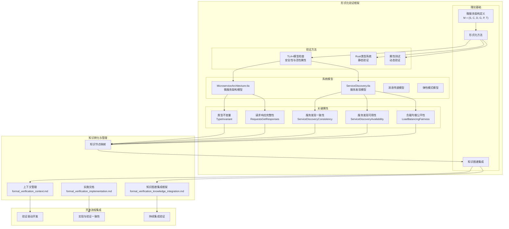

# IoT架构形式化验证架构概览

## 1. 形式化验证架构

本文档提供IoT架构形式化验证框架的高级概览，展示了验证组件、方法、关键属性以及与知识图谱和开发流程的集成关系。该架构旨在通过严格的数学方法确保IoT架构设计的正确性和可靠性，特别是在分布式系统和微服务架构场景中。

### 1.1 架构图

下图展示了形式化验证架构的组成部分及其相互关系：



## 2. 架构组件说明

### 2.1 理论基础

- **微服务架构定义**：基于六元组 `M = (S, C, D, G, P, T)` 的形式化定义，作为所有验证工作的理论基础
- **形式化方法**：用于验证的数学方法和工具，包括TLA+、形式化类型系统等
- **知识图谱集成**：将验证结果转化为结构化知识并集成到知识图谱的方法论

### 2.2 验证方法

- **TLA+模型检查**：使用时态逻辑验证系统安全性和活性属性
- **Rust类型系统**：利用Rust的类型系统进行静态验证，确保实现的类型安全
- **属性测试**：通过生成测试用例验证系统属性和不变量

### 2.3 系统模型

- **微服务架构模型**：描述整体微服务架构的TLA+模型
- **服务发现模型**：专注于服务注册、发现和负载均衡的TLA+模型
- **消息传递模型**：描述同步和异步消息传递机制的模型
- **弹性模式模型**：描述系统容错和恢复机制的模型

### 2.4 关键属性

- **类型不变量**：确保系统状态始终维持在有效类型范围内
- **服务发现一致性**：确保服务发现结果与实际系统状态一致
- **服务发现可用性**：确保存在健康实例时总能被发现
- **负载均衡公平性**：确保请求在服务实例间公平分配
- **请求响应完整性**：确保每个请求最终会收到响应

## 3. 知识转化与管理

### 3.1 知识节点映射

验证结果通过知识节点映射转化为知识图谱中的结构化知识：

```text
验证结果 → 知识节点 → 知识图谱
```

主要的知识节点类型包括：

- **形式化模型节点**：记录模型定义、属性和验证状态
- **验证属性节点**：记录属性定义、形式化表达和验证结果
- **验证结果节点**：记录具体验证执行结果和发现

### 3.2 上下文管理

形式化验证上下文管理文件(`formal_verification_context.md`)记录当前验证工作状态：

- 当前验证重点和进度
- 已验证和待验证属性
- 验证决策和思考路径
- 中断恢复指南

### 3.3 文档体系

形式化验证文档体系包括：

- **实施框架**：形式化验证方法、流程和工具的详细说明
- **知识图谱集成框架**：验证结果如何转化为知识并集成到知识图谱
- **验证报告**：具体验证执行结果的详细报告

## 4. 开发流程集成

### 4.1 验证驱动开发

形式化验证作为开发流程的驱动力：

1. 先建立形式化模型并验证关键属性
2. 基于验证通过的模型实现代码
3. 通过实现验证确保代码符合模型

### 4.2 持续集成验证

将形式化验证集成到持续集成流程：

- 代码提交时自动运行验证
- 跟踪验证覆盖率和结果
- 防止引入违反已验证属性的变更

### 4.3 实现与验证一致性

确保代码实现与形式化模型保持一致：

- 代码实现追踪到形式化定义
- 关键实现决策与形式化模型对应
- 实现变更同步更新形式化模型

## 5. 当前实施状态

### 5.1 已完成组件

- 微服务架构基本形式化定义 (`M = (S, C, D, G, P, T)`)
- 微服务架构TLA+模型 (`MicroserviceArchitecture.tla`)
- 服务发现TLA+模型 (`ServiceDiscovery.tla`)
- 服务发现Rust实现 (`service_discovery.rs`)
- 基本属性和不变量定义
- 形式化验证文档体系

### 5.2 进行中工作

- 负载均衡验证
- 弹性模式形式化模型
- 验证结果转化为知识节点
- 验证与知识图谱的深度集成

### 5.3 计划工作

- 分布式一致性验证
- 边缘计算形式化模型
- 验证自动化工具
- 验证模式库建设

## 6. 结论与展望

形式化验证架构为IoT系统提供了严格的验证框架，通过将数学方法与工程实践相结合，确保系统设计的正确性和可靠性。随着验证工作的深入和知识的积累，形式化验证将成为IoT架构递归迭代开发中的关键驱动力和质量保障机制。

未来，我们将扩展验证范围到更多IoT架构关键组件，提升验证自动化程度，并建立完整的IoT验证模式库，为行业提供可靠、高质量的架构设计参考。

---

**文档版本**：v1.0
**创建日期**：2025年7月2日
**状态**：初稿
