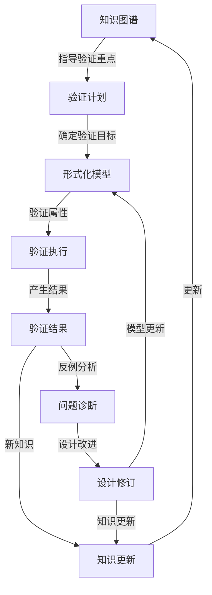

# 形式化验证与知识图谱集成框架

## 1. 概述

本文档描述了IoT架构形式化验证与知识图谱的集成框架，作为递归迭代开发方法的关键组成部分。通过这种集成，形式化验证的结果和发现可以系统化地转化为可重用的知识，并在整个开发过程中有效应用。

### 1.1 集成目标

1. **知识扩充**：将形式化验证的结果转化为结构化知识，丰富知识图谱
2. **模型重用**：促进形式化模型和属性的重用，避免重复工作
3. **决策支持**：为架构决策提供形式化验证的证据和依据
4. **上下文增强**：提供与验证相关的上下文信息，支持开发过程
5. **持续改进**：通过验证结果的积累，持续改进架构模型和设计

### 1.2 集成策略概述

形式化验证与知识图谱的集成采用以下策略：

1. **形式化模型映射**：将TLA+和Rust模型映射到知识图谱的概念节点
2. **验证属性建模**：将系统属性和不变量表示为知识节点的关系
3. **验证结果转化**：将验证结果转化为知识图谱中的知识断言
4. **模型演化追踪**：记录形式化模型的演化历史和设计决策
5. **知识引导验证**：利用知识图谱指导验证过程和重点

## 2. 知识节点映射

### 2.1 形式化模型节点

每个形式化模型在知识图谱中表示为标准化的知识节点：

```markdown
## [形式化模型名称]

### 基本属性
- **定义**：[形式化定义]
- **类别**：形式化模型
- **层次**：系统/子系统/模块
- **标识符**：MODEL-[ID]

### 关系属性
- **验证目标**：[验证的概念节点]
- **使用属性**：[使用的属性列表]
- **依赖模型**：[依赖的其他模型]
- **实现映射**：[对应的代码实现]

### 表征形式
- **TLA+规范**：[TLA+模块链接]
- **Rust实现**：[Rust模块链接]
- **验证报告**：[验证结果报告链接]
- **可视化表示**：[状态机或其他图形表示]

### 演化历史
- **版本**：[版本历史]
- **变更原因**：[变更日志]
- **验证状态**：[当前验证状态]
```

### 2.2 验证属性节点

系统属性和不变量表示为独立的知识节点：

```markdown
## [属性名称]

### 基本属性
- **定义**：[形式化定义]
- **类别**：安全性/活性/不变量
- **重要程度**：关键/高/中/低
- **标识符**：PROP-[ID]

### 关系属性
- **适用概念**：[相关概念节点]
- **适用模型**：[相关形式化模型]
- **依赖属性**：[依赖的其他属性]
- **验证状态**：已验证/部分验证/未验证

### 表征形式
- **TLA+表达式**：[TLA+表达式]
- **Rust断言**：[Rust实现]
- **自然语言描述**：[描述]
- **反例模式**：[典型反例模式]
```

### 2.3 验证结果节点

验证结果作为知识图谱中的事实断言：

```markdown
## [验证结果标题]

### 基本属性
- **结果类型**：验证通过/反例/不确定
- **验证日期**：[日期]
- **验证工具**：[工具信息]
- **标识符**：RESULT-[ID]

### 关系属性
- **验证模型**：[相关模型]
- **验证属性**：[相关属性]
- **影响概念**：[受影响的概念]
- **后续行动**：[建议的后续行动]

### 详细信息
- **验证范围**：[状态空间大小等]
- **反例描述**：[如有反例，详细描述]
- **根本原因**：[失败原因分析]
- **修正建议**：[修正方法]

### 相关资源
- **详细报告**：[报告链接]
- **相关代码**：[代码链接]
- **状态图**：[状态图链接]
```

## 3. 知识图谱扩展

### 3.1 形式化验证本体扩展

扩展知识图谱本体以支持形式化验证：

1. **新概念类型**
   - `FormalModel`：形式化模型
   - `Property`：系统属性
   - `Invariant`：系统不变量
   - `VerificationResult`：验证结果

2. **新关系类型**
   - `verifies`：模型验证属性的关系
   - `exhibited_by`：属性由概念展现的关系
   - `contradicts`：属性或结果相矛盾的关系
   - `evolves_to`：模型演化关系

3. **新属性类型**
   - `verification_status`：验证状态
   - `verification_coverage`：验证覆盖率
   - `counterexample_exists`：是否存在反例
   - `verification_date`：验证日期

### 3.2 形式化方法知识域

创建形式化方法专用知识域：

1. **形式化语言**
   - TLA+基础
   - TLA+高级模式
   - Rust类型系统形式化特性

2. **验证模式**
   - 分布式共识验证模式
   - 并发控制验证模式
   - 服务发现验证模式
   - 故障处理验证模式

3. **常见反例模式**
   - 竞争条件模式
   - 死锁模式
   - 活锁模式
   - 数据不一致模式

4. **验证策略**
   - 增量验证策略
   - 抽象缩减策略
   - 组合验证策略
   - 假设引导策略

## 4. 验证驱动知识发现

### 4.1 基于验证的知识发现流程

利用形式化验证作为知识发现的驱动力：

1. **验证计划制定**
   - 基于知识图谱识别关键概念和属性
   - 分析概念间的交互和依赖
   - 确定验证优先级

2. **模型构建与映射**
   - 构建形式化模型
   - 将模型映射到知识节点
   - 记录建模决策和假设

3. **验证执行与分析**
   - 执行形式化验证
   - 分析验证结果
   - 识别新的见解和模式

4. **知识整合与更新**
   - 创建新的知识节点
   - 更新现有知识
   - 建立新的关系和连接

### 4.2 验证反馈循环

建立验证结果与知识更新的反馈循环：



## 5. 上下文管理集成

### 5.1 验证上下文记录

在上下文管理文件中增加验证相关部分：

```markdown
## 形式化验证状态

### 已验证属性
- **[属性1]**: 已验证 (2025-06-29) - [结果链接]
- **[属性2]**: 已验证 (2025-06-30) - [结果链接]
- **[属性3]**: 验证失败 (2025-07-01) - [反例链接]

### 待验证属性
- **[属性4]**: 计划验证
- **[属性5]**: 正在构建模型

### 验证假设
- **[假设1]**: [描述] - 影响 [属性列表]
- **[假设2]**: [描述] - 影响 [属性列表]

### 验证决策
- **[决策1]**: [描述] (2025-06-29) - 原因: [原因]
- **[决策2]**: [描述] (2025-07-01) - 原因: [原因]
```

### 5.2 验证中断恢复

支持验证工作的中断恢复：

1. **验证状态快照**
   - 记录当前验证模型和属性
   - 保存中间验证结果
   - 记录验证参数和配置

2. **验证上下文切换**
   - 支持不同验证任务间的切换
   - 记录任务间的依赖关系
   - 提供快速恢复机制

3. **验证延续标记**
   - 标记验证中断点
   - 记录下一步验证计划
   - 保存思考路径和疑问

## 6. 递归迭代集成

### 6.1 验证映射到递归层次

将验证活动映射到递归分解层次：

| 递归层次 | 验证重点 | 验证方法 | 知识图谱映射 |
|---------|---------|---------|------------|
| L1层：行业架构层 | 系统间通信属性 | 高层抽象模型 | 知识域关系验证 |
| L2层：企业架构层 | 系统集成属性 | 系统间接口模型 | 主题连接验证 |
| L3层：系统架构层 | 系统一致性属性 | 完整系统模型 | 概念节点验证 |
| L4层：子系统架构层 | 组件交互属性 | 详细交互模型 | 关系属性验证 |
| L5层：模块设计层 | 算法正确性属性 | 精确算法模型 | 实例行为验证 |

### 6.2 验证集成到迭代周期

将验证活动集成到迭代周期各阶段：

1. **分析阶段**
   - 从知识图谱提取验证目标
   - 识别关键属性和假设
   - 规划验证策略

2. **设计阶段**
   - 构建形式化模型
   - 定义形式化属性
   - 设计验证实验

3. **实现阶段**
   - 实现验证模型
   - 编写验证属性
   - 准备验证环境

4. **验证阶段**
   - 执行模型检查
   - 分析验证结果
   - 记录发现和见解

5. **改进阶段**
   - 基于验证结果改进设计
   - 更新知识图谱
   - 规划下一轮验证

### 6.3 迭代验证策略

采用渐进式、增量式的验证策略：

1. **核心属性优先**
   - 首先验证最关键的安全属性
   - 逐步扩展到活性和性能属性
   - 基于风险评估确定优先级

2. **增量模型扩展**
   - 从简化模型开始
   - 逐步增加细节和复杂度
   - 持续验证增量变化

3. **组合式验证**
   - 分解系统为可验证组件
   - 分别验证组件属性
   - 组合验证结果

## 7. 实施计划

### 7.1 第一阶段：基础设施（2周）

建立验证知识集成的基础设施：

1. **形式化验证知识模型**（5天）
   - 设计形式化验证节点模板
   - 扩展知识图谱本体
   - 建立验证结果记录标准

2. **验证工具链集成**（5天）
   - 配置TLA+工具集成环境
   - 设置Rust验证框架
   - 建立验证结果自动化收集

3. **验证上下文模板**（4天）
   - 创建验证上下文记录模板
   - 实现验证状态跟踪机制
   - 设计验证决策记录格式

### 7.2 第二阶段：试点验证（3周）

对微服务架构进行试点验证：

1. **微服务架构核心属性验证**（7天）
   - 完善服务发现验证模型
   - 验证核心安全属性
   - 转化验证结果为知识

2. **弹性模式验证**（7天）
   - 建立故障注入模型
   - 验证系统容错性
   - 分析边界条件和极限情况

3. **验证知识整合**（7天）
   - 创建验证知识节点
   - 建立与概念节点的关联
   - 评估知识价值和完整性

### 7.3 第三阶段：扩展与系统化（4周）

扩展验证范围并系统化验证过程：

1. **分布式系统验证**（10天）
   - 验证数据一致性属性
   - 分析异步通信模式
   - 建立复杂场景模型

2. **边缘计算验证**（10天）
   - 验证边缘节点交互
   - 分析资源约束下的行为
   - 模拟网络分区场景

3. **验证流程优化**（8天）
   - 基于经验改进验证流程
   - 优化知识转化机制
   - 完善验证与开发集成

## 8. 案例研究：服务发现验证知识集成

### 8.1 服务发现验证节点

以下是服务发现验证的知识节点示例：

```markdown
## 服务发现机制形式化验证

### 基本属性
- **定义**：服务发现机制的形式化验证模型，验证其在分布式系统中的正确性和可靠性
- **类别**：形式化模型
- **层次**：子系统架构
- **标识符**：MODEL-SD-001

### 关系属性
- **验证目标**：[服务发现机制](CONCEPT-005)
- **使用属性**：[服务发现一致性](PROP-SD-001), [服务发现可用性](PROP-SD-002)
- **依赖模型**：[微服务架构模型](MODEL-MS-001)
- **实现映射**：[service_discovery.rs](CODE-SD-001)

### 表征形式
- **TLA+规范**：[ServiceDiscovery.tla](code/formal/ServiceDiscovery.tla)
- **Rust实现**：[service_discovery.rs](code/formal/service_discovery.rs)
- **验证报告**：[服务发现验证报告](docs/verification/service_discovery_report.md)
- **可视化表示**：
```

```mermaid
statediagram-v2
    [*] --> 初始化
    初始化 --> 注册服务实例
    注册服务实例 --> 健康检查
    健康检查 --> 服务发现
    服务发现 --> 负载均衡选择
    负载均衡选择 --> 服务调用
    服务调用 --> 健康检查
    健康检查 --> 实例失效
    实例失效 --> 服务发现
    服务发现 --> [*]
```

### 8.2 验证属性节点

```markdown
## 服务发现一致性

### 基本属性
- **定义**：服务发现结果应始终与实际系统状态保持一致，即只返回健康的实例
- **类别**：安全性不变量
- **重要程度**：关键
- **标识符**：PROP-SD-001

### 关系属性
- **适用概念**：[服务发现机制](CONCEPT-005)
- **适用模型**：[服务发现模型](MODEL-SD-001)
- **依赖属性**：[健康检查正确性](PROP-SD-003)
- **验证状态**：已验证

### 表征形式
- **TLA+表达式**：
  ```text
  ServiceDiscoveryConsistency ==
      \A s \in Services : \A i \in Discover(s) : healthStatus[i.id] = "HEALTHY"
  ```

- **Rust断言**：

  ```rust
  for instance in discovered {
      assert!(
          health_status.get(&instance.id).map_or(false, |&status| status == HealthStatus::Healthy),
          "Discovery consistency violated: unhealthy instance was discovered"
      );
  }
  ```

- **自然语言描述**：所有被发现的服务实例必须是健康的，确保客户端不会被路由到不健康的实例。
- **反例模式**：服务注册表与健康状态不同步，导致发现到了已标记为不健康的实例。

### 8.3 验证结果节点

```markdown
## 服务发现负载均衡验证

### 基本属性
- **结果类型**：验证通过
- **验证日期**：2025-07-02
- **验证工具**：TLC Model Checker v2.16
- **标识符**：RESULT-SD-001

### 关系属性
- **验证模型**：[服务发现模型](MODEL-SD-001)
- **验证属性**：[负载均衡公平性](PROP-SD-004)
- **影响概念**：[负载均衡策略](CONCEPT-008)
- **后续行动**：扩展验证到大规模服务场景

### 详细信息
- **验证范围**：状态空间 10,482 个状态，深度 15
- **性能指标**：请求在任意两个健康实例间的不平衡度 <= 2
- **注意事项**：验证基于静态实例集，动态加入/移除场景需要单独验证
- **改进建议**：考虑加入实例权重因素，进一步优化负载分布

### 相关资源
- **详细报告**：[负载均衡验证详情](docs/verification/load_balance_report.md)
- **状态空间图**：[状态空间可视化](docs/verification/state_space_viz.png)
```

## 9. 总结与下一步

形式化验证与知识图谱的集成为IoT架构的递归迭代开发提供了坚实的理论基础和实用工具。通过系统化地将验证结果转化为知识，并在开发过程中持续应用这些知识，我们能够构建更可靠、更健壮的IoT系统架构。

### 9.1 预期收益

1. **设计质量提升**：形式化验证发现并解决深层设计问题
2. **知识积累加速**：验证发现转化为可重用知识
3. **开发效率提高**：减少后期修复成本，加速迭代
4. **团队能力建设**：提升形式化思考和验证能力

### 9.2 后续发展方向

1. **自动化验证知识提取**：开发工具自动从验证结果中提取知识
2. **知识引导验证生成**：基于知识图谱自动生成验证模型和属性
3. **跨模型验证综合**：整合多种验证技术和模型的结果
4. **验证模式库建设**：构建IoT特定的验证模式库

---

**文档版本**：v1.0
**创建日期**：2025年7月2日
**状态**：初稿
