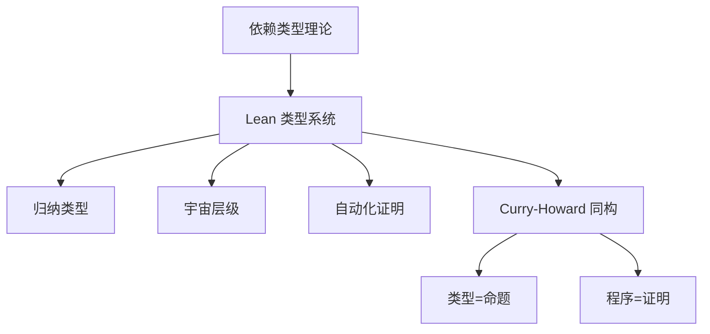

# 1.1 Lean 语言理论基础与语义模型 / Lean Theoretical Foundations and Semantic Models

[返回目录](../CONTINUOUS_PROGRESS.md) | [Next: 1.2-lean-类型系统与证明系统.md](1.2-lean-类型系统与证明系统.md)

---

## 1.1.1 Lean 理论基础 / Theoretical Foundations of Lean

### 依赖类型理论 / Dependent Type Theory

Lean 基于依赖类型理论（DTT），其核心思想是类型可以依赖于值。Lean 的类型系统支持 $\Pi$-类型（依赖函数类型）、$\Sigma$-类型（依赖积类型）、归纳类型、宇宙层级等。

**Latex公式：**
$$
\text{Type} : \text{Type}_1 : \text{Type}_2 : \cdots
$$

### Curry-Howard 同构 / Curry-Howard Correspondence

Lean 采用 Curry-Howard 同构，将“类型”视为“命题”，“程序”视为“证明”。

**公式：**

- $A \to B$ 对应 $A \implies B$
- $A \times B$ 对应 $A \land B$
- $A + B$ 对应 $A \lor B$

**Lean 代码示例：**

```lean
lemma and_comm (A B : Prop) : A ∧ B → B ∧ A :=
  λ ⟨hA, hB⟩ => ⟨hB, hA⟩
```

---

## 1.1.2 语义模型分类 / Semantic Models in Lean

### 操作语义 / Operational Semantics

描述程序执行的具体步骤。

**Lean 代码示例：**

```lean
inductive Expr
| val : Nat → Expr
| add : Expr → Expr → Expr

def eval : Expr → Nat
  | Expr.val n   => n
  | Expr.add a b => eval a + eval b
```

### 指称语义 / Denotational Semantics

将程序映射到数学对象（如函数、集合等）。

### 公理语义 / Axiomatic Semantics

通过逻辑公理和推理规则描述程序行为。

---

## 1.1.3 类型系统与一致性 / Type System and Consistency

Lean 的类型系统保证了类型安全和一致性，支持归纳类型、递归定义、类型推断。

**一致性证明思路：**

- 归约到核心类型理论
- 利用归纳法证明无矛盾性

---

## 1.1.4 与主流理论的对比 / Comparison with Mainstream Theories

| 语言/系统 | 类型系统 | 依赖类型 | 归纳类型 | 宇宙层级 | 自动化证明 |
|-----------|----------|----------|----------|----------|------------|
| Lean      | DTT      | ✔        | ✔        | ✔        | 强         |
| Coq       | DTT      | ✔        | ✔        | ✔        | 强         |
| Agda      | DTT      | ✔        | ✔        | ✔        | 中         |
| Haskell   | STT      | ✘        | 部分     | ✘        | 弱         |

---

## 1.1.5 前沿观点与创新 / Frontiers and Innovations

- AI辅助定理证明（如 Lean GPT、自动化策略）
- 同伦类型论（HoTT）与高阶语义模型
- 范畴论与类型-逻辑-范畴三重对应
- 工程落地：数学库（mathlib）、工业验证、形式化编译器

---

## 1.1.6 图表与多表征 / Diagrams and Multi-Representation



---

## 1.1.7 交叉引用 / Cross References

- [1.2-lean-类型系统与证明系统.md](1.2-lean-类型系统与证明系统.md)
- [1.8-类型论理论模型.md](1.8-类型论理论模型.md)
- [1.10-模型论与语义模型.md](1.10-模型论与语义模型.md)
- [1.11-范畴论与类型理论.md](1.11-范畴论与类型理论.md)
