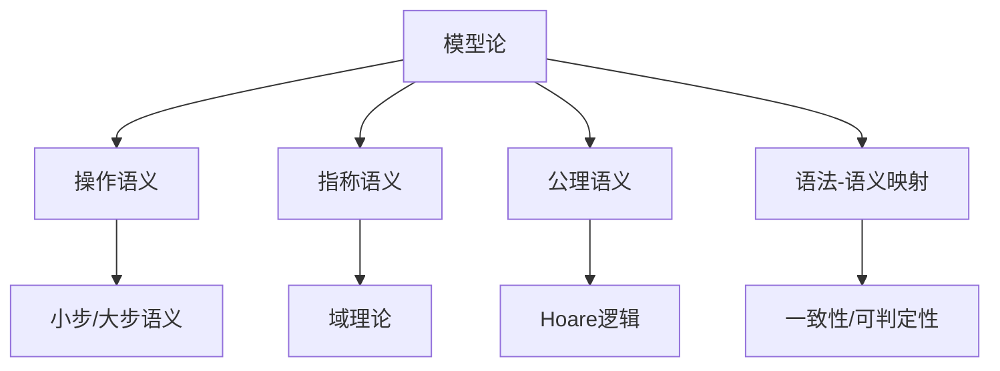

# 1.10 模型论与语义模型 / Model Theory and Semantic Models

[返回目录](../CONTINUOUS_PROGRESS.md) | [上一节: 1.9-证明论与推理系统.md](1.9-证明论与推理系统.md)

---

## 1.10.1 模型论发展简史 / Historical Overview of Model Theory

- 20世纪初由Tarski等提出，研究形式语言与其语义解释之间的关系
- 发展出操作语义、指称语义、公理语义等多种模型
- 模型论成为编程语言、定理证明器的理论基础

---

## 1.10.2 操作语义、指称语义、公理语义 / Operational, Denotational, Axiomatic Semantics

### 操作语义（Operational Semantics）

- 通过定义程序执行的具体步骤描述程序行为
- 小步语义、大步语义

**Lean 代码示例：**

```lean
inductive Expr
| val : Nat → Expr
| add : Expr → Expr → Expr

def eval : Expr → Nat
  | Expr.val n   => n
  | Expr.add a b => eval a + eval b
```

### 指称语义（Denotational Semantics）

- 将程序映射到数学对象（如函数、集合等）
- 域理论（domain theory）

**Lean 伪代码：**

```lean
def Denote (e : Expr) : Set :=
  match e with
  | Expr.val n   => {n}
  | Expr.add a b => {x | ∃ m n, x = m + n ∧ m ∈ Denote a ∧ n ∈ Denote b}
```

### 公理语义（Axiomatic Semantics）

- 通过逻辑公理和推理规则描述程序行为
- Hoare逻辑、前置/后置条件

**Lean 伪代码：**

```lean
structure HoareTriple (P : State → Prop) (c : Command) (Q : State → Prop) : Prop :=
  (valid : ∀ s, P s → Q (exec c s))
```

---

## 1.10.3 语法-语义映射与一致性 / Syntax-Semantics Mapping and Consistency

- 语法树到语义解释的映射是编译器与证明器的核心
- 语义一致性：形式系统的语法与语义解释之间无矛盾
- 可判定性：某性质能否被算法判定

**Lean 伪代码：**

```lean
class Decidable (p : Prop) : Type :=
  (decide : Bool)
```

---

## 1.10.4 Lean中的语义模型与创新 / Semantic Models and Innovations in Lean

- 支持多层次语义模型（操作/指称/公理）
- 结合类型论、范畴论、HoTT等前沿理论
- 语义一致性、可判定性、AI辅助语义分析等创新方向

---

## 1.10.5 图表与多表征 / Diagrams and Multi-Representation



---

## 1.10.6 交叉引用 / Cross References

- [1.2-lean-类型系统与证明系统.md](1.2-lean-类型系统与证明系统.md)
- [1.8-类型论理论模型.md](1.8-类型论理论模型.md)
- [1.9-证明论与推理系统.md](1.9-证明论与推理系统.md)
- [1.11-范畴论与类型理论.md](1.11-范畴论与类型理论.md)

## 1.10.7 创新建议 / Innovation Suggestions

- 中文：AI辅助语义一致性检测、自动语法-语义映射生成、跨语言语义对齐。
- English: AI-assisted semantic consistency checking, automatic syntax-semantics mapping generation, and cross-language semantic alignment.

## 1.10.8 工程案例 / Engineering Case

- 中文：编译器语义验证、智能合约形式化建模与验证。
- English: Compiler semantic verification and formal modeling/verification of smart contracts.

## 1.10.9 前沿趋势 / Frontiers and Trends

- 中文：多层次语义模型、可判定性研究、AI辅助语义分析。
- English: Multi-level semantic models, decidability research, and AI-assisted semantic analysis.

## 1.10.10 AI辅助与多模态表达 / AI Assistance and Multi-Modal Representation

- 中文：结合AI自动生成语义解释、可视化语法-语义映射，支持Latex、Mermaid、Lean/Haskell代码多模态表达。
- English: Integrate AI to automatically generate semantic interpretations and visualize syntax-semantics mapping, supporting multi-modal representation with Latex, Mermaid, and Lean/Haskell code.
