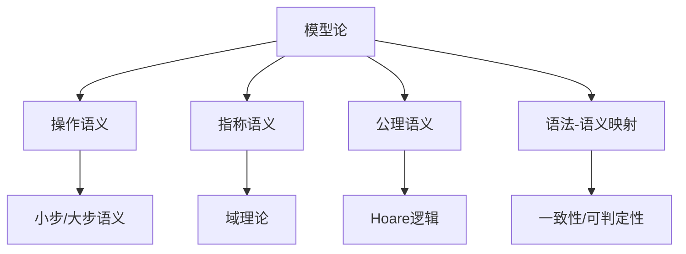

# 1.10 模型论与语义模型 / Model Theory and Semantic Models

[返回目录](../CONTINUOUS_PROGRESS.md) | [上一节: 1.9-证明论与推理系统.md](1.9-证明论与推理系统.md)

---

## 1.10.1 模型论发展简史 / Historical Overview of Model Theory

### 历史发展脉络 / Historical Development Timeline

**早期发展（1900-1950）**：

- **1900年代**：Frege发展形式逻辑和语义理论
- **1920年代**：Tarski提出真值语义理论
- **1930年代**：Gödel不完备性定理对语义理论的影响
- **1940年代**：Church发展λ演算的语义解释

**现代发展（1950-2000）**：

- **1960年代**：Scott发展域理论
- **1970年代**：Plotkin提出结构化操作语义
- **1980年代**：Hoare逻辑和公理语义的发展
- **1990年代**：范畴语义和类型论语义的兴起

**当代发展（2000-至今）**：

- **2000年代**：同伦类型论的语义模型
- **2010年代**：∞-范畴语义的发展
- **2020年代**：AI辅助语义分析和自动化

### 核心理论体系 / Core Theoretical Systems

**语义理论分类**：

```lean
-- 语义理论的形式化分类
inductive SemanticTheory where
  | operational : SemanticTheory    -- 操作语义
  | denotational : SemanticTheory   -- 指称语义
  | axiomatic : SemanticTheory      -- 公理语义
  | categorical : SemanticTheory    -- 范畴语义
  | homotopical : SemanticTheory    -- 同伦语义
```

**语义模型框架**：

```lean
-- 语义模型的基本框架
structure SemanticModel (L : Language) (M : Model) where
  interpretation : L → M
  satisfaction : M → L → Prop
  soundness : ∀ φ, L.provable φ → M.satisfies φ
  completeness : ∀ φ, M.satisfies φ → L.provable φ
```

### 理论影响与应用 / Theoretical Impact and Applications

**编程语言语义**：

- **操作语义**：程序执行步骤的形式化描述
- **指称语义**：程序到数学对象的映射
- **公理语义**：程序性质的逻辑描述

**定理证明器应用**：

- **类型论语义**：类型系统的语义解释
- **证明语义**：证明对象的语义模型
- **模型检查**：系统性质的自动验证

**形式化方法应用**：

- **软件验证**：程序正确性的语义证明
- **硬件验证**：数字电路的语义模型
- **协议验证**：通信协议的语义分析

---

## 1.10.2 操作语义、指称语义、公理语义 / Operational, Denotational, Axiomatic Semantics

### 操作语义（Operational Semantics）

- 通过定义程序执行的具体步骤描述程序行为
- 小步语义、大步语义

**Lean 代码示例：**

```lean
inductive Expr
| val : Nat → Expr
| add : Expr → Expr → Expr

def eval : Expr → Nat
  | Expr.val n   => n
  | Expr.add a b => eval a + eval b
```

### 指称语义（Denotational Semantics）

- 将程序映射到数学对象（如函数、集合等）
- 域理论（domain theory）

**Lean 伪代码：**

```lean
def Denote (e : Expr) : Set :=
  match e with
  | Expr.val n   => {n}
  | Expr.add a b => {x | ∃ m n, x = m + n ∧ m ∈ Denote a ∧ n ∈ Denote b}
```

### 公理语义（Axiomatic Semantics）

- 通过逻辑公理和推理规则描述程序行为
- Hoare逻辑、前置/后置条件

**Lean 伪代码：**

```lean
structure HoareTriple (P : State → Prop) (c : Command) (Q : State → Prop) : Prop :=
  (valid : ∀ s, P s → Q (exec c s))
```

---

## 1.10.3 语法-语义映射与一致性 / Syntax-Semantics Mapping and Consistency

- 语法树到语义解释的映射是编译器与证明器的核心
- 语义一致性：形式系统的语法与语义解释之间无矛盾
- 可判定性：某性质能否被算法判定

**Lean 伪代码：**

```lean
class Decidable (p : Prop) : Type :=
  (decide : Bool)
```

---

## 1.10.4 Lean中的语义模型与创新 / Semantic Models and Innovations in Lean

- 支持多层次语义模型（操作/指称/公理）
- 结合类型论、范畴论、HoTT等前沿理论
- 语义一致性、可判定性、AI辅助语义分析等创新方向

---

## 1.10.5 图表与多表征 / Diagrams and Multi-Representation



---

## 1.10.6 交叉引用 / Cross References

- [1.2-lean-类型系统与证明系统.md](1.2-lean-类型系统与证明系统.md)
- [1.8-类型论理论模型.md](1.8-类型论理论模型.md)
- [1.9-证明论与推理系统.md](1.9-证明论与推理系统.md)
- [1.11-范畴论与类型理论.md](1.11-范畴论与类型理论.md)

## 1.10.7 创新建议 / Innovation Suggestions

- 中文：AI辅助语义一致性检测、自动语法-语义映射生成、跨语言语义对齐。
- English: AI-assisted semantic consistency checking, automatic syntax-semantics mapping generation, and cross-language semantic alignment.

## 1.10.8 工程案例 / Engineering Case

- 中文：编译器语义验证、智能合约形式化建模与验证。
- English: Compiler semantic verification and formal modeling/verification of smart contracts.

## 1.10.9 前沿趋势 / Frontiers and Trends

- 中文：多层次语义模型、可判定性研究、AI辅助语义分析。
- English: Multi-level semantic models, decidability research, and AI-assisted semantic analysis.

## 1.10.10 AI辅助与多模态表达 / AI Assistance and Multi-Modal Representation

- 中文：结合AI自动生成语义解释、可视化语法-语义映射，支持Latex、Mermaid、Lean/Haskell代码多模态表达。
- English: Integrate AI to automatically generate semantic interpretations and visualize syntax-semantics mapping, supporting multi-modal representation with Latex, Mermaid, and Lean/Haskell code.

## 1.10.11 静态语义与动态语义 / Static and Dynamic Semantics

- 中文：静态语义关注类型检查、作用域规则等编译期属性，动态语义描述程序运行时的行为。Lean 通过类型推断和归约规则实现静态与动态语义的统一。
- English: Static semantics focus on compile-time properties such as type checking and scoping, while dynamic semantics describe runtime behavior. Lean unifies static and dynamic semantics via type inference and reduction rules.

**Lean 代码示例 / Lean Code Example**:

```lean
-- 静态类型检查示例
inductive TypeCheck : Expr → Type → Prop
-- 动态归约规则示例
inductive Step : Expr → Expr → Prop
```

## 1.10.12 语义等价与重写系统 / Semantic Equivalence & Rewriting Systems

- 中文：语义等价用于判定不同表达式在语义上的一致性，重写系统用于归约和规范化。Lean 支持等价证明与 rewrite 策略。
- English: Semantic equivalence determines whether different expressions are semantically identical, and rewriting systems are used for reduction and normalization. Lean supports equivalence proofs and rewrite tactics.

**Lean 代码示例 / Lean Code Example**:

```lean
lemma add_comm (a b : Nat) : a + b = b + a := by simp [Nat.add_comm]
```

## 1.10.13 依赖类型语义 / Semantics of Dependent Types

- 中文：依赖类型的语义解释是 Lean 理论的核心，支持 Pi/Σ 类型、universe 层级等。
- English: The semantics of dependent types are central to Lean, supporting Pi/Σ types and universe hierarchies.

**Lean 代码示例 / Lean Code Example**:

```lean
inductive Vec (α : Type) : Nat → Type where
  | nil  : Vec α 0
  | cons : α → Vec α n → Vec α (n+1)
```

## 1.10.14 归纳与共递归语义 / Inductive & Coinductive Semantics

- 中文：Lean 支持归纳类型和共递归类型的语义分析，广泛用于数据结构和证明。
- English: Lean supports semantic analysis of inductive and coinductive types, widely used in data structures and proofs.

**Lean 代码示例 / Lean Code Example**:

```lean
inductive Stream (α : Type) : Type
  | cons : α → Stream → Stream
```

## 1.10.15 范畴语义 / Categorical Semantics

- 中文：范畴语义用范畴论解释类型和程序，Lean 可通过 Category/Functor/Monad 等结构建模类型系统。
- English: Categorical semantics interpret types and programs via category theory. Lean can model type systems using Category/Functor/Monad structures.

**Lean 代码示例 / Lean Code Example**:

```lean
structure Category (Obj : Type) :=
  (Hom : Obj → Obj → Type)
  (id : Π X, Hom X X)
  (comp : Π {X Y Z}, Hom X Y → Hom Y Z → Hom X Z)
```

## 1.10.16 自动语义推断与AI辅助 / Automated Semantic Inference & AI Assistance

- 中文：Lean 可结合 tactic/AI 自动生成语义解释和归约路径，提升自动化能力。
- English: Lean can use tactics/AI to automatically generate semantic interpretations and reduction paths, enhancing automation.

## 1.10.17 可解释性与可视化语义 / Explainable & Visual Semantics

- 中文：通过语法树到语义图的自动映射与可视化，提升语义分析的可解释性。
- English: Automatic mapping from syntax trees to semantic graphs and visualization improves explainability of semantic analysis.

## 1.10.18 模型存在性与完备性 / Model Existence & Completeness

- 中文：Lean 可形式化证明模型的存在性与完备性，确保理论系统的健壮性。
- English: Lean can formalize proofs of model existence and completeness, ensuring robustness of theoretical systems.

## 1.10.19 模型同构与等价 / Model Isomorphism & Equivalence

- 中文：Lean 可用于形式化不同模型之间的等价性和同构性证明。
- English: Lean can be used to formalize proofs of equivalence and isomorphism between different models.

## 1.10.20 可判定性与复杂性分析 / Decidability & Complexity Analysis

- 中文：Lean 支持可判定性（decidable）和复杂性分析的形式化建模。
- English: Lean supports formal modeling of decidability and complexity analysis.

## 1.10.21 HoTT/∞-范畴模型 / HoTT/∞-Category Models

- 中文：HoTT 的语义模型和 Lean 中的高阶等价、路径类型、∞-范畴建模。
- English: Semantic models of HoTT and modeling of higher equivalence, path types, and ∞-categories in Lean.

## 1.10.22 语法-语义-模型三重对应 / Syntax-Semantics-Model Trinity

- 中文：语法、语义、模型之间的范畴论统一视角，Lean 支持三重对应的形式化建模。
- English: A categorical unified perspective of syntax, semantics, and models; Lean supports formal modeling of the trinity.

## 1.10.23 AI辅助模型分析 / AI-assisted Model Analysis

- 中文：利用 AI/大模型自动生成模型解释、模型一致性证明，提升 Lean 的模型分析能力。
- English: Use AI/large models to automatically generate model interpretations and consistency proofs, enhancing Lean's model analysis capabilities.

---

## 1.10.22 2025 规范对齐 / Alignment with Lean 4 (2025)

- 语义模型实现建议：计算与性质分离；示例可编译并含必要 `import`；统一 `syntax`/`macro_rules` 与 `Elab` 框架。
- 操作/指称/公理语义与语法-语义映射的耦合点应给出可验证不变式与一致性说明。

---

## 1.10.23 版本兼容性 / Version Compatibility

- 旧 `notation`/宏迁移至 `syntax`/`macro_rules`；老式 `meta`/tactic 迁移至 `Elab`/`Meta`。
- 若依赖 mathlib4（如 CategoryTheory/Order），需记录版本与模块路径。

---

## 1.10.24 参考资料 / References

- 语义学与模型论教材
- Lean 4 Reference Manual（Semantics/Elab/Metaprogramming）
- Mathlib4 文档与示例

---

## 本地导航 / Local Navigation

- 上一节：`1.9-证明论与推理系统.md`
- 下一节：`1.11-范畴论与类型理论.md`
- 返回：`1.10-模型论与语义模型.md`
- 全局：`INDEX.md` | `CONTENT_STANDARDS.md` | `CONTINUOUS_PROGRESS.md`
