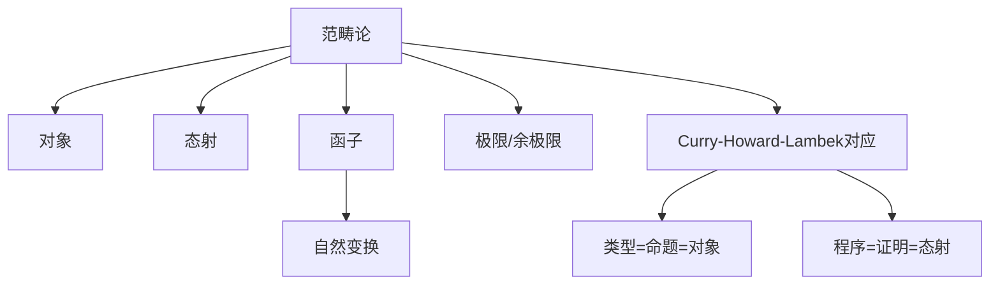

# 1.11 范畴论与类型理论 / Category Theory and Type Theory

[返回目录](../CONTINUOUS_PROGRESS.md) | [上一节: 1.10-模型论与语义模型.md](1.10-模型论与语义模型.md)

---

## 1.11.1 范畴论基础 / Foundations of Category Theory

- 范畴由对象和态射（箭头）及其组合规则组成
- 组合律、恒等元

### 1.11.1.1 历史背景 / Historical Background

**范畴论**由Samuel Eilenberg和Saunders Mac Lane在1940年代提出，最初用于代数拓扑学。它提供了一种抽象的方法来研究数学结构之间的关系，现已成为现代数学和计算机科学的重要工具。

### 1.11.1.2 核心概念 / Core Concepts

**范畴**是数学结构的高度抽象：

- **对象**：范畴中的基本元素
- **态射**：对象之间的映射关系
- **组合律**：态射的组合满足结合律
- **恒等元**：每个对象都有恒等态射

### 1.11.1.3 形式化定义 / Formal Definition

**Latex公式：**
$$
\text{Hom}_\mathcal{C}(A, B)
$$

**范畴的公理**：

1. **结合律**：$(h \circ g) \circ f = h \circ (g \circ f)$
2. **恒等律**：$\text{id}_B \circ f = f = f \circ \text{id}_A$

### 1.11.1.4 Lean 代码示例 / Lean Code Examples

```lean
-- 基本范畴定义
structure Category (Obj : Type) :=
  (Hom : Obj → Obj → Type)
  (id : Π X, Hom X X)
  (comp : Π {X Y Z}, Hom X Y → Hom Y Z → Hom X Z)

-- 范畴公理
class Category (Obj : Type) where
  Hom : Obj → Obj → Type
  id : ∀ X : Obj, Hom X X
  comp : ∀ {X Y Z : Obj}, Hom X Y → Hom Y Z → Hom X Z
  
  -- 公理
  id_left : ∀ {X Y : Obj} (f : Hom X Y), comp (id X) f = f
  id_right : ∀ {X Y : Obj} (f : Hom X Y), comp f (id Y) = f
  assoc : ∀ {W X Y Z : Obj} (f : Hom W X) (g : Hom X Y) (h : Hom Y Z),
    comp (comp f g) h = comp f (comp g h)

-- 集合范畴实例
instance : Category Type where
  Hom := λ A B => A → B
  id := λ A => λ x => x
  comp := λ f g => λ x => g (f x)
  id_left := by simp
  id_right := by simp
  assoc := by simp
```

---

## 1.11.2 函子与自然变换 / Functors and Natural Transformations

- 函子是范畴之间保持结构的映射
- 自然变换是函子之间的"变形"

### 1.11.2.1 函子定义 / Functor Definition

**函子**是范畴之间的结构保持映射：

- **对象映射**：将源范畴的对象映射到目标范畴
- **态射映射**：将源范畴的态射映射到目标范畴
- **结构保持**：保持组合律和恒等元

### 1.11.2.2 自然变换定义 / Natural Transformation Definition

**自然变换**是函子之间的"变形"：

- **分量**：对每个对象给出态射
- **自然性**：满足交换图条件
- **结构保持**：保持函子的结构

### 1.11.2.3 形式化表达 / Formal Expression

**函子公理**：

1. $F(\text{id}_A) = \text{id}_{F(A)}$
2. $F(g \circ f) = F(g) \circ F(f)$

**自然变换公理**：
对于每个态射 $f : A \to B$，有：
$G(f) \circ \alpha_A = \alpha_B \circ F(f)$

### 1.11.2.4 Lean 代码示例 / Lean Code Examples

```lean
-- 函子定义
structure Functor {C D : Type} [Category C] [Category D] (F : C → D) where
  map : ∀ {X Y : C}, Category.Hom X Y → Category.Hom (F X) (F Y)
  
  -- 公理
  map_id : ∀ X : C, map (Category.id X) = Category.id (F X)
  map_comp : ∀ {X Y Z : C} (f : Category.Hom X Y) (g : Category.Hom Y Z),
    map (Category.comp f g) = Category.comp (map f) (map g)

-- 恒等函子
def IdFunctor {C : Type} [Category C] : C → C := λ X => X

instance {C : Type} [Category C] : Functor (IdFunctor : C → C) where
  map := λ f => f
  map_id := by simp
  map_comp := by simp

-- 自然变换定义
structure NaturalTransformation {C D : Type} [Category C] [Category D]
  (F G : C → D) [Functor F] [Functor G] where
  component : ∀ X : C, Category.Hom (F X) (G X)
  naturality : ∀ {X Y : C} (f : Category.Hom X Y),
    Category.comp (Functor.map f) (component Y) = 
    Category.comp (component X) (Functor.map f)

-- 恒等自然变换
def id_nat_trans {C D : Type} [Category C] [Category D]
  (F : C → D) [Functor F] : NaturalTransformation F F :=
  { component := λ X => Category.id (F X)
    naturality := by simp
  }
```

---

## 1.11.3 极限与高阶结构 / Limits and Higher Structures

- 极限（积、余积、拉回、推移等）是范畴中对象间的通用构造
- 高阶范畴、∞-范畴在类型系统中的应用

**Lean 代码示例：**

```lean
structure Product (A B : Type) :=
  (fst : A)
  (snd : B)
```

---

## 1.11.4 Curry-Howard-Lambek 对应 / Curry-Howard-Lambek Correspondence

- 类型-命题-对象三重对应，程序-证明-态射三重对应
- 理论统一了类型论、逻辑、范畴论

---

## 1.11.5 范畴语义学与Lean中的建模 / Categorical Semantics and Modeling in Lean

- 范畴语义学为类型论、证明系统提供模型解释
- Lean 支持通过 Category/Monad/Functor 等结构建模类型系统

**Lean 伪代码：**

```lean
-- 通过 Category/Monad/Functor 建模类型系统
```

---

## 1.11.6 前沿创新与发展趋势 / Frontiers and Trends

- 高阶范畴、∞-范畴、范畴语义学的前沿理论
- 类型-逻辑-范畴三重对应的创新应用
- AI辅助范畴建模、可视化等

---

## 1.11.7 图表与多表征 / Diagrams and Multi-Representation



---

## 1.11.8 交叉引用 / Cross References

- [1.8-类型论理论模型.md](1.8-类型论理论模型.md)
- [1.10-模型论与语义模型.md](1.10-模型论与语义模型.md)
- [1.12-同伦类型论.md](1.12-同伦类型论.md)

## 1.11.9 创新建议 / Innovation Suggestions

- 中文：探索范畴语义学与AI结合、可视化范畴建模工具、范畴-类型-逻辑三重统一的创新应用。
- English: Explore the integration of categorical semantics with AI, visual categorical modeling tools, and innovative applications of the category-type-logic trinity.

## 1.11.10 工程案例 / Engineering Case

- 中文：在数据流系统、分布式系统中应用范畴建模，提升结构抽象与可验证性。
- English: Apply categorical modeling in dataflow and distributed systems to enhance structural abstraction and verifiability.

## 1.11.11 前沿趋势 / Frontiers and Trends

- 中文：∞-范畴、范畴语义学的前沿理论、AI辅助范畴建模与可视化。
- English: Frontiers of ∞-categories, categorical semantics, and AI-assisted categorical modeling and visualization.

## 1.11.12 AI辅助与多模态表达 / AI Assistance and Multi-Modal Representation

- 中文：结合AI自动生成范畴结构、可视化范畴图，支持Latex、Mermaid、Lean/Haskell代码多模态表达。
- English: Integrate AI to automatically generate categorical structures and visualize category diagrams, supporting multi-modal representation with Latex, Mermaid, and Lean/Haskell code.

## 1.11.13 范畴论的语义基础 / Semantic Foundations of Category Theory

- 中文：范畴论关注对象、态射及其组合的语义解释，为类型系统和证明系统提供统一建模框架。
- English: Category theory focuses on the semantic interpretation of objects, morphisms, and their composition, providing a unified modeling framework for type and proof systems.

## 1.11.14 Lean中的范畴/函子/自然变换/极限/余极限/单子 / Categories, Functors, Natural Transformations, Limits, Colimits, and Monads in Lean

- 中文：Lean 支持范畴、函子、自然变换、极限、余极限、单子的形式化建模，广泛用于类型系统和程序语义。
- English: Lean supports formal modeling of categories, functors, natural transformations, limits, colimits, and monads, widely used in type systems and program semantics.

**Lean 代码示例 / Lean Code Example**:

```lean
structure Category (Obj : Type) :=
  (Hom : Obj → Obj → Type)
  (id : Π X, Hom X X)
  (comp : Π {X Y Z}, Hom X Y → Hom Y Z → Hom X Z)
```

## 1.11.15 范畴等价与同构 / Category Equivalence & Isomorphism

- 中文：Lean 可形式化范畴等价、对象同构、函子等价等概念，支持结构抽象与理论统一。
- English: Lean can formalize category equivalence, object isomorphism, and functor equivalence, supporting structural abstraction and theoretical unification.

## 1.11.16 范畴语义与类型系统 / Categorical Semantics & Type Systems

- 中文：范畴语义为类型系统提供模型解释，Lean 可通过范畴结构建模类型论和证明系统。
- English: Categorical semantics provide model interpretations for type systems; Lean can model type theory and proof systems via categorical structures.

## 1.11.17 范畴自动化与AI辅助 / Category Automation & AI Assistance

- 中文：Lean 的 tactic/AI 工具可自动生成范畴结构、函子映射、自然变换等证明脚本。
- English: Lean's tactic/AI tools can automatically generate proof scripts for categorical structures, functor mappings, and natural transformations.

## 1.11.18 范畴可视化与工程应用 / Category Visualization & Engineering Applications

- 中文：Lean 可结合 Mermaid/AI 工具自动生成范畴结构图，支持工程中的范畴建模与验证。
- English: Lean can use Mermaid/AI tools to automatically generate category structure diagrams, supporting categorical modeling and verification in engineering.

## 1.11.19 与类型论/证明论/模型论/HoTT的交互 / Interaction with Type Theory, Proof Theory, Model Theory, and HoTT

- 中文：Lean 支持范畴论与类型论、证明论、模型论、HoTT的交互建模，实现理论统一与创新应用。
- English: Lean supports interactive modeling between category theory, type theory, proof theory, model theory, and HoTT, enabling theoretical unification and innovative applications.

---

## 1.11.20 2025 规范对齐 / Alignment with Lean 4 (2025)

- 基于 mathlib4 `CategoryTheory`：`Category`/`Functor`/`NatTrans`/`(Co)Limits` 等结构与引理；显式 `import` 并固定版本。
- CHL 对应工程化：以结构/实例与定理呈现，加入自动化（`simp`/`aesop`）规则，增强可复用性。

---

## 1.11.21 版本兼容性 / Version Compatibility

- `CategoryTheory` API 随版本演进；注意 `Opposite`、极限/余极限等接口变更。

---

## 1.11.22 参考资料 / References

- 范畴论教材与综述
- Mathlib4 CategoryTheory 文档与 Cookbook
- Lean 4 Reference Manual（Elab/Meta）

---

## 本地导航 / Local Navigation

- 上一节：`1.10-模型论与语义模型.md`
- 下一节：`1.12-同伦类型论.md`
- 返回：`1.11-范畴论与类型理论.md`
- 全局：`INDEX.md` | `CONTENT_STANDARDS.md` | `CONTINUOUS_PROGRESS.md`