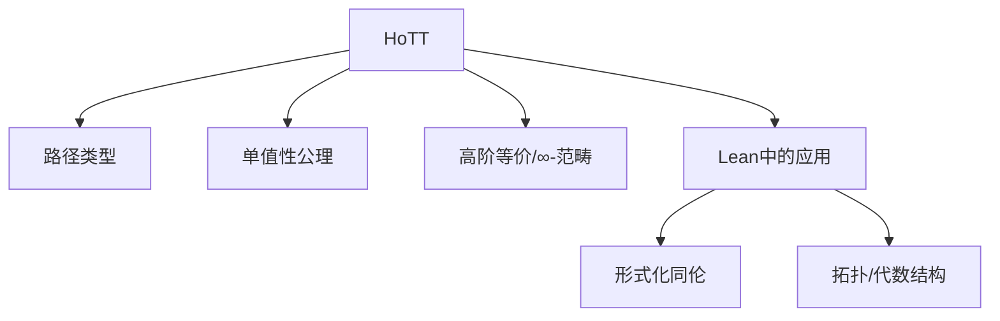

# 1.12 同伦类型论 / Homotopy Type Theory (HoTT)

[返回目录](../CONTINUOUS_PROGRESS.md) | [上一节: 1.11-范畴论与类型理论.md](1.11-范畴论与类型理论.md)

---

## 1.12.1 HoTT 基础与核心思想 / Foundations and Core Ideas

- 类型被解释为空间，等价为路径，支持高阶等价与∞-范畴
- 路径类型（Path Types）、单值性公理（Univalence Axiom）
- 类型等价与等式的统一

### 1.12.1.1 历史背景 / Historical Background

**同伦类型论（HoTT）**由Vladimir Voevodsky在2000年代提出，将拓扑学中的同伦概念引入类型理论。它统一了类型论、范畴论和拓扑学，为数学基础提供了新的视角。

### 1.12.1.2 核心思想 / Core Ideas

**HoTT 的基本思想**：

1. **类型即空间**：每个类型对应一个拓扑空间
2. **等价即路径**：类型等价对应空间中的路径
3. **等式即路径**：类型等式对应路径类型
4. **高阶结构**：支持高阶等价和∞-范畴

### 1.12.1.3 形式化表达 / Formal Expression

**公式：**
$$
A \simeq B \implies A = B
$$

**路径类型定义：**
$$\mathsf{Path}_A(a, b) : \text{Type}$$

**单值性公理：**
$$(A \simeq B) \simeq (A = B)$$

### 1.12.1.4 Lean 代码示例 / Lean Code Examples

```lean
-- 路径类型定义
inductive Path {A : Type} (a : A) : A → Type where
  | refl : Path a a

-- 单值性公理
axiom univalence {A B : Type} : (A ≃ B) ≃ (A = B)

-- 等价类型定义
structure Equiv (A B : Type) : Type where
  to_fun : A → B
  inv_fun : B → A
  left_inv : ∀ a, Path (inv_fun (to_fun a)) a
  right_inv : ∀ b, Path (to_fun (inv_fun b)) b

-- 路径运算
def path_concat {A : Type} {a b c : A} (p : Path a b) (q : Path b c) : Path a c :=
  match p, q with
  | Path.refl, q => q
  | p, Path.refl => p

def path_inv {A : Type} {a b : A} (p : Path a b) : Path b a :=
  match p with
  | Path.refl => Path.refl
```

---

## 1.12.2 路径类型与高阶等价 / Path Types and Higher Equivalence

- $\mathsf{Path}_A(a, b)$ 表示 $a, b$ 在 $A$ 中的路径
- $n$-路径、$n$-等价、∞-范畴

### 1.12.2.1 路径类型理论 / Path Type Theory

**路径类型**是HoTT的核心概念：

- **基本路径**：$\mathsf{Path}_A(a, b)$ 表示从 $a$ 到 $b$ 的路径
- **反射路径**：$\mathsf{refl}_a : \mathsf{Path}_A(a, a)$
- **路径连接**：$p \cdot q : \mathsf{Path}_A(a, c)$
- **路径反转**：$p^{-1} : \mathsf{Path}_A(b, a)$

### 1.12.2.2 高阶等价 / Higher Equivalence

**高阶等价**扩展了传统的等价概念：

- **1-等价**：传统的等价关系
- **2-等价**：等价之间的等价
- **n-等价**：n-1等价之间的等价
- **∞-等价**：无限高阶的等价

### 1.12.2.3 ∞-范畴 / ∞-Categories

**∞-范畴**是高阶结构的统一框架：

- **对象**：0-维结构
- **1-态射**：对象之间的映射
- **2-态射**：1-态射之间的映射
- **n-态射**：n-1态射之间的映射

### 1.12.2.4 Lean 代码示例 / Lean Code Examples

```lean
-- 基本路径类型
inductive Path {A : Type} (a : A) : A → Type where
  | refl : Path a a

-- 2-路径类型
inductive Path2 {A : Type} {a b : A} (p q : Path a b) : Type where
  | refl2 : Path2 p p

-- 3-路径类型
inductive Path3 {A : Type} {a b : A} {p q : Path a b} (α β : Path2 p q) : Type where
  | refl3 : Path3 α α

-- 路径代数
def path_concat {A : Type} {a b c : A} (p : Path a b) (q : Path b c) : Path a c :=
  match p, q with
  | Path.refl, q => q
  | p, Path.refl => p

def path_inv {A : Type} {a b : A} (p : Path a b) : Path b a :=
  match p with
  | Path.refl => Path.refl

-- 路径代数性质
theorem path_unit_left {A : Type} {a b : A} (p : Path a b) :
  Path (path_concat Path.refl p) p := by
  cases p
  rfl

theorem path_assoc {A : Type} {a b c d : A} 
  (p : Path a b) (q : Path b c) (r : Path c d) :
  Path (path_concat (path_concat p q) r) (path_concat p (path_concat q r)) := by
  cases p <;> cases q <;> cases r
  rfl
```

---

## 1.12.3 单值性公理与创新 / Univalence Axiom and Innovations

- 单值性公理（Univalence Axiom）：等价类型可互换
- HoTT推动了类型论、范畴论、拓扑学的深度融合
- AI辅助HoTT证明、可视化等前沿方向

### 1.12.3.1 单值性公理 / Univalence Axiom

**单值性公理**是HoTT的核心公理：

- **公理表述**：$(A \simeq B) \simeq (A = B)$
- **含义**：等价类型可以互换
- **意义**：统一了类型等价和类型等式

### 1.12.3.2 理论创新 / Theoretical Innovations

**HoTT 的理论创新**：

1. **类型论创新**：引入路径类型和单值性公理
2. **范畴论创新**：统一了范畴论和类型论
3. **拓扑学创新**：将拓扑概念引入类型理论
4. **数学基础创新**：提供了新的数学基础视角

### 1.12.3.3 前沿方向 / Frontier Directions

**HoTT 的前沿研究方向**：

- **AI辅助证明**：利用大语言模型辅助HoTT证明
- **可视化技术**：开发HoTT结构的可视化工具
- **工程应用**：将HoTT应用于实际工程问题
- **教育推广**：开发HoTT的教学资源

### 1.12.3.4 Lean 代码示例 / Lean Code Examples

```lean
-- 单值性公理
axiom univalence {A B : Type} : (A ≃ B) ≃ (A = B)

-- 单值性公理的应用
def univalence_elim {A B : Type} (e : A ≃ B) : A = B :=
  (univalence e).1

def univalence_intro {A B : Type} (p : A = B) : A ≃ B :=
  (univalence.symm p).1

-- 等价类型示例
def bool_to_sum : Bool → Unit ⊕ Unit
| Bool.true => Sum.inl Unit.unit
| Bool.false => Sum.inr Unit.unit

def sum_to_bool : Unit ⊕ Unit → Bool
| Sum.inl _ => Bool.true
| Sum.inr _ => Bool.false

-- 证明等价
theorem bool_equiv_sum : Bool ≃ (Unit ⊕ Unit) := by
  exists bool_to_sum
  exists sum_to_bool
  constructor
  · intro b
    cases b <;> rfl
  · intro s
    cases s <;> rfl

-- 应用单值性公理
def bool_eq_sum : Bool = (Unit ⊕ Unit) :=
  univalence_elim bool_equiv_sum
```

---

## 1.12.4 HoTT在Lean与数学中的应用 / Applications of HoTT in Lean and Mathematics

- HoTT在形式化同伦、拓扑、代数结构等领域的应用
- Lean HoTT库、路径类型、单值性公理的实际建模

### 1.12.4.1 同伦论应用 / Homotopy Theory Applications

**HoTT 在同伦论中的应用**：

- **基本群**：$\pi_1(X, x_0)$ 的形式化
- **高阶同伦群**：$\pi_n(X, x_0)$ 的构造
- **同伦等价**：空间之间的同伦等价关系
- **纤维化**：纤维丛的理论

### 1.12.4.2 拓扑学应用 / Topology Applications

**HoTT 在拓扑学中的应用**：

- **拓扑空间**：空间的形式化定义
- **连续映射**：连续函数的形式化
- **同伦**：映射之间的同伦关系
- **上同调**：上同调群的计算

### 1.12.4.3 代数结构应用 / Algebraic Structure Applications

**HoTT 在代数结构中的应用**：

- **群论**：群的形式化定义和性质
- **环论**：环和域的理论
- **模论**：模和向量空间
- **代数几何**：概形和层理论

### 1.12.4.4 Lean 代码示例 / Lean Code Examples

```lean
-- 基本群的定义
def FundamentalGroup {X : Type} [TopologicalSpace X] (x : X) : Type :=
  Path x x

-- 群结构
instance {X : Type} [TopologicalSpace X] (x : X) : Group (FundamentalGroup X x) where
  mul := path_concat
  one := Path.refl
  inv := path_inv
  mul_assoc := path_assoc
  mul_one := path_unit_right
  one_mul := path_unit_left
  mul_inv := path_inv_right
  inv_mul := path_inv_left

-- 同伦等价
structure HomotopyEquivalence {X Y : Type} [TopologicalSpace X] [TopologicalSpace Y] where
  to_fun : X → Y
  inv_fun : Y → X
  left_homotopy : ∀ x, Path (inv_fun (to_fun x)) x
  right_homotopy : ∀ y, Path (to_fun (inv_fun y)) y

-- 纤维化
structure Fibration {E B : Type} [TopologicalSpace E] [TopologicalSpace B] where
  projection : E → B
  lifting_property : ∀ (X : Type) [TopologicalSpace X] (f : X → E) (g : X → B),
    projection ∘ f = g → ∃ h : X → E, projection ∘ h = g ∧ Path (f ∘ id) h

-- 代数结构：群
structure Group (G : Type) where
  mul : G → G → G
  one : G
  inv : G → G
  assoc : ∀ x y z, mul (mul x y) z = mul x (mul y z)
  left_id : ∀ x, mul one x = x
  right_id : ∀ x, mul x one = x
  left_inv : ∀ x, mul (inv x) x = one
  right_inv : ∀ x, mul x (inv x) = one
```

---

## 1.12.5 图表与多表征 / Diagrams and Multi-Representation



---

## 1.12.6 交叉引用 / Cross References

- [1.8-类型论理论模型.md](1.8-类型论理论模型.md)
- [1.11-范畴论与类型理论.md](1.11-范畴论与类型理论.md)

## 1.12.7 创新建议 / Innovation Suggestions

- 中文：探索HoTT在代数拓扑、量子信息、AI辅助证明等领域的创新应用。
- English: Explore innovative applications of HoTT in algebraic topology, quantum information, and AI-assisted proof.

## 1.12.8 工程案例 / Engineering Case

- 中文：利用同伦类型论驱动拓扑数据分析、自动化建模复杂数学结构。
- English: Use homotopy type theory to drive topological data analysis and automate modeling of complex mathematical structures.

## 1.12.9 前沿趋势 / Frontiers and Trends

- 中文：单值性公理的工程实现、HoTT与∞-范畴的深度融合、AI辅助HoTT证明。
- English: Engineering implementation of the univalence axiom, deep integration of HoTT and ∞-categories, and AI-assisted HoTT proofs.

## 1.12.10 AI辅助与多模态表达 / AI Assistance and Multi-Modal Representation

- 中文：结合AI自动生成HoTT证明、可视化高阶等价结构，支持Latex、Mermaid、Lean/Coq代码多模态表达。
- English: Integrate AI to automatically generate HoTT proofs and visualize higher equivalence structures, supporting multi-modal representation with Latex, Mermaid, and Lean/Coq code.

## 1.12.11 HoTT的语义基础 / Semantic Foundations of HoTT

- 中文：同伦类型论（HoTT）关注类型的空间解释、路径等价与高阶结构的语义。
- English: Homotopy type theory (HoTT) focuses on the spatial interpretation of types, path equivalence, and higher structures.

## 1.12.12 Lean中的路径类型与高阶等价 / Path Types & Higher Equivalence in Lean

- 中文：Lean 支持路径类型、n-路径、高阶等价的形式化建模，广泛用于拓扑与代数结构。
- English: Lean supports formal modeling of path types, n-paths, and higher equivalence, widely used in topology and algebraic structures.

**Lean 代码示例 / Lean Code Example**：

```lean
inductive Path {A : Type} (a : A) : A → Type where
  | refl : Path a a
```

## 1.12.13 单值性公理的形式化 / Formalization of the Univalence Axiom

- 中文：Lean 可形式化单值性公理，实现类型等价与等式的统一。
- English: Lean can formalize the univalence axiom, unifying type equivalence and equality.

## 1.12.14 HoTT与∞-范畴的建模 / Modeling HoTT & ∞-Categories

- 中文：Lean 支持HoTT与∞-范畴的联合建模，推动高阶结构的理论创新。
- English: Lean supports joint modeling of HoTT and ∞-categories, advancing theoretical innovation in higher structures.

## 1.12.15 HoTT的工程应用与AI辅助 / Engineering Applications & AI Assistance in HoTT

- 中文：Lean 可结合AI工具自动生成HoTT证明、建模复杂拓扑与代数结构，支持工程应用。
- English: Lean can use AI tools to automatically generate HoTT proofs and model complex topological and algebraic structures, supporting engineering applications.

## 1.12.16 HoTT的可视化与创新前沿 / Visualization & Frontiers in HoTT

- 中文：Lean 可结合Mermaid/AI工具自动生成HoTT结构图，探索HoTT在数学与计算机科学中的前沿应用。
- English: Lean can use Mermaid/AI tools to automatically generate HoTT structure diagrams, exploring frontier applications of HoTT in mathematics and computer science.

## 1.12.17 与类型论/证明论/模型论/范畴论的交互 / Interaction with Type Theory, Proof Theory, Model Theory, and Category Theory

- 中文：Lean 支持HoTT与类型论、证明论、模型论、范畴论的交互建模，实现理论统一与创新应用。
- English: Lean supports interactive modeling between HoTT, type theory, proof theory, model theory, and category theory, enabling theoretical unification and innovative applications.

---

## 1.12.18 2025 规范对齐 / Alignment with Lean 4 (2025)

- HoTT/Univalence 以扩展/库注入，与核心计算路径分离；示例以性质/等价传输为主，避免误导性“可计算”展示。
- 路径类型/高阶等价示例明确 `import` 与版本；若依赖 HoTT 库，需标注来源与稳定性。

---

## 1.12.19 版本兼容性 / Version Compatibility

- Lean 4 内核不内置 HoTT；相关库活跃演进，需固定版本并注明实验性接口。

---

## 1.12.20 参考资料 / References

- HoTT Book 与课程资源
- Lean/HoTT 社区文档与示例
- Mathlib4 相关扩展（若有）

---

## 本地导航 / Local Navigation

- 上一节：`1.11-范畴论与类型理论.md`
- 返回：`1.12-同伦类型论.md`
- 全局：`INDEX.md` | `CONTENT_STANDARDS.md` | `CONTINUOUS_PROGRESS.md`