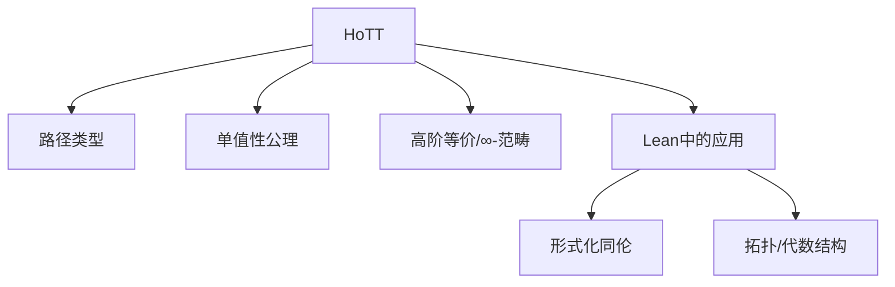

# 1.12 同伦类型论 / Homotopy Type Theory (HoTT)

[返回目录](../CONTINUOUS_PROGRESS.md) | [上一节: 1.11-范畴论与类型理论.md](1.11-范畴论与类型理论.md)

---

## 1.12.1 HoTT 基础与核心思想 / Foundations and Core Ideas

- 类型被解释为空间，等价为路径，支持高阶等价与∞-范畴
- 路径类型（Path Types）、单值性公理（Univalence Axiom）
- 类型等价与等式的统一

**公式：**
$$
A \simeq B \implies A = B
$$

**Lean 代码示例：**

```lean
inductive Path {A : Type} (a : A) : A → Type where
  | refl : Path a a

axiom univalence {A B : Type} : (A ≃ B) ≃ (A = B)
```

---

## 1.12.2 路径类型与高阶等价 / Path Types and Higher Equivalence

- $\mathsf{Path}_A(a, b)$ 表示 $a, b$ 在 $A$ 中的路径
- $n$-路径、$n$-等价、∞-范畴

**Lean 代码示例：**

```lean
inductive Path2 {A : Type} {a b : A} (p q : Path a b) : Type where
  | refl2 : Path2 p p
```

---

## 1.12.3 单值性公理与创新 / Univalence Axiom and Innovations

- 单值性公理（Univalence Axiom）：等价类型可互换
- HoTT推动了类型论、范畴论、拓扑学的深度融合
- AI辅助HoTT证明、可视化等前沿方向

---

## 1.12.4 HoTT在Lean与数学中的应用 / Applications of HoTT in Lean and Mathematics

- HoTT在形式化同伦、拓扑、代数结构等领域的应用
- Lean HoTT库、路径类型、单值性公理的实际建模

**Lean 伪代码：**

```lean
import hott.init
-- 使用路径类型、单值性公理等
```

---

## 1.12.5 图表与多表征 / Diagrams and Multi-Representation



---

## 1.12.6 交叉引用 / Cross References

- [1.8-类型论理论模型.md](1.8-类型论理论模型.md)
- [1.11-范畴论与类型理论.md](1.11-范畴论与类型理论.md)

## 1.12.7 创新建议 / Innovation Suggestions

- 中文：探索HoTT在代数拓扑、量子信息、AI辅助证明等领域的创新应用。
- English: Explore innovative applications of HoTT in algebraic topology, quantum information, and AI-assisted proof.

## 1.12.8 工程案例 / Engineering Case

- 中文：利用同伦类型论驱动拓扑数据分析、自动化建模复杂数学结构。
- English: Use homotopy type theory to drive topological data analysis and automate modeling of complex mathematical structures.

## 1.12.9 前沿趋势 / Frontiers and Trends

- 中文：单值性公理的工程实现、HoTT与∞-范畴的深度融合、AI辅助HoTT证明。
- English: Engineering implementation of the univalence axiom, deep integration of HoTT and ∞-categories, and AI-assisted HoTT proofs.

## 1.12.10 AI辅助与多模态表达 / AI Assistance and Multi-Modal Representation

- 中文：结合AI自动生成HoTT证明、可视化高阶等价结构，支持Latex、Mermaid、Lean/Coq代码多模态表达。
- English: Integrate AI to automatically generate HoTT proofs and visualize higher equivalence structures, supporting multi-modal representation with Latex, Mermaid, and Lean/Coq code.
