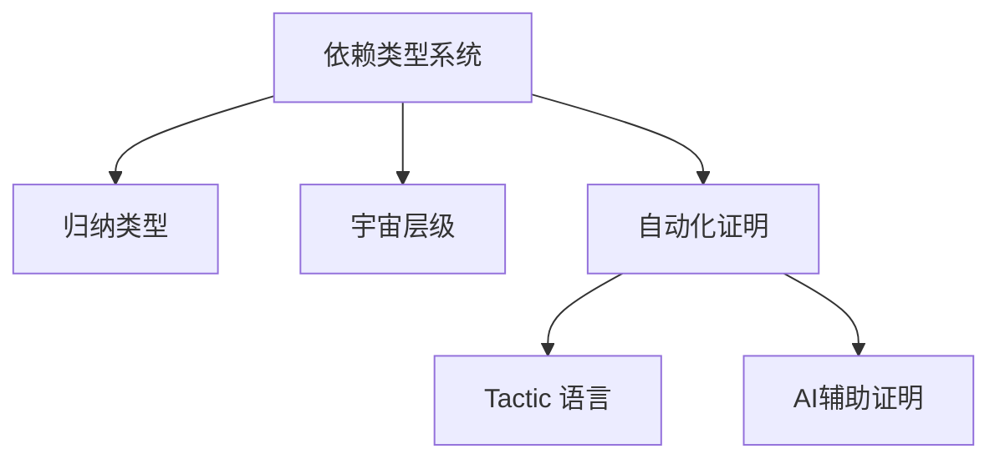

# 1.2 Lean 类型系统与证明系统 / Lean Type System and Proof System

[返回目录](../CONTINUOUS_PROGRESS.md) | [上一节: 1.1-lean-理论基础与语义模型.md](1.1-lean-理论基础与语义模型.md) | [下一节: 1.3-lean-语法结构与表达式分析.md](1.3-lean-语法结构与表达式分析.md)

---

## 1.2.1 依赖类型系统 / Dependent Type System

Lean 的类型系统以依赖类型为核心，支持 $\Pi$-类型（依赖函数类型）、$\Sigma$-类型（依赖积类型）、归纳类型、宇宙层级等。

### 1.2.1.1 核心概念 / Core Concepts

**依赖类型**允许类型依赖于值，提供了前所未有的表达能力：

- **Π-类型**：依赖函数类型，返回类型依赖于输入值
- **Σ-类型**：依赖积类型，第二个分量的类型依赖于第一个分量
- **归纳类型**：递归定义的数据结构
- **宇宙层级**：避免Russell悖论的层级系统

### 1.2.1.2 形式化定义 / Formal Definition

**Latex公式：**
$$
\Pi_{x:A} B(x) \qquad \Sigma_{x:A} B(x)
$$

**类型形成规则：**
$$\frac{\Gamma \vdash A : \text{Type} \quad \Gamma, x:A \vdash B(x) : \text{Type}}{\Gamma \vdash \Pi_{x:A} B(x) : \text{Type}}$$

$$\frac{\Gamma \vdash A : \text{Type} \quad \Gamma, x:A \vdash B(x) : \text{Type}}{\Gamma \vdash \Sigma_{x:A} B(x) : \text{Type}}$$

### 1.2.1.3 Lean 代码示例 / Lean Code Examples

```lean
-- 依赖类型示例
inductive Vec (α : Type) : Nat → Type where
  | nil  : Vec α 0
  | cons : α → Vec α n → Vec α (n+1)

-- Π-类型示例：依赖函数
def safe_index {α : Type} {n : Nat} (v : Vec α n) (i : Fin n) : α :=
  match v, i with
  | Vec.cons x _, ⟨0, _⟩ => x
  | Vec.cons _ xs, ⟨i + 1, h⟩ => safe_index xs ⟨i, Nat.lt_of_succ_lt_succ h⟩

-- Σ-类型示例：依赖积
def find_positive : List Nat → Option (Σ n : Nat, n > 0) :=
  λ xs => match xs with
  | [] => none
  | x :: xs => if h : x > 0 then some ⟨x, h⟩ else find_positive xs
```

---

## 1.2.2 归纳类型与递归定义 / Inductive Types and Recursion

Lean 支持强大的归纳类型和递归定义，广泛用于数据结构和证明。

### 1.2.2.1 归纳类型基础 / Inductive Types Basics

**归纳类型**是Lean中定义数据结构的核心机制：

- **基础构造子**：定义类型的基本元素
- **归纳构造子**：基于已有元素构造新元素
- **模式匹配**：基于构造子进行模式匹配
- **归纳原理**：自动生成的归纳证明原理

### 1.2.2.2 递归定义 / Recursive Definitions

**递归定义**允许函数调用自身，但需要保证终止性：

- **结构递归**：基于归纳类型的结构进行递归
- **良基递归**：基于良基关系进行递归
- **终止性证明**：确保递归函数总是终止

### 1.2.2.3 Lean 代码示例 / Lean Code Examples

```lean
-- 基本归纳类型
inductive Nat : Type
| zero : Nat
| succ : Nat → Nat

-- 列表类型
inductive List (α : Type) : Type
| nil : List α
| cons : α → List α → List α

-- 二叉树
inductive Tree (α : Type) : Type
| leaf : Tree α
| node : α → Tree α → Tree α → Tree α

-- 结构递归函数
def add : Nat → Nat → Nat
| Nat.zero, n => n
| Nat.succ m, n => Nat.succ (add m n)

-- 良基递归函数
def factorial : Nat → Nat
| 0 => 1
| n + 1 => (n + 1) * factorial n
termination_by factorial n => n

-- 模式匹配
def isEven : Nat → Bool
| 0 => true
| 1 => false
| n + 2 => isEven n
```

---

## 1.2.3 类型宇宙与层级 / Universe Hierarchies

为避免悖论，Lean 采用类型宇宙层级：
$$
\text{Type}_0 : \text{Type}_1 : \text{Type}_2 : \cdots
$$

### 1.2.3.1 宇宙层级原理 / Universe Hierarchy Principle

**宇宙层级**是避免Russell悖论的关键机制：

- **层级递增**：每个宇宙都是下一个宇宙的元素
- **类型安全**：防止自引用导致的悖论
- **表达能力**：在保持一致性的前提下最大化表达能力

### 1.2.3.2 Lean 宇宙系统 / Lean Universe System

**Lean 4 的宇宙系统**：

```lean
-- 宇宙层级
#check Type  -- Type : Type 1
#check Type 1  -- Type 1 : Type 2
#check Type 2  -- Type 2 : Type 3

-- Prop 宇宙
#check Prop  -- Prop : Type

-- Sort 泛化
#check Sort 0  -- Sort 0 : Sort 1
#check Sort 1  -- Sort 1 : Sort 2
```

### 1.2.3.3 宇宙多态性 / Universe Polymorphism

**宇宙多态性**允许函数在不同宇宙层级上工作：

```lean
-- 宇宙多态函数
def id {α : Type u} : α → α := λ x => x

-- 宇宙约束
def universe_constraint {α : Type u} {β : Type v} (f : α → β) : α → β := f

-- 宇宙提升
def lift_universe {α : Type u} : α → α := λ x => x
```

---

## 1.2.4 证明系统与自动化 / Proof System and Automation

Lean 的证明系统基于自然演绎、归纳法、序列演算等，支持 tactic 语言实现自动化证明。

### 1.2.4.1 证明理论基础 / Proof Theory Foundation

**Lean 的证明系统**基于多种形式化推理方法：

- **自然演绎**：模拟人类直觉推理的证明系统
- **归纳法**：基于结构递归的证明方法
- **序列演算**：强调结构规则和归约过程的证明系统
- **类型论证明**：基于Curry-Howard对应的证明方法

### 1.2.4.2 Tactic 语言 / Tactic Language

**Tactic 语言**是Lean自动化证明的核心：

```lean
-- 基本tactic
lemma add_comm (a b : Nat) : a + b = b + a := by
  simp [Nat.add_comm]

-- 复杂证明
lemma add_assoc (a b c : Nat) : (a + b) + c = a + (b + c) := by
  induction c with
  | zero => simp [Nat.add_zero]
  | succ c ih => 
    simp [Nat.add_succ]
    exact congrArg Nat.succ ih

-- 自动化证明
lemma complex_proof (P Q R : Prop) : (P → Q) → (Q → R) → (P → R) := by
  aesop

-- 自定义tactic
macro "auto_arith" : tactic => `(tactic|
  first | simp | intro | apply | linarith | ring
)
```

### 1.2.4.3 证明自动化 / Proof Automation

**自动化证明策略**：

- **simp**：基于重写规则的简化
- **aesop**：自动化搜索证明
- **linarith**：线性算术求解
- **ring**：环运算自动化
- **omega**：整数算术求解

---

## 1.2.5 类型安全与一致性 / Type Safety and Consistency

Lean 保证类型安全（Well-typed programs do not go wrong）和一致性（不可同时证明命题与其否定）。

### 1.2.5.1 类型安全 / Type Safety

**类型安全**确保良类型程序不会出错：

- **进展定理**：良类型项要么是值，要么可以继续归约
- **保持定理**：归约保持类型
- **唯一性**：每个良类型项有唯一类型（模重命名）

```lean
-- 类型安全示例
def safe_divide (n m : Nat) (h : m ≠ 0) : Nat :=
  -- 类型系统确保 m ≠ 0 成立
  sorry

-- 类型安全的模式匹配
def safe_head {α : Type} : List α → Option α
| [] => none
| x :: _ => some x
```

### 1.2.5.2 一致性 / Consistency

**一致性**确保系统不会产生矛盾：

- **逻辑一致性**：不能同时证明命题及其否定
- **类型一致性**：类型系统内部无矛盾
- **语义一致性**：语法与语义保持一致

**一致性证明思路：**

- 归约到核心类型理论
- 利用归纳法证明无矛盾性
- 构造模型验证一致性

### 1.2.5.3 可靠性 / Soundness

**可靠性**确保证明的正确性：

```lean
-- 可靠性示例：证明蕴含传递律
theorem imp_trans (A B C : Prop) : (A → B) → (B → C) → (A → C) := by
  intro h₁ h₂ a
  apply h₂
  apply h₁
  exact a

-- 类型系统确保证明的正确性
#check imp_trans  -- (A → B) → (B → C) → (A → C)
```

---

## 1.2.6 前沿创新与学术对比 / Frontiers and Academic Comparison

- 支持同伦类型论（HoTT）、高阶类型、范畴论建模
- 自动化证明与AI辅助证明（如 Lean GPT）
- 与 Coq、Agda、Haskell 等系统的类型系统对比

### 1.2.6.1 前沿创新 / Frontiers and Innovations

**Lean 的前沿特性**：

- **同伦类型论（HoTT）**：支持路径类型、单值性公理
- **高阶类型**：支持高阶抽象和类型级编程
- **范畴论建模**：完整的范畴论形式化
- **AI辅助证明**：集成大语言模型的证明辅助

```lean
-- HoTT 特性示例
def path_type {A : Type} (a b : A) : Type := a = b

-- 高阶类型示例
def higher_order {F : Type → Type} [Functor F] (α : Type) : F α → F α := id

-- 范畴论建模示例
structure Category (Obj : Type) where
  Hom : Obj → Obj → Type
  id : ∀ X, Hom X X
  comp : ∀ {X Y Z}, Hom X Y → Hom Y Z → Hom X Z
```

### 1.2.6.2 系统对比 / System Comparison

| 系统   | 类型系统 | 依赖类型 | 归纳类型 | 宇宙层级 | 自动化证明 | HoTT支持 | 范畴论 |
|--------|----------|----------|----------|----------|------------|----------|--------|
| Lean   | DTT      | ✔        | ✔        | ✔        | 强         | ✔        | ✔      |
| Coq    | DTT      | ✔        | ✔        | ✔        | 强         | 部分     | 部分   |
| Agda   | DTT      | ✔        | ✔        | ✔        | 中         | 部分     | 部分   |
| Haskell| STT      | ✘        | 部分     | ✘        | 弱         | ✘        | ✘      |
| Idris  | DTT      | ✔        | ✔        | ✔        | 中         | 部分     | 部分   |

### 1.2.6.3 性能与工程特性 / Performance and Engineering Features

**Lean 4 的工程优势**：

- **编译速度**：优化的类型检查算法
- **内存效率**：高效的内存管理
- **工具链**：完整的IDE支持和工具链
- **生态系统**：丰富的数学库（mathlib4）

---

## 1.2.7 图表与多表征 / Diagrams and Multi-Representation



---

## 1.2.8 交叉引用 / Cross References

- [1.1-lean-理论基础与语义模型.md](1.1-lean-理论基础与语义模型.md)
- [1.8-类型论理论模型.md](1.8-类型论理论模型.md)
- [1.9-证明论与推理系统.md](1.9-证明论与推理系统.md)
- [1.10-模型论与语义模型.md](1.10-模型论与语义模型.md)

---

## 1.2.9 2025 规范对齐 / Alignment with Lean 4 (2025)

- Sort 与 Type：`Sort u` 泛化 `Type u`；`Type u` 是 `Sort (u+1)` 的别名。编写库时推荐显式/隐式宇宙变量，避免不必要的 `max` 膨胀。
- `Prop` 与证明不可辨识：`Prop` 中证明具有可擦除性（proof irrelevance），不参与计算；应避免将 `Prop` 级证据用于计算性定义。
- 归纳/递归：优先结构递归；必要时使用良基递归（`termination_by`/`decreasing_by`）明确终止性证明。
- 类型类与实例：使用 `instance`/`variable`/`attribute [simp]` 组织推断；避免循环实例；标注优先级以控制搜索。
- 代码示例需可编译，标注必要 `import`（如 `import Mathlib`）。
