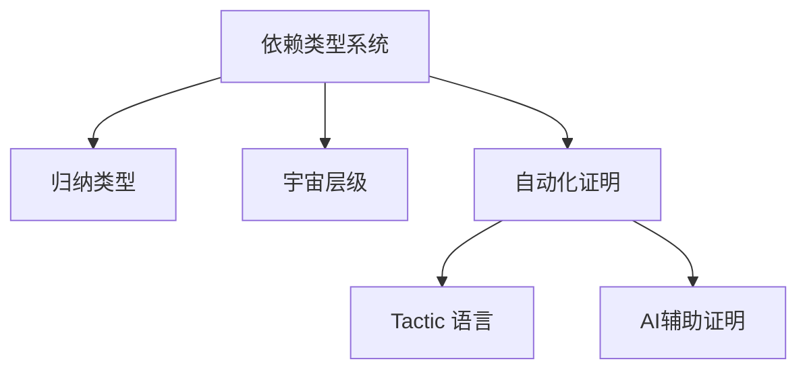

# 1.2 Lean 类型系统与证明系统 / Lean Type System and Proof System

[返回目录](../CONTINUOUS_PROGRESS.md) | [上一节: 1.1-lean-理论基础与语义模型.md](1.1-lean-理论基础与语义模型.md) | [下一节: 1.3-lean-语法结构与表达式分析.md](1.3-lean-语法结构与表达式分析.md)

---

## 1.2.1 依赖类型系统 / Dependent Type System

Lean 的类型系统以依赖类型为核心，支持 $\Pi$-类型（依赖函数类型）、$\Sigma$-类型（依赖积类型）、归纳类型、宇宙层级等。

**Latex公式：**
$$
\Pi_{x:A} B(x) \qquad \Sigma_{x:A} B(x)
$$

**Lean 代码示例：**

```lean
-- 依赖类型示例
inductive Vec (α : Type) : Nat → Type where
  | nil  : Vec α 0
  | cons : α → Vec α n → Vec α (n+1)
```

---

## 1.2.2 归纳类型与递归定义 / Inductive Types and Recursion

Lean 支持强大的归纳类型和递归定义，广泛用于数据结构和证明。

**Lean 代码示例：**

```lean
inductive Nat : Type
| zero : Nat
| succ : Nat → Nat
```

---

## 1.2.3 类型宇宙与层级 / Universe Hierarchies

为避免悖论，Lean 采用类型宇宙层级：
$$
\text{Type}_0 : \text{Type}_1 : \text{Type}_2 : \cdots
$$

---

## 1.2.4 证明系统与自动化 / Proof System and Automation

Lean 的证明系统基于自然演绎、归纳法、序列演算等，支持 tactic 语言实现自动化证明。

**Lean 代码示例：**

```lean
lemma add_comm (a b : Nat) : a + b = b + a :=
  by simp [Nat.add_comm]
```

---

## 1.2.5 类型安全与一致性 / Type Safety and Consistency

Lean 保证类型安全（Well-typed programs do not go wrong）和一致性（不可同时证明命题与其否定）。

**一致性证明思路：**

- 归约到核心类型理论
- 利用归纳法证明无矛盾性

---

## 1.2.6 前沿创新与学术对比 / Frontiers and Academic Comparison

- 支持同伦类型论（HoTT）、高阶类型、范畴论建模
- 自动化证明与AI辅助证明（如 Lean GPT）
- 与 Coq、Agda、Haskell 等系统的类型系统对比

| 系统   | 类型系统 | 依赖类型 | 归纳类型 | 宇宙层级 | 自动化证明 |
|--------|----------|----------|----------|----------|------------|
| Lean   | DTT      | ✔        | ✔        | ✔        | 强         |
| Coq    | DTT      | ✔        | ✔        | ✔        | 强         |
| Agda   | DTT      | ✔        | ✔        | ✔        | 中         |
| Haskell| STT      | ✘        | 部分     | ✘        | 弱         |

---

## 1.2.7 图表与多表征 / Diagrams and Multi-Representation



---

## 1.2.8 交叉引用 / Cross References

- [1.1-lean-理论基础与语义模型.md](1.1-lean-理论基础与语义模型.md)
- [1.8-类型论理论模型.md](1.8-类型论理论模型.md)
- [1.9-证明论与推理系统.md](1.9-证明论与推理系统.md)
- [1.10-模型论与语义模型.md](1.10-模型论与语义模型.md)

---

## 1.2.9 2025 规范对齐 / Alignment with Lean 4 (2025)

- Sort 与 Type：`Sort u` 泛化 `Type u`；`Type u` 是 `Sort (u+1)` 的别名。编写库时推荐显式/隐式宇宙变量，避免不必要的 `max` 膨胀。
- `Prop` 与证明不可辨识：`Prop` 中证明具有可擦除性（proof irrelevance），不参与计算；应避免将 `Prop` 级证据用于计算性定义。
- 归纳/递归：优先结构递归；必要时使用良基递归（`termination_by`/`decreasing_by`）明确终止性证明。
- 类型类与实例：使用 `instance`/`variable`/`attribute [simp]` 组织推断；避免循环实例；标注优先级以控制搜索。
- 代码示例需可编译，标注必要 `import`（如 `import Mathlib`）。
