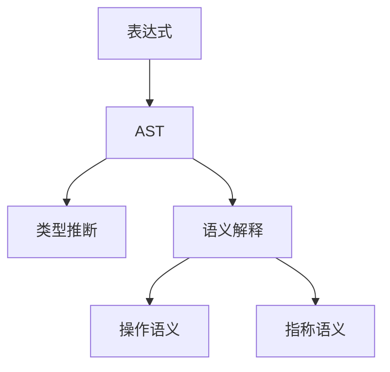

# 1.3 Lean 语法结构与表达式分析 / Lean Syntax Structure and Expression Analysis

[返回目录](../CONTINUOUS_PROGRESS.md) | [上一节: 1.2-lean-类型系统与证明系统.md](1.2-lean-类型系统与证明系统.md) | [下一节: 1.4-lean-元编程与策略系统.md](1.4-lean-元编程与策略系统.md)

---

## 1.3.1 形式语法与BNF / Formal Syntax and BNF

Lean 的语法结构采用形式化定义，常用巴科斯-诺尔范式（BNF）描述表达式、类型、项等基本构造。

**BNF示例：**
$$
\begin{align*}
\text{Expr} &::= \text{var} \mid \text{const} \mid \text{app} \mid \text{lam} \\
\text{Type} &::= \text{Type} \mid \text{Type} \to \text{Type}
\end{align*}
$$

---

## 1.3.2 表达式分类与抽象语法树 / Expression Categories and AST

Lean 表达式分为变量、常量、应用、lambda、归纳类型等，抽象语法树（AST）用于表达式的结构化分析。

**Lean 代码示例：**

```lean
inductive Expr where
  | var    : Nat → Expr
  | sort   : Level → Expr
  | const  : Name → List Level → Expr
  | app    : Expr → Expr → Expr
  | lam    : Name → Expr → Expr → Expr
  | pi     : Name → Expr → Expr → Expr
```

---

## 1.3.3 语法与语义关系 / Syntax-Semantics Relationship

- 语法结构决定表达式的可解析性和类型推断方式
- 语义模型为语法对象赋予数学意义
- 语法树到语义解释的映射是编译器与证明器的核心

---

## 1.3.4 AST与类型推断 / AST and Type Inference

Lean 的类型推断基于AST递归遍历，结合类型规则自动推导表达式类型。

**Lean 代码示例：**

```lean
def inferType : Expr → Option Type
  | Expr.var n      => ...
  | Expr.const n _  => ...
  | Expr.app f x    => ...
  | Expr.lam n t b  => ...
  | Expr.pi n t b   => ...
```

---

## 1.3.5 前沿表达式分析方法 / Advanced Expression Analysis

- 语法制导翻译（SDT）、属性文法
- 语法与语义的联合建模（如范畴语法、依存类型语法）
- 代码自动生成与AST可视化

---

## 1.3.6 图表与多表征 / Diagrams and Multi-Representation



---

## 1.3.7 交叉引用 / Cross References

- [1.2-lean-类型系统与证明系统.md](1.2-lean-类型系统与证明系统.md)
- [1.8-类型论理论模型.md](1.8-类型论理论模型.md)
- [1.10-模型论与语义模型.md](1.10-模型论与语义模型.md)
