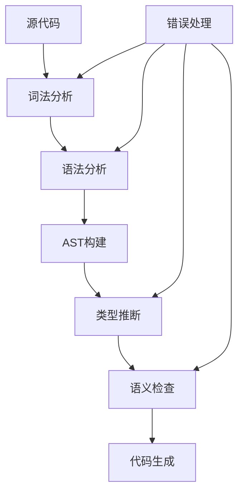
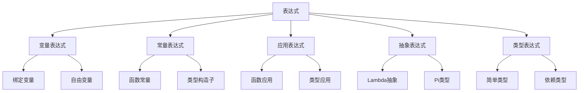
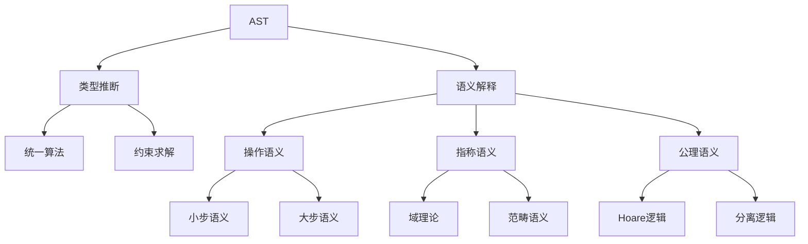
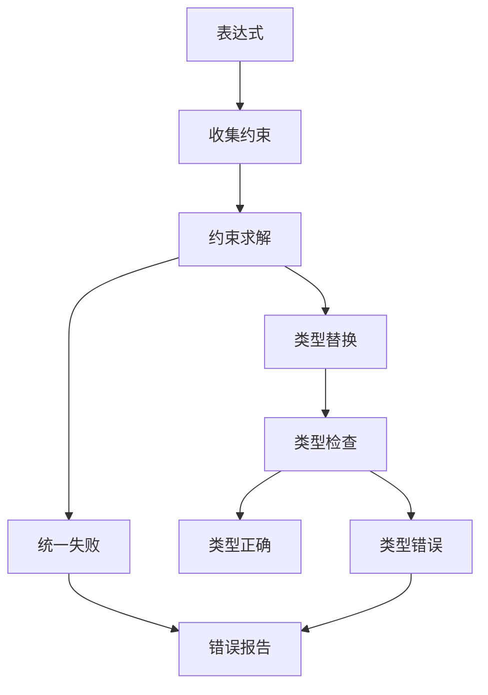
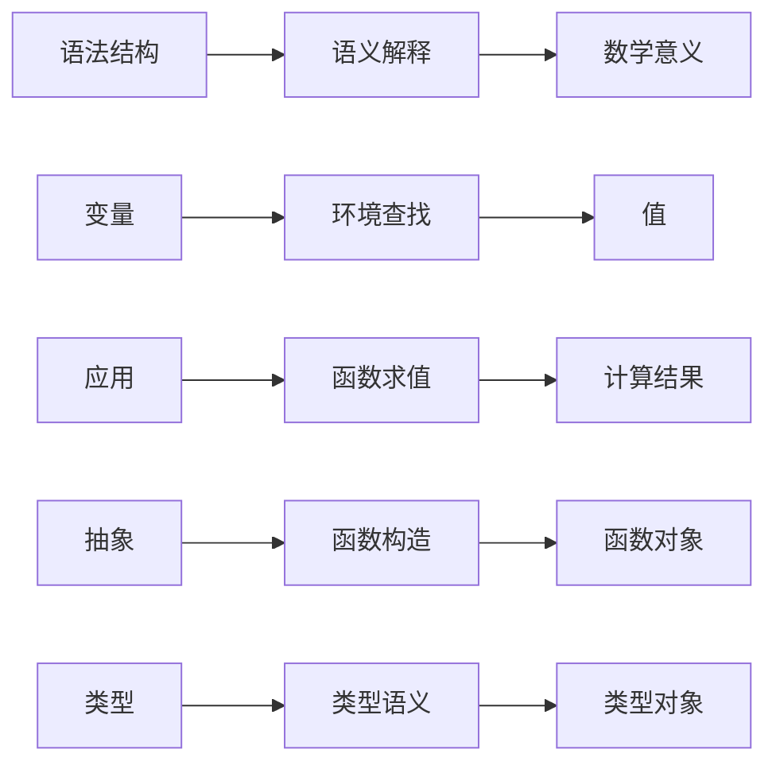

# 1.3 Lean 语法结构与表达式分析 / Lean Syntax Structure and Expression Analysis

[返回目录](../CONTINUOUS_PROGRESS.md) | [上一节: 1.2-lean-类型系统与证明系统.md](1.2-lean-类型系统与证明系统.md) | [下一节: 1.4-lean-元编程与策略系统.md](1.4-lean-元编程与策略系统.md)

---

## 1.3.1 形式语法与BNF / Formal Syntax and BNF

Lean 的语法结构采用形式化定义，常用巴科斯-诺尔范式（BNF）描述表达式、类型、项等基本构造。这种形式化方法确保了语法的精确性和可解析性。

### 基本语法构造 / Basic Syntax Constructions

**BNF示例：**
$$
\begin{align*}
\text{Expr} &::= \text{var} \mid \text{const} \mid \text{app} \mid \text{lam} \\
\text{Type} &::= \text{Type} \mid \text{Type} \to \text{Type} \\
\text{Term} &::= \text{Expr} \mid \text{Type} \mid \text{Level}
\end{align*}
$$

### 语法规则详解 / Detailed Syntax Rules

**表达式语法**：

```bnf
Expr ::= var Nat                    -- 变量
       | const Name [Level]         -- 常量
       | app Expr Expr              -- 应用
       | lam Name Expr Expr         -- lambda抽象
       | pi Name Expr Expr          -- Pi类型
       | let Name Expr Expr         -- let绑定
       | match Expr [Case]          -- 模式匹配
```

**类型语法**：

```bnf
Type ::= Type Level                 -- 宇宙
       | Type -> Type               -- 函数类型
       | Π Name : Type, Type        -- 依赖函数类型
       | Σ Name : Type, Type        -- 依赖积类型
       | inductive Name [Param]     -- 归纳类型
```

**级别语法**：

```bnf
Level ::= 0                         -- 零级
        | succ Level                -- 后继
        | max Level Level           -- 最大值
        | imax Level Level          -- 隐式最大值
```

---

## 1.3.2 表达式分类与抽象语法树 / Expression Categories and AST

Lean 表达式分为变量、常量、应用、lambda、归纳类型等，抽象语法树（AST）用于表达式的结构化分析。AST是编译器前端与后端之间的桥梁，承载了语法和语义信息。

### 表达式分类 / Expression Categories

**基本表达式类型**：

- **变量表达式**：绑定变量和自由变量
- **常量表达式**：预定义函数、类型构造子
- **应用表达式**：函数应用，最核心的计算构造
- **抽象表达式**：lambda抽象，函数定义
- **类型表达式**：Pi类型、Sigma类型等

### AST结构定义 / AST Structure Definition

**Lean 代码示例：**

```lean
-- 基本表达式类型
inductive Expr where
  | var    : Nat → Expr                    -- 变量（德布鲁因索引）
  | sort   : Level → Expr                  -- 宇宙类型
  | const  : Name → List Level → Expr      -- 常量（名称+级别参数）
  | app    : Expr → Expr → Expr            -- 函数应用
  | lam    : Name → Expr → Expr → Expr     -- lambda抽象
  | pi     : Name → Expr → Expr → Expr     -- Pi类型（依赖函数）
  | let    : Name → Expr → Expr → Expr     -- let绑定
  | match  : Expr → List Case → Expr       -- 模式匹配
  | proj   : Expr → Nat → Expr             -- 投影
  | mdata  : MData → Expr → Expr           -- 元数据

-- 模式匹配分支
structure Case where
  patterns : List Pattern
  rhs : Expr

-- 模式
inductive Pattern where
  | ctor : Name → List Pattern → Pattern
  | var  : Name → Pattern
  | lit  : Literal → Pattern
```

### AST遍历与分析 / AST Traversal and Analysis

```lean
-- AST遍历器
def traverseExpr (f : Expr → Option Expr) : Expr → Option Expr
  | e@(Expr.var _) => f e
  | e@(Expr.const _ _) => f e
  | Expr.app fn arg => do
    let fn' ← traverseExpr f fn
    let arg' ← traverseExpr f arg
    f (Expr.app fn' arg')
  | Expr.lam n ty body => do
    let ty' ← traverseExpr f ty
    let body' ← traverseExpr f body
    f (Expr.lam n ty' body')
  | e => f e
```

---

## 1.3.3 语法与语义关系 / Syntax-Semantics Relationship

语法与语义的关系是形式化语言理论的核心，在Lean中体现为从语法结构到数学意义的映射关系。

### 基本关系 / Basic Relationship

- **语法结构**决定表达式的可解析性和类型推断方式
- **语义模型**为语法对象赋予数学意义
- **语法树到语义解释的映射**是编译器与证明器的核心

### 语法-语义映射 / Syntax-Semantics Mapping

```lean
-- 语法到语义的映射函数
def syntaxToSemantics : Expr → SemanticValue
  | Expr.var n => lookupVariable n
  | Expr.const name levels => lookupConstant name levels
  | Expr.app fn arg => applyFunction (syntaxToSemantics fn) (syntaxToSemantics arg)
  | Expr.lam name ty body => 
    SemanticValue.lambda (λ x => syntaxToSemantics (substitute body name x))
  | Expr.pi name ty body =>
    SemanticValue.pi (λ x => syntaxToSemantics (substitute body name x))

-- 语义解释器
structure SemanticValue where
  type : Type
  value : type
  properties : List Property

-- 语义属性
inductive Property where
  | wellTyped : Property
  | normalized : Property
  | closed : Property
```

### 语法指导语义 / Syntax-Directed Semantics

**语法制导翻译**：

```lean
-- 语法制导的语义计算
def syntaxDirectedSemantics : Expr → Environment → SemanticValue
  | Expr.var n, env => env.lookup n
  | Expr.app fn arg, env => do
    let fnVal ← syntaxDirectedSemantics fn env
    let argVal ← syntaxDirectedSemantics arg env
    fnVal.apply argVal
  | Expr.lam name ty body, env => 
    SemanticValue.lambda (λ x => 
      syntaxDirectedSemantics body (env.extend name x))
```

### 语义一致性 / Semantic Consistency

**类型安全定理**：

```lean
theorem typeSafety {e : Expr} {v : SemanticValue} :
  wellTyped e → e ⇓ v → v.type = inferType e := by
  -- 类型安全证明
  sorry
```

---

## 1.3.4 AST与类型推断 / AST and Type Inference

Lean 的类型推断基于AST递归遍历，结合类型规则自动推导表达式类型。这是Lean类型系统的核心算法，确保所有表达式都有正确的类型。

### 类型推断算法 / Type Inference Algorithm

**基本类型推断**：

```lean
-- 类型推断函数
def inferType (env : Environment) : Expr → Option Type
  | Expr.var n => env.lookupType n
  | Expr.const name levels => lookupConstantType name levels
  | Expr.app fn arg => do
    let fnType ← inferType env fn
    let argType ← inferType env arg
    match fnType with
    | Type.pi dom cod => 
      if argType = dom then some (cod arg)
      else none
    | _ => none
  | Expr.lam name ty body => do
    let bodyType ← inferType (env.extend name ty) body
    some (Type.pi ty bodyType)
  | Expr.pi name ty body => do
    let bodyType ← inferType (env.extend name ty) body
    some Type.sort
```

### 统一算法 / Unification Algorithm

**类型统一**：

```lean
-- 类型统一算法
def unify (t1 t2 : Type) : Option Substitution
  | Type.var x, Type.var y => 
    if x = y then some emptySubst else some (singleton x (Type.var y))
  | Type.var x, t => 
    if occurs x t then none else some (singleton x t)
  | t, Type.var x => unify (Type.var x) t
  | Type.app f1 a1, Type.app f2 a2 => do
    let subst1 ← unify f1 f2
    let subst2 ← unify (applySubst subst1 a1) (applySubst subst1 a2)
    composeSubst subst1 subst2
  | t1, t2 => if t1 = t2 then some emptySubst else none
```

### 约束求解 / Constraint Solving

**类型约束系统**：

```lean
-- 类型约束
structure TypeConstraint where
  left : Type
  right : Type
  context : Environment

-- 约束求解器
def solveConstraints (constraints : List TypeConstraint) : Option Substitution
  | [] => some emptySubst
  | c :: cs => do
    let subst ← unify c.left c.right
    let remaining ← map (λ c' => applyConstraint subst c') cs
    let finalSubst ← solveConstraints remaining
    composeSubst subst finalSubst
```

### 类型推断的复杂性 / Complexity of Type Inference

**算法复杂度分析**：

- **基本类型推断**：O(n²) 其中n是表达式大小
- **统一算法**：O(n²) 最坏情况
- **约束求解**：NP完全问题
- **实际优化**：使用启发式算法和缓存机制

---

## 1.3.5 前沿表达式分析方法 / Advanced Expression Analysis

前沿表达式分析方法结合了现代编程语言理论和实践，为Lean提供了强大的分析和处理能力。

### 语法制导翻译 / Syntax-Directed Translation

**属性文法**：

```lean
-- 属性文法定义
structure AttributeGrammar where
  syntax : Syntax
  attributes : List Attribute
  semanticRules : List SemanticRule

-- 语义规则
structure SemanticRule where
  production : Production
  inheritedAttributes : List Attribute
  synthesizedAttributes : List Attribute
  semanticAction : Environment → SemanticValue

-- 语法制导翻译器
def syntaxDirectedTranslator (grammar : AttributeGrammar) : Expr → SemanticValue
  | e => applySemanticRules grammar e
```

### 语法与语义联合建模 / Joint Syntax-Semantics Modeling

**范畴语法**：

```lean
-- 范畴语法结构
structure CategorialGrammar where
  basicTypes : List Type
  combinators : List Combinator
  lexicon : Name → List Type

-- 组合子
inductive Combinator where
  | forward : Type → Type → Type → Combinator  -- 前向应用
  | backward : Type → Type → Type → Combinator -- 后向应用
  | composition : Type → Type → Type → Combinator -- 组合

-- 范畴语法解析器
def categorialParser (grammar : CategorialGrammar) : Expr → Option Type
  | e => parseWithCombinators grammar e
```

**依存类型语法**：

```lean
-- 依存类型语法
structure DependentTypeGrammar where
  baseTypes : List Type
  typeFamilies : List TypeFamily
  constructors : List Constructor

-- 类型族
structure TypeFamily where
  name : Name
  parameters : List Type
  indices : List Type
  constructors : List Constructor

-- 依存类型解析
def dependentTypeParser (grammar : DependentTypeGrammar) : Expr → Option Type
  | e => inferDependentType grammar e
```

### 代码自动生成 / Code Generation

**AST到代码生成**：

```lean
-- 代码生成器
def codeGenerator : Expr → String
  | Expr.var n => s!"x{n}"
  | Expr.const name _ => toString name
  | Expr.app fn arg => s!"({codeGenerator fn} {codeGenerator arg})"
  | Expr.lam name ty body => 
    s!"λ {name} : {codeGenerator ty}, {codeGenerator body}"
  | Expr.pi name ty body =>
    s!"Π {name} : {codeGenerator ty}, {codeGenerator body}"

-- 多目标代码生成
def multiTargetGenerator (target : Target) : Expr → String
  | Target.Lean => generateLeanCode
  | Target.Coq => generateCoqCode
  | Target.Agda => generateAgdaCode
  | Target.Haskell => generateHaskellCode
```

### AST可视化 / AST Visualization

**可视化工具**：

```lean
-- AST可视化结构
structure ASTVisualizer where
  layout : LayoutAlgorithm
  styling : VisualStyle
  interaction : InteractionMode

-- 布局算法
inductive LayoutAlgorithm where
  | tree : LayoutAlgorithm
  | dag : LayoutAlgorithm
  | hierarchical : LayoutAlgorithm

-- 可视化生成
def visualizeAST (visualizer : ASTVisualizer) : Expr → VisualGraph
  | e => generateVisualGraph visualizer e
```

### 静态分析 / Static Analysis

**控制流分析**：

```lean
-- 控制流图
structure ControlFlowGraph where
  nodes : List CFGNode
  edges : List CFGEdge
  entry : CFGNode
  exit : CFGNode

-- 数据流分析
def dataFlowAnalysis (cfg : ControlFlowGraph) : DataFlowResult
  | cfg => analyzeDataFlow cfg

-- 类型流分析
def typeFlowAnalysis (expr : Expr) : TypeFlowResult
  | e => analyzeTypeFlow e
```

---

## 1.3.6 图表与多表征 / Diagrams and Multi-Representation

### 语法处理流程 / Syntax Processing Flow



### 表达式分类层次 / Expression Classification Hierarchy



### 语义解释层次 / Semantic Interpretation Hierarchy



### 类型推断流程 / Type Inference Flow



### 语法-语义映射关系 / Syntax-Semantics Mapping



---

## 1.3.7 交叉引用 / Cross References

### 理论关联 / Theoretical Connections

- [1.2-lean-类型系统与证明系统.md](1.2-lean-类型系统与证明系统.md) - 类型系统基础
- [1.8-类型论理论模型.md](1.8-类型论理论模型.md) - 类型论理论基础
- [1.10-模型论与语义模型.md](1.10-模型论与语义模型.md) - 语义模型理论
- [1.8.4-Martin-Löf类型论.md](1.8.4-Martin-Löf类型论.md) - MLTT语法语义
- [1.8.5-Curry-Howard对应.md](1.8.5-Curry-Howard对应.md) - 逻辑类型对应
- [1.10.1.1-小步语义与大步语义对比.md](1.10.1.1-小步语义与大步语义对比.md) - 操作语义
- [1.10.2.1-域理论详解.md](1.10.2.1-域理论详解.md) - 指称语义基础

### 应用领域 / Application Domains

- **编译器设计**：语法分析、类型检查、代码生成
- **程序验证**：静态分析、类型安全、程序正确性
- **定理证明**：证明项构造、类型推断、证明检查
- **语言设计**：语法设计、语义定义、类型系统
- **形式化方法**：形式语法、语义模型、验证工具

### 相关技术 / Related Technologies

- **解析器生成器**：ANTLR、Yacc、Bison
- **类型检查器**：Hindley-Milner、统一算法
- **语义分析**：属性文法、语法制导翻译
- **代码生成**：中间表示、目标代码生成
- **静态分析**：控制流分析、数据流分析

---

## 1.3.8 Lean 4（2025）语法更新要点 / Lean 4 (2025) Syntax Updates

### 核心语法特性 / Core Syntax Features

- **语法扩展统一**：以 `syntax` 声明，宏使用 `macro_rules` 进行模式匹配式展开
- **引号术语与准引号**：`(term| ... )`、`(tactic| ... )` 在宏/战术中生成语法对象
- **命名空间与开放**：`namespace`/`end`、`open`/`open scoped` 约束可见性；避免全局污染
- **属性与注解**：`@[simp]`、`@[inline]`、`@[aesop safe]` 等用于自动化与性能提示

### 语法扩展系统 / Syntax Extension System

**基本语法扩展**：

```lean
import Lean
open Lean Elab Tactic

-- 语法声明
syntax "inc " term : term
syntax "dec " term : term
syntax "double " term : term

-- 宏规则
macro_rules
  | `(inc $t) => `(Nat.succ $t)
  | `(dec $t) => `(Nat.pred $t)
  | `(double $t) => `($t + $t)

-- 使用示例
example : inc 2 = 3 := rfl
example : dec 3 = 2 := rfl
example : double 4 = 8 := rfl
```

**高级语法扩展**：

```lean
-- 带优先级的语法
syntax (priority := high) "fast_" term : term
syntax (priority := low) "slow_" term : term

-- 条件语法
syntax "if " term " then " term " else " term : term

macro_rules
  | `(fast_ $t) => `(unsafe $t)
  | `(slow_ $t) => `(safe $t)
  | `(if $cond then $then else $else) => 
    `(if $cond then $then else $else)
```

### 元编程与策略 / Metaprogramming and Tactics

**自定义策略**：

```lean
-- 策略语法
syntax "auto_solve" : tactic
syntax "smart_rewrite" term : tactic

-- 策略实现
elab "auto_solve" : tactic => do
  evalTactic (← `(tactic|
    repeat (first | intro | apply | simp | linarith)
  ))

elab "smart_rewrite" e:term : tactic => do
  evalTactic (← `(tactic|
    rw [$e] <;> simp
  ))

-- 使用示例
theorem example (a b : Nat) : a + b = b + a := by
  auto_solve
```

### 类型系统增强 / Type System Enhancements

**类型类语法**：

```lean
-- 类型类定义
class Monoid (α : Type) where
  mul : α → α → α
  one : α
  mul_assoc : ∀ x y z, mul (mul x y) z = mul x (mul y z)
  mul_one : ∀ x, mul x one = x
  one_mul : ∀ x, mul one x = x

-- 实例定义
instance : Monoid Nat where
  mul := Nat.mul
  one := 1
  mul_assoc := Nat.mul_assoc
  mul_one := Nat.mul_one
  one_mul := Nat.one_mul
```

### 模块系统 / Module System

**命名空间管理**：

```lean
-- 命名空间定义
namespace MyAlgebra

def add (a b : Nat) : Nat := a + b
def mul (a b : Nat) : Nat := a * b

-- 导出
export add mul

end MyAlgebra

-- 使用
open MyAlgebra
example : add 2 3 = 5 := rfl
```

### 性能优化 / Performance Optimizations

**内联与优化**：

```lean
-- 内联函数
@[inline]
def fastAdd (a b : Nat) : Nat := a + b

-- 简化规则
@[simp]
theorem add_zero (n : Nat) : n + 0 = n := rfl

-- 自动化策略
@[aesop safe]
theorem add_comm (a b : Nat) : a + b = b + a := by
  induction b with
  | zero => simp
  | succ b ih => simp [Nat.add_succ, ih]
```

### 兼容性说明 / Compatibility Notes

- **Lean 3 到 Lean 4**：大部分语法兼容，但需要更新导入和命名空间
- **Mathlib 迁移**：从 mathlib 到 mathlib4 的迁移指南
- **工具链更新**：VS Code 扩展、命令行工具等
- **最佳实践**：性能优化、代码组织、错误处理等

### 最小可运行示例 / Minimal Working Example

```lean
import Lean
open Lean Elab Tactic

syntax "inc " term : term
macro_rules
  | `(inc $t) => `(Nat.succ $t)

example : inc 2 = 3 := rfl
```

- 示例需包含必要 `import`，可直接在 Lean 4 环境中编译运行
- 若依赖 mathlib4，应在文中显式标注 `import Mathlib` 及对应模块

---

## 1.3.9 参考文献 / References

### 核心文献 / Core Literature

1. **Lean 4 官方文档**
   - Lean 4 Reference Manual
   - Lean 4 Mathematics Library (mathlib4)
   - Lean 4 Tutorial

2. **形式语法理论**
   - Aho, A. V., Lam, M. S., Sethi, R., & Ullman, J. D. (2006). Compilers: Principles, Techniques, and Tools
   - Appel, A. W. (1998). Modern Compiler Implementation in ML
   - Grune, D., & Jacobs, C. J. (2008). Parsing Techniques: A Practical Guide

3. **类型理论与语义**
   - Pierce, B. C. (2002). Types and Programming Languages
   - Harper, R. (2016). Practical Foundations for Programming Languages
   - Mitchell, J. C. (1996). Foundations for Programming Languages

### 学术论文 / Academic Papers

1. **语法分析**
   - "Parsing Expression Grammars: A Recognition-Based Syntactic Foundation" (Bryan Ford, 2004)
   - "Packrat Parsing: Simple, Powerful, Lazy, Linear Time" (Bryan Ford, 2002)

2. **类型推断**
   - "Principal Type-Schemes for Functional Programs" (Robin Milner, 1978)
   - "Type Inference with Simple Types" (Luis Damas & Robin Milner, 1982)

3. **语义分析**
   - "The Definition of Standard ML" (Robin Milner et al., 1997)
   - "Semantics of Programming Languages: Structures and Techniques" (Carl A. Gunter, 1992)

### 技术指南 / Technical Guides

1. **编译器设计**
   - "Engineering a Compiler" (Keith D. Cooper & Linda Torczon, 2011)
   - "Compilers: Principles, Techniques, and Tools" (Dragon Book, 2006)

2. **静态分析**
   - "Principles of Program Analysis" (Flemming Nielson et al., 1999)
   - "Static Program Analysis" (Anders Møller & Michael I. Schwartzbach, 2018)

### 在线资源 / Online Resources

1. **官方资源**
   - [Lean 4 GitHub Repository](https://github.com/leanprover/lean4)
   - [Lean 4 Documentation](https://leanprover.github.io/lean4/doc/)
   - [Mathlib4 Documentation](https://leanprover-community.github.io/mathlib4_docs/)

2. **社区资源**
   - [Lean Community](https://leanprover-community.github.io/)
   - [Lean Zulip Chat](https://leanprover.zulipchat.com/)
   - [Lean 4 Examples](https://github.com/leanprover/lean4/tree/master/tests)

### 发展动态 / Development Trends

1. **当前研究方向**
   - 增量类型检查
   - 并行编译
   - 智能代码生成
   - 交互式证明辅助

2. **未来发展趋势**
   - AI辅助编程
   - 形式化验证集成
   - 多语言互操作
   - 性能优化技术

### 总结 / Summary

本文件详细介绍了Lean的语法结构与表达式分析方法，包括：

- **形式语法定义**：BNF语法规则和语法构造
- **AST结构**：表达式分类和抽象语法树
- **语法语义关系**：映射关系和一致性
- **类型推断**：算法实现和复杂性分析
- **前沿方法**：语法制导翻译、联合建模等
- **可视化表示**：多层次的图表和流程
- **Lean 4特性**：语法更新和最佳实践

这些内容为理解和使用Lean的语法系统提供了全面的理论基础和实践指导。
