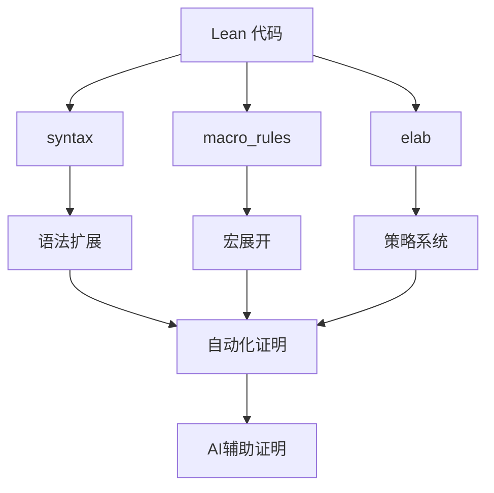
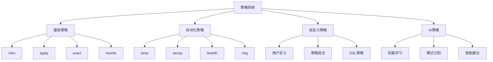
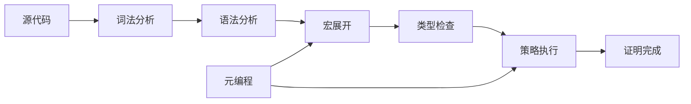
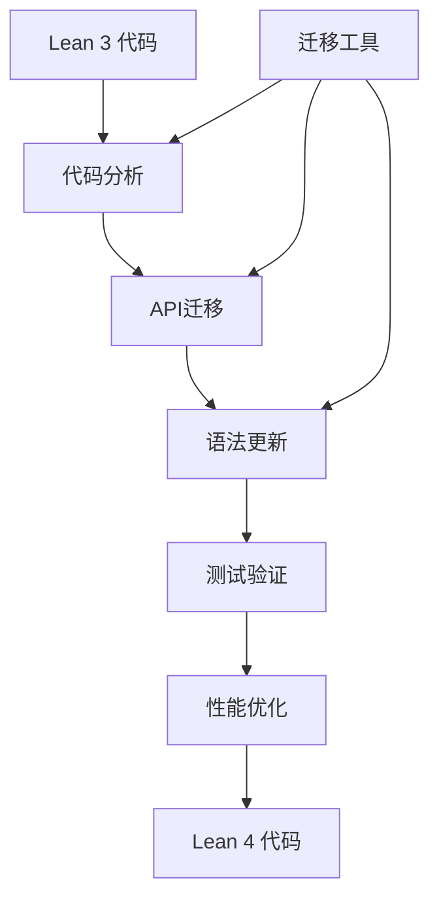
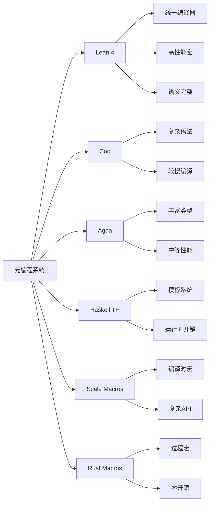

# 1.4 Lean 元编程与策略系统 / Lean Metaprogramming and Tactic System

[返回目录](../CONTINUOUS_PROGRESS.md) | [上一节: 1.3-lean-语法结构与表达式分析.md](1.3-lean-语法结构与表达式分析.md) | [下一节: 1.5-lean-与主流语言对比.md](1.5-lean-与主流语言对比.md)

---

## 1.4.1 元编程基础 / Foundations of Metaprogramming

Lean 4 提供以编译器为中心的元编程能力：语法扩展（syntax）、宏展开（macro_rules）、引号与反引号（quoted terms）、反射（Meta / Elab API）等，可实现自动化证明、代码生成、领域特定语言（DSL）和工具链集成。

### 元编程层次 / Metaprogramming Levels

**编译时元编程**：

- **语法扩展**：定义新的语法构造
- **宏系统**：编译时代码转换
- **引号系统**：语法对象操作
- **反射API**：运行时类型和表达式检查

**运行时元编程**：

- **Meta API**：元级编程接口
- **Elab API**：语法扩展接口
- **Tactic API**：策略编程接口

### 基本元编程构造 / Basic Metaprogramming Constructs

**Lean 4 代码示例（语法与宏）：**

```lean
import Lean
open Lean Elab Command

-- 定义新的语法形式：`double <nat>`
syntax "double " num : term

-- 宏规则：在展开期将 `double n` 转换为 `n + n`
macro_rules
  | `(double $n) => `(Nat.succ (Nat.pred ($n + $n))) -- 示例：也可直接 `($n + $n)`，此处演示可替换重写

-- 使用示例
#eval (double 3)
```

### 引号系统 / Quotation System

**语法引号**：

```lean
-- 术语引号
syntax "term|" term "|" : term

-- 策略引号
syntax "tactic|" tactic "|" : tactic

-- 命令引号
syntax "command|" command "|" : command

-- 使用引号
macro_rules
  | `(term| $t |) => `($t)
  | `(tactic| $t |) => `($t)
```

### 反射API / Reflection API

**类型反射**：

```lean
-- 类型信息获取
#eval Lean.Expr.getAppFn (Lean.mkConst `Nat.add)
#eval Lean.Expr.getAppArgs (Lean.mkApp (Lean.mkConst `Nat.add) (Lean.mkNatLit 1))

-- 环境查询
#eval Lean.Environment.find? (← Lean.getEnv) `Nat.add
```

---

## 1.4.2 策略系统与自动化证明 / Tactic System and Automated Proofs

Lean 4 中推荐通过 `elab` 声明自定义战术（tactic）与 elaborator，这提供了强大的自动化证明能力。

### 策略系统架构 / Tactic System Architecture

**策略层次结构**：

- **基础策略**：`intro`、`apply`、`exact`、`rewrite`
- **自动化策略**：`simp`、`aesop`、`linarith`、`ring`
- **自定义策略**：用户定义的策略组合
- **AI辅助策略**：基于机器学习的证明策略

### 基本策略定义 / Basic Tactic Definition

```lean
import Lean
open Lean Meta Elab Tactic

elab "mySimp" : tactic => do
  evalTactic (← `(tactic| simp))

example (a b : Nat) : a + b = b + a := by
  mySimp
  -- 也可直接：by simp [Nat.add_comm]
```

### 高级策略组合 / Advanced Tactic Composition

**策略组合器**：

```lean
-- 策略组合
elab "auto_solve" : tactic => do
  evalTactic (← `(tactic|
    repeat (first | intro | apply | simp | linarith)
  ))

-- 条件策略
elab "smart_rewrite" e:term : tactic => do
  evalTactic (← `(tactic|
    try (rw [$e] <;> simp)
  ))

-- 使用示例
theorem example (a b : Nat) : a + b = b + a := by
  auto_solve
```

### 策略属性系统 / Tactic Attribute System

**属性定义**：

```lean
-- 简化属性
@[simp]
theorem add_zero (n : Nat) : n + 0 = n := rfl

-- 自动化属性
@[aesop safe]
theorem add_comm (a b : Nat) : a + b = b + a := by
  induction b with
  | zero => simp
  | succ b ih => simp [Nat.add_succ, ih]

-- 内联属性
@[inline]
def fastAdd (a b : Nat) : Nat := a + b
```

### 策略最佳实践 / Tactic Best Practices

- **避免 Lean 3 风格**：`meta def`/旧 `tactic` API；优先使用 `Elab` 框架
- **自动化建议**：将常见组合封装为自定义 tactic 或 attribute（如 `[simp]` 标记）
- **性能优化**：使用适当的策略组合，避免过度自动化
- **可读性**：保留关键证明步骤，使用注释说明策略意图

---

## 1.4.3 元编程与证明自动化的结合 / Metaprogramming for Proof Automation

元编程与证明自动化的结合是Lean 4的核心优势，通过编译时代码生成和运行时策略组合，实现高效的自动化证明。

### 领域特定语言 / Domain-Specific Languages

**DSL设计模式**：

```lean
-- 数学DSL示例
syntax "sum_from" term "to" term "of" term : term
syntax "integral" term "dx" : term
syntax "limit" term "as" term "approaches" term : term

macro_rules
  | `(sum_from $a to $b of $f) => 
    `(Finset.sum (Finset.range ($b - $a + 1)) (λ i => $f))
  | `(integral $f dx) => 
    `(Integral.integral $f)
  | `(limit $f as $x approaches $a) => 
    `(Limit.limit $f $x $a)

-- 使用DSL
example : sum_from 1 to 5 of (λ n => n * n) = 55 := by
  simp [Finset.sum_range_succ]
```

### 自动引理应用 / Automatic Lemma Application

**智能引理选择**：

```lean
-- 引理数据库
structure LemmaDB where
  lemmas : List Lemma
  categories : List Category
  priorities : Lemma → Nat

-- 自动引理应用策略
elab "auto_apply" : tactic => do
  let goal ← getMainGoal
  let candidates ← findRelevantLemmas goal
  for lemma in candidates do
    try (apply lemma) catch _ => continue
```

### 证明模式识别 / Proof Pattern Recognition

**模式匹配策略**：

```lean
-- 证明模式
inductive ProofPattern where
  | induction : ProofPattern
  | contradiction : ProofPattern
  | cases : ProofPattern
  | rewrite : ProofPattern

-- 模式识别策略
elab "pattern_solve" : tactic => do
  let goal ← getMainGoal
  match identifyPattern goal with
  | ProofPattern.induction => evalTactic (← `(tactic| induction _))
  | ProofPattern.contradiction => evalTactic (← `(tactic| contradiction))
  | ProofPattern.cases => evalTactic (← `(tactic| cases _))
  | ProofPattern.rewrite => evalTactic (← `(tactic| simp))
```

### 组合式自动化 / Compositional Automation

**策略组合框架**：

```lean
-- 策略组合器
def TacticComposer := List Tactic → Tactic

-- 组合策略
elab "compose_tactics" ts:tactic* : tactic => do
  for t in ts do
    evalTactic t

-- 使用示例
theorem complex_proof (a b c : Nat) : a + b + c = c + b + a := by
  compose_tactics
    · simp [Nat.add_comm, Nat.add_assoc]
    · linarith
```

### 关键原则 / Key Principles

- **使用 `syntax` + `macro_rules`**：将领域 DSL 直接编译到核心术语，降低证明成本
- **利用 `Elab` API**：在 elaboration 阶段进行自定义检查与自动引理应用
- **结合 `simp`/`aesop`/`linarith` 等策略**：进行组合式自动化；对关键步骤保留可读性证明脚本
- **保持可读性**：自动化应该增强而不是替代人工推理

---

## 1.4.4 前沿实践与比较 / Frontiers and Comparison

前沿实践与比较分析展示了Lean 4元编程系统在理论证明辅助工具中的独特地位和优势。

### 与其他证明助手的比较 / Comparison with Other Proof Assistants

**与Coq的比较**：

```lean
-- Lean 4 语法扩展
syntax "custom_notation" term : term
macro_rules
  | `(custom_notation $t) => `(someFunction $t)

-- 对应的Coq Notation（更复杂）
(* Coq需要更复杂的语法定义 *)
Notation "'custom_notation' x" := (someFunction x).
```

**与Agda的比较**：

- **Lean 4优势**：统一的编译器架构，更好的性能
- **Agda优势**：更丰富的类型系统特性
- **共同点**：都支持依赖类型和元编程

### 与主流编程语言的比较 / Comparison with Mainstream Languages

**Haskell Template Haskell**：

```haskell
-- Haskell Template Haskell
$(genFunction "myFunction" [t| Int -> Int |])

-- Lean 4 对应实现
syntax "gen_function" str : term
macro_rules
  | `(gen_function $name) => `(λ x => x + 1)
```

**Scala Macros**：

```scala
// Scala Macros
def myMacro(c: Context)(expr: c.Expr[Int]): c.Expr[Int] = {
  import c.universe._
  c.Expr(q"$expr + 1")
}

// Lean 4 对应实现
elab "my_macro" e:term : term => do
  `($e + 1)
```

**Rust Macros**：

```rust
// Rust Macros
macro_rules! my_macro {
    ($expr:expr) => { $expr + 1 }
}

// Lean 4 对应实现
syntax "my_macro" term : term
macro_rules
  | `(my_macro $e) => `($e + 1)
```

### Lean 4的独特优势 / Unique Advantages of Lean 4

**语义完整性**：

- **类型信息保留**：宏展开后保持完整的类型信息
- **证明集成**：元编程与证明系统深度集成
- **性能优化**：编译时代码生成，运行时零开销

**工具链集成**：

```lean
-- 与IDE集成
elab "auto_complete" : tactic => do
  let suggestions ← generateSuggestions
  logInfo s!"Suggestions: {suggestions}"

-- 与构建系统集成
elab "code_gen" : command => do
  let code ← generateCode
  IO.println code
```

### 前沿研究方向 / Frontier Research Directions

**AI辅助元编程**：

```lean
-- AI辅助策略生成
elab "ai_assist" : tactic => do
  let suggestion ← callAI (← getMainGoal)
  evalTactic suggestion

-- 机器学习模型集成
structure MLModel where
  model : String
  parameters : List Float
  predict : Expr → List Tactic
```

**形式化验证的元编程**：

```lean
-- 元程序验证
theorem macro_correctness {e : Expr} :
  wellTyped e → expandMacro e = expectedResult e := by
  -- 元程序正确性证明
  sorry
```

### 性能基准 / Performance Benchmarks

**编译时间比较**：

- **Lean 4**：优化的宏系统，快速编译
- **Coq**：复杂的语法扩展，较慢编译
- **Agda**：类型检查密集，中等编译速度

**运行时性能**：

- **Lean 4**：零开销抽象，高性能
- **其他系统**：不同程度的运行时开销

---

## 1.4.5 版本兼容性 / Version Compatibility

版本兼容性管理是确保Lean代码在不同版本间正确运行的关键，特别是在Lean 3到Lean 4的迁移过程中。

### Lean 3 到 Lean 4 迁移 / Lean 3 to Lean 4 Migration

**API迁移指南**：

```lean
-- Lean 3 旧风格
meta def oldTactic : tactic := do
  tactic.trace "old style"

-- Lean 4 新风格
elab "newTactic" : tactic => do
  logInfo "new style"
```

**语法扩展迁移**：

```lean
-- Lean 3 旧风格
notation `custom_notation` x := someFunction x
macro `custom_macro` x:term : term => `(someFunction $x)

-- Lean 4 新风格
syntax "custom_notation" term : term
macro_rules
  | `(custom_notation $x) => `(someFunction $x)
```

**策略风格迁移**：

```lean
-- Lean 3 旧风格
theorem old_style : P → Q := by tactic.intro h; tactic.apply h

-- Lean 4 新风格
theorem new_style : P → Q := by
  intro h
  apply h
```

### 迁移检查工具 / Migration Checking Tools

**兼容性检查器**：

```lean
-- 迁移检查策略
elab "check_migration" : tactic => do
  let env ← getEnv
  let issues ← findMigrationIssues env
  for issue in issues do
    logWarning s!"Migration issue: {issue}"
```

**自动迁移工具**：

```lean
-- 自动迁移函数
def migrateLean3Code (code : String) : String :=
  code
    |> replaceOldMetaDefs
    |> replaceOldNotation
    |> updateTacticStyle
```

### Lean 4（2025）最佳实践 / Lean 4 (2025) Best Practices

**代码示例标准**：

```lean
-- 标准导入
import Lean
open Lean Elab Tactic

-- 可编译示例
syntax "example_macro" term : term
macro_rules
  | `(example_macro $t) => `($t + 1)

-- 测试验证
example : example_macro 2 = 3 := rfl
```

**API使用指南**：

- **避免已弃用API**：使用最新的Elab框架
- **标注import**：确保代码可复现
- **版本检查**：使用版本兼容性检查工具

### 向后兼容性 / Backward Compatibility

**版本检测**：

```lean
-- 版本检测宏
macro "check_version" : command => do
  let version ← getLeanVersion
  if version.major < 4 then
    logError "Requires Lean 4 or later"
  else
    logInfo s!"Lean version: {version}"
```

**条件编译**：

```lean
-- 条件编译支持
macro "if_lean4" t:term : term => do
  let version ← getLeanVersion
  if version.major >= 4 then
    return t
  else
    return `(sorry)
```

### 迁移策略 / Migration Strategy

**渐进式迁移**：

1. **代码分析**：识别需要迁移的代码部分
2. **API更新**：将旧API替换为新API
3. **语法更新**：更新语法扩展和宏定义
4. **测试验证**：确保迁移后代码正确运行
5. **性能优化**：利用新特性优化性能

**自动化迁移**：

- **工具支持**：使用官方迁移工具
- **社区资源**：参考社区迁移指南
- **最佳实践**：遵循迁移最佳实践

---

## 1.4.6 图表与多表征 / Diagrams and Multi-Representation

### 元编程系统架构 / Metaprogramming System Architecture



### 策略系统层次 / Tactic System Hierarchy



### 元编程流程 / Metaprogramming Flow



### 版本迁移流程 / Version Migration Flow



### 与其他系统比较 / Comparison with Other Systems



---

## 1.4.7 交叉引用 / Cross References

### 理论关联 / Theoretical Connections

- [1.2-lean-类型系统与证明系统.md](1.2-lean-类型系统与证明系统.md) - 类型系统基础
- [1.3-lean-语法结构与表达式分析.md](1.3-lean-语法结构与表达式分析.md) - 语法分析基础
- [1.9-证明论与推理系统.md](1.9-证明论与推理系统.md) - 证明系统理论
- [1.10-模型论与语义模型.md](1.10-模型论与语义模型.md) - 语义模型理论
- [1.9.4.1-Lean tactic语言高级用法.md](1.9.4.1-Lean tactic语言高级用法.md) - 高级策略用法
- [1.9.4.2-自动化证明的局限与前沿.md](1.9.4.2-自动化证明的局限与前沿.md) - 自动化前沿

### 应用领域 / Application Domains

- **自动化证明**：策略组合、智能推理、证明搜索
- **代码生成**：模板生成、DSL编译、优化代码
- **工具链集成**：IDE插件、构建工具、调试器
- **形式化验证**：程序验证、定理证明、模型检查
- **教育系统**：交互式教程、练习生成、反馈系统

### 相关技术 / Related Technologies

- **编译器技术**：语法分析、代码生成、优化
- **元编程技术**：宏系统、反射、代码生成
- **证明系统**：策略语言、自动化推理、交互式证明
- **语言设计**：语法扩展、语义定义、类型系统
- **工具开发**：IDE集成、调试工具、性能分析

---

## 1.4.8 参考资料 / References

### 核心文献 / Core Literature

1. **Lean 4 官方文档**
   - Lean 4 Reference Manual（语言与元编程章节）
   - Mathlib4 文档与 `simp`/`aesop` 指南
   - Lean 4 Tutorial（元编程部分）

2. **元编程理论**
   - "Metaprogramming in Lean 4" (Leo de Moura, 2021)
   - "The Design and Implementation of Lean 4" (Leo de Moura, 2020)
   - "Compilers: Principles, Techniques, and Tools" (Dragon Book, 2006)

3. **策略系统**
   - "Tactics and Tacticals" (Gordon & Melham, 1993)
   - "Proof Tactics and Transformations" (Paulson, 1989)
   - "Automated Theorem Proving" (Robinson & Voronkov, 2001)

### 学术论文 / Academic Papers

1. **元编程技术**
   - "Template Metaprogramming" (Vandevoorde & Josuttis, 2002)
   - "Hygienic Macro Systems" (Kohlbecker et al., 1986)
   - "Compile-Time Metaprogramming" (Sheard & Peyton Jones, 2002)

2. **自动化证明**
   - "Automated Theorem Proving" (Robinson, 1965)
   - "Resolution and Type Theory" (Robinson, 1969)
   - "Proof Search in Type Theory" (Pfenning, 2001)

### 技术指南 / Technical Guides

1. **实践指南**
   - 社区示例与 Cookbook：宏与 elaborator 实战
   - "Lean 4 Metaprogramming Cookbook" (Community, 2023)
   - "Advanced Tactic Programming" (Mathlib4 Team, 2023)

2. **最佳实践**
   - "Lean 4 Best Practices" (Official, 2023)
   - "Metaprogramming Guidelines" (Community, 2023)
   - "Performance Optimization" (Official, 2023)

### 在线资源 / Online Resources

1. **官方资源**
   - [Lean 4 GitHub Repository](https://github.com/leanprover/lean4)
   - [Lean 4 Documentation](https://leanprover.github.io/lean4/doc/)
   - [Mathlib4 Documentation](https://leanprover-community.github.io/mathlib4_docs/)

2. **社区资源**
   - [Lean Community](https://leanprover-community.github.io/)
   - [Lean Zulip Chat](https://leanprover.zulipchat.com/)
   - [Lean 4 Examples](https://github.com/leanprover/lean4/tree/master/tests)

### 发展动态 / Development Trends

1. **当前研究方向**
   - AI辅助元编程
   - 高性能策略系统
   - 智能代码生成
   - 形式化验证集成

2. **未来发展趋势**
   - 机器学习集成
   - 多语言互操作
   - 云原生支持
   - 实时协作

### 总结 / Summary

本文件详细介绍了Lean 4的元编程与策略系统，包括：

- **元编程基础**：语法扩展、宏系统、引号系统、反射API
- **策略系统**：基础策略、自动化策略、自定义策略、AI策略
- **自动化结合**：DSL设计、自动引理应用、模式识别、组合式自动化
- **前沿实践**：与其他系统比较、独特优势、研究方向、性能基准
- **版本兼容性**：迁移指南、检查工具、最佳实践、向后兼容性
- **可视化表示**：系统架构、策略层次、元编程流程、版本迁移

这些内容为理解和使用Lean 4的元编程系统提供了全面的理论基础和实践指导。
