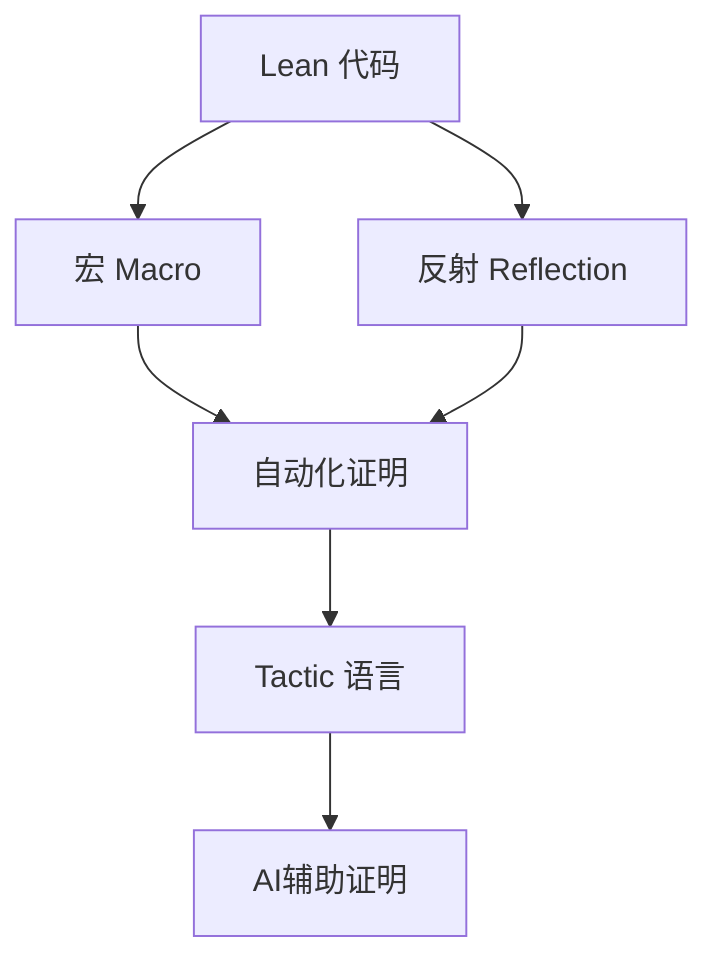

# 1.4 Lean 元编程与策略系统 / Lean Metaprogramming and Tactic System

[返回目录](../CONTINUOUS_PROGRESS.md) | [上一节: 1.3-lean-语法结构与表达式分析.md](1.3-lean-语法结构与表达式分析.md) | [下一节: 1.5-lean-与主流语言对比.md](1.5-lean-与主流语言对比.md)

---

## 1.4.1 元编程基础 / Foundations of Metaprogramming

Lean 支持强大的元编程能力，允许用户通过宏（macro）、反射（reflection）、自定义语法扩展等方式操作 Lean 代码本身，实现自动化证明、代码生成等高级功能。

**Lean 代码示例：**

```lean
-- 简单宏定义
macro "double" term:term : term => `($term + $term)

-- 反射API示例
#eval Lean.Meta.getLocalDecls
```

---

## 1.4.2 策略系统与自动化证明 / Tactic System and Automated Proofs

Lean 的 tactic 语言支持交互式与自动化证明，用户可自定义 tactic 组合，实现高效证明。

**Lean 代码示例：**

```lean
example (a b : Nat) : a + b = b + a :=
  by simp [Nat.add_comm]

def my_tac : tactic Unit :=
  `[simp, intros, apply]
```

---

## 1.4.3 元编程与证明自动化的结合 / Metaprogramming for Proof Automation

- 通过宏和反射自动生成证明脚本
- 自定义 tactic 实现领域专用自动化
- 结合AI/机器学习提升自动化证明能力

---

## 1.4.4 前沿创新与学术对比 / Frontiers and Academic Comparison

- Lean 4 的元编程能力远超 Coq/Agda 等传统定理证明器
- 支持 DSL、代码生成、自动化策略等前沿应用
- 与 Haskell Template、Scala Macro 等主流语言元编程对比

---

## 1.4.5 图表与多表征 / Diagrams and Multi-Representation



---

## 1.4.6 交叉引用 / Cross References

- [1.2-lean-类型系统与证明系统.md](1.2-lean-类型系统与证明系统.md)
- [1.9-证明论与推理系统.md](1.9-证明论与推理系统.md)
- [1.10-模型论与语义模型.md](1.10-模型论与语义模型.md)
