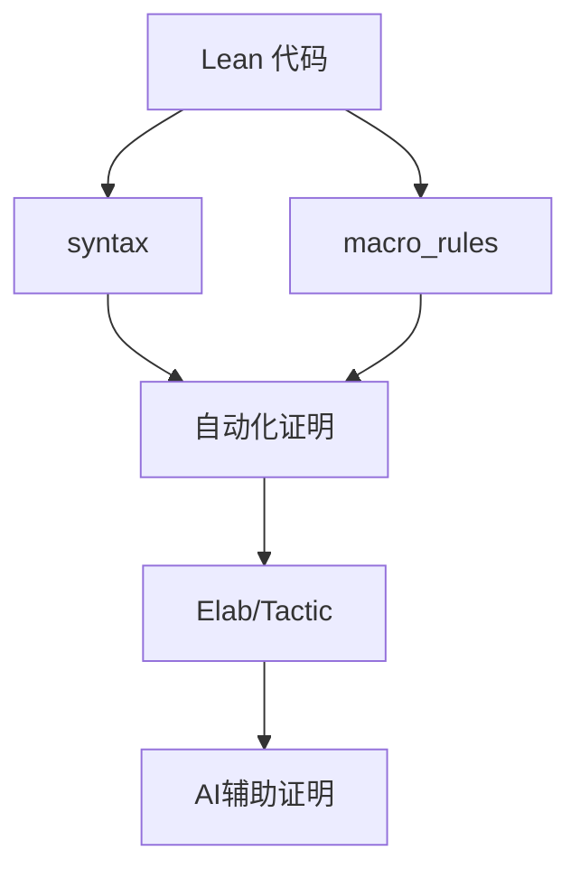

# 1.4 Lean 元编程与策略系统 / Lean Metaprogramming and Tactic System

[返回目录](../CONTINUOUS_PROGRESS.md) | [上一节: 1.3-lean-语法结构与表达式分析.md](1.3-lean-语法结构与表达式分析.md) | [下一节: 1.5-lean-与主流语言对比.md](1.5-lean-与主流语言对比.md)

---

## 1.4.1 元编程基础 / Foundations of Metaprogramming

Lean 4 提供以编译器为中心的元编程能力：语法扩展（syntax）、宏展开（macro_rules）、引号与反引号（quoted terms）、反射（Meta / Elab API）等，可实现自动化证明、代码生成、领域特定语言（DSL）和工具链集成。

**Lean 4 代码示例（语法与宏）：**

```lean
import Lean
open Lean Elab Command

-- 定义新的语法形式：`double <nat>`
syntax "double " num : term

-- 宏规则：在展开期将 `double n` 转换为 `n + n`
macro_rules
  | `(double $n) => `(Nat.succ (Nat.pred ($n + $n))) -- 示例：也可直接 `($n + $n)`，此处演示可替换重写

-- 使用示例
#eval (double 3)
```

---

## 1.4.2 策略系统与自动化证明 / Tactic System and Automated Proofs

Lean 4 中推荐通过 `elab` 声明自定义战术（tactic）与 elaborator：

```lean
import Lean
open Lean Meta Elab Tactic

elab "mySimp" : tactic => do
  evalTactic (← `(tactic| simp))

example (a b : Nat) : a + b = b + a := by
  mySimp
  -- 也可直接：by simp [Nat.add_comm]
```

- 避免 Lean 3 风格 `meta def`/旧 `tactic` API；优先使用 `Elab` 框架。
- 自动化建议：将常见组合封装为自定义 tactic 或 attribute（如 `[simp]` 标记）。

---

## 1.4.3 元编程与证明自动化的结合 / Metaprogramming for Proof Automation

- 使用 `syntax` + `macro_rules` 将领域 DSL 直接编译到核心术语，降低证明成本。
- 利用 `Elab` API 在 elaboration 阶段进行自定义检查与自动引理应用。
- 结合 `simp`/`aesop`/`linarith` 等策略进行组合式自动化；对关键步骤保留可读性证明脚本。

---

## 1.4.4 前沿实践与比较 / Frontiers and Comparison

- 相比 Coq/Agda：Lean 4 提供一体化编译器与高性能宏系统，适合 DSL 与工具链集成。
- 与主流语言元编程（Haskell Template、Scala Macro、Rust Macro）对比：Lean 的引号/宏与 elaboration 深度结合，语义信息更完整。

---

## 1.4.5 版本兼容性 / Version Compatibility

- Lean 3 → Lean 4 迁移：
  - 旧 `meta`/`tactic` API 需改为 `Elab`/`Meta` 框架。
  - `by tactic` 代码风格建议升级为结构化 `by` 块 + 自定义 `elab ... : tactic`。
  - 语法扩展从 `notation`/`macro`（旧风格）统一到 `syntax`/`macro_rules`。
- Lean 4（2025）建议：
  - 代码示例需可编译；避免使用已弃用 API；标注 `import` 以确保复现。

---

## 1.4.6 图表与多表征 / Diagrams and Multi-Representation



---

## 1.4.7 交叉引用 / Cross References

- [1.2-lean-类型系统与证明系统.md](1.2-lean-类型系统与证明系统.md)
- [1.9-证明论与推理系统.md](1.9-证明论与推理系统.md)
- [1.10-模型论与语义模型.md](1.10-模型论与语义模型.md)

---

## 1.4.8 参考资料 / References

- Lean 4 Reference Manual（语言与元编程章节）
- Mathlib4 文档与 `simp`/`aesop` 指南
- 社区示例与 Cookbook：宏与 elaborator 实战
