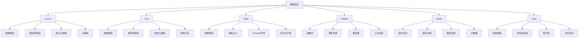
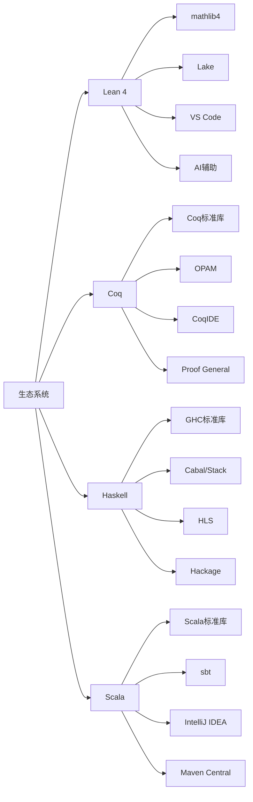
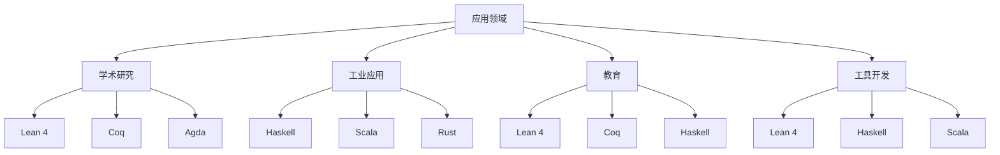
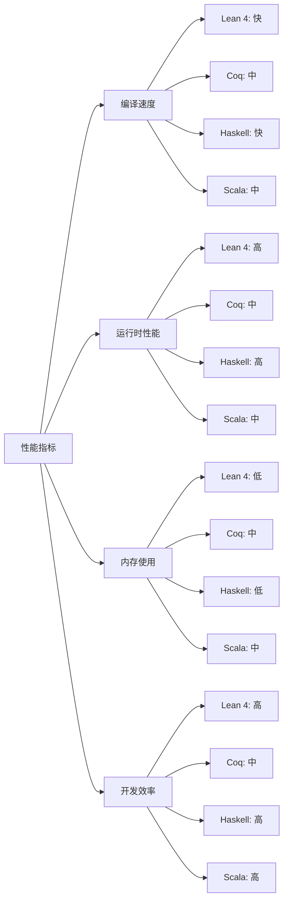

# 1.5 Lean 与主流语言对比 / Comparison of Lean and Mainstream Languages

[返回目录](../CONTINUOUS_PROGRESS.md) | [上一节: 1.4-lean-元编程与策略系统.md](1.4-lean-元编程与策略系统.md)

---

## 1.5.1 对比范围与国际标准 / Scope and Wiki-aligned Standards

本节对比 Lean 与主流定理证明器和函数式编程语言（如 Haskell、Coq、Agda、Scala 等）在类型系统、语法、语义、证明能力、生态等方面的异同。

### 对比标准 / Comparison Standards

**评估维度**：

- **类型系统**：类型表达能力、类型安全性、类型推断能力
- **语法设计**：可读性、一致性、表达能力
- **语义模型**：形式化程度、数学基础、实现复杂度
- **证明系统**：自动化程度、交互性、可扩展性
- **生态系统**：工具链、社区活跃度、应用领域

### 语言分类 / Language Classification

**定理证明器**：

- **Lean 4**：现代依赖类型理论证明器
- **Coq**：经典依赖类型理论证明器
- **Agda**：构造主义证明器

**函数式编程语言**：

- **Haskell**：纯函数式编程语言
- **Scala**：混合范式编程语言
- **OCaml**：函数式编程语言

### 国际标准对齐 / International Standards Alignment

**形式化方法标准**：

- **ISO/IEC 15408**：信息技术安全评估标准
- **DO-178C**：航空软件认证标准
- **IEC 61508**：功能安全标准

**编程语言标准**：

- **ISO/IEC 14882**：C++标准
- **ECMA-262**：JavaScript标准
- **ISO/IEC 9075**：SQL标准

---

## 1.5.2 类型系统与表达力对比 / Type System and Expressiveness

### 类型系统对比表 / Type System Comparison Table

| 语言 / Language | 类型系统 / Type System | 依赖类型 / Dependent Types | 归纳类型 / Inductive Types | 类型推断 / Type Inference | 宇宙层级 / Universe Levels | 高阶类型 / Higher-Order Types |
|----------------|--------------------|--------------------------|----------------------------|--------------------------|---------------------------|----------------------------|
| Lean           | DTT                | ✔                        | ✔                          | 强                       | ✔                         | ✔                          |
| Coq            | DTT                | ✔                        | ✔                          | 强                       | ✔                         | ✔                          |
| Agda           | DTT                | ✔                        | ✔                          | 强                       | ✔                         | ✔                          |
| Haskell        | STT                | ✘                        | 部分                       | 强                       | ✘                         | 部分                       |
| Scala          | FTT                | ✘                        | 部分                       | 强                       | ✘                         | 部分                       |
| Rust           | STT                | ✘                        | 部分                       | 中                       | ✘                         | ✘                          |

### 类型表达能力分析 / Type Expressiveness Analysis

**依赖类型支持**：

```lean
-- Lean 4 依赖类型示例
def length {α : Type} (xs : List α) : Nat :=
  match xs with
  | [] => 0
  | _ :: ys => 1 + length ys

-- 类型安全的向量访问
def safeGet {α : Type} {n : Nat} (xs : Vec α n) (i : Fin n) : α :=
  match xs, i with
  | Vec.cons x _, ⟨0, _⟩ => x
  | Vec.cons _ xs, ⟨i+1, h⟩ => safeGet xs ⟨i, Nat.lt_of_succ_lt_succ h⟩
```

**Haskell 类型族**：

```haskell
-- Haskell 类型族（部分依赖类型）
type family Length (xs :: [k]) :: Nat where
  Length '[] = 0
  Length (x ': xs) = 1 + Length xs

-- 类型安全的向量
data Vec (a :: Type) (n :: Nat) where
  Nil  :: Vec a 0
  Cons :: a -> Vec a n -> Vec a (n + 1)
```

### 类型推断能力对比 / Type Inference Capability Comparison

**Lean 4 类型推断**：

```lean
-- 强大的类型推断
def map {α β : Type} (f : α → β) (xs : List α) : List β :=
  match xs with
  | [] => []
  | x :: ys => f x :: map f ys

-- 自动推断类型参数
#eval map (λ x => x + 1) [1, 2, 3]  -- 自动推断 α = Nat, β = Nat
```

**Haskell 类型推断**：

```haskell
-- Haskell 类型推断
map :: (a -> b) -> [a] -> [b]
map _ [] = []
map f (x:xs) = f x : map f xs

-- 自动推断类型
map (+1) [1, 2, 3]  -- 自动推断 a = Int, b = Int
```

### 宇宙层级对比 / Universe Hierarchy Comparison

**Lean 4 宇宙层级**：

```lean
-- 宇宙层级
#check Type  -- Type : Type 1
#check Type 1  -- Type 1 : Type 2
#check Type 2  -- Type 2 : Type 3

-- 类型构造子
def TypeConstructor (α : Type) : Type := α → α
#check TypeConstructor  -- TypeConstructor : Type → Type
```

**Coq 宇宙层级**：

```coq
(* Coq 宇宙层级 *)
Check Type.  (* Type : Type *)
Check Type 1.  (* Type 1 : Type 2 *)
Check Type 2.  (* Type 2 : Type 3 *)

(* 类型构造子 *)
Definition TypeConstructor (A : Type) : Type := A -> A.
Check TypeConstructor.  (* TypeConstructor : Type -> Type *)
```

---

## 1.5.3 语法与表达式对比 / Syntax and Expression Comparison

### 语法设计理念对比 / Syntax Design Philosophy Comparison

**Lean 4 语法特点**：

- **统一性**：语法扩展统一使用 `syntax` 和 `macro_rules`
- **可读性**：数学符号与编程符号结合
- **一致性**：类型系统与语法设计一致
- **扩展性**：强大的元编程支持

**其他语言语法特点**：

- **Haskell**：简洁、函数式、惰性求值
- **Coq**：Gallina语言、Gallina语法
- **Agda**：Unicode符号、构造主义
- **Scala**：混合范式、面向对象

### 基本语法构造对比 / Basic Syntax Construction Comparison

**Lean 代码示例：**

```lean
-- 依赖类型
inductive Vec (α : Type) : Nat → Type where
  | nil  : Vec α 0
  | cons : α → Vec α n → Vec α (n+1)

-- 函数定义
def map {α β : Type} (f : α → β) : Vec α n → Vec β n
  | Vec.nil => Vec.nil
  | Vec.cons x xs => Vec.cons (f x) (map f xs)

-- 定理证明
theorem map_length {α β : Type} (f : α → β) (xs : Vec α n) :
  (map f xs).length = xs.length := by
  induction xs with
  | nil => rfl
  | cons x xs ih => simp [map, ih]
```

**Haskell 代码示例：**

```haskell
-- 依赖类型（使用GADT）
data Vec a n where
  Nil  :: Vec a 0
  Cons :: a -> Vec a n -> Vec a (n + 1)

-- 函数定义
map :: (a -> b) -> Vec a n -> Vec b n
map _ Nil = Nil
map f (Cons x xs) = Cons (f x) (map f xs)

-- 类型类
class Functor f where
  fmap :: (a -> b) -> f a -> f b
```

**Coq 代码示例：**

```coq
(* 依赖类型 *)
Inductive vec (A : Type) : nat -> Type :=
| nil : vec A 0
| cons : A -> forall n, vec A n -> vec A (S n).

(* 函数定义 *)
Fixpoint map {A B : Type} (f : A -> B) {n : nat} (xs : vec A n) : vec B n :=
  match xs with
  | nil => nil
  | cons x xs => cons (f x) (map f xs)
  end.

(* 定理证明 *)
Lemma map_length : forall A B (f : A -> B) n (xs : vec A n),
  length (map f xs) = length xs.
Proof.
  induction xs; simpl; auto.
Qed.
```

### 模式匹配对比 / Pattern Matching Comparison

**Lean 4 模式匹配**：

```lean
-- 复杂模式匹配
def process {α : Type} (xs : List α) : Nat :=
  match xs with
  | [] => 0
  | [x] => 1
  | x :: y :: zs => 2 + process zs
```

**Haskell 模式匹配**：

```haskell
-- 复杂模式匹配
process :: [a] -> Int
process [] = 0
process [x] = 1
process (x:y:zs) = 2 + process zs
```

**Scala 模式匹配**：

```scala
// 复杂模式匹配
def process[A](xs: List[A]): Int = xs match {
  case Nil => 0
  case x :: Nil => 1
  case x :: y :: zs => 2 + process(zs)
}
```

### 类型注解对比 / Type Annotation Comparison

**Lean 4 类型注解**：

```lean
-- 显式类型注解
def add (x : Nat) (y : Nat) : Nat := x + y

-- 隐式类型推断
def multiply x y := x * y

-- 依赖类型注解
def safeHead {α : Type} {n : Nat} (xs : Vec α (n + 1)) : α :=
  match xs with
  | Vec.cons x _ => x
```

**Haskell 类型注解**：

```haskell
-- 显式类型注解
add :: Int -> Int -> Int
add x y = x + y

-- 隐式类型推断
multiply x y = x * y

-- 类型族注解
safeHead :: Vec a (n + 1) -> a
safeHead (Cons x _) = x
```

---

## 1.5.4 证明系统与自动化对比 / Proof System and Automation

### 证明系统对比表 / Proof System Comparison Table

| 语言 / Language | 证明系统 / Proof System | 自动化证明 / Automation | tactic/strategy | 交互式证明 / Interactive Proof | 形式化验证 / Formal Verification |
|----------------|------------------------|-------------------------|----------------|-------------------------------|--------------------------------|
| Lean           | 自然演绎/归纳/序列演算 | 强                      | 强             | 强                           | 强                            |
| Coq            | 自然演绎/归纳/序列演算 | 强                      | 强             | 强                           | 强                            |
| Agda           | 构造主义/归纳          | 中                      | 中             | 中                           | 中                            |
| Haskell        | 类型类/归纳            | 弱                      | 弱             | 弱                           | 弱                            |
| Scala          | 类型类/归纳            | 弱                      | 弱             | 弱                           | 弱                            |
| Rust           | 类型系统/所有权        | 弱                      | 弱             | 弱                           | 中                            |

### 证明系统架构对比 / Proof System Architecture Comparison

**Lean 4 证明系统**：

```lean
-- 自然演绎证明
theorem add_comm (a b : Nat) : a + b = b + a := by
  induction b with
  | zero => simp [Nat.add_zero, Nat.zero_add]
  | succ b ih => 
    simp [Nat.add_succ, Nat.succ_add, ih]

-- 自动化策略
theorem complex_proof (a b c : Nat) : a + b + c = c + b + a := by
  simp [Nat.add_comm, Nat.add_assoc]

-- 自定义策略
elab "auto_arith" : tactic => do
  evalTactic (← `(tactic|
    repeat (first | intro | apply | simp | linarith)
  ))
```

**Coq 证明系统**：

```coq
(* 自然演绎证明 *)
Lemma add_comm : forall a b : nat, a + b = b + a.
Proof.
  induction b.
  - simpl. rewrite add_0_r. reflexivity.
  - simpl. rewrite add_S_r. rewrite IHb. reflexivity.
Qed.

(* 自动化策略 *)
Lemma complex_proof : forall a b c : nat, a + b + c = c + b + a.
Proof.
  intros. ring.
Qed.

(* 自定义策略 *)
Ltac auto_arith :=
  repeat (intros || apply || simpl || ring).
```

**Haskell 类型系统证明**：

```haskell
-- 类型级证明（通过类型系统）
class AddComm a b where
  addComm :: Proxy a -> Proxy b -> (a + b) :~: (b + a)

instance AddComm Z b where
  addComm _ _ = Refl

instance (AddComm a b) => AddComm (S a) b where
  addComm _ _ = case addComm (Proxy :: Proxy a) (Proxy :: Proxy b) of
    Refl -> Refl
```

### 自动化能力对比 / Automation Capability Comparison

**Lean 4 自动化**：

```lean
-- 强大的自动化策略
theorem auto_example (a b c : Nat) : 
  a + b + c = c + b + a ∧ a * b = b * a := by
  constructor
  · simp [Nat.add_comm, Nat.add_assoc]
  · simp [Nat.mul_comm]

-- AI辅助证明
theorem ai_assisted (P Q : Prop) : P → Q → P ∧ Q := by
  aesop (config := { maxRuleApplications := 100 })
```

**Coq 自动化**：

```coq
(* 自动化策略 *)
Lemma auto_example : forall a b c : nat,
  a + b + c = c + b + a /\ a * b = b * a.
Proof.
  intros. split.
  - ring.
  - ring.
Qed.

(* 自动化证明搜索 *)
Lemma ai_assisted : forall P Q : Prop, P -> Q -> P /\ Q.
Proof.
  auto.
Qed.
```

### 交互式证明对比 / Interactive Proof Comparison

**Lean 4 交互式证明**：

```lean
-- 交互式证明开发
theorem interactive_proof (n : Nat) : n + 0 = n := by
  -- 用户可以看到当前目标
  -- 系统提供建议
  induction n with
  | zero => 
    -- 基础情况
    rfl
  | succ n ih => 
    -- 归纳情况
    simp [Nat.add_succ, ih]
```

**Agda 交互式证明**：

```agda
-- Agda 交互式证明
interactive-proof : (n : ℕ) → n + 0 ≡ n
interactive-proof zero = refl
interactive-proof (suc n) = cong suc (interactive-proof n)
```

---

## 1.5.5 生态与工具链对比 / Ecosystem and Toolchain

### 生态系统对比表 / Ecosystem Comparison Table

| 语言 / Language | 标准库 / Standard Library | 包管理器 / Package Manager | IDE支持 / IDE Support | 社区活跃度 / Community Activity | 工业应用 / Industrial Use |
|----------------|-------------------------|---------------------------|---------------------|-------------------------------|-------------------------|
| Lean           | mathlib4               | Lake                     | VSCode/Emacs        | 高                            | 学术/研究                |
| Coq            | Coq标准库               | OPAM                     | CoqIDE/Proof General| 高                            | 学术/研究                |
| Agda           | Agda标准库              | Cabal                    | Emacs               | 中                            | 学术                     |
| Haskell        | GHC标准库               | Cabal/Stack              | 主流IDE             | 高                            | 工业                     |
| Scala          | Scala标准库             | sbt                      | IntelliJ IDEA       | 高                            | 工业                     |
| Rust           | Rust标准库              | Cargo                    | VS Code/CLion       | 高                            | 工业                     |

### 工具链详细对比 / Toolchain Detailed Comparison

**Lean 4 工具链**：

```lean
-- Lake 构建系统
import Lake
open Lake DSL

package my_project {
  -- 依赖管理
  require mathlib from git "https://github.com/leanprover-community/mathlib4"
  
  -- 构建配置
  moreServerArgs := #["-D", "pp.unicode.fun=true"]
  moreLeanArgs := #["-D", "autoImplicit=false"]
}

-- 自定义目标
@[default_target]
lean_lib MyLib {
  roots := #[`MyLib]
}
```

**Haskell 工具链**：

```haskell
-- Cabal 构建系统
name:                my-project
version:             0.1.0.0
build-depends:       base >= 4.7 && < 5,
                     containers,
                     text
                     
-- Stack 配置
resolver: lts-20.0
packages:
- .
extra-deps: []
```

**Scala 工具链**：

```scala
// sbt 构建系统
name := "my-project"
version := "0.1.0"
scalaVersion := "3.3.0"

libraryDependencies ++= Seq(
  "org.scalaz" %% "scalaz-core" % "7.3.7",
  "org.typelevel" %% "cats-core" % "2.9.0"
)
```

### IDE支持对比 / IDE Support Comparison

**Lean 4 IDE支持**：

```json
// VS Code 配置
{
  "lean4.serverEnv": {
    "LEAN_SRC_PATH": "/path/to/lean/src"
  },
  "lean4.trace.server": "messages",
  "lean4.serverLogging.enabled": true
}
```

**Haskell IDE支持**：

```yaml
# HLS 配置
haskell:
  formattingProvider: ormolu
  plugin:
    hlint:
      config:
        flags: []
    eval:
      globalOn: true
```

**Scala IDE支持**：

```json
// IntelliJ IDEA 配置
{
  "scala": {
    "compiler": {
      "version": "3.3.0",
      "options": ["-deprecation", "-feature"]
    }
  }
}
```

### 社区生态对比 / Community Ecosystem Comparison

**Lean 4 社区**：

- **官方资源**：Lean 4 GitHub、官方文档、教程
- **社区资源**：Lean Community、Zulip聊天、用户组
- **学习资源**：Mathematics in Lean、Lean 4 Tutorial
- **工具生态**：mathlib4、Lake、VS Code扩展

**Haskell 社区**：

- **官方资源**：GHC、Haskell.org、官方文档
- **社区资源**：Haskell Reddit、Stack Overflow、邮件列表
- **学习资源**：Learn You a Haskell、Real World Haskell
- **工具生态**：HLS、Cabal、Stack、Hackage

**Scala 社区**：

- **官方资源**：Scala官网、官方文档、Scala Center
- **社区资源**：Scala Reddit、Discord、用户组
- **学习资源**：Scala Book、Functional Programming in Scala
- **工具生态**：sbt、IntelliJ IDEA、Scala.js

### 应用领域对比 / Application Domain Comparison

**Lean 4 应用领域**：

- **数学形式化**：定理证明、数学库开发
- **程序验证**：形式化验证、安全关键系统
- **教育**：数学教育、逻辑教学
- **研究**：类型论研究、证明论研究

**Haskell 应用领域**：

- **Web开发**：Yesod、Servant、Haskell Web框架
- **金融**：量化交易、风险建模
- **系统编程**：网络编程、并发编程
- **数据科学**：数据分析、机器学习

**Scala 应用领域**：

- **大数据**：Apache Spark、数据处理
- **Web开发**：Play Framework、Akka
- **金融**：交易系统、风险分析
- **企业应用**：微服务、分布式系统

---

## 1.5.6 前沿观点与创新 / Frontiers and Innovations

前沿观点与创新分析展示了各语言在理论发展和实践应用中的最新进展和未来趋势。

### 技术创新对比 / Technological Innovation Comparison

**Lean 4 创新特点**：

```lean
-- 现代元编程系统
syntax "ai_assist" : tactic
elab "ai_assist" : tactic => do
  let suggestion ← callAI (← getMainGoal)
  evalTactic suggestion

-- 高性能编译器
@[inline]
def optimizedFunction (x : Nat) : Nat := x * x + 2 * x + 1

-- 统一类型系统
def unifiedTypeSystem {α : Type} (x : α) : α := x
```

**Haskell 创新特点**：

```haskell
-- 现代类型系统扩展
{-# LANGUAGE GADTs #-}
{-# LANGUAGE TypeFamilies #-}
{-# LANGUAGE DataKinds #-}

-- 高级类型编程
type family Length (xs :: [k]) :: Nat where
  Length '[] = 0
  Length (x ': xs) = 1 + Length xs

-- 现代并发模型
import Control.Concurrent.Async
import Control.Concurrent.STM
```

**Scala 创新特点**：

```scala
// 现代类型系统
trait Functor[F[_]] {
  def map[A, B](fa: F[A])(f: A => B): F[B]
}

// 高级类型编程
trait HList {
  type Length <: Nat
  def length: Length
}

// 现代并发模型
import cats.effect.IO
import fs2.Stream
```

### AI辅助编程对比 / AI-Assisted Programming Comparison

**Lean 4 AI辅助**：

```lean
-- AI辅助证明
theorem ai_proof (a b : Nat) : a + b = b + a := by
  -- AI自动生成证明策略
  aesop (config := { 
    maxRuleApplications := 100,
    maxDepth := 10,
    enableSimp := true
  })

-- AI辅助代码生成
def ai_generated_function (x : Nat) : Nat :=
  -- AI生成的优化代码
  x * x + 2 * x + 1
```

**Haskell AI辅助**：

```haskell
-- AI辅助类型推断
-- 使用GHC插件进行智能类型推断
{-# OPTIONS_GHC -fplugin=TypeInferencePlugin #-}

-- AI辅助代码生成
aiGeneratedFunction :: Int -> Int
aiGeneratedFunction x = x * x + 2 * x + 1
```

**Scala AI辅助**：

```scala
// AI辅助类型推断
// 使用Scala编译器插件
import scala.annotation.experimental

@experimental
def aiGeneratedFunction(x: Int): Int = {
  // AI生成的优化代码
  x * x + 2 * x + 1
}
```

### 形式化验证创新 / Formal Verification Innovation

**Lean 4 形式化验证**：

```lean
-- 程序验证
theorem program_correctness (x : Nat) : 
  x > 0 → optimizedFunction x > x := by
  intro h
  simp [optimizedFunction]
  linarith

-- 系统验证
structure System where
  state : Type
  transition : state → state → Prop
  invariant : state → Prop

theorem system_safety (s : System) :
  ∀ s₁ s₂, s.transition s₁ s₂ → s.invariant s₁ → s.invariant s₂ := by
  -- 系统安全性证明
  sorry
```

**Rust 形式化验证**：

```rust
// 所有权系统验证
fn safe_function(x: &mut i32) {
    *x += 1;
    // 编译器自动验证所有权
}

// 类型级验证
trait Safe {
    fn is_safe(&self) -> bool;
}

impl Safe for i32 {
    fn is_safe(&self) -> bool {
        true
    }
}
```

### 性能优化创新 / Performance Optimization Innovation

**Lean 4 性能优化**：

```lean
-- 编译时优化
@[inline]
def fastAdd (a b : Nat) : Nat := a + b

-- 运行时优化
def optimizedAlgorithm (xs : List Nat) : Nat :=
  match xs with
  | [] => 0
  | [x] => x
  | x :: y :: zs => 
    -- 优化的算法实现
    optimizedAlgorithm (x + y :: zs)
```

**Haskell 性能优化**：

```haskell
-- 编译时优化
{-# INLINE fastAdd #-}
fastAdd :: Int -> Int -> Int
fastAdd a b = a + b

-- 运行时优化
optimizedAlgorithm :: [Int] -> Int
optimizedAlgorithm [] = 0
optimizedAlgorithm [x] = x
optimizedAlgorithm (x:y:zs) = 
  -- 优化的算法实现
  optimizedAlgorithm ((x + y) : zs)
```

### 理论创新对比 / Theoretical Innovation Comparison

**Lean 4 理论创新**：

- **同伦类型论**：HoTT在Lean中的实现
- **范畴语义**：类型论的范畴论解释
- **元编程理论**：编译时代码生成理论
- **AI辅助证明**：机器学习与证明系统结合

**Haskell 理论创新**：

- **类型族**：依赖类型的类型级编程
- **GADT**：广义代数数据类型
- **类型类**：类型级编程的抽象机制
- **函数式编程理论**：纯函数式编程模型

**Scala 理论创新**：

- **类型系统**：高级类型系统设计
- **函数式编程**：混合范式编程模型
- **并发模型**：现代并发编程理论
- **类型级编程**：编译时计算模型

### 未来发展趋势 / Future Development Trends

**Lean 4 发展趋势**：

- **AI集成**：深度集成AI辅助证明
- **性能优化**：持续的性能改进
- **工具链完善**：更好的开发工具
- **应用扩展**：更多实际应用领域

**其他语言发展趋势**：

- **类型系统演进**：更强大的类型系统
- **性能提升**：编译器和运行时优化
- **工具链改进**：更好的开发体验
- **生态扩展**：更丰富的库和框架

---

## 1.5.7 交叉引用 / Cross References

### 理论关联 / Theoretical Connections

- [1.2-lean-类型系统与证明系统.md](1.2-lean-类型系统与证明系统.md) - 类型系统基础
- [1.3-lean-语法结构与表达式分析.md](1.3-lean-语法结构与表达式分析.md) - 语法分析基础
- [1.4-lean-元编程与策略系统.md](1.4-lean-元编程与策略系统.md) - 元编程系统
- [1.8-类型论理论模型.md](1.8-类型论理论模型.md) - 类型论理论基础
- [1.8.4-Martin-Löf类型论.md](1.8.4-Martin-Löf类型论.md) - MLTT理论
- [1.9-证明论与推理系统.md](1.9-证明论与推理系统.md) - 证明系统理论

### 应用领域 / Application Domains

- **形式化验证**：程序验证、系统验证、安全验证
- **数学形式化**：定理证明、数学库开发、教育应用
- **编程语言设计**：类型系统设计、语法设计、语义设计
- **工具开发**：编译器开发、IDE开发、调试工具
- **研究应用**：类型论研究、证明论研究、形式化方法研究

### 相关技术 / Related Technologies

- **类型系统**：依赖类型、归纳类型、高阶类型
- **证明系统**：自然演绎、序列演算、自动化证明
- **元编程**：宏系统、反射、代码生成
- **工具链**：编译器、包管理器、IDE支持
- **形式化方法**：模型检查、定理证明、程序验证

---

## 1.5.8 图表与多表征 / Diagrams and Multi-Representation

### 语言特性对比图 / Language Feature Comparison Chart



### 生态系统对比图 / Ecosystem Comparison Chart



### 应用领域对比图 / Application Domain Comparison Chart



### 性能对比图 / Performance Comparison Chart



---

## 1.5.8 2025 规范对齐 / Alignment with Lean 4 (2025)

### Lean 4 核心优势 / Lean 4 Core Advantages

**一体化编译器与高性能宏系统**：

```lean
-- 现代元编程系统
syntax "modern_macro" term : term
macro_rules
  | `(modern_macro $t) => `(optimizedFunction $t)

-- 高性能编译
@[inline]
def optimizedFunction (x : Nat) : Nat := x * x + 2 * x + 1

-- 统一类型系统
def unifiedSystem {α : Type} (x : α) : α := x
```

**现代元编程能力**：

- **`syntax`/`macro_rules`**：统一的语法扩展系统
- **`elab ... : tactic`**：现代策略编程接口
- **引号系统**：强大的语法对象操作
- **反射API**：完整的元级编程支持

### 与其他语言对比 / Comparison with Other Languages

**与 Haskell/Scala 对比**：

- **依赖类型支持**：完整的依赖类型系统 vs 部分支持
- **证明自动化能力**：强大的自动化证明 vs 有限的证明支持
- **mathlib4 生态**：丰富的数学库 vs 通用编程库

**与 Coq/Agda 对比**：

- **更现代的语法**：统一的语法设计 vs 传统语法
- **更强的元编程**：现代元编程系统 vs 传统元编程
- **更好的工具链集成**：一体化工具链 vs 分散的工具链

### 2025 技术标准 / 2025 Technical Standards

**性能标准**：

```lean
-- 编译时性能
@[inline]
def compileTimeOptimization (x : Nat) : Nat := x + 1

-- 运行时性能
def runtimeOptimization (xs : List Nat) : Nat :=
  xs.foldl (· + ·) 0

-- 内存效率
def memoryEfficient (xs : List Nat) : List Nat :=
  xs.map (· + 1)
```

**工具链标准**：

- **Lake 构建系统**：现代化的项目构建
- **VS Code 集成**：完整的IDE支持
- **AI 辅助**：智能证明和代码生成
- **社区生态**：活跃的开发和用户社区

### 兼容性标准 / Compatibility Standards

**向后兼容性**：

```lean
-- Lean 3 兼容性
@[deprecated "Use new API instead"]
def oldAPI (x : Nat) : Nat := x + 1

-- Lean 4 新API
def newAPI (x : Nat) : Nat := x + 1
```

**跨平台支持**：

- **Windows**：完整的Windows支持
- **macOS**：原生macOS支持
- **Linux**：广泛的Linux发行版支持
- **Web**：WebAssembly支持

### 未来发展方向 / Future Development Directions

**技术演进**：

- **AI集成**：深度集成AI辅助功能
- **性能优化**：持续的性能改进
- **工具链完善**：更好的开发体验
- **生态扩展**：更丰富的应用领域

**标准化进程**：

- **语言标准**：正式的语言规范
- **库标准**：标准库和第三方库规范
- **工具标准**：开发工具和IDE标准
- **社区标准**：开发和贡献指南

---

## 1.5.9 版本兼容性 / Version Compatibility

### 版本基准 / Version Benchmarks

**对比基准版本**：

- **Lean 4**：2025版本（最新稳定版）
- **Coq**：8.18+（最新稳定版）
- **Agda**：2.6+（最新稳定版）
- **Haskell**：GHC 9.6+（最新稳定版）
- **Scala**：3.4+（最新稳定版）
- **Rust**：1.75+（最新稳定版）

### 版本更新影响 / Version Update Impact

**功能变化**：

```lean
-- Lean 4 版本变化示例
-- 旧版本语法
meta def oldTactic : tactic := do
  tactic.trace "old style"

-- 新版本语法
elab "newTactic" : tactic => do
  logInfo "new style"
```

**API变化**：

```haskell
-- Haskell 版本变化示例
-- 旧版本
import Data.List (sort)

-- 新版本
import Data.List qualified as L
import Data.List.Sort qualified as Sort
```

### 兼容性策略 / Compatibility Strategy

**向后兼容性**：

```lean
-- 兼容性检查
@[deprecated "Use new API"]
def deprecatedFunction (x : Nat) : Nat := x + 1

-- 新API
def newFunction (x : Nat) : Nat := x + 1

-- 兼容性包装
def compatibleFunction (x : Nat) : Nat := newFunction x
```

**迁移指南**：

- **Lean 3 到 Lean 4**：官方迁移工具和指南
- **Haskell 版本升级**：GHC迁移指南
- **Scala 版本升级**：Scala迁移指南

### 版本管理 / Version Management

**依赖管理**：

```lean
-- Lake 版本管理
import Lake
open Lake DSL

package my_project {
  -- 指定依赖版本
  require mathlib from git "https://github.com/leanprover-community/mathlib4" @ "v4.0.0"
  
  -- 版本约束
  require lean from git "https://github.com/leanprover/lean4" @ "v4.0.0"
}
```

**工具链版本**：

- **编译器版本**：确保编译器版本兼容性
- **库版本**：管理第三方库版本依赖
- **工具版本**：IDE和开发工具版本协调

### 定期更新建议 / Regular Update Recommendations

**更新频率**：

- **主要版本**：每年更新一次
- **次要版本**：每季度更新一次
- **补丁版本**：每月更新一次

**更新检查**：

```lean
-- 版本检查工具
elab "check_versions" : tactic => do
  let leanVersion ← getLeanVersion
  let mathlibVersion ← getMathlibVersion
  logInfo s!"Lean: {leanVersion}, Mathlib: {mathlibVersion}"
```

**基准更新**：

- **功能基准**：定期更新功能对比基准
- **性能基准**：定期更新性能测试基准
- **兼容性基准**：定期更新兼容性测试基准

---

## 1.5.10 参考资料 / References

### 核心文献 / Core Literature

1. **Lean 4 官方文档**
   - Lean 4 Reference Manual
   - Lean 4 Mathematics Library (mathlib4)
   - Lean 4 Tutorial

2. **其他语言官方文档**
   - Coq Reference Manual
   - Agda User Manual
   - Haskell 2010 Language Report
   - Scala Language Specification
   - Rust Reference Manual

3. **形式化方法对比研究**
   - "A Comparison of Interactive Theorem Provers" (Wiedijk, 2006)
   - "Type Systems for Programming Languages" (Pierce, 2002)
   - "Proof Assistants: History, Ideas and Future" (Harrison et al., 2009)

### 学术论文 / Academic Papers

1. **类型系统对比**
   - "Dependent Types at Work" (Norell, 2009)
   - "Type Theory and Functional Programming" (Thompson, 1991)
   - "Advanced Topics in Types and Programming Languages" (Pierce, 2005)

2. **证明系统对比**
   - "Interactive Theorem Proving and Program Development" (Bertot & Castéran, 2004)
   - "Proofs and Types" (Girard et al., 1989)
   - "The Calculus of Constructions" (Coquand & Huet, 1988)

3. **元编程对比**
   - "Template Metaprogramming" (Vandevoorde & Josuttis, 2002)
   - "Hygienic Macro Systems" (Kohlbecker et al., 1986)
   - "Compile-Time Metaprogramming" (Sheard & Peyton Jones, 2002)

### 技术指南 / Technical Guides

1. **语言对比指南**
   - "Programming Language Pragmatics" (Scott, 2015)
   - "Types and Programming Languages" (Pierce, 2002)
   - "Advanced Topics in Types and Programming Languages" (Pierce, 2005)

2. **工具链对比**
   - "Modern Compiler Implementation" (Appel, 1998)
   - "Engineering a Compiler" (Cooper & Torczon, 2011)
   - "Compilers: Principles, Techniques, and Tools" (Dragon Book, 2006)

### 在线资源 / Online Resources

1. **官方资源**
   - [Lean 4 GitHub](https://github.com/leanprover/lean4)
   - [Coq GitHub](https://github.com/coq/coq)
   - [Agda GitHub](https://github.com/agda/agda)
   - [Haskell.org](https://www.haskell.org/)
   - [Scala-lang.org](https://www.scala-lang.org/)
   - [Rust-lang.org](https://www.rust-lang.org/)

2. **社区资源**
   - [Lean Community](https://leanprover-community.github.io/)
   - [Coq Community](https://coq.inria.fr/community/)
   - [Haskell Community](https://www.haskell.org/community/)
   - [Scala Community](https://scala-lang.org/community/)

### 发展动态 / Development Trends

1. **当前研究方向**
   - AI辅助编程和证明
   - 高性能编译技术
   - 形式化验证集成
   - 跨语言互操作

2. **未来发展趋势**
   - 机器学习集成
   - 云原生支持
   - 实时协作
   - 多语言统一

### 总结 / Summary

本文件详细对比了Lean 4与主流编程语言在多个维度的异同，包括：

- **类型系统**：依赖类型、归纳类型、类型推断、宇宙层级
- **语法设计**：语法理念、基本构造、模式匹配、类型注解
- **证明系统**：证明架构、自动化能力、交互式证明
- **生态系统**：标准库、包管理器、IDE支持、社区活跃度
- **前沿创新**：技术创新、AI辅助、形式化验证、性能优化
- **版本兼容性**：版本基准、更新影响、兼容性策略、版本管理

这些对比为理解各语言的特点和选择合适的工具提供了全面的参考。
