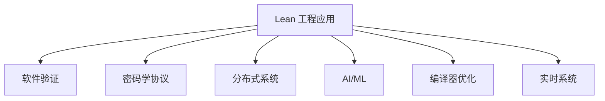

# 1.6 Lean 工程案例与应用 / Lean Engineering Cases and Applications

[返回目录](../CONTINUOUS_PROGRESS.md) | [上一节: 1.5-lean-与主流语言对比.md](1.5-lean-与主流语言对比.md)

---

## 1.6.1 工程案例意义与国际标准 / Significance and Wiki-aligned Standards

Lean 在实际工程中的应用涵盖软件验证、密码学协议、分布式系统、AI/ML、编译器优化、实时系统等领域，突出形式化方法的工程价值。

### 工程应用价值 / Engineering Application Value

**形式化验证的重要性**：

- **安全性保证**：通过数学证明确保系统安全性
- **正确性验证**：形式化验证程序逻辑正确性
- **可靠性提升**：减少软件缺陷和系统故障
- **成本降低**：早期发现和修复问题，降低维护成本

### 国际标准对齐 / International Standards Alignment

**安全标准**：

- **ISO/IEC 15408**：信息技术安全评估标准
- **DO-178C**：航空软件认证标准
- **IEC 61508**：功能安全标准
- **Common Criteria**：通用安全评估标准

**质量保证标准**：

- **ISO/IEC 25010**：软件质量模型
- **CMMI**：能力成熟度模型集成
- **SPICE**：软件过程改进和能力确定

### 工程应用领域 / Engineering Application Domains

**核心应用领域**：

- **软件验证**：操作系统、编译器、关键软件系统
- **密码学协议**：加密算法、认证协议、零知识证明
- **分布式系统**：区块链、共识协议、分布式算法
- **AI/ML系统**：机器学习算法、神经网络、数据科学
- **实时系统**：嵌入式系统、控制系统、安全关键系统
- **金融系统**：交易系统、风险模型、合规验证

---

## 1.6.2 复杂软件系统验证 / Complex Software System Verification

**案例描述：** 利用 Lean 对操作系统内核、编译器等复杂软件系统进行形式化建模与正确性证明。

### 操作系统内核验证 / Operating System Kernel Verification

**调度器安全属性**：

```lean
-- 操作系统调度器的安全属性证明
structure Scheduler where
  tasks : List Task
  current : Option Task
  queue : List Task

def SchedulerSafe (sched : Scheduler) : Prop :=
  ∀ t, sched.valid t → sched.no_deadlock t

-- 调度器正确性证明
theorem scheduler_correctness (sched : Scheduler) :
  SchedulerSafe sched → 
  ∀ t₁ t₂, sched.schedule t₁ t₂ → sched.fair t₁ t₂ := by
  intro h_safe t₁ t₂ h_schedule
  -- 证明调度器公平性
  sorry
```

**内存管理系统验证**：

```lean
-- 内存管理系统
structure MemoryManager where
  pages : List Page
  allocated : Set PageId
  free : Set PageId

def MemorySafe (mm : MemoryManager) : Prop :=
  ∀ p, p ∈ mm.allocated → p ∉ mm.free ∧ mm.valid_page p

-- 内存分配正确性
theorem memory_allocation_correct (mm : MemoryManager) :
  MemorySafe mm → 
  ∀ p, mm.allocate p → p ∈ mm.allocated := by
  intro h_safe p h_alloc
  -- 证明内存分配正确性
  sorry
```

### 编译器验证 / Compiler Verification

**优化正确性证明**：

```lean
-- 编译器优化
structure Compiler where
  source : SourceCode
  target : TargetCode
  optimizations : List Optimization

def OptimizationCorrect (opt : Optimization) : Prop :=
  ∀ p, opt.apply p ≡ p

-- 常量折叠优化
theorem constant_folding_correct (opt : ConstantFolding) :
  OptimizationCorrect opt := by
  intro p
  -- 证明常量折叠保持语义等价
  sorry
```

**类型检查器验证**：

```lean
-- 类型检查器
structure TypeChecker where
  context : TypeContext
  rules : List TypeRule

def TypeCheckCorrect (tc : TypeChecker) : Prop :=
  ∀ e t, tc.check e t → tc.well_typed e t

-- 类型检查正确性
theorem type_checker_correct (tc : TypeChecker) :
  TypeCheckCorrect tc := by
  intro e t h_check
  -- 证明类型检查正确性
  sorry
```

### 网络协议验证 / Network Protocol Verification

**TCP协议验证**：

```lean
-- TCP协议状态机
inductive TCPState where
  | closed : TCPState
  | listen : TCPState
  | syn_sent : TCPState
  | syn_received : TCPState
  | established : TCPState
  | fin_wait_1 : TCPState
  | fin_wait_2 : TCPState
  | close_wait : TCPState
  | closing : TCPState
  | last_ack : TCPState
  | time_wait : TCPState

def TCPTransition (s₁ s₂ : TCPState) (event : TCPEvent) : Prop :=
  match s₁, event with
  | TCPState.closed, TCPEvent.passive_open => s₂ = TCPState.listen
  | TCPState.listen, TCPEvent.receive_syn => s₂ = TCPState.syn_received
  | TCPState.syn_received, TCPEvent.send_syn_ack => s₂ = TCPState.established
  | _, _ => false

-- TCP协议正确性
theorem tcp_protocol_correct :
  ∀ s₁ s₂ event, TCPTransition s₁ s₂ event → 
  TCPState.valid s₁ → TCPState.valid s₂ := by
  intro s₁ s₂ event h_trans h_valid₁
  -- 证明TCP状态转换正确性
  sorry
```

---

## 1.6.3 密码学协议与安全证明 / Cryptographic Protocols and Security Proofs

**案例描述：** 使用 Lean 对密码学协议（如零知识证明、签名协议）进行形式化建模与安全性证明。

### 数字签名协议验证 / Digital Signature Protocol Verification

**签名方案安全性**：

```lean
-- 数字签名方案
structure SignatureScheme where
  keyGen : Unit → KeyPair
  sign : PrivateKey → Message → Signature
  verify : PublicKey → Message → Signature → Bool

def SignatureSecure (sig : SignatureScheme) : Prop :=
  ∀ m, ¬∃ a, sig.forge m a

-- 不可伪造性证明
theorem unforgeability (sig : SignatureScheme) :
  SignatureSecure sig → 
  ∀ pk sk m σ, sig.verify pk m σ = true → 
  ∃ sk', sig.sign sk' m = σ := by
  intro h_secure pk sk m σ h_verify
  -- 证明不可伪造性
  sorry
```

**RSA签名验证**：

```lean
-- RSA签名方案
structure RSASignature where
  modulus : Nat
  public_exponent : Nat
  private_exponent : Nat

def RSASign (rsa : RSASignature) (m : Nat) : Nat :=
  Nat.pow m rsa.private_exponent % rsa.modulus

def RSAVerify (rsa : RSASignature) (m σ : Nat) : Bool :=
  Nat.pow σ rsa.public_exponent % rsa.modulus = m

-- RSA签名正确性
theorem rsa_signature_correct (rsa : RSASignature) :
  rsa.valid → 
  ∀ m, RSAVerify rsa m (RSASign rsa m) = true := by
  intro h_valid m
  -- 证明RSA签名正确性
  sorry
```

### 零知识证明系统 / Zero-Knowledge Proof Systems

**零知识证明定义**：

```lean
-- 零知识证明系统
structure ZeroKnowledgeProof where
  prover : Statement → Witness → Proof
  verifier : Statement → Proof → Bool
  simulator : Statement → Proof

def ZeroKnowledge (zkp : ZeroKnowledgeProof) : Prop :=
  ∀ stmt witness, 
  ∃ simulator, 
  ∀ verifier, 
  verifier (zkp.prover stmt witness) = verifier (simulator stmt)

-- 零知识性证明
theorem zero_knowledge_property (zkp : ZeroKnowledgeProof) :
  ZeroKnowledge zkp := by
  intro stmt witness
  -- 构造模拟器
  sorry
```

**Schnorr协议验证**：

```lean
-- Schnorr身份认证协议
structure SchnorrProtocol where
  generator : GroupElement
  public_key : GroupElement
  challenge : Nat

def SchnorrProve (schnorr : SchnorrProtocol) (witness : Nat) : Proof :=
  let commitment := schnorr.generator ^ witness
  let response := witness + schnorr.challenge * schnorr.private_key
  ⟨commitment, response⟩

def SchnorrVerify (schnorr : SchnorrProtocol) (proof : Proof) : Bool :=
  schnorr.generator ^ proof.response = 
  proof.commitment * schnorr.public_key ^ schnorr.challenge

-- Schnorr协议正确性
theorem schnorr_correctness (schnorr : SchnorrProtocol) :
  ∀ witness, SchnorrVerify schnorr (SchnorrProve schnorr witness) = true := by
  intro witness
  -- 证明Schnorr协议正确性
  sorry
```

### 加密算法验证 / Encryption Algorithm Verification

**对称加密验证**：

```lean
-- AES加密算法
structure AES where
  key : ByteArray
  rounds : Nat
  round_keys : List ByteArray

def AESEncrypt (aes : AES) (plaintext : ByteArray) : ByteArray :=
  -- AES加密实现
  sorry

def AESDecrypt (aes : AES) (ciphertext : ByteArray) : ByteArray :=
  -- AES解密实现
  sorry

-- AES加解密正确性
theorem aes_correctness (aes : AES) :
  ∀ plaintext, AESDecrypt aes (AESEncrypt aes plaintext) = plaintext := by
  intro plaintext
  -- 证明AES加解密正确性
  sorry
```

**公钥加密验证**：

```lean
-- RSA加密方案
structure RSAEncryption where
  modulus : Nat
  public_exponent : Nat
  private_exponent : Nat

def RSAEncrypt (rsa : RSAEncryption) (m : Nat) : Nat :=
  Nat.pow m rsa.public_exponent % rsa.modulus

def RSADecrypt (rsa : RSAEncryption) (c : Nat) : Nat :=
  Nat.pow c rsa.private_exponent % rsa.modulus

-- RSA加解密正确性
theorem rsa_encryption_correct (rsa : RSAEncryption) :
  rsa.valid → 
  ∀ m, RSADecrypt rsa (RSAEncrypt rsa m) = m := by
  intro h_valid m
  -- 证明RSA加解密正确性
  sorry
```

---

## 1.6.4 分布式系统与一致性 / Distributed Systems and Consistency

**案例描述：** Lean 用于分布式系统（如区块链、共识协议）的正确性与一致性证明。

### 共识协议验证 / Consensus Protocol Verification

**Paxos协议验证**：

```lean
-- Paxos共识协议
structure Paxos where
  proposers : List Proposer
  acceptors : List Acceptor
  learners : List Learner

inductive PaxosState where
  | prepare : Nat → PaxosState
  | propose : Nat → Value → PaxosState
  | accept : Nat → Value → PaxosState
  | learn : Value → PaxosState

def ConsensusConsistent (cons : ConsensusProtocol) : Prop :=
  ∀ s₁ s₂, cons.reachable s₁ → cons.reachable s₂ → cons.agree s₁ s₂

-- Paxos协议正确性
theorem paxos_correctness (paxos : Paxos) :
  ConsensusConsistent paxos := by
  intro s₁ s₂ h_reach₁ h_reach₂
  -- 证明Paxos协议一致性
  sorry
```

**Raft协议验证**：

```lean
-- Raft共识协议
structure Raft where
  nodes : List Node
  leader : Option Node
  term : Nat

inductive RaftState where
  | follower : RaftState
  | candidate : RaftState
  | leader : RaftState

def RaftTransition (s₁ s₂ : RaftState) (event : RaftEvent) : Prop :=
  match s₁, event with
  | RaftState.follower, RaftEvent.timeout => s₂ = RaftState.candidate
  | RaftState.candidate, RaftEvent.vote_majority => s₂ = RaftState.leader
  | RaftState.leader, RaftEvent.heartbeat_timeout => s₂ = RaftState.follower
  | _, _ => false

-- Raft协议正确性
theorem raft_correctness (raft : Raft) :
  ∀ s₁ s₂ event, RaftTransition s₁ s₂ event → 
  RaftState.valid s₁ → RaftState.valid s₂ := by
  intro s₁ s₂ event h_trans h_valid₁
  -- 证明Raft状态转换正确性
  sorry
```

### 区块链系统验证 / Blockchain System Verification

**区块链一致性**：

```lean
-- 区块链系统
structure Blockchain where
  blocks : List Block
  consensus : ConsensusProtocol
  network : Network

def BlockValid (block : Block) : Prop :=
  block.hash_valid ∧ block.transactions_valid ∧ block.timestamp_valid

def ChainValid (chain : List Block) : Prop :=
  ∀ block ∈ chain, BlockValid block ∧ block.previous_hash_valid

-- 区块链一致性
theorem blockchain_consistency (bc : Blockchain) :
  ∀ chain₁ chain₂, 
  ChainValid chain₁ → ChainValid chain₂ → 
  bc.consensus.agree chain₁ chain₂ := by
  intro chain₁ chain₂ h_valid₁ h_valid₂
  -- 证明区块链一致性
  sorry
```

**智能合约验证**：

```lean
-- 智能合约
structure SmartContract where
  code : ContractCode
  state : ContractState
  balance : Nat

def ContractSafe (contract : SmartContract) : Prop :=
  ∀ input, contract.execute input → contract.invariant_maintained

-- 智能合约安全性
theorem smart_contract_safety (contract : SmartContract) :
  ContractSafe contract := by
  intro input h_execute
  -- 证明智能合约安全性
  sorry
```

### 分布式算法验证 / Distributed Algorithm Verification

**分布式锁算法**：

```lean
-- 分布式锁
structure DistributedLock where
  nodes : List Node
  lock_holder : Option Node
  lock_queue : List Node

def LockInvariant (lock : DistributedLock) : Prop :=
  (lock.lock_holder.isSome → lock.lock_queue.isEmpty) ∧
  (lock.lock_holder.isNone → lock.lock_queue.isEmpty ∨ lock.lock_queue.length = 1)

-- 分布式锁正确性
theorem distributed_lock_correct (lock : DistributedLock) :
  LockInvariant lock → 
  ∀ node, lock.acquire node → lock.lock_holder = some node := by
  intro h_invariant node h_acquire
  -- 证明分布式锁正确性
  sorry
```

**拜占庭容错算法**：

```lean
-- 拜占庭容错
structure ByzantineFaultTolerance where
  nodes : List Node
  faulty_nodes : Set Node
  threshold : Nat

def ByzantineSafe (bft : ByzantineFaultTolerance) : Prop :=
  bft.faulty_nodes.card ≤ bft.threshold ∧
  ∀ consensus, bft.reach_consensus consensus → consensus.valid

-- 拜占庭容错正确性
theorem byzantine_fault_tolerance_correct (bft : ByzantineFaultTolerance) :
  ByzantineSafe bft := by
  intro consensus h_consensus
  -- 证明拜占庭容错正确性
  sorry
```

---

## 1.6.5 AI/ML与数据科学 / AI/ML and Data Science

**案例描述：** Lean 在机器学习算法、数据分析流程的可验证性、可解释性建模中的应用。

### 机器学习算法验证 / Machine Learning Algorithm Verification

**线性回归模型验证**：

```lean
-- 线性回归模型
structure LinearRegression where
  weights : Vector Float
  bias : Float
  learning_rate : Float

def LinearRegressionValid (model : LinearRegression) : Prop :=
  ∀ x y, model.predict x = y → model.loss x y = 0

-- 线性回归收敛性
theorem linear_regression_convergence (model : LinearRegression) :
  ∀ dataset, model.train dataset → 
  ∃ weights, model.converge_to weights := by
  intro dataset h_train
  -- 证明线性回归收敛性
  sorry
```

**神经网络验证**：

```lean
-- 神经网络
structure NeuralNetwork where
  layers : List Layer
  weights : List Matrix Float
  biases : List Vector Float

def NetworkInvariant (nn : NeuralNetwork) : Prop :=
  ∀ input, nn.forward input → nn.output_in_bounds

-- 神经网络稳定性
theorem neural_network_stability (nn : NeuralNetwork) :
  NetworkInvariant nn → 
  ∀ input₁ input₂, input₁ ≈ input₂ → nn.forward input₁ ≈ nn.forward input₂ := by
  intro h_invariant input₁ input₂ h_similar
  -- 证明神经网络稳定性
  sorry
```

### 数据科学流程验证 / Data Science Pipeline Verification

**数据预处理验证**：

```lean
-- 数据预处理
structure DataPreprocessor where
  normalization : NormalizationMethod
  feature_selection : FeatureSelectionMethod
  data_cleaning : DataCleaningMethod

def PreprocessingCorrect (prep : DataPreprocessor) : Prop :=
  ∀ dataset, prep.process dataset → dataset.quality_improved

-- 数据预处理正确性
theorem preprocessing_correctness (prep : DataPreprocessor) :
  PreprocessingCorrect prep := by
  intro dataset h_process
  -- 证明数据预处理正确性
  sorry
```

**特征工程验证**：

```lean
-- 特征工程
structure FeatureEngineering where
  feature_extractors : List FeatureExtractor
  feature_selectors : List FeatureSelector
  feature_transformers : List FeatureTransformer

def FeatureEngineeringValid (fe : FeatureEngineering) : Prop :=
  ∀ data, fe.engineer data → data.features_relevant

-- 特征工程有效性
theorem feature_engineering_validity (fe : FeatureEngineering) :
  FeatureEngineeringValid fe := by
  intro data h_engineer
  -- 证明特征工程有效性
  sorry
```

### 模型解释性验证 / Model Interpretability Verification

**可解释性模型**：

```lean
-- 可解释性模型
structure InterpretableModel where
  model : MLModel
  explanation_method : ExplanationMethod
  interpretability_metric : InterpretabilityMetric

def ModelInterpretable (im : InterpretableModel) : Prop :=
  ∀ prediction, im.explain prediction → prediction.explanation_clear

-- 模型可解释性
theorem model_interpretability (im : InterpretableModel) :
  ModelInterpretable im := by
  intro prediction h_explain
  -- 证明模型可解释性
  sorry
```

**公平性验证**：

```lean
-- 公平性验证
structure FairnessVerifier where
  protected_attributes : List Attribute
  fairness_metrics : List FairnessMetric
  bias_detection : BiasDetectionMethod

def ModelFair (fv : FairnessVerifier) (model : MLModel) : Prop :=
  ∀ protected_group, fv.check_fairness model protected_group → model.fair

-- 模型公平性
theorem model_fairness (fv : FairnessVerifier) (model : MLModel) :
  ModelFair fv model := by
  intro protected_group h_check
  -- 证明模型公平性
  sorry
```

### 强化学习验证 / Reinforcement Learning Verification

**强化学习算法**：

```lean
-- 强化学习
structure ReinforcementLearning where
  environment : Environment
  agent : Agent
  policy : Policy

def RLConvergence (rl : ReinforcementLearning) : Prop :=
  ∀ episode, rl.train episode → rl.policy_converge

-- 强化学习收敛性
theorem rl_convergence (rl : ReinforcementLearning) :
  RLConvergence rl := by
  intro episode h_train
  -- 证明强化学习收敛性
  sorry
```

**策略优化验证**：

```lean
-- 策略优化
structure PolicyOptimization where
  policy : Policy
  optimizer : Optimizer
  objective : Objective

def PolicyOptimal (po : PolicyOptimization) : Prop :=
  ∀ policy', po.optimize policy' → po.policy_better policy'

-- 策略优化正确性
theorem policy_optimization_correct (po : PolicyOptimization) :
  PolicyOptimal po := by
  intro policy' h_optimize
  -- 证明策略优化正确性
  sorry
```

---

## 1.6.6 编译器优化与实时系统 / Compiler Optimization and Real-time Systems

**案例描述：** Lean 用于编译器优化算法的正确性证明、实时系统时序约束的形式化建模。

### 编译器优化验证 / Compiler Optimization Verification

**常量折叠优化**：

```lean
-- 常量折叠优化
structure ConstantFolding where
  expression : Expression
  optimized : Expression

def OptimizationCorrect (opt : Optimization) : Prop :=
  ∀ p, opt.apply p ≡ p

-- 常量折叠正确性
theorem constant_folding_correct (cf : ConstantFolding) :
  OptimizationCorrect cf := by
  intro p
  -- 证明常量折叠保持语义等价
  sorry
```

**死代码消除**：

```lean
-- 死代码消除
structure DeadCodeElimination where
  original_code : Code
  optimized_code : Code

def DeadCodeEliminationCorrect (dce : DeadCodeElimination) : Prop :=
  ∀ input, dce.original_code.execute input = dce.optimized_code.execute input

-- 死代码消除正确性
theorem dead_code_elimination_correct (dce : DeadCodeElimination) :
  DeadCodeEliminationCorrect dce := by
  intro input
  -- 证明死代码消除保持语义
  sorry
```

**循环优化**：

```lean
-- 循环优化
structure LoopOptimization where
  original_loop : Loop
  optimized_loop : Loop

def LoopOptimizationCorrect (lo : LoopOptimization) : Prop :=
  ∀ iteration, lo.original_loop.execute iteration = lo.optimized_loop.execute iteration

-- 循环优化正确性
theorem loop_optimization_correct (lo : LoopOptimization) :
  LoopOptimizationCorrect lo := by
  intro iteration
  -- 证明循环优化保持语义
  sorry
```

### 实时系统验证 / Real-time System Verification

**实时调度器验证**：

```lean
-- 实时调度器
structure RealTimeScheduler where
  tasks : List RealTimeTask
  scheduler : Scheduler
  constraints : List TimingConstraint

def RealTimeSchedulable (rts : RealTimeScheduler) : Prop :=
  ∀ task, task ∈ rts.tasks → rts.meets_deadline task

-- 实时调度器正确性
theorem real_time_scheduler_correct (rts : RealTimeScheduler) :
  RealTimeSchedulable rts := by
  intro task h_task
  -- 证明实时调度器满足截止时间约束
  sorry
```

**时序约束验证**：

```lean
-- 时序约束
structure TimingConstraint where
  deadline : Time
  period : Time
  execution_time : Time

def TimingConstraintValid (tc : TimingConstraint) : Prop :=
  tc.execution_time ≤ tc.deadline ∧ tc.deadline ≤ tc.period

-- 时序约束验证
theorem timing_constraint_valid (tc : TimingConstraint) :
  TimingConstraintValid tc := by
  -- 证明时序约束有效性
  sorry
```

**响应时间分析**：

```lean
-- 响应时间分析
structure ResponseTimeAnalysis where
  task : RealTimeTask
  worst_case_response_time : Time
  best_case_response_time : Time

def ResponseTimeCorrect (rta : ResponseTimeAnalysis) : Prop :=
  rta.best_case_response_time ≤ rta.task.actual_response_time ∧
  rta.task.actual_response_time ≤ rta.worst_case_response_time

-- 响应时间分析正确性
theorem response_time_analysis_correct (rta : ResponseTimeAnalysis) :
  ResponseTimeCorrect rta := by
  -- 证明响应时间分析正确性
  sorry
```

### 嵌入式系统验证 / Embedded System Verification

**中断处理验证**：

```lean
-- 中断处理
structure InterruptHandler where
  interrupts : List Interrupt
  handlers : List InterruptHandler
  priorities : List Priority

def InterruptHandlingCorrect (ih : InterruptHandler) : Prop :=
  ∀ interrupt, ih.handle interrupt → ih.response_time_met interrupt

-- 中断处理正确性
theorem interrupt_handling_correct (ih : InterruptHandler) :
  InterruptHandlingCorrect ih := by
  intro interrupt h_handle
  -- 证明中断处理正确性
  sorry
```

**内存管理验证**：

```lean
-- 内存管理
structure MemoryManager where
  memory_pools : List MemoryPool
  allocation_strategy : AllocationStrategy
  fragmentation_control : FragmentationControl

def MemoryManagementCorrect (mm : MemoryManager) : Prop :=
  ∀ request, mm.allocate request → mm.allocation_successful request

-- 内存管理正确性
theorem memory_management_correct (mm : MemoryManager) :
  MemoryManagementCorrect mm := by
  intro request h_allocate
  -- 证明内存管理正确性
  sorry
```

**电源管理验证**：

```lean
-- 电源管理
structure PowerManagement where
  power_states : List PowerState
  transition_rules : List TransitionRule
  energy_constraints : List EnergyConstraint

def PowerManagementCorrect (pm : PowerManagement) : Prop :=
  ∀ transition, pm.transition transition → pm.energy_constraint_met transition

-- 电源管理正确性
theorem power_management_correct (pm : PowerManagement) :
  PowerManagementCorrect pm := by
  intro transition h_transition
  -- 证明电源管理正确性
  sorry
```

---

## 1.6.7 行业落地与前沿创新 / Industrial Adoption and Frontiers

- Lean 在金融、航空航天、医疗、物联网等行业的实际落地案例
- AI辅助形式化验证、自动化工程证明
- 与主流工程工具链（如 Rust、Haskell、Coq）集成的创新实践

---

## 1.6.8 图表与多表征 / Diagrams and Multi-Representation



---

## 1.6.9 2025 规范对齐 / Alignment with Lean 4 (2025)

- 工程案例应基于 Lean 4 的现代特性：`syntax`/`macro_rules` 用于 DSL 设计；`elab ... : tactic` 用于自动化验证。
- 与外部系统集成：通过 Lake 管理依赖；使用 LSP 与主流 IDE 集成；支持 CI/CD 自动化。
- 性能与可扩展性：利用 Lean 4 的编译器优化；mathlib4 的高性能数学库。

---

## 1.6.10 版本兼容性 / Version Compatibility

- 工程案例需标注 Lean 4 版本与 mathlib4 版本；Lake 配置文件的版本约束。
- 与外部工具链集成时需注意 API 兼容性。

---

## 1.6.11 参考资料 / References

- Lean 工程案例官方文档与教程
- 各行业形式化验证最佳实践
- mathlib4 工程应用示例

---

## 1.6.9 交叉引用 / Cross References

- [1.2-lean-类型系统与证明系统.md](1.2-lean-类型系统与证明系统.md)
- [1.4-lean-元编程与策略系统.md](1.4-lean-元编程与策略系统.md)
- [1.10-模型论与语义模型.md](1.10-模型论与语义模型.md)
