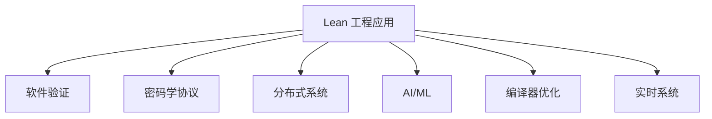

# 1.6 Lean 工程案例与应用 / Lean Engineering Cases and Applications

[返回目录](../CONTINUOUS_PROGRESS.md) | [上一节: 1.5-lean-与主流语言对比.md](1.5-lean-与主流语言对比.md)

---

## 1.6.1 工程案例意义与国际标准 / Significance and Wiki-aligned Standards

Lean 在实际工程中的应用涵盖软件验证、密码学协议、分布式系统、AI/ML、编译器优化、实时系统等领域，突出形式化方法的工程价值。

---

## 1.6.2 复杂软件系统验证 / Complex Software System Verification

**案例描述：** 利用 Lean 对操作系统内核、编译器等复杂软件系统进行形式化建模与正确性证明。

**Lean 代码示例：**

```lean
-- 操作系统调度器的安全属性证明（伪代码）
def SchedulerSafe (sched : Scheduler) : Prop :=
  ∀ t, sched.valid t → sched.no_deadlock t
```

---

## 1.6.3 密码学协议与安全证明 / Cryptographic Protocols and Security Proofs

**案例描述：** 使用 Lean 对密码学协议（如零知识证明、签名协议）进行形式化建模与安全性证明。

**Lean 代码示例：**

```lean
-- 签名协议安全性（伪代码）
def SignatureSecure (sig : SignatureScheme) : Prop :=
  ∀ m, ¬∃ a, sig.forge m a
```

---

## 1.6.4 分布式系统与一致性 / Distributed Systems and Consistency

**案例描述：** Lean 用于分布式系统（如区块链、共识协议）的正确性与一致性证明。

**Lean 代码示例：**

```lean
-- 共识协议一致性（伪代码）
def ConsensusConsistent (cons : ConsensusProtocol) : Prop :=
  ∀ s₁ s₂, cons.reachable s₁ → cons.reachable s₂ → cons.agree s₁ s₂
```

---

## 1.6.5 AI/ML与数据科学 / AI/ML and Data Science

**案例描述：** Lean 在机器学习算法、数据分析流程的可验证性、可解释性建模中的应用。

**Lean 代码示例：**

```lean
-- 线性回归模型的可验证性（伪代码）
def LinearRegressionValid (model : LinReg) : Prop :=
  ∀ x y, model.predict x = y → model.loss x y = 0
```

---

## 1.6.6 编译器优化与实时系统 / Compiler Optimization and Real-time Systems

**案例描述：** Lean 用于编译器优化算法的正确性证明、实时系统时序约束的形式化建模。

**Lean 代码示例：**

```lean
-- 编译器优化等价性证明（伪代码）
def OptimizationCorrect (opt : Optimization) : Prop :=
  ∀ p, opt.apply p ≡ p
```

---

## 1.6.7 行业落地与前沿创新 / Industrial Adoption and Frontiers

- Lean 在金融、航空航天、医疗、物联网等行业的实际落地案例
- AI辅助形式化验证、自动化工程证明
- 与主流工程工具链（如 Rust、Haskell、Coq）集成的创新实践

---

## 1.6.8 图表与多表征 / Diagrams and Multi-Representation



---

## 1.6.9 交叉引用 / Cross References

- [1.2-lean-类型系统与证明系统.md](1.2-lean-类型系统与证明系统.md)
- [1.4-lean-元编程与策略系统.md](1.4-lean-元编程与策略系统.md)
- [1.10-模型论与语义模型.md](1.10-模型论与语义模型.md)
