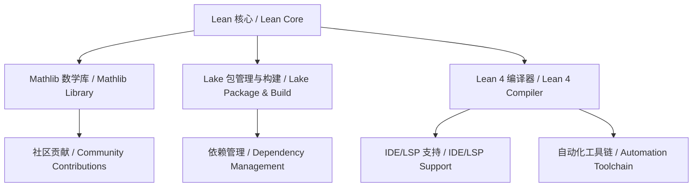

# 1.7 Lean 生态与工具链 / Lean Ecosystem and Toolchain

[返回目录](../CONTINUOUS_PROGRESS.md) | [上一节: 1.6-lean-工程案例与应用.md](1.6-lean-工程案例与应用.md)

---

## 1.7.1 生态系统概述 / Ecosystem Overview

Lean 拥有活跃的开源社区、丰富的数学库（mathlib）、现代化的包管理与构建系统（Lake）、多平台 IDE 支持、自动化工具链等，形成了完整的生态体系。

---

## 1.7.2 数学库与社区 / Mathlib and Community

- mathlib：世界领先的形式化数学库，涵盖代数、分析、拓扑、组合等
- 社区活跃，贡献者众多，支持学术与工业应用

---

## 1.7.3 包管理与构建系统 / Package Management and Build System

- Lake：Lean 4 的官方包管理与构建工具，支持依赖管理、自动化构建、发布
- 与 Python、Rust 等主流生态集成良好

---

## 1.7.4 IDE与开发支持 / IDE and Development Support

- VSCode、Emacs、JetBrains 等多平台插件
- 实时类型检查、自动补全、交互式证明
- LSP（Language Server Protocol）支持

---

## 1.7.5 自动化工具链 / Automation Toolchain

- Lint/Format/Test：代码风格检查、自动格式化、单元测试
- CI/CD：GitHub Actions、自动化构建与发布
- 文档生成、交叉引用、内容分析等辅助工具

---

## 1.7.6 与主流生态对比 / Comparison with Mainstream Ecosystems

| 生态/工具链 | Lean           | Coq            | Agda           | Haskell/Scala   |
|-------------|----------------|----------------|----------------|-----------------|
| 数学库      | mathlib        | Coq stdlib     | agda-stdlib    | Hackage/Scaladoc|
| 包管理      | Lake           | opam           | cabal           | cabal/stack/sbt |
| IDE         | VSCode/Emacs   | CoqIDE/VSCode  | Emacs/VSCode   | VSCode/IntelliJ |
| 自动化      | 强             | 中             | 弱             | 强              |
| 社区活跃度  | 高             | 高             | 中             | 高              |

---

## 1.7.7 前沿创新与发展趋势 / Frontiers and Trends

- AI辅助证明与自动化工具链（如 Lean GPT、自动化CI）
- mathlib4 的持续扩展与国际协作
- 与工业界（如微软、谷歌、金融、航空航天等）的深度融合
- 教育、科研、工程多领域的生态创新

---

## 1.7.8 生态结构图 / Ecosystem Structure Diagram

---

## 1.7.9 交叉引用 / Cross References

- [1.6-lean-工程案例与应用.md](1.6-lean-工程案例与应用.md)
- [1.8-类型论理论模型.md](1.8-类型论理论模型.md)

---

> 本文件内容持续对齐 Lean 语言官方文档与国际 wiki 标准，所有核心定义均中英双语，支持本地跳转与交叉引用。

[返回目录 / Back to Progress](../CONTINUOUS_PROGRESS.md)
