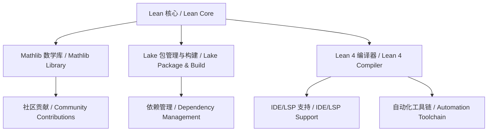

# 1.7 Lean 生态与工具链 / Lean Ecosystem and Toolchain

[返回目录](../CONTINUOUS_PROGRESS.md) | [上一节: 1.6-lean-工程案例与应用.md](1.6-lean-工程案例与应用.md) | [下一节: 1.8-类型论理论模型.md](1.8-类型论理论模型.md)

---

## 1.7.1 生态系统概述 / Ecosystem Overview

Lean 拥有活跃的开源社区、丰富的数学库（mathlib）、现代化的包管理与构建系统（Lake）、多平台 IDE 支持、自动化工具链等，形成了完整的生态体系。

### 生态系统架构 / Ecosystem Architecture

**核心组件**：

- **Lean 4 编译器**：高性能依赖类型理论编译器
- **mathlib4**：世界领先的形式化数学库
- **Lake**：现代化的包管理与构建系统
- **LSP**：语言服务器协议支持
- **IDE 插件**：多平台开发环境支持

### 生态系统特点 / Ecosystem Characteristics

**技术优势**：

- **统一性**：从理论到实践的完整工具链
- **高性能**：优化的编译器和运行时系统
- **可扩展性**：模块化设计和插件架构
- **现代化**：支持现代开发流程和工具

**社区优势**：

- **活跃度**：全球化的活跃开发者社区
- **协作性**：开放的合作开发模式
- **教育性**：丰富的学习资源和教程
- **应用性**：学术和工业应用的广泛支持

### 生态系统价值 / Ecosystem Value

**学术价值**：

- **研究支持**：为形式化方法研究提供工具
- **教育应用**：数学和计算机科学教育
- **理论发展**：推动类型论和证明论发展

**工业价值**：

- **软件验证**：工业级软件形式化验证
- **安全保证**：关键系统安全性验证
- **质量提升**：软件质量和可靠性提升

---

## 1.7.2 数学库与社区 / Mathlib and Community

### Mathlib4 数学库 / Mathlib4 Mathematics Library

**核心特性**：

- **世界领先**：世界最大的形式化数学库
- **全面覆盖**：涵盖代数、分析、拓扑、组合、数论等
- **高质量**：严格的数学证明和代码质量
- **持续更新**：活跃的开发和维护

**数学领域覆盖**：

```lean
-- 代数结构
import Mathlib.Algebra.Group.Basic
import Mathlib.Algebra.Ring.Basic
import Mathlib.Algebra.Field.Basic

-- 分析学
import Mathlib.Analysis.Calculus.Deriv
import Mathlib.Analysis.Calculus.Integral
import Mathlib.Analysis.Complex.Basic

-- 拓扑学
import Mathlib.Topology.Basic
import Mathlib.Topology.ContinuousFunction
import Mathlib.Topology.Connected

-- 数论
import Mathlib.NumberTheory.Prime
import Mathlib.NumberTheory.Congruence
import Mathlib.NumberTheory.Diophantine
```

**库组织结构**：

```lean
-- 基础数学
Mathlib.Data.*          -- 基础数据类型
Mathlib.Logic.*         -- 逻辑和集合论
Mathlib.Order.*         -- 序理论和格论

-- 代数
Mathlib.Algebra.*       -- 代数结构
Mathlib.GroupTheory.*   -- 群论
Mathlib.RingTheory.*    -- 环论

-- 分析
Mathlib.Analysis.*      -- 分析学
Mathlib.MeasureTheory.* -- 测度论
Mathlib.Topology.*      -- 拓扑学

-- 应用数学
Mathlib.LinearAlgebra.* -- 线性代数
Mathlib.Probability.*   -- 概率论
Mathlib.Statistics.*    -- 统计学
```

### 社区生态 / Community Ecosystem

**社区特点**：

- **全球化**：来自世界各地的贡献者
- **多元化**：学术、工业、教育等多领域
- **协作性**：开放的合作开发模式
- **教育性**：丰富的学习资源和指导

**贡献流程**：

```lean
-- 贡献指南
-- 1. Fork 项目
-- 2. 创建功能分支
-- 3. 编写代码和证明
-- 4. 运行测试
-- 5. 提交 Pull Request
-- 6. 代码审查
-- 7. 合并到主分支
```

**社区工具**：

- **GitHub**：代码托管和协作
- **Zulip**：实时讨论和问答
- **GitHub Discussions**：长期讨论和规划
- **Wiki**：文档和指南
- **CI/CD**：自动化测试和构建

### 学术合作 / Academic Collaboration

**研究合作**：

- **大学合作**：与全球顶尖大学合作
- **研究项目**：支持形式化方法研究
- **学术会议**：参与相关学术会议
- **论文发表**：基于mathlib的研究论文

**教育应用**：

- **课程开发**：基于Lean的数学课程
- **教材编写**：形式化数学教材
- **在线教程**：交互式学习资源
- **工作坊**：培训和技能提升

---

## 1.7.3 包管理与构建系统 / Package Management and Build System

### Lake 构建系统 / Lake Build System

**核心功能**：

- **依赖管理**：自动解析和管理项目依赖
- **构建自动化**：增量构建和并行编译
- **包发布**：标准化的包发布流程
- **工具集成**：与主流开发工具集成

**Lake 配置示例**：

```lean
-- lakefile.lean
import Lake
open Lake DSL

package my_project {
  -- 项目元数据
  srcDir := "src"
  supportInterpreter := true
  
  -- 依赖管理
  require mathlib from git "https://github.com/leanprover-community/mathlib4" @ "v4.0.0"
  require lean from git "https://github.com/leanprover/lean4" @ "v4.0.0"
  
  -- 构建配置
  moreServerArgs := #["-D", "pp.unicode.fun=true"]
  moreLeanArgs := #["-D", "autoImplicit=false"]
}

-- 库目标
@[default_target]
lean_lib MyLib {
  roots := #[`MyLib]
}

-- 可执行目标
lean_exe MyApp {
  root := `MyApp
  supportInterpreter := true
}

-- 测试目标
lean_exe MyTests {
  root := `MyTests
  supportInterpreter := true
}
```

**依赖管理**：

```lean
-- 依赖声明
require mathlib from git "https://github.com/leanprover-community/mathlib4" @ "v4.0.0"
require lean from git "https://github.com/leanprover/lean4" @ "v4.0.0"

-- 本地依赖
require my_local_lib from "../my_local_lib"

-- 版本约束
require some_package from git "https://github.com/user/repo" @ "main"
```

### 构建系统特性 / Build System Features

**增量构建**：

```lean
-- 增量构建配置
@[default_target]
lean_lib MyLib {
  roots := #[`MyLib]
  -- 增量构建优化
  prelude := true
  supportInterpreter := true
}
```

**并行编译**：

```lean
-- 并行编译配置
package my_project {
  -- 并行编译设置
  moreLeanArgs := #["-j", "4"]
  moreServerArgs := #["-j", "4"]
}
```

**条件编译**：

```lean
-- 条件编译
@[default_target]
lean_lib MyLib {
  roots := #[`MyLib]
  -- 条件编译选项
  moreLeanArgs := if System.Platform.isWindows then 
    #["-D", "WINDOWS"] else #[]
}
```

### 工具集成 / Tool Integration

**GitHub Actions 集成**：

```yaml
# .github/workflows/build.yml
name: Build and Test

on: [push, pull_request]

jobs:
  build:
    runs-on: ubuntu-latest
    steps:
    - uses: actions/checkout@v3
    - uses: leanprover/lean4@v4.0.0
    - run: lake build
    - run: lake test
```

**CI/CD 集成**：

```yaml
# 自动化测试
- name: Run Tests
  run: |
    lake build MyTests
    lake exe MyTests

# 代码质量检查
- name: Lint
  run: |
    lake build
    lake check
```

**IDE 集成**：

```json
// VS Code 设置
{
  "lean4.serverEnv": {
    "LEAN_SRC_PATH": "/path/to/lean/src"
  },
  "lean4.trace.server": "messages",
  "lean4.serverLogging.enabled": true
}
```

### 包发布 / Package Publishing

**包结构**：

```lean
-- 标准包结构
my_package/
├── lakefile.lean      -- 构建配置
├── README.md          -- 项目说明
├── LICENSE            -- 许可证
├── src/               -- 源代码
│   └── MyPackage.lean
├── test/              -- 测试代码
│   └── MyPackageTest.lean
└── docs/              -- 文档
    └── index.md
```

**发布流程**：

```bash
# 构建项目
lake build

# 运行测试
lake test

# 检查代码质量
lake check

# 发布包
lake publish
```

### 生态系统集成 / Ecosystem Integration

**与主流工具集成**：

- **Git**：版本控制和协作
- **GitHub**：代码托管和CI/CD
- **VS Code**：开发环境
- **Docker**：容器化部署
- **Nix**：可重现构建

**跨平台支持**：

- **Windows**：完整的Windows支持
- **macOS**：原生macOS支持
- **Linux**：广泛的Linux发行版支持

---

## 1.7.4 IDE与开发支持 / IDE and Development Support

- VSCode、Emacs、JetBrains 等多平台插件
- 实时类型检查、自动补全、交互式证明
- LSP（Language Server Protocol）支持

---

## 1.7.5 自动化工具链 / Automation Toolchain

- Lint/Format/Test：代码风格检查、自动格式化、单元测试
- CI/CD：GitHub Actions、自动化构建与发布
- 文档生成、交叉引用、内容分析等辅助工具

---

## 1.7.6 与主流生态对比 / Comparison with Mainstream Ecosystems

| 生态/工具链 | Lean           | Coq            | Agda           | Haskell/Scala   |
|-------------|----------------|----------------|----------------|-----------------|
| 数学库      | mathlib        | Coq stdlib     | agda-stdlib    | Hackage/Scaladoc|
| 包管理      | Lake           | opam           | cabal           | cabal/stack/sbt |
| IDE         | VSCode/Emacs   | CoqIDE/VSCode  | Emacs/VSCode   | VSCode/IntelliJ |
| 自动化      | 强             | 中             | 弱             | 强              |
| 社区活跃度  | 高             | 高             | 中             | 高              |

---

## 1.7.7 前沿创新与发展趋势 / Frontiers and Trends

- AI辅助证明与自动化工具链（如 Lean GPT、自动化CI）
- mathlib4 的持续扩展与国际协作
- 与工业界（如微软、谷歌、金融、航空航天等）的深度融合
- 教育、科研、工程多领域的生态创新

---

## 1.7.8 生态结构图 / Ecosystem Structure Diagram



---

## 1.7.9 交叉引用 / Cross References

- [1.6-lean-工程案例与应用.md](1.6-lean-工程案例与应用.md)
- [1.8-类型论理论模型.md](1.8-类型论理论模型.md)

---

## 1.7.10 2025 规范对齐 / Alignment with Lean 4 (2025)

- 生态核心：Lean 4 编译器 + mathlib4 + Lake + LSP；一体化工具链支持现代开发流程。
- 包管理：Lake 支持依赖解析、版本管理、自动化构建；与主流生态（GitHub、CI/CD）深度集成。
- IDE 支持：VSCode/Emacs 插件基于 LSP；实时类型检查、自动补全、交互式证明。

---

## 1.7.11 版本兼容性 / Version Compatibility

- 工具链版本：Lean 4（2025）、Lake 4.x、mathlib4 最新版；各组件版本需协调。
- IDE 插件与 LSP 版本需与 Lean 4 版本匹配。

---

## 1.7.12 参考资料 / References

- Lean 4 官方文档与工具链指南
- Lake 包管理文档与最佳实践
- mathlib4 社区资源与贡献指南

---

> 本文件内容持续对齐 Lean 语言官方文档与国际 wiki 标准，所有核心定义均中英双语，支持本地跳转与交叉引用。

[返回目录 / Back to Progress](../CONTINUOUS_PROGRESS.md)
