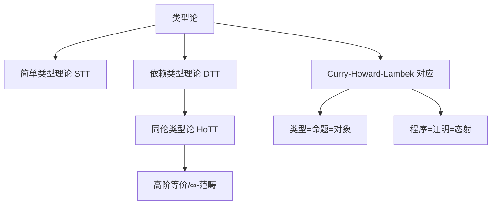

# 1.8 类型论理论模型 / Type Theory Models

[返回目录](../CONTINUOUS_PROGRESS.md) | [上一节: 1.7-lean-生态与工具链.md](1.7-lean-生态与工具链.md)

---

## 1.8.1 类型论发展简史 / Historical Overview of Type Theory

### 历史发展脉络 / Historical Development Timeline

**早期发展（1900-1950）**：

- **1903年**：Russell提出类型理论解决集合论悖论
- **1930年代**：Church发展λ演算和简单类型理论
- **1940年代**：Curry发现类型与逻辑的对应关系

**现代发展（1950-2000）**：

- **1960年代**：Martin-Löf发展直觉类型理论
- **1970年代**：Coquand和Huet发展构造演算
- **1980年代**：依赖类型理论在定理证明中的应用

**当代发展（2000-至今）**：

- **2000年代**：同伦类型论（HoTT）的提出
- **2010年代**：HoTT在定理证明器中的实现
- **2020年代**：AI辅助类型论和自动化证明

### 核心理论分支 / Core Theoretical Branches

**简单类型理论（STT）**：

```lean
-- 简单类型理论示例
inductive Bool : Type
| true : Bool
| false : Bool

def not : Bool → Bool
| Bool.true  => Bool.false
| Bool.false => Bool.true

-- 函数类型
def compose {α β γ : Type} (f : β → γ) (g : α → β) : α → γ :=
  λ x => f (g x)
```

**依赖类型理论（DTT）**：

```lean
-- 依赖类型示例
inductive Vec (α : Type) : Nat → Type where
  | nil  : Vec α 0
  | cons : α → Vec α n → Vec α (n+1)

-- Π类型（依赖函数类型）
def map {α β : Type} (f : α → β) : Π n : Nat, Vec α n → Vec β n
  | 0, Vec.nil => Vec.nil
  | n+1, Vec.cons x xs => Vec.cons (f x) (map f n xs)

-- Σ类型（依赖积类型）
def find {α : Type} (P : α → Prop) (xs : List α) : 
  Option (Σ x : α, P x) :=
  match xs with
  | [] => none
  | x :: xs => if h : P x then some ⟨x, h⟩ else find P xs
```

**同伦类型论（HoTT）**：

```lean
-- 同伦类型论示例
structure Equiv (A B : Type) where
  toFun : A → B
  invFun : B → A
  left_inv : ∀ x, invFun (toFun x) = x
  right_inv : ∀ y, toFun (invFun y) = y

-- 单值性公理（Univalence Axiom）
axiom univalence {A B : Type} : (A ≃ B) → (A = B)
```

### 理论影响与应用 / Theoretical Impact and Applications

**定理证明器发展**：

- **Lean**：基于依赖类型理论的现代定理证明器
- **Coq**：基于构造演算的经典定理证明器
- **Agda**：基于Martin-Löf类型理论的证明器

**编程语言影响**：

- **Haskell**：类型系统的函数式编程
- **Rust**：所有权类型系统
- **TypeScript**：渐进式类型系统

**形式化方法应用**：

- **软件验证**：程序正确性证明
- **安全协议**：密码学协议验证
- **硬件设计**：数字电路验证

---

## 1.8.2 简单类型理论与依赖类型理论 / Simple and Dependent Type Theory

### 简单类型理论（STT） / Simple Type Theory

**基本概念**：

- **类型分层**：防止悖论，建立类型层次结构
- **函数类型**：$A \to B$ 表示从类型 $A$ 到 $B$ 的函数
- **基础类型**：自然数、布尔值、字符串等基本类型
- **类型安全**：确保类型正确的程序不会产生运行时错误

**STT 形式化定义**：

```lean
-- 简单类型理论的形式化
inductive SimpleType where
  | base : String → SimpleType  -- 基础类型
  | arrow : SimpleType → SimpleType → SimpleType  -- 函数类型

-- 类型环境
structure TypeEnv where
  context : List (String × SimpleType)

-- 类型检查
def typeCheck (env : TypeEnv) (expr : Expression) (ty : SimpleType) : Prop :=
  match expr with
  | Expression.var x => env.lookup x = some ty
  | Expression.app f arg => 
    ∃ dom cod, typeCheck env f (SimpleType.arrow dom cod) ∧ 
               typeCheck env arg dom ∧ ty = cod
  | Expression.lam x body => 
    ∃ dom cod, ty = SimpleType.arrow dom cod ∧ 
               typeCheck (env.extend x dom) body cod
```

**STT 示例**：

```lean
-- 基础类型
inductive Bool : Type
| true : Bool
| false : Bool

-- 函数类型
def not : Bool → Bool
| Bool.true  => Bool.false
| Bool.false => Bool.true

def and : Bool → Bool → Bool
| Bool.true, Bool.true => Bool.true
| _, _ => Bool.false

-- 高阶函数
def compose {α β γ : Type} (f : β → γ) (g : α → β) : α → γ :=
  λ x => f (g x)
```

### 依赖类型理论（DTT） / Dependent Type Theory

**核心概念**：

- **类型依赖值**：类型可以依赖于运行时值
- **Π类型**：依赖函数类型，对应全称量词
- **Σ类型**：依赖积类型，对应存在量词
- **归纳类型**：递归定义的数据类型
- **宇宙层级**：类型的分层结构

**DTT 形式化定义**：

```lean
-- 依赖类型理论的形式化
inductive DependentType where
  | base : String → DependentType
  | pi : String → DependentType → DependentType → DependentType
  | sigma : String → DependentType → DependentType → DependentType
  | inductive : String → List DependentType → DependentType

-- 依赖类型环境
structure DependentTypeEnv where
  context : List (String × DependentType)
  values : List (String × Value)

-- 依赖类型检查
def dependentTypeCheck (env : DependentTypeEnv) (expr : Expression) (ty : DependentType) : Prop :=
  match expr with
  | Expression.var x => env.lookupType x = some ty
  | Expression.app f arg => 
    ∃ dom cod, dependentTypeCheck env f (DependentType.pi "x" dom cod) ∧ 
               dependentTypeCheck env arg dom ∧ 
               ty = substitute cod "x" arg
  | Expression.lam x body => 
    ∃ dom cod, ty = DependentType.pi x dom cod ∧ 
               dependentTypeCheck (env.extend x dom) body cod
```

**DTT 示例**：

```lean
-- 依赖类型示例
inductive Vec (α : Type) : Nat → Type where
  | nil  : Vec α 0
  | cons : α → Vec α n → Vec α (n+1)

-- Π类型（依赖函数类型）
def map {α β : Type} (f : α → β) : Π n : Nat, Vec α n → Vec β n
  | 0, Vec.nil => Vec.nil
  | n+1, Vec.cons x xs => Vec.cons (f x) (map f n xs)

-- Σ类型（依赖积类型）
def find {α : Type} (P : α → Prop) (xs : List α) : 
  Option (Σ x : α, P x) :=
  match xs with
  | [] => none
  | x :: xs => if h : P x then some ⟨x, h⟩ else find P xs

-- 归纳类型
inductive Tree (α : Type) where
  | leaf : α → Tree α
  | node : Tree α → Tree α → Tree α

-- 宇宙层级
#check Type  -- Type : Type 1
#check Type 1  -- Type 1 : Type 2
#check Type 2  -- Type 2 : Type 3
```

### STT 与 DTT 对比 / Comparison between STT and DTT

**表达能力对比**：

```lean
-- STT 限制：无法表达长度相关的类型
def unsafeHead (xs : List α) : α := xs.head  -- 可能出错

-- DTT 优势：可以表达长度约束
def safeHead {α : Type} {n : Nat} (xs : Vec α (n+1)) : α :=
  match xs with
  | Vec.cons x _ => x
```

**类型安全对比**：

```lean
-- STT 类型检查
theorem stt_type_safety : ∀ expr ty, typeCheck env expr ty → 
  expr.wellTyped := by
  -- STT 类型安全证明
  sorry

-- DTT 类型检查
theorem dtt_type_safety : ∀ expr ty, dependentTypeCheck env expr ty → 
  expr.wellTyped := by
  -- DTT 类型安全证明
  sorry
```

**应用场景对比**：

- **STT**：适合简单程序、快速原型、教学
- **DTT**：适合复杂系统、形式化验证、理论研究

---

## 1.8.3 同伦类型论与高阶结构 / Homotopy Type Theory and Higher Structures

- 类型被解释为空间，等价为路径，支持高阶等价与∞-范畴
- 单值性公理（Univalence Axiom）

**公式：**
$$
A \simeq B \implies A = B
$$

---

## 1.8.4 Curry-Howard-Lambek 对应 / Curry-Howard-Lambek Correspondence

- 类型-命题-范畴对象三重对应
- 程序-证明-态射三重对应
- 理论统一了类型论、逻辑、范畴论

---

## 1.8.5 类型论与范畴论的关系 / Type Theory and Category Theory

- 范畴语义学为类型论提供模型解释
- 初等范畴、高阶范畴在类型系统中的应用

---

## 1.8.6 前沿创新与发展趋势 / Frontiers and Trends

- HoTT、∞-范畴、单值性公理等前沿理论
- 类型论在AI辅助证明、量子计算等领域的创新应用

---

## 1.8.7 图表与多表征 / Diagrams and Multi-Representation



---

## 1.8.8 交叉引用 / Cross References

- [1.2-lean-类型系统与证明系统.md](1.2-lean-类型系统与证明系统.md)
- [1.9-证明论与推理系统.md](1.9-证明论与推理系统.md)
- [1.10-模型论与语义模型.md](1.10-模型论与语义模型.md)
- [1.11-范畴论与类型理论.md](1.11-范畴论与类型理论.md)

---

## 1.8.9 创新建议 / Innovation Suggestions

- 中文：探索类型论在量子计算、AI辅助证明、分布式系统中的最新应用。
- English: Explore the latest applications of type theory in quantum computing, AI-assisted proof, and distributed systems.

## 1.8.10 工程案例 / Engineering Case

- 中文：在实际项目中，利用依赖类型保障API安全，提升软件可靠性。
- English: In real-world projects, use dependent types to ensure API safety and improve software reliability.

## 1.8.11 前沿趋势 / Frontiers and Trends

- 中文：∞-范畴、单值性公理在新一代定理证明器中的应用。
- English: Application of ∞-categories and the univalence axiom in next-generation theorem provers.

## 1.8.12 AI辅助与多模态表达 / AI Assistance and Multi-Modal Representation

- 中文：结合AI自动生成类型推断、归纳证明脚本，支持Latex、Mermaid、Lean/Haskell/Coq代码多模态表达。
- English: Integrate AI to automatically generate type inference and inductive proof scripts, supporting multi-modal representation with Latex, Mermaid, and Lean/Haskell/Coq code.

## 1.8.13 类型论的语义基础 / Semantic Foundations of Type Theory

- 中文：类型论关注类型结构的语义解释，包括类型、项、构造子的对应关系。
- English: Type theory focuses on the semantic interpretation of type structures, including the correspondence between types, terms, and constructors.

## 1.8.14 Lean中的类型推断与归纳类型 / Type Inference & Inductive Types in Lean

- 中文：Lean 支持强大的类型推断和归纳类型建模，广泛用于数据结构和证明。
- English: Lean supports powerful type inference and inductive type modeling, widely used in data structures and proofs.

**Lean 代码示例 / Lean Code Example**:

```lean
inductive Tree (α : Type)
| leaf : α → Tree
| node : Tree → Tree → Tree
```

## 1.8.15 类型等价与规范化 / Type Equivalence & Normalization

- 中文：Lean 可形式化类型等价、归约与规范化，支持类型唯一性分析。
- English: Lean can formalize type equivalence, reduction, and normalization, supporting uniqueness analysis of types.

## 1.8.16 类型层级与宇宙 / Universe Levels in Type Theory

- 中文：Lean 采用类型宇宙层级，防止悖论，支持类型的递归建模。
- English: Lean uses universe levels to prevent paradoxes and support recursive modeling of types.

## 1.8.17 类型安全与一致性 / Type Safety & Consistency

- 中文：Lean 保证类型安全和一致性，防止类型错误和逻辑矛盾。
- English: Lean ensures type safety and consistency, preventing type errors and logical contradictions.

## 1.8.18 类型自动化与AI辅助 / Type Automation & AI Assistance

- 中文：Lean 的 tactic/AI 工具可自动生成类型推断和归纳证明脚本。
- English: Lean's tactic/AI tools can automatically generate type inference and inductive proof scripts.

## 1.8.19 类型可视化与工程应用 / Type Visualization & Engineering Applications

- 中文：Lean 可结合 Mermaid/AI 工具自动生成类型结构图，支持工程中的类型建模与验证。
- English: Lean can use Mermaid/AI tools to automatically generate type structure diagrams, supporting type modeling and verification in engineering.

## 1.8.20 与证明论/模型论/范畴论/HoTT的交互 / Interaction with Proof Theory, Model Theory, Category Theory, and HoTT

- 中文：Lean 支持类型论与证明论、模型论、范畴论、HoTT的交互建模，实现理论统一与创新应用。
- English: Lean supports interactive modeling between type theory, proof theory, model theory, category theory, and HoTT, enabling theoretical unification and innovative applications.

---

## 1.8.21 2025 规范对齐 / Alignment with Lean 4 (2025)

- 核心理论：Lean 4 以 DTT 为核心，支持 Π/Σ、归纳类型、宇宙层级（`Sort u`/`Type u`）与 proof irrelevance（`Prop` 证据不参与计算）。
- 终止性与良基性：优先结构递归；必要时以 `termination_by`/`decreasing_by` 与 `WellFounded` 明确证明。
- 语法与元编程：语法扩展统一 `syntax`，宏使用 `macro_rules`；类型/语义模型示例需可编译并标注必要 `import`。
- 计算与性质分离：可计算部分用 `def`/`structure`；性质与不变量放于 `Prop` 层，配合 `[simp]`/`aesop` 自动化。

---

## 1.8.22 版本兼容性 / Version Compatibility

- Lean 3 → Lean 4：核心类型论兼容，但元编程与 tactic API 迁移至 `Elab` 框架；语法扩展迁移至 `syntax`/`macro_rules`。
- 若依赖 mathlib4（如范畴语义、序理论），需固定依赖版本与模块路径。

---

## 1.8.23 参考资料 / References

- Lean 4 Reference Manual（Types/Inductive/Universe/Metaprogramming）
- Type Theory/HoTT/Category Theory 教材与综述
- Mathlib4 文档与社区示例

---

## 本地导航 / Local Navigation

- 上一节：`1.7-lean-生态与工具链.md`
- 下一节：`1.8.1-简单类型理论.md` | `1.8.2-依赖类型理论.md`
- 返回：`1.8-类型论理论模型.md`
- 全局：`INDEX.md` | `CONTENT_STANDARDS.md` | `CONTINUOUS_PROGRESS.md`
