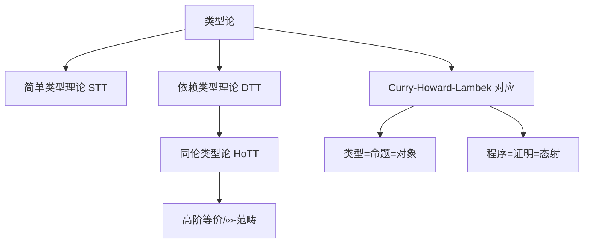

# 1.8 类型论理论模型 / Type Theory Models

[返回目录](../CONTINUOUS_PROGRESS.md) | [上一节: 1.7-lean-生态与工具链.md](1.7-lean-生态与工具链.md)

---

## 1.8.1 类型论发展简史 / Historical Overview of Type Theory

- 20世纪初为解决悖论提出类型理论（Russell, Church）
- 简单类型理论（STT）、依赖类型理论（DTT）、同伦类型论（HoTT）等分支
- 类型论成为现代定理证明器（Lean、Coq、Agda）的理论基础

---

## 1.8.2 简单类型理论与依赖类型理论 / Simple and Dependent Type Theory

### 简单类型理论（STT）

- 类型分层，防止悖论，支持函数类型、基础类型
- $A \to B$ 表示从类型 $A$ 到 $B$ 的函数

### 依赖类型理论（DTT）

- 类型依赖于值，支持 $\Pi$-类型、$\Sigma$-类型、归纳类型、宇宙层级

**Lean 代码示例：**

```lean
-- 简单类型定义
inductive Bool : Type
| true : Bool
| false : Bool

def not : Bool → Bool
| Bool.true  => Bool.false
| Bool.false => Bool.true

-- 依赖类型示例
inductive Vec (α : Type) : Nat → Type where
  | nil  : Vec α 0
  | cons : α → Vec α n → Vec α (n+1)
```

---

## 1.8.3 同伦类型论与高阶结构 / Homotopy Type Theory and Higher Structures

- 类型被解释为空间，等价为路径，支持高阶等价与∞-范畴
- 单值性公理（Univalence Axiom）

**公式：**
$$
A \simeq B \implies A = B
$$

---

## 1.8.4 Curry-Howard-Lambek 对应 / Curry-Howard-Lambek Correspondence

- 类型-命题-范畴对象三重对应
- 程序-证明-态射三重对应
- 理论统一了类型论、逻辑、范畴论

---

## 1.8.5 类型论与范畴论的关系 / Type Theory and Category Theory

- 范畴语义学为类型论提供模型解释
- 初等范畴、高阶范畴在类型系统中的应用

---

## 1.8.6 前沿创新与发展趋势 / Frontiers and Trends

- HoTT、∞-范畴、单值性公理等前沿理论
- 类型论在AI辅助证明、量子计算等领域的创新应用

---

## 1.8.7 图表与多表征 / Diagrams and Multi-Representation



---

## 1.8.8 交叉引用 / Cross References

- [1.2-lean-类型系统与证明系统.md](1.2-lean-类型系统与证明系统.md)
- [1.9-证明论与推理系统.md](1.9-证明论与推理系统.md)
- [1.10-模型论与语义模型.md](1.10-模型论与语义模型.md)
- [1.11-范畴论与类型理论.md](1.11-范畴论与类型理论.md)

---

## 1.8.9 创新建议 / Innovation Suggestions

- 中文：探索类型论在量子计算、AI辅助证明、分布式系统中的最新应用。
- English: Explore the latest applications of type theory in quantum computing, AI-assisted proof, and distributed systems.

## 1.8.10 工程案例 / Engineering Case

- 中文：在实际项目中，利用依赖类型保障API安全，提升软件可靠性。
- English: In real-world projects, use dependent types to ensure API safety and improve software reliability.

## 1.8.11 前沿趋势 / Frontiers and Trends

- 中文：∞-范畴、单值性公理在新一代定理证明器中的应用。
- English: Application of ∞-categories and the univalence axiom in next-generation theorem provers.

## 1.8.12 AI辅助与多模态表达 / AI Assistance and Multi-Modal Representation

- 中文：结合AI自动生成类型推断、归纳证明脚本，支持Latex、Mermaid、Lean/Haskell/Coq代码多模态表达。
- English: Integrate AI to automatically generate type inference and inductive proof scripts, supporting multi-modal representation with Latex, Mermaid, and Lean/Haskell/Coq code.
