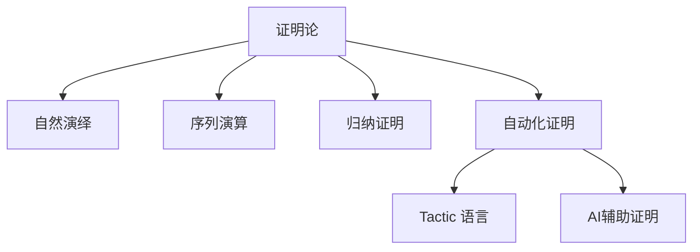

# 1.9 证明论与推理系统 / Proof Theory and Reasoning Systems

[返回目录](../CONTINUOUS_PROGRESS.md) | [上一节: 1.8-类型论理论模型.md](1.8-类型论理论模型.md)

---

## 1.9.1 证明论发展简史 / Historical Overview of Proof Theory

- 20世纪初由Hilbert等提出，研究形式系统中的证明结构与推理规则
- 发展出自然演绎、序列演算、归纳证明等多种体系
- 证明论成为现代定理证明器（Lean、Coq、Agda）的理论支柱

---

## 1.9.2 自然演绎与序列演算 / Natural Deduction and Sequent Calculus

### 自然演绎（Natural Deduction）

- 以引入/消解规则模拟人类直觉推理
- 证明树结构

### 序列演算（Sequent Calculus）

- 采用序列（$\Gamma \vdash \Delta$）表示推理状态
- 强调结构规则和归约过程

**Lean 代码示例：**

```lean
lemma imp_trans (A B C : Prop) : (A → B) → (B → C) → (A → C) :=
  λ h₁ h₂ a => h₂ (h₁ a)

structure Sequent (Γ Δ : List Prop) :=
  (left : List Prop)
  (right : List Prop)
```

---

## 1.9.3 归纳证明与递归原理 / Inductive Proofs and Recursion Principle

- 数学归纳法、结构归纳法广泛用于自然数、数据结构等的性质证明
- Lean 支持递归定义与归纳证明

**Lean 代码示例：**

```lean
lemma add_zero (n : Nat) : n + 0 = n :=
  Nat.recOn n rfl (λ n ih => congrArg Nat.succ ih)
```

---

## 1.9.4 自动化证明与策略 / Automated Proofs and Tactics

- Lean 的 tactic 语言支持自动化证明、归纳、化简、搜索等
- 用户可自定义 tactic 组合，实现高效证明

**Lean 代码示例：**

```lean
example (a b : Nat) : a + b = b + a :=
  by simp [Nat.add_comm]
```

---

## 1.9.5 Lean中的证明系统与创新 / Proof Systems and Innovations in Lean

- 支持自然演绎、序列演算、归纳证明、自动化策略等多种体系
- AI辅助证明、可解释性证明、证明可视化等前沿方向
- 与Coq、Agda等系统的证明机制对比

---

## 1.9.6 图表与多表征 / Diagrams and Multi-Representation



---

## 1.9.7 交叉引用 / Cross References

- [1.2-lean-类型系统与证明系统.md](1.2-lean-类型系统与证明系统.md)
- [1.8-类型论理论模型.md](1.8-类型论理论模型.md)
- [1.10-模型论与语义模型.md](1.10-模型论与语义模型.md)
